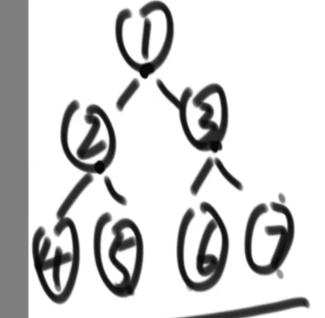
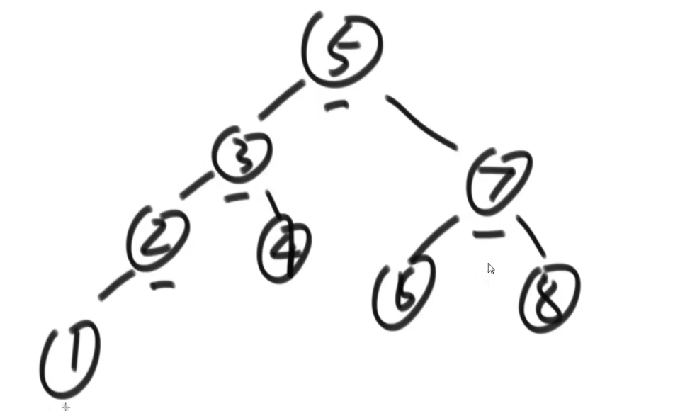
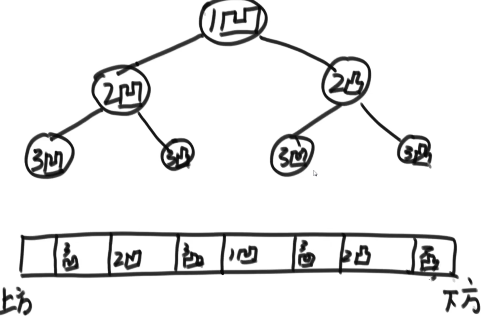

### 一、二叉树的三种递归遍历

二叉树的递归遍历中，每一个节点都会被访问3次，以下面例子说明：



上述的二叉树，如果采用递归遍历的方式，那么节点访问的顺序将为：

1,2,4,4,4,2,5,5,5,2,1,3,6,6,6,3,7,7,7,3,1

所谓的三种递归遍历方式是指：打印节点数值的时机不同。

1. 如果在节点第一次被访问时进行打印，那么成为先序遍历(根、左、右)。上述例子最后输出的结果就为：1,2,4,5,3,6,7
2. 如果在节点第二次被访问时进行打印，那么成为中序遍历（左、根、右）。上述例子最后输出的结果就为：4,2,5,1,6,3,7
3. 如果在节点第三次被访问时进行打印，那么成为后序遍历（左、右、根）。上述例子最后输出的结果就为：4,5,2,6,7,3,1

```go
package binaryTree

import "fmt"

func PreOrderTraversal(tree *Tree) {
	root := tree.Root
	preOrderTraversal(root)
}

func preOrderTraversal(node *Node) {
	if node == nil { // 重要：这个是边界条件
		return
	} else {
		fmt.Printf("%d ", node.Data)  // 第一次访问当前节点时打印
		preOrderTraversal(node.Left)  // 左递归函数返回当前节点时就意味着第二次访问当前节点
		preOrderTraversal(node.Right) // 右递归函数返回当前节点时就意味着第三次访问当前节点
	}

}

func InOrderTraversal(tree *Tree) {
	root := tree.Root
	inOrderTraversal(root)
}

func inOrderTraversal(node *Node) {
	if node == nil {
		return
	} else {
		inOrderTraversal(node.Left)
		fmt.Printf("%d ", node.Data) // 第二次访问当前节点时打印
		inOrderTraversal(node.Right)
	}

}

func PostOrderTraversal(tree *Tree) {
	root := tree.Root
	postOrderTraversal(root)
}

func postOrderTraversal(node *Node) {
	if node == nil {
		return
	} else {
		postOrderTraversal(node.Left)
		postOrderTraversal(node.Right)
		fmt.Printf("%d ", node.Data) // 第三次访问当前节点时打印
	}

}
```

### 二、二叉树的三种非递归遍历

#### 2.1 先序遍历

1. 准备一个栈，栈大小为3即可（容得下当前节点和左右孩子两个节点）
2. 先将二叉树的根节点入栈
3. 从栈中弹出一个节点
4. 打印该节点元素
5. 针对该弹出节点，先压入右孩子节点，再压入左孩子结点
6. 从第三步开始重复，直到栈无数可放。

#### 2.2 中序遍历

1. 准备一个栈，栈大小为二叉树深度
2. 根节点入栈
3. 不断让当前节点的左孩子结点入栈。直到没有左孩子，弹出最新的节点
4. 打印弹出节点的数值
5. 将该弹出节点的右子树（右子树根节点也要进栈）采取从步骤2开始的相同策略...

#### 2.3 后序遍历

1. 准备两个栈，栈1和栈2，栈1大小为二叉树深度，栈2大小必须等于二叉树节点个数
2. 先将二叉树根节点入栈1
3. 从栈1中弹出一个节点，将其存入栈2
4. 针对上述弹出节点，栈1中先压入左孩子结点，再压入右孩子节点
5. 从第三步开始重复，直到栈1无数可放。
6. 将栈2收集到的所有节点依次出栈，打印数值，可以得到后序遍历的二叉树

```go
package binaryTree

import (
	"DataStructure/08.linkList"
	"fmt"
)

func PreOrderNoRecursive(tree *Tree) {
	stack := linkList.NewStack() // 创建一个栈
	stack.Push(tree.Root)

	for {
		if stack.Len == 0 { // 栈中再无节点，这意味遍历结束
			return
		}
		data := stack.Pop() // 子树的根节点出栈，并打印内容
		node := data.(*Node)
		fmt.Printf("%d ", node.Data)
		if node.Right != nil { // 先让右孩子进栈
			stack.Push(node.Right)
		}
		if node.Left != nil { // 再让左孩子出现
			stack.Push(node.Left)
		}
	}
}

func InOrderNoRecursive(tree *Tree) {
	stack := linkList.NewStack() // 创建一个栈
	stack.Push(tree.Root)

	current := tree.Root
	iterationLeftPush(current, stack) // 第一个循环，不断将当前节点的左孩子节点入栈，直到没有左孩子
	for {
		if stack.Len == 0 {
			break
		}
		data := stack.Pop()
		node := data.(*Node)
		fmt.Printf("%d ", node.Data) // 打印这个出栈的节点
		if node.Right != nil {       // 如果当前被弹出节点有右孩子，则采取同样的措施(子树的左孩子节点不断入栈)
			stack.Push(node.Right) // 右孩子先进栈
			iterationLeftPush(node.Right, stack)
		}
	}
}

// 从当前子树根节点开始，不断让左孩子节点入栈
func iterationLeftPush(root *Node, stack *linkList.Stack) {
	current := root
	for {
		if current.Left == nil {
			return
		}
		current = current.Left
		stack.Push(current)
	}
}

func PostOrderNoRecursive(tree *Tree) {
	stack1 := linkList.NewStack()
	stack2 := linkList.NewStack()

	stack1.Push(tree.Root)
	for { // 第一个循环，让所有节点按照后序遍历顺序存入到栈2中(根节点再栈2的最下层)
		if stack1.Len == 0 {
			break
		}
		data := stack1.Pop() // 从栈1弹出的元素存到栈2中
		node := data.(*Node)
		stack2.Push(node)

		if node.Left != nil { // 先让左孩子进栈
			stack1.Push(node.Left)
		}
		if node.Right != nil { // 再让右孩子进栈
			stack1.Push(node.Right)
		}
	}

	for { // 第二个循环，打印后序遍历
		if stack2.Len == 0 {
			break
		}
		data := stack2.Pop()
		node := data.(*Node)
		fmt.Printf("%d ", node.Data) // 打印这个出栈的节点
	}

}
```


### 三、二叉树的深度、广度优先遍历算法

#### 2.1 深度优先遍历

​	二叉树的深度优先遍历 其实就是 先序遍历

#### 2.2 广度优先遍历

​	二叉树的广度优先遍历算法，通过队列来实现：

1. 从根节点开始，将根节点入队列
2. 从队列中取出一个节点，打印其数值。接着先后将该节点的左孩子、右孩子节点入队列。
3. 不断重复步骤2，直到队列为空没有数可取

```go
package binaryTree

import (
	"fmt"
)

func BinaryTreeDFS(tree *Tree) {
	PreOrderTraversal(tree) // 二叉树的深度优先遍历就是先序遍历
}

type Queue struct {
	Items []interface{}
	Len   int
}

func NewQueue() *Queue {

	return &Queue{
		Items: make([]interface{}, 0),
		Len:   0,
	}
}

func (q *Queue) Push(data interface{}) {
	q.Items = append(q.Items, data)
	q.Len++
}

func (q *Queue) Pop() interface{} {
	data := q.Items[0]
	q.Items = q.Items[1:] // 删除出队列的元素
	q.Len--
	return data
}

func BinaryTreeBFS(tree *Tree) {
	queue := NewQueue()

	queue.Push(tree.Root)
	for {
		if queue.Len == 0 {
			return
		}
		data := queue.Pop()
		node := data.(*Node)

		fmt.Printf("%d ", node.Data)
		if node.Left != nil {
			queue.Push(node.Left)
		}
		if node.Right != nil {
			queue.Push(node.Right)
		}
		//用来生成一颗非完全二叉树(非平衡二叉树)
		//if queue.Len == 0 {
		//	temp := new(Node)
		//	temp.Data = 11
		//	node.Left = temp
		//}
	}
}
```

### 四、获取二叉树的最大宽度

​	需要对二叉树的广度优先遍历算法进行修改：

1. 需要一个`hashMap`来记录每个节点所在的层数，对于根节点可以在算法之初进行添加，对于其他节点需要在将其放入队列之前进行记录
2. 需要一个变量`curLevel`来记录当前正在遍历的层数（初始值为1），另一个变量`curLevelNodes`来记录当前层数的节点数（初始值为0），最后一个变量`max`来存储最大宽度
3. 每次从队列中取出一个节点时：根据`hashMap`记录的出队列节点的层数，将其与`curLevel`进行比较，若相等则`curLevelNodes`++；若不相等意味着当前层数所有节点已经遍历完毕，刚才出队列的是下一层的节点，因此更新`max`，同时`curLevel++`，`curLevelNodes = 1`

不借助`hashMap`的求解法：

1. 需要准备以下额外空间：一个队列、一个`Node`类型指针`CurEnd`、一个`Node`类型指针`NextEnd`、一个`int`型变量`curLevelNode`、一个`int`型变量`max`
2. 从根节点开始，将根节点添加到队列中。`CurEnd`初始化为根节点，`NextEnd`初始化为根节点
3. 根节点出队列，先左孩子入队列，再右孩子入队列。`NextEnd`总是指向刚进入队列的节点（最后指向右孩子），因为根节点出队列，因此其所在层数节点数目统计量`curLevelNode++`。同时因为根节点已经是其所在层数的最后一个节点（这一点由`CurEnd`记录着），因此（更新max）让 `max = max(max,curLevelNode)`。同时（更新`CurEnd`）让`CurEnd` = `NextEnd`
4. 每一次都出队列一个元素，直到队列为空之前不断重复步骤3

```go
方法一：哈希表
package binaryTree

func GetBinaryTreeMaxWidth(tree *Tree) int {
	hashMap := make(map[*Node]int) // 记录每个节点在第几层

	queue := NewQueue()
	queue.Push(tree.Root)
	hashMap[tree.Root] = 1

	currentLevel := 1   // 循环变量，当前所在层数(1~n)
	curLevelNode := 0   // 循环变量，当前层的节点数
	max := curLevelNode // 最大宽度

	for {
		if queue.Len == 0 {
			max = getMax(max, curLevelNode)
			break
		}
		data := queue.Pop()
		node := data.(*Node)

		if hashMap[node] != currentLevel { // 弹出的节点在下一层
			max = getMax(max, curLevelNode) // 更新最大宽度(总结上一层的节点数)
			currentLevel++                  // 层数++
			curLevelNode = 1
		} else { // 弹出的节点还在当前层
			curLevelNode++
		}

		if node.Left != nil {
			queue.Push(node.Left)
			hashMap[node.Left] = currentLevel + 1 // 孩子节点肯定在下一层
		}
		if node.Right != nil {
			queue.Push(node.Right)
			hashMap[node.Right] = currentLevel + 1 // 孩子节点肯定在下一层
		}
	}

	return max
}

func getMax(a, b int) int {
	if a > b {
		return a
	} else {
		return b
	}
}

方法二：改进版
package binaryTree

func GetBinaryTreeMaxWidthImproved(tree *Tree) int {

	queue := NewQueue()
	queue.Push(tree.Root)
	curEnd := tree.Root  // 记录当前层的最后一个节点
	nextEnd := tree.Root // 记录下一层的最后一个节点

	curLevelNode := 0   // 循环变量，当前层的节点数
	max := curLevelNode // 最大宽度

	for {
		if queue.Len == 0 {
			return max
		}
		data := queue.Pop()
		node := data.(*Node)

		if node.Left != nil {
			queue.Push(node.Left)
			nextEnd = node.Left
		}
		if node.Right != nil {
			queue.Push(node.Right)
			nextEnd = node.Right
		}
		if node == curEnd {
			curLevelNode++
			max = getMax(max, curLevelNode)
			curEnd = nextEnd
			curLevelNode = 0
		} else {
			curLevelNode++
		}
	}
}
```

### 五、如何判断一颗二叉树是否为搜索二叉树

搜索二叉树是指：对于任何一颗子树来说，都满足 左子树所有节点的数值 < 根节点数值 < 右子树所有节点的数值。如下：



思路：

>  采用中序遍历打印整颗二叉树，如果在打印过程中一直是升序那么肯定是搜索二叉树，一旦出现降序那必然不是搜索二叉树。
>
> 上述例子二叉树，打印结果是：1、2、3、4、5、6、7、8

#### 5.1 算法实现一：

```go
var preValue int = MIN_VAlue   // 记录上次应打印的节点数值

func checkBST(head Node) bool {
    if head == nil {
        return true
    }
    isLeftBST := checkBST(head.Left)  // 判断左子树是否为搜索二叉树
    if !isLeftBST {
        return false
    }
    // 中间(第二次访问节点时)进行数据判断
    if head.value <= preValue {   // 必须是升序
        return false
    } else {
        preValue = head.Value
    }
    return checkBST(head.right)  // 判断右子树是否为搜索二叉树
}
```

比较过程可以分为两步：

- 第一步：判断`左子树所有节点的数值 < 根节点数值`

```go
isLeftBST := checkBST(head.Left)  // 判断左子树是否为搜索二叉树
if !isLeftBST {
    return false
}

if head.value <= preValue {   
    return false
} else {
    preValue = head.Value
}
```

第一步判断中，`preValue`存储的是其左子树根节点右孩子节点的数值，因此需要保证 当前节点 `head.Value > preValue`才能保证 `左子树所有节点的数值 < 根节点数值`。


- 第二步：判断`根节点数值 < 右子树所有节点的数值`

```go
return checkBST(head.right)
```

这一步其实包含两次判断:

​			第一次判断：`preValue`保存的是当前子树根节点的数值，因此下述的代码完成`根节点数值 < 右子树的左子树所有节点数值` :

```go
isLeftBST := checkBST(head.Left)  // 判断左子树是否为搜索二叉树
if !isLeftBST {
    return false
}

if head.value <= preValue {   
    return false
} else {
    preValue = head.Value
}
```

​			第二次判断：完成当前右子树内部的 ： `根节点数值 < 右子树的右子树所有节点的数值`

```go
return checkBST(head.right)
```

#### 5.2 算法实现二

​	更简单的方式：

​	准备一个额外的数组，采用中序遍历的方式输出二叉树，输出的结构存入数组中。对数组进行遍历，确保数组是升序结构。

```go
package binaryTree

var PreValue interface{} // 初始要设置为math.MinInt，也就是要小于BST最小节点的数值

func CheckBST(root *Node) bool {
	if root == nil { // 边界条件。当前子树为空，返回true
		return true
	}
	leftBST := CheckBST(root.Left) // 检查左子树是否是BST
	if !leftBST {
		return false
	}
	// 确保当前子树根节点大于左子树的最右侧节点（PreValue保存）
	currentData := root.Data.(int)
	preData := PreValue.(int)
	if currentData < preData {
		return false
	} else {
		PreValue = root.Data // 确保成功，更新PreValue为当前子树根节点值，以便与右子树的最左节点进行比较
	}
	return CheckBST(root.Right) // 检查右子树是否是BST,以及右子树的最左侧节点是否大于子树的根节点
}
```

### 六、判断一个二叉树是否是完全二叉树

完全二叉树是指，对于任意一个节点：

1. 如果有右孩子节点就必须有左孩子结点。
2. 如果在遍历过程中，出现了一个只有左孩子但没有右孩子的节点，那么这个节点往后的所有节点都必须是叶子结点(因为他们不可能有孩子节点)。

因此对于此问题的思路也比较明确：

> 采用层序遍历算法(广度优先遍历)来遍历整颗二叉树。
>
> 1.如果发现一个节点只有右孩子节点但没有左孩子节点，直接返回false。
>
> 2.设置一个开关变量，在遇到第一个只有左孩子但没有右孩子的节点之前一直是false，遇到之后变为true。在开关变量等于true的情况下，如果访问的节点不是叶子结点（左右孩子皆为nil）则返回false。

```go
package binaryTree

func CheckCBT(tree *Tree) bool {
	lastNonLeaf := false // 如果当前节点为最后一个非叶子结点，此变量变为true

	queue := NewQueue()
	queue.Push(tree.Root)

	for {
		if queue.Len == 0 { // 整颗二叉树都已经完成遍历，依然没有出现任何问题。则必然是完全二叉树
			return true
		}
		data := queue.Pop()
		node := data.(*Node)

		if node.Left == nil && node.Right != nil { // 如果一个节点只有右孩子，没有左孩子。必然不是完全二叉树
			return false
		}
		if lastNonLeaf { // 在前一个节点是最后一个非叶子节点的前提之下，依然拥有左孩子节点。必然不是完全二叉树
			if node.Left != nil {
				return false
			}
		}
		if node.Left != nil && node.Right == nil { // 判断当前节点是否是最后一个非叶子结点
			lastNonLeaf = true
		}
		if node.Left != nil {
			queue.Push(node.Left)
		}
		if node.Right != nil {
			queue.Push(node.Right)
		}

	}
}
```

### 七、判断一棵树是否是满二叉树

一颗二叉树的最大深度为L，节点数为N，如果满足以下条件则为满二叉树：

```
N = 2^L - 1
```

因此解决的思路就是：进行依次完整的遍历，统计出N和L，看两者是否满足上述公式即可。

```go
package binaryTree

import "math"

type Info struct {
	currentHeight  int
	currentNodeNum int
}

func CheckFBT(tree *Tree) bool {
	info := checkFBT(tree.Root)
	if info.currentNodeNum == int(math.Pow(2, float64(info.currentHeight)))-1 {
		return true
	} else {
		return false
	}
}

func checkFBT(root *Node) *Info {
	if root == nil {
		return &Info{0, 0}
	}

	leftInfo := checkFBT(root.Left)   // 左子树的层数和节点数
	rightInfo := checkFBT(root.Right) // 右子树的层数和节点数

	currentInfo := new(Info)                                                                // 记录当前子树的层数和节点数
	currentInfo.currentHeight = getMax(leftInfo.currentHeight, rightInfo.currentHeight) + 1 // 加上当前根节点所在层
	currentInfo.currentNodeNum = leftInfo.currentNodeNum + rightInfo.currentNodeNum + 1     // 左子树节点+右子树节点+当前根节点

	return currentInfo
}
```


### 八、判断一颗树是否为平衡二叉树

平衡二叉树是指，对于一颗二叉树的任意一颗子树都满足：       左子树高度与右子树高度之差不得超过1

> 思路：
>
> 采用递归的方式：如果一个二叉树为平衡二叉树，那么他的左子树和右子树都必须是平衡二叉树。同时左右子树高度之差不能超过1。

代码如下：

```go
package binaryTree

import "math"

type AVLInfo struct {
	IsBalance bool // 是否平衡
	Height    int  // 当前子树高度
}

func CheckAVL(tree *Tree) bool {
	info := checkAVL(tree.Root)
	return info.IsBalance
}

func checkAVL(root *Node) *AVLInfo {
	if root == nil {
		return &AVLInfo{true, 0}
	}

	leftInfo := checkAVL(root.Left)   // 递归左子树
	rightInfo := checkAVL(root.Right) // 递归右子树

	currentInfo := new(AVLInfo)
	currentInfo.Height = getMax(leftInfo.Height, rightInfo.Height) + 1
	if leftInfo.IsBalance && rightInfo.IsBalance && math.Abs(float64(leftInfo.Height-rightInfo.Height)) <= 1 {
		currentInfo.IsBalance = true
	} else {
		currentInfo.IsBalance = false
	}
	return currentInfo
}
```

#### 8.1 采用同样的递归思想解决搜索二叉树问题

如果采用递归的方法，要解决的问题如下：

1. 当前节点的左子树是搜索二叉树
2. 当前节点的右子树是搜索二叉树
3. 左子树的最大值 < 当前节点的值 
4. 当前节点的值 < 右子树的最小值

因为递归问题返回值都必须是一样的，因此递归函数必须有三个返回值：是否为搜索二叉树的标志位、当前子树的最大值、当前子树的最小值。

```go
type Data struct {
    IsBST bool
    Min int
    Max int
}


func process(node Node) Data {
    if (x == nil) {
        return nil
    }
    // 从左子树获取信息
    leftData := process(node.left)
    // 从右子树获取信息
    rightData := process(node.right)
    
    // 当前根节点的初始信息
    min := node.value
    max := node.value
    isBST := true
    
    // 根据左右子树更新当前节点信息
    if (leftData != nil && (!leftData.IsBST || leftData.Max >= node.value)) {
        isBST = false
    }
    if (rightData != nil && (!rightData.IsBST || rightData.Min <= node.value)) {
        isBST = false
    }
    
    if (leftData!=nil){
        max = math.Max(max,leftData.Max)
        min = math.Min(min,leftData.Min)
    }
    if (rightData!=nil){
        max = math.Max(max,rightData.Max)
        min = math.Min(min,rightData.Min)
    }
    
    returnData := new(Data)
    returnData.IsBST = isBST
    returnData.Max = max
    returnData.Min = min
    
    return returnData
}
```

#### 8.2 递归思想与二叉树问题

​	二叉树问题中，所有的DP问题（动态规划问题）都是可以通过上述的递归思想去解决的。

```go
package binaryTree

import "math"

type BSTInfo struct {
	IsBST bool
	Max   int
	Min   int
}

func CheckBSTByDP(tree *Tree) bool {
	info := checkBSTByDP(tree.Root)
	return info.IsBST
}

func checkBSTByDP(root *Node) *BSTInfo {
	if root == nil {
		return &BSTInfo{true, math.MinInt, math.MinInt} // 重要：这里将min设置为math.MinInt其实是不合适的，因为对于叶子节点会直接出现 根节点 < 右子树.Min
	}
	leftInfo := checkBSTByDP(root.Left)
	rightInfo := checkBSTByDP(root.Right)

	greatLeft := leftInfo.Max <= root.Data.(int)  // 根节点是否大于左子树全部节点
	lessRight := root.Data.(int) <= rightInfo.Min // 根节点是否小于右子树全部节点

	if leftInfo.Max == math.MinInt { // 说明没有左孩子结点
		greatLeft = true
		leftInfo.Min = root.Data.(int)
		leftInfo.Max = root.Data.(int)
	}

	if rightInfo.Min == math.MinInt { // 重要：说明没有右孩子节点（此步非常关键，用来弥补root == nil时，Min被设置成math.MinInt的缺陷）
		lessRight = true
		rightInfo.Min = root.Data.(int)
		rightInfo.Max = root.Data.(int)
	}

	currentInfo := new(BSTInfo)
	if leftInfo.IsBST && rightInfo.IsBST && greatLeft && lessRight {
		currentInfo.IsBST = true
	} else {
		currentInfo.IsBST = false
	}
	currentInfo.Max = getMax(getMax(leftInfo.Max, rightInfo.Max), root.Data.(int))
	currentInfo.Min = getMin(getMin(leftInfo.Min, rightInfo.Min), root.Data.(int))

	return currentInfo
}

func getMin(a, b int) int {
	if a > b {
		return b
	} else {
		return a
	}
}
```


### 九、在一棵二叉树中查询任意两个节点的最小公共祖先

​	最小公共祖先其实就是两个节点向上追随过程中最先相遇的节点。

#### 9.1 借助`HashMap`实现

> 思路：
>
> 1. 用一个`HashMap`记录每个节点的父节点(key -> 节点本身；value -> 父节点)
> 2. 特别的，让根节点的父节点就是其本身
> 3. 再准备一个`HashSet`，记录其中一个节点从本身到根节点追溯过程中的全部节点
> 4. 选中其中一个对象节点，比如o1。从o1开始，不断向上追溯，将追溯过程返回的节点添加到`HashSet`中进行记录，直到节点的父节点等于其本身(根节点)
> 5. 在选中另外一个对象节点o2。从o2开始向上追溯，一旦发现当前节点在`HashSet`中出现了，那么该节点就是要寻找的最小公共祖先。

```go
package binaryTree

func FindMinAncestor(tree *Tree, n1, n2 *Node) *Node {

	hashMap := make(map[*Node]*Node, 0)
	hashMap[tree.Root] = tree.Root
	ancestorMapForm(hashMap, tree.Root)

	hashSet := make(map[*Node]struct{}) // 存储从n1到根节点的路径上的所有节点
	currentNode := n1
	for {
		if hashMap[currentNode] == currentNode {
			hashSet[currentNode] = struct{}{} // 最后加入根节点
			break
		}
		hashSet[currentNode] = struct{}{}
		currentNode = hashMap[currentNode]
	}

	// 查询n2是否在hashSet中存在（是否在n1到根节点的路径上）
	currentNode = n2
	for {
		if hashMap[currentNode] == currentNode { // o2路径已经到达根节点
			return currentNode
		}
		if _, ok := hashSet[currentNode]; ok {
			return currentNode
		}
		currentNode = hashMap[currentNode]
	}
}

// 构建父子hash表，key为孩子节点，value是该孩子节点的父节点
func ancestorMapForm(hashMap map[*Node]*Node, root *Node) {
	if root == nil {
		return
	}
	hashMap[root.Left] = root
	hashMap[root.Right] = root

	ancestorMapForm(hashMap, root.Left)
	ancestorMapForm(hashMap, root.Right)
}
```

#### 9.2 单纯靠递归实现

其实查询最小公共祖先会分为以下两者情况：

情况一：o1、o2本身就是另一个节点的最小公共祖先

情况二：o1、o2必须通过向上追溯才能找到公共祖先

```go
package binaryTree

func FindMinAncestorDP(tree *Tree, n1, n2 *Node) *Node {
	return lowestAncestor(tree.Root, n1, n2)
}

func lowestAncestor(head, n1, n2 *Node) *Node {
	if head == nil { // 当前分支遍历到底也没有找到n1或n2
		return nil
	}
	if head == n1 || head == n2 { // 当前分支遍历到了n1或n2
		return head
	}
	left := lowestAncestor(head.Left, n1, n2)   // 左子树上是否有n1或n2
	right := lowestAncestor(head.Right, n1, n2) // 右子树上是否有n1或n2

	if left != nil && right != nil { // 左右子树上分别是n1和n2，那么当前节点就是n1和n2的最小公共祖先
		return head
	}
	// 左右子树上只能找到n1、n2其中的一个
	if left != nil { // 只有左子树能找到
		return left
	}
	if right != nil { // 只有右子树能找到
		return right
	}
	// n1和n2不在当前分支路线上
	return nil
}
```

上述的算法其实就是从根节点开始，不断往下走：

1. 如果一个子树上即不存在o1，也不存在o2，那么该子树必然返回给根节点的是nil。
2. 如果是情况一，子树一肯定返回给根节点O1或者O2，子树二肯定返回给根节点nil。
3. 如果是情况二，在O1、O2两节点的最小公共祖先节点处，肯定会得到来自O1、O2的返回值，最后该公共祖先节点会不断向上返回自己，直到返回给根节点


### 十、找出节点的后继节点

​	在二叉树中的前驱、后继节点是指：将整个二叉树按照中序遍历的方式输出到一个数组中，节点的前驱、后继节点分别就是节点在输出数组中的前驱、后继节点。

节点X在二叉树上的后继节点：

1. X存在右子树，那么后继结点就是右子树的最左节点
2. X不存在右子树，那么让节点X向上追溯，如果追溯的过程中发现当前节点是其父节点的左孩子，那么X的后继节点就是这个父节点。
3. 对于2，有一种特殊的情况：X本身是二叉树最右边的节点。那么它采用2的方法向上追溯时，始终无法得到当前节点是其父节点左孩子的结果。考虑到这一特殊情况，必须添加限制条件：如果当前节点的父节点为空，则返回nil。

```go
package binaryTree

func FindSuccessor(tree *Tree, n *Node) *Node {

	// 情况一：当前节点有右子树，那么后继节点就是右子树的最左节点
	if n.Right != nil {
		return findSuccessor1(n.Right)
	}

	// 情况二：当前节点没有右子树，仅当当前节点位于某祖先节点的的左子树上时，该祖先节点是节点的后继节点；其他情况下节点无后继节点
	hashMap := make(map[*Node]*Node, 0)
	hashMap[tree.Root] = tree.Root
	ancestorMapForm(hashMap, tree.Root) // 构建父子关系表

	return findSuccessor2(n, hashMap)

}

func findSuccessor1(n *Node) *Node {
	var current *Node = n
	for {
		if current.Left == nil {
			return current
		}
		current = current.Left
	}
}

func findSuccessor2(n *Node, ancestorMap map[*Node]*Node) *Node {
	current := n
	for {
		if ancestorMap[current] == current { // 已经遍历到根节点，说明节点n不在任何祖先节点的左子树上
			return nil
		}
		if ancestorMap[current].Left == current { // 当前节点是其父节点的左孩子，那么返回其父节点
			return ancestorMap[current]
		}
		current = ancestorMap[current]
	}
}
```


### 十一、二叉树的序列化与反序列化

序列化：将内存里的一颗二叉树转变为字符串形式

反序列化：将字符串转变为内存里的一颗二叉树

对序列化方式的要求是：一颗二叉树与一个字符串能够唯一进行映射。

> 思路：采用一种二叉树递归遍历的方式，序列化和反序列化都采用该递归方式。存在的节点向字符串中输入本身存储的值，不存在的节点向字符串输入特殊符号，比如`#`。节点与节点之间通过特殊符号进行隔离，如`_`

```go
package binaryTree

import (
	"fmt"
	"strconv"
	"strings"
)

// 此问题的关键所在是: 如果二叉树的一条路径到底了,需要为其加上一个独特的"结束符"。
// 反序列化时就可以从左子树转移向右子树，从右子树转移向根节点

// 按照前序遍历将二叉树变为字符串
func SerializeByPre(head *Node) string {
	if head == nil { // 一条路径的结束符
		return "#_"
	}
	var str string
	str += fmt.Sprintf("%d_", head.Data) // 加上当前子树的根节点
	str += SerializeByPre(head.Left)     // 加上左子树
	str += SerializeByPre(head.Right)    // 加上右子树

	return str
}

func DeserializationByPre(str string) *Tree {
	nodeList := strings.Split(str, "_") // 得到由二叉树各节点数值组成的数组
	queue := NewQueue()
	treeLen := 0
	for _, node := range nodeList {
		queue.Push(node)
		if node != "#" {
			treeLen++
		}
	}
	root := reconPreOrder(queue)
	newTree := new(Tree)
	newTree.Root = root
	newTree.Size = treeLen
	return newTree
}

func reconPreOrder(queue *Queue) *Node {
	data := queue.Pop()
	if data == "#" { // 表示原始的二叉树并不存在该节点（当前递归分支结束，已到达最后的叶子结点）
		return nil
	}
	node := new(Node)
	node.Data, _ = strconv.Atoi(data.(string)) // 构建当前根节点
	node.Left = reconPreOrder(queue)           // 构建左子树
	node.Right = reconPreOrder(queue)          // 构建右子树

	return node
}
```

### 十二、微软折纸题

请把一段纸条竖着放在桌子上，然后从纸条的下边向上方对折1次，压出折痕后展开。

例如:N=1时，打印: down； N=2时，打印: down down up。

> 思路：
>
> 当N = 1时，只有一条凹痕1；当 N = 2时，在凹痕1的上下分别出现了凹痕2和凸痕2；当N=3时，在每一条2号痕迹的上下分别有：凹痕3和凸痕3。
>
> 因此，整个问题可以构建为一颗二叉树，根节点时凹痕(down)，左孩子节点是凹痕(down)，右孩子节点是凸痕(up)。如下图所示：



采用中序遍历的方式打印这颗二叉树：

```go
package binaryTree

import "fmt"

// 采用中序遍历的方式
func MricosoftFold(i, N int, down bool) {
	if i > N { // 折纸次数i超过了总次数N
		return
	}
	MricosoftFold(i+1, N, true) // 左子树必然是凹痕

	// 打印当前根节点的折痕（凹痕或凸痕）
	if down {
		fmt.Printf("凹 ")
	} else {
		fmt.Printf("凸 ")
	}

	MricosoftFold(i+1, N, false) // 右子树必然是凸痕
}
```

