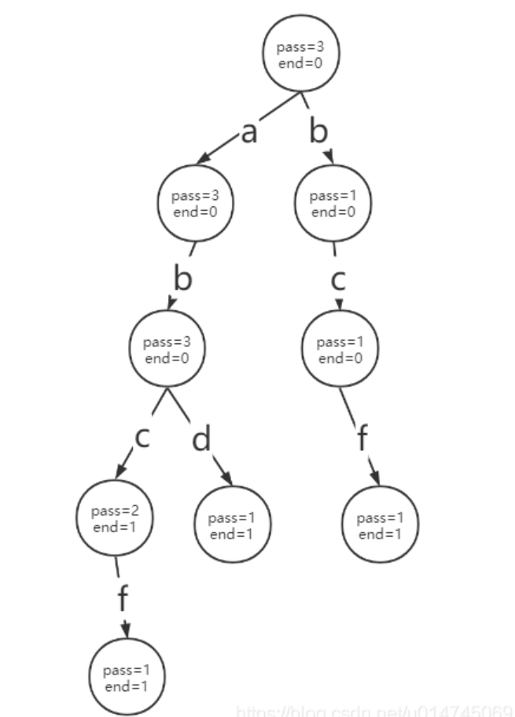
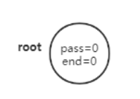
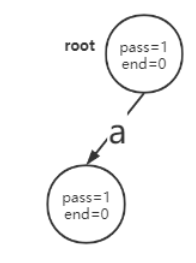
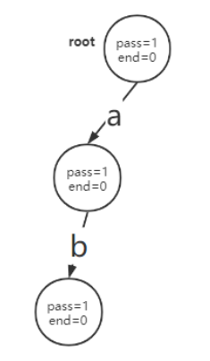
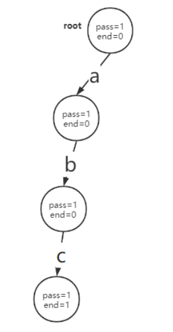
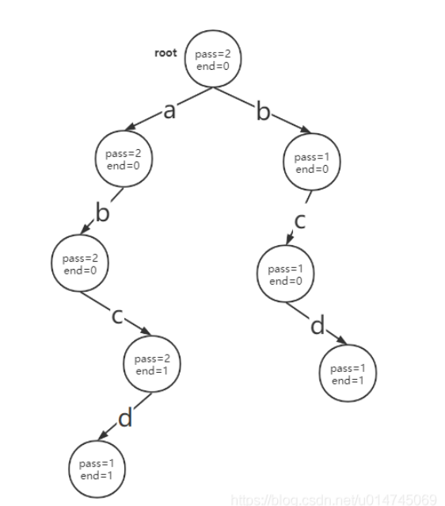

### 一、前缀树(字典树)的原理

​	前缀树由点和边构成，由根节点出发，按照存储字符串的每个字符，创建对应字符路径。

​	由“路径”记载字符串中的字符，由节点记载经过的字符数以及结尾字符结尾数，例如一个简单的记录了"abc"、"abd"、"bcf"、"abcf" 这四个字符串的前缀树如下图所示：



### 二、构建一颗前缀树

#### 2.1 文字介绍

​	经典的前缀树都是以“路径”（以下简称路）记录字符的，由节点记录统计信息 pass 代表经过的字符个数，end代表有多少个字符串以这条路径结尾。

​	前缀树节点的添加过程如下，以 "abc"、"bcd"、"abcd"为例：

1. 首先会有一个初始化的根节点 root :



2. 添加 'a' 字符，根节点 pass++ , 由于字符串还没有结束，后面还有 'b'、'c'，end 不变，并在路的另一端创建一个节点（因为两个节点才能形成一条路），并将新节点的 pass++，end 同样不变：



3. 添加 'b' 字符，同样创建一个新的节点，来表示 b 的路，并在新节点上 pass++，end不变：



4. 添加'c' 字符，创建一个新的节点，表示 c 的路，在新节点上 pass++，此时字符串已经结束，end++：



5. 到此为止，就完成了'abc'字符串的添加，以同样的方法添加 'bcd'、'abcd'



注意：每次添加都要从 root 开始，**root 作为前缀树的第一个节点，其 pass 可以表示树中一共存储了多少字符串**。

**前缀树的最大特点就是复用字符**，如果从 root 没有可复用的前缀，那么就需要创建新的路径，如果有就需要复用已有路径，并标记经过的字符个数

1. 根据当前节点的pass值可以知道以当前字符串为前缀的字符串总共有多少个
2. 根据当前节点的end值可以知道当前字符串有多少个

#### 2.2 代码实现

​	前缀树的路是一种抽象结构，无法用具体的代码直接描述，在代码中，**基于最简单的小写英文的前缀树**，通常就是**以一个数组表示 26 个字母的通道**，以每个通道是否存在 Node 节点来表示到达这个Node节点的路是否存在：

```go
// 前缀树Node节点
type Node struct {
    pass int
    end int
    nexts []Node
}

func NewNode() *Node {
    node := &Node{}
    node.pass = 0
    node.end = 0
    node.nexts = [26]*Node{}  // 26种可能
}

// 插入一个字符串
func (node *Node) Insert(root Node,word string) {
    if word == "" {
        return
    }
    chars := word.toCharArray()  // 将字符串转化为字符数组
    node := root  // 前缀树根节点
    node.pass++  // 每次都从root出发
    path := 0
    for i:=0;i<len(chars);i++ {
        path = chars[i] - 'a' // 26个槽位与26个字母对应，'a'->0，字符相减就可以获得路径的偏移量
        // 计算出偏移量后判断是否存在节点，如果是 nill 表示不存在这条路径
        if node.next[path] == nil {
            node.nexts[path] = NewNode()
        }
        // 指针移动到路径的尾节点
        node = node.nexts[path]
        // 路径的尾节点pass++
        node.pass++
    }
    // 遍历完该字符串后，node一定就是最后一个路径的尾节点，此时记录结尾数量
    node.end++;
}

// 查询指定字符串出现次数
func (node *Node)Search(root Node,word string) int {
    if word == "" {
        return 0
    }
    chars := word.toCharArray()  // 将字符串转化为字符数组
    node := root  // 前缀树根节点
    path := 0
    for i:=0;i<len(chars);i++ {
        path = chars[i] - 'a'
        if node.nexts[path] == nil {  // 路径不存在，表示该字符串不存在
            return 0
        }
        node = node.nexts[path]
    }
    return node.end
}

// 查询指定前缀出现次数
func (node *Node) searchPre(root Node,pre string) int {
    if pre == "" {
        return 0
    }
    chars := pre.toCharArray()  // 将字符串转化为字符数组
    node := root  // 前缀树根节点
    path := 0
    for i:=0;i<len(chars);i++ {
        path = chars[i] - 'a'
        if node.nexts[path] == nil {  // 路径不存在，表示该字符串不存在
            return 0
        }
        node = node.nexts[path]
    }
    return node.pass
}

// 前缀树删除一个记录字符串
// 删除操作，需要注意的两个点：
// 1.在开始执行真正的删除逻辑之前，一定要先调用 search 方法判断是否存在该字符串。
// 2.如果 node 的pass-1之后变成0，那么需要将节点引用置为 nil，释放该路径下的所有分支空间，同时也契合 insert、search等逻辑中 判断路径是否存在的方式。
func  (node *Node) delete(root Node,word string) {
    if node.Search(word) == 0{
        return
    }
    chars := word.toCharArray()  // 将字符串转化为字符数组
    node := root  // 前缀树根节点
    path := 0
    node.pass-- 
    for i:=0;i<len(chars);i++{
        path = chars[i] - 'a'
        node.nexts[path].pass--
        if node.nexts[path].pass == 0{
            node.nexts[path] = nil  //GC会自动回收其下分支占据的空间
            return
        }
        node = node.nexts[path]
    }
    node.end--
}
```


### 三、前缀树的时间复杂度

如果一个字符串长度为 k，那么插入前缀树需要的时间，就是 O(k)。

因为每个字符都需要比较一遍，在比较和计算路径的逻辑中，不论是数组实现的方式还是`HashMap`实现的方式，其路径的计算前者是使用相减得到的偏移量，后者是 `containsKey` 的 `hashcode`计算，都是常数时间复杂度。

而其余的代码步骤也都是常数时间复杂度，因此整个insert的过程就是 O(k)。

而查找的时间复杂度同样是 O(k)，依然取决于字符串长度。

### 四、前缀树的优点

前缀树是一种非常有用的字符串存储结构，它解决了像 `HashMap` 这种存储结构无法实现的问题——前缀统计，并且由于是复用节点，也很好的节约了存储空间。