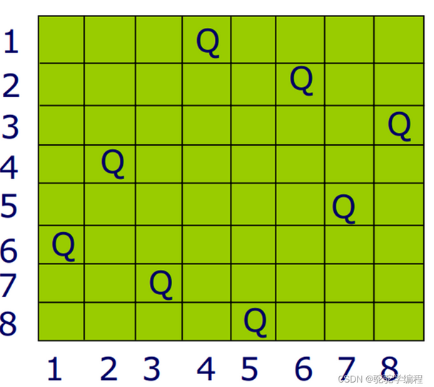

### 一、什么是贪心算法

​	贪心算法（又称贪婪算法）是指，在对问题求解时，总是做出在当前看来是最好的选择。也就是说，不从整体最优上加以考虑，他所做出的是在某种意义上的局部最优解。
 	贪心算法不是对所有问题都能得到整体最优解，关键是贪心策略的选择，选择的贪心策略必须具备无后效性，即某个状态以前的过程不会影响以后的状态，只与当前状态有关。
 	贪心算法的基本思路是从问题的某一个初始解出发一步一步地进行，根据某个优化测度，每一步都要确保能获得局部最优解。每一步只考虑一个数据，他的选取应该满足局部优化的条件。若下一个数据和部分最优解连在一起不再是可行解时，就不把该数据添加到部分解中，直到把所有数据枚举完，或者不能再添加算法停止。


下面给出一个贪心算法最简单的应用实例：

> 问题：在N行M列的正整数矩阵中，要求从每一行中选出一个数，使得选出数的总和最大。
> 分析：思路很简单，选择N次，每次从当前行选出最大值，最后相加即可。其实这就是一种贪心策略。要求使总和最大，那么我们把这个问题分解成若干个子问题，即求每一个子问题的最优解，汇总后得到大问题的最优解。

求解图问题的`Prim`算法和`Dijkstra`算法都是贪心算法。

### 二、贪心算法解题思路

1. 实现一个不依靠贪心策略的解法X，可以用最暴力的尝试
2. 脑补出贪心策略A、B、C……
3. 用解法X和对数器，去验证每一个贪心策略，用实验的方法得知哪个贪心算法正确
4. 不要去纠结贪心策略的证明

### 三、会议室问题

​	一些项目要占用一个会议室进行宣讲，会议室不能同时容纳两个项目的宣讲。给你每一个项目开始的时间和结束的时间（给你一个数组，里面是一个个具体的项目），你来安排宣讲的日程，要求会议室进行的宣讲的场次最多。返回这个最多的宣讲场次。

> 针对这个问题的贪心算法是：每次选择一个时间不冲突的最早结束的会议

```go
package greedy

import "sort"

type Meeting struct {
	Start int // 会议的开始时间
	End   int // 会议的结束时间
}

// meetings是所有有需求的会议，start是会议室最早可以开始使用的时间
// 返回值是安排上的会议集合
func BestArrage(meetings []Meeting, start int) []Meeting {
	sort.Slice(meetings, func(i, j int) bool { // 按照每场会议的End进行升序排序
		if meetings[i].End < meetings[j].End {
			return true
		} else {
			return false
		}
	})
	result := make([]Meeting, 0)
	for _, meeting := range meetings { // 遍历所有会议，如果当前会议在之前会议结束之后开始，则将其加入到结果集合中
		if meeting.Start >= start {
			result = append(result, meeting)
			start = meeting.End // 更新会议室的最新结束时间
		}
	}
	return result
}

func BestArrageForce(meetings []Meeting, start int) []Meeting {
	sort.Slice(meetings, func(i, j int) bool { // 按照每场会议的End进行升序排序（重要：暴力递归方法也需要先按照会议的end时间进行升序排序）
		if meetings[i].End < meetings[j].End {
			return true
		} else {
			return false
		}
	})
	selects := make([]Meeting, 0)
	return bestArrageForce(meetings, start, 0, selects)
}

// 暴力实现（一场会议，要么可以使用会议室，要么不能使用）
func bestArrageForce(meetings []Meeting, lastTime int, index int, selects []Meeting) []Meeting {
	if index >= len(meetings) { // 越界访问，不再向下递归，直接返回已选出的会议
		return selects
	}
	useSelect := make([]Meeting, 0)
	useSelect = append(useSelect, selects...)
	notUseSelect := make([]Meeting, 0)
	notUseSelect = append(notUseSelect, selects...)
	meeting := meetings[index] // 当前会议
	// 1.意图举行当前会议(可能会举行当前会议，取决于当前条件是否允许，即当前会议开始时间是否在最晚一次会议室结束时间之后)
	useResult := make([]Meeting, 0)
	if meeting.Start >= lastTime { // 条件允许，可以举行当前会议
		useSelect = append(useSelect, meeting)
		useResult = append(useResult, bestArrageForce(meetings, meeting.End, index+1, useSelect)...)
	} else { // 条件不允许，不可以举行当前会议
		useResult = append(useResult, bestArrageForce(meetings, lastTime, index+1, useSelect)...)
	}

	// 2.意图不举行当前会议(必定不会举行当前会议)
	notUseResult := make([]Meeting, 0)
	notUseResult = append(notUseResult, bestArrageForce(meetings, lastTime, index+1, notUseSelect)...)

	if len(useResult) > len(notUseResult) {
		return useResult
	} else {
		return notUseResult
	}
}
```

### 四、切金条问题

假设将一根金条切成两半，是需要花费和金条长度相同的钱。比如，一根80cm的金条，切成两半，需要花80块钱。现在，一群人想分一整块金条，每个人分得的长度保存在一个数组中，例如[10，20，30]意思就是将一根60cm的金条，划分成10，20，30三段，请问，怎样切分最省钱？
例如：
先将金条切分成10和50，需要60块钱，然后，再将50切分成20和30，需要50块，总共需要110块钱。
又或者，先将金条切分成30和30，花60块钱，然后再将30切分成10和20，花30块钱，总共就是90块钱。
90<110，所以第二种划算。

> 思路：
>
> 首先，观察题目，可以发现，每切一次，只能切出来一段最终结果，另一端肯定还有继续切割，这一段最终结果是不需要再次切分了，也就说明，后面切分时就不需要再算这一段的钱了，因此，这一段最终结果的数值越大，总的代价就越小。也就是说，我们先把大的切出来，越省钱，大的不会再次计算价钱了，越小的，我们最后切出来。
> 因此，从上面分析出来的结果可以看出，其实，本质就是，减少数值大的遍历次数，增加数值小的遍历次数，这样总体代价最低。


> 哈夫曼树
> 这样的贪心算法有一种数据结构能够轻松实现，那就是哈夫曼树，哈夫曼树的构建过程，就是先把最小的两个相连，然后组成一个新节点，然后放入总的集合中，再从中找出最小的两颗子树再次相连，再将结果放入集合中，最终集合中只剩下一棵树，这棵树就是哈夫曼树。这道题其实就是哈夫曼树的应用。


> 小根堆
> 此题用哈夫曼树解决，为什么会提到小根堆呢？因为，哈夫曼树的构建过程，每次需要将两个子树合成的结果再次放入集合中，然后，再从集合中取出两个最小值。这个过程，如果用常规数组的话，每次放入后，是不是还需要再次排序呀？这个再次排序的过程，是不是小根堆效率很好啊？只需要调整小根堆就行了，最多logn，如果是一般方法，是不是每次都需要重新排序，效率极低的。


> **最终解题思路**
>  先将数组构建成小根堆，然后，从小根堆中弹出两个。把这两个加在总和money上，然后这两个数相加，相加后，再次入小根堆。然后再从中弹出两个最小值，重复上述操作，直到小根堆中只剩一个数，结束，计算money。

```go
package greedy

import (
	"DataStructure/06.heapSort"
	heap2 "container/heap"
)

func SlicingGoldBar(arr []int) int {
	h := heapSort.NewIntHeap(arr, false)
	heap2.Init(heapSort.NewIntHeap(arr, false)) // 将h变为一个小根堆

	newGoldBar := 0
	sumPrice := 0
	for {
		if h.Len() <= 1 {
			return sumPrice
		}
		newGoldBar = heap2.Pop(h).(int) + heap2.Pop(h).(int) // 弹出两个最小的元素，合成一个金块
		heap2.Push(h, newGoldBar)                            // 合成一个金块后，再次加入到小根堆中
		sumPrice += newGoldBar                               // 本次合并(或者说切割)花费的金额
	}
}
```

### 五、获取最大项目收益问题

输入：

1. 正数数组 costs
2. 正数数组 profits
3. 正数 k
4. 正数 m

含义：

1. costs[i] 表示i号项目的花费
2. profits[i] 表示i号项目在做完之后能够得到的利润(净收益)
3. k表示你最多只能做k个项目
4. m表示你的初始资金

说明：

​	你每做完一个项目，马上获取的收益，可以支持你去做下一个项目。

输出：

​	你最后获得的最大钱数。

> 思路：
>
> 1. 先按照项目花费的钱数，将项目按照小根堆方式进行排列
> 2. 从小根堆中弹出所有 花费 < 当前所有资金 的项目
> 3. 将弹出的项目按照收益的大小，按照大根堆方式排列
> 4. 每次从大根堆中弹出一个项目，将获取的利润加到初始资金m上

```go
package greedy

import (
	heap2 "container/heap"
)

type Project struct {
	Cost   int // 消费
	Profit int // 利润
}

// k表示你最多只能做k个项目 .  m表示你的初始资金
// profits[i] 表示i号项目在做完之后能够得到的利润(净收益)
// costs[i] 表示i号项目的花费
// 返回值是最后的所得的利润
func FindMaxizedCaptital(k, m int, Profits []int, Costs []int) int {

	costHeap := NewProjectHeap([]project{}, false) // 按照花费大小进行排序的小根堆
	heap2.Init(costHeap)
	profitHeap := NewProjectHeap([]project{}, true) // 按照利润大小排序的大根堆
	heap2.Init(profitHeap)

	for i := 0; i < len(Costs); i++ {
		p := project{cost: Costs[i], profit: Profits[i]}
		heap2.Push(costHeap, p)
	}

	current := m             // 当前可供支配的资金
	for i := 0; i < k; i++ { // 最多寻找k个项目
		for { // 取出当前有能力做的所有项目，添加到按照利润排序的大根堆profitHeap中
			if costHeap.Len() == 0 {
				break
			}
			topProject := heap2.Pop(costHeap).(project) // 弹出一个花费最小的项目
			if topProject.cost > current {              // 没有项目可做了
				heap2.Push(costHeap, topProject) // 再重新回到小根堆中
				break
			}
			heap2.Push(profitHeap, topProject) // 将这个项目加入到按照利润排序的大根堆中
		}
		if profitHeap.Len() == 0 { // 当前没有能力做任何项目了
			return current
		}
		current += heap2.Pop(profitHeap).(project).profit // 做完一个最润最大的项目
	}
	return current
}

type project struct {
	cost   int
	profit int
}

// 值为project的大(小)根堆
type projectHeap struct {
	heap []project // 底层数组
	form bool      // true为按利润排序的大根堆  false为按花费排序的小根堆
}

// 创建一个大(小)根堆
func NewProjectHeap(heap []project, form bool) *projectHeap {
	return &projectHeap{
		heap: heap,
		form: form,
	}
}

// 必须实现sort.Interface这个接口(包括less,len,swap三个方法)
func (ph *projectHeap) Len() int {
	return len(ph.heap)
}
func (ph *projectHeap) Less(i, j int) bool {
	if ph.form { // 大根堆
		return ph.heap[i].profit > ph.heap[j].profit
	} else { // 小根堆
		return ph.heap[i].cost < ph.heap[j].cost
	}
}
func (ph *projectHeap) Swap(i, j int) {
	ph.heap[i], ph.heap[j] = ph.heap[j], ph.heap[i]
}

// 实现Push方法
func (ph *projectHeap) Push(x interface{}) {
	ph.heap = append(ph.heap, x.(project))
}

// 实现Pop方法（弹出底层数组的末尾值，让底层数组变为[0:n-1]）
func (ph *projectHeap) Pop() interface{} {
	old := ph
	n := len(old.heap)
	x := old.heap[n-1]
	ph.heap = old.heap[0 : n-1]
	return x
}

// 获取大(小)根堆的堆顶元素(注：这个方法不是heap接口规定要实现的)
func (ph *projectHeap) Top() interface{} {
	return ph.heap[0]
}
```

### 六、数据流中位数问题

问题：接受用户的数据流，要求随时能够给用户返回当前已有数据的中位数。

> 思路：
>
> 1. 准备一个大根堆和一个小根堆
> 2. 对于数据流的第一个数，将其放入到大根堆中。
> 3. 对于之后的数，需要判断此数与大根堆堆顶数值的大小：如果新数 > 大根堆堆顶，将该数放入小根堆；如果新数 <= 大根堆堆顶，将该数放入大根堆中。
> 4. 一旦大小根堆元素数量之差大于等于2，将元素数量多的根堆的堆顶元素从原根堆转移到另一个根堆。
>
> 上述的流程，可以保证大根堆总是存储 前 N/2个 数据，小根堆总是存储后N/2个元素。且中位数总是在大小根堆的堆顶。（奇数个数有唯一的中位数，偶数个的时候将大小根堆的堆顶元素取平均值）

```go
package greedy

import (
	"DataStructure/06.heapSort"
	heap2 "container/heap"
)

func InitHeap() (*heapSort.IntHeap, *heapSort.IntHeap) {
	smallBase := make([]int, 0)
	bigBase := make([]int, 0)

	smallHeap := heapSort.NewIntHeap(smallBase, false) // 小根堆后N/2个数
	bigHeap := heapSort.NewIntHeap(bigBase, true)      // 大根堆,存储前N/2个数

	heap2.Init(smallHeap)
	heap2.Init(bigHeap)

	return smallHeap, bigHeap
}

// 每次从数据流中取出一个数,并返回当前已有数字的中位数
func FindMedian(smallHeap, bigHeap *heapSort.IntHeap, num int) float64 {
	if smallHeap.Len() == 0 && bigHeap.Len() == 0 { // 第一个数加入到大根堆中
		heap2.Push(bigHeap, num)
		return float64(num)
	}
	bigTop := heap2.Pop(bigHeap).(int) // 获取大根堆堆顶元素(大根堆永远不可能再次为空，因此不需要判断堆是否为空)
	heap2.Push(bigHeap, bigTop)
	if num >= bigTop { // 放入到小根堆(作为后N/2个数)
		heap2.Push(smallHeap, num)
	} else { // 放入小根堆(作为前N/2个数)
		heap2.Push(bigHeap, num)
	}

	diff := smallHeap.Len() - bigHeap.Len()
	sum := smallHeap.Len() + bigHeap.Len()

	if diff >= 2 {
		moveNum := heap2.Pop(smallHeap)
		heap2.Push(bigHeap, moveNum)
	} else if diff <= -2 {
		moveNum := heap2.Pop(bigHeap)
		heap2.Push(smallHeap, moveNum)
	}

	// 重点：注意各种情况的判别，返回正确的中位数
	if sum%2 != 0 { // 奇数个数时，有唯一的中位数
		if diff > 0 { // 小根堆数多，那么中位数就是小根堆的堆顶元素
			median := heap2.Pop(smallHeap).(int) // 获取小根堆堆顶元素,此数即为中位数
			heap2.Push(smallHeap, median)
			return float64(median)
		} else { // 大根堆数多，那么中位数就是大根堆的堆顶元素
			median := heap2.Pop(bigHeap).(int) // 获取大根堆堆顶元素,此数即为中位数
			heap2.Push(bigHeap, median)
			return float64(median)
		}
	} else { // 偶数个数时，中位数为平均值
		median1 := heap2.Pop(smallHeap).(int) // 获取小根堆堆顶元素,此数即为中位数
		heap2.Push(smallHeap, median1)

		median2 := heap2.Pop(bigHeap).(int) // 获取大根堆堆顶元素,此数即为中位数
		heap2.Push(bigHeap, median2)

		return float64((median1 + median2)) / 2
	}

}
```


### 七、N皇后问题 

[八皇后问题](https://so.csdn.net/so/search?q=八皇后问题&spm=1001.2101.3001.7020)是十九世纪著名的数学家高斯于1850年提出的。:在8×8的棋盘上摆放八个皇后，使其不能互相攻击，即**任意两个皇后都不能处于同一行、同一列或同一斜线上**。可以把八皇后问题扩展到n皇后问题，即在n×n的棋盘上摆放n个皇后，使任意两个皇后都不能处于同一行、同一列或同一斜线上。 



### 7.1 经典解法

```go
package greedy

import "math"

func NQueen(n int) int {
	if n < 1 { // n == 0，解法为0
		return 0
	}
	chessBoard := make([]int, n, n) // 棋盘。 chessBoard[i]的取值范围是 k = 0~n-1 ，表示第i行当前在第k列
	return nQueen(0, n, chessBoard)
}

// line:当前的行号，n棋盘总行书，chessBoard数组模拟的棋盘
func nQueen(line, n int, chessBoard []int) int {
	if line == n { // 0~n-1行完成了N皇后问题，返回解法数量+1
		return 1
	}
	result := 0
	// 当前第i行行的所有列都要进行尝试
	for col := 0; col < n; col++ {
		// 1.先判断当前第line行的col列是否可以放皇后
		if isValid(chessBoard, line, col) { // 不会和前i-1行冲突，则放，并继续递归找下一行的放置
			chessBoard[line] = col                  // 放置皇后
			result += nQueen(line+1, n, chessBoard) //  完成验证，继续摆放第i+1行
		}
	}
	return result
}

func isValid(chessBoard []int, line, col int) bool {
	for i := 0; i < line; i++ { // 检查line,col放置皇后是否与前面line-1行有冲突
		if col == chessBoard[i] { // 共列
			return false
		}
		if line-i == int(math.Abs(float64(col-chessBoard[i]))) { // 列数之差等于行数之差，共斜线
			return false
		}
	}
	return true // 检查完成，没有发现任何冲突
}
```


### 7.2 优化常数项后的解法

采用位运算可以优化上述的N皇后问题解法。在N=15及之后时两种方法实际消耗的时间有明显差距。

> 思路:
>
> 一个数可以表示为二进制形式，我们以8皇后问题为例：
>
> 在第0行，假设我们将皇后摆在首位，那么用二进制表示改行为：...(前面的若干个0) 1000 0000。前面的若干个0取决于具体的变量，比如int默认为32bit，因此这个若干个就是24个。
>
> 那么我们对于第1行的列限制就是 (24个0) 1000 000 ，左对角线限制就是 (24个0) 0000 000，右对角线限制就是(24个0) 0100 000。总共的限制就是(24个0) 1100 000，也就是说第一行此时只能选择后6位。
>
> 通过这样的方式，我们可以不再通过使用record数组，而是仅仅用一个变量就能确定下一行皇后的摆放限制。

```go
package greedy

func NqueenImproved(n int32) int {
	if n < 1 || n > 32 {
		return 0
	}
	var limit int // limit用来做位数的限制，比如8皇后问题,对于辅助数int就只能考虑后八位。通过将辅助数与limit做按位与来实现这种保证
	if n == 32 {
		limit = -1 // bit位为1，表示可以取. bit位为0，会被屏蔽  -1时所有bit位为1，表示都可以取
	} else {
		limit = (1 << n) - 1 // 只有后n位为1，可以取
	}
	return nqueenImproved(limit, 0, 0, 0)
}

func nqueenImproved(limit, colLim, leftDiaLim, rightDiaLim int) int {
	if colLim == limit { // 所有的N行都填了皇后，因此该方法可行，解法+1
		return 1
	}

	pos := limit & (^(colLim | leftDiaLim | rightDiaLim)) // 下一行所有可以填皇后的位置都为1（具有记忆性，会不断积累前面i-1行产生的影响）
	res := 0
	for { // 每次循环试一位(最后面的可选的一位)，循环变量是pos
		if pos == 0 { // 下一行无处可放皇后
			break
		}
		mostRightOne := pos & (^pos + 1)                  // 取出pos最右侧的1(二进制位)，在这一位放1
		pos = pos - mostRightOne                          // 消去最右侧的1(因为放了1，所以下一次就不可以在这一列上放置了)
		res += nqueenImproved(limit, colLim|mostRightOne, // 行数限制累积
			(leftDiaLim|mostRightOne)<<1,  // 左对角线限制累积(leftDiaLim也要左移一位是因为这是对刚加的新行的下一行的限制 -- 旧行 | 新行 | 新新行(限制) )
			(rightDiaLim|mostRightOne)>>1) // 右对角线限制累积
	}
	return res
}

```

