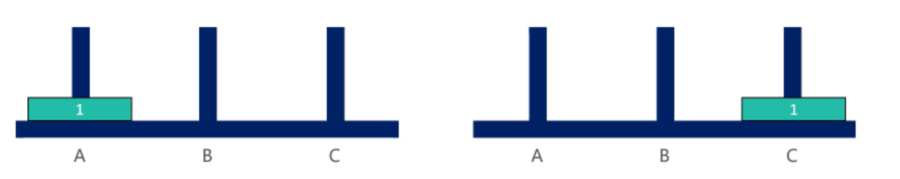
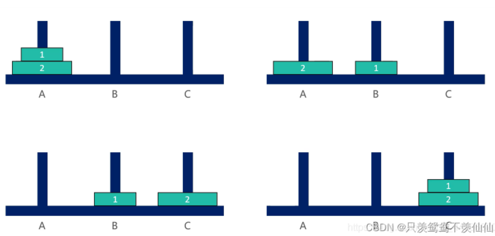
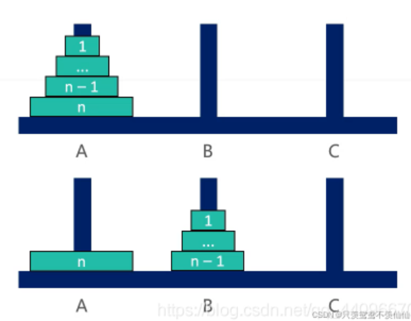
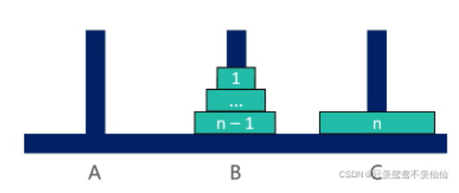

### 一、汉诺塔问题

​	汉诺塔问题是一个经典的问题。汉诺塔（Hanoi Tower），又称河内塔，源于印度一个古老传说。大梵天创造世界的时候做了三根金刚石柱子，在一根柱子上从下往上按照大小顺序摞着64片黄金圆盘。大梵天命令婆罗门把圆盘从下面开始按大小顺序重新摆放在另一根柱子上。并且规定，任何时候，在小圆盘上都不能放大圆盘，且在三根柱子之间一次只能移动一个圆盘。问应该如何操作？（**每次只能移动1个盘子，大盘子只能放在小盘子下面**）

### 1.1 汉诺塔一个盘子



### 1.2 汉诺塔两个盘子



### 1.3 汉诺塔三个盘子


### 1.4 解法思路

1. 当 n == 1时，直接将盘子从 A 移动到C

2. 当 n > 1时，可以拆分成3大步骤：

   ①. 将 n– 1 个盘子从 A 移动到B（递归）

   

   ②. 将编号为 n 的盘子从 A 移动到C

   

   ③. 将 n– 1 个盘子从 B 移动到C（递归）

   

### 1.5 代码实现

```go
func function(i int,start,end,other string) {
    if i == 1{
        fmt.Println("Move 1 from "+ start + " to "+ end)
    } else {
        function(i-1,start,other,end)
        fmt.Println("Move "+ i + " from "+start+" to "+end)
        function(i-1,other,end,start)
    }
}

func hanoi(n int) {
    if n > 0{
        function(n,"左","中","右")
    }
}

func main() {
    n := 3
    hanoi(n)
}
```

### 二、打印一个字符串的全部子序列，包括空字符串

> 思路：
>
> 这个问题可以想象成一个二叉树，每一次都分为要当前字符和不要当前字符两种情况

```go
package BruteRecursion

import "fmt"

func PrintAllSubString(str string) int {
	charSet := []byte(str)

	subStr := make([]byte, 0)
	return printAllSubString(charSet, 0, subStr)
}

func printAllSubString(str []byte, index int, subStr []byte) int {
	if index == len(str) { // 已经遍历完原字符串的所有字符
		fmt.Println(string(subStr))
		return 1
	}
	subStrCount := 0

	// 要当前字符
	withChar := make([]byte, 0)
	withChar = append(withChar, subStr...)
	withChar = append(withChar, str[index])
	subStrCount += printAllSubString(str, index+1, withChar)

	// 不要当前字符
	noWithChar := make([]byte, 0)
	noWithChar = append(noWithChar, subStr...)
	subStrCount += printAllSubString(str, index+1, noWithChar)

	return subStrCount
}
```

优化版：

```go
package BruteRecursion

import "fmt"

func PrintAllSubStrImproved(str string) int {
	charSet := []byte(str)
	return printAllSubStringImproved(charSet, 0)
}

func printAllSubStringImproved(str []byte, index int) int {
	if index == len(str) {
		fmt.Println(string(str))
		return 1
	}

	subStrCount := 0
	subStrCount += printAllSubStringImproved(str, index+1) // 要当前字符

	oldData := str[index]
	str[index] = 32                                        // 空格字符的ASCII码
	subStrCount += printAllSubStringImproved(str, index+1) // 不要当前字符(将原本字符串对应位变为空格)

	str[index] = oldData // 再恢复到原来的状态

	return subStrCount
}
```

### 三、打印字符串的全部排列(重复 and 不重复)

其实是字符串中字符的排列组合

```go
package BruteRecursion

func PrintAllCombination(str string) (int, map[string]struct{}) {
	charSet := []byte(str)
	result := make(map[string]struct{}, 0)
	printAllCombination(charSet, 0, result)
	return len(result), result
}

// 存在一些重复的递归分支(因为字符串中可能会出现重复的字符)
func printAllCombination(str []byte, index int, res map[string]struct{}) {
	if index == len(str) {
		res[string(str)] = struct{}{}
	}

	for i := index; i < len(str); i++ {
		swap(str, index, i) // 将字符串的当前位替换为 index后的所有位
		printAllCombination(str, index+1, res)
		swap(str, index, i) // 将递归分支分离出去后再交换回去
	}
}

func PrintAllCombinationImproved(str string) (int, map[string]struct{}) {
	charSet := []byte(str)
	result := make(map[string]struct{}, 0)
	printAllCombinationImproved(charSet, 0, result)
	return len(result), result
}

func printAllCombinationImproved(str []byte, index int, res map[string]struct{}) {
	if index == len(str) {
		res[string(str)] = struct{}{}
	}
	visitMap := make(map[byte]bool)
	var a byte = 97
	var A byte = 65
	for i := 0; i < 26; i++ {
		visitMap[a+byte(i)] = false
		visitMap[A+byte(i)] = false
	}

	for i := index; i < len(str); i++ {
		if !visitMap[str[i]] {
			visitMap[str[i]] = true
			swap(str, index, i) // 将字符串的当前位替换为 index后的所有位
			printAllCombination(str, index+1, res)
			swap(str, index, i) // 将递归分支分离出去后再交换回去
		}

	}
}

func swap(arr []byte, i, j int) {
	temp := arr[i]
	arr[i] = arr[j]
	arr[j] = temp
}
```

上述代码可以求解带重复的字符串全排列，如果去掉visit数组相关的注释就可以实现不重复的全排列。

### 四、纸牌获胜者问题

给定一个整形数组arr，所有数值不同纸牌排成一条线。玩家A和玩家B依次拿走每张纸牌，规定玩家A先拿，玩家B后拿，但是每个玩家每次只能拿走最左或者最右的纸牌，玩家A和玩家B都绝顶聪明。请返回最后获胜者的分数。

【举例】

1.`arr = [1,2,100,4]`

开始时，玩家A只能拿走1或者4。如果开始时玩家A拿走1，则规则变成[2,100,4]，接下来玩家B可以拿走2或者4，然后继续轮到玩家A....

如果开始时玩家A拿走4，则排列变成[1,2,100]，接下来玩家B可以拿走1或者100，然后继续轮到玩家A...

玩家A作为绝顶聪明的人不会先拿4，因为拿了4之后，玩家B将拿走100。所以玩家A会先拿1，让排列变成[2,100,4]，接下来玩家B不管怎么选，100都会被玩家A拿走。玩家A会获胜，分数为101.所以最终返回101。

2.`arr = [1,100,2]`

开始时，玩家A不管是拿走1还是拿走2，玩家B作为绝顶聪明的人，都会把100拿走。玩家B会获胜，分数为100。所以返回100.

> 思路：
>
> 随机选择一个玩家进行分析，假设选中玩家A
>
> 玩家A有两种函数：先手函数和后手函数。
>
> 先手函数f：在arr[]数组的[i,j]上进行选择，要么选择arr[i]，要么选择arr[i]。作为一个绝顶聪明的人，A总是会做出对自己最有利的选择。
>
> 后手函数s：在arr[]数组的[i,j]上进行选择，因为是后手，因此必须等待B选择完之后才能再选。而B作为绝顶聪明的人，总是会做出对A最为不利的选择

```go
package BruteRecursion

import (
	"fmt"
	"math"
)

func SmartCard(card []int) {
	firstScore := first(card, 0, len(card)-1)
	secondScore := second(card, 0, len(card)-1)

	if firstScore > secondScore {
		fmt.Printf("比分为 %d:%d ,先手获胜\n", firstScore, secondScore)
	} else if firstScore == secondScore {
		fmt.Printf("比分为 %d:%d ,平手\n", firstScore, secondScore)
	} else {
		fmt.Printf("比分为 %d:%d ,后手获胜\n", firstScore, secondScore)
	}
}

// 先手函数
func first(card []int, start, end int) int {
	if start == end { // 只剩一张牌，那么作为先手就拿到这张牌
		return card[start]
	}
	// 作为先手，可以先选一张牌,之后要作为后手。math.Max表示先手者总是会做出对自己最有利的选择
	return int(math.Max(float64(card[start]+second(card, start+1, end)), float64(card[end]+second(card, start, end-1))))
}

// 后手函数
func second(card []int, start, end int) int {
	if start == end { // 只剩一张牌，那么作为后手就什么也拿不到
		return 0
	}
	// 作为后手，只能等待先手完成选牌后再选。math.Min表示后手者总是被迫接受对自己最不利的选择(因为对方会做出比自己好的选择)
	return int(math.Min(float64(first(card, start+1, end)), float64(first(card, start, end-1))))
}
```

### 五、逆序栈

给你一个栈，请你逆序这个栈，不能申请额外的数据结构，只能使用递归函数。

```go
package BruteRecursion

import "DataStructure/08.linkList"

func ReverseStack(stack *linkList.Stack) {
	if stack.Len == 0 { // 栈中所有元素被弹出时，开始返回
		return
	}

	bottom := getBottom(stack) // 弹出栈的最底层元素
	ReverseStack(stack)
	stack.Push(bottom) // 因为递归进行返回时是相反的顺序，因此将栈中元素逆序填入到栈中
}

// 弹出栈底元素
func getBottom(stack *linkList.Stack) interface{} {
	result := stack.Pop() // 将当前栈顶元素弹出
	if stack.Len == 0 {   // 当遇到栈底元素时，不会再次加入到栈中，而是直接返回
		return result
	}
	last := getBottom(stack) // 不断请求获取下一个元素
	stack.Push(result)       // 重新将当前栈顶元素加入
	return last              // 从最后一次递归获得栈底元素
}
```

### 六、编码问题

规定1和A对应、2和B对应、3和C对应。。。

那么一个数字字符串比如“111”，就可以转化为“AAA”、“KA”、“AK”

给定一个只有数字字符组成的字符串str，返回有多少种转化结果

> 分析：
>
> 假设已经完成 0 ~ i-1位的转换，现在从 i 位 进行考虑，所有的情况如下：
>
> 1. 第i位是0，意味着此条路线转换失败，因为0不能转化为任何字符
> 2. 第i位是3~9，那么只能第i位单独进行转化为C~Z，不会与i+1有任何关系
> 3. 第i位是1，那么既可以单独对第i位进行转化，也可以结合第 i+1位一起进行转换
> 4. 第i位是2，那么既可以单独对第i位进行转化，也可以结合第 i+1位一起进行转换，但是对第i+1位有限制，必须是0~6

```go
package BruteRecursion

// 除了用递归之外，还可以用字典树尝试，字典树还能打印出所有的编码可能性。递归只能打印结果数
func CodeProblem(str string) int {
	return codeProblem(str, 0)
}

func codeProblem(str string, index int) int {
	if index == len(str) { // 所有的位都完成了编码，可能性+1
		return 1
	}
	if str[index] == 48 { // 当前字符为字符‘0’,'0'不能单独进行编码，因此此路线失败
		return 0
	}
	if str[index] == 49 { // 当前字符为字符‘1’
		res := codeProblem(str, index+1) // 仅对当前位进行编码
		if index+1 < len(str) {
			res += codeProblem(str, index+2) // 如果可以对当前位+下一位进行共同编码
		}
		return res
	} else if str[index] == 50 { // 当前字符为字符‘2’
		res := codeProblem(str, index+1)                                    // 仅对当前位进行编码
		if index+1 < len(str) && str[index+1] >= 48 && str[index+1] <= 54 { // 第二位还存在，同时必须是字符‘0’~'6'间的一个
			res += codeProblem(str, index+2) // 如果可以对当前位+下一位进行共同编码
		}
		return res
	} else { // 当前字符为3~9
		res := codeProblem(str, index+1) // 仅对当前位进行编码
		return res
	}
}
```

### 七、载货最大价值问题

​	给定两个长度都为N的数组weights和values，weights[i]和values[i]分别代表i号物品的重量和价值。给定一个正数bag，表示一个载重bag的袋子，你装的物品不能超过这个重量。返回你能装下的最多的价值是多少？

> 思路：
>
> 这是一个动态规划问题，第i步时可以选择要或者不要该货物两条分支，从这两条分支中选出最有价值的

```go
package BruteRecursion

import (
	"math"
)

type Commodity struct {
	price  int
	weight int
}

// 分类递归的问题，一旦发现异常分支(不符合给定条件的分支)，则必须想办法将该分支丢弃掉。比如通过在选优阶段降低该分支的优先度到极低而实现
// 正常分支与异常分支的另一个不同之处：正常分支能走到结束条件(结束条件通常是完成了对数组的遍历)，异常分支不允许走到结束条件

func MaxValue(commodities []Commodity, capacity int) int {
	return maxValue(commodities, capacity, 0, 0)
}

func maxValue(commodities []Commodity, capacity int, index int, load int) int {
	if load > capacity { // 一旦发现超重,立即丢弃该分支
		// 一旦发现要了上一笔货物而超重,则立即返回，导致 profit1 = 0.则上一个货物肯定不能要，profit1分支结束递归，只保留profit2分支继续
		return -commodities[index-1].price
	}
	if index == len(commodities) {
		return 0
	}

	profit1 := maxValue(commodities, capacity, index+1, load+commodities[index].weight) + commodities[index].price
	profit2 := maxValue(commodities, capacity, index+1, load)

	return int(math.Max(float64(profit1), float64(profit2)))
}

func MaxValue2(commodities []Commodity, capacity int) int {
	return maxValue2(commodities, capacity, 0, 0, 0)
}
func maxValue2(commodities []Commodity, capacity int, index int, load int, profit int) int {
	if load > capacity { // 一旦发现超重,立即丢弃该分支
		return 0
	}
	if index == len(commodities) {
		return profit
	}

	profit1 := maxValue2(commodities, capacity, index+1, load+commodities[index].weight, profit+commodities[index].price)
	profit2 := maxValue2(commodities, capacity, index+1, load, profit)

	return int(math.Max(float64(profit1), float64(profit2)))
}
```

