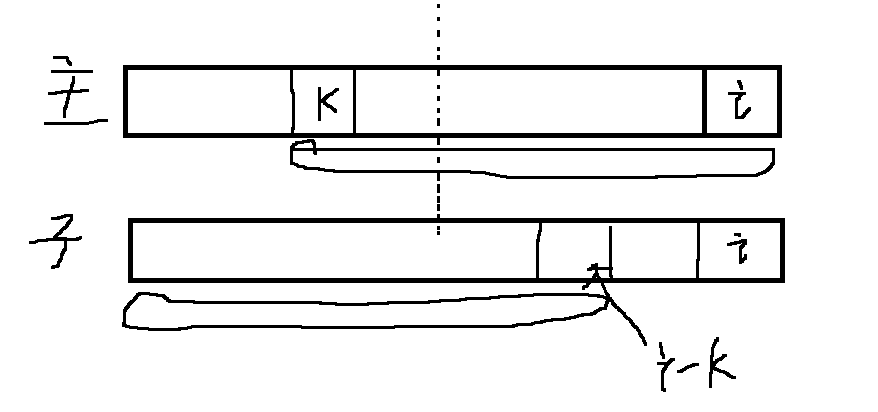
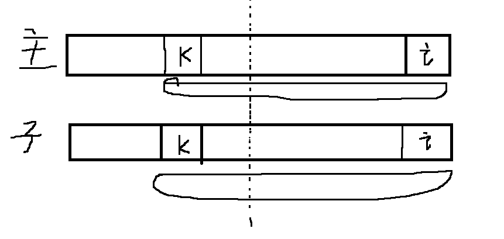
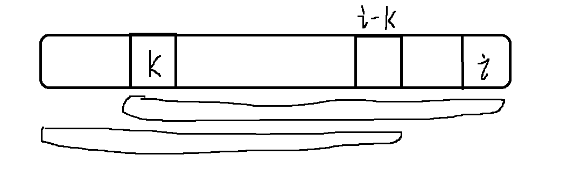

## 一、朴素的模式匹配算法

​	暴力匹配方式在字符串`str1`中查询是否有子串`str2`出现，如果有则返回`str2`在`str1`中出现的位置。

​	这种朴素的匹配方式：就是对主串的每一个字符作为子串开头，与要匹配的字符串进行匹配。对主串做大循环，每个字符开头做T的长度的小循环，直到匹配成功或全部遍历完成为止。

```go
func Index(S,T string,pos int) int {
    i := pos  // 表示从主串的pos位开始匹配子串
    j := 0  // 子串从0位置开始匹配
    for {
        if i> len(S) || j> len(T) {
            break
        }
        if S[i] == T[j] {  // 字符匹配
            i++
            j++
        } else {   // 字符不匹配，开始回退
            i = i-j+1   // S回到j步之前的下一位上开始匹配
            j = 0
        }
    }
    if j > len(T) {  // 说明子串T的全部字符都已经完成匹配
        return i-len(T)
    } else {
        return -1
    }
}
```

这种匹配算法的优点是简单，缺点是时间复杂度高，是O(N*M)  (N是主串长度，M是子串长度)

## 二、`KMP`算法

​	为了降低时间复杂度，`KMP`算法在进行比较时，保留了上次比较的部分记忆性，通过防止对整个子串从头开始进行比对，从而大大减小了时间复杂度。

​	具体的，`KMP`采用了一种名为`next`数组的特殊结构。

### 2.1 next数组

next数组记录了当前字符串之前的串的前后缀的相似度。

假设一个子串为：`str = abbtabbz`

nextarr[0] = -1   , 这是规定

nextarr[1] = nextarr[2] = nextarr[3] = nextarr[4] = 0   ，因为str[1]~str[4]之前的截断字符串都没有出现前缀字符串与后缀字符串相等的情况。

nextarr[5] = 1  , 因为str[5] 之前的截断字符串为 “abbta”  ,这个字符串最长的相同前后缀字符串是“a”,长度是1

nextarr[6] = 2  , 因为str[6] 之前的截断字符串为 “abbtab”  ,这个字符串最长的相同前后缀字符串是“ab”,长度是2

nextarr[7] = 3  , 因为str[7] 之前的截断字符串为 “abbtabb”  ,这个字符串最长的相同前后缀字符串是“abb”,长度是3

### 2.2 借助next数组加速字符串匹配

假设主串是`main = ……abbtabbk……`，使用的子串还是`str = abbtabbz`

比较时，因为main[7] = k  ≠ str[7] = z，因此需要调整位置重新匹配。

我们用变量 i 和 j 作为主串和子串进行比较时使用的指针，在上一次失败比较中，i = j = 7.

按照朴素比较方式，我们应该让 i = 1 ，j =0 进行下一轮比较。

但是在`KMP`中，我们让主串指针 i 保持不变，依旧是 i = 7。但是 j = nextarr[7] = 3。

也就是说主串从 ‘k’ 开始继续下一轮比较，子串从‘t’ 开始继续下一轮比较。因为main[0] ~ main[6] 与 str[0] ~ str[6] 是完全相等的，而且对于子串str来说，前nextarr[7]个字符和后nextarr[7]个字符完全相等，那么必然main的前nextarr[7]个字符和后nextarr[7]个字符完全相等。即：main的前nextarr[7]个字符 == main的后nextarr[7]个字符 == str的前nextarr[7]个字符 == str的后nextarr[7]个字符，可以推出：**main的后nextarr[7]个字符  == str的前nextarr[7]个字符**，**因为相等所以第二次再判断时可以直接跳过不比较，而是直接从下一位开始比较**

那么我们可以**从main的 后nextarr[7]个字符 +1 个字符开始（即main[7] = k），str的前nextarr[7]个字符 +1 个字符开始 (即str[3] = t) 进行匹配**。

这样我们就极大地减小了时间复杂度。

需要注意，再一次比较失败之后，我们之所以保持主串的指针不动，是因为主串的 0~i-1 位开始的字符串必然不可能与子串完成匹配。原因是：假设能匹配，那么意味着：

1. 主串从  0~i-1之间的某一位，比如第k位，那么主串的 k~ i 位的截断字符串必然与子串的 0~ i-k 位  组成的截断字符串完全相等



2. 因为在上一轮比较中，主串和子串只是在第 i 位不同而中断比较，那么意味着主串的 第 k~ i 位和子串的 第 k ~i 位其实是相等的



3. 以上两条可以得到：子串的前 0~ i-k位截断字符串 == 子串的后 k ~ i 位截断字符串



4. 那么意味着nextarr[7]不应该只是3，而应该比3更大。这明显与nextarr数组的建立相违背。

假如

### 2.3 `KMP`算法实现

```go
func KMP(s,m string) int {
    if (s == nil || m == nill || len(m) < 1 || len(s) < len(m)) {
        return -1
    }
    str1 := toCharArray(s)
    str2 := toCharArray(m)
    i1:=0
    i2:=0
    next := getNextArray(str2)  // 获取子串的nextArray    O(M)
    for {   // O(N)  因为 O(M)必定小于O(N),所以KMP算法时间复杂度为O(N)
        if i1 >= len(str1) || i2 >= len(str2) {
            break
        }
        if (str1[i1] == str2[i2]) {
            i1++
            i2++
        } else if (next[i2] == -1) {  // 当前i2指针之前已经没有任何相等的前后缀子串,而且来到了i2 == 0 ，子串的起始位置
            i1++   // 主串放弃，直接从下一个字符开始比较
        } else {
            i2 = next[i2]  // i2直接跳到前缀字符串之后开始进行比较
        }
    }
    if i2 == len(str2) {  // 子串全部完成匹配
        return i1 - i2
    } else {   // 主串先遍历结束，说明无法完成匹配
        return -1
    }
}
```

### 2.4 `nextarr`数组的实现

```go
func getNextArray(ms []char) []int {
    if len(ms) == 1{
        return []int{-1}
    }
    next := new int[len(ms)]
    next[0] = -1   // 规定
    next[1] = 0   // 规定
    
    i:=2   // next数组开始计算的位置
    cn :=0   // 总是指向最大前缀字符串的下一个字符(不属于前缀字符串的第一个字符)
    for {
        if i>= len(next) {
            break
        }
        if (ms[i-1] == ms[cn]) {  // 前后缀字符串的下一个字符又相等
            cn++
            next[i] = cn  // next[i] 在 next[i-1] 基础上再+1
            i++   // 等待比较再下一个字符
        } else if (cn > 0) {  // 下一字符不相等，但是还是有相同前后缀字符串的
            cn = next[cn]   // cn向前移动(跳转到当前前缀字符串的前缀字符串的下一个字符，也就是上一轮最大前缀字符串的末尾)
        } else {   // 下一字符不相等，且再无更小的相同前后缀字符串
            next[i] = 0
            i++
        }
    }
    return next
}
```

