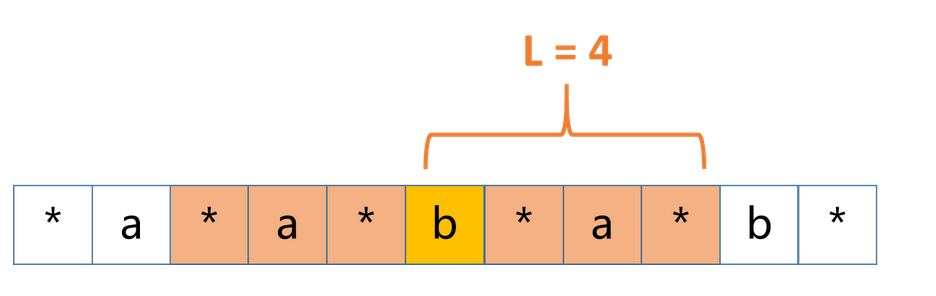
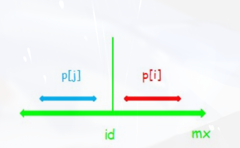
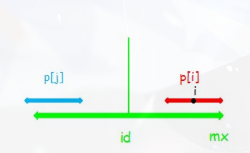
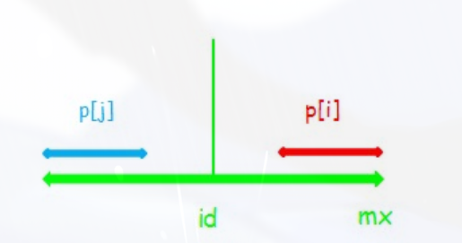

## 一、描述

`Manacher` 算法用于求解字符串中最长回文子串的问题。

回文串：对于字符串 s ， s = s逆序，则 s 是一个回文串。回文串分为奇回文串以及偶回文串


解法：直观的暴力做法时间复杂度为 O(n^3) ，即枚举所有的子串，对这些子串判断是否回文。

稍加思考便会发现，**对于一个回文串，他一定有一个对称中心点，这个点的左右两边是相同的**，如果按照对称中心来依次枚举，那么复杂度为变为 O(n^2) 

## 二、算法思想

`Manacher`算法实际上就是对枚举对称中心这一做法的优化。

字符个数的奇偶性不同，对称中心也是不同的，例如对于**奇回文串` a b a` ，对称中心点为 b** ，对于**偶回文串 `a b b a` ，对称中心点则为` b b`中间**，为了统一对称点，一般的做法是，将原字符串 s 的首尾以及**相邻的两个字符中间插入一个任意的字符**（例如：#）这样会**统一成一个奇回文串**，新字符串长度 = 原串 * 2 + 1

例如原串： a b b a 

新字符串： ∗ a ∗ b ∗ b ∗ a ∗ 


### 2.1 回文半径数组

考虑维护一个数组：L （回文半径数组）

其中 **L [ i ]表示以 i 为对称中心的最长回文串的最右边的字符到 str [ i ] 的长度**（即回文半径）

对于原串： a a b a b  ，添加一个字符变为 ∗ a ∗ a ∗ b ∗ a ∗ b ∗  ，他的 L 数组如下：


| *    | a    | *    | a    | *    | b    | *    | a    | *    | b    | *    |
| ---- | ---- | ---- | ---- | ---- | ---- | ---- | ---- | ---- | ---- | ---- |
| 1    | 2    | 3    | 2    | 1    | 4    | 1    | 4    | 1    | 2    | 1    |



L数组的作用： **L [ i ] − 1 可以表示该子串在原串中对应的回文串的总长度（回文直径）**，例如上面图片中 b  的 L  值为4，那么原串 a a b a b 中，以 b 为对称中心的回文串长度为 4 − 1 = 3 

因此，只需要找到  L 数组的所有值就可以求出最长回文串了。

### 2.2 如何求回文半径数组

假定要求位置 i  的 L 数组元素( i  之前的已经求出)，我们考虑维护两个值 k , r 。其中 **r 表示最大回文字符串的右边界**， **k  表示最大回文字符串的中点位置**。所谓的**最大回文子串是指：右边界索引最大的回文子串，而不是半径最大的回文子串**

假设以 k 为中心的最大回文子串的范围是 [L,R]

**情况一：**i > r  （i在最大回文子串的右侧）

没有可以使用的信息，直接暴力更新即可(更新 k , r  的值)

**情况二：**i < r 且` i 关于 k 对称的 i' 所在的回文子串在 [L,R]内部`



此时 L[i] = L[i']，这是因为最大回文子串以k左右对称，因此如果i为中心的回文子串和i'为中心的回文子串在最大回文子串的内部，那么他们两个必定完全一样。

**情况三：**i < r 且` i 关于 k 对称的 i' 所在的回文子串的左边界在 L 的左侧`



此时L[i] = R - i（以i为中心的回文子串是以i'为回文子串的子集），如果让 L[i] = L[i']，那么就意味着最大回文子串的左右边界还能继续扩充，而这与假设相违背的。

**情况四：**i < r 且` i 关于 k 对称的 i' 所在的回文子串的左边界恰好就是 L `



此时L[i] 的大小需要进一步外扩，需要查看左边界和 R+1 位置是否相等.....

### 2.3 程序代码

```go
package stringProblem

import "math"

// 输入一个字符串，返回该字符串的最大回文子串的直径(总长度)
func Manacher(s string) int {
	if len(s) == 0 {
		return 0
	}
	str := manacherFormat(s, "#") // 1221 -> #1#2#2#1#
	pArr := make([]int, len(str)) // 回文半径数组
	C := -1                       // 最大回文区域中心
	R := -1                       // 最大回文区域右边界的再往右一个位置(即出回文区域的下一个位置)
	max := math.MinInt            // 记录最大回文半径(增加'#'后的)

	for i := 0; i < len(str); i++ {
		// 1.第一步：确定i至少的回文区域，由pArr[i]进行记录
		if i >= R { // 在最大回文区域之外，那么i至少的回文区域是1，也就是单独该字符本身构成的字符串
			pArr[i] = 1
		} else { // 还在最大回文区域内
			pArr[i] = int(math.Min(float64(pArr[2*C-i]), float64(R-i))) // pArr[2*C-i]是i'的回文半径，因为 (i+i')/2 = C
		}

		// 2.第二步：再进一步试探回文区域能否再外扩，能的话不断扩大pArr[i]
		for {
			if i+pArr[i] >= len(str) || i-pArr[i] <= -1 { // i的回文区域右边界或左边界溢出
				break
			}
			if str[i+pArr[i]] == str[i-pArr[i]] { // 左右边界可以外扩
				pArr[i]++
			} else { // 不能外扩了，此即是str[i]的最大回文区域
				break
			}
		}

		if i+pArr[i] > R { // 更新最大回文区域右边界R及中点C
			R = i + pArr[i]
			C = i
		}
		max = int(math.Max(float64(max), float64(pArr[i]))) // 记录最大回文半径(增加'#'后的)，注意：最大回文半径不是指最大回文区域的半径
	}
	return max - 1 // 修改后的回文字符串半径 = 原回文字符串半径 * 2 +1 = 原回文字符串直径(总长度) +1
}

// 将普通字符串变为求解回文字符串的特殊形式(每两个字符之间插入一个特殊字符,只能是ascii码字符)
func manacherFormat(str string, special string) string {

	originStr := []byte(str)
	sep := []byte(special)
	format := make([]byte, 2*len(str))

	for i := 0; i < len(format); i++ {
		if i%2 == 0 { // 偶数位置按序等于原始字符串的个字符
			format[i] = originStr[i/2]
		} else { // 奇数位置等于特殊字符串
			format[i] = sep[0]
		}
	}
	return special + string(format)
}

```

