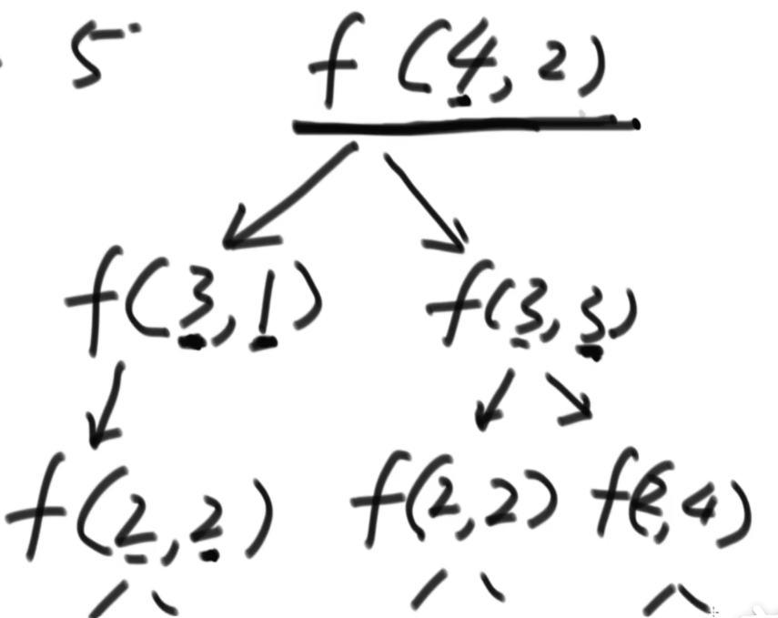

## 一、题目一

假设现在有 1~ N 总共N个位置，现在有一个机器人：机器人从S位置出发，经过K步到达E位置。规定机器人每次必须走一步，要么向左走、要么向右走。特别的，如果机器人当前在1位置就只能向右走，如果在N位置就只能向左走。求机器人总共有多少种走法。

### 1.1 解法一：暴力尝试

```go
// N与E是固定值, N表示需要走的总步数   E表示目标地点
// left与right也是固定值，分别表示左边界与右边界
// 返回值为走法个数
func RobotWalk(N, E int, left, right int) int {
	if E < left || E > right {
		fmt.Printf("目标位置%d不在范围(%d ~ %d)内\n", E, left, right)
		return 0
	}
	return robotWalk(N, E, N, left, left, right)
}

// res表示剩余需要走的步数
// cur表示当前位置
func robotWalk(N, E, res, cur int, left, right int) int {
	if res == 0 { // 走完全程
		if cur == E { // 当前位置在E上,表示此走法可行
			return 1
		} else {
			return 0
		}
	}
	if cur == left { // 当前在左边界位置的话，下一步只能往右走
		return robotWalk(N, E, res-1, left+1, left, right)
	}
	if cur == right { // 当前在右边界位置的话，下一步只能往左走
		return robotWalk(N, E, res-1, right-1, left, right)
	}
	return robotWalk(N, E, res-1, cur-1, left, right) + robotWalk(N, E, res-1, cur+1, left, right) // 正常情况下，分左右两种可能
}
```

这种暴力递归的方式虽然简单，但是存在许多重复情况的计算，我们省去对固定参数N和E的表示：




如上图所示，在递归的过程中，重复出现了 f(2,2)的递归计算（意味着当前在2位置，还剩两步需要走）。

如果我们能对每一种递归的结果值进行一个留存记录，当次递归情况重复出现时，就不需要进行相同的计算而是可以直接多去留存值即可。

### 1.2 解法二：记忆化缓存搜索

```go
// 暴力递归+记忆化缓存
func RobotWalkMemoryCache(N, E int, left, right int) int {
	if E < left || E > right {
		fmt.Printf("目标位置%d不在范围(%d ~ %d)内\n", E, left, right)
		return 0
	}

	dpMemory := make([][]int, N+1) // dpMemory即是记忆化缓存
	for i := 0; i <= N; i++ {      // 横坐标表示当前剩余步数，总是在0~N之间
		dpMemory[i] = make([]int, right+1)
		for j := left; j <= right; j++ { // 纵坐标表示当前位置，总是在left~right之间
			dpMemory[i][j] = -1
		}
	}
	return robotWalkMemoryCache(N, E, dpMemory, N, left, left, right)
}

func robotWalkMemoryCache(N, E int, dpMemory [][]int, res int, cur int, left, right int) int {
	//if res < 0 || res > N {
	//	fmt.Println("横坐标越界访问....,res = ", res)
	//	return -1
	//}
	//if cur < left || cur > right {
	//	fmt.Printf("纵坐标(%d ~ %d)越界访问....,cur = %d \n", left, right, cur)
	//	return -1
	//}
	if dpMemory[res][cur] != -1 { // 缓存命中( 为1 或者 为0)
		return dpMemory[res][cur]
	}
	if res == 0 { // 走完全程，1表示此走法可行，0表示此走法不可行
		if cur == E {
			dpMemory[res][cur] = 1
		} else {
			dpMemory[res][cur] = 0
		}
		return dpMemory[res][cur]
	}
	if cur == left { // 当前在左边界,下一步只能向右走
		dpMemory[res][cur] = robotWalkMemoryCache(N, E, dpMemory, res-1, left+1, left, right)
	} else if cur == right { // 当前在右边界,下一步只能向左走
		dpMemory[res][cur] = robotWalkMemoryCache(N, E, dpMemory, res-1, right-1, left, right)
	} else { // 普通情况，分为向左、向右两种情况
		dpMemory[res][cur] = robotWalkMemoryCache(N, E, dpMemory, res-1, cur+1, left, right) +
			robotWalkMemoryCache(N, E, dpMemory, res-1, cur-1, left, right)
	}
	return dpMemory[res][cur]
}
```

### 1.3 解法三：严格表结构

假设现在有 1 2 3 4 5 五个位置，起始时位于2位置，剩余4步需要走，需要求解到位置4时的所有走法。我们可以画出下面的表结构：

行表示当前所处的位置，列表示剩余的步数

| rest/cur |  0   |  1   |     2      |  3   |  4   |  5   |
| :------: | :--: | :--: | :--------: | :--: | :--: | :--: |
|    0     |  x   |  0   |     0      |  0   |  1   |  0   |
|    1     |  x   |      |            |      |      |      |
|    2     |  x   |      |            |      |      |      |
|    3     |  x   |      |            |      |      |      |
|    4     |  x   |      | 目标求解值 |      |      |      |

 根据初始条件，可以获取一些位置的返回值：

1. cur = 0是不存在的，因此对应的列全部为`x`，表示无效（因为不会停留在0位置之上）
2. rest = 0 时，只有当cur = 4时，返回值为1，否则都为0
3. cur = 2 ， res =4 正是当前问题需要求解的目标值。

''

再对其他三类情况进行分析：

1. 如果当前cur = 1 、rest = k，那么此时的返回值仅依赖于 cur = 2 ，rest = k-1(即右上方的格子)
2. 如果当前cur = N 、rest =k，那么此时的返回值仅依赖于 cur = N-1 ,rest = k-1(即左上方的格子)
3. 如果当前为普通情况，cur = m( 2~ N-1 之间)，rest =k，那么此时的返回值等于 cur = m-1 ,rest = k-1 和  cur = m+1 ,rest = k-1 这两种情况返回值之和(即左上方与右上方格子之和)

根据我们的分析，可以一行一行进行计算：

- 第1行：

| rest/cur |  0   |  1   |     2      |  3   |  4   |  5   |
| :------: | :--: | :--: | :--------: | :--: | :--: | :--: |
|    0     |  x   |  0   |     0      |  0   |  1   |  0   |
|    1     |  x   |  0   |     0      |  1   |  0   |  1   |
|    2     |  x   |      |            |      |      |      |
|    3     |  x   |      |            |      |      |      |
|    4     |  x   |      | 目标求解值 |      |      |      |

- 第2行：

| rest/cur |  0   |  1   |     2      |  3   |  4   |  5   |
| :------: | :--: | :--: | :--------: | :--: | :--: | :--: |
|    0     |  x   |  0   |     0      |  0   |  1   |  0   |
|    1     |  x   |  0   |     0      |  1   |  0   |  1   |
|    2     |  x   |  0   |     1      |  0   |  2   |  0   |
|    3     |  x   |      |            |      |      |      |
|    4     |  x   |      | 目标求解值 |      |      |      |

- 第3行：

| rest/cur |  0   |  1   |     2      |  3   |  4   |  5   |
| :------: | :--: | :--: | :--------: | :--: | :--: | :--: |
|    0     |  x   |  0   |     0      |  0   |  1   |  0   |
|    1     |  x   |  0   |     0      |  1   |  0   |  1   |
|    2     |  x   |  0   |     1      |  0   |  2   |  0   |
|    3     |  x   |  1   |     0      |  3   |  0   |  2   |
|    4     |  x   |      | 目标求解值 |      |      |      |

- 第4行：

| rest/cur |  0   |  1   |       2        |  3   |  4   |  5   |
| :------: | :--: | :--: | :------------: | :--: | :--: | :--: |
|    0     |  x   |  0   |       0        |  0   |  1   |  0   |
|    1     |  x   |  0   |       0        |  1   |  0   |  1   |
|    2     |  x   |  0   |       1        |  0   |  2   |  0   |
|    3     |  x   |  1   |       0        |  3   |  0   |  2   |
|    4     |  x   |  0   | 目标求解值 = 4 |  0   |  5   |  0   |

根据一行一行的计算，最终得出求解的目标值的走法数 = 4。

```go
func RobotWalk3(N, E int, left, right int) int {
	if E < left || E > right {
		fmt.Printf("目标位置%d不在范围(%d ~ %d)内\n", E, left, right)
		return 0
	}
	table := make([][]int, N+1) // 严格表结构：横坐标表示当前剩余步数，范围是0~N；纵坐标表示当前位置，范围是0~right之间
	for i := 0; i <= N; i++ {   //
		table[i] = make([]int, right+1)
	}

	// 根据初始条件得到第0行的数据(第零行只有(0,E)=1，其余都为0)  (left列左侧的全部列不应参与)
	for col := left; col <= right; col++ {
		if col == E {
			table[0][col] = 1
		} else {
			table[0][col] = 0
		}
	}
	for line := 1; line <= N; line++ { // 从第1行到第N行进行迭代  (left列左侧的全部列不应参与)
		for col := left; col <= right; col++ {
			if col == left { // 特殊：当前在left位置，那么具体的路径数只取决于left+1位置
				table[line][left] = table[line-1][left+1]
				continue
			}
			if col == right { // 特殊：当前在right位置，具体的路径数只取决于right-1位置
				table[line][right] = table[line-1][right-1]
				continue
			}
			// 正常情况，具体的路径数同时取决于col-1和col+1位置
			table[line][col] = table[line-1][col-1] + table[line-1][col+1]
		}
	}
	return table[N][left]
}
```

#### 1.3.1 时间复杂度

此种方法的时间复杂度为 K*M (K是初始步数，M是位置个数)

相较于暴力DP有很大的提升，暴力DP的时间复杂度为 2^k，也就是求解一颗深度为K（K为初始步数）的满二叉树

## 二、题目二

假设现在有若干个硬币[ 2 3 5 9 4 7]，要求凑齐10块钱但使用最少数目的硬币数。

这个题目中凑齐10块钱，可能的拼凑方法有：

1.  [2 3 5]
2. [ 3 7 ]

数量最少得是[3 7]，需要使用2枚硬币。

### 2.1 解法一：暴力DP

```go
func MinCoin(coinSet []int, target int) int {
	if target < 1 {
		return -1
	}

	return minCoin(coinSet, target, 0, 0, 0)
}

func minCoin(coinSet []int, target int, index int, curWorth int, curCoin int) int {
	if curWorth == target { // 边界条件一:一旦凑齐target金额，立刻返回总共所需的硬币数（重要：必须在边界条件二之前）
		return curCoin
	}
	if index >= len(coinSet) { // 边界条件二:遍历完所有的硬币，也没能凑成target金额
		return -1
	}
	if curWorth > target { // 边界条件三:一旦当前金额大于target，立即返回-1，表明此分支不可用
		return -1
	}
	yao := minCoin(coinSet, target, index+1, curWorth+coinSet[index], curCoin+1)
	buyao := minCoin(coinSet, target, index+1, curWorth, curCoin)

	if yao == -1 && buyao == -1 { // 两种情况都返回-1，表明都无法凑齐target金额
		return -1
	} else if buyao == -1 { // 只有"不要"这种情况无法凑齐target金额，那么就返回"要"这种情况所需的硬币总数
		return yao
	} else if yao == -1 { // 只有"要"这种情况无法凑齐target金额，那么就返回"不要"这种情况所需的硬币总数
		return buyao
	} else { // 两种情况都可以凑齐target金额，那么返回所需硬币数最小的情况
		if yao < buyao {
			return yao
		} else {
			return buyao
		}
	}
}
```

### 2.2 解法二：记忆化缓存搜索

```go
func MinCoinMemoryCache(coinSet []int, target int) int {
	if target < 1 {
		return -1
	}
	dpMemory := make([][]int, len(coinSet)+1) //
	for i := 0; i < len(coinSet)+1; i++ {     // 横坐标表示当前本轮选中的硬币
		dpMemory[i] = make([]int, target+1) // 纵坐标表示当前剩余需要的钱数(必然在 0 ~ target范围内)，不能使用已搜集钱数作为纵坐标(因为范围不止0~target)
		for j := 0; j <= target; j++ {
			dpMemory[i][j] = -1
		}
	}
	return minCoinMemoryCache(coinSet, target, 0, target, dpMemory)
}

func minCoinMemoryCache(coinSet []int, target int, index int, rest int, dpMemory [][]int) int {
	if rest == 0 { // 边界条件一:一旦凑齐target金额，立刻返回总共所需的硬币数（重要：必须在边界条件二之前）
		dpMemory[index][0] = 0 // 等于0表示当凑齐target之和，不会额外再花任何一枚硬币
		return 0
	}
	if index >= len(coinSet) { // 边界条件二:遍历完所有的硬币，也没能凑成target金额
		return -1
	}
	if rest < 0 { // 边界条件三:一旦当前金额大于target，立即返回-1，表明此分支不可用
		return -1
	}
	// target金额没有凑满，同时也不是边界条件
	if dpMemory[index][rest] != -1 { // 缓存命中
		return dpMemory[index][rest]
	}
	// 缓存未命中，也就是新情况
	// 金币不够(即rest > 0)
	yao := minCoinMemoryCache(coinSet, target, index+1, rest-coinSet[index], dpMemory)
	buyao := minCoinMemoryCache(coinSet, target, index+1, rest, dpMemory)

	if yao == -1 && buyao == -1 {
		dpMemory[index][rest] = -1
	} else if buyao == -1 {
		dpMemory[index][rest] = yao + 1 // 注意：必须+1，表示将yao这种情况要的硬币也加上
	} else if yao == -1 {
		dpMemory[index][rest] = buyao
	} else {
		if yao+1 < buyao { // 注意：必须是 yao+1 和 buyao 这两种情况进行比较
			dpMemory[index][rest] = yao + 1
		} else {
			dpMemory[index][rest] = buyao
		}
	}
	return dpMemory[index][rest]
}
```

### 2.3 解法三：严格表结构

假设硬币数组是 [2 3 5 7 2]，目标硬币数值是10，求凑齐所需的最少硬币数。构建的表结构如下：

| index/rest |    0 |  1   |  2   |  3   |  4   |  5   |  6   |  7   |  8   |  9   |     10     |
| :--------: | ---: | :--: | :--: | :--: | :--: | :--: | :--: | :--: | :--: | :--: | :--------: |
|     0      |    0 |      |      |      |      |      |      |      |      |      | 目标求解值 |
|     1      |    0 |      |      |      |      |      |      |      |      |      |            |
|     2      |    0 |      |      |      |      |      |      |      |      |      |            |
|     3      |    0 |      |      |      |      |      |      |      |      |      |            |
|     4      |    0 |      |      |      |      |      |      |      |      |      |            |
|     5      |    0 |  -1  |  -1  |  -1  |  -1  |  -1  |  -1  |  -1  |  -1  |  -1  |     -1     |

行rest表示剩余需要凑的硬币数额

列index表示当前正在扫描硬币数组的哪一个硬币

根据初始条件：

1. 如果rest = 0，那么无论index为多少，都不会选择该硬币，因此返回值都为0  `dp[index][0] = 0`
2. 如果index =5 , 因为超出了硬币数组有效范围，是无效情况，因此返回值都为-1 `dp[5][rest] = -1`
3. `dp[0][10]`是我们最终要求解的目标值。当前位于0位置，需要凑齐10数额的硬币。


对于其余的情况（假设为`dp[i][j]`），其值来源于两种可能：

1. `dp[i+1][j]`，也就是下方的格子
2. `dp[i+1][j-arr[i]]`，位于下一列左下方的格子(左偏`arr[i]`)

如果上述两种情况都为-1，则`dp[i][j]`也是-1；如果仅有一个为-1，`dp[i][j]`等于不为-1的那个；如果都为有效值，`dp[i][j]`等于较小的那一个（当然，如果来源是`dp[i+1][j-arr[i]]`,那么值需要+1）

```go
func MinCoinStrictTable(coinSet []int, target int) int {
	if target < 1 {
		return -1
	}

	table := make([][]int, len(coinSet)+1) // 横坐标是coinSet中硬币的下标
	for i := 0; i < len(coinSet)+1; i++ {
		table[i] = make([]int, target+1) // 纵坐标是剩余钱数 (0~target)
	}

	for line := 0; line < len(coinSet)+1; line++ { // 第一列都为0，表示当剩余钱数为零时，任何硬币都不会被选
		table[line][0] = 0
	}
	for col := 1; col < target+1; col++ { // 最后一行(除了最后一行的第一列)都为-1，表示：剩余钱数不为0，但是已经没有硬币了，说明是失败分支
		table[len(coinSet)][col] = -1
	}

	for line := len(coinSet) - 1; line >= 0; line-- { // 从倒数第二行开始，向上计算
		for col := 1; col <= target; col++ {
			yao := -1
			if col-coinSet[line] >= 0 { // 第二维索引可能为负(硬币数值超额)
				yao = table[line+1][col-coinSet[line]] // 如果要当前硬币，那么当前结果取决于这个(左下方)
			}
			buyao := table[line+1][col] // 如果不要当前硬币，那么当前结果取决于这个(正下方)

			if yao == -1 && buyao == -1 {
				table[line][col] = -1
			} else if buyao == -1 {
				table[line][col] = yao + 1
			} else if yao == -1 {
				table[line][col] = buyao
			} else {
				if yao+1 > buyao { // 重要：这里是 yao+1 和 buyao 这两种情况选择小的（而不是yao和buyao进行比较）
					table[line][col] = buyao
				} else {
					table[line][col] = yao + 1 // 重要：一定要+1，作用是加上当前这个要的硬币
				}
			}
		}
	}
	return table[0][target] // 目标探测值(横坐标为0表示当前还没有遍历任何硬币，纵坐标为target表示当前剩余钱数没有任何减少)
}
```


### 2.4 严格表结构求解思路

1. 找出可变参量（也是表格的维度）
2. 确定目标求解值是哪一个格子
3. 根据base case 实现填充表格
4. 找出其他正常情况的相互依赖关系
5. 确定正常情况格子的求解顺序

## 三、题目三

### 3.1 解法一：暴力DP

​	给定一个整形数组arr，所有数值不同纸牌排成一条线。玩家A和玩家B依次拿走每张纸牌，规定玩家A先拿，玩家B后拿，但是每个玩家每次只能拿走最左或者最右的纸牌，玩家A和玩家B都绝顶聪明。请返回最后获胜者的分数。

```go
func CardWin(cards []int) int {
	if cards == nil || len(cards) == 0 {
		return -1
	}
	return getMax(First(cards, 0, len(cards)-1), Second(cards, 0, len(cards)-1))
}

func First(cards []int, left, right int) int {
	if left == right {
		return cards[left]
	}
	leftScore := cards[left] + Second(cards, left+1, right)
	rightScore := cards[right] + Second(cards, left, right-1)

	return getMax(leftScore, rightScore)
}

func Second(cards []int, left, right int) int {
	if left == right {
		return 0
	}
	leftScore := First(cards, left+1, right)
	rightScore := First(cards, left, right-1)

	return getMin(leftScore, rightScore)
}
```

### 3.2 解法二：严格表结构

假设arr = [3 100 4 50]。

先手函数 `f` 对应的表结构如下：   (  `i 表示left`    `j表示right`)

| i/j  |  0   |  1   |  2   |     3      |
| :--: | :--: | :--: | :--: | :--------: |
|  0   |  3   |      |      | 目标求解值 |
|  1   |  x   | 100  |      |            |
|  2   |  x   |  x   |  4   |            |
|  3   |  x   |  x   |  x   |     50     |

1. 初始时，`i=0`，`j=3`，因此(0,3)是目标求解值

2. 因为此类型问题中，`i`不可能大于`j`，因此左下角区域都是无效值。
3. 当`i == j`，单元格取值是arr[i]

后手函数`s`对应的表结构如下：

| i/j  |  0   |  1   |  2   |     3      |
| :--: | :--: | :--: | :--: | :--------: |
|  0   |  0   |      |      | 目标求解值 |
|  1   |  x   |  0   |      |            |
|  2   |  x   |  x   |  0   |            |
|  3   |  x   |  x   |  x   |     0      |

1. 初始时，`i=0`，`j=3`，因此(0,3)是目标求解值

2. 因为此类型问题中，`i`不可能大于`j`，因此左下角区域都是无效值。
3. 当`i == j`，单元格取值是0


对于其他正常的情况，可以利用两个表的对角线上的值，依次项右上方开始求解。

s表的每一个单元格 = f表相同位置单元格的 `min(正下方单元格，正左方单元格)`

f表的每一个单元格 = Max（arr[行坐标]+s表中正下方单元格值，arr[列坐标]+s表中正左方单元格值）

先求一次s表格：

| i/j  |  0   |  1   |  2   |     3      |
| :--: | :--: | :--: | :--: | :--------: |
|  0   |  0   |  3   |      | 目标求解值 |
|  1   |  x   |  0   |  4   |            |
|  2   |  x   |  x   |  0   |     4      |
|  3   |  x   |  x   |  x   |     0      |

再求一次f表格

| i/j  |  0   |  1   |  2   |     3      |
| :--: | :--: | :--: | :--: | :--------: |
|  0   |  3   | 100  |      | 目标求解值 |
|  1   |  x   | 100  | 100  |            |
|  2   |  x   |  x   |  4   |     50     |
|  3   |  x   |  x   |  x   |     50     |

先求一次s表格：

| i/j  |  0   |  1   |  2   |     3      |
| :--: | :--: | :--: | :--: | :--------: |
|  0   |  0   |  3   | 100  | 目标求解值 |
|  1   |  x   |  0   |  4   |     50     |
|  2   |  x   |  x   |  0   |     4      |
|  3   |  x   |  x   |  x   |     0      |

再求一次f表格

| i/j  |  0   |  1   |  2   |     3      |
| :--: | :--: | :--: | :--: | :--------: |
|  0   |  3   | 100  |  7   | 目标求解值 |
|  1   |  x   | 100  | 100  |    104     |
|  2   |  x   |  x   |  4   |     50     |
|  3   |  x   |  x   |  x   |     50     |

先求一次s表格：

| i/j  |  0   |  1   |  2   |  3   |
| :--: | :--: | :--: | :--: | :--: |
|  0   |  0   |  3   | 100  |  7   |
|  1   |  x   |  0   |  4   |  50  |
|  2   |  x   |  x   |  0   |  4   |
|  3   |  x   |  x   |  x   |  0   |

再求一次f表格

| i/j  |  0   |  1   |  2   |  3   |
| :--: | :--: | :--: | :--: | :--: |
|  0   |  3   | 100  |  7   | 150  |
|  1   |  x   | 100  | 100  | 104  |
|  2   |  x   |  x   |  4   |  50  |
|  3   |  x   |  x   |  x   |  50  |

**结论：后手结果是7，先手结果是150**