## 一、二叉搜索树(`BST`)

## 二、`AVL`树(平衡二叉树)

### 2.1 平衡条件

​	任何一个节点，其左子树与右子树高度之差不能大于1（只能是0、-1、1三者中的一种）

### 2.2 平衡方式

​	LL旋转、RR旋转、LR旋转、RL旋转

## 三、红黑树

## 四、SB树

### 4.1 平衡条件

​	任何一个叔叔树的高度必须要大于等于其所有侄子树的高度

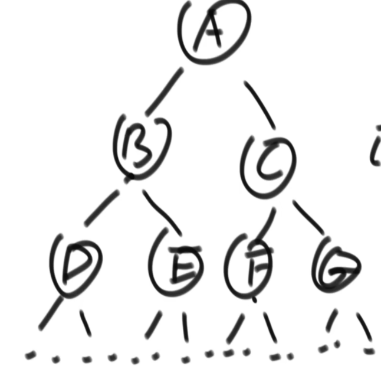

上面这棵树，SB树的平衡条件要求 Height(B) >= max( Height(F)，Height(G) )。其余节点也都要满足像B树这样的条件（只要该树有侄子树）

### 4.2 平衡方式

上述SB树不平衡的条件有以下四种：

1. `Size of A > size of R`   `LL型`

2. `Size of B > size of R`   `LR型`

3. `Size of C > size of L`   `RL型`

4. `Size of D > size of L`   `RR型`

假设Ｍaintain (T) 用于修复以 T 为根的 SBT，Ｍaintain (T) 步骤如下：

#### 4.2.1 对于`LL`型，调整方式如下：

在下图中，就是说 s[A]>s[R]   

1. 首先执行右旋（Right-Rotate (T)）可得   

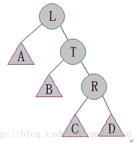

2. 需要对所有孩子节点有变化的节点进行再调整，也就是递归调用Ｍaintain() ---  从下往上(先T后L)

   1. T节点孩子节点发生变化，需要执行Ｍaintain (T) 
   2. L节点孩子节点发生变化，需要执行Ｍaintain (L)

   

#### 4.2.2  对于`LR`型，调整方式如下：

在下图中，也就是说 s[B]>s[R]   

1. 先执行左旋Left-Rotate(L)。如下图   

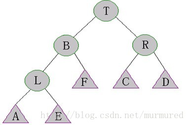

2. 再执行右旋Right-Rotate(T)，如下图：   

3. 在整个过程中，孩子节点发生变化的有：L 、T  、B ---  从下往上(先L 、T后B)

   1. 执行Maintain (L) 
   2. 执行Maintain (T)
   3. 执行Maintain (B)  

   

#### 4.2.3 对于`RL`型，调整方式如下：

除了第一步是右旋调整，其余与`LR`型一样

#### 4.2.4 对于`RR`型，调整方式与`LL`型一样

除了第一步是左旋调整，其余与`LR`型一样

## 五、跳表

### 5.1 定义

跳表，又叫做跳跃表、跳跃列表，在有序链表的基础上增加了“跳跃”的功能

跳表在原来的有序链表上加上了多级索引，通过索引来快速查找；可以支持快速的删除、插入和查找操作。

对比平衡树, 跳表的实现和维护会更加简单, 跳表的搜索、删除、添加的平均时间复杂度是 O(logn)

### 5.2 跳表的数据结构图型

对于一个单链表来讲，即使链表中存储的数据是有序的，如果我们想要在其中查找某个数据，也只能从头开到尾的遍历，查询效率低，时间复杂度是O(n)。

跳表在单链表基础之上引入了“层”的概念，同一层上再加入索引（每一层都是一个单链表）

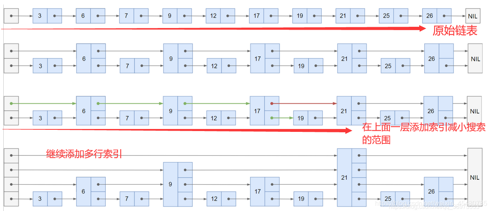

### 5.3 跳表的搜索

> 跳表查找任意数据的时间复杂度为O(logn)

搜索的步骤如下：

1. 总是先从最高层层链表的首元素(首节点)开始，从左往右搜索，直至找到一个大于或等于目标的元素，或者到达当前层链表的尾部(指向nil尾节点)
2. 如果该元素等于目标元素，则表明该元素已被找到
3. 如果该元素大于目标元素或已到达链表的尾部，则退回到**当前层**的前一个元素，然后转入下一层进行搜索

比如我们要查找25是否存在于跳表中：

1. 从首节点的最高层开始，下一个节点是21，再下一个是尾节点nil，没查到，转到21的下一层
2. 下一层依旧指向尾节点，没查到，转到21的再下一层
3. 下一层指向26，比25要大，退回到21，没查到，转到21的再下一层
4. 下一层指向25，找到了

比如我们要查找17是否存在于跳表中：

1. 从首节点的最高层开始，下一个节点是21，比17大，退回到首节点，转到下一层
2. 下一层指向9，下一个是21，比17大，退回到9，转到下一层
3. 下一层指向17，找到了。

### 5.4 跳表的插入

> 跳表插入的时间复杂度为：O(logn)，支持高效的动态插入。

元素在进行插入之前，首先需要通过查找找到需要插入的位置，也就是找到待插入节点的前置节点（仅小于待插入节点）

比如下面这个跳表中我们要插入`元素18`

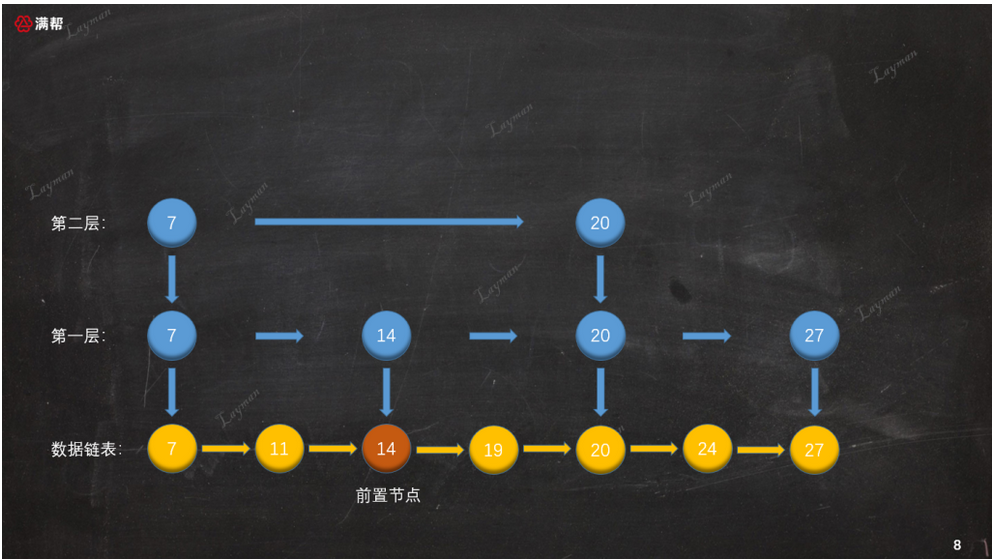

1. 我们从最底层的链表查询，查到18的前置节点是14，那么就在14与19之间插入18

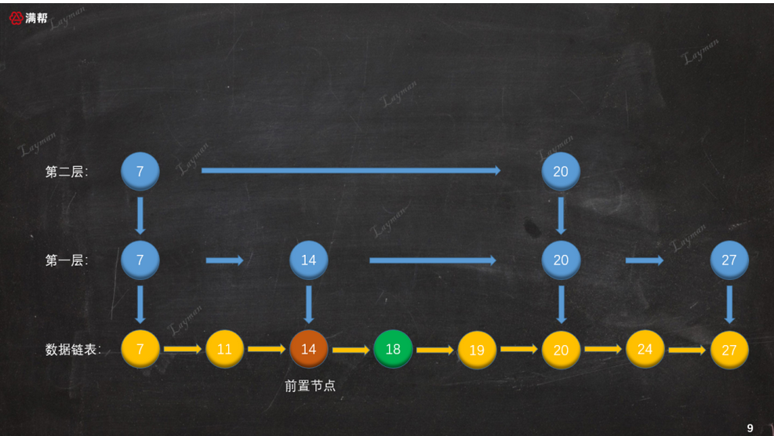

2. 接着需要让这个新插入的节点18进行随机(抛硬币的方式)“晋升”：
   1. 在第一层抛硬币，0.5的概率在第一层晋升成功，如果成功将18在第一层建立索引（插入到第一层的14与20之间）
   2. 在第二次抛硬币，0.5的概率在第二层晋升成功，如果成功将18在第二层建立索引（插入到第二层的7与20之间）
   3. 一旦晋升失败，晋升过程将在此层终止，后续不在进行晋升

下图为18在第一、二层晋升成功，在第三次晋升失败的样子：

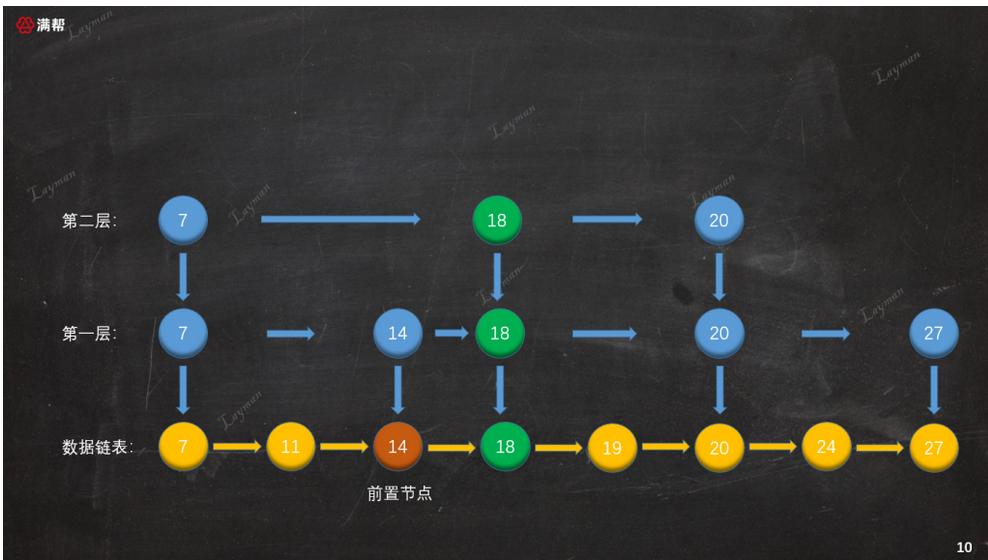

下图为18在第一、二、三层晋升成功，在第四次晋升失败的样子：

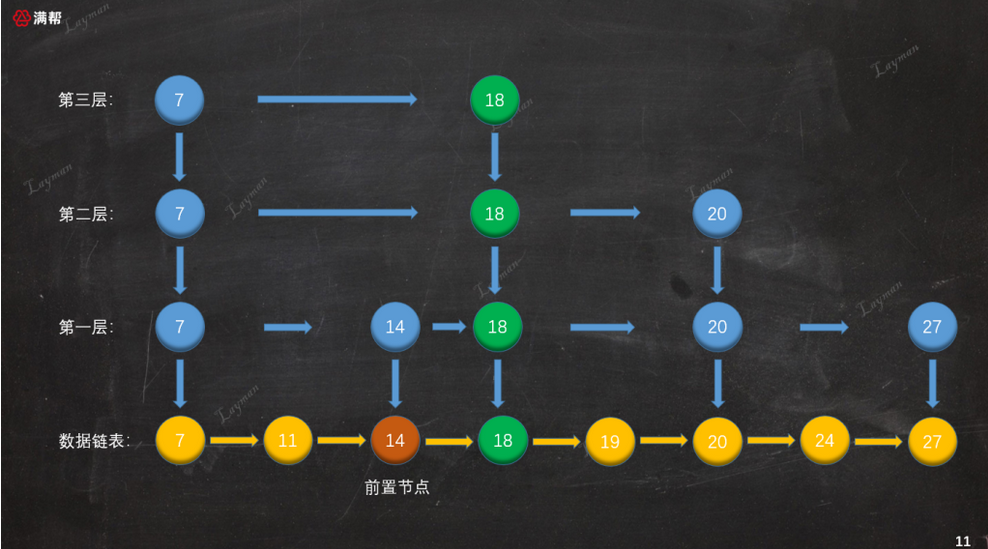

### 5.4 跳表的删除

假设要删除的节点是18：

1. 先查询，查询18是否存在跳表中，如果不存在直接返回，如果存在继续进行下面的删除操作

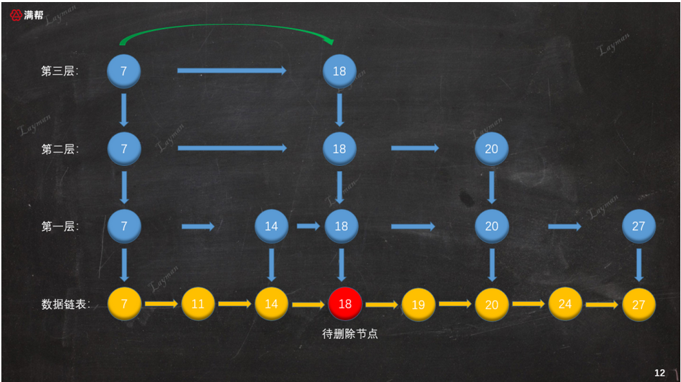

2. 将节点18从最底层的数据链表中删除

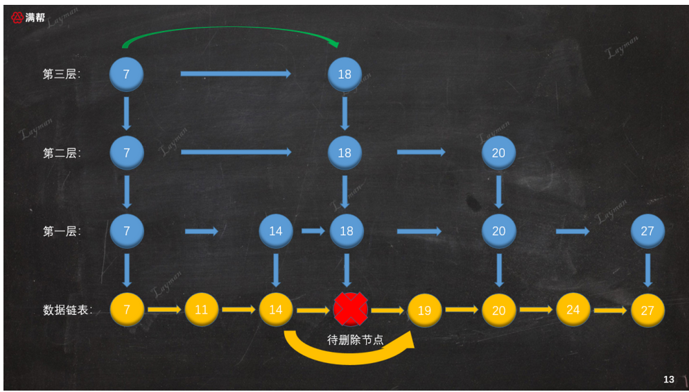

3. 从下往上，删除18在各索引层的记录。既要删除节点18本身，也要重新维护前直节点的指向关系。

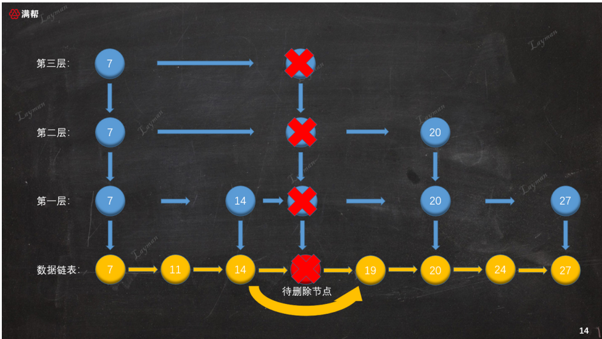

尤其需要注意，第三层在删除18后，只剩下head节点，因此需要将该索引层整体删除：

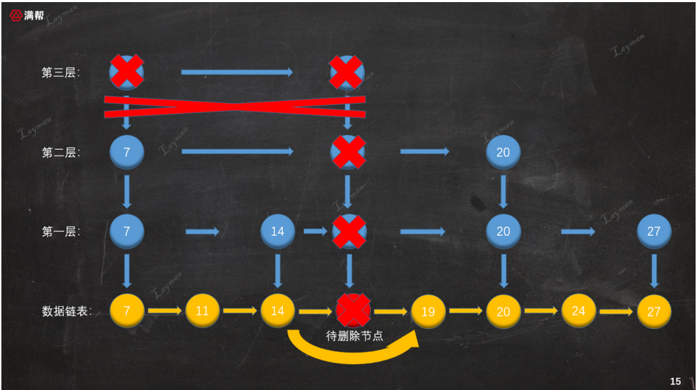

4. 至此，完成删除操作，此时跳表结构和之前插入18之前保持一致了。

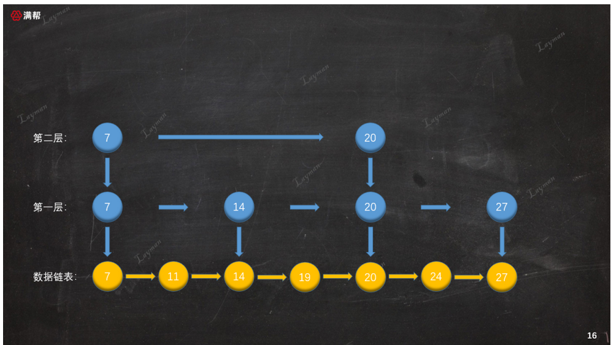
