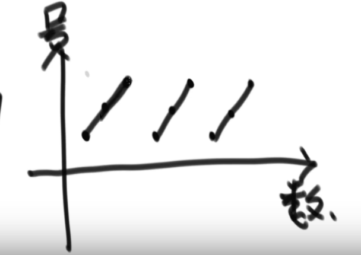
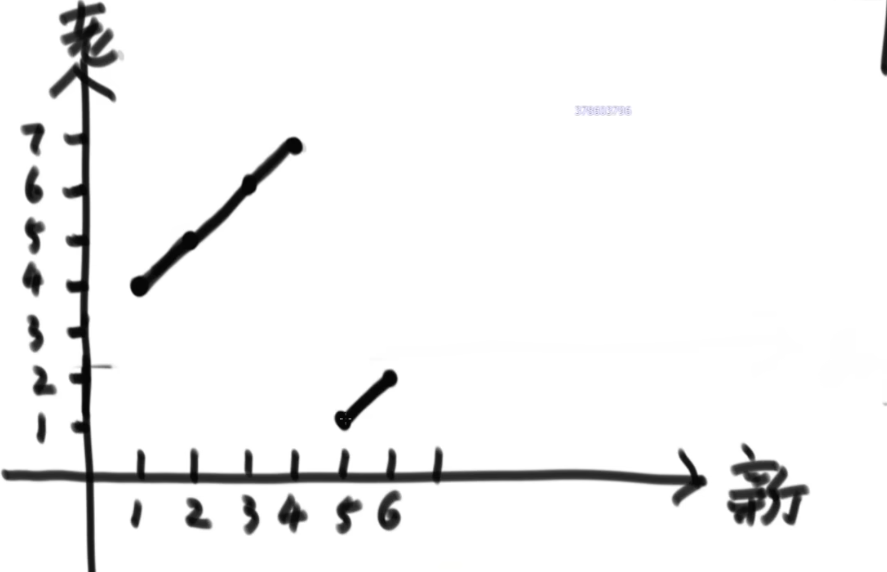
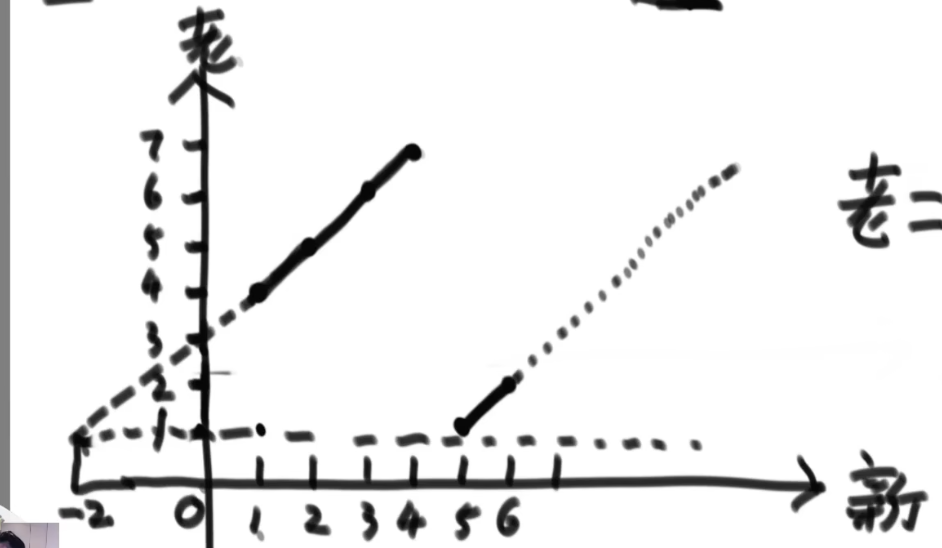
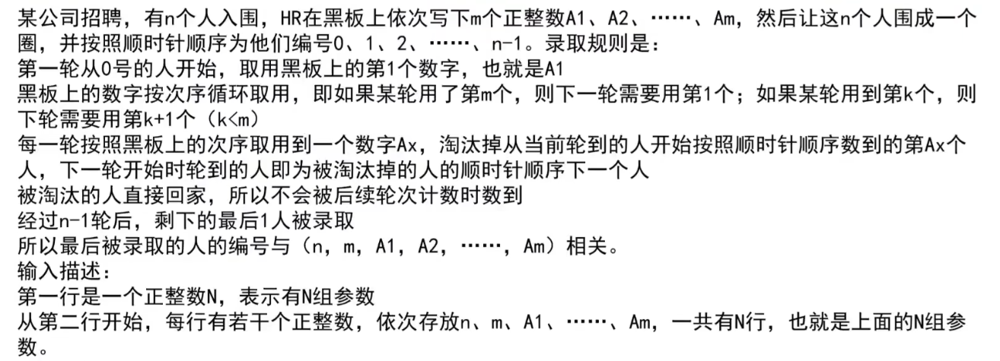
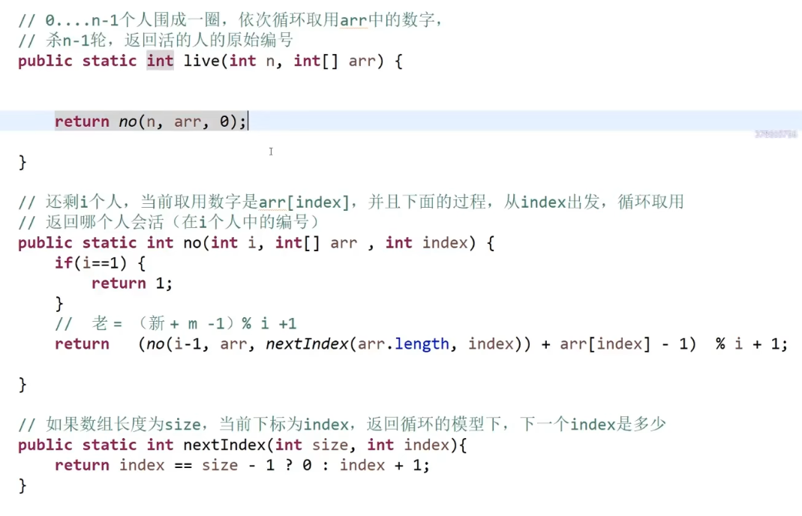

## 一、问题一

约瑟夫环问题：

一个圈共有N个人（N为不确定的数字），假设将第一个人的编号设置为1号，那么第二个人的编号就为2号，第三个人的编号就为3号，第N个人的编号就为N号，现在提供一个数字M，第一个人开始从1报数，第二个人报的数就是2，依次类推，报到M这个数字的人出局，紧接着从出局的这个人的下一个人重新开始从1报数，和上面过程类似，报到M的人出局，直到N个人全部出局。

因此约瑟夫环中总会有最后一个人幸存下来，我们要求的问题就是：

如何在游戏一开始的时候就知道谁必定会活下来？

```
第一步：
假设现在有3个人，编号 1 2 3，绕着环进行报数，报数与编号的关系是：

	报数		编号
	 1		   1
	 2		   2
	 3		   3
	 4		   1
	 5		   2
	 6		   3
	 7		   1
	 ……
用图像表示就是，如下：(一个锯齿状图形)
关系表达式为 :  报数 = (编号-1)%i + 1   i是节点总个数
```



```
第二步：
假设现在有7个人，编号1~7，假设m = 3，那么玩完一轮3出局，则第一轮与第二轮报数对应关系为：
1 2 3 4 5 6 7
5 6   1 2 3 4
关系图像为：
```



```
续第二步：
将上述图延长，发现此图是 报数-编号  图像向左平移3个单位
因此此图像对应的关系表达式为: 上一轮报数 = ((下一轮报数+3)-1)%i + 1 ， 这个3就是被出局的节点(假设用s表示)
则： 上一轮编号 = ((下一轮编号+s)-1)%i + 1
而s是上一轮编号为m的人，则根据 报数 = (编号-1)%i + 1 ， s = (m-1)%i + 1

最终可得： 上一轮报数 = (下一轮报数 + (m-1)%i )%i + 1  = (下一轮报数 + m-1)%i + 1
```



```
结论：
上一轮报数 = (下一轮报数 + m-1)%i + 1

对于最后存活的节点，他的报数肯定是1，我们可以从最后一轮逐步向上计算，得到这个存活节点在第一轮时的报数是多少(第一轮报数 == 本身的编号)。方法既可以是递归，也可以是迭代。
```

## 二、问题二



这个题实际是对题目一的改进：将m由固定值变为动态值（取值范围是一个数组，也就是A1 、A2、……、Am这m个数按序当选m，转完一圈后再从头开始）。

整体的实现代码如下：

