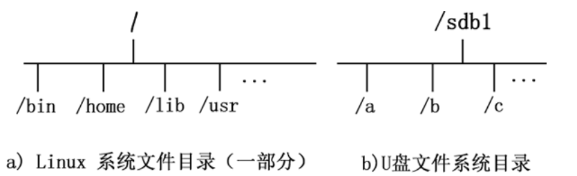
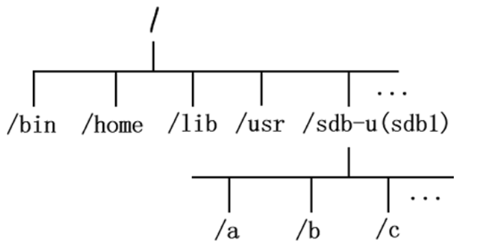

## 一、为什么设备需要挂载？

Linux 系统中“一切皆文件”，所有文件都放置在以根目录为树根的树形目录结构中。在 Linux 看来，**任何硬件设备也都是文件，它们各有自己的一套文件系统（文件目录结构）**。

因此产生的问题是，当在 Linux 系统中使用这些硬件设备时，**只有将Linux本身的文件目录与硬件设备的文件目录合二为一，硬件设备才能为我们所用**。**合二为一的过程称为“挂载”**。

> 如果不挂载，通过Linux系统中的图形界面系统可以查看找到硬件设备，但命令行方式无法找到。

所谓挂载，指的就是**将设备文件中的顶级目录连接到 Linux 根目录下的某一目录（最好是空目录）**，**访问此目录就等同于访问设备文件**。

## 二、挂载文件如何选择？

​	并不是根目录下任何一个目录都可以作为挂载点，由于**挂载操作会使得原有目录中已有的文件被隐藏**，因此**根目录以及系统原有目录都不要作为挂载点，会造成系统异常甚至崩溃**，挂载点**最好是新建的空目录**。

​	举个例子，我们想通过命令行访问某个 U 盘中的数据，图 1 所示为 U 盘文件目录结构和 Linux 系统中的文件目录结构。

​	图 1 中可以看到，目前 U 盘和 Linux 系统文件**分属两个文件系统**，还**无法使用命令行找到 U 盘文件**，**需要将两个文件系统进行挂载**。

​	接下来，我们在**根目录下新建一个目录 /sdb-u**，通过**挂载命令将 U 盘文件系统挂载到此目录**，挂载效果如图 2 所示。

​	可以看到，**U 盘文件系统已经成为 Linux 文件系统目录的一部分，此时访问 /sdb-u/ 就等同于访问 U 盘。**

 	前面讲过，**根目录下的 /dev/ 目录文件负责所有的硬件设备文件**，事实上，当 U 盘插入 Linux 后，系统也确实会给 U  盘分配一个目录文件（比如 sdb1），就位于 /dev/ 目录下（/dev/sdb1），但**无法通过 /dev/sdb1/ 直接访问 U  盘数据**，**访问此目录只会提供给你此设备的一些基本信息（比如容量）。**

## 三、总结

总之，Linux 系统使用任何硬件设备，都必须将设备文件与已有目录文件进行挂载。