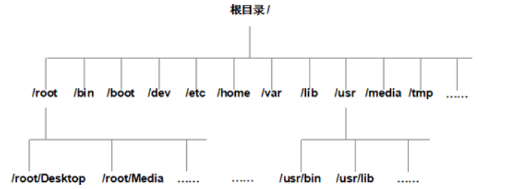

## 一、文件系统的层次结构

​	在 Linux 操作系统中，所有的文件和目录都被组织成以一个根节点“/”开始的倒置的树状结构，如图 1 所示。



​	目录就相当于 Windows 中的文件夹，目录中存放的既可以是文件，也可以是其他的子目录，而文件中存储的是真正的信息。

​	文件系统的最顶层是由根目录开始的，系统使用“/”来表示根目录，在根目录之下的既可以是目录，也可以是文件，而每一个目录中又可以包含（子）目录或文件。如此反复就可以构成一个庞大的文件系统。

​	注意，**目录名或文件名都是区分大小写的**，如 dog、DOG 和 Dog 为 3 个不同的目录或文件。完整的目录或文件路径是由一连串的目录名所组成的，其中**每一个目录由“/”来分隔**。如 cat 的完整路径是 /home/cat。

​	在文件系统中，**有两个特殊的目录**，一个是**用户所在的工作目录，即当前目录，可用一个点“.”表示**；另一个是**当前目录的上一层目录，也叫父目录，用两个点“..”表示**。

> 如果一个目录或文件名是以一个点开始，就表示这个目录或文件是一个隐藏目录或文件。即以默认方式査找（后续会讲查找命令）时，不显示该目录或文件。

## 二、绝对路径与相对路径

### 2.1 绝对路径

​	**绝对路径一定是由根目录 / 开始写起**。例如，使用绝对路径的表示方式指明 bin 文件所在的位置，该路径应写为` /usr/bin`，测试代码如下：

```bash
[root@localhost ~]# bin
bash： bin： command not found   <-- 没有找到
[root@localhost ~]# /usr/bin
bash: /usr/bin: is a directory   <-- 是一个文件
```

​	可以看到，**如果仅传递给 Linux 系统一个文件名，它无法找到指定文件**；而当**将 bin 文件的绝对路径传递 Linux 系统时，它就可以成功找到**。

### 2.2 相对路径

​	**相对路径**不是从根目录 / 开始写起，而是**从当前所在的工作目录开始写起**。使用相对路径表明某文件的存储位置时，**经常会用到前面讲到的 2 个特殊目录，即当前目录（用 . 表示）和父目录（用 .. 表示）。**

## 三、文件(目录)的命名规则

​	在 Linux 系统中，一切都是文件，既然是文件，就必须要有文件名。同其他系统相比，Linux 操作系统对文件或目录命名的要求相对比较宽松：

1. 除了字符“/”之外，所有的字符都可以使用，但是要注意，在目录名或文件名中，使用某些特殊字符并不是明智之举。例如，**在命名时应避免使用  <、>、？、* 和非打印字符等**。**如果一个文件名中包含了特殊字符**，例如空格，那么**在访问这个文件时就需要使用引号将文件名括起来**。
2. 目录名或文件名的长度不能超过 255 个字符。
3. 目录名或文件名是区分大小写的。如 DOG、dog、Dog 和 DOg ，是互不相同的目录名或文件名，但使用字符大小写来区分不同的文件或目录，也是不明智的。
4. 与 Windows 操作系统不同，**文件的扩展名对 Linux 操作系统没有特殊的含义**，换句话说，Linux 系统并不以文件的扩展名开分区文件类型。例如，**`dog.exe` 只是一个文件，其扩展名 `.exe `并不代表此文件就一定是可执行文件。**

​	需要注意的是，在 Linux 系统中，**硬件设备也是文件**，也有各自的文件名称。**Linux 系统内核中的 `udev` 设备管理器会自动对硬件设备的名称进行规范**，目的是让用户通过设备文件的名称，就可以大致猜测处设备的属性以及相关信息。

> `udev 设备管理器`会一直以进程的形式运行，并侦听系统内核发出的信号来管理位于 `/dev `目录下的设备文件.

表 1 罗列出了Linux 系统中常见硬件设备的文件名。

| 硬件设备        | 文件名称                                                     |
| --------------- | ------------------------------------------------------------ |
| `IDE`设备       | `/dev/hd[a-d]`，现在的 `IDE`设备已经很少见了，因此一般的硬盘设备会以 `/dev/sd` 开头。 |
| `SCSI/SATA/U盘` | `/dev/sd[a-p]`，一台主机可以有多块硬盘，因此**系统采用 a~p 代表 16 块不同的硬盘。** |
| 软驱            | `/dev/fd[0-1] `                                              |
| 打印机          | `/dev/lp[0-15]`                                              |
| 光驱            | `/dev/cdrom`                                                 |
| 鼠标            | `/dev/mouse`                                                 |
| 磁带机          | `/dev/st0` 或` /dev/ht0`                                     |