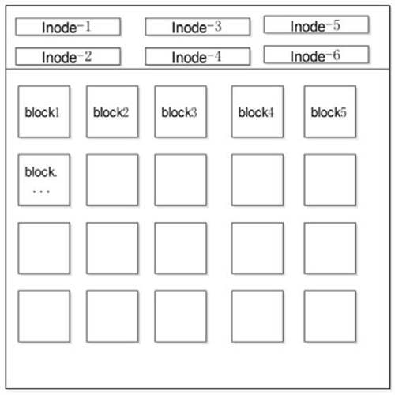

## 一、命令提示符

登录系统后，第一眼看到的内容是：

```shell
[root@localhost ~]#
```

这就是 Linux 系统的命令提示符。那么，这个提示符的含义是什么呢？

- []：这是提示符的分隔符号，没有特殊含义。
- root：显示的是当前的登录用户，笔者现在使用的是 root 用户登录。
- @：分隔符号，没有特殊含义。
- `localhost`：**当前系统的简写主机名（完整主机名是 `localhost.localdomain`）。**
- ~：代表**用户当前所在的目录**，**此例中用户当前所在的目录是家目录（波浪号就是家目录）**。
- \#：命令提示符，Linux 用这个符号**标识登录的用户权限等级**。如果是**超级用户，提示符就是 #**；如果是**普通用户，提示符就是 $**。

**家目录（又称主目录）是什么？** Linux 系统是纯字符界面，用户登录后，要有一个初始登录的位置，这个初始登录位置就称为用户的家：

- 超级用户的家目录：/root。
- 普通用户的家目录：/home/用户名。


**用户在自己的家目录中拥有完整权限**，所以我们也建议操作实验可以放在家目录中进行。我们切换一下用户所在目录，看看有什么效果。

```shell
[root@localhost ~]# cd /usr/local
[root@localhost local]#
```

仔细看，如果切换用户所在目录，那么命令提示符中的会变成**用户当前所在目录的最后一个目录（不显示完整的所在目录 `/usr/ local`，只显示最后一个目录 local)。**

## 二、命令的基本格式

接下来看看 Linux 命令的基本格式:

```
[root@localhost ~]# 命令[选项][参数]
```

命令格式中的 [] 代表可选项，也就是有些命令可以不写选项或参数，也能执行。那么，我们就用 Linux 中最常见的 ls 命令来解释一下命令的格式:

### 2.1 选项的作用

ls 命令之后不加选项和参数也能执行，不过只能执行最基本的功能，即显示当前目录下的文件名。那么加入一个选项，会出现什么结果？

```shell
[root@localhost ~]# Is -l
总用量44
-rw-------.1 root root 1207 1 月 14 18:18 anaconda-ks.cfg
-rw-r--r--.1 root root 24772 1 月 14 18:17 install.log
-rw-r--r--.1 root root 7690 1 月 14 18:17 install.log.syslog
```

如果加一个"-l"选项，则可以看到显示的内容明显增多了。**"-l"是长格式（long list）的意思，也就是显示文件的详细信息。**

Linux 的选项又分为**短格式选项（-l）和长格式选项（--all）**。**短格式选项是英文的简写**，用**一个减号调用**，例如：

```shell
[root@localhost ~]# ls -l
```

而**长格式选项是英文完整单词**，一般**用两个减号调用**，例如：

```shell
[root@localhost ~]# ls --all
```

### 2.2 参数的作用

参数是命令的操作对象，**一般文件、目录、用户和进程等可以作为参数被命令操作**。例如：

```shell
[root@localhost ~]# ls -l anaconda-ks.cfg
-rw-------.1 root root 1207 1 月 14 18:18 anaconda-ks.cfg
```

但是为什么**一开始 ls 命令可以省略参数？那是因为有默认参数**。命令一般都需要加入参数，用于指定命令操作的对象是谁。**如果可以省略参数，则一般都有默认参数。例如：**

```shell
[root@localhost ~]# ls
anaconda-ks.cfg install.log install.log.syslog
```

这个 ls 命令后面没有指定参数，**默认参数是当前所在位置，所以会显示当前目录下的文件名**。

## 三、切换目录

​	Linux 命令按照来源方式，可分为两种，分别是 **Shell 内置命令**和**外部命令**。所谓 Shell 内置命令，就是 Shell  自带的命令，这些命令是没有执行文件的；而**外部命令就是由程序员单独开发的，所以会有命令的执行文件**。Linux 中的绝大多数命令是外部命令，而 cd 命令是一个典型的 Shell 内置命令，所以 cd 命令没有执行文件所在路径。

`cd 命令`的基本格式如下：

```shell
[root@localhost ~]# cd [相对路径或绝对路径]
```

除此之外，cd 命令后面可以跟一些特殊符号，表达固定的含义，如表 1 所示：

| 特殊符号 | 作 用                      |
| -------- | -------------------------- |
| ~        | 代表当前登录用户的主目录   |
| ~用户名  | 表示切换至指定用户的主目录 |
| -        | 代表上次所在目录           |
| .        | 代表当前目录               |
| ..       | 代表上级目录               |

它们的用法分别是：

1. ```shell
   [root@localhost vbird]# cd ~
   #表示回到自己的主目录，对于 root 用户，其主目录为 /root
   [root@localhost ~]# cd
   #没有加上任何路径，也代表回到当前登录用户的主目录
   [root@localhost ~]# cd ~vbird
   #代表切换到 vbird 这个用户的主目录，亦即 /home/vbird
   ```

2. ```shell
   [root@localhost ~]# cd ..
   #表示切换到目前的上一级目录，亦即是 /root 的上一级目录的意思；
   ```
   需要注意的是，在 Linux 系统中，**根目录确实存在 .（当前目录）以及 ..（当前目录的父目录）两个目录**，但由于**根目录是最顶级目录，因此根目录的 .. 和 . 的属性和权限完全一致**，也就是说，**根目录的父目录是自身**。


3. ```shell
   [root@localhost /]# cd -
   #表示回到刚刚的那个目录
   ```

​	如果你仔细观察的话，不难发现，其实在 `[root@localhost ~]` 中，就已经指明了当前所在的目录，**通常刚登陆时会位于自己的主目录中，而 ~ 就表示主目录，因此也就有了通过使用 `cd ~` 可以回到自己的主目录。**

## 四、显示当前路径

`pwd 命令`，是 Print Working Directory （打印工作目录）的缩写，功能是显示用户当前所处的工作目录。该命令的基本格式为：

```shell
[root@localhost ~]# pwd
```

【例 1】

```shell
[root@localhost ~]# whoami
root
[root@localhost ~]# pwd
/root
```

**`whoami 命令`用于确定当前登陆的用户**，后续会做详细介绍。可以看到，root 用户当前所在目录是它的主目录 /root。

【例 2】

```shell
[demo@localhost ~]# whoami
demo
[demo@localhost ~]# pwd
/home/demo
```

以上代码表明，**当前登陆 Linux 系统的是用户 demo**，当前所在目录为 demo 的主目录 `/home/demo`。

注意，在 `[demo@localhost ~]#` 这一部分中，虽然也显示出当前所在的目录（例如 ~ 表示主目录），但此位置只会列出整个路径中最后的那一个目录，比如：

```shell
[root@localhost ~]# cd /var/mail
[root@localhost mail]# pwd
/var/mail
```

## 五、查看目录下文件

ls 命令，list 的缩写，是最常见的目录操作命令，其主要功能是显示当前目录下的内容。此命令的基本格式为：

```shell
[root@localhost ~]# ls [选项] 目录名称
```

表 1 列出了 ls 命令常用的选项以及各自的功能。

| 选项                                        | 功能                                                         |
| ------------------------------------------- | ------------------------------------------------------------ |
| -a                                          | 显示全部的文件，**包括隐藏文件（开头为 . 的文件）也一起罗列出来**，这是最常用的选项之一。 |
| -A                                          | 显示全部的文件，连同隐藏文件，**但不包括 . 与 .. 这两个目录。** |
| -d                                          | **仅列出目录本身，而不是列出目录内的文件数据。**             |
| -f                                          | ls 默认会以文件名排序，使用 -f 选项会直接列出结果，而不进行排序。 |
| -F                                          | 在文件或目录名后加上文件类型的指示符号，例如，* 代表可运行文件，/ 代表目录，= 代表 [socket](http://c.biancheng.net/socket/) 文件，\| 代表 FIFO 文件。 |
| -h                                          | **以人们易读的方式显示文件或目录大小，如 1KB、234MB、2GB 等。** |
| -i                                          | 显示 inode 节点信息。                                        |
| -l                                          | 使用长格式列出文件和目录信息。                               |
| -n                                          | 以 UID 和 GID 分别代替文件用户名和群组名显示出来。           |
| -r                                          | 将排序结果反向输出，比如，若原本文件名由小到大，反向则为由大到小。 |
| -R                                          | 连同子目录内容一起列出来，等於将该目录下的所有文件都显示出来。 |
| -S                                          | 以文件容量大小排序，而不是以文件名排序。                     |
| -t                                          | 以时间排序，而不是以文件名排序。                             |
| --color=never  --color=always  --color=auto | never 表示不依据文件特性给予颜色显示。  always 表示显示颜色，ls 默认采用这种方式。  auto 表示让系统自行依据配置来判断是否给予颜色。 |
| --full-time                                 | 以完整时间模式 （包含年、月、日、时、分）输出                |
| --time={atime,ctime}                        | 输出 access 时间或改变权限属性时间（ctime），而不是内容变更时间。 |

注意，当 ls 命令不使用任何选项时，**默认只会显示非隐藏文件的名称，并以文件名进行排序**，同时会**根据文件的具体类型给文件名配色**（蓝色显示目录，白色显示一般文件）。

```shell
[root@www ~]# ls -al ~
total 156
drwxr-x---  4 root root  4096 Sep 24 00:07 .
drwxr-xr-x 23 root root  4096 Sep 22 12:09 ..
-rw-------  1 root root  1474 Sep  4 18:27 anaconda-ks.cfg
-rw-------  1 root root   955 Sep 24 00:08 .bash_history
-rw-r--r--  1 root root    24 Jan  6  2007 .bash_logout
-rw-r--r--  1 root root   191 Jan  6  2007 .bash_profile
-rw-r--r--  1 root root   176 Jan  6  2007 .bashrc
drwx------  3 root root  4096 Sep  5 10:37 .gconf
-rw-r--r--  1 root root 42304 Sep  4 18:26 install.log
-rw-r--r--  1 root root  5661 Sep  4 18:25 install.log.syslog
```

这里的 ls 命令还使用了 **-l 选项**，因此才**显示出了文件的详细信息**，此选项显示的这 7 列的含义分别是：

1. 第一列：规定了不同的用户对文件所拥有的权限，具体权限的含义将在后续章节中讲解。
2. 第二列：**引用计数**，文件的引用计数代表该文件的硬链接个数，而目录的引用计数代表该目录有多少个一级子目录。
3. 第三列：所有者，也就是这个文件属于哪个用户。默认所有者是文件的建立用户。
4. 第四列：所属组，默认所属组是文件建立用户的有效组，一般情况下就是建立用户的所在组。
5. 第五列：大小，默认单位是字节。
6. 第六列：文件修改时间，文件状态修改时间或文件数据修改时间都会更改这个时间，注意这个时间不是文件的创建时间。
7. 第七列：文件名或目录名。

### 5.1 查看指定目录的详细信息

如果我们想查看某个目录的详细信息，例如：

```shell
[root@localhost ~]# ls -l /root/
总用量44
-rw-------.1 root root 1207 1 月 14 18:18 anaconda-ks.cfg
-rw-r-r--.1 root root 24772 1 月 14 18:17 install.log
-rw-r-r--.1 root root 7690 1 月 14 18:17 install.log.syslog
```

这个命令会**显示目录下的内容**，而**不会显示这个目录本身的详细信息**。如果想显示目录本身的信息，就必须加入 "-d" 选项。

```shell
[root@localhost ~]# ls -ld /root/
dr-xr-x---.2 root root 4096 1 月 20 12:30 /root/
```

## 六、创建目录

mkdir 命令的基本格式为：

```shell
[root@localhost ~]# mkdir [-mp] 目录名
```

- **-m 选项用于手动配置所创建目录的权限**，而不再使用默认权限。
- **-p 选项递归创建所有目录**，以创建 /home/test/demo 为例，在默认情况下，你需要一层一层的创建各个目录，而使用 -p 选项，则系统会自动帮你创建 /home、/home/test 以及 /home/test/demo。

### 6.1 递归创建目录

使用 -p 选项递归建立目录。

```shell
[root@localhost ~]# mkdir lm/movie/jp/cangls
mkdir:无法创建目录"lm/movie/jp/cangls":没有那个文件或目录
[root@localhost ~]# mkdir -p lm/movie/jp/cangls
[root@localhost ~]# ls
anaconda-ks.cfg cangls install.log install.log.syslog lm
```

### 6.2 自定义目录权限

使用 -m 选项自定义目录权限。

```go
[root@localhost ~]# mkdir -m 711 test2
[root@localhost ~]# ls -l
drwxr-xr-x  3 root  root 4096 Jul 18 12:50 test
drwxr-xr-x  3 root  root 4096 Jul 18 12:53 test1
drwx--x--x  2 root  root 4096 Jul 18 12:54 test2
```

test 和 test1 目录由于不是使用 -m 选项设定访问权限，因此这两个目录采用的是默认权限（这里的默认权限值是 755，后续章节再详细介绍默认权限）。

创建 test2 时，使用了 -m 选项，通过设定 711 权限值来给予新的目录 drwx--x--x 的权限

## 七、删除空目录

rmdir（remove empty directories 的缩写）命令用于删除**空目录**，此命令的基本格式为：

```shell
[root@localhost ~]# rmdir [-p] 目录名
```

**-p 选项用于递归删除空目录。**

rmdir 命令的作用十分有限，因为只能刪除空目录，所以一旦目录中有内容，就会报错。

## 八、创建文件

​	touch 命令不光可以**用来创建文件**（当指定操作文件不存在时，该命令会在当前位置建立一个空文件），此命令更重要的功能是**修改文件的时间参数**（但当文件存在时，会修改此文件的时间参数）。

> touch对于已有的文件，不会覆盖，仅仅会更新其时间参数

​	Linux 系统中，**每个文件主要拥有 3 个时间参数**（通过 stat 命令进行查看），分别是文件的访问时间、数据修改时间以及状态修改时间：

- **访问时间**（Access Time，简称 atime）：**只要文件的内容被读取，访问时间就会更新**。例如，使用 cat 命令可以查看文件的内容，此时文件的访问时间就会发生改变。
- **数据修改时间**（Modify Time，简称 mtime）：**当文件的内容数据发生改变**，此文件的数据修改时间就会跟着相应改变。
- **状态修改时间**（Change Time，简称 ctime）：当**文件的状态发生变化**，就会相应改变这个时间。比如说，如果**文件的权限或者属性发生改变**，此时间就会相应改变。

touch 命令的基本格式如下：

```shell
[root@localhost ~]# touch [选项] 文件名
```

选项：

- -a：只修改文件的**访问时间**；
- -c：仅修改文件的时间参数（3 个时间参数都改变），**如果文件不存在，则不建立新文件。**
- -d：后面可以跟欲修订的日期，而不用当前的日期，即**把文件的 atime 和 mtime 时间改为指定的时间**。
- -m：只修改文件的**数据修改时间**。
- -t：命令后面可以跟欲修订的时间，而不用目前的时间，时间书写格式为 `YYMMDDhhmm`。

​	touch 命令可以只修改文件的访问时间，也可以只修改文件的数据修改时间，但是**不能只修改文件的状态修改时间**。因为，**不论是修改访问时间，还是修改文件的数据时间，对文件来讲，状态都会发生改变，即状态修改时间会随之改变**（更新为操作当前文件的真正时间）。

【例 1】 touch 命令创建文件。

```shell
[root@localhost ~]#touch bols
#建立名为 bols 的空文件
```

【例 2】 在例 1 的基础上修改文件的访问时间。

```shell
[root@localhost ~]#ll --time=atime bols
#查看文件的访问时间
-rw-r--r-- 1 root root 0 Sep 25 21:23 bols
#文件上次的访问时间为 9 月 25 号 21：23
[root@localhost ~]#touch bols
[root@localhost ~]#ll --time=atime bols
-rw-r--r-- 1 root root 0 May 15 16:36 bols
#而如果文件已经存在，则也不会报错，只是会修改文件的访问时间。
```

【例 3】 修改 bols 文件的 atime 和 mtime。

```shell
[root@localhost ~]# touch -d "2017-05-04 15:44" bols
[root@localhost ~]# ll bols; ll --time=atime bols; ll --time=ctime bols
-rw-r--r-- 1 root root 0 May 4 2017 bols
-rw-r--r-- 1 root root 0 May 4 2017 bols
-rw-r--r-- 1 root root 0 Sep 25 21:40 bols
#ctime不会变为设定时间，但更新为当前服务器的时间
```

## 九、建立链接

### 9.1 ext4文件系统

如果要想说清楚 ln 命令，则必须先解释下 ext 文件系统（Linux 文件系统）是如何工作的。

Linux 目前使用的是 ext4 文件系统。如果用一张示意图来描述 ext4 文件系统，则可以参考图 1。



ext4 文件系统会把分区主要分为两大部分（暂时不提超级块）：**小部分用于保存文件的 inode (i 节点）信息**；剩余的**大部分用于保存 block 信息**。

#### 9.1.1 `inode`

​	**inode 的默认大小为 128  Byte**，用来记录文件的权限（r、w、x）、文件的所有者和属组、文件的大小、文件的状态改变时间（ctime）、文件的最近一次读取时间（atime）、文件的最近一次修改时间（mtime）、文件的数据真正保存的 block 编号。**每个文件需要占用一个 inode**。大家如果仔细查看，就会发现 **inode  中是不记录文件名的，那是因为文件名记录在文件所在目录的 block 中。**

#### 9.1.2 `block`

​	block 的大小可以是 1KB、2KB、4KB，**默认为 4KB**。**block 用于实际的数据存储**，如果一个 block  放不下数据，则**可以占用多个 block**。例如，有一个 10KB 的文件需要存储，则会占用 3 个 block，虽然最后一个 block  不能占满，但也不能再放入其他文件的数据。**这 3 个 block 有可能是连续的，也有可能是分散的。**

#### 9.1.3 ext4系统中文件的读取

由此，我们可以知道以下 2 个重要的信息：

1. 每个文件都独自占用一个 inode，文件内容由 inode 的记录来指向；
2. 如果想要读取文件内容，就必须借助目录中记录的文件名找到该文件的 inode，才能成功找到文件内容所在的 block 块；

### 9.2 `ln`命令

ln 命令用于给文件创建链接，根据 Linux 系统存储文件的特点，链接的方式分为以下 2 种：

- **软链接**：类似于 Windows 系统中给文件创建快捷方式，即**产生一个特殊的文件，该文件用来指向另一个文件**，此链接方式同样适用于目录。
- **硬链接**：我们知道，文件的基本信息都存储在 inode 中，而硬链接指的就是**给一个文件的 inode 分配多个文件名**，**通过任何一个文件名，都可以找到此文件的 inode**，从而读取该文件的数据信息。在不同的文件系统中，inode可能产生冲突，所以不能为不同文件系统或分区的目录和文件创建硬链接。

ln 命令的基本格式如下：

```shell
[root@localhost ~]# ln [选项] 原文件 链接文件
```

选项：

- -s：建立软链接文件。**如果不加 "-s" 选项，则建立硬链接文件**；
- -f：建立硬链接文件。**如果链接文件已经存在，则删除该链接文件后再重新创建；**

首先创建一个文件`file`并向其写入一个字符串`hello`：

```shell
$ touch file && echo "hello" > file
$ cat file
hello
183 -rw-r--r--  1 david david    6 Apr  7 12:26 file
```

使用ln命令为`file`创建一个**硬链接`hard_link`**：

```shell
$ ln file hard_link
$ ls -li  # l for list & i for inode
183 -rw-r--r--  2 david david    6 Apr  7 12:26 file
183 -rw-r--r--  2 david david    6 Apr  7 12:26 hard_link
$ cat hard_link
hello
```

可以看到，最左侧一列的`183`就是文件inode值**(原文件与硬链接的inode是一样的)**。我们尝试**通过创建的硬链接来修改文件**：

```shell
$ echo "hello, world!" > hard_link
$ cat hard_link
hello, world!
$ cat file
hello, world!   #原文件受到修改影响
```

再使用ln命令为`file`创建一个**软链接`symbolic_link`**：

```shell
$ ln -s file symbolic_link
$ ls -li
183 -rw-r--r--  2 david david    6 Apr  7 12:26 file
183 -rw-r--r--  2 david david    6 Apr  7 12:26 hard_link
459 lrwxrwxrwx  1 david david    4 Apr  7 12:39 symbolic_link -> file
$ echo "qwertyuiop" > symbolic_link   #修改软链接
$ cat symbolic_link
qwertyuiop
$ cat file
qwertyuiop   # 原文件受到影响
$ cat hard_link
qwertyuiop  # 硬链接也受到影响
```

可以看到，**软链接拥有不同的inode值`459`**，并且**文件属性上的`l-flag`说明其与之前创建的两个文件并不是一个类型**。

下面尝试**删除原始文件`file`**后再次访问硬链接和软链接：

```shell
$ rm file
$ cat hard_link
qwertyuiop
$ cat symbolic_link
cat: symbolic_link: No such file or directory
```

- **硬链接`hard_link`：不受影响，可以访问**。因为仍然有一个硬链接在指向原始文件所指向的区块（即值为`183`的inode所指向的区块），所以此区块仍然是有效的，可以被访问到。
- **软链接`symbolic_link`：受到影响，不可访问**。因为**软链接只是保存了一个绝对路径(注：创建软链接时，原文件必须是绝对路径，否则找不到)**，当用户访问软链接的时候，系统会自动替换成被访问到软链接所指向的文件绝对路径，此时该路径对应的文件不存在，则无法显示该文件。

继续做个小实验：

```shell
$ echo "hhhhh" > symbolic_link
$ ls -li
232915 -rw-r--r--  1 david david    6 Apr  7 12:56 file
   183 -rw-r--r--  1 david david   11 Apr  7 12:44 hard_link    
   459 lrwxrwxrwx  1 david david    4 Apr  7 12:39 symbolic_link -> file
$ cat file
hhhhh
$ cat hard_link
qwertyuiop
```

**系统在软链接`symbolic`中保存的绝对路径处创建了一个新的文件`file`，这个`file`具有新的`inode = 232915`**

我们通过下面这张图来清晰的认识软链接与硬链接之间的关系。


## 十、复制文件和目录

cp 命令，主要用来复制文件和目录，同时借助某些选项，还可以实现复制整个目录，以及**比对两文件的新旧而予以升级**等功能。

cp 命令的基本格式如下：

```shell
[root@localhost ~]# cp [选项] 源文件 目标文件
```

选项：

- -a：**相当于 -d、-p、-r 选项的集合**，这几个选项我们一一介绍；
- -d：**如果源文件为软链接（对硬链接无效），则复制出的目标文件也为软链接**；
- -i：询问，如果目标文件已经存在，则会询问是否覆盖；
- -l：**把目标文件建立为源文件的硬链接文件**，而不是复制源文件；
- -s：**把目标文件建立为源文件的软链接文件**，而不是复制源文件；
- -p：复制后目标文件**保留源文件的属性（包括所有者、所属组、权限和时间）**；
- -r：**递归复制，用于复制目录**；
- -u：若**目标文件比源文件有差异，则使用该选项可以更新目标文件**，此选项可用于对文件的升级和备用。

需要注意的是，**源文件可以有多个，但这种情况下，目标文件必须是目录才可以**。

### 10.1 复制普通文件与目录

我们先来看看如何复制文件，例如：

```shell
[root@localhost ~]# touch cangls
#建立源文件
[root@localhost ~]# cp cangls /tmp/
#把源文件不改名复制到 /tmp/ 目录下
```

如果需要改名复制，则命令如下：

```shell
[root@localhost ~]# cp cangls /tmp/bols
#改名复制
```

如果复制的**目标位置已经存在同名的文件**，则**会提示是否覆盖**，因为 cp 命令默认执行的是“cp -i”的别名，例如：

```shell
[root@localhost ~]# cp cangls /tmp/
cp:是否覆盖"/tmp/cangls"?y
#目标位置有同名文件，所以会提示是否覆盖
```

复制目录只需使用“-r”选项即可，例如：

```shell
[root@localhost ~]# mkdir movie
#建立测试目录
[root@localhost ~]# cp -r /root/movie/ /tmp/
#目录只能原名复制
```

### 10.2 复制软链接文件

如果**源文件不是一个普通文件，而是一个软链接文件**，那么是否可以复制软链接的属性呢？我们试试：

```shell
[root@localhost ~]# ln -s /root/cangls /tmp/cangls_slink
#建立一个测试软链接文件/tmp/cangls_slink
[root@localhost ~]# ll /tmp/cangls_slink
lrwxrwxrwx 1 root root 12 6 月 14 05:53 /tmp/cangls_slink -> /root/cangls
#源文件本身就是一个软链接文件
[root@localhost ~]# cp /tmp/cangls_slink /tmp/cangls_t1
#复制软链接文件，但是不加"-d"选项
[root@localhost ~]# cp -d /tmp/cangls_slink /tmp/cangls_t2
#复制软链接文件，加入"-d"选项
[root@localhost ~]# ll /tmp/cangls_t1 /tmp/cangls_t2
-rw-r--r-- 1 root root 0 6月 14 05:56 /tmp/cangls_t1
#会发现不加"-d"选项，实际复制的是软链接的源文件，而不是软链接文件
lrwxrwxrwx 1 root root 12 6 月 14 05:56/tmp/ cangls_t2-> /root/cangls
#而如果加入了"-d"选项，则会复制软链接文件
```

这个例子说明，如果**在复制软链接文件时不使用 "-d" 选项，则 cp 命令复制的是原文件（软链接所指向的文件）**，而不是软链接文件；只有**加入了 "-d" 选项，才会复制软链接文件**。请大家注意，"-d" 选项对硬链接是无效的。

### 10.3 保留源文件属性复制

我们发现，在执行复制命令后，**目标文件的时间会变成复制命令的执行时间**，而**不是源文件的时间**。例如：

```shell
[root@localhost ~]# cp /var/lib/mlocate/mlocate.db /tmp/
[root@localhost ~]# ll /var/lib/mlocate/mlocate.db
-rw-r-----1 root slocate 2328027 6月 14 02:08/var/lib/mlocate/mlocate.db
#注意源文件的时间和所属组
[root@localhost ~]#ll /tmp/mlocate.db
-rw-r----- 1 root root 2328027 6 月 14 06:05/tmp/mlocate.db
#由于复制命令由root用户执行，所以目标文件的所属组变成了root，而且时间也变成了复制命令的执行时间
```

而当我们**执行备份、曰志备份的时候**，这些**文件的时间可能是一个重要的参数**，这就**需执行 "-p" 选项**了。这个选项会**保留源文件的属性，包括所有者、所属组和时间**。例如：

```shell
[root@localhost ~]# cp -p /var/lib/mlocate/mlocate.db /tmp/mlocate.db_2
#使用"-p"选项
[root@localhost ~]# ll /var/lib/mlocate/mlocate.db /tmp/mlocate.db_2
-rw-r----- root slocate 2328027 6月 14 02:08 /tmp/mlocate.db_2
-rw-r----- root slocate 2328027 6月 14 02:08 /var/lib/mlocate/mlocate.db
#源文件和目标文件的所有属性都一致，包括时间
```

### 10.4 "-l" 和 "-s" 选项

我们如果使用 "-l" 选项，则目标文件会被建立为源文件的硬链接；而如果使用了 "-s" 选项，则目标文件会被建立为源文件的软链接。

这两个选项和 "-d" 选项是不同的，**"d" 选项要求源文件必须是软链接，目标文件才会复制为软链接**；而 **"-l" 和 "-s" 选项的源文件只需是普通文件，目标文件就可以直接复制为硬链接和软链接**。例如：

```shell
[root@localhost ~] touch bols
#建立测试文件
[root@localhost ~] ll -i bols
262154-rw-r--r-- 1 root root 0 6月 14 06:26 bols
#源文件只是一个普通文件，而不是软链接文件
[root@localhost ~] cp -l /root/bols /tmp/bols_h
[root@localhost ~] cp -s /root/bols /tmp/bols_s
#使用"-l" 和"-s"选项复制
[root@localhost ~] ll -i /tmp/bols_h /tmp/bols_s
262154-rw-r--r-- 2root root 0 6 月 14 06:26/tmp/bols_h
#目标文件 /tmp/bols_h 为源文件的硬链接文件
932113 lrwxrwxrwx 1 root root 10 6 月 14 06:27/tmp/bols_s -> /root/bols
#目标文件 /tmp/bols_s 为源文件的软链接文件
```

## 十一、删除文件或目录

rm 是强大的删除命令，它可以永久性地删除文件系统中指定的文件或目录。在使用 rm 命令删除文件或目录时，系统不会产生任何提示信息。此命令的基本格式为：

```shell
[root@localhost ~]# rm[选项] 文件或目录
```

选项：

- **-f：强制删除（force）**，和 -i 选项相反，使用 -f，系统将不再询问，而是直接删除目标文件或目录。
- **-i：和 -f 正好相反，在删除文件或目录之前，系统会给出提示信息**，使用 -i 可以有效防止不小心删除有用的文件或目录。
- **-r：递归删除，主要用于删除目录**，可删除指定目录及包含的所有内容，包括所有的子目录和文件。

rm 命令是一个具有破坏性的命令，因为 rm 命令会永久性地删除文件或目录，这就意味着，如果没有对文件或目录进行备份，一旦使用 rm 命令将其删除，将无法恢复

【例 1】基本用法

rm 命令如果任何选项都不加，则**默认执行的是"rm -i 文件名"**，也就是**在删除一个文件之前会先询问是否删除**。例如：

```shell
[root@localhost ~] touch cangls
[root@localhost ~] rm cangls
rm:是否删除普通空文件"cangls"?y
#删除前会询问是否删除
```

【例 2】 删除目录

如果需要删除目录，则需要使用"-r"选项。例如:

```shell
[root@localhost ~] mkdir -p /test/lm/movie/jp
#递归建立测试目录
[root@localhost ~] rm /test
rm:无法删除"/test/": 是一个目录
#如果不加"-r"选项，则会报错
[root@localhost ~] rm -r /test
rm:是否进入目录"/test"?y
rm:是否进入目录"/test/lm/movie"?y
rm:是否删除目录"/test/lm/movie/jp"?y
rm:是否删除目录"/test/lm/movie"?y
rm:是否删除目录"/test/lm"?y
rm:是否删除目录"/test"?y
#会分别询问是否进入子目录、是否删除子目录
```

【例 3】强制删除

如果要删除的目录中有 1 万个子目录或子文件，那么普通的 rm 删除最少需要确认 1 万次。所以，在真正删除文件的时候，我们会选择强制删除。例如：

```shell
[root@localhost ~] mkdir -p /test/lm/movie/jp
#重新建立测试目录
[root@localhost ~] rm -rf /test
#强制删除，一了百了
```

加入了强制功能之后，删除就会变得很简单，但是需要注意，**数据强制删除之后无法恢复，除非依赖第三方的数据恢复工具，如 extundelete  等**。但要注意，**数据恢复很难恢复完整的数据，一般能恢复 70%~80% 就很难得了**。所以，与其把宝压在数据恢复上，不如养成良好的操作习惯。

## 十二、移动文件或改名

mv 命令（move 的缩写），既可以在不同的目录之间移动文件或目录，也可以对文件和目录进行重命名。该命令的基本格式如下：

```shell
[root@localhost ~] mv 【选项】 源文件 目标文件
```

选项：

- **-f：强制覆盖**，如果目标文件已经存在，则**不询问，直接强制覆盖**；
- **-i：交互移动**，如果目标文件已经存在，则**询问用户是否覆盖（默认选项）**；
- -n：如果目标文件已经存在，则不会覆盖移动，而且不询问用户；
- -v：显示文件或目录的移动过程；
- **-u：若目标文件已经存在，但两者相比，源文件更新，则会对目标文件进行升级；**

### 12.1 移动文件或目录

移动之后，**源文件会被删除，类似剪切**

```shell
[root@localhost ~] mv cangls /tmp
[root@localhost ~] mkdir movie
[root@localhost ~] mv movie/ /tmp
#也可以移动目录。和 rm、cp 不同的是，mv 移动目录不需要加入 "-r" 选项
```

如果移动的**目标位置已经存在同名的文件，则同样会提示是否覆盖**，因为 mv 命令默认执行的也是 "mv -i" 的别名，例如：

```shell
[root@localhost ~] touch cangls
#重新建立文件
[root@localhost ~] mv cangls /tmp
mv:县否覆盖"tmp/cangls"？y
#由于 /tmp 目录下已经存在 cangls 文件，所以会提示是否覆盖，需要手工输入 y 覆盖移动
```

### 12.2 强制移动

之前说过，如果目标目录下已经存在同名文件，则会提示是否覆盖，需要手工确认。这时**如果移动的同名文件较多，则需要一个一个文件进行确认，很不方便**。

 如果我们**确认需要覆盖已经存在的同名文件，则可以使用 "-f" 选项进行强制移动**，这就**不再需要用户手工确认**了。例如：

```shell
[root@localhost ~] touch cangls
#重新建立文件
[root@localhost ~] mv -f cangls /tmp
#就算 /tmp/ 目录下已经存在同名的文件，由于"-f"选项的作用，所以会强制覆盖
```

### 12.3 不覆盖移动

既然可以强制覆盖移动，那也有可能需要不覆盖的移动。**如果需要移动几百个同名文件，但是不想覆盖，这时就需要 "-n" 选项**的帮助了。例如：

```shell
[root@localhost ~] ls /tmp
/tmp/bols /tmp/cangls
#在/tmp/目录下已经存在bols、cangls文件了
[root@localhost ~] mv -n bols cangls lmls /tmp/
#再向 /tmp/ 目录中移动同名文件，如果使用了 "-n" 选项，则可以看到只移动了 lmls，而同名的 bols 和 cangls 并没有移动
```

### 12.4 改名

如果**源文件和目标文件在同一目录中**，那就是改名。例如：

```shell
[root@localhost ~] mv bols lmls
#把 bols 改名为 lmls
```

**目录也可以按照同样的方法改名。**

### 12.5 显示移动过程

如果我们想要知道**在移动过程中到底有哪些文件进行了移动**，则可以使用 "-v" 选项来查看详细的移动信息。例如：

```shell
[root@localhost ~] touch test1.txt test2.txt test3.txt
#建立三个测试文件
[root@localhost ~] mv -v *.txt /tmp
"test1.txt" -> "/tmp/test1.txt"
"test2.txt" -> "/tmp/test2.txt"
"test3.txt" -> "/tmp/test3.txt"
#加入"-v"选项，可以看到有哪些文件进行了移动
```

