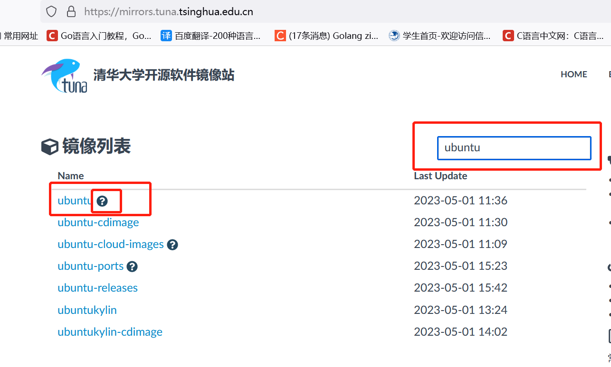
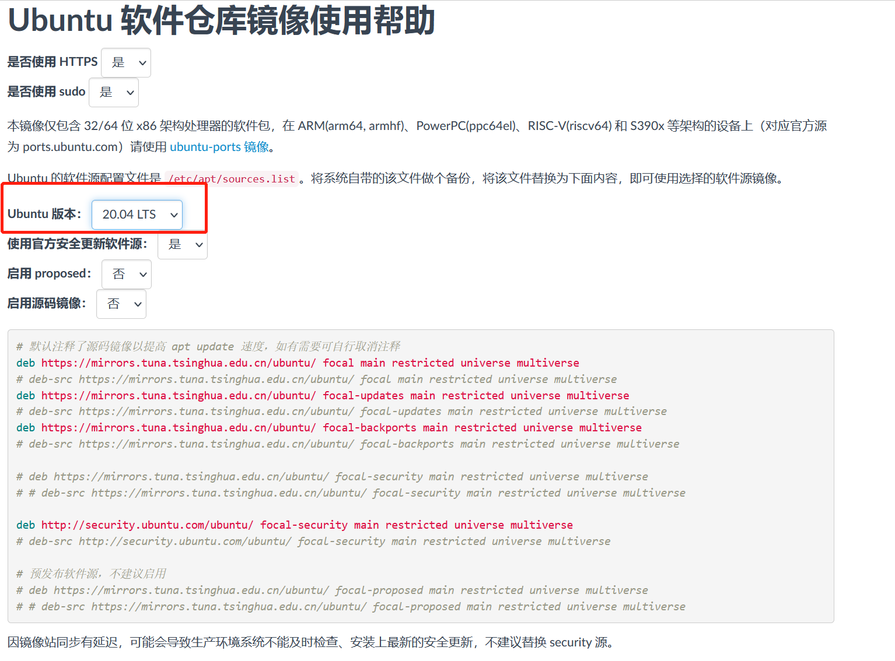
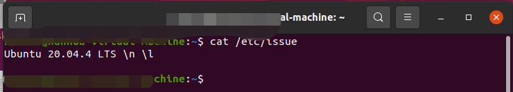
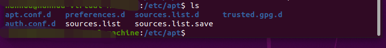

ubuntu 20.04系统两种方式配置更新软件源 -（GUI方式和命令行方式）

## 一、`GUI`方式

1.  打开Ubuntu系统“软件和更新Software & Update”图标；


2. 在ubuntu software 中的download from，在下拉框中选则中国地区的镜像源（阿里、清华源....）。


## 二、命令行方式

### 2.1 获取镜像源地址

清华大学的软件镜像网站：

```http
https://mirrors.tuna.tsinghua.edu.cn/
```

阿里云的软件镜像源：

```http
https://developer.aliyun.com/mirror/
```

以清华tuna为例：

1. 打开清华大学的软件镜像网站，在搜索栏输入`ubtuntu`



2. 点击ubuntu右侧的`?`，需要调整`ubuntu`版本



### 2.2 确定Ubuntu 的版本

输入以下命令，查看ubutnu的版本

```shell
cat   /etc/issue
```



### 2.3 修改ubutnu镜像源配置文件sources.list 

配置文件位置：`/etc/apt/sources.list`

1. 先进入到该文件位置（或者操作的时候，添加该文件的绝对地址也可以）：

```shell
cd /etc/apt/
```

2. 查看该目录下的文件



3. 先备份该文件：

```shell
sudo cp sources.list sources.list.back
```

4. 修改`source.list`

​	将签署的镜像源的相关复制信息添加到当前`source.list`文件的末尾即可。

### 2.4 执行更新Ubuntu软件源的命令

执行命令如下:

```shell
sudo apt-get update
sudo apt-get upgrade
```

