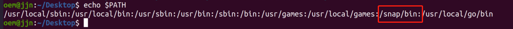

## 一、使用`Ubuntu`软件商店

在`Ubuntu`软件商店里面安装软件是最方便的，直接搜索软件名，然后点击安装输入密码就行了。

缺点是安装速度很慢。

## 二、使用`apt`命令安装

不只`Ubuntu`，其实`Debian`系统的系统（`Debian`，`Ubuntu`，`Deepin`，`Raspbian`等）都可以使用apt命令安装软件。
在**`Ubuntu 16` 之前要使用`apt-get install 软件包`来安装**，在**`Ubuntu 16` 之后可以直接使用`apt install 软件包`来安装**。

apt 命令提供了查找、安装、升级、删除某一个、一组甚至全部软件包的命令，而且命令简洁而又好记。

apt 命令执行需要**超级管理员权限(root)**。

### 2.1 `apt` 语法

```shell
 apt [options] [command] [package ...]
```

- **options：**可选，选项包括 -h（帮助），**-y（当安装过程提示选择全部为"yes"）**，-q（不显示安装的过程）等等。
- **command：**要进行的操作。
- **package**：安装的包名。

### 2.2 `apt` 常用命令

- **列出所有可更新的软件清单命令：`sudo apt update`**

- **升级软件包：`sudo apt upgrade`**

  列出可更新的软件包及版本信息：`apt list --upgradeable`

  升级软件包，升级前先删除需要更新软件包：`sudo apt full-upgrade`

- **安装指定的软件命令：`sudo apt install <package_name>`**

  **安装多个软件包：`sudo apt install  <package_1>  <package_2>  <package_3>`**

- **更新指定的软件命令：`sudo apt update <package_name>`**

- 显示软件包具体信息,例如：版本号，安装大小，依赖关系等等：`sudo apt show <package_name>`

- **删除软件包命令：`sudo apt remove <package_name>`**

- 清理不再使用的依赖和库文件: `sudo apt autoremove`

- **移除软件包及配置文件: `sudo apt purge  <package_name>`**

- 查找软件包命令：` sudo apt search <keyword>`

- 列出所有已安装的包：`apt list --installed`

- 列出所有已安装的包的版本信息：`apt list --all-versions`

### 2.3 实例

#### 2.3.1 查看一些可更新的包： 

```shell
sudo apt update
```


#### 2.3.2 升级已安装的包：

```shell
sudo apt upgrade
```


​	在以上交互式输入字母 **Y** 即可开始升级。

​	可以将以下两个命令组合起来，一键升级：

```shell
sudo apt update && sudo apt upgrade -y
```

#### 2.3.3 安装 `mplayer` 包：

```shell
sudo apt install mplayer
```


-    如果我们想安装一个软件包，但**如果软件包已经存在，则不要升级它**，可以使用 –no-upgrade 选项:

```shell
sudo apt install <package_name> --no-upgrade
```

​	安装 `mplayer` 如果存在则不要升级：

```shell
sudo apt install mplayer --no-upgrade
```

- 如果**只想升级，不要安装**可以使用 --only-upgrade 参数：

```shell
sudo apt install <package_name> --only-upgrade
```

​	只升级 `mplayer`，如果不存在就不要安装它：

```shell
sudo apt install mplayer --only-upgrade
```

- 如果需要**安装指定版本**，语法格式如下：

```shell
sudo apt install <package_name>=<version_number>
```

​	**package_name** 为包名，**version_number** 为版本号。


#### 2.3.4 移除包可以使用 remove 命令：

```shell
sudo apt remove mplayer
```


#### 2.3.5 查找名为 `libimobile` 的相关包：

```shell
apt search libimobile
```


#### 2.3.6 查看 `pinta` 包的相关信息：

```shell
apt show pinta
```


#### 2.3.7 列出可更新的软件包：

```shell
apt list --upgradeable
```


#### 2.3.8 清理不再使用的依赖和库文件：

```shell
sudo apt autoremove
```


在以上交互式输入字母 **Y** 即可开始清理。

## 三、使用`snap`命令安装

`snap`是在`Ubuntu 16` 新添加的一种软件包格式。这种格式**把软件运行所需的依赖全部打包到软件包里面**， **运行的时候持载到一个虚拟的环境里面运行**。所有这种格式的软件包安装时**不会破坏系统现有的软件包依赖**。

snap生态系统中的另**一个重要概念是Channels**。通道**确定安装和跟踪哪个版本的快照以进行更新**，它由跟踪、风险级别和分支组成并被细分。

snap包管理系统的主要组件有：

- `snapd` – 在 Linux 系统上管理和维护快照的**后台服务**。
- `snap` – 应用程序包格式和命令行界面工具，用于**安装和删除 snap** 以及在 snap 生态系统中执行许多其他操作。
- `snapcraft` – 用于**构建快照**的框架和强大的命令行工具。
- `snap store`——开发者可以共享他们的 snap，Linux 用户可以搜索和安装它们的地方。

此外，**snap快照也会自动更新**。您可以配置更新发生的时间和方式。**默认情况下，`snapd`守护程序每天最多检查四次更新**：每次更新检查称为刷新。您也可以手动启动刷新。

### 3.1 安装 `Snapd`

如上所述，**`snapd`守护进程是后台服务**，它通过实施限制策略和控制允许 snap 访问特定系统资源的接口来**管理和维护Linux 系统上的snap环境**。它还**提供snap命令**并用于许多其他用途。

要在您的系统上安装`snapd`软件包，请为您的 Linux 发行版运行适当的命令。

在`Debian`和`Ubuntu`上安装`snapd`的指令为：

```shell
sudo apt update 
sudo apt install snapd
```

### 3.2 启动`snapd`

安装`snapd`后，使用 `systemctl` 命令启用管理主snap通信套接字的`systemd`单元，如下所示：

在`Ubuntu`及其衍生版本上，这应该由包安装程序自动触发。

```shell
sudo systemctl enable --now snapd.socket
```

请注意，**如果`snapd.socket`未运行，则无法运行snap命令**。运行**以下命令以检查它是否处于活动状态并启用**以在**系统启动时自动启动**。

```shell
$ sudo systemctl is-active snapd.socket
$ sudo systemctl status snapd.socket
$ sudo systemctl is-enabled snapd.socket
```


接下来，通过**在`/var/lib/snapd/snap`和`/snap`之间创建符号链接**来启用经典快照支持，如下所示：

```shell
$ sudo ln -s /var/lib/snapd/snap /snap
```

### 3.3 检查`snapd`和`snap`版本

要检查系统上安装的`snapd`和 `snap` 命令行工具的版本，请运行以下命令：

```shell
$ snap version
```


### 3.4 简单使用`snap`命令

snap命令允许您安装、配置、刷新和删除快照，并与更大的快照生态系统进行交互。

#### 3.4.1 `snap find`查询应用

在**安装snap之前，您可以检查它是否存在于 snap store 中**。例如，如果应用程序是“chat servers”或“media players”类的软件，您可以运行这些命令来搜索它，这将在稳定频道中向商店查询可用包。

```shell
$ snap find "chat servers"
$ snap find "media players"
```


#### 3.4.2 `snap info` 查询某软件的具体信息

```shell
$ snap info code
```


#### 3.4.3 `snap install`安装某软件

```shell
sudo snap install code
```

您可以选择从不同的渠道安装：edge、beta或Candidate，即分别使用--edge、--beta或--candidate选项。或使用该--channel

```shell
$ sudo snap install --edge code      
$ sudo snap install --beta code
$ sudo snap install --candidate code
```

### 3.5 管理已有的 `snaps`

#### 3.5.1 查看已安装的所有`snap`

```shell
$ snap list
```


如果要列出正在使用的快照的当前版本，请指定其名称。您还可以通过添加--all选项列出其所有可用的修订。

```shell
$ snap list mailspring
OR
$ snap list --all mailspring
```


#### 3.5.2 更新新版本和恢复旧版本

1. **refresh命令**检查快照跟踪的通道，如果可用，它会**下载并安装最新版本的快照**。

```shell
$ sudo snap refresh mailspring
OR
$ sudo snap refresh    #update all snaps on the local system
```

2. 如果想要切换到旧版本，可以使用**revert命令恢复到以前使用的版本**。请注意，**与软件关联的数据也将被还原**。

```shell
$ sudo snap revert mailspring
```


​	现在，当您检查mailspring的所有修订版时，最新修订版被禁用，以前使用的修订版现在处于活动状态。

```shell
$ snap list --all mailspring
```


#### 3.5.3 禁用/启用和删除已有的`snap`应用

```shell
#禁用
$ sudo snap disable mailspring

#开启
$ sudo snap enable mailspring

#删除
$ sudo snap remove mailspring   ## 删除所有版本
$ sudo snap remove  --revision=482 mailspring   ## 仅删除指定版本
```

### 3.6 从`snap`运行应用程序

snap可以提供您从**图形用户界面**或**使用命令运行的单个应用程序**（或一组应用程序）。默认情况下，**所有与 snap 关联的应用程序**都安装在**基于 `Debian` 的发行版的`/snap/bin/`目录下**，以及**基于`RHEL` 的发行版的`/var/lib/snapd/snap/bin/`目录下**。

```shell
$ ls /snap/bin/   ## Ubuntu
OR
# ls /var/lib/snapd/snap/bin/  ## Centos
```


例如，要**从命令行运行应用程序**，只需**输入其绝对路径名**。

```shell
$ /snap/bin/mailspring
OR
# /var/lib/snapd/snap/bin/mailspring
```

如果要**仅输入应用程序名称而不输入其完整路径名**，请**确保`/snap/bin/`或`/var/lib/snapd/snap/bin/`在您的PATH环境变量中**（默认情况下应添加）。

```shell
# echo $PATH
```



如果`/snap/bin/`或`/var/lib/snapd/snap/bin/`目录在您的PATH中，您**只需键入应用程序的名称/命令即可运行应用程序**：

```shell
$ code
```

which命令查找应用程序或命令的绝对路径名。

```shell
which code 
```


查看snap下可用的命令，请运行“ snap info snap-name ”命令，然后查看以下屏幕截图中突出显示的命令部分。

```shell
$ snap info mailspring
```


### 3.7  创建和使用 Snap Aliases

Snap还**支持为应用程序创建别名**。快照的**默认（或标准）别名在启用之前必须经过公共审查**过程，但您**可以为本地系统创建别名**。

#### 3.7.1 创建别名

您可以使用 **`snap alias` 命令为快照创建别名**。

```shell
snap alias mailspring mls
```


从现在开始，您**可以使用别名`mls`来运行 该snap应用**。

#### 3.7.2 列出别名

要**列出快照的别名**，例如`mailspring`，请运行以下命令。

```shell
snap aliases mailspring
```

#### 3.7.3 删除别名

要删除snap的别名，请使用`snap unalias`命令。

```shell
snap unalias mls
```


### 3.8 管理 Snap 的服务

对于**某些快照，底层功能通过作为守护程序或服务运行的应用程序公开，一旦安装快照，它们会自动启动在后台连续运行**。此外，这些服务**还可以在系统启动时自动启动**。重要的是，**单个快照可能包含多个应用程序和服务**，它们协同工作以提供该快照的整体功能。

```shell
snap info rocketchat-server
```


#### 3.8.1 查看`snap`应用的服务状态

可以**使用services命令交叉检查服务的快照**。命令输出**显示一个服务**，它**是否启用在系统启动时自动启动**，以及它**是否处于活动状态**。

```shell
snap services rocketchat-server
```


#### 3.8.2 停止服务运行

要停止服务运行，例如Rocketchat，请使用stop命令。请注意，**不建议执行此操作**，因为**手动停止快照服务可能会导致快照发生故障**。

```shell
snap stop rocketchat-server
```

#### 3.8.3 启动服务

要启动服务，例如，rocketchat使用start命令。

```shell
snap start rocketchat-server
```

#### 3.8.4 使服务在系统引导时自动启动

```shell
snap enable rocketchat-server
```

#### 3.8.5 禁止服务在下次系统引导时自动启动

```shell
snap disable rocketchat-server
```

#### 3.8.6 查看服务的日志

要查看服务的日志，请使用**带有-f选项的log命令，它允许您实时查看屏幕上的日志**。

```shell
snap logs rocketchat-server
OR
snap logs -f rocketchat-server
```

### 3.9 创建和管理 Snap 的快照

`Snapd`为一个或多个快照存储用户、系统和配置数据的副本。您可以手动触发或将其设置为自动工作。这样，您可以备份快照的状态，将其恢复到以前的状态，以及将全新的快照安装恢复到以前保存的状态。

#### 3.9.1 手动生成快照

要手动生成快照，请使用“ snap save ”命令。要为`mailspring`创建快照，请运行以下命令：

```shell
snap save mailspring
```


如果**未指定快照名称，`snapd`将为所有已安装的快照生成快照**（添加**--no-wait选项以在后台运行进程**以释放终端并允许您运行其他命令）。

```shell
snap save
```


#### 3.9.2 查看快照的状态

要**查看所有快照的状态，请使用saved命令**。您可以**使用该--id标志来显示特定快照的状态**：

```shell
snap saved
OR
snap saved --id=2
```


#### 3.9.3 验证快照的完整性

可以使用**`check-snapshot`命令**和**快照标识符（set  ID）**验证快照的完整性：

```shell
snap check-snapshot 2
```


#### 3.9.4 恢复到指定快照

要**使用特定快照中的相应数据恢复当前用户、系统和配置数据**，请使用`restore`命令并指定快照集 ID：

```shell
snap restore 2
```

#### 3.9.5 删除快照

要从系统中删除快照，请使用forget命令。**默认情况下会删除所有快照的数据**，您**可以指定快照仅删除其数据**。

```shell
snap forget 2
OR
snap forget 2  mailspring
```

## 四、使用`dpkg`命令安装

**上面3种方法都只能安装已经添加的软件源里面的软件**。但像网易云音乐、百度网盘这些并**没有在软件源里面**，而是**在官网提供deb后缀的软件包下载**，这种软件我们**就要用到`dpkg`命令来安装**了。

**`dpkg`命令**的英文全称是`Debian package`，**`dpkg`是`Debian Linux`系统用来安装、创建和管理软件包的实用工具**。

### 4.1 命令格式

```shell
dpkg [<选项> ...] <命令>
```

### 4.2 常用选项与命令

```shell
选项：
  --admindir=<目录>          使用 <目录> 而非 /var/lib/dpkg。
  --root=<目录>              安装到另一个根目录下。
  --instdir=<目录>           改变安装目录的同时保持管理目录不变。
  --path-exclude=<表达式>    不要安装符合Shell表达式的路径。
  --path-include=<表达式>    在排除模式后再包含一个模式。
  -O|--selected-only         忽略没有被选中安装或升级的软件包。
  -E|--skip-same-version     忽略版本与已安装软件版本相同的软件包。
  -G|--refuse-downgrade      忽略版本早于已安装软件版本的的软件包。
  -B|--auto-deconfigure      就算会影响其他软件包，也要安装。
  --[no-]triggers            跳过或强制随之发生的触发器处理。
  --verify-format=<格式>     检查输出格式('rpm'被支持)。
  --no-debsig                不去尝试验证软件包的签名。
  --no-act|--dry-run|--simulate
                             仅报告要执行的操作 - 但是不执行。
  -D|--debug=<八进制数>      开启调试(参见 -Dhelp 或者 --debug=help)。
  --status-fd <n>            发送状态更新到文件描述符<n>。
  --status-logger=<命令>     发送状态更新到 <命令> 的标准输入。
  --log=<文件名>             将状态更新和操作信息到 <文件名>。
  --ignore-depends=<软件包>,...
                             忽略关于 <软件包> 的所有依赖关系。
  --force-...                忽视遇到的问题(参见 --force-help)。
  --no-force-...|--refuse-...
                             当遇到问题时中止运行。
  --abort-after <n>          累计遇到 <n> 个错误后中止。


命令：
  -i|--install       <.deb 文件名> ... | -R|--recursive <目录> ...
  --unpack           <.deb 文件名> ... | -R|--recursive <目录> ...
  -A|--record-avail  <.deb 文件名> ... | -R|--recursive <目录> ...
  --configure        <软件包名>    ... | -a|--pending
  --triggers-only    <软件包名>    ... | -a|--pending
  -r|--remove        <软件包名>    ... | -a|--pending
  -P|--purge         <软件包名>    ... | -a|--pending
  -V|--verify <软件包名> ...       检查包的完整性。
  --get-selections [<表达式> ...]  把已选中的软件包列表打印到标准输出。
  --set-selections                 从标准输入里读出要选择的软件。
  --clear-selections               取消选中所有不必要的软件包。
  --update-avail <软件包文件>      替换现有可安装的软件包信息。
  --merge-avail  <软件包文件>      把文件中的信息合并到系统中。
  --clear-avail                    清除现有的软件包信息。
  --forget-old-unavail             忘却已被卸载的不可安装的软件包。
  -s|--status      <软件包名> ...  显示指定软件包的详细状态。
  -p|--print-avail <软件包名> ...  显示可供安装的软件版本。
  -L|--listfiles   <软件包名> ...  列出属于指定软件包的文件。
  -l|--list  [<表达式> ...]        简明地列出软件包的状态。
  -S|--search <表达式> ...         搜索含有指定文件的软件包。
  -C|--audit [<表达式> ...]        检查是否有软件包残损。
  --yet-to-unpack                  列出标记为待解压的软件包。
  --predep-package                 列出待解压的预依赖。
  --add-architecture    <体系结构> 添加 <体系结构> 到体系结构列表。
  --remove-architecture <体系结构> 从架构列表中移除 <体系结构>。
  --print-architecture             显示 dpkg 体系结构。
  --print-foreign-architectures    显示已启用的异质体系结构。
  --assert-<特性>                  对指定特性启用断言支持。
  --validate-<属性> <字符串>       验证一个 <属性>的 <字符串>。
  --compare-vesions <a> <关系> <b> 比较版本号 - 见下。
  --force-help                     显示本强制选项的帮助信息。
  -Dh|--debug=help                 显示有关出错调试的帮助信息。

  -?, --help                       显示本帮助信息。
      --version                    显示版本信息。
```

### 4.3 常见用法总结

```shell
# dpkg -i package   #安装一个包

# dpkg -R /usr/local/src   #安装一个目录下面所有的软件包

# dpkg --unpack package    #解开一个包，如果和-R一起使用，参数可以是一个目录

# dpkg --configure package    #重新配置和释放软件包

# dpkg -r package  #删除包

# dpkg --merge-avail      #合并包

# dpkg -P  #删除包，包括配置文件

# dpkg -A package   #从软件包里面读取软件的信息

# dpkg --update-avail    #替代软件包的信息

# dpkg --forget-old-unavail    #删除Uninstall的软件包信息

# dpkg --clear-avail   #删除软件包的Avaliable信息

# dpkg -C   #查找只有部分安装的软件包信息

# dpkg --compare-versions ver1 op ver2  #比较同一个包的不同版本之间的差别

# dpkg -b directory [filename]    #建立一个deb文件

# dpkg -c filename  #显示一个Deb文件的目录

# dpkg -p package   #显示包的具体信息

# dpkg -S filename-search-pattern    #搜索指定包里面的文件（模糊查询）

# dpkg -L package    #显示一个包安装到系统里面的文件目录信息

# dpkg -s package    #报告指定包的状态信息

# dpkg -l    #显示所有已经安装的Deb包，同时显示版本号以及简短说明
```

### 4.4 用法实例

1. **安装软件**

```shell
deng@itcast:~$ sudo dpkg -i tree_1.6.0-1_amd64.deb 
(正在读取数据库 ... 系统当前共安装有 172173 个文件和目录。)
正准备解包 tree_1.6.0-1_amd64.deb  ...
正在将 tree (1.6.0-1) 解包到 (1.6.0-1) 上 ...
正在设置 tree (1.6.0-1) ...
正在处理用于 man-db (2.8.3-2) 的触发器 ...
```

2. **卸载软件**

```shell
deng@itcast:~$ sudo dpkg -r tree 
(正在读取数据库 ... 系统当前共安装有 172172 个文件和目录。)
正在卸载 tree (1.6.0-1) ...
正在处理用于 man-db (2.8.3-2) 的触发器 ...
deng@itcast:~$ 
```

3. **卸载软件(包括配置文件)**

```shell
deng@itcast:~$ sudo dpkg -P tree 
(正在读取数据库 ... 系统当前共安装有 172172 个文件和目录。)
正在卸载 tree (1.6.0-1) ...
正在处理用于 man-db (2.8.3-2) 的触发器 ...
deng@itcast:~$ 
```

4. **列出已经安装的软件**

```shell
deng@itcast:~$ dpkg -l 
```

5. **列出deb包的内容**

```shell
deng@itcast:~$ dpkg -c tree_1.6.0-1_amd64.deb 
drwxr-xr-x root/root         0 2012-05-02 00:43 ./
drwxr-xr-x root/root         0 2012-05-02 00:43 ./usr/
drwxr-xr-x root/root         0 2012-05-02 00:43 ./usr/bin/
-rwxr-xr-x root/root     57176 2012-05-02 00:43 ./usr/bin/tree
drwxr-xr-x root/root         0 2012-05-02 00:43 ./usr/share/
drwxr-xr-x root/root         0 2012-05-02 00:43 ./usr/share/man/
drwxr-xr-x root/root         0 2012-05-02 00:43 ./usr/share/man/man1/
-rw-r--r-- root/root      4100 2012-05-02 00:43 ./usr/share/man/man1/tree.1.gz
drwxr-xr-x root/root         0 2012-05-02 00:43 ./usr/share/doc/
drwxr-xr-x root/root         0 2012-05-02 00:43 ./usr/share/doc/tree/
-rw-r--r-- root/root      2210 2011-06-24 22:34 ./usr/share/doc/tree/TODO
-rw-r--r-- root/root      2425 2012-02-04 21:32 ./usr/share/doc/tree/copyright
-rw-r--r-- root/root      2254 2011-06-24 22:34 ./usr/share/doc/tree/README.gz
-rw-r--r-- root/root      1552 2012-05-02 00:43 ./usr/share/doc/tree/changelog.Debian.gz
deng@itcast:~$ 
```

6. **列出与该软件包关联的文件**

```shell
deng@itcast:~$ sudo dpkg -L tree 
/.
/usr
/usr/bin
/usr/bin/tree
/usr/share
/usr/share/man
/usr/share/man/man1
/usr/share/man/man1/tree.1.gz
/usr/share/doc
/usr/share/doc/tree
/usr/share/doc/tree/TODO
/usr/share/doc/tree/copyright
/usr/share/doc/tree/README.gz
/usr/share/doc/tree/changelog.Debian.gz
deng@itcast:~$ 
```

7. **列出对应软件包版本**

```shell
deng@itcast:~$ sudo dpkg -l tree
期望状态=未知(u)/安装(i)/删除(r)/清除(p)/保持(h)
| 状态=未安装(n)/已安装(i)/仅存配置(c)/仅解压缩(U)/配置失败(F)/不完全安装(H)/触发器等待(W)/触发器未决(T)
|/ 错误?=(无)/须重装(R) (状态，错误：大写=故障)
||/ 名称           版本         体系结构     描述
+++-==============-============-============-=================================
ii  tree           1.6.0-1      amd64        displays directory tree, in color
deng@itcast:~$ 
```

8. **解开deb包的内容**

```shell
deng@itcast:~/test$ sudo dpkg --unpack tree_1.6.0-1_amd64.deb 
(正在读取数据库 ... 系统当前共安装有 172173 个文件和目录。)
正准备解包 tree_1.6.0-1_amd64.deb  ...
正在将 tree (1.6.0-1) 解包到 (1.6.0-1) 上 ...
正在处理用于 man-db (2.8.3-2) 的触发器 ...
```

9. **配置软件包**

```shell
deng@itcast:~/test$ sudo dpkg --configure tree
正在设置 tree (1.6.0-1) ...
deng@itcast:~/test$ 
```

10. **重新配置软件包**

```shell
deng@itcast:~/test$ sudo dpkg --reconfigure tree
```

