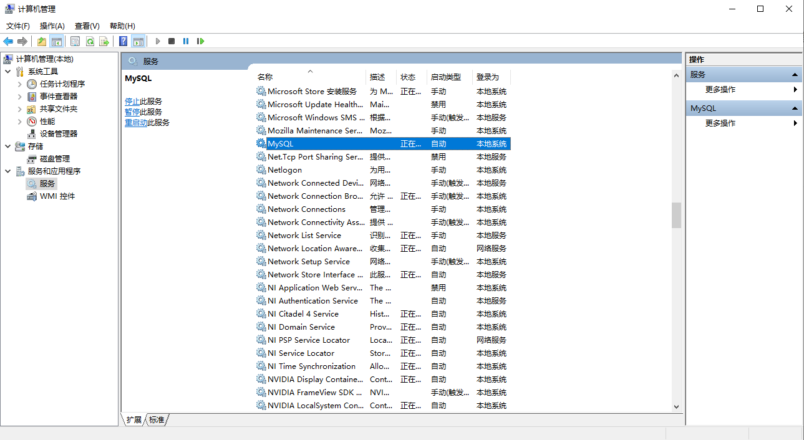
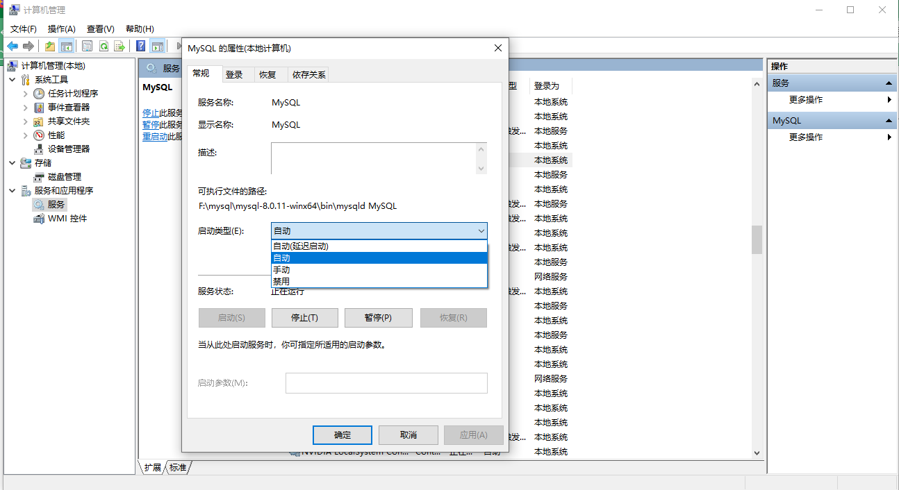
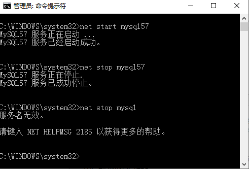

[MySQL](http://c.biancheng.net/mysql/) 服务和 MySQL 数据库不同，**MySQL 服务是一系列的后台进程，而 MySQL 数据库则是一系列的数据目录和数据文件**。MySQL 数据库必须在 MySQL 服务启动之后才可以进行访问。本节主要介绍如何启动 MySQL 服务。

 **Windows 系统下启动停止 MySQL 服务的方式主要有以下两种**：

1. 通过计算机管理方式
2. 通过命令行方式

## 一、通过计算机管理方式

通过 Windows 的服务管理器查看修改，步骤如下：

 步骤 1)：在桌面上右击“此电脑”→“管理”命令，如图所示。

步骤 2)：弹出“计算机管理”对话框，双击“服务和应用程序”，用户可查看计算机的服务状态，MySQL 的状态为“正在运行”，表明该服务已经启动，如图所示。

在图中可以看到，服务已经启动，而且启动类型为自动。如果没有“正在运行”字样，说明 MySQL 服务未启动。

 可以在此处鼠标右击选择属性进入“MySQL的属性”的界面，如图所示。

可以在 MySQL 的属性界面中设置服务状态。可以将服务状态设置为“启动”、“停止”、“暂停”和“恢复”命令。

 还可以设置启动类型，在启动类型处的下拉菜单中可以选择“自动”、“手动”和“禁用”。这 3 种启动类型的说明如下:

1. 自动：MySQL 服务是自动启动，可以手动将状态变为停止、暂停和重新启动等。
2. 手动：MySQL 服务需要手动启动，启动后可以改变服务状态，如停止、暂停等。
3. 已禁用：MySQL 服务不能启动，也不能改变服务状态。

> 如果需要经常练习 MySQL 数据库的操作，可以将 MySQL 设置为自动启动，这样可以避免每次手动启动 MySQL 服务。当然，如果使用  MySQL 数据库的频率很低，可以考虑将 MySQL 服务设置为手动启动，这样可以避免 MySQL 服务长时间占用系统资源。

## 二、通过命令行方式

可以通过 DOS 命令启动 MySQL 服务，点击“开始”菜单，在搜索框中输入“cmd”，**以管理员身份运行**，按回车键，弹出命令提示符界面。然后输入**`net start mysql`**，按回车键，就能**启动 MySQL 服务**，**停止 MySQL 服务的命令为`net stop mysql`**，如图所示。

注意：`net start mysql57`和`net stop mysql57`命令中的 mysql57 是 MySQL 服务器名称，如果你的 MySQL 服务名称是 DB 或其它的名字，应该输入`net start DB`或其它名称，否则提示服务名无效。