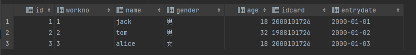
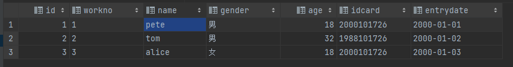

## 一、修改数据项

```sql
UPDATE 表名 SET 字段名1 = 值1,字段名2 = 值2,…… [WHERE 条件];
```

**[WHERE 条件] 可以指定要修改哪些数据，如果不使用WHERE则会更新所有行对应的字段。**

比如现在有一张表：



现在需要将第一条数据的`name`从jack改成pete，则使用如下语句:

```sql
update employee set name = 'pete' where id = 1;
```

必须指定 id = 1的一行数据进行修改，否则三条数据的name都会被修改。

## 二、删除数据

```sql
DELETE FROM 表名 [WHERE 条件]
```

注：

- DELETE 语句的条件可以有，也可以没有，如果没有条件，则会删除整张表的所有数据。
- DELETE语句不能删除某一个字段的值(如果要实现这样的效果，可以通过UPDATE将数据项更新为nil)

现在的表为：



1.现在删除gender = '女'的数据项

```sql
delete from employee where gender='女';
```

2.删除所有数据（不加where）

```sql
delete from employee;
```

