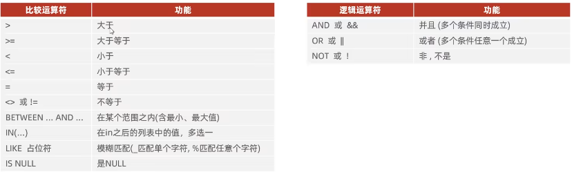

## 1. 条件查询

```sql
SELECT 字段 FROM 表名 WHERE 查询条件;
```

支持的条件运算符有：



## 2. 举例

2.1 查询年龄等于28的员工

```sql
select * from emp where age = 28;
```

2.2 查询年龄小于等于20的员工信息

```sql
select * from emp where age <= 20;
```

2.3 查询没有身份证号的员工

```sql
select * from emp where idcard is null;
```

2.4 查询有身份证号的员工

```sql
select * from emp where idcard is not null;
```

2.5 查询年龄在15~20岁之间的员工

```sql
select * from emp where age >= 15 && age <= 20;
```

```sql
select * from emp where between 15 and 20;
```

2.6 查询性别为女且年龄小于25岁的员工

```sql
select * from emp where gender = '女' and age < 25;
```

2.7 查询年龄等于 18 或 20 或 40 的员工

```sql
select * from emp where age = 18 or age = 20 or age = 40;
```

```sql
select * from emp where age in(18,20,40);
```

2.8 查询姓名为两个字的员工信息

```sql
select * from emp where name like '__'; /*两个字就用两个下划线_ */
```

2.9 查询姓名为三个字的员工信息

```sql
select * from emp where name like '___'; /*三个字就用三个下划线_ */
```

2.10 查询身份证号最后一位是X的员工

```sql
select * from emp where idcard like '%X';  /* %的意思是代表前面所有字符 */
```

