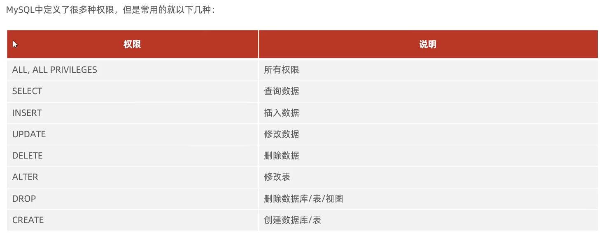

## 1. 权限的分类



## 2. 查询用户权限

```sql
SHOW GRANTS FOR '用户名'@'主机名';
```

```sql
show grants for 'heima'@'%';
```


## 3.授予权限

```sql
GRANT 权限列表 ON 数据库名.表名 TO '用户名'@'主机名';
```

**权限列表**： 就是**1. 中给出的权限组成的列表** ,多个权限之间可以通过` , `分隔

如果**想要给数据库中的所有表授权，可以写为：数据库名.***  ，当前数据库名也可以使用通配符 *

```sql
grant all on itcast.* to 'heima'@'%';
```


## 4.撤销权限

```sql
REVOKE 权限列表 ON 数据库名.表名 FROM '用户名'@'主机名';
```

```sql
revoke all on itcast.* from  'heima'@'%';
```

