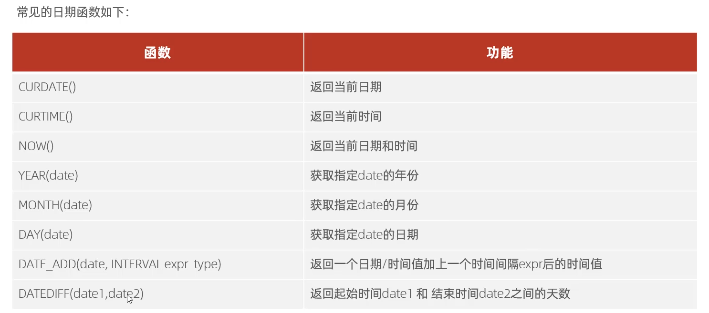

## 1. 日期函数



注：

DATE_ADD的使用： 

```sql
select date_add(now(),INTERVAL 70 DAY);   /* 在当前时间的基础上，往后推迟70天 */
```

DATEDIFF的使用：

```sql
select datediff('2021-10-01','2021-12-01');
```

## 2. 案例

查询所有员工的入职天数，并根据入职天数倒序排序。

```sql
select name,datediff(curdate(),entrydate) as 'entrydates' from emp order by entrydays desc;
```

