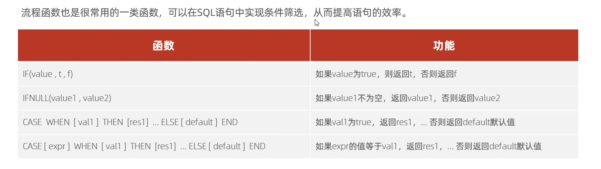

## 1. 常用流程控制函数



## 2. 举例

需求1：

查询emp表的员工姓名和工作地址(北京、上海 --- >  一线城市， 其他  -----> 二线城市)

```sql
select name,case workaddress when '北京' then '一线城市' when '上海' then '一线城市' else '二线城市' end as '工作地址' from emp;
```

需求二：

统计各班学生的成绩，规则如下：

`>=` 85  优秀

`>=` 60  及格

否则，不及格。

```sql
select 
	name,
	(case when math >= 85 then '优秀' when math >= 60 then '及格' else '不及格' end) as '数学',
	(case when english >= 85 then '优秀' when english >= 60 then '及格' else '不及格' end) as '英语',
	(case when chinese >= 85 then '优秀' when chinese >= 60 then '及格' else '不及格' end) as '语文'
from scores;
```

