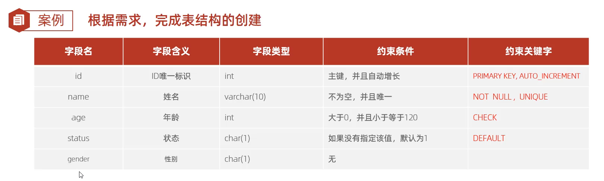

SQL实现：

```sql
create table user(
	id int primary key auto_increment comment '主键',
    name varchar(10) not full unique comment '姓名',
    age int check (age > 0 and age <= 120) comment '年龄',
    status char(1) default '1' comment '状态',
	gender char(1) comment '性别' 
) comment '用户表';
```

插入数据：

```sql
insert into user(name,age,status,gender) values ('tom',18,1,'男'),('alice',18,0,‘女’);
```

注：主键不需要插入，其由表自行维护。