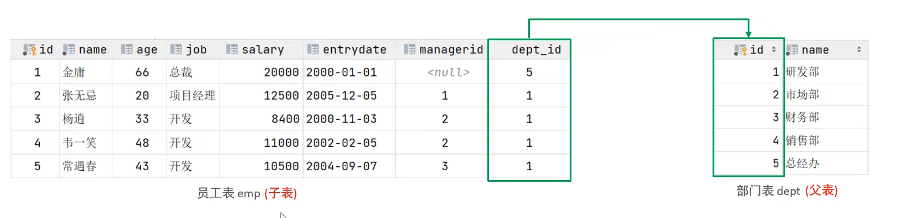
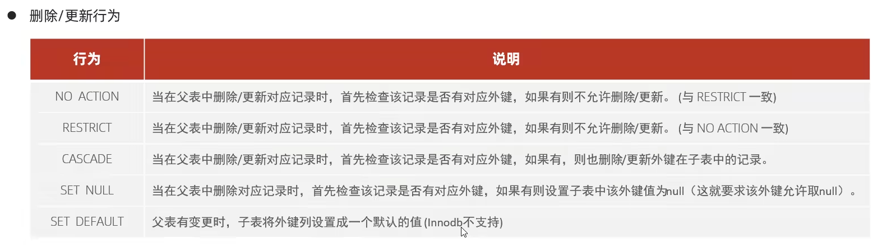

## 1. 外键约束

外键用来让两张表的数据之间建立连接，从而保证数据的一致性和完整性。

比如下面这两张表，通过部门id这一个外键建立了连接：



拥有外键的被称为子表，外键所关联的叫做父表。

## 2. 添加外键

### 2.1 在表创建时添加

```sql
create table 表名(	
	[CONSTRAINT] [外键名称] FOREIGN KEY (外键字段名) REFERENCES 主表(主表列名)
);
```

### 2.2 创建表后添加外键

```sql
ALTER TABLE 表名 ADD CONSTRAINT 外键名称 FOREIGN KEY(外键字段名) REFERENCES 主表(主表列名);
```

### 2.3 使用范例

```sql
alter table emp add constraint fk_emp_dept_id foreign key (dept_id) references dept(id)
```

这样，emp表的dept_id列和dept的id列完成了外键连接,外键名称为fk_emp_dept_id

## 3. 删除外键

```sql
ALTER TABLE 表名 DROP FOREIGN KEY 外键名称;
```

## 4. 外键的删除/更新行为



在创建外键的时候通过添加上述的关键字来控制外键在进行删除和更新时的行为。

```sql
alter table 表名 add constraint 外键名称 foreign key (外键字段) references 主表名(主表字段名) ON UPDATE CASCADE ON DELETE CASCADE;
```

```
ON UPDATE XXX  指定外键更新时的行为
ON DELETE XXX  指定外键删除时的行为
```

