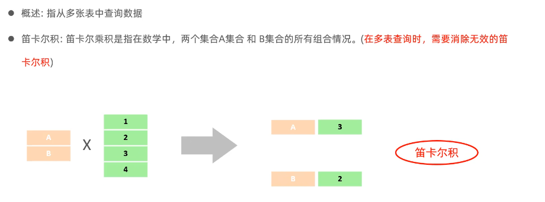
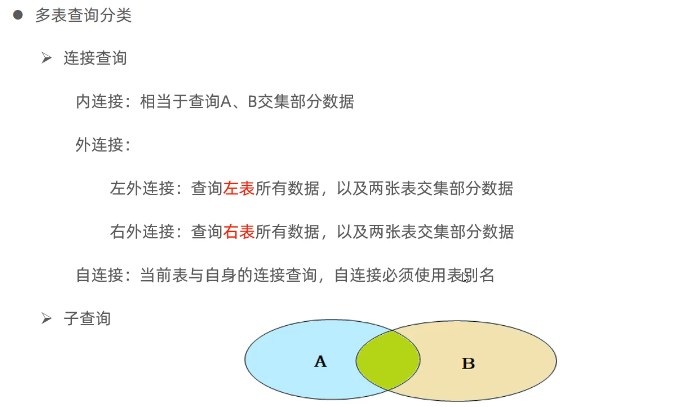

## 1. 多表查询方式

现有两个表：员工表`emp`和部门表`dept`，两张表通过`emp`的外键`dept_id`和`dept`表的主键`id`关联

如此，要展现两张表，需用以下语法：

```sql
select * from emp,dept where emp.dept_id = dept.id;
```

where 之后限定的关系是 emp.dept_id = dept.id ，即emp的外键必须等于dept的主键的项才会展示。若没有此限制，显示的结果将是两张表的笛卡尔积。



## 2. 多表查询分类

