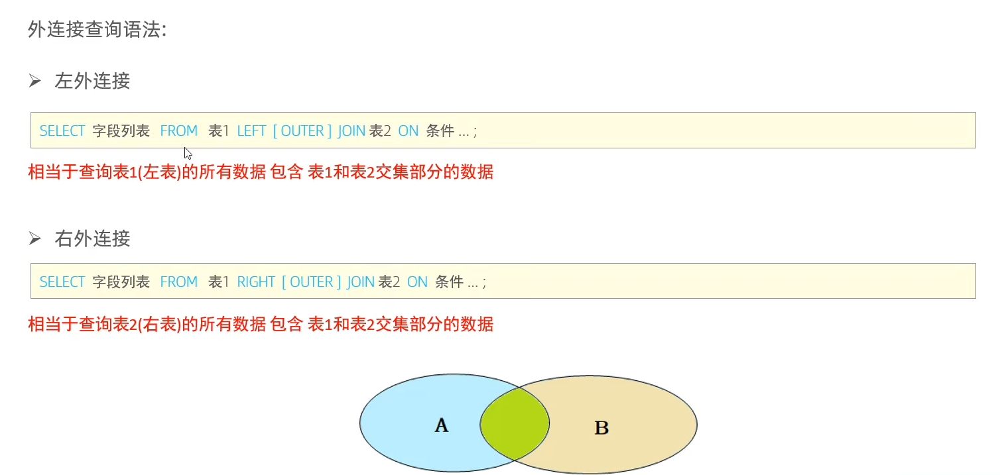

## 1. 外连接语法



## 2. 练习

2.1 查询emp表的所有数据，以及对应的部门(左外连接)

```sql
select e.* d.name from emp e left outer join dept d on e.dept_id = d.id;
```

2.2 查询dept表的所有数据，以及对应的员工信息(右外连接)

```sql
select d.*,e.* from emp e right outer join dept d on e.dept_id = d.id;
```

