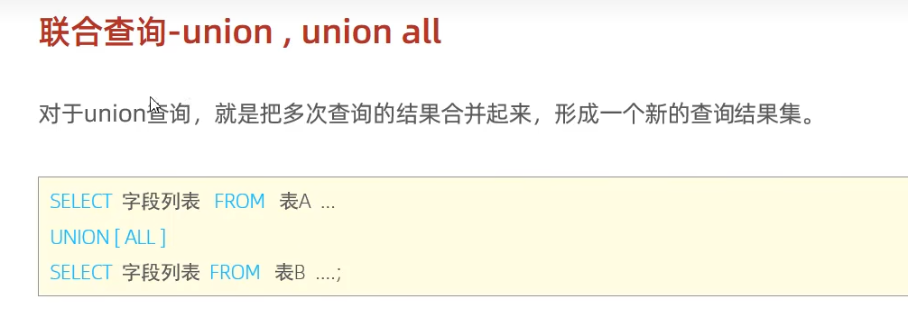

## 1. 联合查询语法



**联合查询的多张表的列数必须保持一致，字段类型也需要保持一致。**

## 2. 举例

将薪资低于5000的员工，和年龄大于50岁的员工全部查询出来。

方式一：**union all  （将多次查询的结果直接合并）**

```sql
select * from emp where salary < 5000
unino all
select * from emp where age > 50;
```

方式二：**union (合并后去重)**

```sql
select * from emp where salary < 5000 
union 
select * from emp where age > 50;
```

