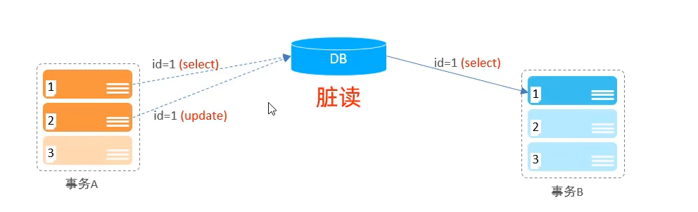
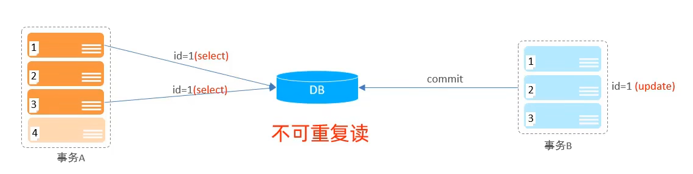
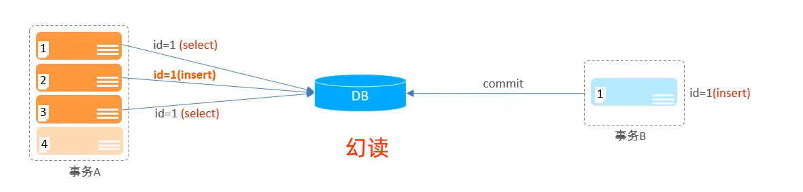

## 一、并发事务问题

当有两个并发的事务一起执行时，可能会遇到一些问题：

| 问题       | 描述                                                         |
| ---------- | ------------------------------------------------------------ |
| 脏读       | 一个事务读取到另外一个事务还没有提交的数据。                 |
| 不可重复读 | 一个事务先后读取同一条记录，但两次读取的数据不同，称之为不可重复读。 |
| 幻读       | 一个事务按照条件查询数据时，没有对应的数据行，但是在插入数据时，又发现这行数据已经存在，好像出现了"幻影"。 |

**1. 脏读**

事务A包含三条SQL语句，但只执行了两条，还剩一条未执行完。此时事务B使用select语句读取了事务A还未提交的数据。

**2. 不可重复读**

事务A的第一、三条SQL语句访问的是同一条数据，但是在访问期间事务B的update语句更改了这条数据且**提交到了数据库**。导致事务A两次select查询的结果不一样。

**3. 幻读**

事务A的第一条SQL 在进行查询时，数据库中没有id = 1的数据，但是紧接着事务B的SQL插入了id = 1的数据，导致了事务A的第二条SQL语句在进行插入时发生了冲突，插入不成功。此时紧接着事务A的第三条SQL语句对id = 1的数据进行读取，如果系统在解决了"不可重复读"的基础上，那么本次读取也是读不到id = 1的数据的(实现事务读取的一致性)

