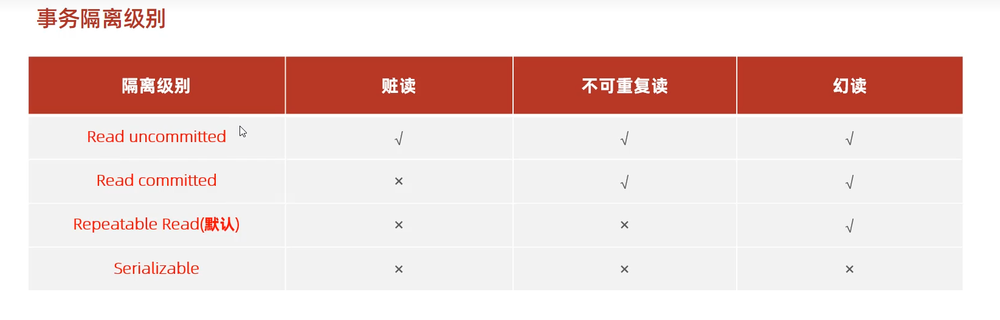

## 一、事务隔离级别



`√`表示在当前级别下存在对应的并发问题，`×`表示不存在该并发问题。

- read uncommitted：会读取事务尚未commit的SQL结果
- read committed：只读取已经完成commit的SQL结果
- repeatable read：一个事务中读取的结果保证一致性。
- serialization：事务串行化，不允许多个事务并行执行，同一时间段只允许一个事务在执行。

**隔离级别越高，越安全，但是性能越低**


 **查看当前事务隔离级别**

```sql
SELECT @@TRANSACTION_ISOLATION;
```

**设置当前事务隔离级别**

```sql
SET [SESSION | GLOBAL] TRANSACTION ISOLATION LEVEL [READ UNCOMMITTED | READ COMMITTED | REPEATABLE READ | SERIALIZABLE]
```

SESSION表示仅对当前客户端窗口调整隔离级别

GLOBAL表示永久性调整


