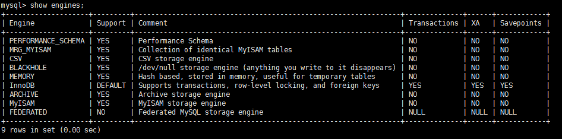
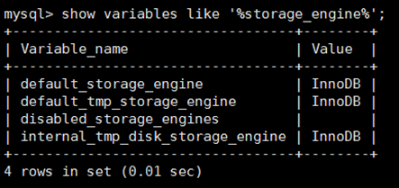
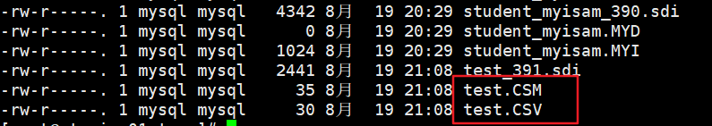

## 一、查看存储引擎

查看 `mysql` 提供什么存储引擎：

```sql
show engines;
```



## 二、设置系统默认的存储引擎  

1. 查看默认的存储引擎：  

```sql
show variables like '%storage_engine%';
#或
SELECT @@default_storage_engine;
```



2. 修改默认的存储引擎：

如果在创建表的语句中**没有显式指定表的存储引擎**的话，那就会**默认使用 InnoDB** 作为表的存储引擎。
如果我们想改变表的默认存储引擎的话，可以这样写启动服务器的命令行：  

```sql
SET DEFAULT_STORAGE_ENGINE=MyISAM;  ## 只能临时改变
```

或者修改 `my.cnf` 文件（全局改变）：  

```ini	
default-storage-engine=MyISAM
# 重启服务
systemctl restart mysqld.service
```

## 三、设置表的存储引擎  

存储引擎是负责对表中的数据进行提取和写入工作的，我们可以为 **不同的表设置不同的存储引擎** ，也就是说**不同的表可以有不同的物理存储结构，不同的提取和写入方式**。  

### 3.1 创建表时指定存储引擎  

我们之前创建表的语句都没有指定表的存储引擎，那就会使用默认的存储引擎 `InnoDB` 。如果我们想**显式的指定一下表的存储引擎**，那可以这么写：  

```sql
CREATE TABLE 表名(
建表语句;
) ENGINE = 存储引擎名称;
```

### 3.2 修改表的存储引擎  

如果表已经建好了，我们也可以使用下边这个语句来修改表的存储引擎：  

```sql
ALTER TABLE 表名 ENGINE = 存储引擎名称;
```

## 四、引擎介绍  

### 4.1 `InnoDB` 引擎：具备外键支持功能的事务存储引擎  

1. `MySQL` 从 `3.23.34a` 开始就包含 `InnoDB` 存储引擎。 **大于等于`5.5`之后，默认采用`InnoDB` 引擎 。**  
2. `InnoDB` 是 `MySQL` 的 默认**事务型引擎** ，它被设计用来**处理大量的短期(short-lived)事务**。可以确保事务的完整提交(Commit)和回滚(Rollback)。  
3. `InnoDB` 支持**行级锁**，粒度更小，更利于并发操作。
4. 除了增加和查询外，还需要更新、删除操作，那么，应优先选择`InnoDB`存储引擎。  
5. **除非有非常特别的原因需要使用其他的存储引擎，否则应该优先考虑InnoDB引擎。**
6. 数据文件结构：  
   1. 表名.frm 存储表结构（MySQL8.0时，合并在表名.ibd中）  
   2. 表名.ibd 同时存储数据和索引  
7. `InnoDB` 是 为**处理巨大数据量的最大性能**设计 。  
   1. 在以前的版本中，字典数据以元数据文件、非事务表等来存储。现在这些元数据文件被删除了。比如： .frm ， .par ， .trn ， .isl ， .db.opt 等都在MySQL8.0中不存在了。  
8. 对比 `MyISAM` 的存储引擎， `InnoDB` **写的处理效率差一些** ，并且会**占用更多的磁盘空间**以保存数据和索引。  
9. `MyISAM` 只缓存索引，不缓存真实数据；`InnoDB` **不仅缓存索引还要缓存真实数据**， **对内存要求较高** ，而且内存大小对性能有决定性的影响。  

### 4.2 `MyISAM` 引擎：主要的非事务处理存储引擎  

1. `MyISAM` 提供了大量的特性，包括全文索引、压缩、空间函数(GIS)等，但 `MyISAM` **不支持事务、行级锁、外键** ，有一个毫无疑问的缺陷就是 **崩溃后无法安全恢复** 。  
2. 是5.5之前默认的存储引擎  
3. 优势是访问的 **速度快** ，针对**对事务完整性没有要求**或者**以SELECT、INSERT为主**的应用  
4. **针对数据统计有额外的常数存储**。故而 count(*) 的查询效率很高  
5. 数据文件结构：  
   1. 表名.frm 存储表结构  
   2. 表名.MYD 存储数据 (MYData)  
   3. 表名.MYI 存储索引 (MYIndex)  
6. 应用场景：只读应用或者以读和插入为主的业务  

### 4.3 `MyISAM` 和 `InnoDB` 对比  

很多人对 `InnoDB` 和 `MyISAM` 的取舍存在疑问，到底选择哪个比较好呢？  


| 对比 项          | `MyISAM`                                                  | `InnoDB`                                                     |
| ---------------- | --------------------------------------------------------- | ------------------------------------------------------------ |
| 外键             | 不支持                                                    | 支持                                                         |
| 事务             | 不支持                                                    | 支持                                                         |
| 行表锁           | 表锁，即使操作一条记录也会锁住 整个表，不适合高并发的操作 | 行锁，操作时只锁某一行，不对其它行有影响， 适合高并发的操作  |
| 缓存             | 只缓存索引，不缓存真实数据                                | 不仅缓存索引还要缓存真实数据，对内存要求较 高，而且内存大小对性能有决定性的影响 |
| 自带系 统表使 用 | Y                                                         | N                                                            |
| 关注点           | 性能：节省资源、消耗少、简单业 务                         | 事务：并发写、事务、更大资源                                 |
| 默认安 装        | Y                                                         | Y                                                            |
| 默认使 用        | N                                                         | Y                                                            |

**`InnoDB` 表的优势**  

`InnoDB` 存储引擎在实际应用中拥有诸多优势，比如操作便利、提高了数据库的性能、维护成本低等。如果由于硬件或软件的原因导致服务器崩溃，那么在重启服务器之后不需要进行额外的操作。**`InnoDB` 崩溃恢复功能自动将之前提交的内容定型，然后撤销没有提交的进程，重启之后继续从崩溃点开始执行。**  

`InnoDB` 存储引擎**在主内存中维护缓冲池**，**高频率使用的数据将在内存中直接被处理**。这种缓存方式应用于多种信息，加速了处理进程。在专用服务器上，物理内存中高达80%的部分被应用于缓冲池。  

如果需要将数据插入不同的表中，可以设置外键加强数据的完整性。更新或者删除数据，关联数据将会被自动更新或删除。如果试图将数据插入从表，但在主表中没有对应的数据，插入的数据将被自动移除。

如果磁盘或内存中的数据出现崩溃，在使用脏数据之前，校验和机制会发出警告。当每个表的主键都设置合理时，与这些列有关的操作会被自动优化。插入、更新和删除操作通过做改变缓冲自动机制进行优化。 **InnoDB不仅支持当前读写，也会缓冲改变的数据到数据流磁盘 。**  

`InnoDB` 的性能优势不只存在于长时运行查询的大型表。在**同一列多次被查询时，自适应哈希索引会提高查询的速度**。使用 `InnoDB` 可以压缩表和相关的索引，可以 **在不影响性能和可用性的情况下创建或删除索引** 。对于大型文本和 `BLOB` 数据，使用动态行形式，这种存储布局更高效。通过查询 `INFORMATION_SCHEMA` 库中的表可以监控存储引擎的内部工作。**在同一个语句中，`InnoDB` 表可以与其他存储引擎表混用**。即使有些操作系统限制文件大小为 `2GB`，`InnoDB` 仍然可以处理。 当处理大数据量时，`InnoDB` 兼顾 `CPU`，以达到最大性能 。  

### 4.4 Archive 引擎：用于数据存档  


下表展示了ARCHIVE 存储引擎功能 :

| 特征                                                       | 支持         |
| ---------------------------------------------------------- | ------------ |
| B树索引                                                    | 不支持       |
| **备份/时间点恢复 （在服务器中实现，而不是在存储引擎中）** | **支持**     |
| 集群数据库支持                                             | 不支持       |
| 聚集索引                                                   | 不支持       |
| **压缩数据**                                               | **支持**     |
| 数据缓存                                                   | 不支持       |
| **加密数据（加密功能在服务器中实现）**                     | **支持**     |
| 外键支持                                                   | 不支持       |
| 全文检索索引                                               | 不支持       |
| 地理空间数据类型支持                                       | 支持         |
| 地理空间索引支持                                           | 不支持       |
| 哈希索引                                                   | 不支持       |
| 索引缓存                                                   | 不支持       |
| **锁粒度**                                                 | **行锁**     |
| MVCC                                                       | 不支持       |
| 存储限制                                                   | 没有任何限制 |
| 交易                                                       | 不支持       |
| **更新数据字典的统计信息**                                 | **支持**     |

### 4.5 `Blackhole` 引擎：丢弃写操作，读操作会返回空内容  

### 4.6 `CSV` 引擎：存储数据时，以逗号分隔各个数据项  

使用案例如下  

```sql
mysql> CREATE TABLE test (i INT NOT NULL, c CHAR(10) NOT NULL) ENGINE = CSV;
Query OK, 0 rows affected (0.06 sec)

mysql> INSERT INTO test VALUES(1,'record one'),(2,'record two');
Query OK, 2 rows affected (0.05 sec)
Records: 2 Duplicates: 0 Warnings: 0

mysql> SELECT * FROM test;
+---+------------+
| i | c |
+---+------------+
| 1 | record one |
| 2 | record two |
+---+------------+
2 rows in set (0.00 sec)
```

创建 `CSV` 表（存储数据）还会创建相应的 元文件 ，用于 **存储表的状态** 和 **表中存在的行数** ，此文件的名称与表的名称相同，后缀为 `CSM` 。如图所示  



如果检查 `test.CSV` 通过执行上述语句创建的数据库目录中的文件，其内容使 Notepad++打开如下（**`.csv` 文件可以直接以文本文件形式打开**）：  

```
"1","record one"
"2","record two"
```

这种格式**还可以被 Microsoft Excel 等电子表格应用程序读取，甚至写入**。使用Microsoft Excel打开如图所示 ：


### 4.7 `Memory` 引擎：置于内存的表  

Memory采用的逻辑介质是 **内存** ， 响应速度很快 ，但是**当 `mysqld` 守护进程崩溃的时候 数据会丢失** 。另外，**要求存储的数据是数据长度不变的格式**，比如，Blob和Text类型的数据不可用(长度不固定的)。  

1. Memory同时 支持**哈希（HASH）索引** 和 **B+树索引** 。
2. Memory表至少比 `MyISAM` 表要 **快一个数量级** 。
3. MEMORY **表的大小是受到限制** 的。表的大小主要取决于两个参数，分别是 max_rows 和 max_heap_table_size。其中，max_rows可以在创建表时指定；max_heap_table_size的大小默认为16MB，可以按需要进行扩大。
4. **数据文件与索引文件分开存储**。
5. 缺点：其数据易丢失，生命周期短。基于这个缺陷，选择MEMORY存储引擎时需要特别小心。  

使用Memory存储引擎的场景：  

1. **目标数据比较小** ，而且非常 **频繁的进行访问** ，在内存中存放数据，如果太大的数据会造成 **内存溢出** 。可以通过参数 max_heap_table_size 控制Memory表的大小，限制Memory表的最大的大小  
2. 如果 **数据是临时的** ，而且 **必须立即可用** 得到，那么就可以放在内存中。  
3. 存储在Memory表中的数据如果突然间 **丢失的话也没有太大的关系** 。  

### 4.8 `Federated` 引擎：访问远程表  

Federated引擎是**访问其他MySQL服务器的一个代理** ，尽管该引擎看起来提供了一种很好的 跨服务器的灵活性 ，但也经常带来问题，因此 **默认是禁用的**  

### 4.9 `Merge` 引擎：管理多个 `MyISAM` 表构成的表集合  

### 4.10 `NDB` 引擎：`MySQL` 集群专用存储引擎  

也叫做 `NDB Cluster` 存储引擎，主要用于 `MySQL Cluster` 分布式集群 环境，类似于 `Oracle` 的 `RAC` 集群。  

### 4.11 引擎对比  

`MySQL` 中同一个数据库，**不同的表可以选择不同的存储引擎**。如下表对常用存储引擎做出了对比。  

| 特 点                | MyISAM                                                       | InnoDB                                                       | MEMORY   | MERGE    | NDB       |
| -------------------- | ------------------------------------------------------------ | ------------------------------------------------------------ | -------- | -------- | --------- |
| 存 储 限 制          | 有                                                           | 64TB                                                         | 有       | 没有     | 有        |
| **事 务安 全         |                                                              | **支持**                                                     |          |          |           |
| **锁 机 制**         | **表锁**，即使操作一条 记录也会锁住整个 表，不适合高并发的 操作 | **行锁**，操作时只锁某一行，不 对其它行有影响，适合高并发 的操作 | **表锁** | **表锁** | **行 锁** |
| B树 索 引            | 支持                                                         | 支持                                                         | 支持     | 支持     | 支 持     |
| 哈 希 索 引          | 支持                                                         | 支 持                                                        |          |          |           |
| 全 文 索 引          | 支持                                                         |                                                              |          |          |           |
| 集 群 索 引          | 支持                                                         |                                                              |          |          |           |
| 数 据 缓 存          | 支持                                                         | 支持                                                         | 支 持    |          |           |
| **索 引缓 存**       | 只缓存索引，不缓存 真实数据                                  | 不仅缓存索引还要缓存真实数 据，对内存要求较高，而且内 存大小对性能有决定性的影响 | 支持     | 支持     | 支 持     |
| 数 据 可 压 缩       | 支持                                                         |                                                              |          |          |           |
| 空 间 使 用          | 低                                                           | 高                                                           | N/A      | 低       | 低        |
| 内 存 使 用          | 低                                                           | 高                                                           | 中等     | 低       | 高        |
| 批 量 插 入 的 速 度 | 高                                                           | 低                                                           | 高       | 高       | 高        |
| **支 持外 键**       |                                                              | **支持**                                                     |          |          |           |