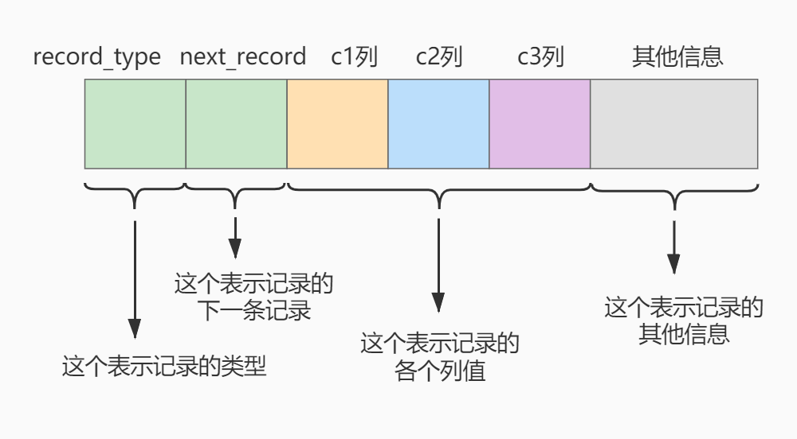

## 一、索引概述

`MySQL` 官方对索引的定义为：**索引（`Index`）是帮助 `MySQL` 高效获取数据的数据结构**。

**索引的本质：** 索引是数据结构。简单理解为“排好序的快速查找数据结构”，满足特定[查找算法](https://so.csdn.net/so/search?q=查找算法&spm=1001.2101.3001.7020)。**这些数据结构以某种方式指向数据**， 这样就**可以在这些数据结构的基础上实现`高级查找算法`**。

**索引是在存储引擎中实现的**，因此每种[存储引擎](https://so.csdn.net/so/search?q=存储引擎&spm=1001.2101.3001.7020)的索引不一定完全相同，并且每种存储引擎不一定支持所有索引类型。同时，**存储引擎可以定义每个表的最大索引数和最大索引长度**。所有存储引擎支持每个表至少16个索引，总索引长度至少为256字节。有些存储引擎支持更多的索引数和更大的索引长度。

### 1.1 为什么使用索引


假如给数据使用 **搜索二叉树** 这样的数据结构进行存储，如下图所示 :


### 1.2 索引的优缺点  

#### 1.2.1 优点

- 类似大学图书馆建书目索引，提高数据检索的效率，降低**数据库的IO成本**，这也是创建索引最主要的原因。
- 通过创建唯一索引，可以保证数据库表中**每一行数据的唯一性**。
- 在实现数据的参考完整性方面，可以**加速表和表之间的连接**。换句话说，对于有依赖关系的子表和父表联合查询时，可以提高查询速度。
- 在使用分组和排序子句进行数据查询时，可以显著**减少查询中分组和排序的时间**，降低了CPU的消耗。

#### 1.2.2 缺点

- 创建索引和维护索引要**耗费时间**，并且随着数据量的增加，所耗费的时间也会增加。
- **索引需要占磁盘空间**，除了数据表占数据空间之外，每一个索引还要占一定的物理空间存储在磁盘上，如果有大量的索引，索引文件就可能比数据文件更快达到最大文件尺寸。
- 虽然索引大大提高了查询速度，同时却会**降低更新表的速度**。当对表中的数据进行增加、删除和修改的时候，索引也要动态地维护，这样就降低了数据的维护速度。

## 二、`InnoDB` 中索引的推演

### 2.1 索引之前的查找

```sql
SELECT [列名列表] FROM 表名 WHERE 列名 = xxx;
```

### 2.2 在一个页中的查找

假设目前表中的**记录比较少**，所有的记录都可以被**存放在一个页中**，在查找记录的时候可以根据搜索条件的不同分为两种情况：

- 以**主键**为搜索条件
  - 可以在**页目录**中使用**二分法**快速定位到对应的槽，然后再遍历该槽对应分组中的记录即可快速找到指定的记录。
- 以**其他列**作为搜索条件
  - 因为在数据页中并**没有对非主键建立所谓的页目录**，所以我们**无法通过二分法快速定位**相应的槽。这种情况下**只能从最小记录开始依次遍历单链表中的每条记录**，然后对比每条记录是不是符合搜索条件。很显然，这种查找的效率是非常低的。

### 2.3 在很多页中查找

大部分情况下我们表中存放的记录都是非常多的，需要好多的数据页来存储这些记录。在很多页中查找记录的话可以分为两个步骤：

1. 定位到记录所在的页。

2. 从所在的页内查找相应的记录。

**在没有索引的情况下**，不论是根据主键列或者其他列的值进行查找，由于我们并**不能快速的定位到记录所在的页**，所以**只能从第一个页沿着双向链表一直往下找**，在**每一个页中根据我们上面的查找方式去查找指定的记录**。因为要遍历所有的数据页，所以这种方式显然是超级耗时的。

### 2.4 设计索引

```sql
mysql> CREATE TABLE index_demo(
    -> c1 INT,
    -> c2 INT,
    -> c3 CHAR(1),
    -> PRIMARY KEY(c1)
    -> ) ROW_FORMAT = Compact;
```

这个新建的 index_demo 表中有2个INT类型的列，1个CHAR(1)类型的列，而且我们规定了**c1列为主键**，这个表使用 Compact 行格式来实际存储记录的。这里我们简化了index_demo表的行格式示意图：



- `record_type`：记录头信息的一项属性，表示**记录的类型**，0表示普通记录、1表示目录项记录、2表示最小记录、3表示最大记录。
- `next_record`：记录头信息的一项属性，表示**下一条地址相对于本条记录的地址偏移量**，我们用箭头来表明下一条记录是谁。
- `各个列的值`：这里只**记录在index_demo表中的三个数据列**，分别是c1、c2和c3。
- `其他信息`：除了上述3种信息以外的所有信息，包括其他隐藏列的值以及记录的额外信息。

将记录格式示意图的**其他信息项暂时去掉**并把它**竖起来**的效果就是这样：


把一些记录放到页里的示意图就是：


#### 2.4.1 一个简单的索引设计方案

我们在根据某个搜索条件查找一些记录时**为什么要遍历所有的数据页呢**？因为**各个页中的记录并没有规律**，我们**并不知道我们的搜索条件匹配哪些页中的记录**，所以不得不依次遍历所有的数据页。所以如果我们想快速的定位到需要查找的记录在哪些数据页中该咋办？我们可以**为快速定位记录所在的数据页而建立一个目录**，建这个目录必须完成下边这些事：

##### 2.4.1.1 下一个数据页中用户记录的主键值必须大于上一个页中用户记录的主键值。

假设:每个数据页最多能存放3条记录（实际上一个数据页非常大，可以存放下好多记录)。有了这个假设之后我们向index_demo表插入3条记录:


那么这些记录已经**按照主键值的大小**串联成一个**单向链表**了，如图所示:


从图中可以看出来, index_demo表中的**3条记录都被插入到了编号为10的数据页**中了。此时我们**再来插入一条记录**:


注意，**新分配的数据页编号可能并不是连续的**。它们只是**通过维护着上一个页和下一个页的编号而建立了链表关系**。

另外，**页10中用户记录最大的主键值是5**，而**页28中有一条记录的主键值是4**，因为5>4，所以这就**不符合下一个数据页中用户记录的主键值必须大于上一个页中用户记录的主键值的要求**，所以在插入主键值为4的记录的时候**需要伴随着一次记录移动**，也就是**把主键值为5的记录移动到页28中，然后再把主键值为4的记录插入到页10中**，这个过程的示意图如下:


这个过程表明了在对页中的记录进行增删改操作的过程中，我们必须通过一些诸如记录移动的操作来始终保证这个状态一直成立：**下一个数据页中用户记录的主键值必须大于上一个页中用户记录的主键值，这个过程我们称为`页分裂`。**

因为这些`16KB`的**页在物理存储上是不连续的**，所以如果想从这么多页中根据主键值快速定位某些记录所在的页，我们**需要给它们做个目录**，**每个页对应一个目录项**，**每个目录项包括下边两个部分**:

- 页的用户记录中**最小的主键值**，我们用key来表示。
- **页号**，我们用page_no表示。

##### 2.4.1.2 给所有的页建立一个目录项

所以我们为上边几个页做好的目录就像这样子：


以 **页28** 为例，它对应**目录项2** ，这个目录项中包含着**该页的页号 28** 以及该页中用户记录的**最小主键值 5**  。我们只需要把几个目录项在物理存储器上连续存储（比如：数组），就可以实现根据主键值快速查找某条记录的功能了。比如：**查找主键值为 20  的记录，具体查找过程分两步：**

1. 先从**目录项**中根据 **二分法** 快速确定出主键值为 20 的记录在 **目录项3** 中（因为 12 < 20 < 209 ），它**对应的页是页9** 。
2. 再根据前边说的在**页中查找记录的方式**去**页9 中定位具体的记录**。至此，针对数据页做的简易目录就搞定了。**这个目录有一个别名，称为 索引** 。

#### 2.4.2 `InnoDB` 中的索引方案

##### 2.4.2.1 迭代1次：目录项纪录的页

我们把前边使用到的**目录项**放到**数据页**中的样子就是这样：


从图中可以看出来，我们新分配了一个**编号为30的页来专门存储目录项记录**。这里再次强调**目录项记录**和**普通的用户记录**的**不同点**：