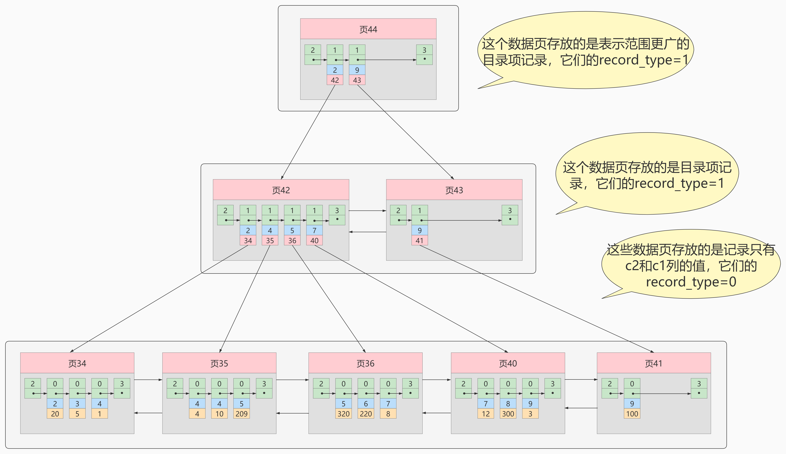
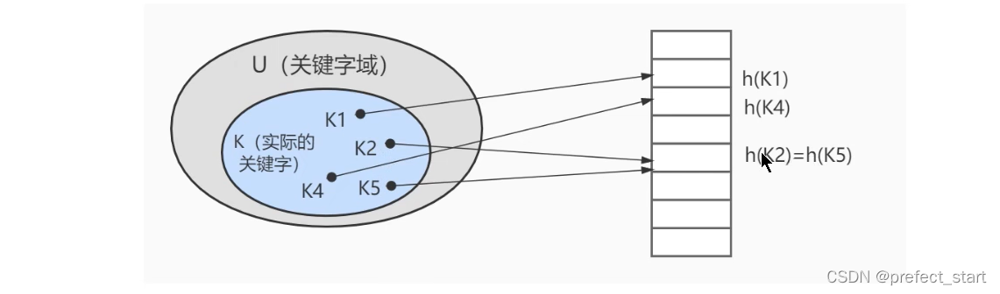

## 一、索引概述

`MySQL` 官方对索引的定义为：**索引（`Index`）是帮助 `MySQL` 高效获取数据的数据结构**。

**索引的本质：** 索引是数据结构。简单理解为“排好序的快速查找数据结构”，满足特定[查找算法](https://so.csdn.net/so/search?q=查找算法&spm=1001.2101.3001.7020)。**这些数据结构以某种方式指向数据**， 这样就**可以在这些数据结构的基础上实现`高级查找算法`**。

**索引是在存储引擎中实现的**，因此每种[存储引擎](https://so.csdn.net/so/search?q=存储引擎&spm=1001.2101.3001.7020)的索引不一定完全相同，并且每种存储引擎不一定支持所有索引类型。同时，**存储引擎可以定义每个表的最大索引数和最大索引长度**。所有存储引擎支持每个表至少16个索引，总索引长度至少为256字节。有些存储引擎支持更多的索引数和更大的索引长度。

### 1.1 为什么使用索引


假如给数据使用 **搜索二叉树** 这样的数据结构进行存储，如下图所示 :


### 1.2 索引的优缺点  

#### 1.2.1 优点

- 类似大学图书馆建书目索引，提高数据检索的效率，降低**数据库的IO成本**，这也是创建索引最主要的原因。
- 通过创建唯一索引，可以保证数据库表中**每一行数据的唯一性**。
- 在实现数据的参考完整性方面，可以**加速表和表之间的连接**。换句话说，对于有依赖关系的子表和父表联合查询时，可以提高查询速度。
- 在使用分组和排序子句进行数据查询时，可以显著**减少查询中分组和排序的时间**，降低了CPU的消耗。

#### 1.2.2 缺点

- 创建索引和维护索引要**耗费时间**，并且随着数据量的增加，所耗费的时间也会增加。
- **索引需要占磁盘空间**，除了数据表占数据空间之外，每一个索引还要占一定的物理空间存储在磁盘上，如果有大量的索引，索引文件就可能比数据文件更快达到最大文件尺寸。
- 虽然索引大大提高了查询速度，同时却会**降低更新表的速度**。当对表中的数据进行增加、删除和修改的时候，索引也要动态地维护，这样就降低了数据的维护速度。

## 二、`InnoDB` 中索引的推演

### 2.1 索引之前的查找

```sql
SELECT [列名列表] FROM 表名 WHERE 列名 = xxx;
```

### 2.2 在一个页中的查找

假设目前表中的**记录比较少**，所有的记录都可以被**存放在一个页中**，在查找记录的时候可以根据搜索条件的不同分为两种情况：

- 以**主键**为搜索条件
  - 可以在**页目录**中使用**二分法**快速定位到对应的槽，然后再遍历该槽对应分组中的记录即可快速找到指定的记录。
- 以**其他列**作为搜索条件
  - 因为在数据页中并**没有对非主键建立所谓的页目录**，所以我们**无法通过二分法快速定位**相应的槽。这种情况下**只能从最小记录开始依次遍历单链表中的每条记录**，然后对比每条记录是不是符合搜索条件。很显然，这种查找的效率是非常低的。

### 2.3 在很多页中查找

大部分情况下我们表中存放的记录都是非常多的，需要好多的数据页来存储这些记录。在很多页中查找记录的话可以分为两个步骤：

1. 定位到记录所在的页。

2. 从所在的页内查找相应的记录。

**在没有索引的情况下**，不论是根据主键列或者其他列的值进行查找，由于我们并**不能快速的定位到记录所在的页**，所以**只能从第一个页沿着双向链表一直往下找**，在**每一个页中根据我们上面的查找方式去查找指定的记录**。因为要遍历所有的数据页，所以这种方式显然是超级耗时的。

### 2.4 设计索引

```sql
mysql> CREATE TABLE index_demo(
    -> c1 INT,
    -> c2 INT,
    -> c3 CHAR(1),
    -> PRIMARY KEY(c1)
    -> ) ROW_FORMAT = Compact;
```

这个新建的 index_demo 表中有2个INT类型的列，1个CHAR(1)类型的列，而且我们规定了**c1列为主键**，这个表使用 Compact 行格式来实际存储记录的。这里我们简化了index_demo表的行格式示意图：


- `record_type`：记录头信息的一项属性，表示**记录的类型**，0表示普通记录、1表示目录项记录、2表示最小记录、3表示最大记录。
- `next_record`：记录头信息的一项属性，表示**下一条地址相对于本条记录的地址偏移量**，我们用箭头来表明下一条记录是谁。
- `各个列的值`：这里只**记录在index_demo表中的三个数据列**，分别是c1、c2和c3。
- `其他信息`：除了上述3种信息以外的所有信息，包括其他隐藏列的值以及记录的额外信息。

将记录格式示意图的**其他信息项暂时去掉**并把它**竖起来**的效果就是这样：


把一些记录放到页里的示意图就是：


#### 2.4.1 一个简单的索引设计方案

我们在根据某个搜索条件查找一些记录时**为什么要遍历所有的数据页呢**？因为**各个页中的记录并没有规律**，我们**并不知道我们的搜索条件匹配哪些页中的记录**，所以不得不依次遍历所有的数据页。所以如果我们想快速的定位到需要查找的记录在哪些数据页中该咋办？我们可以**为快速定位记录所在的数据页而建立一个目录**，建这个目录必须完成下边这些事：

##### 2.4.1.1 下一个数据页中用户记录的主键值必须大于上一个页中用户记录的主键值。

假设:每个数据页最多能存放3条记录（实际上一个数据页非常大，可以存放下好多记录)。有了这个假设之后我们向index_demo表插入3条记录:


那么这些记录已经**按照主键值的大小**串联成一个**单向链表**了，如图所示:


从图中可以看出来, index_demo表中的**3条记录都被插入到了编号为10的数据页**中了。此时我们**再来插入一条记录**:


注意，**新分配的数据页编号可能并不是连续的**。它们只是**通过维护着上一个页和下一个页的编号而建立了链表关系**。

另外，**页10中用户记录最大的主键值是5**，而**页28中有一条记录的主键值是4**，因为5>4，所以这就**不符合下一个数据页中用户记录的主键值必须大于上一个页中用户记录的主键值的要求**，所以在插入主键值为4的记录的时候**需要伴随着一次记录移动**，也就是**把主键值为5的记录移动到页28中，然后再把主键值为4的记录插入到页10中**，这个过程的示意图如下:


这个过程表明了在对页中的记录进行增删改操作的过程中，我们必须通过一些诸如记录移动的操作来始终保证这个状态一直成立：**下一个数据页中用户记录的主键值必须大于上一个页中用户记录的主键值，这个过程我们称为`页分裂`。**

因为这些`16KB`的**页在物理存储上是不连续的**，所以如果想从这么多页中根据主键值快速定位某些记录所在的页，我们**需要给它们做个目录**，**每个页对应一个目录项**，**每个目录项包括下边两个部分**:

- 页的用户记录中**最小的主键值**，我们用key来表示。
- **页号**，我们用page_no表示。

##### 2.4.1.2 给所有的页建立一个目录项

所以我们为上边几个页做好的目录就像这样子：


以 **页28** 为例，它对应**目录项2** ，这个目录项中包含着**该页的页号 28** 以及该页中用户记录的**最小主键值 5**  。我们只需要把**几个目录项在物理存储器上连续存储**（比如：数组），就可以实现根据主键值快速查找某条记录的功能了。比如：**查找主键值为 20  的记录，具体查找过程分两步：**

1. 先从**目录项**中根据 **二分法** 快速确定出主键值为 20 的记录在 **目录项3** 中（因为 12 < 20 < 209 ），它**对应的页是页9** 。
2. 再根据前边说的在**页中查找记录的方式**去**页9 中定位具体的记录**。至此，针对数据页做的简易目录就搞定了。**这个目录有一个别名，称为 索引** 。

#### 2.4.2 `InnoDB` 中的索引方案

##### 2.4.2.1 迭代1次：目录项纪录的页

我们把前边使用到的**目录项**放到**数据页**中的样子就是这样：


从图中可以看出来，我们新分配了一个**编号为30的页来专门存储目录项记录**。这里再次强调**目录项记录**和**普通的用户记录**的**不同点**：

- **目录项记录**的 record_type 值是1，而**普通用户记录**的 record_type 值是0。
- **目录项记录**只有**主键值**和**页的编号**两个列，而**普通的用户记录**的列是**用户自己定义的**，可能包含很多列，另外**还有 `InnoDB` 自己添加的隐藏列**。
- 了解：记录头信息里还有一个叫min_rec_mask的属性，只有在存储目录项记录的页中的主键值最小的目录项记录的min_rec_mask值为1，其他别的记录的min_rec_mask值都是0。

**相同点：** 两者用的是一样的数据页，都会**为主键值生成`Page Directory`（页目录）**，从而在按照主键值进行查找时可以使用`二分法`来加快查询速度。

现在以查找主键为20的记录为例，根据某个主键值去查找记录的步骤就可以大致拆分成下边两步：

1. 先到存储目录项记录的页，也就是页30中通过**二分法快速定位到对应目录项**，因为 12 < 20 < 209 ，所以定位到对应的**记录所在的页就是页9**。
2. 再到存储用户记录的页9中**根据二分法快速定位到主键值为20的用户记录**。

##### 2.4.2.2 迭代2次：多个目录项纪录的页


从图中可以看出，我们**插入了一条主键值为320的用户记录**之后**需要两个新的数据页**：

- 为**存储该用户记录而新生成了页31** 。
- 因为原先存储目录项记录的 页30 的容量已满 （我们前面**假设只能存储4条目录项记录**），所以不得不**需要一个新的 页32 来存放 页31 对应的目录项**。

现在因为**存储目录项记录的页不止一个**，所以如果我们**想根据主键值查找一条用户记录大致需要3个步骤**，以查找主键值为 20 的记录为例：

1. **确定目录项记录页**：我们现在的存储目录项记录的页有两个，即 页30 和 页32 ，又因为**页30表示的目录项的主键值的范围是 [1, 320)** ，**页32表示的目录项的主键值 >= 320** ，所以**主键值为 20 的记录对应的目录项记录在 页30 中**。
2. 通过目录项记录页 确定用户记录真实所在的页 。在一个存储 目录项记录 的页中通过主键值定位一条目录项记录的方式说过了。
3. 在真实存储用户记录的页中定位到具体的记录。

##### 2.4.2.3 迭代3次：目录项记录页的目录页


如图，我们**生成了一个存储更高级目录项的 页33** ，这个页中的两条记录分别代表页30和页32，如果用户记录的主键值在 [1, 320) 之间，则到页30中查找更详细的目录项记录，如果主键值 不小于320 的话，就到页32中查找更详细的目录项记录。

我们可以用下边这个图来描述这种数据结构(索引)，这个数据结构，它的名称是 **B+树** 。


### 2.5  B 树 与 B+树

`InnoDB`等存储引擎使用的是`B+`树，该数据结构在`B`树的基础上改进而来。

#### 2.5.1 B树

B-Tree，B树是一种多叉路平衡查找树，相对于二叉树，B树每个节点可以有多个分支，即多叉。  

以一颗最大度数（max-degree）为**5(5阶)的b-tree**为例，那这个B树**每个节点最多存储4个key，5**
**个指针**（**4个key划分出了五个取值范围**）：  

> 树的度数指的是一个节点的子节点个数  


我们可以通过一个数据结构可视化的网站来简单演示一下。

> https://www.cs.usfca.edu/~galles/visualization/BTree.html  

插入一组数据： 100 65 169 368 900 556 780 35 215 1200 234 888 158 90 1000 88 120 268 250 。然后观察一些数据插入过程中，节点的变化情况。  


特点：

- 5阶的B树，每一个节点最多存储4个key，对应5个指针。
- 一旦节点存储的key数量到达5，就会**裂变**，**中间元素向上分裂**。
- 在B树中，**非叶子节点和叶子节点都会存放数据**。  

#### 2.5.2 B+Tree  

B+Tree是B-Tree的变种，我们以一颗最大度数（max-degree）为3（3阶）的b+tree为例，来看一下其结构示意图：  


我们可以看到，两部分：

1. **绿色虚线**框起来的部分，是**索引部分**，仅仅起到索引数据的作用，**不存储数据**。
2. **红色虚线**框起来的部分，是**数据存储部分**，在其**叶子节点中要存储具体的数据**。  

我们可以通过一个数据结构可视化的网站来简单演示一下。

> https://www.cs.usfca.edu/~galles/visualization/BPlusTree.html  


插入一组数据： 100 65 169 368 900 556 780 35 215 1200 234 888 158 90 1000 88 120 268 250 。然后观察一些数据插入过程中，节点的变化情况。  


最终我们看到，B+Tree 与 B-Tree相比，主要有以下三点区别：

1. 所有的数据都会出现在叶子节点。
2. 叶子节点形成一个**单向链表**。
3. **非叶子节点仅仅起到索引数据作用**，**具体的数据都是在叶子节点存放的**。  

上述我们所看到的结构是**标准的B+Tree的数据结构**，接下来，我们再来看看 **MySQL中优化之后的B+Tree**。  

MySQL 索引数据结构对经典的B+Tree进行了优化。在原B+Tree的基础上，**结点（叶子和非叶子都是）通过双向链表连接**，**提高区间访问的性能，利于排序**。  

#### 2.5.3  总结

**索引结构**中数据的存储是**页为基本单位**进行存储的。

B+树中的页类型主要分为两类，一类是**数据页**，数据页中**存放的主要是节点数据，在这种类型中由页号，主键以及完整数据构成**，另外一类是**目录页**，目录页中**由当前页号、数据页中最小的主键值、主键对应的页号构成**，页与页之间是由双向链表相连接，使用**双向链表**相连接的原因主要是为了**范围查询**，在页的内部，是按照主键的大小构成的一个有序链表。

一个B+树的节点其实可以分成好多层，规定最下边的那层，也就是存放我们用户记录的那层为第0层，之后依次往上加。
之前我们做了一个非常极端的假设：存放用户记录的页最多存放3条记录，存放目录项记录的页最多存放4条记录。其实真实环境中一个页存放的记录数量是非常大的，假设所有存放用户记录的叶子节点代表的数据页可以存放100条用户记录，所有存放目录项记录的内节点代表的数据页可以存放1000条目录项记录，那么：

    如果B+树只有1层，也就是只有1个用于存放用户记录的节点，最多能存放100条记录。
    如果B+树有2层，最多能存放1000×100=10,0000条记录。
    如果B+树有3层，最多能存放1000×1000×100=1,0000,0000条记录。
    如果B+树有4层，最多能存放1000×1000×1000×100=1000,0000,0000条记录。相当多的记录！！！

你的表里能存放100000000000条记录吗？所以**一般情况下，我们用到的B+树都不会超过4层**，那我们**通过主键值去查找某条记录最多只需要做4个页面内的查找**（查找3个目录项页和一个用户记录页），又因为**在每个页面内有所谓的Page Directory（页目录）**，所以在页面内也**可以通过二分法实现快速定位记录**。

## 三、常见索引概念  

索引按照物理实现方式，索引可以分为 2 种：**聚簇（聚集）索引**和**非聚簇（非聚集）索引**。

我们也把**非聚集索引**称为**二级索引**或者**辅助索引**。  

### 3.1 聚簇索引  

特点：

1. 使用记录**主键值的大小进行记录和页的排序**，这包括三个方面的含义：  

   1. **页内** 的记录是按照**主键的大小**顺序排成一个 **单向链表** 。 
   2. 各个存放 **用户记录的页** 也是根据页中用户记录的**主键大小**顺序排成一个 **双向链表** 。   
   3. 存放 **目录项记录的页** 分为**不同的层次**，在**同一层次中的页**也是根据页中**目录项记录的主键**
      **大小**顺序排成一个 **双向链表**  

2. B+树的 **叶子节点** 存储的是**完整的用户记录**。  

   所谓完整的用户记录，就是指这个记录中存储了所有列的值（包括隐藏列）。  

优点：

1. 数据访问更快 ，因为聚簇索引将**索引和数据保存在同一个B+树中**，因此从**聚簇索引**中获取数据比**非聚簇索引**更快
2. 聚簇索引对于**主键**的 **排序查找** 和 **范围查找** 速度非常快
3. 按照聚簇索引排列顺序，查询**显示一定范围数据的时候**，由于数据都是紧密相连，数据库**不用从多个数据块中提取数据**，所以 **节省了大量的io操作** 。  

缺点：

1. **插入速度严重依赖于插入顺序** ，**按照主键的顺序插入是最快的方式**，**否则将会出现页分裂，严重影响性能**。因此，**对于InnoDB表，我们一般都会定义一个自增的ID列为主键**
2. **更新主键的代价很高** ，因为将会导致被更新的行移动。因此，**对于InnoDB表，我们一般定义主键为不可更新**
3. **二级索引访问**需要**两次索引查找** ，**第一次找到主键值**，**第二次根据主键值进行聚簇索引找到行数据**  

### 3.2 二级索引（辅助索引、非聚簇索引）  

下面是以非主键`c2`构造的二级索引，在最下面的**叶子结点**中，每条数据**不止单单存储`c2`列的数据，还需要额外存储主键`c1`列的数据**（**目的是进行回表操作**）



1. **什么是回表？**

回表是指我们根据这个**以非主键字段大小排序**的B+树只能确定我们**要查找记录的主键值**，所以如果我们**想根据非主键字段的值查找到完整的用户记录**的话，**仍然需要到聚簇索引中再查一遍**，这个过程称为`回表` 。

也就是**根据 `c2` 列的值查询一条完整的用户记录需要使用到 2 棵B+树！**

**因为这种按照非主键列建立的B+树需要一次回表操作才可以定位到完整的用户记录，所以这种B+树也被称为二级索引(英文名secondary index )，或者辅助索引**。

由于我们使用的是c2列的大小作为B+树的排序规则，所以我们也称这个B+树是为c2列建立的索引。**非聚簇索引的存在不影响数据在聚簇索引中的组织**，所以**一张表可以有多个非聚簇索引**。

2. **问题:为什么我们还需要一次回表操作呢?直接把完整的用户记录放到叶子节点不OK吗?**

如果把完整的用户记录放到叶子节点是可以不用回表。但是太占空间了，相当于每建立一棵B+树都需要把所有的用户记录再都拷贝一遍，这就有点太浪费存储空间了。


### 3.3 聚簇索引与非聚簇索引的区别

- **聚簇索引的叶子节点**存储的就是我们的**数据记录**，**非聚簇索引的叶子节点**存储的是**数据位置**，**非聚簇索引不会影响数据表的物理存储顺序。**
- **一个表只能有一个聚簇索引**，因为只能有一种排序存储的方式，但**可以有多个非聚簇索引**，也就是多个索引目录提供数据检索。
- 使用**聚簇索引**的时候，**数据的查询效率高**，但如果**对数据进行插入，删除，更新等操作，效率会比非聚簇索引低**。

### 3.4 联合索引

**本质也是二级索引**，但**同时以多个列的大小作为排序规则**，也就是**同时为多个列建立索引**，比方说我们想让B+树**按照 `c2` 和 `c3` 列 的大小进行排序**，这个包含两层含义：

1. 先把各个记录和页按照c2列进行排序。
2. 在记录的c2列相同的情况下，采用c3列进行排序


注意一点，**以c2和c3列的大小为排序规则**建立的B+树称为 联合索引 ，本质上也是一个二级索引。它的意思与**分别为c2和c3列分别建立索引**的表述是不同的，不同点如下：   

- **建立联合索引**只会建立如上图一样的**1棵B+树**。
- 为c2和c3列**分别建立索引**会分别以c2和c3列的大小为排序规则**建立2棵B+树**。

## 四、 `InnoDB` 的 `B+` 树索引的注意事项

### 4.1  根页面位置万年不动

我们前边介绍B+索引的时候，为了大家理解上的方便，先把存储用户记录的叶子节点都画出来，然后接着画存储目录项记录的内节点，**实际上B+树的形成过程**是这样的：

- 每当**为某个表创建一个B+树索引**（聚簇索引不是人为创建的，默认就有）的时候，都会**为这个索引创建一个根节点页面**。**最开始表中没有数据**的时候，每个B+树索引对应的**根节点页面中既没有用户记录，也没有目录项记录**。
- 随后向表中**插入用户记录**时，**先把用户记录存储到这个根节点页面**中。
- 当**根节点页面中的可用空间用完**时继续插入记录，此时会**将根节点页面中的所有记录复制到一个新分配的页**，比如页a中，然后**添加插入记录数据**时，对这个**新页进行页分裂的操作，得到另一个新页，比如页b**。这时新插入的记录根据键值（也就是聚簇索引中的主键值，二级索引中对应的索引列的值）的大小就会被分配到页a或者页b中，而**根节点页面**便升级为**存储目录项记录的页**。

这个过程特别注意的是：**一个B+树索引的根页面自诞生之日起，便不会再移动**。这样只要我们对某个表建立一个索引，那么它的根页面的页号便会被记录到某个地方，然后**凡是`InnoDB`存储引擎需要用到这个索引的时候**，都会**从那个固定的地方取出根页面的页号，从而来访问这个索引**。

### 4.2 内节点中目录项记录的唯一性

我们知道B+树索引的内节点中**目录项记录**的内容是 **索引列+页号** 的搭配，但是这个搭配**对于二级索引来说有点不严谨**。还拿`index_demo`表为例，假设这个表中的数据是这样的：


如果二级索引中目录项的内容只是`索引号+页号`的搭配的话，那么为`c2`列建立索引后的B+树应该长这样：


如果我们**想要新插入一行记录，其中c1、c2、c3的值分别是：9、1、c**，那么在修改这个为c2列建立的二级索引对应的B+树时便碰到了个大问题：由于页3中存储的目录项记录是由 `c2列+页号` 的值构成的，**页3中的两条目录项记录对应的c2列**的**值都是1**，那么我们**这条新插入的记录到底应该放在页4中，还是应该放在页5中**啊？

为了让新插入记录能找到自己在哪个页里，我们需要 **保证在B+树的同一层内节点的目录项记录除页号这个字段以外仍是唯一的。** 所以对于**二级索引**的内节点的**目录项记录**的内容**实际上是由三个部分构成**的：

- 索引列的值
- 主键值（主键值必须且肯定是唯一的）
- 页号

也就是我们**把主键值也添加到二级索引内节点中的目录项记录**了，这样就能保证B+树每一层内节点中各条目录项记录除页号这个字段外也是唯一的，所以我们为c2列建立二级索引后的示意图实际上应该是这样子的：


这样我们再插入记录(9, 1, 'c')时，由于页3中存储的目录项记录是由`c2列+主键+页号`的值构成的，可以先把新记录的c2列的值和页3中各目录项记录的c2列的值作比较，**如果c2列的值相同的话，可以接着比较主键值**，因为B+树同一层中不同目录项记录的c2列+主键的值肯定是不一样的，所以最后**肯定能定位唯一的一条目录项记录**，在本例中**最后确定新记录应该被插入到页5中**。

### 4.3 一个页面至少存储2条记录

一个B+树只需要很少的层级就可以轻松存储数亿条记录，查询速度相当不错！这是因为B+树本质上就是一个大的多层级目录，每经过一个目录时都会过滤掉许多无效的子目录，直到最后访问的存储真实数据的目录。

那如果一个大的目录中只存放一个子目录是个啥效果呢？
那就是目录层级非常非常非常多，而且最后的那个存放真实数据的目录中存放一条记录。显然是并不合适的，所以InnoDB的一个数据页至少存放两条记录。

## 五、`MyISAM` 中的索引方案

B+树索引适用存储引擎如表所示：

| 索引 / 存储引擎 | `MyISAM ` | `InnoDB ` | `Memory` |
| --------------- | --------- | --------- | -------- |
| B+ Tree索引     | 支持      | 支持      | 支持     |

`Innodb`和 `MyISAM` 默认的索引是 `Btree` 索引；而 `Memory` 默认的索引是 `Hash` 索引。  

**即使多个存储引擎支持同一种类型的索引，但是他们的实现原理也是不同的**。

`MyISAM`引擎使用 `B+Tree` 作为索引结构，**叶子节点的`data`域**存放的是 **数据记录的地址（不是行数据本身）** 。  

### 5.1 `MyISAM` 索引的原理  

我们知道 `InnoDB` 中**索引即数据**，也就是聚簇索引的那棵B+树的**叶子节点中已经把所有完整的用户记录都包含**了，而 **`MyISAM` 的索引方案**虽然也使用树形结构，但是却**将索引和数据分开存储**︰

- 将**表中的记录**按照记录的**插入顺序**单独存储在一个文件中，称之为**数据文件(MYD文件)**。这个文件并不划分为若干个数据页，**有多少记录就往这个文件中塞多少记录**就成了。由于在**插入数据的时候**并**没有刻意按照主键大小排序**，所以我们并**不能在这些数据上使用二分法进行查找**。
- 使用 `MyISAM` 存储引擎的表会把**索引信息另外仔储到一个新的文件(MYI文件)**中，而这个文件的构成是**主键和数据记录地址的创建一个索引**，只不过在索引的叶子节点中存储的不是完整的用户记录，而是**主键值＋数据记录地址**的组合。

下面是以Col1建立的一个索引（二级索引），则此索引的结构如下图所示：  


这里设表一共有三列，我们以Col1为主键，上图是一个MylSAM表的主索引(Primary key)示意。可以看出**MyISAM的索引文件仅仅保存数据记录的地址**。

**在MyISAM中，主键索引和二级索引 (Secondary key)在结构上没有任何区别**，只是主键索引要求key是唯一的，而二级索引的key可以重复。

如果我们在col2上建立一个二级索引，则此索引的结构如下图所示:


同样也是一棵B+Tree，data域保存数据记录的地址。因此，MyISAM中索引检索的算法为:**首先按照B+Tree搜索算法搜索索引，如果指定的Key存在，则取出其data域的值，然后以data域的值为地址，读取相应数据记录。**

### 5.2 `MyISAM` 与 `InnoDB` 对比

**`MyISAM`的索引方式都是“非聚簇”的，与`InnoDB`包含1个聚簇索引是不同的。**

**两种引擎中索引的区别：**

- 在 `InnoDB` 存储引擎中，我们只需要**根据主键值对聚簇索引进行一次查找**就能找到对应的记录，而**在 `MyISAM` 中却需要进行一次回表操作**，意味着 `MyISAM` 中建立的**索引相当于全部都是二级索引**。

- `InnoDB` 的数据文件本身就是索引文件，而 `MyISAM` **索引文件和数据文件是分离的**，**索引文件仅保存数据记录的地址**。
- `InnoDB` 的**非聚簇索引** `data` 域存储**相应记录主键的值**，而`MyISAM` **索引记录的是地址**。换句话说，`InnoDB` 的所有非聚簇索引都引用主键作为data域。
- `MyISAM` 的**回表操作是十分快速的**，因为是**拿着地址偏移量直接到文件中取数据**的，反观 `InnoDB` 是通过获取主键之后再去聚簇索引里找记录，虽然说也不慢，但还是比不上直接用地址去访问。
- **`InnoDB` 要求表必须有主键（`MyISAM` 可以没有）**。如果在`innoDB`的表中没有显式指定，则`MySQL` 系统会自动选择一个非空且唯一标识数据记录的列作为主键。如果不存在这种列，则`MySQL`自动为`InnoDB`表生成一个隐含字段作为主键，这个字段长度为6个字节，类型为长整型。

## 六、索引的代价

索引是个好东西，但可不能乱建，因为它在空间和时间上都会有消耗：

### 6.1 空间上的代价

**每建立一个索引都要为它建立一棵B+树**，每一棵B+树的**每一个节点都是一个数据页**，**一个页默认会占用 16KB 的存储空间**，一棵很大的B+树由许多数据页组成，那就是很大的一片存储空间。

### 6.2 时间上的代价

每次对表中的数据进行 **增、删、改** 操作时，都需要去**修改各个B+树索引**。

而且我们讲过，**B+树每层节点**都是按照**索引列**的值 **从小到大的顺序排序** 而组成了 **双向链表** 。

不论是叶子节点中的记录，还是内节点中的记录（也就是不论是用户记录还是目录项记录）都是按照索引列的值从小到大的顺序而形成了一个单向链表。而**增、删、改**操作可能会**对节点和记录的排序造成破坏**，所以存储引擎需要**额外的时间**进行一些 **记录移位 ， 页面分裂 、 页面回收** 等操作来**维护好节点和记录的排序**。如果我们**建了多个索引**，**每个索引对应的B+树都要进行相关的维护操作**，会给性能拖后腿。

## 七、`MySQL` 数据结构选择的合理性

从MySQL的角度讲，不得不考虑一个现实问题就是**磁盘IO**。如果我们能**让索引的数据结构尽量减少硬盘的I/O操作，所消耗的时间也就越小**。可以说，磁盘的 I/O 操作次数对索引的使用效率至关重要。

查找都是索引操作，**一般来说索引非常大**，尤其是关系型数据库，**当数据量比较大的时候，索引的大小有可能几个G甚至更多**，为了减少索引在内存的占用，**数据库索引是存储在外部磁盘上**的。当我们**利用索引查询的时候，不可能把整个索引全部加载到内存，只能逐一加载**，那么MySQL**衡量查询效率的标准**就是**磁盘lO次数**。

### 7.1 `Hash`结构

Hash本身是一个函数，又被称为散列函数，它可以帮助我们大幅提升检索数据的效率。

Hash算法是通过某种确定性的算法(比如MD5、SHA1、SHA2、SHA3)将输入转变为输出。相同的输入永远可以得到相同的输出，假设输入内容有微小偏差，在输出中通常会有不同的结果。

举例:如果你想要验证两个文件是否相同，那么你不需要把两份文件直接拿来比对，只需要让对方把 Hash 函数计算得到的结果告诉你即可，然后在本地同样对文件进行Hash 函数的运算，最后通过比较这两个Hash函数的结果是否相同，就可以知道这两个文件是否相同。

加快查找速度的数据结构，常见的有两类:

1. 树，例如平衡二叉搜索树，查询/插入/修改/删除的平均时间复杂度都是O(log2N);
2. 哈希，例如HashMap，查询/插入/修改/删除的平均时间复杂度都是0( 1) ;

采用Hash进行检索效率非常高，**基本上一次检索就可以找到数据**，而**B+树需要自顶向下依次查找，多次访问节点才能找到数据**，中间需要多次lO操作，从**效率来说Hash比 B+树更快**。

在哈希的方式下，一个元素k处于h(k)中，即利用哈希函数h，根据关键字k计算出槽的位置。函数h将关键字域映射到哈希表T[o…m-1]的槽位上。



#### 7.1.1 Hash结构效率高，那为什么索引结构要设计成树型呢?

- 原因1: **Hash索引仅能满足(=) (<>）和IN查询**。如果进行**范围查询**，哈希型的索引，**时间复杂度会退化为O(n)**；而**树型**的“有序”特性，依然能够**保持O(log2N)的高效率**。
- 原因2: Hash索引还有一个缺陷，**数据的存储是没有顺序**的，在**ORDER BY的情况下**，使用Hash索引还**需要对数据重新排序**。
- 原因3:对于**联合索引**的情况，Hash值是**将联合索引键合并后一起来计算的**，无法对单独的一个键或者几个索引键进行查询，这就可能导致**单键哈希不同但是合并后哈希相同的错误情况**。
- 原因4:对于等值查询来说，通常Hash 索引的效率更高，不过也存在一种情况，就是**索引列的重复值如果很多，效率就会降低**。这是因为**遇到Hash冲突时，需要遍历桶（出现哈希碰撞的数值会被存储到同一个`bucket`中，构成一个链表，重复越多链表越长）中的行指针来进行比较**，找到查询的关键字非常耗时。所以，**Hash索引通常不会用到重复值多的列上**，比如列为性别、年龄的情况等。

#### 7.1.2 Hash索引的适用性

Hash索引存在着很多限制，相比之下在数据库中B+树索引的使用面会更广，不过也有一些场景采用Hash索引效率更高，比如在键值型(Key-value)数据库中，Redis存储的核心就是 Hash表。

MysQL中的**Memory存储引擎支持Hash存储**，如果我们需要用到**查询的临时表**时，就可以选择Memory存储引擎，把某个字段设置为Hash 索引，比如字符串类型的字段，进行Hash计算之后长度可以缩短到几个字节。**当字段的重复度低，而且经常需要进行等值查询的时候，采用Hash索引是个不错的选择。**

另外，**InnoDB本身不支持 Hash索引**，但是提供**自适应Hash索引**(Adaptive Hash Index)。

- **什么情况下才会使用自适应Hash 索引呢?**

如果**某个数据经常被访问**，当满足一定条件的时候，就会**将这个数据页的地址存放到Hash表中**。这样**下次查询的时候**，就可以**直接找到这个页面的所在位置**。这样证B+树也具备了Hash 索引的优点。


采用自适应 Hash 索引目的是**方便根据 SQL 的查询条件加速定位到叶子节点**，特别是当 B+ 树比较深的时候，通过自适应 Hash 索引可以明显提高数据的检索效率。

我们可以通过 innodb_adaptive_hash_index 变量来查看是否开启了自适应 Hash，比如：

```sql
mysql> show variables like '%adaptive_hash_index';
```


### 7.2 二叉搜索树

如果我们利用二叉树作为索引结构，那么磁盘的IO次数和索引树的高度是相关的。

#### 7.2.1 二叉搜索树的特点

- —个节点只能有两个子节点，也就是一个节点度不能超过2
- 左子节点<本节点  ， 右子节点>=本节点，比我大的向右，比我小的向左

#### 7.2.2 查找规则

我们先来看下最基础的二叉搜索树(Binary Search Tree)，搜索某个节点和插入节点的规则一样，我们假设搜索插入的数值为key:

- 如果key大于根节点，则在右子树中进行查找;
- 如果key小于根节点，则在左子树中进行查找;
- 如果key等于根节点，也就是找到了这个节点，返回根节点即可。

举个例子，我们对数列(34，22，89，5，23，77，91）创造出来的二分查找树如下图所示:


但是在**极端的条件下**，查询的**时间复杂度会变成O（n）级别**


为了提高查询效率，就需要 减少磁盘IO数 。**为了减少磁盘IO的次数**，就需要尽量 **降低树的高度** ，需要把原来“瘦高”的树结构变的“矮胖”，**树的每层的分叉越多越好**。

### 7.3 `AVL` 树

为了解决上面**二叉查找树退化成链表的问题**，人们提出了平衡二叉搜索树(Balanced Binary Tree)，又称为`AVL`树(有别于`AVL`算法)，它在二叉搜索树的基础上增加了约束，具有以下性质:

- 它是一棵空树或它的左右两个子树的高度差的绝对值不超过1
- 左右两个子树都是一棵平衡二叉树

这里说一下，常见的平衡二叉树有很多种，包括了平衡二叉搜索树、红黑树、数堆、伸展树。平衡二叉搜索树是最早提出来的自平衡二叉搜索树，当我们提到平衡二叉树时一般指的就是平衡二叉搜索树。事实上，第一棵树就属于平衡二叉搜索树，搜索时间复杂度就是o( log2n)。

数据查询的时间主要依赖于**磁盘IO的次数**，如果我们采用二叉树的形式，即使通过平衡二叉搜索树进行了改进，**树的深度也是o(log2n)**，**当 n 比较大时，深度也是比较高的**，比如下图的情况:


针对同样的数据，如果我们把**二叉树改成 M 叉树 （M>2）**呢？当 M=3 时，同样的 31 个节点可以由下面的三叉树来进行存储：


### 7.4 B-Tree

B 树的结构如下图所示：


B树作为多路平衡查找树，它的**每一个节点最多可以包括M个子节点**，M称为B树的阶。**每个磁盘块中包括了关键字和子节点的指针**。如果一个磁盘块中**包括了x个关键字，那么指针数就是x+1**。对于一个100阶的B树来说，如果有3层的话最多可以存储约100万的索引数据。**对于大量的索引数据来说，采用B树的结构是非常适合的，因为树的高度要远小于二叉树的高度。**

一个 M 阶的 B 树（M>2）有以下的特性：

1. 根节点的孩子节点数目的范围是 [2,M]。
2. 每个中间节点包含 k-1 个关键字和 k 个孩子，孩子的数量 = 关键字的数量 +1，k 的取值范围为[ceil(M/2), M]。
3. 叶子节点包括 k-1 个关键字（叶子节点没有孩子），k 的取值范围为 [ceil(M/2), M]。
4. 假设中间节点节点的关键字为：Key[1], Key[2], …, Key[k-1]，且关键字按照升序排序，即 Key[i] <Key[i+1]。此时 k-1 个关键字相当于划分了 k 个范围，也就是对应着 k 个指针，即为：P[1], P[2], …,P[k]，其中 P[1] 指向关键字小于 Key[1] 的子树，P[i] 指向关键字属于 (Key[i-1], Key[i]) 的子树，P[k]指向关键字大于 Key[k-1] 的子树。
5. **所有叶子节点位于同一层**。

上面那张图所表示的 B 树就是一棵 3 阶的 B 树。我们可以看下磁盘块 2，里面的关键字为（8，12），它有 3 个孩子 (3，5)，(9，10) 和 (13，15)，你能看到 (3，5) 小于 8，(9，10) 在 8 和 12 之间，而 (13，15)大于 12，刚好符合刚才我们给出的特征。

然后我们来看下如何用 B 树进行查找。假设我们想要**查找的关键字是 9**，那么步骤可以分为以下几步：

1. 我们与根节点的关键字 (17，35）进行比较，9 小于 17 那么得到指针 P1；
2. 按照指针 P1 找到磁盘块 2，关键字为（8，12），因为 9 在 8 和 12 之间，所以我们得到指针 P2；
3. 按照指针 P2 找到磁盘块 6，关键字为（9，10），然后我们找到了关键字 9。

你能看出来在 B 树的搜索过程中，我们比较的次数并不少，但如果把数据读取出来然后在内存中进行比较，这个时间就是可以忽略不计的。而**读取磁盘块本身需要进行 I/O 操作**，**消耗的时间比在内存中进行比较所需要的时间要多**，是数据查找用时的重要因素。**B 树相比于平衡二叉树来说磁盘 I/O 操作要少，在数据查询中比平衡二叉树效率要高**。所以只要**树的高度足够低，IO次数足够少，就可以提高查询性能。**

**小结:**

1. B树在**插入和删除节点**的时候如果导致例个平倒，就通过**自动调整节点的位置来保持树的自平衡**。
2. 关键字集合分布在整棵树中,即**叶子节点和非叶子节点都存放数据**。搜索有可能在非叶子节点结束
3. 其**搜索性能等价于在关键字全集内做一次二分查找**。


### 7.5 B+Tree

B+树也是一种多路搜索树，基于B树做出了改进，主流的DBMS都支持B+树的索引方式，比如MySQL。相比于B-Tree，B+Tree适合文件索引系统。

#### 7.5.1 B+树和B树的差异

1. 有 k 个孩子的节点就有 k 个关键字。也就是**孩子数量 = 关键字数**，而 **B 树中，孩子数量 = 关键字数+1**。
2. **非叶子节点的关键字（索引列的值）也会同时存在在子节点中**，**并且是在子节点中所有关键字的最大（或最小）**。
3. **非叶子节点仅用于索引，不保存数据记录**，跟**记录有关的信息都放在叶子节点**中。而 B 树中， 非叶子节点既保存索引，也保存数据记录。
4. **所有关键字都在叶子节点出现**，**叶子节点构成一个有序链表**，而且**叶子节点本身按照关键字的大小从小到大顺序链接**。

> B 树和 B+ 树都可以作为索引的数据结构，在 MySQL 中采用的是 B+ 树。
>  但B树和B+树各有自己的应用场景，不能说B+树完全比B树好，反之亦然。

#### 7.5.2 思考题：为了减少IO，索引树会一次性加载吗？

1. 数据库索引是存储在磁盘上的，如果数据量很大，必然导致索引的大小也会很大，超过几个G。
2. 当我们利用索引查询时候，是不可能将全部几个G的索引都加载进内存的，我们能做的只能是：**逐一加载每一个磁盘页，因为磁盘页对应着索引树的节点。**

#### 7.5.3 思考题：B+树的存储能力如何？为何说一般查找行记录，最多只需1~3次磁盘IO

1. InnoDB存储引擎中**页的大小为16KB**，一般表的主键类型为INT(占用4个字节)或BIGINT(占用8个字节)，指针类型也一般为4或8个字节，也就是说**一个页（B+Tree中的一个节点）中大概存储16KB/(8B+8B)=1K个键值**，因为是估算，为了方便计算，这里的K取值为10^3。
   也就是说**一个深度为3的B+Tree索引可以维护10^3 * 10^3 * 10^3 = 10亿条记录**。（这里假定一个数据页也存储10^3条行记录数据了）
2. 实际情况中**每个节点可能不能填充满**，因此在数据库中，**B+Tree的高度一般都在2~4层**。MySQL的InnoDB存储引擎在设计时是将**根节点常驻内存的**，也就是说**查找某一键值的行记录时最多只需要1~3次磁盘I/O操作**

#### 7.5.4 思考题：为什么说B+树比B-树更适合实际应用中操作系统的文件索引和数据库索引？

1. B+树的**查询效率更加稳定**，B树的每个节点中都存放了数据，每次查询的速度都不一样，**B+树只有叶子节点存放数据，每次查询的速度都一样**。
2. B+树的**叶子节点形成了一个有序链表，可以轻松地支持范围查询**。而B树需要在内部节点进行搜索，范围查询时需要遍历整个B树，效率较低。
3. B+树的磁盘读写代价更低，因为**B树的每个节点中都存放了数据，导致每个页中的存储条数变少，要加载更多页，增加了IO的读取次数**，B+树中存储的条数更多，IO读取次数较少。

#### 7.5.5 思考题：Hash索引与B+树索引的区别

1. **Hash索引不能进行范围查询，而B+树可以**。这是因为Hash索引指向的数据是无序的，而**B+树的叶子节点是个有序的链表**。
2. **Hash索引不支持联合索引的最左侧原则**（即联合索引的部分索引无法使用），而**B+树可以**。对于联合索引来说，Hash索引在计算Hash值的时候是将索引键合并后再一起计算Hash值，所以不会针对每个索引单独计算Hash值。因此如果用到联合索引的一个或者几个索引时，联合索引无法被利用。
3. **Hash索引不支持 ORDER BY 排序**，因为Hash索引指向的数据是无序的，因此无法起到排序优化的作用，而B+树索引数据是有序的，可以起到对该字段ORDER BY 排序优化的作用。同理，我们也**无法用Hash索引进行模糊查询**，而B+树使用LIKE进行模糊查询的时候，LIKE后面后模糊查询（比如%结尾）的话就可以起到优化作用。
4. `InnoDB`**不支持哈希索引**

#### 7.5.6 思考题：Hash 索引与 B+ 树索引是在建索引的时候手动指定的吗？

针对`InnoDB`和`MylSAM`存储引擎，都会默认采用B+树索引，无法使用Hash索引。InnoDB提供的自适应Hash是不需要手动指定的。如果是Memory和NDB存储引擎，是可以进行选择Hash索引的

### 7.6 R树

R-Tree在MySQL很少使用，**仅支持geometry数据类型**，支持该类型的存储引擎只有myisam、innodb、ndb、archive几种。

举个R树在现实领域中能够解决的例子:**查找20英里以内所有的餐厅**。

**如果没有R树你会怎么解决?**

一般情况下我们会把**餐厅的坐标(x,y)分为两个字段存放在数据库中，一个字段记录经度，另一个字段记录纬度**。这样的话我们就**需要遍历所有的餐厅获取其位置信息，然后计算是否满足要求**。如果一个地区有100家餐厅的话，我们就要进行100次位置计算操作了，如果应用到谷歌、百度地图这种超大数据库中，这种方法便必定不可行了。

**R树就很好的解决了这种高维空间搜索问题**。它把B树的思想很好的扩展到了多维空间，采用了B树分割空间的思想，并在添加、删除操作时采用合并、分解结点的方法，保证树的平衡性。因此，R树就是一棵用来存储高维数据的平衡树。相对于B-Tree，R-Tree的优势在于范围查找。


