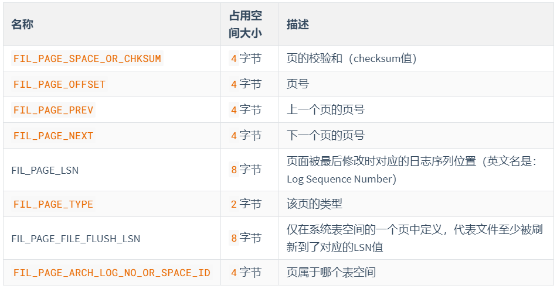
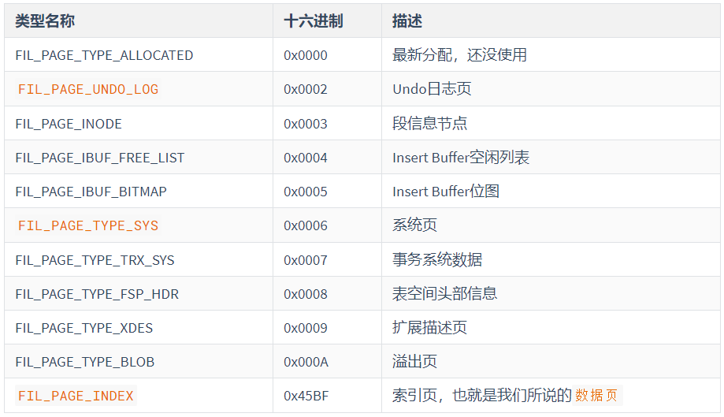

# 一、数据库的存储结构：页

索引结构给我们提供了高效的索引方式，不过索引信息以及数据记录都保存在文件上的，确切说是存储在页结构中。另一方面，索引是在存储引擎中实现的，`MySQL` 服务器上的**存储引擎负责对表中数据的读取和写入工作**。**不同存储引擎中存放的格式一般不同**的，甚至**有的存储引擎比如 `Memory` 都不用磁盘**来存储数据。

由于 `InnoDB` 是 `MySQL` 的默认存储引擎，所以本章剖析 **`InooDB` 存储引擎的数据存储结构**。

## 1.1 磁盘与内存交互基本单位：页

InnoDB 将**数据划分为若干个页**，InnoDB 中页的大小默认为**16KB**。

以**页作为磁盘和内存之间交互的基本单位**，也就是**一次最少从磁盘中读取16KB的内容到内存中**，一次**最少把内存中的16KB内容刷新到磁盘中**。也就是说，在数据库中，**不论读一行，还是读多行，都是将这些行所在的页进行加载**。也就是说，**数据库管理存储空间的基本单位是页（Page），数据库I/O操作的最小单位是页**。一个页中可以存储多个行记录。

> 记录是按照行来存储的，但是数据库的读取并不以行为单位，否则一次读取（也就是一次I/O操作）只能处理一行数据，效率会非常低。

## 1.2 页结构概述

页a、页b、页c…页n这些**页可以不在物理结构上相连**，只要**通过双向链表相关联即可**。**每个数据页中的记录会按照主键值从小到大的顺序组成一个单向链表**，**每个数据页**都会为存储在它里边的记录生成一个**页目录**，在**通过主键查找**某条记录的时候可以在**页目录**中使用**二分法**快速定位到对应的槽，然后再遍历该槽**对应的分组**中的记录即可快速找到**指定的记录**。

## 1.3 页的上层结构


- 区（Extent）是比页大一级的存储结构，在 InnoDB 存储引擎中，**一个区会分配64个连续的页**。因为InnoDB 中的页大小默认是 16KB ，所以**一个区的大小是64*16KB=`1MB`**。
- 段（Segment）由一个或多个区组成，**区在文件系统是一个连续分配的空间**（在InnoDB中是连续的64个页），不过在**段中不要求区与区之间是相邻的**。段是数据库中的**分配单位**，**不同类型的数据库对象以不同的段形式存在**。当我们创建数据表、索引的时候，就会相应创建对应的段，比如**创建一张表时会创建一个表段**，**创建一个索引时会创建一个索引段**。
- 表空间（Tablespace）是一个逻辑容器，表空间存储的对象是段，在一个表空间中可以有一个或多个段，但是**一个段只能属于一个表空间**。**数据库由一个或多个表空间组成**，表空间从管理上可以划分为`系统表空间`、`用户表空间`、`撤销表空间`、`临时表空间`等。

## 1.4 页的内部结构

页如果**按类型划分**的话，常见的有**数据页（保存B+树节点)**、**系统页**、**Undo页**和**事务数据页**等。**数据页是我们最常使用的页。**

**数据页**的 16KB 大小的存储空间被**划分为七个部分**，分别是文件头(File Header)、页头(Page Header)、最大最小记录(Infimum + supremum)、用户记录(User Records)、空闲空间(Free Space)、页目录(Page Directory）和文件尾(File Tailer) 。

页结构的示意图如下所示:


这7个部分作用分别如下，我们简单梳理如下表所示:


### 1.4.1 文件头和文件尾

#### 1.4.1.1`File Header` 文件头

- 作用：描述各种页的通用信息。（比如页的编号、其上一页、下一页是谁等）
- 大小：38字节
- 构成：



	1. FIL_PAGE_OFFSET（4字节）：每一个页都有一个单独的页号，就跟你的身份证号码一样，InnoDB通过页号可以唯一定位一个页。
	1. FIL_PAGE_TYPE（2字节）：这个代表当前页的类型。



3. FIL_PAGE_PREV（4字节）和FIL_PAGE_NEXT（4字节）：InnoDB 都是以页为单位存放数据的，如果数据分散到多个不连续的页中存储的话需要把这些页关联起来，**FIL_PAGE_PREV和FIL_PAGE_NEXT就分别代表本页的上一个和下一个页的页号**。这样通过**建立一个双向链表把许许多多的页就都串联起来**了，保证这些页之间**不需要是物理上的连续**，而**是逻辑上的连续**。


4. FIL_PAGE_SPACE_OR_CHKSUM（4字节）：代表当前页面的校验和（checksum），是**针对整个页计算出的一个校验和**，**文件头部**和**文件尾部**都有属性：FIL_PAGE_SPACE_OR_CHKSUM。

   作用：
   InnoDB 存储引擎以页为单位把**数据加载到内存中**处理，如果该页中的数据**在内存中被修改了**，那么在修改后的某个时间**需要把数据同步到磁盘中**。但是在**同步了一半的时候断电了**，造成了**该页传输的不完整**。
   为了**检测一个页是否完整**（也就是在同步的时候有没有发生只同步一半的尴尬情况），这时可以**通过文件尾的校验和（checksum 值）与文件头的校验和做比对**，如果**两个值不相等则证明页的传输有问题**，需要重新进行传输，否则认为页的传输已经完成。

   具体的：
   每当**一个页面在内存中修改**了，在**同步之前就要把它的校验和算出来**，因为**File Header在页面的前边，所以校验和会被首先同步到磁盘**，当**完全写完时，校验和也会被写到页的尾部**，如果完全同步成功，则页的首部和尾部的校验和应该是一致的。如果**写了一半儿断电**了，那么**在File Header中的校验和就代表着已经修改过的页，而在File Trailer中的校验和代表着原先的页**，**二者不同则意味着同步中间出了错**。这里，校验方式就是采用 Hash 算法进行校验。

5. FIL_PAGE_LSN（8字节）：页面被最后修改时对应的日志序列位置（英文名是：Log Sequence Number）。在文件尾页有这样一个字段，仅当两者相同时才能确保该页正确。

#### 1.4.1.2`File Trailer` 文件尾

1. 前4个字节代表页的校验和：这个部分是和File Header中的校验和相对应的。
2. 后4个字节代表页面被最后修改时对应的日志序列位置（LSN）：这个部分也是为了**校验页的完整性**的，如果**首部和尾部的LSN值校验不成功的话**，就说明**同步过程出现了问题**。

### 1.4.2 最大最小纪录、用户记录、空闲记录

#### 1.4.2.1 Free Space (空闲空间)

我们自己存储的记录会按照指定的行格式存储到User Records部分。但是在一开始生成页的时候，其实并没有User Records这个部分，**每当我们插入一条记录**，**都会从Free Space部分**，也就是尚未使用的存储空间中**申请一个记录大小的空间划分到User Records部分**，当Free Space部分的空间全部被User Records部分替代掉之后，也就意味着这个**页使用完了**，如果**还有新的记录插入的话**，就**需要去申请新的页**了。

#### 1.4.2.2 User Records (用户记录)

User Records中的这些记录按照**指定的行格式**一条一条摆在User Records部分，**相互之间形成单链表**。

**用户记录里的一条条数据如何记录？**这里需要讲讲**记录行格式**的**记录头信息**（1.5.2.3 ）。

#### 1.4.2.3 Infimum + Supremum（最小最大记录）

InnoDB规定的**最小记录**与**最大记录**这两条记录的构造十分简单，都是由**5字节大小的记录头信息**和**8字节大小的一个固定的部分**组成的，如图所示：


这两条记录**不是我们自己定义的记录**，所以它们**并不存放在页的User Records部分**，他们被**单独放**在一个称为Infimum + Supremum的部分，如图所示：


### 1.4.3 页头和页目录


## 1.5 `InnoDB` 行格式（或记录格式）

### 1.5.1 指定行格式的语法

### 1.5.2 COMPACT行格式

#### 1.5.2.1 变长字段长度列表

#### 1.5.2.2 NULL值列表

#### 1.5.2.3 记录头信息（5字节）

```sql
mysql> CREATE TABLE page_demo(
    ->     c1 INT,
    ->     c2 INT,
    ->     c3 VARCHAR(10000),
    ->     PRIMARY KEY (c1)
    -> ) CHARSET=ascii ROW_FORMAT=Compact;
Query OK, 0 rows affected (0.03 sec)
```

这个表中记录的行格式示意图：


这些记录头信息中各个属性如下：


简化后的行格式示意图：


插入数据：

```sql
INSERT INTO page_demo 
VALUES
(1, 100, 'song'), 
(2, 200, 'tong'), 
(3, 300, 'zhan'), 
(4, 400, 'lisi');
```

图示如下：


- `delete_mask：这个属性标记着当前记录是否被删除，占用1个二进制位。

  - 值为0：代表记录并没有被删除
  - 值为1：代表记录被删除掉了

  **被删除的记录为什么还在页中存储**呢？

  你以为它删除了，可它还在真实的磁盘上。这些被删除的记录**之所以不立即从磁盘上移除**，**是因为移除它们之后其他的记录在磁盘上需要重新排列，导致性能消耗**。所以只是打一个删除标记而已，所有**被删除掉的记录都会组成一个所谓的垃圾链表**，在**这个链表中的记录占用的空间**称之为**可重用空间**，之后如果**有新记录插入到表中的话**，可能把这些**被删除的记录**占用的**存储空间覆盖掉（空间复用）**。

- `min_rec_mask`：B+树的**每层非叶子节点**中的**最小记录**都会添加该标记，**min_rec_mask值为1**。
  我们自己插入的四条记录的min_rec_mask值都是0，意味着它们都**不是B+树的非叶子节点中的最小记录**。

- `record_type`：这个属性表示当前记录的类型，一共有4种类型的记录：
     0：表示普通记录
     1：表示B+树非叶节点记录
     2：表示最小记录
     3：表示最大记录

- `heap_no`：这个属性表示当前记录在本页中的位置。从图中可以看出来，我们插入的4条记录在本页中的位置分别是：2、3、4、5。

  怎么**不见heap_no值为0和1的记录**呢？

  MySQL会**自动给每个页里加了两个记录**，由于这两个记录并不是我们自己插入的，所以有时候也称为**伪记录**或者**虚拟记录**。这两个伪记录**一个代表最小记录**，**一个代表最大记录**。**最小记录和最大记录的heap_no值分别是0和1**，也就是说它们的位置最靠前。

- `n_owned`： 页目录中**每个组**中**最后一条记录**的**头信息**中会存储**该组一共有多少条记录**，作为 n_owned 字段。

- `next_record`：记录头信息里该属性非常重要，它表示从当前记录的真实数据**到下一条记录**的真实数据的**地址偏移量**。

  比如：第一条记录的next_record值为32，意味着从第一条记录的真实数据的地址处向后找32个字节便是下一条记录的真实数据。

  注意，下一条记录指得并不是按照我们插入顺序的下一条记录，而是按照主键值由小到大的顺序的下一条记录。而且**规定Infimum记录（也就是最小记录）的下一条记录就是本页中主键值最小的用户记录**，而本页中**主键值最大的用户记录的下一条记录就是 Supremum记录（也就是最大记录）**。下图用箭头代替偏移量表示next_record。

  	

  - **演示：删除操作**

  从表中删除掉一条记录，这个链表也是会跟着变化：

  ```sql
  mysql> DELETE FROM page_demo WHERE c1 = 2;
  Query OK, 1 row affected (0.02 sec)
  ```

  删掉第2条记录后的示意图就是：

  

  从图中可以看出来，删除第2条记录前后主要发生了这些变化：
  1. 第2条记录并没有从存储空间中移除，而是把该条记录的delete_mask值设置为1。
  2. 第2条记录的next_record值变为了0，意味着该记录没有下一条记录了。
  3. 第1条记录的next_record指向了第3条记录。
  4. 最大记录的n_owned值从 5 变成了 4 。

  

  - **演示：添加操作**

  主键值为2的**记录被我们删掉**了，但是**存储空间却没有回收**，如果我们**再次把这条记录插入到表中**，会发生什么事呢？

  ```sql
  mysql> INSERT INTO page_demo VALUES(2, 200, 'tong');
  Query OK, 1 row affected (0.00 sec)
  ```

  我们看一下记录的存储情况：

  

  直接**复用了原来被删除记录的存储空间**。

  说明：
  当数据页中**存在多条被删除掉的记录**时，这些记录的**next_record属性**将会**把这些被删除掉的记录组成一个垃圾链表**，以备**之后重用这部分存储空间**。

#### 1.5.2.4 记录的真实数据