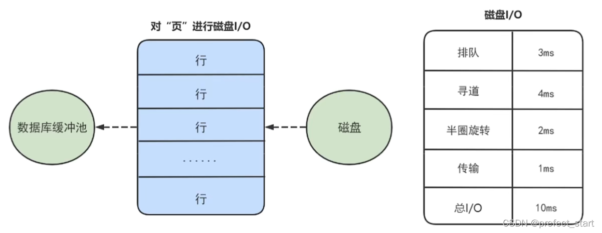
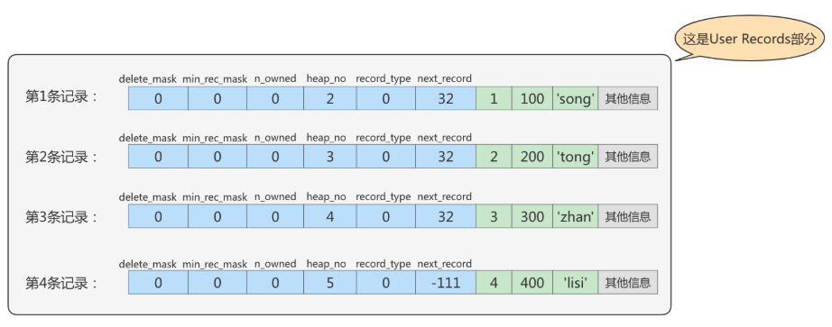
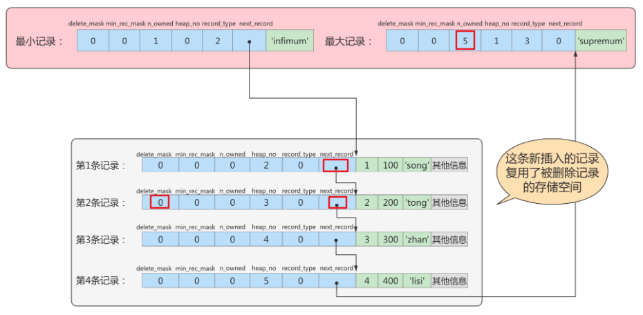
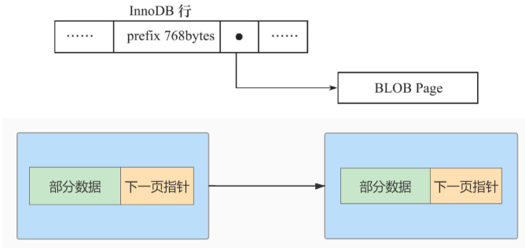

# 一、数据库的存储结构：页

索引结构给我们提供了高效的索引方式，不过索引信息以及数据记录都保存在文件上的，确切说是存储在页结构中。另一方面，索引是在存储引擎中实现的，`MySQL` 服务器上的**存储引擎负责对表中数据的读取和写入工作**。**不同存储引擎中存放的格式一般不同**的，甚至**有的存储引擎比如 `Memory` 都不用磁盘**来存储数据。

由于 `InnoDB` 是 `MySQL` 的默认存储引擎，所以本章剖析 **`InooDB` 存储引擎的数据存储结构**。

## 1.1 磁盘与内存交互基本单位：页

InnoDB 将**数据划分为若干个页**，InnoDB 中页的大小默认为**16KB**。

以**页作为磁盘和内存之间交互的基本单位**，也就是**一次最少从磁盘中读取16KB的内容到内存中**，一次**最少把内存中的16KB内容刷新到磁盘中**。也就是说，在数据库中，**不论读一行，还是读多行，都是将这些行所在的页进行加载**。也就是说，**数据库管理存储空间的基本单位是页（Page），数据库I/O操作的最小单位是页**。一个页中可以存储多个行记录。

> 记录是按照行来存储的，但是数据库的读取并不以行为单位，否则一次读取（也就是一次I/O操作）只能处理一行数据，效率会非常低。

## 1.2 页结构概述

页a、页b、页c…页n这些**页可以不在物理结构上相连**，只要**通过双向链表相关联即可**。**每个数据页中的记录会按照主键值从小到大的顺序组成一个单向链表**，**每个数据页**都会为存储在它里边的记录生成一个**页目录**，在**通过主键查找**某条记录的时候可以在**页目录**中使用**二分法**快速定位到对应的槽，然后再遍历该槽**对应的分组**中的记录即可快速找到**指定的记录**。

## 1.3 页的上层结构


- 区（Extent）是比页大一级的存储结构，在 InnoDB 存储引擎中，**一个区会分配64个连续的页**。因为InnoDB 中的页大小默认是 16KB ，所以**一个区的大小是64*16KB=`1MB`**。
- 段（Segment）由一个或多个区组成，**区在文件系统是一个连续分配的空间**（在InnoDB中是连续的64个页），不过在**段中不要求区与区之间是相邻的**。段是数据库中的**分配单位**，**不同类型的数据库对象以不同的段形式存在**。当我们创建数据表、索引的时候，就会相应创建对应的段，比如**创建一张表时会创建一个表段**，**创建一个索引时会创建一个索引段**。
- 表空间（Tablespace）是一个逻辑容器，表空间存储的对象是段，在一个表空间中可以有一个或多个段，但是**一个段只能属于一个表空间**。**数据库由一个或多个表空间组成**，表空间从管理上可以划分为`系统表空间`、`用户表空间`、`撤销表空间`、`临时表空间`等。

## 1.4 页的内部结构

页如果**按类型划分**的话，常见的有**数据页（保存B+树节点)**、**系统页**、**Undo页**和**事务数据页**等。**数据页是我们最常使用的页。**

**数据页**的 16KB 大小的存储空间被**划分为七个部分**，分别是文件头(File Header)、页头(Page Header)、最大最小记录(Infimum + supremum)、用户记录(User Records)、空闲空间(Free Space)、页目录(Page Directory）和文件尾(File Tailer) 。

页结构的示意图如下所示:


这7个部分作用分别如下，我们简单梳理如下表所示:


### 1.4.1 文件头和文件尾

#### 1.4.1.1`File Header` 文件头

- 作用：描述各种页的通用信息。（比如页的编号、其上一页、下一页是谁等）
- 大小：38字节
- 构成：


	1. FIL_PAGE_OFFSET（4字节）：每一个页都有一个单独的页号，就跟你的身份证号码一样，InnoDB通过页号可以唯一定位一个页。
	1. FIL_PAGE_TYPE（2字节）：这个代表当前页的类型。


3. FIL_PAGE_PREV（4字节）和FIL_PAGE_NEXT（4字节）：InnoDB 都是以页为单位存放数据的，如果数据分散到多个不连续的页中存储的话需要把这些页关联起来，**FIL_PAGE_PREV和FIL_PAGE_NEXT就分别代表本页的上一个和下一个页的页号**。这样通过**建立一个双向链表把许许多多的页就都串联起来**了，保证这些页之间**不需要是物理上的连续**，而**是逻辑上的连续**。


4. FIL_PAGE_SPACE_OR_CHKSUM（4字节）：代表当前页面的校验和（checksum），是**针对整个页计算出的一个校验和**，**文件头部**和**文件尾部**都有属性：FIL_PAGE_SPACE_OR_CHKSUM。

   作用：
   InnoDB 存储引擎以页为单位把**数据加载到内存中**处理，如果该页中的数据**在内存中被修改了**，那么在修改后的某个时间**需要把数据同步到磁盘中**。但是在**同步了一半的时候断电了**，造成了**该页传输的不完整**。
   为了**检测一个页是否完整**（也就是在同步的时候有没有发生只同步一半的尴尬情况），这时可以**通过文件尾的校验和（checksum 值）与文件头的校验和做比对**，如果**两个值不相等则证明页的传输有问题**，需要重新进行传输，否则认为页的传输已经完成。

   具体的：
   每当**一个页面在内存中修改**了，在**同步之前就要把它的校验和算出来**，因为**File Header在页面的前边，所以校验和会被首先同步到磁盘**，当**完全写完时，校验和也会被写到页的尾部**，如果完全同步成功，则页的首部和尾部的校验和应该是一致的。如果**写了一半儿断电**了，那么**在File Header中的校验和就代表着已经修改过的页，而在File Trailer中的校验和代表着原先的页**，**二者不同则意味着同步中间出了错**。这里，校验方式就是采用 Hash 算法进行校验。

5. FIL_PAGE_LSN（8字节）：页面被最后修改时对应的日志序列位置（英文名是：Log Sequence Number）。在文件尾页有这样一个字段，仅当两者相同时才能确保该页正确。

#### 1.4.1.2`File Trailer` 文件尾

1. 前4个字节代表页的校验和：这个部分是和File Header中的校验和相对应的。
2. 后4个字节代表页面被最后修改时对应的日志序列位置（LSN）：这个部分也是为了**校验页的完整性**的，如果**首部和尾部的LSN值校验不成功的话**，就说明**同步过程出现了问题**。

### 1.4.2 最大最小纪录、用户记录、空闲记录

#### 1.4.2.1 Free Space (空闲空间)

我们自己存储的记录会按照指定的行格式存储到User Records部分。但是在一开始生成页的时候，其实并没有User Records这个部分，**每当我们插入一条记录**，**都会从Free Space部分**，也就是尚未使用的存储空间中**申请一个记录大小的空间划分到User Records部分**，当Free Space部分的空间全部被User Records部分替代掉之后，也就意味着这个**页使用完了**，如果**还有新的记录插入的话**，就**需要去申请新的页**了。

#### 1.4.2.2 User Records (用户记录)

User Records中的这些记录按照**指定的行格式**一条一条摆在User Records部分，**相互之间形成单链表**。

**用户记录里的一条条数据如何记录？**这里需要讲讲**记录行格式**的**记录头信息**（1.5.2.3 ）。

#### 1.4.2.3 Infimum + Supremum（最小最大记录）

InnoDB规定的**最小记录**与**最大记录**这两条记录的构造十分简单，都是由**5字节大小的记录头信息**和**8字节大小的一个固定的部分**组成的，如图所示：


这两条记录**不是我们自己定义的记录**，所以它们**并不存放在页的User Records部分**，他们被**单独放**在一个称为Infimum + Supremum的部分，如图所示：


### 1.4.3 页头和页目录

#### 1.4.3.1 为什么需要Page Directory（页目录)?

在页中，**记录是以单向链表的形式进行存储的**。单向链表的特点就是插入、删除非常方便，但是**检索效率不高**，最差的情况下需要遍历链表上的所有节点才能完成检索。因此在页结构中专门设计了页目录这个模块，**专门给记录做一个目录，通过二分查找法的方式进行检索**，提升效率。

**需求:根据主键值查找页中的某条记录，如何实现快速查找呢?**

- 方式1:顺序查找

从 `Infimum` 记录（最小记录）开始，沿着链表一直往后找，总有一天会找到(或者找不到），在找的时候还能投机取巧，因为链表中各个记录的值是按照从小到大顺序排列的，所以当链表的某个节点代表的记录的主键值大于你想要查找的主键值时，你就可以停止查找了，因为该节点后边的节点的主键值依次递增。如果一个页中存储了非常多的记录，这么查找性能很差。

- 方式2:使用页目录，二分法查找
  - 将所有的记录**分成几个组**，这些记录**包括最小记录和最大记录**，但**不包括标记为“己删除”的记录**。
  - **第1组**，也就是**最小记录所在的分组只有1个记录**；**最后一组**，就是**最大记录所在的分组**，会有1-8条记录；**其余的组记录数量在4-8条之间**。
  - 这样做的好处是，**除了第1组（最小记录所在组）以外，其余组的记录数会尽量平分**。
  - 在**每个组**中**最后一条记录**的**头信息**中会存储**该组一共有多少条记录**，作为**n_owned字段**。
  - **页目录**用来存储**每组最后一条记录**的**地址偏移量**，这些地址偏移量会按照先后顺序存储起来，**每组的地址偏移量也被称之为槽（slot)**，每个槽相当于指针指向了不同组的最后一个记录。


举例2:

现在的page_demo表中正常的记录共有6条，InnoDB会把它们分成两组，第一组中只有一个最小记录，第二组中是剩余的5条记录。如下图:


从这个图中我们需要注意这么几点:

- 现在页目录部分中有两个槽，也就意味着我们的记录被分成了两个组，槽1中的值是112，代表最大记录的地址偏移量（就是从页面的O字节开始数，数112个字节）；槽O中的值是99，代表最小记录的地址偏移量。
- 注意最小和最大记录的头信息中的n_owned属性
- 最小记录的n_owned值为1，这就代表着以最小记录结尾的这个分组中只有1条记录，也就是最小记录本身。
- 最大记录的n_owned值为5，这就代表着以最大记录结尾的这个分组中只有5条记录，包括最大记录本身还有我们自己插入的4条记录。

用箭头指向的方式替代数字，这样更易干我们理解，修改后如下:


#### 1.4.3.2 页目录分组的个数如何确定？

为什么最小记录的n_owned值为1，而最大记录的n_owned值为5呢？

InnoDB规定：对于**最小记录所在的分组只能有1条记录**，**最大记录所在的分组拥有的记录条数只能在1~8条之间**，**剩下的分组中记录的条数范围只能在是 4~8 条之间**。

分组是按照下边的步骤进行的：

1. 初始情况下一个数据页里只有最小记录和最大记录两条记录，它们分属于两个分组。
2. 之后每插入一条记录，都会从页目录中找到主键值比本记录的主键值大并且差值最小的槽，然后把该槽对应的记录的n_owned值加1，表示本组内又添加了一条记录，**直到该组中的记录数等于8个**。
3. 在一个组中的记录数**等于8个后再插入一条记录**时，会将**组中的记录拆分成两个组**，**一个组中4条记录，另一个5条记录**。这个过程会在页目录中**新增一个槽**来记录这个新增分组中最大的那条记录的偏移量。

#### 1.4.3.3 页目录结构下如何快速查找记录？

在一个数据页中查找指定主键值的记录的过程分为两步：
1. 通过二分法确定该记录所在的槽，并找到该槽所在分组中主键值最小的那条记录。
2. 通过记录的next_record属性遍历该槽所在的组中的各个记录。

#### 1.4.3.4 Page Header（页面头部）

为了能得到一个数据页中存储的记录的状态信息，比如本页中已经存储了多少条记录，第一条记录的地址是什么，页目录中存储了多少个槽等等，特意在页中定义了一个叫Page Header的部分，这个部分占用固定的56个字节，专门存储各种状态信息。


- PAGE_DIRECTION：假如**新插入的一条记录**的**主键值**比**上一条记录的主键值大**，我们说**这条记录的插入方向是右边**，**反之则是左边**。用来表示最后一条记录插入方向的状态就是PAGE_DIRECTION。
- PAGE_N_DIRECTION：假设**连续几次插入新记录的方向都是一致的**，InnoDB会把沿着同一个方向插入记录的条数记下来，这个条数就用PAGE_N_DIRECTION这个状态表示。当然，**如果最后一条记录的插入方向改变了的话，这个状态的值会被清零重新统计。**

### 1.4.3 从数据页的角度看B+树如何查询

按照节点类型可以分成两部分:

1. 叶子节点，B+树最底层的节点，节点的高度为0，存储行记录。
2. 非叶子节点，节点的高度大于o，存储索引键和页面指针，并不存储行记录本身。



#### 1.4.3.1 B+树是如何进行记录检索的?

如果通过B+树的索引查询行记录，首先是从B+树的根开始，逐层检索，直到找到叶子节点，也就是找到对应的数据页为止，**将数据页加载到内存中**，页目录中的槽(slot)采用二分查找的方式先找到一个**粗略的记录分组**，然后再**在分组中通过链表遍历的方式查找记录**。

#### 1.4.3.2 普通索引和唯一索引在查询效率上有什么不同?

**我们创建索引的时候可以是普通索引，也可以是唯一索引，那么这两个索引在查询效率上有什么不同呢?**

- **唯一索引**就是在普通索引上增加了约束性，也就是**关键字唯一**，**找到了关键字就停止检索**。
- **普通索引**，可能**会存在用户记录中的关键字相同的情况**，根据页结构的原理，当我们读取一条记录的时候，不是单独将这条记录从磁盘中读出去，而是将这个**记录所在的页加载到内存中进行读取**。InnoDB存储引擎的页大小为`16KB`，在一个页中可能存储着上千个记录，因此**在普通索引的字段上进行查找也就是在内存中多几次“判断下一条记录”的操作**，对于CPU来说，**这些操作所消耗的时间是可以忽略不计的**。
- 所以对一个索引字段进行检索，采用普通索引还是唯一索引**在检索效率上基本上没有差别**。

## 1.5 `InnoDB` 行格式（或记录格式）

我们平时的数据以行为单位来向表中插入数据，这些**记录在磁盘上的存放方式**也被称为`行格式`或者`记录格式`。`InnoDB`存储引擎设计了**4种不同类型的`行格式`**，分别是`Compact`、`Redundant`、`Dynamic`和`Compressed`行格式。

查看`MySQL8`的默认行格式：

```sql
mysql> SELECT @@innodb_default_row_format;
+-------------------------------------+
| @@innodb_default_row_format |
+-------------------------------------+
| dynamic                                   |
+-------------------------------------+
1 row in set (0.00 sec)
```

也可以使用如下语法查看**具体表使用的行格式**：

```sql
SHOW TABLE STATUS like '表名'\G
```

### 1.5.1 指定行格式的语法

在创建或修改表的语句中指定行格式：

```sql
CREATE TABLE 表名 (列的信息) ROW_FORMAT=行格式名称
ALTER TABLE 表名 ROW_FORMAT=行格式名称
```

举例：

```sql
mysql> CREATE TABLE record_test_table (
    ->     col1 VARCHAR(8),
    ->     col2 VARCHAR(8) NOT NULL,
    ->     col3 CHAR(8),
    ->     col4 VARCHAR(8)
    -> ) CHARSET=ascii ROW_FORMAT=COMPACT;
Query OK, 0 rows affected (0.03 sec)
```

向表中插入两条记录：

```sql
INSERT INTO record_test_table(col1, col2, col3, col4) 
VALUES
('zhangsan', 'lisi', 'wangwu', 'songhk'), 
('tong', 'chen', NULL, NULL);
```

### 1.5.2 COMPACT行格式

在`MySQL 5.1`版本中，默认设置为Compact行格式。`MySQL 8` 则默认使用`Dynamic`。一条完整的记录其实可以被分为**记录的额外信息**和**记录的真实数据**两大部分。


#### 1.5.2.1 变长字段长度列表

`MySQL`支持一些**变长的数据类型**，比如`VARCHAR(M)`、`VARBINARY(M)`、`TEXT`类型，`BLOB`类型，这些数据类型修饰列称为变长字段，**变长字段中存储多少字节的数据不是固定的**，所以我们**在存储真实数据的时候**需要顺便**把这些数据实际占用的字节数也存起来**。在Compact行格式中，把**所有变长字段的真实数据占用的字节长度**都存放在**记录的开头部位**，从而形成一个**变长字段长度列表**。

注意：这里面存储的**变长长度和字段顺序是反过来的**。比如两个`varchar`字段在表结构的顺序是**a(10)，b(15)**。那么在变长字段长度列表中存储的长度顺序就是**15，10**，是反过来的。

以`record_test_table`表中的第一条记录举例：因为 `record_test_table` 表的**`col1`、`col2`、`col4`列都是`VARCHAR(8)`类型**的，所以这**三个列的值的长度都需要保存在记录开头处**，注意record_test_table表中的各个列都使用的是`ascii`字符集（每个字符只需要1个字节来进行编码）。


又因为这些**长度值需要按照列的逆序存放**，所以最后**变长字段长度列表**的字节串用**十六进制表示的效果**就是（各个字节之间实际上没有空格，用空格隔开只是方便理解）：06 04 08 

把这个字节串组成的**变长字段长度列表**填入上边的示意图中的效果就是：


#### 1.5.2.2 NULL值列表

Compact行格式会把**可以为NULL的列统一管理**起来，存在一个标记为NULL值列表中。如果表中**没有允许存储 NULL 的列（规定为 NOT NULL），则 NULL值列表也不存在**了。

为什么定义**NULL值列表**？

之所以要存储NULL是因为**数据都是需要对齐的**，如果**没有标注出来NULL值的位置，就有可能在查询数据的时候出现混乱**。如果**使用一个特定的符号放到相应的数据位表示空置**的话，虽然能达到效果，但是这样**很浪费空间**，所以直接就在行数据得头部开辟出**一块空间**专门用来记录该行数据**哪些是非空数据，哪些是空数据**，格式如下：

1. 二进制位的**值为1**时，代表该列的值**为NULL**。
2. 二进制位的**值为0**时，代表该列的值**不为NULL**。

例如：字段 a、b、c，其中a是主键，在某一行中存储的数依次是 **a=1、b=null、c=2**。那么Compact行格式中的**NULL值列表中存储：01**。第一个0表示c不为null，第二个1表示b是null。这里之所以**没有a是因为数据库会自动跳过主键**，因为**主键肯定是非NULL**且唯一的，在NULL值列表的数据中就会自动跳过主键。

record_test_table的两条记录的NULL值列表就如下：

> col2 被定义为 NOT NULL，因此不存在于NULL值列表中

第一条记录：


第二条记录：


#### 1.5.2.3 记录头信息（5字节）

```sql
mysql> CREATE TABLE page_demo(
    ->     c1 INT,
    ->     c2 INT,
    ->     c3 VARCHAR(10000),
    ->     PRIMARY KEY (c1)
    -> ) CHARSET=ascii ROW_FORMAT=Compact;
Query OK, 0 rows affected (0.03 sec)
```

这个表中记录的行格式示意图：


这些记录头信息中各个属性如下：


简化后的行格式示意图：


插入数据：

```sql
INSERT INTO page_demo 
VALUES
(1, 100, 'song'), 
(2, 200, 'tong'), 
(3, 300, 'zhan'), 
(4, 400, 'lisi');
```

图示如下：



- `delete_mask：这个属性标记着当前记录是否被删除，占用1个二进制位。

  - 值为0：代表记录并没有被删除
  - 值为1：代表记录被删除掉了

  **被删除的记录为什么还在页中存储**呢？

  你以为它删除了，可它还在真实的磁盘上。这些被删除的记录**之所以不立即从磁盘上移除**，**是因为移除它们之后其他的记录在磁盘上需要重新排列，导致性能消耗**。所以只是打一个删除标记而已，所有**被删除掉的记录都会组成一个所谓的垃圾链表**，在**这个链表中的记录占用的空间**称之为**可重用空间**，之后如果**有新记录插入到表中的话**，可能把这些**被删除的记录**占用的**存储空间覆盖掉（空间复用）**。

- `min_rec_mask`：B+树的**每层非叶子节点**中的**最小记录**都会添加该标记，**min_rec_mask值为1**。
  我们自己插入的四条记录的min_rec_mask值都是0，意味着它们都**不是B+树的非叶子节点中的最小记录**。

- `record_type`：这个属性表示当前记录的类型，一共有4种类型的记录：
     0：表示普通记录
     1：表示B+树非叶节点记录
     2：表示最小记录
     3：表示最大记录

- `heap_no`：这个属性表示当前记录在本页中的位置。从图中可以看出来，我们插入的4条记录在本页中的位置分别是：2、3、4、5。

  怎么**不见heap_no值为0和1的记录**呢？

  MySQL会**自动给每个页里加了两个记录**，由于这两个记录并不是我们自己插入的，所以有时候也称为**伪记录**或者**虚拟记录**。这两个伪记录**一个代表最小记录**，**一个代表最大记录**。**最小记录和最大记录的heap_no值分别是0和1**，也就是说它们的位置最靠前。

- `n_owned`： 页目录中**每个组**中**最后一条记录**的**头信息**中会存储**该组一共有多少条记录**，作为 n_owned 字段。

- `next_record`：记录头信息里该属性非常重要，它表示从当前记录的真实数据**到下一条记录**的真实数据的**地址偏移量**。

  比如：第一条记录的next_record值为32，意味着从第一条记录的真实数据的地址处向后找32个字节便是下一条记录的真实数据。

  注意，下一条记录指得并不是按照我们插入顺序的下一条记录，而是按照主键值由小到大的顺序的下一条记录。而且**规定Infimum记录（也就是最小记录）的下一条记录就是本页中主键值最小的用户记录**，而本页中**主键值最大的用户记录的下一条记录就是 Supremum记录（也就是最大记录）**。下图用箭头代替偏移量表示next_record。

  	

  - **演示：删除操作**

  从表中删除掉一条记录，这个链表也是会跟着变化：

  ```sql
  mysql> DELETE FROM page_demo WHERE c1 = 2;
  Query OK, 1 row affected (0.02 sec)
  ```

  删掉第2条记录后的示意图就是：

  

  从图中可以看出来，删除第2条记录前后主要发生了这些变化：
  1. 第2条记录并没有从存储空间中移除，而是把该条记录的delete_mask值设置为1。
  2. 第2条记录的next_record值变为了0，意味着该记录没有下一条记录了。
  3. 第1条记录的next_record指向了第3条记录。
  4. 最大记录的n_owned值从 5 变成了 4 。

  

  - **演示：添加操作**

  主键值为2的**记录被我们删掉**了，但是**存储空间却没有回收**，如果我们**再次把这条记录插入到表中**，会发生什么事呢？

  ```sql
  mysql> INSERT INTO page_demo VALUES(2, 200, 'tong');
  Query OK, 1 row affected (0.00 sec)
  ```

  我们看一下记录的存储情况：

  

  直接**复用了原来被删除记录的存储空间**。

  说明：
  当数据页中**存在多条被删除掉的记录**时，这些记录的**next_record属性**将会**把这些被删除掉的记录组成一个垃圾链表**，以备**之后重用这部分存储空间**。

#### 1.5.2.4 记录的真实数据

记录的真实数据除了我们自己定义的列的数据以外，还会有**三个隐藏列**：


实际上这几个列的真正名称其实是：`DB_ROW_ID`、`DB_TRX_ID`、`DB_ROLL_PTR`。

- 一个表**没有手动定义主键**，则**会选取一个Unique键作为主键**，如果**连Unique键都没有定义**的话，则会**为表默认添加一个名为row_id的隐藏列作为主键**。所以row_id是在没有自定义主键以及Unique键的情况下才会存在的。
- 事务ID和回滚指针在后面的《第14章_MySQL事务日志》章节中讲解。

### 1.5.3 `Dynamic`和`Compressed`行格式

#### 1.5.3.1 行溢出

`InnoDB` 存储引擎可以将一条记录中的**某些数据**存储在**真正的数据页面之外**。

很多`DBA`喜欢 `MySQL` 数据库提供的 **`VARCHAR(M)` 类型，认为可以存放`65535`字节**。这是真的吗？如果我们使用 `ascii` 字符集的话，一个字符就代表一个字节，我们看看`VARCHAR(65535)` 是否可用。

```sql
CREATE  TABLE  varchar_size_demo(
 c  VARCHAR(65535)
 )  CHARSET=ascii  ROW_FORMAT=Compact;
```

结果如下：

```sql
ERROR 1118 (42000): Row size too large. The maximum row size for the used table type, not counting BLOBs, is 65535. This includes storage overhead, check the manual. You have  to  change  some  columns  to  TEXT or  BLOBs
```

报错信息表达的意思是：MySQL对一条记录占用的最大存储空间是有限制的，除BLOB或者TEXT类型的列之外， 其他所有的列（不包括隐藏列和记录头信息）占用的字节长度加起来不能超过65535个字节。

这个**65535个字节**除了**列本身的数据**之外，**还包括一些其他的数据**，以**Compact行格式为例**，比如说我们为了**存储一个VARCHAR(M)类型的列**，除了真实数据占有空间以外，**还需要记录的额外信息**。

如果该 `VARCHAR` 类型的列**没有NOT NULL属性**，那最多只能存储**65532个字节**的数据，因为**变长字段的长度占用 2个字节**，**NULL值标识需要占用1个字节**。

下面这条`SQL`创建语句可以成功执行。

```sql
CREATE  TABLE  varchar_size_demo(
    c  VARCHAR(65532)
)  CHARSET=ascii  ROW_FORMAT=Compact;
```

```sql
#如果有not null属性，那么就不需要NULL值标识，也就可以多存储一个字节，即65533个字节
CREATE  TABLE  varchar_size_demo( 
  c  VARCHAR(65533)  not  null
)  CHARSET=ascii  ROW_FORMAT=Compact; 
```

通过上面的案例，我们可以知道**一个页的大小一般是 `16KB`，也就是16384字节**，而**一个 `VARCHAR(M)` 类型的列就最多可以存储65533个字节**，这样就可能出现**一个页存放不了一条记录**，这种现象称为**行溢出**。 
在 **`Compact` 和 `Reduntant` 行格式**中，对于**占用存储空间非常大的列**，在**记录的真实数据处**只会**存储该列的一部分数据**，把**剩余的数据分散存储在几个其他的页中进行分页存储**，然后记录的**真实数据处用20个字节存储指向这些页的地址**（当然这20个字节中还**包括这些分散在其他页面中的数据的占用的字节数**），从而可以找到剩余数据所在的页。

这称为页的扩展，举例如下：



#### 1.5.3.2 Dynamic和Compressed行格式

在 **`MySQL 8.0` 中，默认行格式就是Dynamic**，Dynamic、Compressed行格式和Compact行格式挺像，只不过**在处理行溢出数据时有分歧**：

- Compressed和Dynamic两种记录格式对于存放在BLOB中的数据采用了**完全的行溢出的方式**。如图，在**数据页中只存放20个字节的指针（溢出页的地址）**，**实际的数据都存放在Off Page（溢出页）**中。
- Compact和Redundant两种格式会在记录的**真实数据处存储一部分数据**（存放**768个前缀字节**）。

**Compressed行记录格式**的另一个功能就是，存储在其中的**行数据会以`zlib`的算法进行压缩**，因此对于 `BLOB` 、`TEXT`、`VARCHAR` 这类**大长度类型的数据**能够进行非常有效的存储。


### 1.5.4 Redundant行格式

Redundant是 `MySQL 5.0` 版本之前 `InnoDB` 的行记录存储方式，`MySQL 5.0` 支持Redundant是**为了兼容之前版本的页格式**。


从上图可以看到，不同于Compact行记录格式，Redundant行格式的**首部是一个字段长度偏移列表**，同样是**按照列的顺序逆序放置**的。

#### 1.5.4.1 字段长度偏移列表

注意Compact行格式的开头是变长字段长度列表，而Redundant行格式的开头是字段长度偏移列表，与变长字段长度列表有两处不同：

- 少了“变长”两个字：Redundant行格式会把该条**记录中所有列（包括隐藏列）的长度信息**都**按照逆序**存储到**字段长度偏移列表**。
- 多了“偏移”两个字：这意味着计算列值长度的方式不像Compact行格式那么直观，它是采用**两个相邻数值的差值来计算各个列值的长度**。

举例：比如**第一条记录**的**字段长度偏移列表**就是：
2B 25 1F 1B 13 0C 06

因为它是**逆序排放**的，所以按照列的**顺序排列**就是：
06 0C 13 17 1A 24 25

按照两个相邻数值的差值来计算各个列值的长度的意思就是：

- 第一列(row_id)的长度就是 0x06个字节，也就是6个字节。
- 第二列(transaction_id)的长度就是 (0x0C - 0x06)个字节，也就是6个字节。
- 第三列(roll_pointer)的长度就是 (0x13 - 0x0C)个字节，也就是7个字节。
- 第四列(col1)的长度就是 (0x1B - 0x13)个字节，也就是8个字节。
- 第五列(col2)的长度就是 (0x1F - 0x1B)个字节，也就是4个字节。
- 第六列(col3)的长度就是 (0x25 - 0x1F)个字节，也就是6个字节。
- 第七列(col4)的长度就是 (0x2B - 0x25)个字节，也就是6个字节。

#### 1.5.4.2 记录头信息（record header）

不同于Compact行格式，Redundant行格式中的记录头信息**固定占用6个字节（48位）**，每位的含义见下表。


与Compact行格式的记录头信息对比来看，有两处不同：

- Redundant行格式多了 `n_field` 和 `1byte_offs_flag` 这两个属性。
- Redundant行格式没有 `record_type` 这个属性。


# 二、区、段和碎片区

## 2.1 为什么要有区？

B+树的每一层中的页都会形成一个双向链表，如果是以页为单位来分配存储空间的话，双向链表**相邻的两个页之间的物理位置可能离得非常远**。我们介绍B+树索引的使用场景的时候特别提到范围查询只需要定位到最左边的记录和最右边的记录，然后沿着双向链表一直扫描就可以了，而如果**链表中相邻的两个页物理位置离得非常远**，指针在**磁盘上寻道的时间就会增加**，然后**读取的速度就会变慢**，就是所谓的**随机I/O**。再一次强调，磁盘的速度和内存的速度差了好几个数量级，随机I/O是非常慢的，所以我们**应该尽量让链表中相邻的页的物理位置也相邻**，这样进行**范围查询的时候**才可以使用所谓的**顺序I/O**。

引入区的概念，**一个区**就是**物理位置上连续的64个页**。因为`InnoDB`中的页的大小默认是`16KB`，所以一个区的大小是`64*16KB=1MB`。在**表中数据量大**的时候，为某个索引分配空间的时候就不再按照页的单位分配了，而是**按照区为单位分配**，甚至在表中的**数据特别多的时候**，可以**一次性分配多个连续的区**。虽然可能造成一点点空间的浪费（数据不足以填充满整个区），但是从性能角度看，**可以消除很多的随机I/O**，功大于过！

### 2.1.1 随机读取

如果**数据没有在内存中**，就**需要在磁盘上对该页进行查找**，整体时间预估在 `10ms`  左右，这 **`10ms`  中有 `6ms` 是磁盘的实际繁忙时间(包括了寻道和半圈旋转时间）**，有 `3ms` 是对可能发生的排队时间的估计值，另外还有 `1ms` 的传输时间，将页从磁盘服务器缓冲区传输到数据库缓冲区中。这 `10ms` 看起来很快，但实际上对于数据库来说消耗的时间已经非常长了，因为这还只是一个页的读取时间。


### 2.1.2 顺序读取

**顺序读取**其实是**一种批量读取的方式**，因为我们**请求的数据在磁盘上往往都是相邻存储的**，顺序读取可以帮我们批量读取页面，这样的话，**一次性加载到缓冲池中就不需要再对其他页面单独进行磁盘I/O操作**了。如果一个磁盘的吞吐量是 `40MB/S` ，那么对于一个 `16KB` 大小的页来说，一次可以顺序读取`2560` (`40MB/16KB`)个页，相当于一个页的读取时间为 `0.4ms` 。采用批量读取的方式，即使是从磁盘上进行读取，效率也比从内存中只单独读取一个页的效率要高。

## 2.2 为什么要有段？

对于范围查询，其实是对 `B+ ` 树叶子节点中的记录进行顺序扫描，而**如果不区分叶子节点和非叶子节点**，**统统把节点代表的页面放到申请到的区中**的话，**进行范围扫描的效果就大打折扣了**。所以 `InnoDB` 对 `B+` 树的叶子节点和非叶子节点进行了区别对待，也就是说**叶子节点有自己独有的区**，**非叶子节点也有自己独有的区**。存放叶子节点的区的集合就算是一个段（segment），存放非叶子节点的区的集合也算是一个段。也就是说**一个索引会生成2个段**，一个**叶子节点段**，一个**非叶子节点段**。

除了索引的叶子节点段和非叶子节点段之外，`InnoDB` 中还有为**存储一些特殊的数据而定义的段，比如回滚段**。所以，常见的段有`数据段`、`索引段`、`回滚段`。**数据段即为B+树的叶子节点**，**索引段即为B+树的非叶子节点**。

在 `InnoDB` 存储引擎中，**对段的管理都是由引擎自身所完成**，`DBA` 不能也没有必要对其进行控制。这从一定程度上简化了 `DBA` 对于段的管理。

**段其实不对应表空间中的某一个连续的物理区域，而是一个逻辑上的概念**，由**若干个零散的页面**以及**一些完整的区**组成。

## 2.3 为什么要有碎片区？

默认情况下，一个使用 `InnoDB` 存储引擎的表只有一个聚簇索引，**一个索引会生成2个段**，而**段是以区为单位申请存储空间**的，一个区默认占用1M（64*16KB=1024KB）存储空间，所以**默认情况下一个只存在几条记录的小表也需要2M的存储空间么？**以后**每次添加一个索引都要多申请2M的存储空间么？**这对于存储记录比较少的表简直是天大的浪费。这个问题的症结在于到现在为止我们介绍的区都是非常纯粹的，也就是**一个区被整个分配给某一个段**，或者说区中的所有页面都是为了存储同一个段的数据而存在的，**即使段的数据填不满区中所有的页面，那余下的页面也不能挪作他用**。

为了考虑以完整的区为单位分配给某个段对于数据量较小的表太浪费存储空间的这种情况，InnoDB提出了一个**碎片（fragment）区**的概念。在一个碎片区中，**并不是所有的页都是为了存储同一个段的数据而存在的**，而是**碎片区中的页可以用于不同的目的**，比如**有些页面用于段A，有些页面用于段B，有些页甚至哪个段都不属于**。**碎片区直属于表空间**，并不属于任何一个段。

所以此后**为某个段分配存储空间的策略**是这样的：

- 在**刚开始**向表中插入数据的时候，段是从**某个碎片区以单个页面为单位**来分配存储空间的，
- 当某个段已经**占用了`32个碎片区页面`**之后，就会**申请以完整的区为单位**来分配存储空间。

所以现在段不能仅定义为是某些区的集合，更精确的应该是某些零散的页面已经一些完整的区的集合。

## 2.4 区的分类

区大体上可以分为4种类型：

1. **空闲的区(FREE)**：现在还没有用到这个区中的任何页面。
2. **有剩余空间的碎片区(FREE_FRAG)**：表示碎片区中还有可用的页面。
3. **没有剩余空间的碎片区(FULL_FRAG)**：表示碎片区中的所有页面都被使用，没有空闲页面。
4. **附属于某个段的区(FSEG)**：每一索引都可以分为叶子节点段和非叶子节点段

处于FREE、FREE_FRAG以及FULL_FRAG这三种状态的区都是**独立的，直属于表空间**。而处于FSEG状态的区是**附属于某个段的**。
