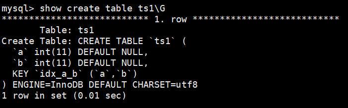
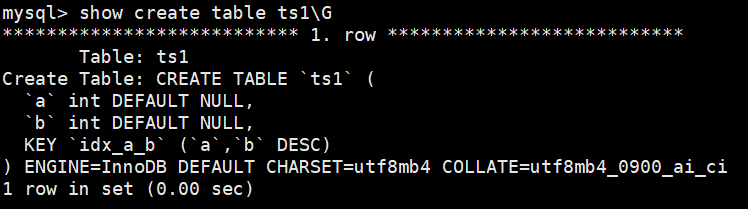

# 一、索引的分类

`MySQL` 的索引包括普通索引、唯一性索引、全文索引、单列索引、多列索引和空间索引等。

- 从**功能逻辑** 上说，索引主要有 4 种，分别是普通索引、唯一索引、主键索引、全文索引。
- 按照 **物理实现方式** ，索引可以分为 2 种：聚簇索引和非聚簇索引。
- 按照 **作用字段个数** 进行划分，分成单列索引和联合索引。

## 1.1 普通索引

在创建普通索引时，**不附加任何限制条件**，**只是用于提高查询效率**。这类索引**可以创建在任何数据类型中**，其值是否唯一和非空，要由字段本身的完整性约束条件决定。建立索引以后，可以通过索引进行查询。例如，在表student的字段name 上建立一个普通索引，查询记录时就可以根据该索引进行查询。

## 1.2 唯一性索引

使用**UNIQUE参数**可以**设置索引为唯一性索引**，在创建唯一性索引时，**限制该索引的值必须是唯一**的但**允许有空值(可以等于 null )**。在一**张数据表**里可以有**多个唯一索引**。例如，在表student的字段email中创建唯一性索引，那么字段email的值就必须是唯一的。通过唯一性索引,可以更快速地确定某条记录。

## 1.3 主键索引

主键索引就是**一种特殊的唯一性索引**，在唯一索引的基础上**增加了不为空的约束**，也就是**NOT NULL+UNIQUE**，一张表里**最多只有一个主键索引**。

## 1.4 单列索引

在表中的**单个字段上创建索引**。单列索引只根据该字段进行索引。单列索引可以是普通索引，也可以是唯一性索引，还可以是全文索引。只要保证该索引只对应一个字段即可。一个表可以有**多个单列索引**。

## 1.5 多列(组合、联合)索引

多列索引是在表的**多个字段组合上创建一个索引**。该索引指向创建时对应的多个字段，可以通过这几个字段进行查询，但是只有**查询条件**中使用了**这些字段中的第一个字段**时**才会被使用**。例如，在表中的字段 `id`，`name`和`gender`上建立一个多列索引 `idx_id_name_gender`，只有**在查询条件中使用了字段id时该索引才会被使用**。使用组合索引时遵循**最左前缀原则**。

## 1.6 全文索引

全文索引(也称全文检索）是目前**搜索引擎使用的一种关键技术**。它能够利用**【分词技术】**等多种算法智能**分析**出文本文字中**关键词的频率和重要性**，然后按照一定的算法规则智能地**筛选出我们想要的搜索结果**。

全文索引非常**适合大型数据集**，对于小的数据集，它的用处比较小。使用**参数 `FULLTEXT` 可以设置索引为全文索引**。在定义索引的列上支持值的全文查找，**允许在这些索引列中插入重复值和空值**。全文索引**只能创建在 `CHAR`、`VARCHAR` 或 `TEXT` 类型及其系列类型的字段上**，查询数据量较大的字符串类型的字段时，使用全文索引可以提高查询速度。

例如，表student的字段information是TEXT类型,该字段包含了很多文字信息。在字段information上建立全文索引后，可以提高查询字段information的速度。

全文索引典型的有两种类型:**自然语言的全文索引**和**布尔全文索引**。

    自然语言搜索引擎将计算每一个文档对象和查询的相关度。这里，相关度是基于匹配的关键词的个数，以及关键词在文档中出现的次数。在整个索引中出现次数越少的词语，匹配时的相关度就越高。相反，非常常见的单词将不会被搜索，如果一个词语的在超过50%的记录中都出现了，那么自然语言的搜索将不会搜索这类词语。

`MySQL` 数据库从 `3.23.23` 版开始支持全文索引，但`MySQL 5.6.4`以前只有 `Myisam` 支持，`5.6.4`版本以后 `innodb` 才支持，但是**官方版本不支持中文分词**，需要**第三方分词插件**。在**5.7.6版本**，`MySQL` **内置了 `ngram` 全文解析器**，用来**支持亚洲语种的分词**。测试或使用全文索引时，要先看一下自己的 `MySQL` 版本、存储引擎和数据类型是否支持全文索引。
随着大数据时代的到来，**关系型数据库**应对**全文索引的需求**已力不从心，**逐渐被 `solr`、`ElasticSearch` 等专门的搜索引擎所替代**。

## 1.7 空间索引

使用**参数 `SPATIAL` 可以设置索引为空间索引**。空间索引**只能建立在空间数据类型上**，这样可以提高系统获取空间数据的效率。`MySQL`中的空间数据类型**包括 `GEOMETRY`、`POINT`、`LINESTRING` 和 `POLYGON` 等**。目前**只有`MyISAM`存储引擎支持空间检索**，而且**索引的字段不能为空值**。对于初学者来说，这类索引很少会用到。

## 1.8 小结

不同的存储引擎支持的索引类型也不一样

- `InnoDB` :支持B-tree、Full-text等索引，不支持 Hash 索引;
- `MyISAM` :支持B-tree、Full-text等索引，不支持Hash索引;
- `Memory`  :支持B-tree、Hash 等索引，不支持Full-text索引;
- `NDB` :支持Hash索引，不支持B-tree、Full-text等索引;
- `Archive`  :不支持B-tree、Hash、Full-text等索引;

# 二、创建索引(创建表时创建)

```mysql
CREATE TABLE table_name [col_name data_type] 
[UNIQUE | FULLTEXT | SPATIAL] [INDEX | KEY] [index_name] (col_name [length]) [ASC | DESC]
```

- `UNIQUE`、`FULLTEXT` 和 `SPATIAL` 为**可选参数**，分别表示**唯一索引**、**全文索引**和**空间索引**；
- INDEX与KEY为同义词，**两者的作用相同**，用来指定创建索引；
- index_name指定**索引的名称**，为**可选参数**，**如果不指定**，那么`MySQL` **默认col_name为索引名**；
- col_name为**需要创建索引的字段列**，该列必须从数据表中定义的多个列中选择；
- length为**可选参数**，表示**索引的长度**，只有**字符串类型的字段**才能指定索引长度；
- `ASC`或 `DESC` 指定**升序或者降序的索引值存储**。

```sql
## 查看表中已有索引
show index from tableName;
## 或者
show index from tableName\G
```


## 2.1 创建普通索引

在 book 表中的 year_publication 字段上建立普通索引，SQL语句如下：

```sql
CREATE TABLE book( 
    book_id INT , 
    book_name VARCHAR(100), 
    authors VARCHAR(100), 
    info VARCHAR(100) , 
    comment VARCHAR(100), 
    year_publication YEAR, 
    INDEX(year_publication)  ## 普通索引 
);
```

## 2.2 创建唯一索引

```sql
CREATE TABLE test1( 
    id INT NOT NULL, 
    name varchar(30) NOT NULL, 
    UNIQUE INDEX uk_idx_id(id)  ## 唯一索引
);
```

## 2.3 创建主键索引

```sql
CREATE TABLE student ( 
    id INT(10) UNSIGNED AUTO_INCREMENT, 
    student_no VARCHAR(200),
    student_name VARCHAR(200), 
    PRIMARY KEY(id)   ## 主键索引
);
```

```sql
# 删除主键索引
ALTER TABLE student drop PRIMARY KEY ;
```

## 2.4 创建单列索引

```sql
CREATE TABLE test2( 
    id INT NOT NULL, 
    name CHAR(50) NULL, 
    INDEX single_idx_name(name(20)) 
);
```

## 2.5 创建组合索引

```sql
CREATE TABLE test3( 
    id INT(11) NOT NULL, 
    name CHAR(30) NOT NULL, 
    age INT(11) NOT NULL, 
    info VARCHAR(255), 
    INDEX multi_idx(id,name,age)  ## 组合索引
);
```

## 2.6 创建全文索引

```sql
CREATE TABLE `papers` ( 
    id` int(10) unsigned NOT NULL AUTO_INCREMENT, 
    `title` varchar(200) DEFAULT NULL, 
    `content` text, PRIMARY KEY (`id`), 
    FULLTEXT KEY `title` (`title`,`content`)  ## 全文索引
) ENGINE=MyISAM DEFAULT CHARSET=utf8;
```

```sql
## 使用全文索引
SELECT * FROM papers WHERE MATCH(title,content) AGAINST (‘查询字符串’);
```

## 2.7 创建空间索引

```sql
CREATE TABLE test5( 
    geo GEOMETRY NOT NULL, 
    SPATIAL INDEX spa_idx_geo(geo) 
) ENGINE=MyISAM;
```

# 三、创建索引(在已经存在的表上创建索引)

## 3.1 使用ALTER TABLE语句创建索引

```sql
ALTER TABLE table_name 
ADD [UNIQUE | FULLTEXT | SPATIAL] [INDEX | KEY] [index_name] (col_name[length],...) [ASC | DESC]
```

## 3.2 使用CREATE INDEX创建索引

```sql
CREATE [UNIQUE | FULLTEXT | SPATIAL] INDEX index_name 
ON table_name (col_name[length],...) [ASC | DESC]
```

# 四、删除索引

**注意：添加`AUTO_INCREMENT`约束字段的唯一索引不能被删除。**

## 4.1 使用ALTER TABLE删除索引

```sql
ALTER TABLE table_name DROP INDEX index_name;
```

## 4.2 使用DROP INDEX语句删除索引

```sql
DROP INDEX index_name ON table_name;
```

提示： 删除表中的列时，如果**要删除的列**为**索引的组成部分**，则**该列也会从索引中删除**。如果**组成索引的所有列都被删除**，则**整个索引将被删除**。

# 五、`MySQL8.0` 索引新特性

## 5.1 支持降序索引

举例：分别在 `MySQL 5.7` 版本和 `MySQL 8.0` 版本中创建数据表 `ts1`，结果如下：  

```sql
CREATE TABLE ts1(a int,b int,index idx_a_b(a,b desc));
```

在 `MySQL 5.7` 版本中查看数据表 `ts1`的结构，结果如下：  



从结果可以看出，索引仍然是默认的升序。也就是说**在`5.7` 版本及以下，不支持索引的降序排序**。

在 `MySQL 8.0` 版本中查看数据表 `ts1` 的结构，结果如下：  



从结果可以看出，索引已经是降序了。  

下面继续测试降序索引在执行计划中的表现。  

分别在MySQL 5.7版本和MySQL 8.0版本的数据表ts1中插入800条随机数据，执行语句如下 ：

```sql
DELIMITER //
CREATE PROCEDURE ts_insert()
BEGIN
DECLARE i INT DEFAULT 1;
WHILE i < 800
DO
insert into ts1 select rand()*80000,rand()*80000;
SET i = i + 1;
END WHILE;
commit;
END //
DELIMITER ;

CALL ts_insert();  ## 调用
```

在 **`MySQL 5.7` 版本**中查看数据表 `ts1` 的执行计划，结果如下：  

```sql
## 对a进行升序查找，对b进行降序查找
EXPLAIN SELECT * FROM ts1 ORDER BY a,b DESC LIMIT 5;
```

从结果可以看出，**执行计划中扫描数为799**，而且使用了 `Using filesort`。  

提示： `Using filesort` 是 `MySQL` 中一种**速度比较慢的外部排序**，能避免是最好的。多数情况下，管理员可以**通过优化索引来尽量避免出现 `Using filesort`**，从而提高数据库执行速度。  

在 **`MySQL 8.0` 版本**中查看数据表 `ts1` 的执行计划。从结果可以看出，**执行计划中扫描数为5**，而且没有使用`Using filesort`。  

注意： 降序索引**只对查询中特定的排序顺序有效**，如果**使用不当，反而查询效率更低**。例如，上述
查询排序条件如果改为`order by a desc, b desc`，`MySQL 5.7` 的执行计划要明显好于 `MySQL 8.0`。  

## 5.2 隐藏索引  

在 **`MySQL 5.7` 版本及之前**，**只能通过显式的方式删除索引**。此时，如果发现**删除索引后出现错误**，又**只能通过显式创建索引的方式将删除的索引创建回来**。如果数据表中的数据量非常大，或者数据表本身比较大，这种操作就会消耗系统过多的资源，操作成本非常高。  

从 `MySQL 8.x` 开始支持 **隐藏索引（invisible indexes）** ，只需要将**待删除的索引设置为隐藏索引**，使**查询优化器不再使用这个索引**（即使使用force index（强制使用索引），**优化器也不会使用该索引**），确认将索引设置为隐藏索引后**系统不受任何影响**，**就可以彻底删除索引**。 这种通过先将索引设置为隐藏索引，再删除索引的方式就是**软删除**。

### 5.2.1 创建表时直接创建隐藏索引

在 `MySQL` 中创建隐藏索引通过 `SQL`语句 `INVISIBLE` 来实现，其语法形式如下：  

```sql
CREATE TABLE tablename(
	propname1 type1[CONSTRAINT1],
	propname2 type2[CONSTRAINT2],
	……
	propnamen typen,
	INDEX [indexname](propname1 [(length)]) INVISIBLE
);
```

上述语句比普通索引多了一个**关键字INVISIBLE**，用来**标记索引为不可见索引**  

### 5.2.2 在已经存在的表上创建  

可以为已经存在的表设置隐藏索引，其语法形式如下：  

```sql
CREATE INDEX indexname
ON tablename(propname[(length)]) INVISIBLE;
## 或者
ALTER TABLE tablename
ADD INDEX indexname (propname [(length)]) INVISIBLE;
```

### 5.2.3 切换索引可见状态  

```sql
ALTER TABLE tablename ALTER INDEX index_name INVISIBLE; #切换成隐藏索引
ALTER TABLE tablename ALTER INDEX index_name VISIBLE; #切换成非隐藏索引
```

注意：当索引**被隐藏时**，它的内容仍然是和正常索引一样**实时更新的**。如果一个索引需要长期被隐藏，那么可以将其删除，因为**索引的存在会影响插入、更新和删除的性能**。  

### 5.2.4 使隐藏索引对查询优化器可见  

在 `MySQL 8.x` 版本中，为索引提供了一种**新的测试方式**，可以通过查询优化器的一个开关**（use_invisible_indexes）**来打开某个设置，使隐藏索引对查询优化器可见。如果 **use_invisible_indexes 设置为off(默认)**，**优化器会忽略隐藏索引**。如果**设置 on**，即使**隐藏索引不可见**，优化器在**生成执行计划时仍会考虑使用隐藏索引**。  

1. 在 `MySQL` 命令行执行如下命令查看查询优化器的开关设置。  

```sql
mysql> select @@optimizer_switch \G
```

在输出的结果信息中找到如下属性配置。  

```sql
use_invisible_indexes=off
```

此属性配置值为off，说明隐藏索引**默认对查询优化器不可见**。  

2. 使**隐藏索引**对查询优化器**可见**，需要在 `MySQL` 命令行执行如下命令：  

```sql
mysql> set session optimizer_switch="use_invisible_indexes=on";
Query OK, 0 rows affected (0.00 sec)
```

3. 使用EXPLAIN查看以字段invisible_column作为查询条件时的索引使用情况。  

```sql
explain select * from classes where cname = '高一2班';
```

查询优化器会**使用隐藏索引来查询数据**。  

# 六、哪些情况适合创建索引

## 6.1 字段的数值有唯一性的限制

索引本身可以起到约束的作用，比如**唯一索引、主键索引都可以起到唯一性约束**的，因此在我们的数据表中，**如果某个字段是唯一的，就可以直接创建唯一性索引，或者主键索引**。这样可以**更快速地通过该索引来确定某条记录**。
例如，学生表中学号是具有唯一性的字段，为该字段建立唯一性索引可以很快确定某个学生的信息，如果使用姓名的话，可能存在同名现象，从而降低查询速度。

> 业务上具有**唯一特性**的字段，即使是**组合字段**，也必须建成唯一索引。（来源：Alibaba）
>
> 说明：不要以为唯一索引影响了insert速度，这个速度损耗可以忽略，但提高查找速度是明显的。

## 6.2 频繁作为WHERE查询条件的字段

某个字段在SELECT语句的 WHERE 条件中经常被使用到，那么就需要给这个字段创建索引了。尤其是在数据量大的情况下，创建**普通索引**就可以**大幅提升数据查询的效率**。

比如student_info数据表（含100万条数据），假设我们想要查询 student_id=123110 的用户信息。

## 6.3 经常GROUP BY和ORDER BY的列

索引就是让数据按照某种顺序进行存储或检索，因此当我们使用 GROUP BY 对数据进行分组查询，或者使用 ORDER BY 对数据进行排序的时候，就需要**对需要进行分组或者排序的字段进行索引**。如果**待排序的列有多个**，那么可以在这些列上建立**组合索引**。

注意：在`SQL`语句中，因为 **`GROUP BY` 在执行顺序上要先于`ORDER BY`**，因此在建立**联合索引**的时候：**`GROUP BY `指定的字段要在`ORDER BY`指定字段的左侧**。

## 6.4 UPDATE、DELETE的WHERE条件列

对数据**按照某个条件进行查询**后**再进行 UPDATE 或 DELETE** 的操作，**如果对 WHERE 字段创建了索引，就能大幅提升效率**。

原理是因为我们需要**先根据 WHERE 条件列检索出来这条记录**，然后**再对它进行更新或删除**。如果进行更新的时候，**更新的字段是非索引字段，提升的效率会更明显**，这是因为非索引字段更新不需要对索引进行维护。

## 6.5 DISTINCT字段需要创建索引

有时候我们需要对某个字段进行去重，使用 DISTINCT，那么对这个字段创建索引，也会提升查询效率。原因是**重复的字段在索引中是聚集在一起的**。

## 6.6 多表JOIN连接操作时，创建索引注意事项

1. 首先，**连接表的数量**尽量**不要超过 3 张**，因为每增加一张表就相当于增加了一次嵌套的循环，数量级增长会非常快，严重影响查询的效率。
2. 其次，**对 WHERE 条件创建索引**，因为 WHERE 才是对数据条件的过滤。如果在数据量非常大的情况下，没有 WHERE 条件过滤是非常可怕的。
3. 最后，对**用于连接的字段创建索引**，并且**该字段在多张表中的类型必须一致**，因为**不同的类型**，会进行转换后在进行比较，**转换会用到函数**，一旦**使用函数索引就会失效**。

## 6.7 使用列的类型小的创建索引

我们这里所说的类型大小指的就是**该类型表示的数据范围的大小**。

- 数据类型越小，在查询时进行的比较操作越快

- 数据类型越小，**索引占用的存储空间就越少**，在**一个数据页内就可以放下更多的记录**，从而**减少磁盘I/O**带来的性能损耗，也就意味着**可以把更多的数据页缓存在内存**中，从而加快读写效率。

这个建议**对于表的主键来说更加适用**，因为不仅是聚簇索引中会存储主键值，其他所有的**二级索引的节点处都会存储一份记录的主键值**，如果主键使用更小的数据类型，也就意味着节省更多的存储空间和更高效的I/O。

## 6.8 使用字符串前缀创建索引

假设我们的**字符串很长**，那存储一个字符串就需要占用很大的存储空间。在我们需要为这个**字符串列建立索引时**，那就意味着在**对应的B+树中有这么两个问题**:

- B+树索引中的记录**需要把该列的完整字符串存储起来**，更费时。而且字符串越长，在索引中**占用的存储空间越大**。
- 如果B+树索引中索引列存储的字符串很长，那在**做字符串比较时会占用更多的时间**。

我们可以通过**截取字段的前面一部分内容建立索引**，这个就叫**前缀索引**。

这样在查找记录时**虽然不能精确的定位到记录的位置**，但是**能定位到相应前缀所在的位置**，然后**根据**前缀相同的**记录的主键值回表查询完整的字符串值**。既节约空间，又减少了字符串的比较时间，还大体能解决排序的问题。例如，TEXT和BLOG类型的字段，进行全文检索会很浪费时间，如果只检索字段前面的若干字符，这样可以提高检索速度。

创建一张商户表，因为**地址字段比较长**，在地址字段上建立**前缀索引**：

```sql
create table shop ( address varchar ( 120) not null) ;
alter table shop add index ( address( 12));
```

问题是，**截取多少呢**？ 截取得多了，达不到节省索引存储空间的目的；截取得少了，**重复内容太多字段的散列度(选择性)会降低**。怎么计算不同的长度的选择性呢?

先看一下**某一字段在全部数据中的选择度**:

```sql
select count( distinct address) / count( * ) from shop ;
```

**区分度计算公式**：

```sql
count(distinct left(列名, 索引长度))/count(*)
```

例如:

```sql
select count(distinct left(address,10)) / count(*) as sub10,--截取前10个字符的选择度
count(distinct left(address,15)) / count(*) as sub11，--截取前15个字符的选择度
count(distinct left(address,2)) / count(*) as sub12，--截取前20个字符的选择度
count(distinct left(address,25)) / count(*) as sub13 -- 截取前25个字符的选择度
from shop;
```

总结：在 **varchar 字段**上**建立索引**时，**必须指定索引长度**，没必要对全字段建立索引，根据**实际文本区分度**决定**索引长度**。

**一般来说，区分度越高越好，但是如果某几种长度下区分度差别不大，优先选择索引长度最小的。**

说明：索引的长度与区分度是一对矛盾体，一般对字符串类型数据，**长度为 20 的索引，区分度会高达 90% 以上**。


**引申另一个问题：索引列前缀对排序的影响**

如果使用了**索引列前缀**，比方说前边**只把address列的前12个字符放到了二级索引**中，下边这个查询可能就有点儿尴尬了︰

```sql
SELECT *FROM shop ORDER BY address LIMIT 12;
## 上述的索引得到的结果大概率不是address最小的12个，这种情况在所有数据的address的前12个字符都一样，后面字符不一样的时候最严重。
```

因为**二级索引中不包含完整的address列信息**，所以**无法对前12个字符相同，后边的字符不同的记录进行排序**。

因此：使用**索引列前缀**的方式无法支持使用**索引排序**，只能使用文件排序。

## 6.9 区分度高(散列性高)的列适合作为索引

**列的基数**指的是**某一列中不重复数据的个数**，比方说某个列包含值2,5,8,2,5,8,2,5,8，虽然有9条记录，但该列的基数却是3。也就是说，**在记录行数一定的情况下，列的基数越大，该列中的值越分散；列的基数越小，该列中的值越集中。**这个列的基数指标非常重要，直接影响我们是否能有效的利用索引。

最好使用**列的基数大的列建立索引**，使用基数太小的列建立索引效果可能不好。

可以使用公式 `select count(distinct a)/count(*) from t1` **计算区分度**，**越接近1越好**，一般**超过`33%`就算是比较高效的索引**了。

拓展：**联合索引**把**区分度高（散列性高）的列**放在**前面**。

## 6.10 使用最频繁的列放到联合索引的左侧

由于"最左前缀原则"，可以增加联合索引的使用率。

## 6.11 在多个字段都要创建索引的情况下，联合索引优于单值索引

联合索引通常可以被单列搜索所复用。可以少建立一些索引

# 七、限制索引的数目

在实际工作中，我们也需要注意平衡，索引的数目不是越多越好。我们需要限制每张表上的索引数量，建议**单张表索引数量不超过6个**。原因：

- **每个索引都需要占用磁盘空间**，索引越多，需要的磁盘空间就越大。
- 索引会**影响INSERT、DELETE、UPDATE等语句的性能**，因为表中的数据更改的同时，索引也会进行调整和更新，会造成负担。
- **优化器在选择如何优化查询时**，会根据统一信息，**对每一个可以用到的索引来进行评估，以生成出一个最好的执行计划**，如果同时有很多个索引都可以用于查询，会**增加 `MySQL` 优化器生成执行计划时间**，降低查询性能。

# 八、哪些情况不适合创建索引

## 8.1 在where中使用不到的字段，不要设置索引

**WHERE条件(包括GROUP BY、ORDER BY)**里用不到的字段不需要创建索引，索引的价值是快速定位，如果起不到定位的字段通常是不需要创建索引的。举个例子:

```sql
SELECT course_id, student_id, create_time FROM student_info
WHERE student_id = 41251;
```

因为我们是按照student_id 来进行检索的，所以不需要对其他字段创建索引。

## 8.2 数据量小的表最好不要使用索引

如果表记录太少，比如**少于1000个**，那么是**不需要创建索引**的。表记录太少，是否创建索引对查询效率的影响并不大。甚至说，查询花费的时间可能比遍历索引的时间还要短，索引可能不会产生优化效果。

## 8.3 有大量重复数据的列上不要建立索引

在条件表达式中经常用到的不同值较多的列上建立索引，但字段中如果有大量重复数据，也不用创建索引。比如在学生表的“性别"字段上只有“男”与“女”两个不同值，因此无须建立索引。如果建立索引，不但不会提高查询效率，反而会**严重降低数据更新速度**。

举例1：要在100万行数据中查找其中的50万行（比如性别为男的数据)，一旦创建了索引，你需要**先访问50万次索引**，然后**再访问50万次数据表**，这样加起来的开销比不使用索引可能还要大。

## 8.4 避免对经常更新的表创建过多的索引

- 第一层含义︰**频繁更新的字段**不一定要创建索引。因为更新数据的时候，也需要更新索引，如果索引太多，在更新索引的时候也会造成负担，从而影响效率。
- 第二层含义:避免对**经常更新的表**创建过多的索引，并且索引中的列尽可能少。此时，虽然提高了查询速度，同时却会降低更新表的速度。

## 8.5 不建议用无序的值作为索引

例如身份证、`UUID` (在索引比较时需要转为ASCII，并且**插入时可能造成页分裂**)、`MD5`、HASH、无序长字符串等。

可以的话，为索引选择的字段添加`AUTO INCREASMENT`自增属性。

## 8.6 删除不再使用或者很少使用的索引

表中的数据被大量更新，或者数据的使用方式被改变后，原有的一些索引可能不再需要。数据库管理员应当定期找出这些索引，将它们删除，从而减少索引对更新操作的影响。

## 8.7 不要定义冗余或重复的索引

### 8.7.1 冗余索引  

举例：建表语句如下  

```sql
CREATE TABLE person_info(
	id INT UNSIGNED NOT NULL AUTO_INCREMENT,
	name VARCHAR(100) NOT NULL,
	birthday DATE NOT NULL,
	phone_number CHAR(11) NOT NULL,
	country varchar(100) NOT NULL,
	PRIMARY KEY (id),
	KEY idx_name_birthday_phone_number (name(10), birthday, phone_number),
	KEY idx_name (name(10))   ## 冗余索引
);
```

通过 **`idx_name_birthday_phone_number` 索引就可以对 `name` 列进行快速搜索**，再创建一个**专门针对 `name` 列的索引就算是一个冗余索引** ，维护这个索引只会增加维护的成本，并不会对搜索有什么好处。  

### 8.7.2 重复索引  

另一种情况，我们可能会对某个列 **重复建立索引** ，比方说这样：  

```sql
CREATE TABLE repeat_index_demo (
	col1 INT PRIMARY KEY,
	col2 INT,
	UNIQUE uk_idx_c1 (col1),
	INDEX idx_c1 (col1)
);
```

`col1` 既是**主键**、又给它定义为一个**唯一索引**，还给它定义了一个**普通索引**，可是主键本身就会生成聚簇索引，所以定义的**唯一索引和普通索引是重复的**，这种情况要避免。  
