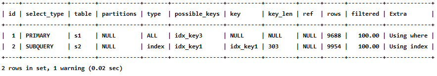
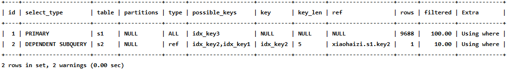
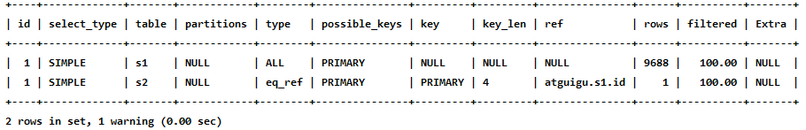
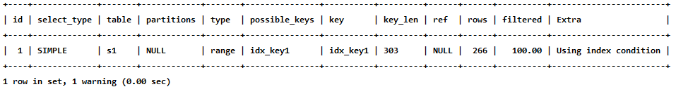

# 一、性能分析工具的使用

## 1.1 数据库服务器的优化步骤

当我们遇到**数据库调优问题**的时候，该如何思考呢？这里把思考的流程整理成下面这张图。

整个流程划分成了 **观察（Show status）** 和 **行动（Action）** 两个部分。字母 S 的部分代表观察（会使用相应的**分析工具**），字母 A 代表的部分是行动（**对应分析可以采取的行动**）。


我们可以通过观察了解数据库整体的运行状态，通过性能分析工具可以让我们了解**执行慢的 `SQL` 都有哪些**，查看**具体的 `SQL` 执行计划**，甚至是 **`SQL` 执行中的每一步的成本代价**，这样才能定位问题所在，找到了问题，再采取相应的行动。

**详细解释一下这张图:**

首先在 `S1` 部分，我们需要观察服务器的状态**是否存在周期性的波动**。如果存在周期性波动，可能是**周期性节点**的原因，比如**双十一、促销活动**等。这样的话，我们可以通过 `A1` 这一步骤解决，也就是**加缓存**，或者**更改缓存失效策略**。

如果缓存策略没有解决，或者不是周期性波动的原因，我们就需要进一步分析查询延迟和卡顿的原因，接下来进入 `S2` 这一步，我们需要**开启慢查询**。

**慢查询可以帮我们定位执行慢的 `SQL` 语句**。我们可以通过**设置`long.query_time`参数定义“慢”的阈值**，如果 **`SQL` 执行时间超过了`long_query_time`，则会认为是慢查询**。当收集上来这些慢查询之后，我们就可以通过分析工具对**慢查询日志**进行分析。

在 `S3` 这一步骤中，我们就知道了执行慢的 `SQL`，这样就可以针对性地**用 `EXPLAIN` 查看对应 `SQL `语句的执行计划**，或者使用 **`show profile`查看 `SQL` 中每一个步骤的时间成本**。这样我们就可以了解 `SQL` 查询慢是因为**执行时间长**，还是**等待时间长**。

如果是 `SQL` 等待时间长，我们进入 `A2` 步骤。在这一步骤中，我们可以**调优服务器的参数**，比如适当**增加数据库缓冲池**等。如果是 **`SQL` 执行时间长**，就进入 `A3` 步骤，这一步中我们需要考虑是**索引设计的问题**？还是查询**关联的数据表过多**？还是因为**数据表的字段设计问题**导致了这一现象。然后在这些维度上进行对应的调整。

如果 `A2` 和 `A3` 都不能解决问题，我们需要考虑**数据库自身的 `SQL` 查询性能是否已经达到了瓶颈**，如果确认没有达到性能瓶颈，就需要重新检查，重复以上的步骤。如果已经**达到了性能瓶颈**，进入 `A4` 阶段，需要考虑**增加服务器**，采用**读写分离的架构**，或者考虑**对数据库进行分库分表**，比如垂直分库、垂直分表和水平分表等。

以上就是数据库调优的流程思路。如果我们发现执行 `SQL` 时存在不规则延迟或卡顿的时候，就可以采用分析工具帮我们定位有问题的 `SQL` ，这三种分析工具你可以理解是`SQL`调优的三个步骤：**慢查询**、**EXPLAIN**和 **SHOW PROFILING**。


## 1.2 查看系统性能参数

在 `MySQL` 中，可以使用 `SHOW STATUS` 语句查询一些 `MySQL` 数据库服务器的性能参数 、执行频率 。

`SHOW STATUS`语句语法如下：

一些常用的性能参数如下：

    Connections：连接MySQL服务器的次数。
    Uptime：MySQL服务器的上线时间。
    Slow_queries：慢查询的次数。
    Innodb_rows_read：Select查询返回的行数
    Innodb_rows_inserted：执行INSERT操作插入的行数
    Innodb_rows_updated：执行UPDATE操作更新的行数
    Innodb_rows_deleted：执行DELETE操作删除的行数
    Com_select：查询操作的次数。
    Com_insert：插入操作的次数。对于批量插入的 INSERT 操作，只累加一次。
    Com_update：更新操作的次数。
    Com_delete：删除操作的次数。
## 1.3 统计 `SQL `的查询成本：`last_query_cost`

一条 `SQL` 查询语句在执行前需要**确定查询执行计划**，如果**存在多种执行计划**的话，`MySQL `会**计算每个执行计划所需要的成本**，从中**选择成本最小的一个**作为**最终执行的执行计划**。

如果我们想要**查看某 `SQL` 语句的查询成本**，可以在执行完这条 `SQL` 语句之后，通过**查看当前会话中的 `last_query_cost` 变量值**来得到**当前查询的成本**。它通常也是我们评价一个查询的执行效率的一个常用指标。这个查询成本**对应的是SQL语句所需要读取的页的数量**。

```sql
SHOW STATUS LIKE 'last_query_cost';
```

使用场景：它对于比较开销是非常有用的，特别是我们有好几种查询方式可选的时候。

> `SQL` 查询是一个动态的过程，从页加载的角度来看，我们可以得到以下两点结论：
>
> - 位置决定效率。如果**页就在数据库缓冲池**中，那么**效率是最高的**，否则还需要**从内存或者磁盘中进行读取**，当然针对单个页的读取来说，如果页存在于内存中，会比在磁盘中读取效率高很多。
>
> - 批量决定效率。如果我们从磁盘中对单一页进行随机读，那么效率是很低的（差不多 `10ms` ），而采用**顺序读取的方式**，**批量对页进行读取**，**平均一页的读取效率就会提升很多**，甚至要快于单个页面在内存中的随机读取。
>
> 所以说，遇到 I/O 并不用担心，方法找对了，效率还是很高的。我们**首先要考虑数据存放的位置**，如果是**经常使用的数据就要尽量放到缓冲池**中，其次我们可以充分利用磁盘的吞吐能力，**一次性批量读取数据**，这样**单个页的读取效率也就得到了提升**。

# 二、定位执行慢的 `SQL`：慢查询日志

## 2.1 开启慢查询日志参数

`MySQL` 的**慢查询日志**，用来记录在 `MySQL` 中 **响应时间超过阈值** 的语句，具体指**运行时间超过 `long_query_time` 的值的 `SQL`** ，则会被记录到慢查询日志中。long_query_time的**默认值为`10`**，意思是**运行10秒以上（不含10秒）的语句**，认为是超出了我们的最大忍耐时间值。

它的主要作用是，帮助我们发现那些**执行时间特别长的 `SQL` 查询**，并且有针对性地进行优化，从而提高系统的整体效率。当我们的数据库服务器发生阻塞、运行变慢的时候，检查一下慢查询日志，找到那些慢查询，对解决问题很有帮助。比如一条`SQL` 执行超过5秒钟，我们就算慢 `SQL` ，希望能**收集超过5秒的`SQL`**，**结合explain进行全面分析**。

默认情况下，`MySQL`数据库**没有开启慢查询日志**，需要我们**手动来设置这个参数**。**如果不是调优需要的话，一般不建议启动该参数**，因为开启慢查询日志会或多或少带来一定的性能影响。

慢查询日志**支持将日志记录写入文件**。


### 2.1.1 开启 slow_query_log

```SQL
set global slow_query_log='ON';
```

查看下慢查询日志**是否开启**，以及慢查询**日志文件的位置**：

```sql
show variables like `%slow_query_log%`;
```

### 2.1.2 修改 long_query_time 阈值

```sql
show variables like '%long_query_time%';
```

测试发现：**设置 `global` 的方式对当前 `session` 的long_query_time无效**。**对新连接的客户端有效**。所以可以**一并执行下述语句：**

```sql
mysql > set global long_query_time = 1;   ## 针对新连接的session
mysql> show global variables like '%long_query_time%'; 

mysql> set long_query_time=1;  ## 针对当前 session
mysql> show variables like '%long_query_time%';
```

### 2.1.3 查看慢查询数目

```sql
SHOW GLOBAL STATUS LIKE '%Slow_queries%';
```

### 2.1.4 慢查询日志分析工具：`mysqldumpslow`

在生产环境中，如果要手工分析日志，查找、分析 `SQL`，显然是个体力活，`MySQL` 提供了**日志分析工具 `mysqldumpslow`** 。

 查看 `mysqldumpslow` 的帮助信息

```sql
mysqldumpslow --help
```


`mysqldumpslow` 命令的具体参数如下：

    -a: 不将数字抽象成N，字符串抽象成S
    -s: 是表示按照何种方式排序：
        c: 访问次数
        l: 锁定时间
        r: 返回记录
        t: 查询时间
        al:平均锁定时间
        ar:平均返回记录数
        at:平均查询时间 （默认方式）
        ac:平均查询次数
    -t: 即为返回前面多少条的数据；
    -g: 后边搭配一个正则匹配模式，大小写不敏感的；
举例：我们想要**按照查询时间排序**，查看**前五条** 慢查询 `SQL` 语句，这样写即可：

```sql
mysqldumpslow -s t -t 5 /var/lib/mysql/atguigu01-slow.log

[root@bogon ~]# mysqldumpslow -s t -t 5 /var/lib/mysql/atguigu01-slow.log 
Reading mysql slow query log from /var/lib/mysql/atguigu01-slow.log 
Count: 1 Time=2.39s (2s) Lock=0.00s (0s) Rows=13.0 (13), root[root]@localhost SELECT * FROM student WHERE name = 'S' 
Count: 1 Time=2.09s (2s) Lock=0.00s (0s) Rows=2.0 (2), root[root]@localhost SELECT * FROM student WHERE stuno = N 
Died at /usr/bin/mysqldumpslow line 162, <> chunk 2.
```

### 2.1.5 关闭慢查询日志

1. 方式1：永久性方式

```ini	
## 修改mysql配置文件
[mysqld] 
slow_query_log=OFF
#或
[mysqld] 
#slow_query_log =OFF
```

2. 方式2：临时性方式(重启 `mysql` 后失效)

```sql
SET GLOBAL slow_query_log=off;
```

### 2.1.6 删除慢查询日志

使用 `SHOW` 语句显示慢查询日志信息，具体 `SQL` 语句如下。

```sql
SHOW VARIABLES LIKE 'slow_query_log% ';
```

找到对应的慢查询日志文件所在的路径，**使用`rm -rf` 指令可以将其删除**。

删除后，如果我们想要重新生成一个慢查询日志文件，可以使用命令`mysqladmin flush-logs` ，具体命令如下，执行完毕会在**数据目录**下**重新生成慢查询日志文件**：

```sql
mysqladmin -uroot -p flush-logs slow
```

## 2.2 查看 `SQL` 执行成本：`SHOW PROFILE`

```sql
show variables like 'profiling';
#开启
set profiling = 'ON';
#查看
show profiles;   ## 查看近期的所有SQL语句
show profile cpu,block io for query 2; # 查询ID=2的SQL语句
```

show profile 的常用查询参数:

    ALL:显示所有的开销信息。
    BLOCK IO:显示块Io开销。
    CONTEXT SWITCHES: 上下文切换开销。
    CPU:显示CPU开销信息。
    IPC:显示发送和接收开销信息。
    MEMORY:显示内存开销信息。
    PAGE FAULTS:显示页面错误开销信息。
    SOURCE:显示和Source_function，Source_file，Source_line相关的开销信息。
    SWAPS:显示交换次数开销信息。
## 2.3 分析查询语句：EXPLAIN

定位了查询慢的 `SQL` 之后，我们就可以使用 **`EXPLAIN` 或 `DESCRIBE` 工具**做针对性的分析**查询语句DESCRIBE语句**的使用方法与**EXPLAIN语句**是一样的，并且分析结果也是一样的。

`MySQL` 中有专门负责优化 `SELECT` 语句的**优化器模块**，主要功能：通过计算分析系统中收集到的统计信息，**为客户端请求的`Query` 提供它认为最优的执行计划**（他认为最优的数据检索方式，但不见得是 `DBA` 认为是最优的，**这部分最耗费时间**)。

这个**执行计划展示了接下来具体执行查询的方式**，比如**多表连接的顺序**是什么，对于**每个表采用什么访问方法来具体执行查询**等等。`MysQL` 为我们提供了EXPLAIN语句来帮助我们查看某个查询语句的具体执行计划，大家看懂EXPLAIN语句的各个输出项，可以有针对性的提升我们查询语句的性能。

```
官方文档：
https://dev.mysql.com/doc/refman/5.7/en/explain-output.html
https://dev.mysql.com/doc/refman/8.0/en/explain-output.html
```

**版本情况**
`MySQL 5.6.3` 以前只能 `EXPLAIN SELECT` ；`MYSQL 5.6.3`以后就可以 `EXPLAIN SELECT，UPDATE，DELETE`。

在 `5.7` 以前的版本中，想要显示 `partitions` 需要使用 `explain partitions` 命令；想要显示 `filtered` 需要使用 `explain extended` 命令。在 `5.7` 版本后，默认`explain` 直接显示 `partitions` 和 `filtered` 中的信息。  

### 2.3.1 语法

```sql
EXPLAIN SELECT select_options 
#或者
DESCRIBE SELECT select_options
```

如果我们想看看**某个查询的执行计划**的话，可以在**具体的查询语句**前边加一个 EXPLAIN ，就像这样 ：

```sql
mysql> EXPLAIN SELECT 1;
```


**输出的上述信息就是所谓的执行计划**。在这个执行计划的辅助下，我们需要知道应该怎样改进自己的查询语句以使查询执行起来更高效。其实**除了以SELECT开头的查询语句**，其余的**DELETE、INSERT、REPLACE以及UPDATE语句等都可以加上 EXPLAIN**，用来查看这些语句的执行计划，只是平时我们对SELECT语句更感兴趣。

> 执行EXPLAIN时并没有真正的执行该后面的语句，因此可以安全的查看执行计划。

EXPLAIN 语句输出的各个列的作用如下：

| 列名          | 描述                                                    |
| ------------- | ------------------------------------------------------- |
| id            | 在一个大的查询语句中每个SELECT关键字都对应一个 唯一的id |
| select_type   | SELECT关键字对应的那个查询的类型                        |
| table         | 表名                                                    |
| partitions    | 匹配的分区信息                                          |
| type          | 针对单表的访问方法                                      |
| possible_keys | 可能用到的索引                                          |
| key           | 实际上使用的索引                                        |
| key_len       | 实际使用到的索引长度                                    |
| ref           | 当使用索引列等值查询时，与索引列进行等值匹配的对象信息  |
| rows          | 预估的需要读取的记录条数                                |
| filtered      | 某个表经过搜索条件过滤后剩余记录条数的百分比            |
| Extra         | 一些额外的信息                                          |

### 2.3.2 基本语法

测试用的表结构:

```sql
CREATE TABLE s1 ( 
	id INT AUTO_INCREMENT, 
    key1 VARCHAR(100), 
    key2 INT, 
    key3 VARCHAR(100), 
    key_part1 VARCHAR(100), 
    key_part2 VARCHAR(100), 
    key_part3 VARCHAR(100), 
    common_field VARCHAR(100), 
    PRIMARY KEY (id), 
    INDEX idx_key1 (key1), 
    UNIQUE INDEX idx_key2 (key2), 
    INDEX idx_key3 (key3), 
    INDEX idx_key_part(key_part1, key_part2, key_part3) ) ENGINE=INNODB CHARSET=utf8;
```

#### 2.3.1.1 table

不论我们的查询语句有多复杂，包含了多少个表 ，到最后也是需要**对每个表进行单表访问**的，所以 `MySQL` 规定**EXPLAIN语句输出的每条记录都对应着某个单表的访问方法**，该条记录的table列代表着**该表的表名**（有时会出现中间表）。

#### 2.3.1.2 id

**id 的数量与 `SELECT` 关键字的数量有关。** 

##### 2.3.1.2.1 针对一个表的一个`SELECT`

我们写的查询语句一般都以 SELECT 关键字开头，比较简单的查询语句里**只有一个 SELECT 关键字**，比如下边这个查询语句：  

```sql
SELECT * FROM s1 WHERE key1 = 'a';
```

对上述语句进行`EXPLAIN`，可以看到**对 `s1` 表进行了一次查询**。

```sql
mysql> EXPLAIN SELECT * FROM s1 WHERE key1 = 'a';
```


##### 2.3.1.2.2 针对两个表的一个`SELECT`

稍微复杂一点的连接查询中也只有一个 SELECT 关键字，比如：  

```sql
SELECT * FROM s1 INNER JOIN s2
ON s1.key1 = s2.key1
WHERE s1.common_field = 'a';
```

进行解析，可以看到**分别针对两个表**（s1和s2）**各自进行了一次查询**（从上往下顺序的执行，因为**两次查询的 id 相同**）。


##### 2.3.1.2.3 针对两个表的两个`SELECT`

```sql
mysql> EXPLAIN SELECT * FROM s1 WHERE key1 IN (SELECT key1 FROM s2) OR key3 = 'a';
```



分别**针对两个表（s1和s2）各自进行了一次查询**（进行的是**倒序的查询**，先进行 id  = 2 的查询，再进行 id = 1 的查询）。

##### 2.3.1.2.4 `UNION` 去重

```sql
mysql> EXPLAIN SELECT * FROM s1 UNION SELECT * FROM s2;
```


除了分别先后对 s2 和 s1 进行了一次查询，同时因为使用了临时表（因为是**联合 + 去重**，必须**先用一个临时表临时存储联合的结果**，再**针对临时表进行去重**）额外进行了一次查询。

##### 2.3.1.2.5 `UNION ALL`

```sql
mysql> EXPLAIN SELECT * FROM s1 UNION ALL SELECT * FROM s2;
```


因为不需要去重，因此不需要创建临时表，因此没有额外的第三次查询。

##### 2.3.1.2.6 总结

- **id如果相同，可以认为是一组**，从上往下顺序执行
- 在所有组中，**id值越大，优先级越高**，越先执行
- 关注点：**id号每个号码**，表示一趟**独立的查询**, 一个`SQL`的查询趟数越少越好  

#### 2.3.1.3 `select_type`

| 名称                 | 描述                                                         |
| -------------------- | ------------------------------------------------------------ |
| SIMPLE               | Simple SELECT (not using UNION or subqueries)                |
| PRIMARY              | Outermost SELECT                                             |
| UNION                | Second or later SELECT statement in a UNION                  |
| UNION RESULT         | Result of a UNION                                            |
| SUBQUERY             | First SELECT in subquery                                     |
| DEPENDENT SUBQUERY   | First SELECT in subquery, dependent on outer query           |
| DEPENDENT UNION      | Second or later SELECT statement in a UNION, dependent on outer query |
| DERIVED              | Derived table                                                |
| MATERIALIZED         | Materialized subquery                                        |
| UNCACHEABLE SUBQUERY | A subquery for which the result cannot be cached and must be re-evaluated for each row of the outer query |
| UNCACHEABLE UNION    | The second or later select in a UNION that belongs to an uncacheable subquery (see UNCACHEABLE SUBQUERY) |

具体分析如下：  

##### 2.3.1.3.1 `simple`

查询语句不包含 `UNION` 或者子查询的查询都算作是`simple`查询

```sql
mysql> EXPLAIN SELECT * FROM s1;
```


连接查询也算是 SIMPLE 类型，比如：  

```sql
mysql> EXPLAIN SELECT * FROM s1 INNER JOIN s2;
```


##### 2.3.1.3.2 `PRIMARY`

对于包含 `UNION` 或者 `UNION ALL` 或者子查询的大查询来说，它是由几个小查询组成的，其中最左边的小查询的`select_type` 值就是 `PRIMARY`

```SQL
mysql> EXPLAIN SELECT * FROM s1 UNION SELECT * FROM s2;
```


##### 2.3.1.3.3 `UNION` 和 `UNION RESULT`

对于包含 `UNION` 或者 `UNION ALL` 的大查询来说，它是由几个小查询组成的，除了最左侧的一个小查询之外，其他小查询的 `select_type` 值就是 `UNION` 。

如果是`UNION `降重查询，还有存在一个临时的表存储合并数据并进行降重，对其查询的类型为`UNION RESULT`。如果是 `UNION ALL`  ，则不存在。

##### 2.3.1.3.4 `SUBQUERY  `

如果包含子查询的查询语句不能转化为对应的 `semi-join` 连接的形式，并且该子查询不是相关子查询。那么该子查询的第一个 `select` 关键字对应的类型就是 `SUBQUERY`。

```sql
mysql> EXPLAIN SELECT * FROM s1 WHERE key1 IN (SELECT key1 FROM s2) OR key3 = 'a';
```


##### 2.3.1.3.5 `DEPENDENT SUBQUERY  `

子查询是相关子查询，那么对应的类型就是 `DEPENDENT SUBQUERY  `

```sql
mysql> EXPLAIN SELECT * FROM s1 WHERE key1 IN (SELECT key1 FROM s2 WHERE s1.key2 = s2.key2) OR key3 = 'a';
```



##### 2.3.1.3.6 `DEPENDENT UNION  `

对于包含 `UNION` 或者 `UNION ALL` 的大查询来说，如果各个小查询都依赖于外层查询的话，那除了最左边的那个小查询之外，其余的小查询的类型就是`DEPENDENT UNION`

```sql
mysql> EXPLAIN SELECT * FROM s1 WHERE key1 IN (SELECT key1 FROM s2 WHERE key1 = 'a' UNION SELECT key1 FROM s1 WHERE key1 = 'b');
```

`IN` 关键字会将其转化为连接的方式，将主查询的结果传给子查询，使其变成了相关查询。

##### 2.3.1.3.7 `DERIVED  `

对于包含 `派生表` 的查询，该派生表对应的子查询的类型是`DERIVED  `

```sql
mysql> EXPLAIN SELECT * FROM (SELECT key1, count(*) as c FROM s1 GROUP BY key1) AS derived_s1 where c > 1;
```


子查询变成了一个派生表，主查询基于此派生表再进行查询。

##### 2.3.1.3.8 `MATERIALIZED  `

```sql
mysql> EXPLAIN SELECT * FROM s1 WHERE key1 IN (SELECT key1 FROM s2);
```


当查询优化器在执行包含子查询的语句时，选择将**子查询物化**之后**与外层查询进行连接查询**时，该子查询对应的类型就是 `MATERIALIZED  `

#### 2.3.1.4 partitions(可略)  

如果想详细了解，可以如下方式测试。创建分区表：  

```sql
-- 创建分区表，
-- 按照id分区，id<100 p0分区，其他p1分区
CREATE TABLE user_partitions (id INT auto_increment,
NAME VARCHAR(12),PRIMARY KEY(id))
PARTITION BY RANGE(id)(
PARTITION p0 VALUES less than(100),
PARTITION p1 VALUES less than MAXVALUE
);
```


```sql
EXPLAIN SELECT * FROM user_partitions WHERE id>200;
## 或者
DESC SELECT * FROM user_partitions WHERE id>200;
```

查询id大于200（200>100，p1分区）的记录，查看执行计划，partitions是p1，符合我们的分区规则:


#### 2.3.1.5 type   

执行计划的一条记录就代表着 `MySQL` 对某个表的**执行查询时的访问方法**，又称“访问类型”，其中的 `type` 列就表明了这个访问方法是啥，是较为重要的一个指标。

比如，看到type列的值是ref，表明 `MySQL` 即将使用ref访问方法来执行对s1表的杳询。

完整的访问方法如下： `system` ， `const` ， `eq_ref` ， `ref` ， `fulltext` ， `ref_or_null` ，`index_merge` ， `unique_subquery` ，`index_subquery` ， `range `， `index` ， `ALL` 。  

结果值从最好到最坏依次是： `system > const > eq_ref > ref > fulltext > ref_or_null > index_merge > unique_subquery > index_subquery > range > index > ALL` ，一般来说，得保证查询**至少达到 range 级别**，最好能达到 ref。

##### 2.3.1.5.1 `system  `

`system`：当表中**只有一条记录**并且该表使用的**存储引擎的统计数据是精确的**，比如`MyISAM`、`Memory`（`InnoDB` 不是精确的），那么对该表的**访问方法就是system**。表只有一行记录（等于系统表），这是 **const 类型的特列**，平时不会出现，这个也可以忽略不计。

比方说我们新建一个 `MyISAM` 表，并为其插入一条记录：

```sql
mysql> CREATE TABLE t(i int) Engine=MyISAM; Query OK, 0 rows affected (0.05 sec) 
mysql> INSERT INTO t VALUES(1); Query OK, 1 row affected (0.01 sec)
```

然后我们看一下查询这个表的执行计划：`mysql> EXPLAIN SELECT * FROM t;`


##### 2.3.1.5.2 `const`

表示**通过索引一次就找到**了, `const` **用于比较 `primary key` 或者 `unique` 索引**下的**常量匹配**。

```sql
mysql> EXPLAIN SELECT * FROM s1 WHERE id = 10005;
```


##### 2.3.1.5.3 `eq_ref`

在连接查询时，如果**被驱动表**是通过**主键**或者**唯一二级索引**列**等值匹配**的方式进行访问的(如果该主键或者唯一二级索引是**联合索引的话**，**所有的索引列**都必须进行**等值比较**），则对该被驱动表的访问方法就是`eq ref`

```sql
mysql> EXPLAIN SELECT * FROM s1 INNER JOIN s2 ON s1.id = s2.id;
```


##### 2.3.1.5.4 `ref`

当通过**普通的二级索引**列**与常量进行等值匹配**时来查询某个表，那么对该表的访问方法就可能是`ref`

```sql
EXPLAIN SELECT FROM s1 WHERE key1 = 'a';
```

##### 2.3.1.5.5 `fulltext`

全文索引

##### 2.3.1.5.6 `ref_or_null`

当对普通二级索引进行等值匹配查询，**该索引列的值也可以是`NULL`值**时，那么对该表的访问方法就可能是`ref_or_null`

```sql
EXPLAIN SELECT *FROM s1 WHERE key1 = 'a' OR key1 IS NULL;
```


##### 2.3.1.5.7 `index_merge`

单表访问方法时在某些场景下可以使用`Intersection`、`union `、`Sort-Union`这三种**索引合并**的方式来执行查询。

```sql
## OR 是索引合并， AND 就不是索引合并
mysql> EXPLAIN SELECT * FROM s1 WHERE key1 = 'a' OR key3 = 'a';
```


##### 2.3.1.5.8 `unique_subquery` 

`unique subquery` 是针对在一些包含 **IN子查询** 的查询语句中，如果**查询优化器**决定将 **`IN` 子查询**，**转换为`EXISTS`子查询**，而且**子查询**可以使用到**主键**进行**等值匹配**的话，那么该子查询执行计划的`type `列的值就是`unique_subquery`

```sql
 EXPLAIN SELECT * FROM s1 WHERE key2 IN (SELECT id FROM s2 where s1.key1 = s2.key1) OR key3 = 'a';
```


##### 2.3.1.5.9 `index_subquery`

利用索引来关联子查询，不再全表扫描

```sql
mysql> EXPLAIN SELECT * FROM s1 WHERE common_field IN (SELECT key3 FROM s2 where s1.key1 = s2.key1) OR key3 = 'a';
```


##### 2.3.1.5.10 `range`

只检索**给定范围的行**，**使用一个索引来选择行**。key 列显示使用了哪个索引一般就是在你的 **where 语句中出现了  between、<、>、in 等**的查询这种范围扫描索引扫描比全表扫描要好，因为它只需要开始于索引的某一点，而  结束语另一点，不用扫描全部索引

```sql
EXPLAIN SELECT * FROM s1 WHERE key1 IN ('a', 'b', 'c');
```


##### 2.3.1.5.11 `index`

出现 `index` 是 `SQL`**使用了索引**，但是**没有通过索引进行过滤**，一般是使用了**覆盖索引**或者是**利用索引进行了排序分组**。**覆盖索引是指不需要回表就能找到数据返回。**

`key_part3` 属于联合索引的一部分

```sql
EXPLAIN SELECT key_part2 FROM s1 WHERE key_part3 = 'a';
```


##### 2.3.1.5.12 `all`

Full Table Scan，将遍历全表以找到匹配的行。

```sql
EXPLAIN SELECT * FROM s1;
```


##### 2.3.1.5.13 总结

结果值从最好到最坏依次是： **system > const > eq_ref > ref** > fulltext > ref_or_null > index_merge > unique_subquery > index_subquery > **range > index > ALL** 。`SQL` 性能优化的目标：**至少要达到 range 级别**，**要求是 ref 级别**。（阿里巴巴开发手册要求）  

#### 2.3.1.6 `possible_keys` 和 `key `

在EXPLAIN语句输出的执行计划中

- `possible_keys` 列表示在某个查询语句中，对某个表执行单表查询时**可能用到的索引**有哪些。一般查询涉及到的字段上若存在索引，则该索引将被列出，但不一定被查询使用。
- `key` 列表示**实际用到的索引**有哪些，如果为NULL，则没有使用索引。

比方说下边这个查询:

```sql
EXPLAIN SELECT * FROM s1 WHERE key1 > 'z' AND key3 = 'a';
```


#### 2.3.1.7 `key_len`

表示**索引中使用的字节数**，可通过该列计算**查询中使用的索引的长度**。

`key_len` 字段能够帮你检查是否充分的利用上了索引。`ken_len` 越长，说明索引使用的越充分。

主要针对于**联合索引**，有一定的参考意义。

key_len的长度计算公式：

```sql
varchar(10)变长字段且允许NULL = 10 * ( character set： utf8=3,gbk=2,latin1=1)+1(NULL)+2(变长字段实际长度) 

varchar(10)变长字段且不允许NULL = 10 * ( character set：utf8=3,gbk=2,latin1=1)+2(变长字段实际长度)

char(10)固定字段且允许NULL = 10 * ( character set：utf8=3,gbk=2,latin1=1)+1(NULL) 

char(10)固定字段且不允许NULL = 10 * ( character set：utf8=3,gbk=2,latin1=1)
```

#### 2.3.1.8 `ref`

当使用索引列**等值查询**时，与索引列进行等值**匹配的对象信息**。

1. 例一

```sql
## 等值匹配的对象是一个常量
mysql> EXPLAIN SELECT * FROM s1 WHERE key1 = 'a';
```


2. 例二

```sql
## 等值匹配的对象是其他列
mysql> EXPLAIN SELECT * FROM s1 INNER JOIN s2 ON s1.id = s2.id;
```



3. 例三

```sql
## 等值匹配的对象是函数
mysql> EXPLAIN SELECT * FROM s1 INNER JOIN s2 ON s2.key1 = UPPER(s1.key1);
```


#### 2.3.1.9 rows  

rows 列显示 `MySQL` **认为（而不是实际的）**它执行查询时**必须检查的行数**。**越少越好！**

```sql
mysql> EXPLAIN SELECT * FROM s1 WHERE key1 > 'z';
```



#### 2.3.1.10  filtered

某个表**经过搜索条件过滤**后**剩余记录条数的百分比**，如果使用的是**索引执行的单表扫描**，那么计算时需要估计出**满足**除使用到对应索引的搜索条件外的**其他搜索条件的记录**占据的**百分比**。

```sql
## 继续借用上述的例子，以索引 key1 作为搜索条件。同时又引入common_field = 'a'作为其它搜索条件。 
EXPLAIN SELECT * FROM s1 WHERE key1 > 'z' AND common_field = 'a';
```


如上图所示，引入搜索条件 `common_field = 'a'` 之后，剩余的记录数只保留了原来的 百分之十。

对于**单表查询**来说，这个**filtered列的值没什么意义**，我们**更关注**在**连接查询**中**驱动表**对应的执行计划记录的**filtered值**，它**决定了被驱动表要执行的次数**(即: **rows * filtered**)

```sql
mysql> EXPLAIN SELECT * FROM s1 INNER JOIN s2 ON s1.key1 = s2.key1 WHERE s1.common_field = 'a';
```


如上图所示，`WHERE s1.common_field = 'a'` 帮助驱动表过滤掉了`90%`的数据，被驱动表只需重复执行剩余的那 `10%` 数据的次数。

#### 2.3.1.11 Extra

顾名思义，Extra列是用来说明一些额外信息的，包含不适合在其他列中显示但十分重要的额外信息。我们可以通过这些额外信息来更准确的理解MySQL到底将如何执行给定的查询语句。

##### 2.3.1.11.1 `No tables used`

当查询语句的**没有`FROM`子句**时将会提示该额外信息


##### 2.3.1.11.2 `Impossible WHERE`

查询语句的**`WHERE`子句永远为`FALSE`**时将会提示该额外信息

```sql
EXPLAIN SELECT * FROM s1 WHERE 1 != 1;
```

##### 2.3.1.11.3 `Using where`

当我们使用**全表扫描**来执行对某个表的查询，并且该语句的**`WHERE`子句中有针对该表的搜索条件**时，在`Extra`列中会提示上述额外信息。

```sql
EXPLAIN SELECT * FROM s1 WHERE common_field = 'a';
```


当使用**索引访问**来执行对某个表的查询，并且该语句的**`WHERE`子句**中，有除了该**索引包含的列之外**的**其他搜索条件**时，在`Extra`列中也会提示上述**额外信息**。

```sql
 EXPLAIN SELECT * FROM s1 WHERE key1 = 'a' AND common_field = 'a';
```


##### 2.3.1.11.4 `No matching min/max row`

当查询列表处有`MIN`或者`MAx`**聚合函数**，但是并**没有符合`WHERE`子句中的搜索条件的记录**时，将会提示该额外信息

```sql
## 表中没有满足 key1 = 'abcdefg 的数据，因此聚合函数没有聚合的对象
EXPLAIN SELECT MIN(key1) FROM s1 WHERE key1 = 'abcdefg';
```


##### 2.3.1.11.5  `Using index`

当我们的查询列表以及搜索条件中**只包含**属于**某个索引的列**，也就是在可以**使用覆盖索引**的情况下，在`Extra `列将会提示该额外信息。**不需要回表操作**。

```sql
# key1 是表 s1 的索引，同时查询的结果只包含 s1 列，因此可以在 key1 索引对应的B+数上直接获取到查询结果，无需进行回表操作
EXPLAIN SELECT key1 FROM s1 WHERE key1 = 'a';
## 查询结果也可以同时包含 s1 表的主键，也不需要回表
```


##### 2.3.1.11.6  `Using index condition`

有些搜索条件中虽然**出现了索引列**，但却**不能使用到索引**。


```sql
## 索引条件下推是 MySQL 自己会进行的优化操作
EXPLAIN SELECT * FROM s1 WHERE key1 > 'z' AND key1 LIKE '%b';
```


##### 2.3.1.11.7 `Using join buffer`

在**连接查询**执行过程中，当**被驱动表**不能有效的**利用索引**加快访问速度，`MySQL` 一般会为其**分配一块名叫`join buffer`的内存块**来加快查询速度，也就是我们所讲的`基于块的嵌套循环算法`

```sql
## s1.common_field 和 s2.common_field 上都没有索引，也没有其他可以优化的方法，只能将对应表分配到内存中来提速
EXPLAIN SELECT * FROM s1 INNER JOIN s2 ON s1.common_field = s2.common_field;
```


##### 2.3.1.11.8  `Zero limit`

当我们的`LIMIT`子句的**参数为0**时，表示压根儿**不打算从表中读出任何记录**，将会提示该额外信息

```sql
 EXPLAIN SELECT * FROM s1 LIMIT 0;
```


##### 2.3.1.11.9  `Using filesort`

很多情况下**排序操作无法使用到索引**，只能在**内存中**（记录较少的时候）或者**磁盘中**（记录较多的时候) **进行排序**，`MySQL`把这种在内存中或者磁盘上进行排序的方式统称为**文件排序(英文名: `filesort`）**。如果某个查询需要使用文件排序的方式执行查询，就会在执行计划的Extra列中显示`Using filesort`提示，比如这样:

```SQL
 EXPLAIN SELECT * FROM s1 ORDER BY key1 LIMIT 10;
 ## 出现 Using filesort , 意味着当前 SQL 操作非常低效
```


##### 2.3.1.11.10  `Using temporary`

在许多查询的执行过程中，`MySQL` 可能会**借助临时表**来完成一些功能，比如去重、排序之类的，比如我们在执行许多**包含 `DISTINCT`，`GROUP BY`、`UNION`等子句的查询**过程中，如果**不能有效利用索引**来完成查询，`MySQL` 很有可能寻求**通过建立内部的临时表**来执行查询。如果查询中使用到了内部的临时表，在执行计划的Extra列将会显示 `Using temporary` 提示

```sql
EXPLAIN SELECT DISTINCT common_field FROM s1;
## 这也是一种低效的 SQL 语句，通常可以通过为查询字段加上索引来避免
```


### 2.3.2 `EXPLAIN` 四种输出格式

这里谈谈EXPLAIN的输出格式。EXPLAIN可以输出四种格式：`传统格式`，`JSON格式`，`TREE格式`以及`可视化输出`。用户可以根据需要选择适用于自己的格式。

#### 2.3.2.1 传统格式

传统格式简单明了，输出是一个表格形式，概要说明查询计划。

#### 2.3.2.2 `JSON`格式

```sql
EXPLAIN FORMAT=JSON SELECT s1.key1, s2.key1 FROM s1 LEFT JOIN s2 ON s1.key1 = s2.key1 WHERE s2.common_field IS NOT NULL;
```

`JSON`格式：在EXPLAIN单词和真正的查询语句中间加上`FORMAT=JSON`。与传统格式相比多了**查看执行成本`cost_info`**的功能。

先看 `s1` 表的成本：

```json
"cost_info": {
    "read_cost": "1840.84",
    "eval_cost": "193.76",
    "prefix_cost": "2034.60",
    "data_read_per_join": "1M"
}
```

- `read_cost` 是由下边这两部分组成的：  

  - IO 成本

  - 检测 rows × (1 - filter) 条记录的 CPU 成本  

> 小贴士： rows和filter都是我们前边介绍执行计划的输出列，在 `JSON`格式的执行计划中，rows 相当于rows_examined_per_scan，filtered名称不变。  

- `eval_cost` 是这样计算的：

  检测 `rows × filter` 条记录的成本。

- `prefix_cost` 就是单独查询 `s1` 表的成本，也就是：

  `read_cost + eval_cost`

- `data_read_per_join` 表示在此次查询中需要**读取的数据量**  

再看 `s2` 表的成本，对于 s2 表的 "cost_info" 部分是这样的  ：

```json
"cost_info": {
    "read_cost": "968.80",
    "eval_cost": "193.76",
    "prefix_cost": "3197.16",
    "data_read_per_join": "1M"
}
```

由于 `s2` 表是**被驱动表**，所以**可能被读取多次**，这里的 `read_cost` 和 `eval_cost` 是**访问多次 `s2` 表**后**累加**起来的值，大家主要关注里边儿的 **`prefix_cost` 的值代表的是整个连接查询预计的成本**，也就是**单次查询 `s1` 表**和**多次查询 `s2` 表**后的成本的和，也就是： 

```
968.80 + 193.76 + 2034.60 = 3197.16  
```

####  2.3.2.3 TREE格式 

TREE格式是8.0.16版本之后引入的新格式，主要根据查询的 **各个部分之间的关系** 和 **各部分的执行顺序** 来描述如何查询。  


#### 2.3.2.4  可视化输出  

可视化输出，可以通过 `MySQL Workbench` 可视化查看 `MySQL` 的执行计划。通过**点击Workbench的放大镜图标**，即可生成**可视化的查询计划**。

上图按从左到右的连接顺序显示表。红色框表示 **全表扫描** ，而绿色框表示使用 **索引查找** 。对于每个表，**显示使用的索引**。还要注意的是，每个表格的**框上方**是每个表**访问所发现的行数的估计值**以及**访问该表的成本**。  

### 2.3.3 SHOW WARNINGS的使用

```sql
mysql> EXPLAIN SELECT s1.key1, s2.key1 FROM s1 LEFT JOIN s2 ON s1.key1 = s2.key1 WHERE s2.common_field IS NOT NULL;
# 必须在 EXPLAIN 之后的第一条语句使用（紧跟上一条EXPLAIN语句）
## 查看上一条SQL语句经过优化器优化后的实际的执行语句
mysql> SHOW WARNINGS\G
```

## 2.4 分析优化器执行计划：trace  

```sql
## 默认情况下，trace是关闭的，需要我们手动开启
SET optimizer_trace="enabled=on",end_markers_in_json=on; 
## 分析结果可能会很长，内存存不下，因此需要指定使用内存空间
set optimizer_trace_max_mem_size=1000000;
```

开启后，可分析如下语句：

- SELECT
- INSERT
- REPLACE  
- UPDATE
- DELETE
- EXPLAIN
- SET
- DECLARE
- CASE
- IF
- RETURN
- CALL  

测试：执行如下 `SQL` 语句  

```sql
select * from student where id < 10;
```

最后， 查询 `information_schema.optimizer_trace` 就可以知道 `MySQL` 是如何执行`SQL` 的 ：  

```sql
select * from information_schema.optimizer_trace\G
```

```jso
*************************** 1. row ***************************
//第1部分：查询语句
QUERY: select * from student where id < 10
//第2部分：QUERY字段对应语句的跟踪信息
TRACE: {
"steps": [
{
"join_preparation": { //预备工作
"select#": 1,
"steps": [
{
"expanded_query": "/* select#1 */ select `student`.`id` AS
`id`,`student`.`stuno` AS `stuno`,`student`.`name` AS `name`,`student`.`age` AS
`age`,`student`.`classId` AS `classId` from `student` where (`student`.`id` < 10)"
}
] /* steps */
} /* join_preparation */
},
{
"join_optimization": { //进行优化
"select#": 1,
"steps": [
{
"condition_processing": { //条件处理
"condition": "WHERE",
"original_condition": "(`student`.`id` < 10)",
"steps": [
{
"transformation": "equality_propagation",
"resulting_condition": "(`student`.`id` < 10)"
},
{
"transformation": "constant_propagation",
"resulting_condition": "(`student`.`id` < 10)"
},
{
"transformation": "trivial_condition_removal",
"resulting_condition": "(`student`.`id` < 10)"
}] /* steps */
} /* condition_processing */
},
{
"substitute_generated_columns": { //替换生成的列
} /* substitute_generated_columns */
},
{
"table_dependencies": [ //表的依赖关系
{
"table": "`student`",
"row_may_be_null": false,
"map_bit": 0,
"depends_on_map_bits": [
] /* depends_on_map_bits */
}
] /* table_dependencies */
},
{
"ref_optimizer_key_uses": [ //使用键
] /* ref_optimizer_key_uses */
},
{
"rows_estimation": [ //行判断
{
"table": "`student`",
"range_analysis": {
"table_scan": {
"rows": 3973767,
"cost": 408558
} /* table_scan */, //扫描表
"potential_range_indexes": [ //潜在的范围索引
{
"index": "PRIMARY",
"usable": true,
"key_parts": [
"id"
] /* key_parts */
}
] /* potential_range_indexes */,
"setup_range_conditions": [ //设置范围条件
] /* setup_range_conditions */,
"group_index_range": {
"chosen": false,
"cause": "not_group_by_or_distinct"
} /* group_index_range */,
"skip_scan_range": {
"potential_skip_scan_indexes": [
{
"index": "PRIMARY",
"usable": false,
"cause": "query_references_nonkey_column"
}
] /* potential_skip_scan_indexes */
} /* skip_scan_range */,
"analyzing_range_alternatives": { //分析范围选项
"range_scan_alternatives": [
{"index": "PRIMARY",
"ranges": [
"id < 10"
] /* ranges */,
"index_dives_for_eq_ranges": true,
"rowid_ordered": true,
"using_mrr": false,
"index_only": false,
"rows": 9,
"cost": 1.91986,
"chosen": true
}
] /* range_scan_alternatives */,
"analyzing_roworder_intersect": {
"usable": false,
"cause": "too_few_roworder_scans"
} /* analyzing_roworder_intersect */
} /* analyzing_range_alternatives */,
"chosen_range_access_summary": { //选择范围访问摘要
"range_access_plan": {
"type": "range_scan",
"index": "PRIMARY",
"rows": 9,
"ranges": [
"id < 10"
] /* ranges */
} /* range_access_plan */,
"rows_for_plan": 9,
"cost_for_plan": 1.91986,
"chosen": true
} /* chosen_range_access_summary */
} /* range_analysis */
}
] /* rows_estimation */
},
{
"considered_execution_plans": [ //考虑执行计划
{
"plan_prefix": [
] /* plan_prefix */,
"table": "`student`",
"best_access_path": { //最佳访问路径
"considered_access_paths": [
{
"rows_to_scan": 9,
"access_type": "range",
"range_details": {
"used_index": "PRIMARY"
} /* range_details */,
"resulting_rows": 9,
"cost": 2.81986,
"chosen": true
}
] /* considered_access_paths */
} /* best_access_path */,
"condition_filtering_pct": 100, //行过滤百分比
"rows_for_plan": 9,
"cost_for_plan": 2.81986,9. MySQL监控分析视图-sys schema
"chosen": true
}
] /* considered_execution_plans */
},
{
"attaching_conditions_to_tables": { //将条件附加到表上
"original_condition": "(`student`.`id` < 10)",
"attached_conditions_computation": [
] /* attached_conditions_computation */,
"attached_conditions_summary": [ //附加条件概要
{
"table": "`student`",
"attached": "(`student`.`id` < 10)"
}
] /* attached_conditions_summary */
} /* attaching_conditions_to_tables */
},
{
"finalizing_table_conditions": [
{
"table": "`student`",
"original_table_condition": "(`student`.`id` < 10)",
"final_table_condition ": "(`student`.`id` < 10)"
}
] /* finalizing_table_conditions */
},
{
"refine_plan": [ //精简计划
{
"table": "`student`"
}
] /* refine_plan */
}
] /* steps */
} /* join_optimization */
},
{
"join_execution": { //执行
"select#": 1,
"steps": [
] /* steps */
} /* join_execution */
}
] /* steps */
} /
/第3部分：跟踪信息过长时，被截断的跟踪信息的字节数。
MISSING_BYTES_BEYOND_MAX_MEM_SIZE: 0 //丢失的超出最大容量的字节
//第4部分：执行跟踪语句的用户是否有查看对象的权限。当不具有权限时，该列信息为1且TRACE字段为空，一般在
调用带有SQL SECURITY DEFINER的视图或者是存储过程的情况下，会出现此问题。
INSUFFICIENT_PRIVILEGES: 0 //缺失权限
1 row in set (0.00 sec)
```

## 2.5  `MySQL` 监控分析视图- `sys schema`

### 2.5.1  `Sys schema` 视图摘要  

1. 主机相关：以host_summary开头，主要汇总了IO延迟的信息。
2. Innodb相关：以innodb开头，汇总了innodb buffer信息和事务等待innodb锁的信息。
3. I/O相关：以 `io` 开头，汇总了等待I/O、I/O使用量情况。
4. 内存使用情况：以memory开头，从主机、线程、事件等角度展示内存的使用情况
5. 连接与会话信息：processlist和session相关视图，总结了会话相关信息。
6. 表相关：以schema_table开头的视图，展示了表的统计信息。
7. 索引信息：统计了索引的使用情况，包含冗余索引和未使用的索引情况。
8.  语句相关：以statement开头，包含执行全表扫描、使用临时表、排序等的语句信息。
9.  用户相关：以user开头的视图，统计了用户使用的文件I/O、执行语句统计信息。
10. 等待事件相关信息：以wait开头，展示等待事件的延迟情况。  

### 2.5.2  `Sys schema` 视图使用场景  

**索引情况**  

```sql
#1. 查询冗余索引
select * from sys.schema_redundant_indexes;
#2. 查询未使用过的索引
select * from sys.schema_unused_indexes;
#3. 查询索引的使用情况
select index_name,rows_selected,rows_inserted,rows_updated,rows_deleted
from sys.schema_index_statistics where table_schema='dbname' ;
```

**表相关**  

```sql
# 1. 查询表的访问量
select table_schema,table_name,sum(io_read_requests+io_write_requests) as io from
sys.schema_table_statistics group by table_schema,table_name order by io desc;
# 2. 查询占用bufferpool较多的表
select object_schema,object_name,allocated,data
from sys.innodb_buffer_stats_by_table order by allocated limit 10;
# 3. 查看表的全表扫描情况
select * from sys.statements_with_full_table_scans where db='dbname';
```

**语句相关**  

```sql
#1. 监控SQL执行的频率
select db,exec_count,query from sys.statement_analysis
order by exec_count desc;
#2. 监控使用了排序的SQL
select db,exec_count,first_seen,last_seen,query
from sys.statements_with_sorting limit 1;
#3. 监控使用了临时表或者磁盘临时表的SQL
select db,exec_count,tmp_tables,tmp_disk_tables,query
from sys.statement_analysis where tmp_tables>0 or tmp_disk_tables >0
order by (tmp_tables+tmp_disk_tables) desc;
```

**IO相关**  

```sql
#1. 查看消耗磁盘IO的文件
select file,avg_read,avg_write,avg_read+avg_write as avg_io
from sys.io_global_by_file_by_bytes order by avg_read limit 10;
```

**Innodb 相关**  

```sql
#1. 行锁阻塞情况
select * from sys.innodb_lock_waits;
```

