# 一、数据库调优

都有哪些维度可以进行数据库调优？简言之:

- 索引失效、没有充分利用到索引――索引建立

- 关联查询太多JOIN(设计缺陷或不得已的需求)—— `SQL` 优化
- 服务器调优及各个参数设置(缓冲、线程数等)—―调整 `my.cnf`
- 数据过多――分库分表

关于数据库调优的知识点非常分散。不同的DBMS，不同的公司，不同的职位，不同的项目遇到的问题都不尽相同。这里我们分为三个章节进行细致讲解。虽然 `SQL`查询优化的技术有很多，但是大方向上完全可以分成**物理查询优化**和**逻辑查询优化**两大块。

- **物理查询优化**是通过**索引和表连接方式**等技术来进行优化，这里重点需要掌握索引的使用。
- **逻辑查询优化**就是通过 **`SQL` 等价变换**提升查询效率，直白一点就是说，**换一种查询写法**执行效率可能更高。

# 二、索引失效

`MySQL`中提高性能的一个**最有效的方式**是对数据表**设计合理的索引**。索引提供了访问高效数据的方法，并且加快查询的速度，因此索引对查询的速度有着至关重要的影响。

- 使用索引可以**快速地定位**表中的某条记录，从而提高数据库查询的速度，提高数据库的性能。
- 如果查询时没有使用索引，查询语句就会扫描**表中的所有记录**。在数据量大的情况下，这样查询的速度会很慢。

大多数情况下都（默认）采用B+树来构建索引。只是空间列类型的索引使用R-树，并且MEMORY表还支持hash索引。

其实，**用不用索引，最终都是优化器说了算**。优化器是基于什么的优化器？**基于cost开销 (`CostBaseOptimizer` )**，它不是基于规则( `Rule-BasedOptimizer` )，也不是基于语义。**怎么样开销小就怎么来**。另外，`SQL` 语句是否使用索引，跟**数据库版本**、**数据量（如果不用 Limit 就会查询全部数据，可能比不用索引更好）**、**数据选择度**都有关系。

## 2.1 全值匹配

过滤条件中全部的查询字段都在同一个联合索引中存在，此时的查询就叫全职匹配查询。

## 2.2 最佳左前缀法则

在 `MySQL` 建立**联合索引**时会遵守最佳左前缀匹配原则，即最左优先，在检索数据时**从联合索引的最左边开始匹配**。**查询字段**与**索引字段**  **顺序的不同 ** 会导致，**索引无法充分使用，甚至索引失效**！

结论：`MySQL` 可以为多个字段创建索引，**一个索引可以包括16个字段**。对于多列索引，**过滤条件要使用索引必须按照索引建立时的顺序，依次满足，一旦跳过某个字段，索引后面的字段都无法被使用。** 如果查询条件中没有使用这些字段中第1个字段时，多列（或联合）索引不会被使用。

```sql
## 索引如下：
CREATE INDEX idx_age ON student(age);
CREATE INDEX idx_age_classid ON student(age, classId);
CREATE INDEX idx_age_classid_name ON student(age, classId, name);

## SQL 如下：
# 只可以使用索引 idx_age 和 idx_age_classid，不能使用idx_age_classid_name，因为跳过了classid
SELECT * FROM student WHERE student.age=30 AND student.name='abcd';
# 一个索引都无法使用，因为跳过了 age
SELECT * FROM student WHERE student.classId=1 AND student.name='abcd';
# 会选择 idx_age_classid_name 索引，尽管筛选条件的书写顺序不同，但因为是 AND 操作都是并列的
SELECT * FROM student WHERE student.classId=4 AND student.age=30 AND student.name='abcd';
```

## 2.3 主键插入顺序

对于一个使用 `InnoDB` 存储引擎的表来说，在我们没有显示的创建索引时，表中的数据实际上都是存储在聚簇索引的叶子节点的。而记录又存储在数据页中的，数据页和记录又是按照记录主键值从小到大的顺序进行排序，所以如果我们插入的记录的主键值是依次增大的话，那我们每插满一个数据页就换到下一个数据页继续插，而**如果我们插入的主键值忽小忽大的话，则可能会造成页面分裂和记录移位**。

假设某个数据页存储的记录已经满了，它存储的主键值在1~100之间:

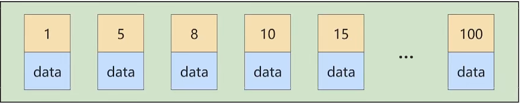

如果此时再插入一条主键值为 9 的记录，那它插入的位置就如下图：

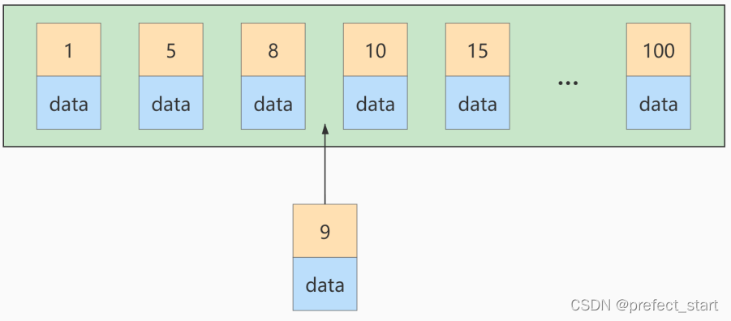

`页面分裂`和`记录移位`意味着： 性能损耗 ！所以如果我们应该尽量避免这样无谓的性能损耗，**最好让插入的记录的 主键值依次递增** ，这样就不会发生这样的性能损耗了。

建议：让**主键具有 AUTO_INCREMENT** ，让存储引擎自己为表生成主键，而不是我们手动插入  

## 2.4 计算、函数、类型转换(自动或手动)导致索引失效

### 2.4.1 函数导致的失效

```sql
## 创建索引
CREATE INDEX idx_name ON student(NAME);

## SQL 语句
# SQL 会使用索引
SELECT SQL_NO_CACHE * FROM student WHERE student.name LIKE 'abc%';
# SQL 不会使用索引，因为引入了函数，SQL会先执行函数，再进行筛选匹配
SELECT SQL_NO_CACHE * FROM student WHERE LEFT(student.name,3) = 'abc';
```

### 2.4.2  计算导致的失效

```sql
CREATE INDEX idx_sno ON student(stuno);

## SQL 不会使用索引，因为引入了计算
SELECT SQL_NO_CACHE id, stuno, NAME FROM student WHERE stuno+1 = 900001;
## SQL 会使用索引
SELECT SQL_NO_CACHE id, stuno, NAME FROM student WHERE stuno = 900000;
```

### 2.4.3  类型转换(自动或手动)导致索引失效

```sql
## 下面的 name 上有索引，但 name 是 varchar 类型, 发生了隐式类型转换，导致索引失效
SELECT SQL_NO_CACHE * FROM student WHERE name=123;
## 下面的索引有效
SELECT SQL_NO_CACHE * FROM student WHERE name='123';
```

## 2.5 范围条件右边的列索引失效

```sql
## classId 之后（右边）的索引都无法被使用，因为 classId 是一个范围条件
CREATE INDEX idx_age_classid_name ON student(age, classId, name);
EXPLAIN SELECT SQL_NO_CACHE * FROM student
WHERE student.age=30 AND student.classId>20 AND student.name = 'abc' ;

## 把范围条件放到索引的最后，这样整个联合索引都能用得到
CREATE INDEX idx_age_name_classid ON student(age, name, classId);
EXPLAIN SELECT SQL_NO_CACHE * FROM student
WHERE student.age=30 AND student.classId>20 AND student.name = 'abc' ;

## 调整 WHERE 语句中条件的顺序是无效的，因为都是AND，在优化器看来没有区别
```

## 2.6 不等于(!= 或者<>)索引失效  

`mysql` 在使用不等于(!= 或者<>)时，有时会无法使用索引会导致全表扫描。

## 2.7 is null可以使用索引，is not null无法使用索引

结论：最好在设计数据表的时候就将`字段设置为 NOT NULL 约束`，比如你可以将INT类型的字段，默认值设置为0。将字符类型的默认值设置为空字符串(‘’)

拓展：同理，在查询中使用`not like`也无法使用索引，导致全表扫描

## 2.8 like以通配符%开头索引失效

> 拓展：Alibaba《Java开发手册》
> 【强制】页面搜索严禁左模糊或者全模糊，如果需要请走搜索引擎来解决。  

## 2.9  OR 前后存在非索引的列，索引失效  

```sql
## OR 左右的列必须都存在索引，才会使用，否则进行全表查询
CREATE INDEX idx_age ON student(age);
CREATE INDEX idx_classid ON student(classid);

EXPLAIN SELECT SQL_NO_CACHE * FROM student WHERE age = 10 OR classid = 100;
```

## 2.10 数据库和表的字符集统一使用 `utf8mb4`

统一使用 `utf8mb4` ( 5.5.3版本以上支持)兼容性更好，**统一字符集**可以避免由于字符集转换产生的乱码。**不同的字符集** 进行**比较前需要进行隐式转换** 会**造成索引失效**。  

## 2.11 使用索引的建议

1. 对于**单列索引**，尽量选择针对当前query**过滤性更好的索引**。
2. 在选择**组合索引**的时候，当前query中**过滤性最好的字段**在索引字段顺序中，**位置越靠前**越好。
3. 在选择**组合索引**的时候，尽量选择能够**包含**当前query中的**where子句中更多字段的索引**。
4. 在选择**组合索引**的时候，如果某个字段可能出现**范围查询**时，尽量把**这个字段放在索引次序的最后面**。

# 三、关联查询优化

## 3.1 左外连接

在优化关联查询时，只有在**被驱动表**上**建立索引**才更有效，如果驱动表和被驱动表只能选择一个表创建索引，那么**优先选择**在**被驱动表**上**建立索引**。当然，两个表都加索引更好。

### 3.1.1 无索引情况，默认使用 `join buffer` 进行加速

```sql
EXPLAIN SELECT SQL_NO_CACHE * FROM `type` LEFT JOIN book ON type.card = book.card;
```

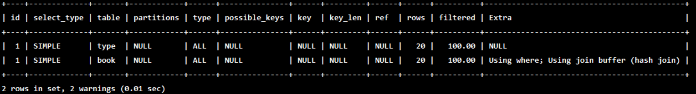

### 3.1.2 被驱动表添加索引

```sql
ALTER TABLE book ADD INDEX Y ( card); #【被驱动表】，可以避免全表扫描

EXPLAIN SELECT SQL_NO_CACHE * FROM `type` LEFT JOIN book ON type.card = book.card;
```

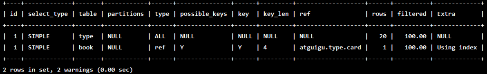

可以看到第二行的 type 变为了 ref，rows 也变成了优化比较明显。这是由左连接特性决定的。LEFT JOIN 条件用于确定如何从右表搜索行，因为**左边一定都有（是否有索引关系不大，因为都要全量数据）**，所以 **右边是我们的关键点,一定需要建立索引** 。  

### 3.1.3 驱动和被驱动表都添加索引

```sql
ALTER TABLE `type` ADD INDEX X (card); #【驱动表】，无法避免全表扫描
EXPLAIN SELECT SQL_NO_CACHE * FROM `type` LEFT JOIN book ON type.card = book.card;
```

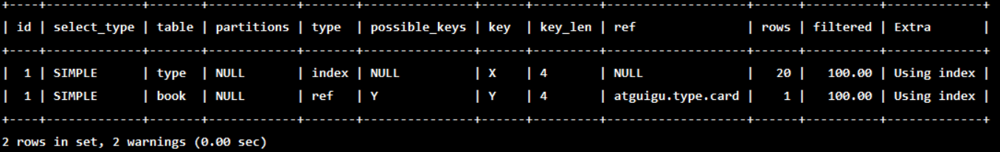

### 3.1.4  只有驱动表添加索引

```sql
DROP INDEX Y ON book;
EXPLAIN SELECT SQL_NO_CACHE * FROM `type` LEFT JOIN book ON type.card = book.card;
```

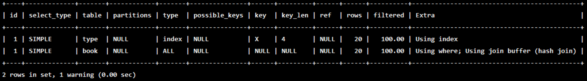

## 3.2 采用内连接  

内连接情况下，两个表在优化器看来是同等地位的。优化器会选择满足下属条件的表作为被驱动表，原则是整体的代价最小：

1. 有索引的优先成为被驱动表
2. 数据量大的优先成为被驱动表（小表驱动大表）
3. 如果都没有索引，且数据量相同，则会选择代价最小的方法。

### 3.2.1 都没有索引

```sql
EXPLAIN SELECT SQL_NO_CACHE * FROM type INNER JOIN book ON type.card=book.card;
```

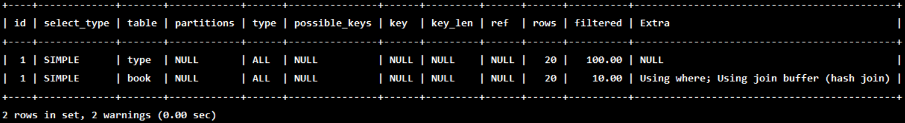

查询优化器可以决定谁来作为驱动表，谁作为被驱动表出现，原则是查询代价最小。

### 3.2.2 为其中一个表添加索引

```sql
ALTER TABLE book ADD INDEX Y ( card);
EXPLAIN SELECT SQL_NO_CACHE * FROM type INNER JOIN book ON type.card=book.card;
```

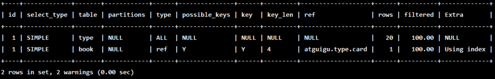

**有索引**的表将成为**被驱动表**

### 3.2.3 两个都有索引

```sql
ALTER TABLE type ADD INDEX X (card);
EXPLAIN SELECT SQL_NO_CACHE * FROM type INNER JOIN book ON type.card=book.card;
```

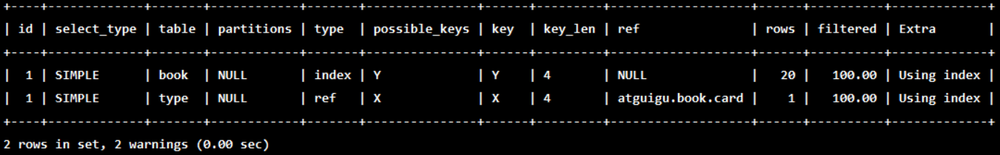

查询优化器可以决定谁来作为驱动表，谁作为被驱动表出现，原则是查询代价最小。

### 3.2.4  两个表数据量不一致的情况

比如像 `type` 表插入了 20 条数据，而 `book` 表没有数据。则选择 `book` 表作为驱动表， `type` 表作为被驱动表。称为**小表驱动大表原则**。

## 3.3 join语句原理   

`join` 方式连接多个表，本质就是**各个表**之间数据的**循环匹配**。`MySQL 5.5`版本之前，`MySQL`只支持一种**表间关联方式**，就是**嵌套循环( `Nested Loop Join` )**。如果**关联表的数据量很大**，则join关联的**执行时间会非常长**。在 `MySQL5.5` 以后的版本中，` MySQL` 通过引入 **`BNLJ` 算法**来**优化嵌套执行**。

### 3.3.1 Index Nested-Loop Join（索引嵌套循环连接）

算法相当简单，从表A中取出一条数据1，**遍历表B**，将匹配到的数据放到result…以此类推，**驱动表**A中的每一条记录与**被驱动表**B的所有记录进行判断:


可以看到这种方式效率是非常低的，以上述表A数据100条，表B数据1000条计算，则A*B= 10万次。开销统计如下:

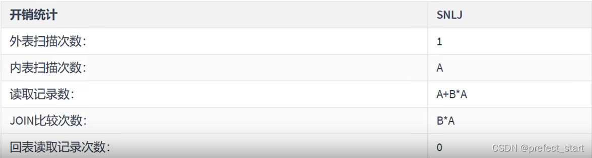

当然 `mysql` 肯定不会这么粗暴的去进行表的连接，所以就出现了**后面的两种 Nested-Loop Join 优化算法**。

### 3.3.2 Index Nested-Loop Join（索引嵌套循环连接）

`Index Nested-Loop Join` 其优化的思路主要是为了**减少内层表数据的匹配次数**，所以要求**被驱动表上必须有索引**才行。通过**外层表匹配条件**直接与**内层表索引**进行匹配，**避免和内层表的每条记录去进行比较**，这样极大的减少了对内层表的匹配次数。

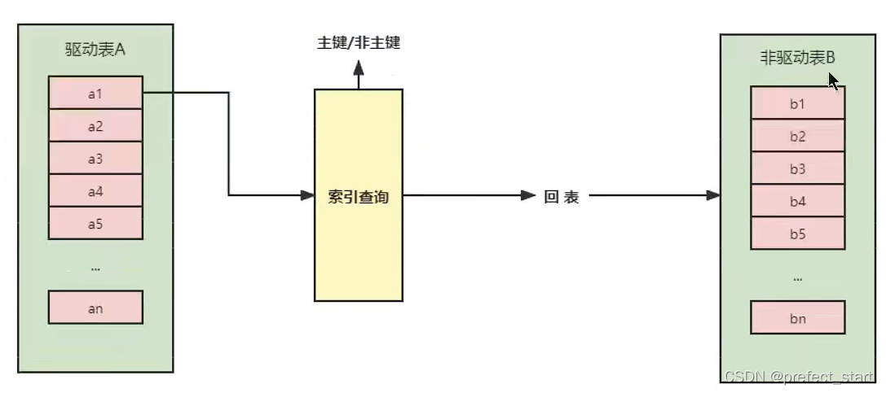

**驱动表**中的**每条记录**通过**被驱动表的索引**进行访问，因为索引查询的成本是比较固定的，故 `mysql` 优化器都倾向于使用**记录数少的表作为驱动表（外表)**。

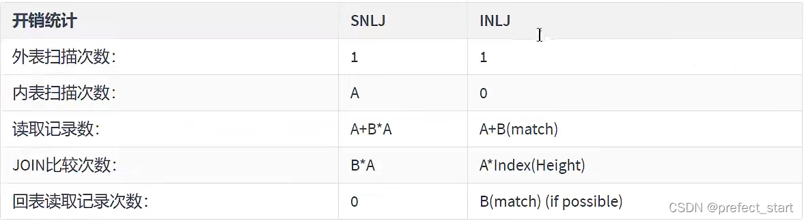

如果**被驱动表加索引，效率是非常高的**，但如果**索引不是主键索引**，所以还得**进行一次回表查询**。相比，被驱动表的索引是主键索引，效率会更高。

1. 内表扫描次数为0：内表不会进行扫描，而是通过内表的索引进行查询操作
2. 读取记录数为 `A + B(match)`：内表只会通过索引找到对应的 B 条记录
3. `JOIN` 比较次数为 `A*Index(Height)`：外表的每一条数据都会内表索引指定的数据进行比较，而内表的一条数据最多查询的代价是固定的，就是 B+ 树的高度。
4. 回表读取次数为 `B(match)`：如果`SELECT`查询的数据不包含在索引B+树中，还需要进行回表进行读取。

### 3.3.3 Block Nested-Loop Join（块嵌套循环连接）

如果存在索引，那么会使用index的方式进行join，如果join的列**没有索引**，**被驱动表要扫描的次数太多**了。

每次访问**被驱动表**，其表中的**记录都会被加载到内存中**，然后再从**驱动表**中取一条与其匹配，**匹配结束后清除内存**，然后再从驱动表中加载一条记录，然后把被驱动表的记录在加载到内存匹配，这样**周而复始**，**大大增加了IO的次数**。

为了减少被驱动表的IO次数，就出现了Block Nested-Loop Join的方式。

不再是逐条获取**驱动表**的数据，而是**一块一块的获取**，引入了**join buffer缓冲区**，将**驱动表join相关的部分数据列**(大小受join buffer的限制)**缓存到join buffer中**，然后**全表扫描被驱动表**。

**被驱动表**的**每一条记录**一次性和**join buffer**中的**所有驱动表记录**进行**匹配**(内存中操作)，将简单嵌套循环中的**多次比较合并成一次**，降低了被驱动表的访问频率。

注意：这里**缓存的不只是关联表的列**，**select后面的列也会缓存起**来。在一个有**N个join关联**的 `sql` 中会分配**N-1个join buffer**。

所以查询的时候**尽量减少不必要的字段（最好不要 select * from）**，可以让join buffer中可以**存放更多的列**。

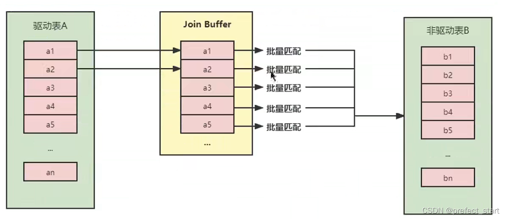

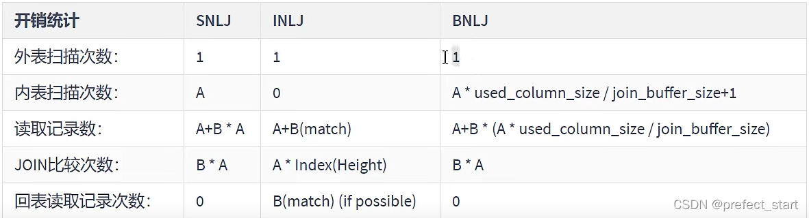

1. 内表扫描次数为 `A * used_column_size / join_buffer_size + 1`：`A * used_column_size` 是外表总的查询数据量，平均到 `join buffer` 的次数就是：`A * used_column_size / join_buffer_size` 

2. 读取记录数：外表的总记录数就是 A ，内表的总记录数 = B*查询次数
3. `JOIN` 比较次数：因为没有索引，外表的每条记录都要和内表的每条记录进行比较。
4. 回表记录读取数：因为没有使用索引的 B+ 树，而是对整个表进行比较，因此没有回表一说。

### 3.3.4 Hash Join

**从 `MySQL` 的 `8.0.20` 版本开始将废弃 `BNLJ` ，因为从 `MySQL 8.0.18` 版本开始就加入了 `hash join` 默认都会使用 `hash join`**

Nested Loop：对于被连接的**数据子集较小**的情况下，Nested Loop是个较好的选择。

Hash Join：是做**大数据集**连接时的常用方式，优化器使用两个表中**较小（相对较小）的表**利用 `Join Key` 在**内存**中建立**散列值**，然后**扫描较大的表**并**探测散列值**，找出**与Hash表匹配的行**。   

1. 这种方式适用于**较小的表**完全可以放入内存中的情况，这样总成本就是**访问两个表的成本之和**。
2. 在**表很大**的情况下并**不能完全放入内存**，这时**优化器会**将它**分割**成若干不同的**分区**，不能放入内存的部分就把该分区写入磁盘的临时段，此时要求有较大的临时段从而尽量提高I/O的性能。
3. 它能够很好的工作于**没有索引的大表**和**并行查询**的环境中，并提供最好的性能。`Hash Join` **只能应用于等值连接**，这是由Hash的特点决定的。

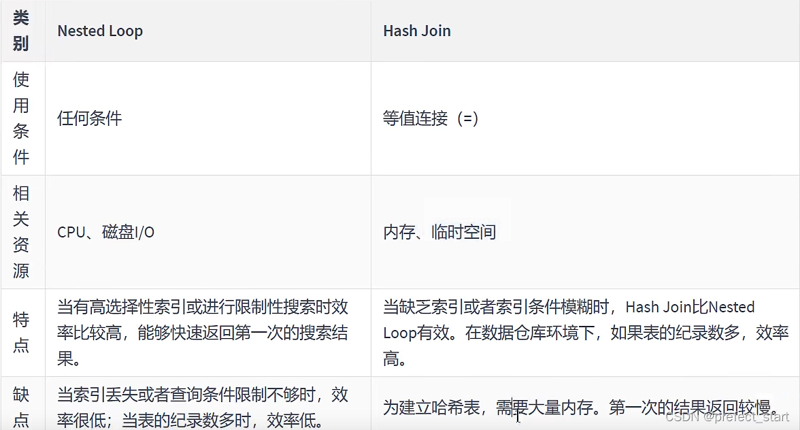

### 3.3.5 小结

- 整体效率比较: INLJ > BNLJ > SNLJ。

- 增大 `join buffer size` 的大小(一次缓存的数据越多，那么内层包的扫表次数就越少)。

- **减少驱动表不必要的字段查询**(字段越少，join buffer所缓存的数据就越多)。

- 保证**被驱动表的JOIN字段已经创建了索引**。

- 需要JOIN的字段，**数据类型保持绝对一致(隐式的类型转换将破坏索引)**。

- LEFT JOIN时，选择**小表作为驱动表，大表作为被驱动表**。减少外层循环的次数。表大小的度量方式是：**表的行数 * 每行的数据量**

  ```sql
  ## t1驱动表，t2被驱动表。 推荐的方式
  select t1.b, t2.* from t1 straight_join t2 on t1.b=t2.b where t2.id <=100
  ## t2驱动表，t1被驱动表。不推荐的方式
  select t1.b, t2.* from t2 straight_join t1 on t1.b=t2.b where t2.id <=100
  
  ## t2要显示全部数据，t1只显示b列的数据，因此从数据量上来说,t1表更小，join buffer 中可以存储更多的行数。
  ```

  

- INNER JOIN时，`MySQL` 会自动将小结果集的表选为驱动表。选择相信 `MySQL` 优化策略。

- **能够直接多表关联的尽量直接关联，不用子查询**。(减少查询的趟数)。

- **不建议使用子查询**，建议将子查询SQL拆开结合程序多次查询，或使用JOIN来代替子查询。

- **衍生表建不了索引**，**减少衍生表的使用**。

# 四、子查询优化

`MySQL` 从 `4.1` 版本开始支持子查询，使用子查询可以进行`SELECT` 语句的嵌套查询，即一个 `SELECT` 查询的结果作为另一个SELECT语句的条件。 子查询可以一次性完成很多逻辑上需要多个步骤才能完成的 `SQL` 操作。

子查询是 `MySQL` 的一项重要的功能，可以帮助我们通过一个`SQL` 语句实现比较复杂的查询。但是，**子查询的执行效率不高**。

**原因：**

- 执行子查询时，`MySQL` 需要为**内层查询语句**的**查询结果**建立一个**临时表**，然后**外层查询语句从临时表中查询记录**。查询完毕后，再**撤销这些临时表**。这样会消耗过多的CPU和IO资源，产生大量的慢查询。
- 子查询的结果集存储的临时表，**不论是内存临时表还是磁盘临时表**都**不会存在索引**，所以查询性能会受到一定的影响。
- 对于返回结果集比较大的子查询，其对查询性能的影响也就越大。

在 `MySQL`中，可以**使用连接（JOIN）查询来替代子查询**。连接查询**不需要建立临时表**，其速度比子查询要快，如果**查询中使用索**引的话，**性能就会更好**。

> 结论：尽量不要使用 `NOT IN` 或者 `NOT EXISTS`，用`LEFT JOIN xxx ON xx WHERE xx IS NULL` 替代

如下：

```sql
## 查询班级中班长的学生信息
SELECT a.* FROM student a WHERE a.stuno IN (
	SELECT moniter FROM class b
    WHERE moniter IS NOT NULL
)
### 表连接方式(内连接 + IS NOT NULL)
SELECT a.* FROM student a JOIN class b
ON a.stuno = b.moniter
WHERE b.moniter IS NOT NULL;

## 查询班级中不为班长的学生信息
### 子查询方式
SELECT a.* FROM student a WHERE a.stuno NOT IN (
	SELECT moniter FROM class b
    WHERE moniter IS NOT NULL
)
### 表连接方式(左外连接 + IS NULL)
SELECT a.* FROM student a LEFT JOIN class b
ON a.stuno = b.moniter
WHERE b.moniter IS NULL;
```

# 五、排序优化

## 5.1 排序优化

`SQL` 中，可以在 **WHERE 子句**和 **ORDER BY 子句**中使用**索引**，目的是在 **WHERE子句**中 **避免全表扫描** ，在 **ORDER BY 子句** 中**避免使用 `FileSort` 排序** 。当然，**某些情况下**全表扫描，或者 FileSort 排序**不一定比索引慢**。但总的来说，我们还是要避免，以提高查询效率。  

尽量使用 索引 完成 ORDER BY 排序。如果 **WHERE** 和 **ORDER BY** 后面是**相同的列**就使用**单索引列**；如果**不同**就使用**联合索引**。  

无法使用 索引 时，需要**对 `FileSort` 方式进行调优**。  

### 5.1.1 过程一

```sql
create index idx_age_cid_name on student(age, classid, name);

## 不会使用索引，原因是：使用了select * 去查询所有的字段。由于联合索引只包含了三个字段，因此即使使用了索引，仍需要在查询完每一条数据后通过回表操作查询剩下的字段。代价过高，不如直接将数据读取到内存中，一次性完成排序。
explain select * from student order by age,classid;

## 只显示排序的字段，可以使用索引
explain select age,classid from student order by age,classid;

## 增加了limit过滤条件，也可以使用索引
explain select * from student order by age,classid limit 10;
```

### 5.1.2 过程二

```sql
create index idx_age_cid_stuno on student(age, classid, stuno);
## 索引失效，联合索引遵循最左前缀匹配原则
explain select * from student order by classid limit 10; 
## 失效，理由同上
explain select * from student order by classid,name limit 10; 
##  生效
explain select * from student order by age,classid,name limit 10; 
## 生效
explain select * from student order by age,classid limit 10; 
## 失效
explain select * from student order by age,name limit 10; 
## 生效
explain select * from student order by age,limit 10; 
```

### 5.1.3 过程三

```sql
create index idx_age_cid_name on student(age, classid, name);

## 失效，因为age的降序
explain select * from student order by age desc, classid asc limit 10;
## 生效，age和classid都降序，优化器就会反向(backward)使用索引
explain select * from student order by age desc, classid desc limit 10;
## 失效，中间跳过了classid，不遵循最左前缀匹配原则
explain select * from student order by age desc, name desc limit 10;
## 失效，因为classid是降序的
explain select * from student order by age asc, classid desc limit 10;
```

### 5.1.4 过程四

```sql
create index idx_age_cid_name on student(age, classid, name);

## 只会使用到联合索引的age，不会使用后面的索引字段。原因是：age=45已经过滤掉大部分的数据，优化器认为直接将过滤后的数据直接读取到内存中进行filesort代价更小，如果直接使用联合索引可能还需要回表操作
explain select * from student where age=45 order by classid;

## 下面这个就会用到联合索引的前两个字段。因为我们只读取age和classid两个字段，联合索引的B+树中已经存在，不需要进行回表
explain select age,classid from student where age=45 order by classid;

## 下面的同样也不会使用classid和name上的索引
explain select * from student where age=45 order by classid, name;

## 下面这个会用到联合索引的age和classid，原因是：经过优化器的优化之后，下面这条语句会先去按照age进行排序，然后再找到classid=45的数据，从中选出10条进行返回
explain select * from student where classid=45 order by age limit 10;

## 不会使用，因为classid=45的数据项可能会很多，优化器考虑到代价问题，不会选用索引。不如先找出所有classid=45的所有数据项，然后在内存中进行排序
explain select * from student where classid=45 order by age;
```

### 5.1.5 总结

```sql
INDEX a_b_c(a,b,c)
order by 能使用索引最左前缀
- ORDER BY a
- ORDER BY a,b
- ORDER BY a,b,c
- ORDER BY a DESC,b DESC,c DESC
如果WHERE使用索引的最左前缀定义为常量，则order by 能使用索引
- WHERE a = const ORDER BY b,c
- WHERE a = const AND b = const ORDER BY c
- WHERE a = const ORDER BY b,c
- WHERE a = const AND b > const ORDER BY b,c
不能使用索引进行排序
- ORDER BY a ASC,b DESC,c DESC /* 排序不一致 */
- WHERE g = const ORDER BY b,c /*丢失a索引*/
- WHERE a = const ORDER BY c /*丢失b索引*/
- WHERE a = const ORDER BY a,d /*d不是索引的一部分*/
- WHERE a in (...) ORDER BY b,c /*对于排序来说，多个相等条件也是范围查询*/
```

## 5.2 案例实战

ORDER BY子句，尽量使用Index方式排序，避免使用FileSort方式排序。

场景:查询年龄为30岁的，且学生编号小于101000的学生，按用户名称排序  

```sql
EXPLAIN SELECT SQL_NO_CACHE * FROM student WHERE age = 30 AND stuno <101000 ORDER BY NAME;
```

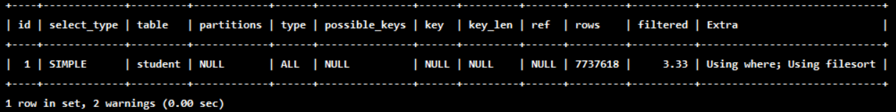

结论：type 是 ALL，即最坏的情况。Extra 里还出现了 `Using filesort`，也是最坏的情况。优化是必须的。  

优化思路：  

方案一: 为了去掉 `filesort` 我们可以建立索引

```sql
#创建新索引
CREATE INDEX idx_age_name ON student(age,NAME);
```

方案二: 尽量让where的过滤条件和排序使用上索引  

```sql
CREATE INDEX idx_age_stuno_name ON student (age,stuno,NAME);
## 根据数据量的不同，可能有时不会使用name的索引（当根据age和stuno这两个索引已经过滤掉大部分数据时）
## 而且这里也没有用idx_age_name 索引，而是使用了idx_age_stuno_name索引。
EXPLAIN SELECT SQL_NO_CACHE * FROM student WHERE age = 30 AND stuno <101000 ORDER BY NAME ;
```


结论：

1. 两个索引同时存在，`mysql` **自动选择最优的方案**。（对于这个例子，`mysql` 选择 `idx_age_stuno_name`）。但是， **随着数据量的变化，选择的索引也会随之变化的** 。
2. 当【范围条件】和【group by 或者 order by】的字段出现二选一时，**优先观察条件字段的过滤数量**，如果**过滤掉的数据足够多**，使得**剩余需要排序的数据并不多**时，**优先把索引放在范围字段上**。反之，亦然。  

## 5.3 `filesort` 算法：双路排序和单路排序

### 5.3.1 介绍

 `filesort` 有两种算法：双路排序和单路排序

- 双路排序（慢）：`MySQL 4.1`之前是使用双路排序，字面意思就是**两次扫描磁盘**，最终得到数据。

  - 第一次磁盘：扫描读取行指针和order by列，读取到内存的buffer中后对他们进行排序。如果**仅查询`order by`列**，那么这里就可以取出后结束了，如果**还需要其他的列**，那么需要进行第二次扫描。

  - 第二次扫描：根据buffer中已经完成排序的数据集合，再从磁盘取**其他字段**。

```
取一批数据，要对磁盘进行两次扫描，众所周知，IO是很耗时的，所以在 mysq 4.1之后，出现了第二种改进的算法，就是单路排序。
```

- 单路排序（快)：从磁盘**一次性读取查询需要的所有列**，**按照order by列在buffer对它们进行排序**，然后扫描排序后的列表进行输出，它的效率更快一些，避免了第二次读取数据。并且把随机 `IO` 变成了顺序 `IO`，但是它**会使用更多的空间**，因为它把每一行都保存在内存中了

### 5.3.2 结论及引申出的问题

- 由于单路是后出的，总体而言好过双路。但是**用单路有问题**。
- 在sort_buffer中，**单路比多路要多占用很多空间**，因为单路是把**所有字段**都取出，所以有可能**取出的数据的总大小超出了sort_buffer的容量**，导致**每次只能取sort_buffer容量大小的数据，进行排序**（创建 `tmp` 文件，多路合并)，**排完再取sort_buffer容量大小，再排…从而多次I/O。**单路本来想省一次IO操作，反而导致了大量的IO操作，反而得不偿失。

### 5.3.3 优化策略

1. 尝试**提高 `sort_buffer_size`**

不管用哪种算法，提高这个参数都会提高效率，要根据系统的能力去提高，因为这个参数是**针对每个进程(connection)的 `1M-8M` 之间调整**。`MySQL5.7` ，`InnoDB` 存储引擎默认值是 `1MB`

```sql
SHOW VARIABLES LIKE ' %sort_buffer 'size%';
```

2. 尝试**提高 `max_length_for_sort_data`**

提高这个参数，会**增加用改进算法的概率**。

如果**需要返回的列的总长度**大于 `max_length_for_sort_data`，使用**双路算法**，否则使用**单路算法**。

```sql
SHOW VARIABLES LIKE ' %max_length_for_sort_data% ' ; #默认1024字节
```

3. Order by 时select * 是一个大忌。最好只Query需要的字段。

- 当Query的**字段大小总和小于max_length_for_sort_data**，而且**排序字段不是TEXT|BLOB类型**时，**会用**改进后的算法―—**单路排序**，否则用老算法――多路排序。
- 两种算法的数据都有可能超出 `sort_buffer_size` 的容量，超出之后，会创建 `tmp` 文件进行**合并排序**，导致**多次IO**，但是**用单路排序算法的风险会更大一些**，所以要提高sort_buffer_size。