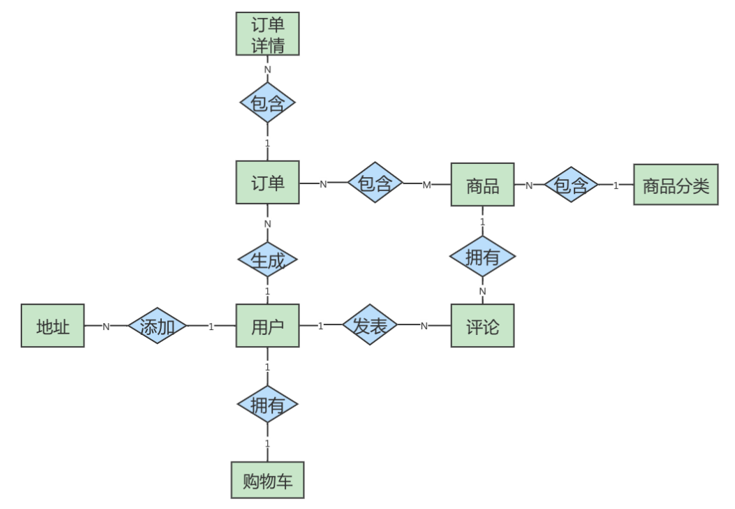

# 一、数据库设计范式

## 1.1  范式简介

**在关系型数据库中，关于数据表设计的基本原则、规则就称为范式。** 可以理解为，一张数据表的设计结构需要满足的某种设计标准的`级别`。要想设计一个结构合理的关系型数据库，必须满足一定的范式。

## 1.2  范式都包括哪些

目前关系型数据库有六种常见范式，按照范式级别，从低到高分别是：**第一范式（`1NF`）、第二范式（`2NF`）、第三范式（`3NF`）、巴斯-科德范式（`BCNF`）、第四范式(`4NF`）和第五范式（`5NF`，又称完美范式）**。

数据库的范式设计**越高阶，冗余度就越低**，同时**高阶的范式一定符合低阶范式的要求**，满足最低要求的范式是第一范式（`1NF`)。在第一范式的基础上进一步满足更多规范要求的称为第二范式 (`2NF)`，其余范式以次类推。

一般来说，在关系型数据库设计中，**最高也就遵循到 `BCNF`，普遍还是`3NF`**。但也不绝对，有时候为了**提高某些查询性能**，我们还需要**破坏范式规则，也就是反规范化**。


## 1.3  键和相关属性的概念

范式的定义会使用到**主键**和**候选键**，数据库中的**键(Key)由一个或者多个属性组成**。数据表中常用的几种键和属性的定义:

- 超键:能**唯一标识元组(一行数据)**的**属性集**叫做超键。
- 候选键:如果超键**不包括多余的属性**，那么这个**超键**就是候选键。
- 主键:用户可以从**候选键中选择一个作为主键**。
- 外键:如果数据表 `R1 `中的某属性集不是 `R1` 的主键，而是**另一个数据表 `R2` 的主键**，那么这个属性集就是数据表 **`R1` 的外键**。
- 主属性:包含在任一**候选键中的属性称为主属性**。
- 非主属性:与主属性相对，指的是**不包含在任何一个候选键中的属性**。

通常，我们也将**候选键称之为“码”**，把**主键也称为“主码”**。因为**键可能是由多个属性组成**的，针对**单个属性**，我们还可以用**主属性**和**非主属性**来进行区分。

这里有两个表：

球员表(player)：球员编号 | 姓名 | 身份证号 | 年龄 | 球队编号

球队表(team)：球队编号 | 主教练 | 球队所在地

- 超键：对于**球员表**来说，超键就是**包括球员编号或者身份证号的任意组合**，比如（球员编号）（球员编号，姓名）（身份证号，年龄）等。
- 候选键：就是**最小的超键**，对于**球员表**来说，候选键就是**（球员编号）或者（身份证号）**。
- 主键：我们自己选定，也就是**从候选键中选择一个**，比如（球员编号）。
- 外键：球员表中的球队编号。
- 主属性、非主属性：在球员表中，主属性是（球员编号）（身份证号），其他的属性（姓名）（年龄）（球队编号）都是非主属性。

## 1.4  第一范式(1st NF)

第一范式主要是确保数据表中**每个字段的值必须具有原子性**，也就是说数据表中**每个字段的值为`不可再次拆分`的最小数据单位**。

我们在**设计某个字段**的时候，对于字段x来说，**不能把字段×拆分成字段 `x1` 和字段 `x2`**。事实上任何的 DBMS都会满足第一范式的要求，不会将字段进行拆分。

**举例1**：

假设一家公司要存储员工的姓名和联系方式。它创建一个如下表：  


该表不符合 `1NF` ，因为规则说“表的每个属性必须具有原子（单个）值”，**`lisi` 和 `zhaoliu` 员工的 `emp_mobile` 值违反了该规则(这两个人都有两个电话号码)**。为了使表符合 `1NF` ，我们应该有如下表数据：  


**举例2**：

user 表的设计不符合第一范式  

| 字段名称  | 字段类型     | 是否是主键 | 说明                                |
| --------- | ------------ | ---------- | ----------------------------------- |
| id        | INT          | 是         | 主键id                              |
| username  | VARCHAR(30)  | 否         | 用户名                              |
| password  | VARCHAR(50)  | 否         | 密码                                |
| user_info | VARCHAR(255) | 否         | 用户信息 (包含真实姓名、电话、住址) |

其中，**user_info字段为用户信息**，**可以进一步拆分成更小粒度的字段**，**不符合数据库设计对第一范式的要求**。将user_info拆分后如下：  

| 字段名称  | 字段类型     | 是否是主键 | 说明     |
| --------- | ------------ | ---------- | -------- |
| id        | INT          | 是         | 主键id   |
| username  | VARCHAR(30)  | 否         | 用户名   |
| password  | VARCHAR(50)  | 否         | 密码     |
| real_name | VARCHAR(30)  | 否         | 真实姓名 |
| phone     | VARCHAR(12)  | 否         | 联系电话 |
| address   | VARCHAR(100) | 否         | 家庭住址 |

**举例3**：  

**属性的原子性是主观的** 。例如，Employees关系中雇员姓名应当使用1个（`fullname`）、2个（ `firstname` 和 `lastname` ）还是3个（ `firstname`、`middlename` 和 `lastname`）属性表示呢？**答案取决于应用程序**。如果应用程序需要分别处理雇员的姓名部分（如：用于搜索目的），则有必要把它们分开。否则，不需要。  

表1：

| 姓名 | 年龄 | 地址                   |
| ---- | ---- | ---------------------- |
| 张三 | 20   | 广东省广州市三元里78号 |
| 李四 | 24   | 广东省深圳市龙华新区   |

表2：

| 姓名 | 年龄 | 省   | 市   | 地址       |
| ---- | ---- | ---- | ---- | ---------- |
| 张三 | 20   | 广东 | 广州 | 三元里78号 |
| 李四 | 24   | 广东 | 深圳 | 龙华新区   |

## 1.5 第二范式(2nd NF)

第二范式要求，在**满足第一范式的基础上**，还要满足数据表里的每一条数据记录，都是可唯一标识的。而且**所有非主键字段，都必须完全依赖主键，不能只依赖主键的一部分**，如果知道主键的所有属性的值，就可以检索到任何元组（行）的任何属性的任何值。

**举例1**：

成绩表 （学号，课程号，成绩）关系中，**（学号，课程号）可以决定成绩**，但是**学号不能单独决定成绩**，**课程号也不能单独决定成绩**，所以**（学号，课程号）→成绩**  就是 **完全依赖关系** 。  

**举例2**：

比赛表 player_game ，里面包含**球员编号、姓名、年龄、比赛编号、比赛时间和比赛场地**等属性，这里**候选键和主键都为（球员编号，比赛编号）**，我们可以通过候选键（或主键）来决定如下的关系：  

```
(球员编号, 比赛编号) → (姓名, 年龄, 比赛时间, 比赛场地，得分)  
```

但是这个数据表**不满足第二范式**，因为数据表中的字段之间还存在着如下的对应关系：  

```
(球员编号) → (姓名，年龄)
(比赛编号) → (比赛时间, 比赛场地)
```

对于**非主属性**来说，**并非完全依赖候选键**。这样**会产生怎样的问题**呢？  

1. **数据冗余** ：如果一个球员可以参加 m 场比赛，那么球员的姓名和年龄就重复了 m-1 次。一个比赛也可能会有 n 个球员参加，比赛的时间和地点就重复了 n-1 次。
2.  **插入异常** ：如果我们想要**添加一场新的比赛**，但是这时**还没有确定参加的球员都有谁**，那么就没法插入。
3. **删除异常** ：如果我要**删除某个球员编号**，如果**没有单独保存比赛表**的话，就会**同时把比赛信息删除掉**。
4. **更新异常** ：如果我们**调整了某个比赛的时间**，那么数据表中**所有参加这个比赛的球员的参加时间都需要进行调整**，否则就会出现一场比赛时间不同的情况。  

为了避免出现上述的情况，我们可以把**球员比赛表**设计为**下面的三张表**。  

| 表名                        | 属性（字段）                       |
| --------------------------- | ---------------------------------- |
| 球员 player 表              | 球员编号、姓名和年龄等属性         |
| 比赛 game 表                | 比赛编号、比赛时间和比赛场地等属性 |
| 球员比赛关系 player_game 表 | 球员编号、比赛编号和得分等属性     |

这样的话，每张数据表都符合第二范式，也就避免了异常情况的发生。  

> 1NF 告诉我们字段属性需要是**原子性的**，而 2NF 告诉我们**一张表就是一个独立的对象**，一张表只表达一个意思。  

**举例3**：

定义了一个名为 Orders 的关系，表示订单和订单行的信息：  （qty表示卖出数量）


**违反了第二范式**，因为有非主键属性仅依赖于候选键（或主键）的一部分。例如，可以**仅通过 `orderid` 找到订单的 `orderdate`，以及 `customerid` 和 `companyname`**，而没有必要再去使用 `productid`。  

**修改**：  

`Orders` 表和 `OrderDetails` 表如下，此时符合第二范式。  


## 1.6 第三范式(3rd NF)

第三范式是在**第二范式的基础上**，确保数据表中的**每一个非主键字段都和主键字段直接相关**，也就是说，要求数据表中的**所有非主键字段不能依赖于其他非主键字段**。

即，不能存在非主属性A依赖于非主属性B，非主属性B依赖于主键C的情况，即存在"A–>B–>C"的决定关系。通俗地讲，该规则的意思是**所有非主键属性之间不能有依赖关系，必须相互独立**。

**举例1**：

**部门信息表** ：每个部门有部门编号（dept_id）、部门名称、部门简介等信息。

**员工信息表** ：每个员工有员工编号、姓名、部门编号。**列出部门编号后就不能再将部门名称、部门简介等与部门有关的信息再加入员工信息表**中。

**如果不存在部门信息表**，则根据第三范式（3NF）也应该构建它，否则**就会有大量的数据冗余**。  

**举例2**：

| 字段名称      | 字段类型      | 是否是主键 | 说明                |
| ------------- | ------------- | ---------- | ------------------- |
| id            | INT           | 是         | 商品主键id （主键） |
| category_id   | INT           | 否         | 商品类别id          |
| category_name | VARCHAR(30)   | 否         | 商品类别名称        |
| goods_name    | VARCHAR(30)   | 否         | 商品名称            |
| price         | DECIMAL(10,2) | 否         | 商品价格            |

**商品类别名称**依赖于**商品类别编号**，**不符合第三范式**。  

修改：  

表1：符合第三范式的 **商品类别表** 的设计  

| 字段名称      | 字段类型    | 是否是主键 | 说明           |
| ------------- | ----------- | ---------- | -------------- |
| category_id   | INT         | 是         | 商品类别主键id |
| category_name | VARCHAR(30) | 否         | 商品类别名称   |

表2：符合第三范式的 **商品表** 的设计  

| 字段名称    | 字段类型      | 是否是主键 | 说明       |
| ----------- | ------------- | ---------- | ---------- |
| id          | INT           | 是         | 商品主键id |
| category_id | VARCHAR(30)   | 否         | 商品类别id |
| goods_name  | VARCHAR(30)   | 否         | 商品名称   |
| price       | DECIMAL(10,2) | 否         | 商品价格   |

商品表 `goods` 通过商品类别id字段（category_id）与商品类别表 `goods_category` 进行关联。  

**举例3** ：

**球员player表** ：球员编号、姓名、球队名称和球队主教练。现在，我们把属性之间的依赖关系画出来，如下图所示：  


你能看到球员编号决定了球队名称，同时**球队名称决定了球队主教练**，非主属性球队主教练就会传递依赖于球员编号，因此**不符合 3NF 的要求**。

如果要达到 3NF 的要求，需要把数据表拆成下面这样：  

| 表名   | 属性（字段）             |
| ------ | ------------------------ |
| 球员表 | 球员编号、姓名和球队名称 |
| 球队表 | 球队名称、球队主教练     |

**举例4**：

修改第二范式中的举例3。

此时的Orders关系包含 `orderid`、`orderdate`、`customerid` 和 `companyname` 属性，主键定义为 `orderid`。

`customerid` 和 `companyname` 均依赖于主键—— `orderid`。例如，你需要通过`orderid`主键来查找代表订单中客户的 `customerid` ，同样，你需要通过 `orderid` 主键查找订单中客户的公司名称（ `companyname`）。

然而， **`customerid` 和 `companyname` 也是互相依靠**的。为满足第三范式，可以改写如下：  


## 1.7 三范式小结

1. 第一范式（`1NF`），确保**每列保持原子性**。数据库的每一列都是不可分割的原子数据项，不可再分的最小数据单元，而不能是集合、数组、记录等非原子数据项。
2. 第二范式（`2NF`），确保**每列都和主键完全依赖**。尤其在复合主键的情况向下，**非主键部分不应该依赖于部分主键**。
3. 第三范式（`3NF`），确保**每列都和主键直接相关**，而不是间接相关

- 范式的优点： 数据的标准化有助于**消除数据库中的数据冗余**，**第三范式（3NF）**通常被认为在性能、拓展性和数据完整性方面达到了最好的平衡。

- 范式的缺点： 范式的使用，**可能降低查询的效率**。因为**范式等级越高**，设计出来的**数据表就越多、越精细**，数据的冗余度就越低，进行数据查询的时候就**可能需要关联多张表**，这不但**代价昂贵**，也可能**使一些索引策略无效**。

范式只是提出了设计的标准，实际上设计数据表时，**未必一定要符合这些标准**。开发中，我们会出现**为了性能和读取效率违反范式化的原则**，通过**增加少量的冗余**或**重复的数据**来提高数据库的**读性能**，减少关联查询，join表的次数，实现**空间换取时间**的目的。因此在实际的设计过程中要理论结合实际，灵活运用。

## 1.8 反范式化

### 1.8.1  概述

有的时候不能简单按照规范要求设计数据表，因为**有的数据看似冗余，其实对业务来说十分重要**。这个时候，我们就要**遵循业务优先的原则**，首先满足业务需求，再尽量减少冗余。

如果数据库中的数据量比较大，系统的UV和PV访问频次比较高，则完全按照MySQL的三大范式设计数据表，读数据时会**产生大量的关联查询**，在一定程度上会**影响数据库的读性能**。如果我们想对查询效率进行优化，反范式优化也是一种优化思路。此时，可以通过在数据表中**增加冗余字段来提高数据库的读性能**。

**规范化** **vs** **性能**

1. 为满足某种商业目标 , 数据库性能比规范化数据库更重要
2. 在数据规范化的同时 , 要综合考虑数据库的性能
3. 通过在给定的表中添加额外的字段，以大量减少需要从中搜索信息所需的时间
4. 通过在给定的表中插入**计算列**，以方便查询

### 1.8.2 应用举例  

**举例一：**

**员工的信息**存储在 `employees` 表中，**部门信息**存储在 `departments` 表中。通过 `employees` 表中的 `department_id` 字段与 `departments` 表建立关联关系。如果要**查询一个员工所在部门的名称**：  

```sql
select employee_id,department_name
from employees e join departments d
on e.department_id = d.department_id;
```

如果**经常需要进行这个操作**，**连接查询就会浪费很多时间**。可以在 employees 表中**增加一个冗余字段 `department_name`**，这样就**不用每次都进行连接操作**了。  

**举例二：**

反范式化的 `goods` 商品信息表 设计如下：  

| 字段名称      | 字段类型      | 是否是主键 | 说明            |
| ------------- | ------------- | ---------- | --------------- |
| id            | INT           | 是         | 商品id （主键） |
| category_id   | VARCHAR(30)A  | 否         | 商品类别id      |
| category_name | VARCHAR(30)   | 否         | 商品类别名称    |
| goods_name    | VARCHAR(30)   | 否         | 商品名称        |
| price         | DECIMAL(10,2) | 否         | 商品价格        |

按照第三范式，不应该使用`category_name `字段，但因为需要频繁查询商品类别名称，因此反范式化引入了`category_name `字段。

**举例三：**

我们有 2 个表，分别是 商品流水表（ `atguigu.trans` ）和 商品信息表
（`atguigu.goodsinfo`） 。商品流水表里有 400 万条流水记录，商品信息表里有 2000 条商品记录。  

**商品流水表：**  


**商品信息表：**  


**新的商品流水表(频繁查询商品名称)**如下所示：  


### 1.8.3  反范式的新问题  

- 需要的存储 **空间变大** 了
- 一个表中字段做了修改，**另一个表**中冗余的字段也需要**做同步修改**，否则 **数据不一致**
- 若采用存储过程来支持数据的更新、删除等额外操作，如果**更新频繁**，会**非常消耗系统资源**
- 在 **数据量小** 的情况下，**反范式不能体现性能的优势**，可能还会让数据库的设计更加 **复杂**  

### 1.8.4  反范式的适用场景  

当**冗余信息有价值**或者能 **大幅度提高查询效率** 的时候，我们才会采取反范式的优化  。

#### 1.8.4.1 增加冗余字段的建议

- 这个冗余字段**不需要经常进行修改**
- 这个冗余字段**查询的时候不可或缺**

#### 1.8.4.2  历史快照、历史数据的需要

在现实生活中，我们经常**需要一些冗余信息**，比如**订单中的收货人信息**，包括**姓名、电话和地址**等。每次发生的**订单收货信息**都属于**历史快照**，需要进行保存，但**用户可以随时修改自己的信息**，这时**保存这些冗余信息是非常有必要的（作为证据）**。

反范式优化也常用在**数据仓库**的设计中，因为**数据仓库通常存储历史数据**，**对增删改的实时性要求不强**，对历史数据的**分析需求强**。这时适当允许数据的冗余度，更方便进行数据分析。

## 1.9 `BCNF` (巴斯范式)

人们在 `3NF` 的基础上进行了改进，提出了巴斯范式( `BCNF`)，也叫做巴斯-科德范式( `Boyce-Codd NormalForm` )。`BCNF` 被认为没有新的设计规范加入，只是对第三范式中设计规范要求更强，使得数据库冗余度更小。所以，称为是**修正的第三范式**，或**扩充的第三范式**，`BCNF` 不被称为第四范式。

若一个关系**达到了第三范式**，并且它**只有一个候选键**，或者它的**每个候选键都是单属性**，则该关系自然**达到 `BC`范式**。一般来说，一个数据库设计符合 `3NF`或 `BCNF` 就可以了。

**主属性（仓库名）对于候选键（管理员，物品名）是部分依赖的关系（仓库名和管理员相互决定），这样就有可能导致异常情况**。因此引入 `BCNF`，它在 `3NF` 的基础上消除了主属性对候选键的部分依赖或者传递依赖关系。

如果在关系R中，U为主键，A属性是主键的一个属性，若存在`A->Y`，Y为主属性，则该关系不属于 `BCNF`。

### 1.9.1  案例一


在这个表中，**一个仓库只有一个管理员**，同时**一个管理员也只管理一个仓库**。我们先来梳理下这些属性之间的依赖关系。

**仓库名决定了管理员，管理员也决定了仓库名**，同时**（仓库名，物品名）的属性集合**可以**决定数量这个属性**。这样，我们就可以找到数据表的候选键。

- 候选键 ：是（管理员，物品名）和（仓库名，物品名），然后我们从候选键中选择一个作为 主键 ，比如（仓库名，物品名）。
- 主属性 ：包含在任一候选键中的属性，也就是仓库名，管理员和物品名。
- 非主属性 ：数量这个属性。  

#### 1.9.1.1 是否符合三范式

1. 首先，数据表**每个属性都是原子性**的，符合 `1NF` 的要求；
2. 其次，数据表中**非主属性**”数量“都**与候选键全部依赖**，（仓库名，物品名）决定数量，（管理员，物品名）决定数量。因此，数据表符合 `2NF `的要求；
3. 最后，数据表中的**非主属性**，**不传递依赖于候选键**。因此符合 `3NF` 的要求 。

#### 1.9.1.2 存在的问题

既然数据表已经符合了 `3NF` 的要求，是不是就不存在问题了呢？我们来看下面的情况：

1. **增加一个仓库**，但是还**没有存放任何物品**。根据数据表实体完整性的要求，**主键不能有空值**，因此会出现 **插入异常** ；

2. 如果**仓库更换了管理员**，我们就可能会 **修改数据表中的多条记录** ；

3. 如果仓库里的**商品都卖空了**，那么此时**仓库名称和相应的管理员名称也会随之被删除**。

   你能看到，即便数据表符合 3NF 的要求，同样可能存在插入，更新和删除数据的异常情况。  

#### 1.9.1.3 问题解决

首先我们需要确认**造成异常的原因**：**主属性仓库名**对于**候选键（管理员，物品名）**是**部分依赖的关系(仓库名依赖于管理员)**，这样就有可能导致上面的异常情况。

因此引入 `BCNF`，它在 `3NF` 的基础上**消除了主属性对候选键的部分依赖或者传递依赖关系**。  

因此：如果在关系R中，**U为主键**，**A属性是主键的一个属性**，若**存在A->Y**，**Y为主属性**，则该关系**不属于 `BCNF` **  

根据 `BCNF` 的要求，我们需要把仓库管理关系 `warehouse_keeper` 表拆分成下面这样：

- 仓库表 ：（仓库名，管理员）
- 库存表 ：（仓库名，物品名，数量）

这样就不存在主属性对于候选键的部分依赖或传递依赖，上面数据表的设计就符合 `BCNF`。  

### 1.9.2  案例二

有一个 **学生导师表** ，其中包含字段：学生ID，专业，导师，专业GPA，这其中**学生ID和专业是联合主键**。  （**`学生ID + 导师` 也是一个候选键**）

| StudentId | Major    | Advisor | MajGPA |
| --------- | -------- | ------- | ------ |
| 1         | 人工智能 | Edward  | 4.0    |
| 2         | 大数据   | William | 3.8    |
| 1         | 大数据   | William | 3.7    |
| 3         | 大数据   | Joseph  | 4.0    |

这个表的设计**满足三范式**，但是这里**存在另一个依赖关系**，**“专业”依赖于“导师”**，也就是说每个导师只做一个专业方面的导师（假设不同的专业不会有同名的导师），只要**知道了是哪个导师，我们自然就知道是哪个专业的**了。  

所以这个表的**主属性Major部分依赖于候选键（候选键的Advisor）**，那么我们可以进行以下的调整，**拆分成2个表**：  

**学生导师表**：  

| StudentId | Advisor | MajGPA |
| --------- | ------- | ------ |
| 1         | Edward  | 4.0    |
| 2         | William | 3.8    |
| 1         | William | 3.7    |
| 3         | Joseph  | 4.0    |

**导师表**：  

| Advisor | Major    |
| ------- | -------- |
| Edward  | 人工智能 |
| William | 大数据   |
| Joseph  | 大数据   |

## 1.10  第四范式

略

## 1.11 第五范式和域键范式

略

## 1.12  实战案例

### 1.12.1  案例问题


### 1.12.2 迭代1次：考虑第一范式


### 1.12.2 迭代2次：考虑第二范式


****


### 1.12.3  迭代3次：考虑第三范式

进货单头表如下，`supplierid` 和 `suppliername` 存在依赖关系，不是独立的：


我们将其分成两个表：


### 1.12.4  反范式化：业务优先的原则

为了业务优先，进货单明细表的 `importvalue` 我们没有删除：


该表中，`quantity` , `importprice`, `importvalue` 这三个按照第三范式的原则，只能保留任意两个。

# 二、ER 模型

ER模型也叫做**实体关系模型**，是用来描述现实生活中客观存在的事物、事物的属性，以及事物之间关系的一种数据模型。**在开发基于数据库的信息系统的设计阶段，通常使用ER模型来描述信息需要和信息特性，帮助我们理清业务逻辑，从而设计出优秀的数据库。**

## 2.1  ER 模型包括那些要素

**ER** **模型中有三个要素，分别是实体、属性和关系**。

### 2.1.1  实体

实体，可以看做是**数据对象**，往往对应于现实生活中的**真实存在的个体**。在 ER 模型中，用**矩形**来表示。实体分为两类，分别是**强实体**和**弱实体**。

1. 强实体：是指**不依赖**于其他实体的实体；
2. 弱实体：是指对另一个实体**有很强的依赖关系**的实体;

### 2.1.2  属性

是指**实体的特性**。比如超市的地址、联系电话、员工数等。在 ER 模型中用**椭圆形**来表示。

### 2.1.3  关系

是指**实体之间的联系**。比如超市把商品卖给顾客，就是一种超市与顾客之间的联系。在 ER 模型中用**菱形**来表示。

注意：**实体**和**属性**不容易区分。这里提供一个原则：我们要从系统整体的角度出发去看，**可以独立存在的是实体，不可再分的是属性**。也就是说，属性不能包含其他属性。

## 2.2  关系的类型

在 ER 模型的 3 个要素中，关系又可以分为 3 种类型，分别是 **一对一**、**一对多**、**多对多**。

- **一对一** ：指实体之间的关系是一一对应的，比如**个人与身份证信息之间的关系就是一对一的关系**。一个人只能有一个身份证信息，一个身份证信息也只属于一个人。
- **一对多** ：指一边的实体通过关系，可以对应多个另外一边的实体。相反，另外一边的实体通过这个关系，则只能对应唯一的一边的实体。比如说，我们新建一个班级表，而**每个班级都有多个学生，每个学生则对应一个班级**，班级对学生就是一对多的关系。
- **多对多** ：指关系两边的实体都可以通过关系对应多个对方的实体。比如在进货模块中，**供货商与超市之间的关系就是多对多的关系**，一个供货商可以给多个超市供货，一个超市也可以从多个供货商那里采购商品。再比如**一个选课表**，有许多科目，**每个科目有很多学生选**，而**每个学生又可以选择多个科目**，这就是多对多的关系。  

## 2.3  建模分析

ER 模型看起来比较麻烦，但是对我们把控项目整体非常重要。如果你只是开发一个小应用，或许简单设计几个表够用了，一旦要设计**有一定规模的应用**，在**项目的初始阶段**，**建立完整的 ER 模型就非常关键**了。开发应用项目的实质，其实就是 建模 。  

我们设计的案例是 **电商业务** ，由于电商业务太过庞大且复杂，所以我们做了业务简化，比如针对 `SKU`（`StockKeepingUnit`，库存量单位）和 `SPU`（`Standard Product Unit`，标准化产品单元）的含义上，我们直接使用了 `SKU` ，并没有提及 `SPU` 的概念。**本次电商业务设计总共有8个实体**，如下所示：

- 地址实体
- 用户实体
- 购物车实体
- 评论实体
- 商品实体
- 商品分类实体
- 订单实体
- 订单详情实体  

其中， **用户** 和 **商品分类** 是**强实体**，因为它们**不需要依赖其他任何实体**。而**其他属于弱实体**，因为它们虽然都可以独立存在，但是它们都依赖用户这个实体，因此都是弱实体。知道了这些要素，我们就可以给电商业务创建 ER 模型了，如图：  



在这个图中，**地址和用户**之间的添加关系，**是一对多的关系**；而**商品和商品详情**是**一对一的关系**，**商品和订单**是**多对多的关系**。 这个 ER 模型，包括了 8个实体之间的 8种关系：

（1）用户可以在电商平台添加多个地址；

（2）用户只能拥有一个购物车；

（3）用户可以生成多个订单；

（4）用户可以发表多条评论；

（5）一件商品可以有多条评论；

（6）每一个商品分类包含多种商品；

（7）一个订单可以包含多个商品，一个商品可以在多个订单里。

（8）订单中又包含多个订单详情，因为一个订单中可能包含不同种类的商品  

## 2.4  ER 模型的细化  

刚刚的 ER 模型展示了电商业务的框架，但是只包括了订单，地址，用户，购物车，评论，商品，商品分类和订单详情这八个实体，以及它们之间的关系，**还不能对应到具体的表，以及表与表之间的关联**。我们需要**把属性加上 ，用椭圆来表示**，这样我们得到的 ER 模型就更加完整了。

接下来，我们再分析一下**各个实体都有哪些属性**，如下所示：

（1） **地址实体** 包括用户编号、省、市、地区、收件人、联系电话、是否是默认地址。

（2） **用户实体** 包括用户编号、用户名称、昵称、用户密码、手机号、邮箱、头像、用户级别。

（3） **购物车实体** 包括购物车编号、用户编号、商品编号、商品数量、图片文件url。  

（4） **订单实体** 包括订单编号、收货人、收件人电话、总金额、用户编号、付款方式、送货地址、下单时间。

（5） **订单详情实体** 包括订单详情编号、订单编号、商品名称、商品编号、商品数量。

（6） **商品实体** 包括商品编号、价格、商品名称、分类编号、是否销售，规格、颜色。

（7） **评论实体** 包括评论id、评论内容、评论时间、用户编号、商品编号

（8） **商品分类实体** 包括类别编号、类别名称、父类别编号  


## 2.5  ER 模型图转换成数据表  

通过绘制 ER 模型，我们已经理清了业务逻辑，现在，我们就要进行非常重要的一步了：**把绘制好的 ER**
**模型，转换成具体的数据表**，下面介绍下**转换的原则**：  

（1）一个 **实体** 通常转换成一个 **数据表** ；

（2）一个 **多对多的关系** ，通常也转换成一个 **数据表** ；

（3）一个 **1 对 1** ，或者 **1 对多 的关系**，往往通过表的 **外键** 来表达，而不是设计一个新的数据表；

（4） **属性** 转换成表的 **字段** 。  

## 2.6  总结

任何一个基于数据库的应用项目，都可以通过这种 **先建立 ER 模型** ，再 **转换成数据表** 的方式，
完成数据库的设计工作。  


# 三、数据库的设计原则

数据表设计的一般原则：“三少一多”

## 3.1  数据表的个数越少越好

`RDBMS` 的核心在于对实体和联系的定义，也就是E-R图(Entity Relationship Diagram)，数据表越少，证明实体和联系设计得越简洁，既方便理解又方便操作。

## 3.2  数据表中的字段个数越少越好

字段个数越多，数据冗余的可能性越大。设置字段个数少的前提是**各个字段相互独立**，而不是某个字段的取值可以由其他字段计算出来。当然字段个数少是相对的，我们通常会在数据冗余和检索效率中进行平衡。

## 3.3  数据表中联合主键的字段个数越少越好

设置主键是为了确定唯一性，当一个字段无法确定唯一性的时候，就需要采用联合主键的方式（也就是用多个字段来定义一个主键)。**联合主键中的字段越多，占用的索引空间越大**，不仅会加大理解难度，还会增加运行时间和索引空间，因此联合主键的字段个数越少越好。

## 3.4  使用主键和外键越多越好

数据库的设计实际上就是**定义各种表**，以及**各种字段之间的关系**。这些**关系越多，证明这些实体之间的冗余度越低，利用度越高**。这样做的好处在于不仅保证了数据表之间的独立性，还能提升相互之间的关联使用率。

“三少一多"原则的核心就是简单可复用。简单指的是用更少的表、更少的字段、更少的联合主键字段来完成数据表的设计。可复用则是通过主键、外键的使用来增强数据表之间的复用率。因为一个主键可以理解是一张表的代表。键设计得越多，证明它们之间的利用率越高。

> 注意：这个原则并不是绝对的，有时候我们需要**牺牲数据的冗余度**来换取**数据处理的效率**。

# 四、数据库对象编写建议

## 4.1  关于库

1. 【强制】库的名称必须控制在32个字符以内，只能使用英文字母、数字和下划线，建议以英文字母开头。
2. 【强制】库名中英文一律小写，不同单词采用下划线分割。须见名知意。
3. 【强制】库的名称格式：**业务系统名称 + 子系统名**。
4. 【强制】库名禁止使用关键字（如type,order等）。
5. 【强制】创建数据库时必须**显式指定字符集**，并且字符集只能是 `utf8` 或者 `utf8mb4` 。创建数据库`SQL` 举例：`CREATE DATABASE crm_fund DEFAULT CHARACTER SET 'utf8'`;
6. 【建议】对于程序连接数据库账号，遵循**权限最小原则**。使用数据库账号只能在一个DB下使用，不准跨库。**程序使用的账号原则上不准有drop权限**。
7. 【建议】**临时库以 `tmp` 为前缀**，并以**日期为后缀**；**备份库以 `bak_` 为前缀**，并以**日期为后缀**。

## 4.2  关于表、列

1. 【强制】表和列的名称必须控制在32个字符以内，表名只能使用英文字母、数字和下划线，建议以英文字母开头。
2. 【强制】 表名、列名一律小写，不同单词采用下划线分割。须见名知意。
3. 【强制】**表名要求有模块名强相关**，**同一模块的表名尽量使用统一前缀**。比如：`crm_fund_item`
4. 【强制】创建表时必须**显式指定字符集**为 `utf8` 或 `utf8mb4` 。
5. 【强制】表名、列名禁止使用关键字（如type,order等）。
6. 【强制】创建表时必须**显式指定表存储引擎类型**。如无特殊需求，一律为 `InnoDB` 。
7. 【强制】建表必须有comment。
8. 【强制】字段命名应尽可能使用表达实际含义的英文单词或缩写。如：公司 ID，不要使用 corporation_id, 而用corp_id 即可。
9. 【强制】**布尔值类型的字段命名为 `is` 描述**。如member表上表示是否为enabled的会员的字段命名为 is_enabled。
10. 【强制】**禁止在数据库中存储图片、文件等大的二进制数据**。通常文件很大，短时间内造成数据量快速增长，数据库进行数据库读取时，通常会进行大量的随机IO操作，文件很大时，IO操作很耗时。**通常存储于文件服务器，数据库只存储文件地址信息**。
11. 【建议】建表时关于主键：表必须有主键
    1. 强制要求主键为id，类型为int或bigint，且为auto_increment 建议使用unsigned无符号型。
    2. 标识表里**每一行主体的字段不要设为主键**，建议设为其他字段如user_id，order_id等，并建立unique key索引。因为**如果设为主键且主键值为随机插入**，则会**导致 `innodb` 内部页分裂和大量随机I/O**，性能下降。
12. 【建议】**核心表**（如用户表）必须有行数据的**创建时间字段（create_time）**和**最后更新时间字段（update_time）**，便于查问题。
13. 【建议】表中**所有字段尽量都是NOT NULL属性**，业务可以根据需要定义DEFAULT值。 因为使用NULL值会存在每一行都会占用额外存储空间、数据迁移容易出错、聚合函数计算结果偏差等问题
14. 【建议】所有**存储相同数据的列名和列类型**必须一致（一般作为**关联列**，如果查询时关联列类型不一致会自动进行数据类型隐式转换，会造成列上的索引失效，导致查询效率降低）。
15. 【建议】中间表（或临时表）用于保留中间结果集，名称以 `tmp_` 开头。备份表用于备份或抓取源表快照，名称以 `bak_`开头。中间表和备份表定期清理。
16. 建议】**创建表**时，可以使用**可视化工具**。这样可以**确保表、字段相关的约定都能设置上**。实际上，我们通常很少自己写 DDL  语句，可以使用一些可视化工具来创建和操作数据库和数据表。可视化工具除了方便，还能直接帮我们将数据库的结构定义转化成 SQL  语言，方便数据库和数据表结构的导出和导入。

## 4.3  关于索引

1. 【强制】`InnoDB` 表必须主键为 `id int/bigint auto_increment` ，且**主键值禁止被更新**。
2. 【强制】`InnoDB` 和 `MyISAM` 存储引擎表，索引类型必须为 `BTREE` 。
3. 【建议】**主键的名称以`pk_`开头，唯一键以`uni_`或`uk_`开头，普通索引以`idx_`开头**，一律使用小写格式，以字段的名称或缩写作为后缀。
4. 【建议】多单词组成的columnname，取前几个单词首字母，加末单词组成column_name。如: sample 表 member_id 上的索引：idx_sample_mid。
5. 【建议】**单个表上的索引个数不能超过6个**。
6. 【建议】在建立索引时，多考虑建立联合索引，并把区分度最高的字段放在最前面。
7. 【建议】在多表 JOIN 的 `SQL` 里，保证被驱动表的连接列上有索引，这样JOIN 执行效率最高。
8. 【建议】建表或加索引时，保证表里互相不存在冗余索引。 比如：如果表里已经存在key(a,b)， 则key(a)为冗余索引，需要删除。

## 4.4  `SQL` 编写

1. 【强制】程序端SELECT语句必须指定具体字段名称，禁止写成 *。
2. 【建议】程序端insert语句指定具体字段名称，不要写成INSERT INTO t1 VALUES(…)。
3. 【建议】除静态表或小表（100行以内），DML语句必须有WHERE条件，且使用索引查找。
4. 【建议】INSERT INTO…VALUES(XX),(XX),(XX)… 这里**XX的值不要超过5000个**。 值过多虽然上线很快，但**会引起主从同步延迟**。
5. 【建议】SELECT语句**不要使用UNION，推荐使用UNION ALL**，并且**UNION子句个数限制在5个以内**。
6. 【建议】线上环境，**多表 JOIN 不要超过5个表**。
7. 【建议】减少使用ORDER BY，和业务沟通**能不排序就不排序，或将排序放到程序端去做**。ORDER BY、GROUP BY、DISTINCT 这些语句较为耗费CPU，数据库的CPU资源是极其宝贵的。
8. 【建议】包含了ORDER BY、GROUP BY、DISTINCT 这些查询的语句，**WHERE 条件过滤出来的结果集请保持在1000行以内**，否则 `SQL` 会很慢。
9. 【建议】对**单表的多次alter操作必须合并为一次**。对于**超过 `100W` 行的大表进行alter table，必须经过 `DBA` 审核**，并在业务低峰期执行，多个alter需整合在一起。 因为**alter table会产生表锁，期间阻塞对于该表的所有写入**，对于业务可能会产生极大影响。
10. 【建议】批量操作数据时，需要控制事务处理间隔时间，进行必要的sleep。
11. 【建议】事务里包含 `SQL` 不超过5个。因为过长的事务会导致锁数据较久，MySQL内部缓存、连接消耗过多等问题。
12. 【建议】事务里更新语句尽量基于主键或UNIQUE KEY，如UPDATE… WHERE id=XX;否则会产生间隙锁，内部扩大锁定范围，导致系统性能下降，产生死锁。

# 五、`PowerDesigner` 的使用  

`PowerDesigner` 是一款开发人员常用的数据库建模工具，用户利用该软件可以方便地制作 **数据流程图** 、**概念数据模型** 、 **物理数据模型** ，它几乎包括了数据库模型设计的全过程，是 `Sybase` 公司为企业建模和设计提供的一套完整的集成化企业级建模解决方案。  

## 5.1  开始界面  

当前使用的 `PowerDesigner` 版本是16.5的。打开软件即是此页面，可选择 `Create Model` ,也可以选择`Do Not Show page Again` ,自行在打开软件后创建也可以！完全看个人的喜好，在此我在后面的学习中不在显示此页面  


- “Create Model”的作用类似于**普通的一个文件**，该文件可以单独存放也可以归类存放。
- “Create Project”的作用类似于文件夹，负责把**有关联关系的文件集中归类存放**。  

## 5.2  概念数据模型  

常用的模型有4种，分别是 **概念模型( `CDM Conceptual Data Model` )** ， **物理模型（ `PDM,Physical Data Model` ）** ， **面向对象的模型（ `OOM Objcet Oriented Model` ）** 和 **业务模型（ `BPM Business Process Model` ）** ，我们先创建**概念数据模型**。  


点击上面的 `ok` ，即可出现下图左边的概念模型1，可以**自定义概念模型的名字**，在概念模型中使用最多的 就是如图所示的 **Entity(实体) 以及 Relationship(关系)**  


### 5.2.1  `Entity` 实体  

选中右边框中Entity这个功能，即可出现下面这个方框，需要注意的是书写name的时候，code自行补
全，**name可以是英文的也可以是中文的**，但是**code必须是英文的(code 是实际用于转换成 SQL 语句的)**。  


### 5.2.2  填充实体字段  

General中的name和code填好后，就可以**点击 `Attributes`（属性）**来设置**name（名字），code(在数据库中的字段名)，Data Type(数据类型) ，length(数据类型的长度)**  

- `Name`：实体名字一般为中文，如论坛用户
- `Code`：实体代号，一般用英文，如XXXUser
- `Comment`：注释，对此实体详细说明
- `Data Type`：数据类型
- `Length`：数据长度
- `Domain`：域，表示属性取值范围如可以创建10个字符的地址域
- `M`：Mandatory 强制属性，**决定是否为空**，表示该属性必填，不能为空（IS NOT NULL）
- `P`：Primary Identifer **是否是主标识符（主键）**，表示实体唯一标识符
- `D`：Displayed 显示出来，**默认全部勾选**  

### 5.2.3  实体关系  

同理创建一个班级的实体（需要特别注意的是，点击完右边功能的按钮后需要点击鼠标指针状态的按钮
或者右击鼠标即可，不然很容易乱操作，这点注意一下就可以了），然后**使用Relationship（关系）这个按钮**可以**连接学生和班级之间的关系**，发生**一对多（班级对学生）或者多对一（学生对班级）的关系**。如图所示 ：

 

需要注意的是点击Relationship这个按钮，就把班级和学生联系起来了，就是一条线，然后**双击这条线进**
**行编辑**，在General这块起**name和code** ：

 

上面的name和code起好后就可以**在Cardinalities这块查看班级和学生的关系**，可以看到**班级的一端是一条线，学生的一端是三条**，代表**班级对学生是一对多的关系**，即**one对many的关系**，点击应用，然后确定即可  


**多对多**需要注意的是自己可以**手动点击按钮将关系调整称为多对多的关系many对many的关系**，然后点击应用和确定即可  


综上即可完成最简单的学生，班级，教师这种概念数据模型的设计，需要考虑数据的类型和主标识码，
是否为空。关系是一对一还是一对多还是多对多的关系，自己需要先规划好再设计，然后就ok了。  


## 5.3  物理数据模型  

上面是概念数据模型，下面介绍一下物理数据模型，以后 **经常使用** 的就是物理数据模型。打开`PowerDesigner` ，然后点击 `File-->New Model` 然后选择如下图所示的物理数据模型，物理数据模型的名字自己起，然后**选择自己所使用的数据库**即可。  


创建好主页面如图所示，但是右边的按钮和概念模型略有差别，物理模型最常用的三个是
**table(表)** ， **view(视图)** ， **reference(关系)** ；  


鼠标先点击右边table这个按钮然后在新建的物理模型点一下，即可**新建一个表**，然后双击新建如下图所示，在General的**name和code填上自己需要的**，点击应用即可），如下图：  


然后点击Columns,如下图设置，非常简单，需要注意的就是**P（primary主键） , F （foreign key外键） , M（mandatory强制性的，代表不可为空） 这三个**。  


在此**设置学号的自增**（ `MYSQL` 里面的自增是**AUTO_INCREMENT**），班级编号同理，不多赘述！  


在下面的这个**点上对号**即可，就设置好了自增  


全部完成后如下图所示：


**班级物理模型**同理如下图所示创建即可：  


上面的设置好如上图所示，然后下面是关键的地方，点击**右边按钮Reference**这个按钮，因为是**班级对学生是一对多的**，所以**鼠标从学生拉到班级**如下图所示，学生表将发生变化，**学生表里面增加了一行**，这行是**班级表的主键作为学生表的外键**，将班级表和学生表联系起来。（仔细观察即可看到区别。）  


做完上面的操作，就可以**双击中间的一条线**，显示如下图，**修改name和code即可**  


学习了**多对一或者一对多的关系**，接下来**学习多对对的关系**，同理自己建好老师表，这里不在叙述，**记得老师编号自增**，建好如下图所示 ： 


下面是多对多关系的关键，由于**物理模型多对多的关系**需要**一个中间表来连接**，如下图，**只设置一个字段，主键，自增** ：

 

点击应用，然后**设置Columns**，**只添加一个字段**  ：


这是设置**字段自增**：


添加关系以后学生和教师的关系表前后发生的变化  ：


## 5.4  概念模型转为物理模型  

1：如下图所示**先打开概念模型图**，然后**点击Tool**,如下图所示  


点开的页面如下所示，name和code已经从概念模型1改成物理模型1了  


完成后如下图所示，将自行打开修改的物理模型，需要注意的是这些**表的数据类型已经自行改变了**，而且**中间表出现两个主键，即双主键**：


## 5.5  物理模型转为概念模型  


然后出现如下图所示界面，然后将物理修改为概念 ，点击应用确认即可  ：


点击确认后将自行打开如下图所示的页面，自己观察有何变化，如果转换为oracle的，数据类型会发生变
化，比如Varchar2等等）；  


## 5.6  物理模型导出 `SQL` 语句  


打开之后如图所示，修改好存在 **`sql` 语句的位置**和**生成文件的名称**即可  


在**Selection中选择需要导出的表**，然后点击应用和确认即可  


完成以后出现如下图所示，可以点击Edit或者close按钮  


自此，就完成了导出 `sql` 语句，就可以到自己指定的位置查看导出的 `sql` 语句了；`PowerDesigner`在以后在项目开发过程中用来做需求分析和数据库的设计非常的方便和快捷。  