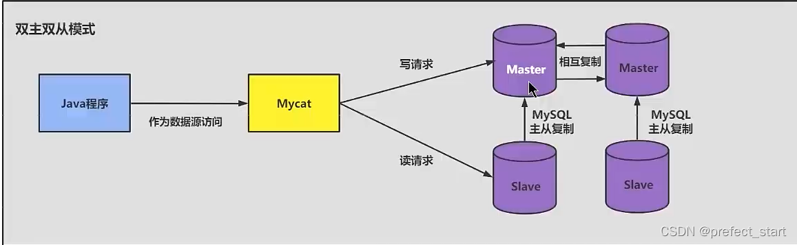
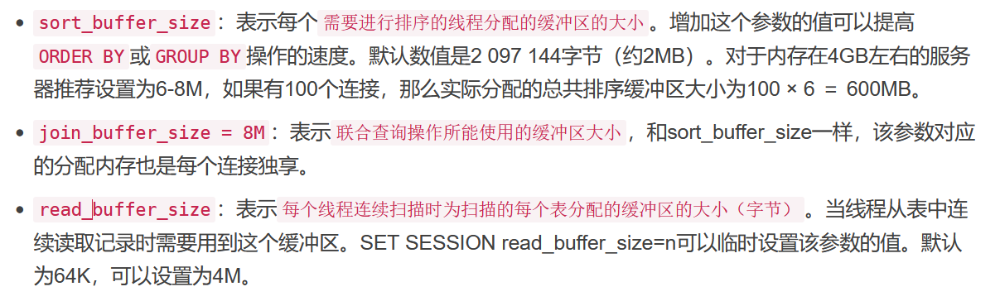
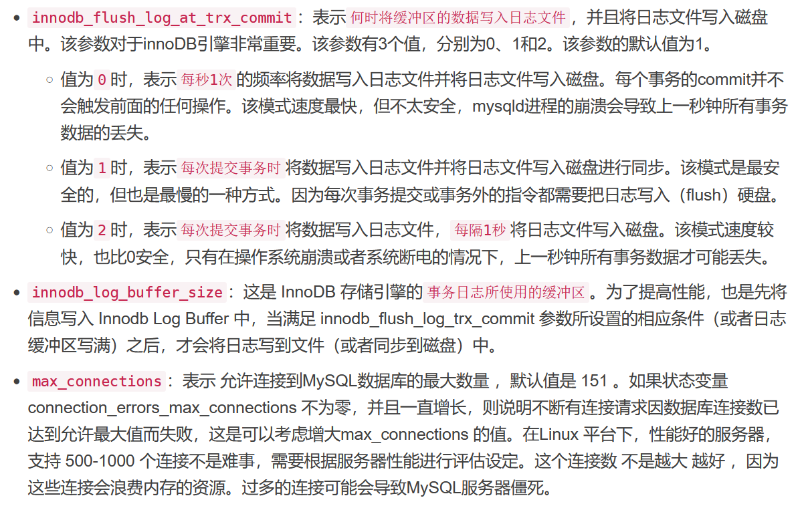
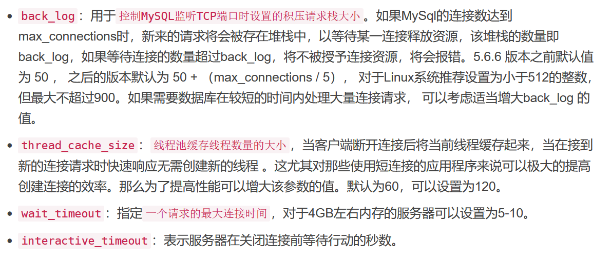
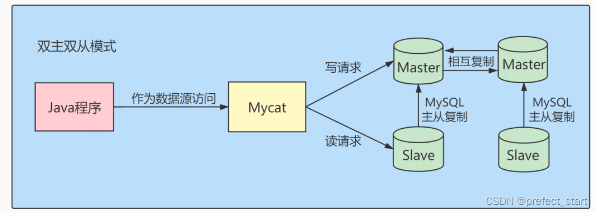
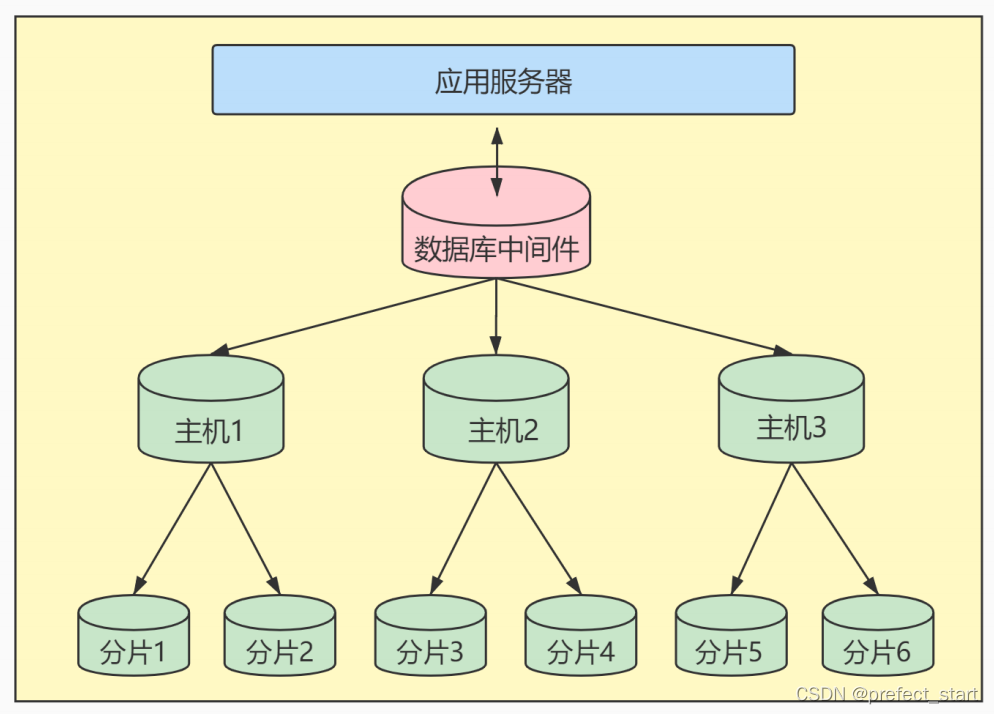
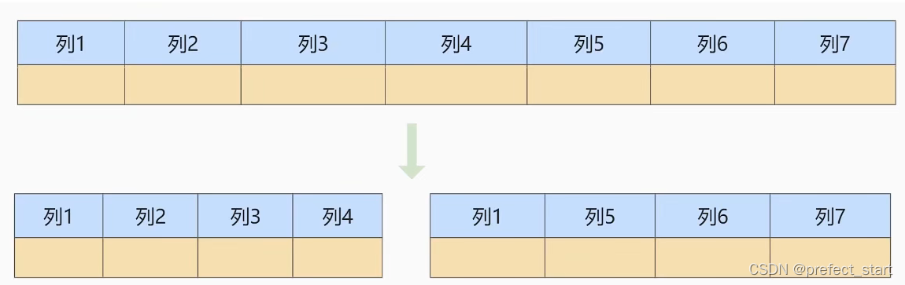
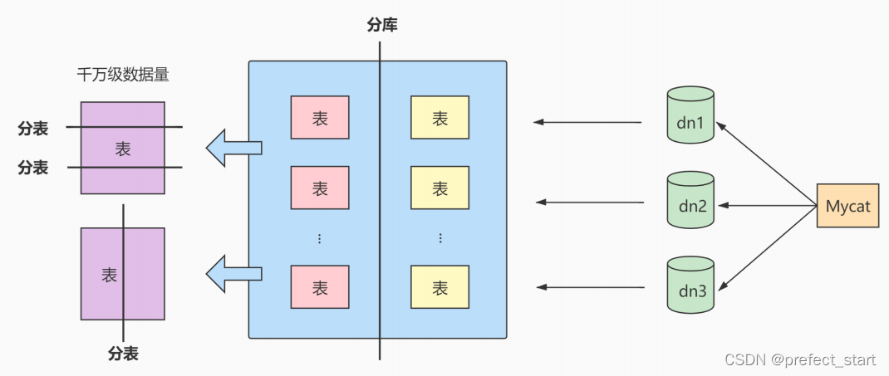
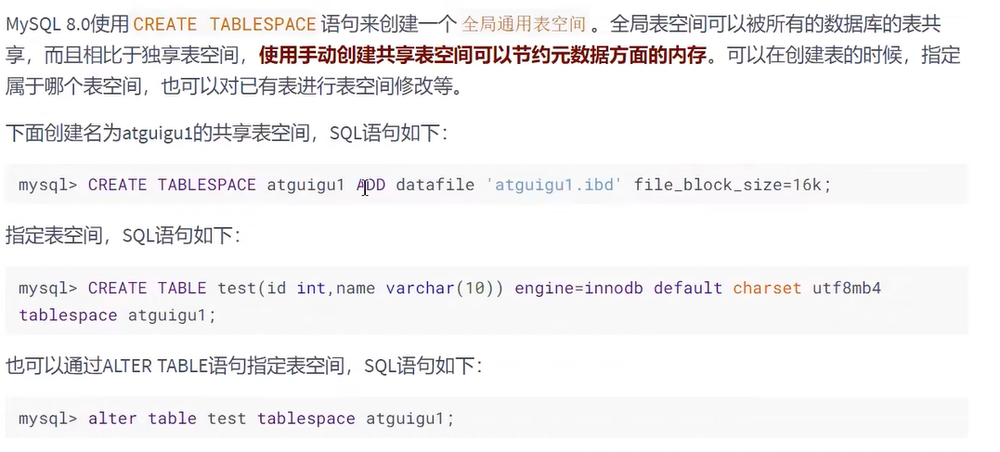
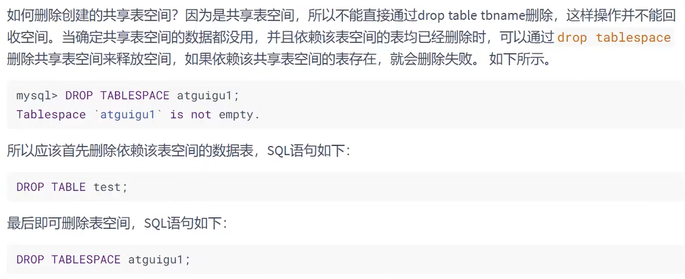

# 000000一、数据库调优的措施  

## 1.1  调优的目标  

1. 尽可能 **节省系统资源** ，以便系统可以提供**更大负荷的服务**。（**吞吐量更大**）
2. 合理的**结构设计**和**参数调整**，以提高用户操作 **响应的速度** 。（响应速度更快）
3. 减少系统的瓶颈，提高 `MySQL` 数据库整体的性能。  

## 1.2  如何定位调优问题  

- 用户的反馈（主要）
- 日志分析（主要）

我们可以通过查看**数据库日志**和**操作系统日志**等方式找出异常情况，通过它们来定位遇到的问题。

- 服务器资源使用监控

通过监控服务器的CPU、内存、IO等使用情况，可以实时了解服务器的性能使用，与历史情况进行对比。

- 数据库内部状况监控

在数据库的监控中，**活动会话〈Active Session)监控**是一个重要的指标。通过它，你可以清楚地了解**数据库当前是否处于非常繁忙的状态**，是否存在 **`SQL` 堆积**等。

- 其它  

除了**活动会话监控**以外，我们也可以对 **事务 、 锁等待** 等进行监控，这些都可以帮助我们对数据库的运行状态有更全面的认识。  

## 1.3  调优的维度和步骤

我们需要调优的对象是**整个数据库管理系统**，它不仅**包括 `SQL` 查询**，还**包括数据库的部署配置、架构**等。从这个角度来说，我们思考的维度就**不仅仅局限在 `SQL`优化上**了。通过如下的步骤我们进行梳理;

### 1.3.1  第一步，选择适合的DBMS

如果对**事务性处理以及安全性要求高**的话，可以选择**商业的数据库产品**。这些数据库在事务处理和查询性能上都比较强，比如**采用 `SQL Server` 、`Oracle`** ，那么单表存储上亿条数据是没有问题的。如果数据表设计得好，即使不采用分库分表的方式，查询效率也不差。

除此以外，你也可以采用**开源的 `MySQL` 进行存储**，它有很多存储引擎可以选择，如果进行**事务处理的话可以选择 `InnoDB`** ，**非事务处理可以选择 `MylSAM`**。

`NOSQL` 阵营包括**键值型数据库、文档型数据库、搜索引擎、列式存储和图形数据库**。这些数据库的优缺点和使用场景各有不同，比如列式存储数据库可以大幅度降低系统的I/O，适合于分布式文件系统，但如果数据需要频繁地增删改，那么列式存储就不太适用了。

### 1.3.2  第二步，优化表设计

选择了DBMS之后，我们就需要进行表设计了。而数据表的设计方式也直接影响了后续的 `SQL` 查询语句。`RDBMS` 中，**每个对象都可以定义为一张表**，**表与表之间的关系代表了对象之间的关系**。如果用的是 `MySQL` 我们还可以根据不同表的使用需求，选择不同的存储引擎。除此以外，还有一些优化的原则可以参考:

1. 表结构要尽量**遵循三范式的原则**。这样可以让数据结构更加清晰规范，减少冗余字段，同时也减少了在更新，插入和删除数据时等异常情况的发生。

2. 如果**查询应用比较多**，尤其是**需要进行多表联查**的时候，可以**采用反范式进行优化**。反范式采用**空间换时间**的方式，通过增加冗余字段提高查询的效率。
3. 表**字段的数据类型选择**，关系到了**查询效率的高低**以及**存储空间的大小**。一般来说，如果字段可以采用数值类型就不要采用字符类型;字符长度要尽可能设计得短一些。针对字符类型来说，当确定字符长度固定时，就可以采用CHAR类型;当长度不固定时，通常采 `VARCHAR` 类型。

数据表的结构设计很基础，也很关键。好的表结构可以在业务发展和用户量增加的情况下依然发挥作用，不好的表结构设计会让数据表变得非常臃肿，查询效率也会降低。

### 1.3.3  第三步，优化逻辑查询

当我们建立好数据表之后，就可以对数据表进行增删改查的操作了。这时我们首先需要考虑的是**逻辑查询优化**。`SQL` 查询优化，可以分为**逻辑查询优化**和**物理查询优化**。

**逻辑查询优化**就是通过**改变 `SQL` 语句的内容让 `SQL` 执行效率更高效**，采用的方式是对 `SQL` 语句进行**等价变换**，对查询进行重写。

`SQL` 的**查询重写**包括了**子查询优化、等价谓词重写、视图重写、条件简化、连接消除和嵌套连接消除**等。比如我们在讲解EXISTS子查询和IN子查询的时候，会根据小表驱动大表的原则选择适合的子查询在WHERE子句中会尽量避免对字段进行函数运算，它们会让字段的索引失效。

### 1.3.4  第4步：优化物理查询

物理查询优化是在**确定了逻辑查询优化**之后，采用**物理优化技术(比如索引等)**，通过计算代价模型对各种可能的访问路径进行估算，从而找到执行方式中代价最小的作为执行计划。在这个部分中，我们需要**掌握的重点是对索引的创建和使用**。

但索引不是万能的，我们需要根据实际情况来创建索引。那么都有哪些情况需要考虑呢?我们在前面几章中已经进行了细致的剖析。

`SQL` 查询时需要对不同的数据表进行查询，因此在物理查询优化阶段也需要确定这些查询所采用的路径，具体的情况包括:

- 单表扫描：对于单表扫描来说，我们可以全表扫描所有的数据，也可以局部扫描。
- 两张表的连接：常用的连接方式包括了**嵌套循环连接、HASH连接和合并连接**。
- 多张表的连接：多张数据表进行连接的时候，**顺序很重要**，因为不同的连接路径查询的效率不同，搜索空间也会不同。我们在进行多表连接的时候，搜索空间可能会达到很高的数据量级，巨大的搜索空间显然会占用更多的资源，因此我们需要通过**调整连接顺序，将搜索空间调整在一个可接受的范围内**。

### 1.3.5  第5步：使用 `Redis` 或 `Memcached` 作为缓存

除了可以对 `SQL` 本身进行优化以外，我们还可以**请外援提升查询的效率**。

因为数据都是存放到数据库中，我们需要从数据库层中取出数据放到内存中进行业务逻辑的操作，当用户量增大的时候，如果频繁地进行数据查询，会消耗数据库的很多资源。如果我们**将常用的数据直接放到内存**中，就会大幅提升查询的效率。**键值存储数据库**可以帮我们**解决这个问题**。

常用的键值存储数据库有 `Redis` 和 `Memcached` ，它们都可以将数据存放到内存中。

从**可靠性**来说，`Redis` 支持持久化，可以让我们的数据保存在硬盘上，不过这样一来性能消耗也会比较大。而 `Memcached` 仅仅是内存存储，不支持持久化。

从**支持的数据类型**来说，`Redis` 比 `Memcached` 要多，它不仅支持key-value类型的数据，还支持List，Set，Hash等数据结构。当我们有持久化需求或者是更高级的数据处理需求的时候，就可以使用 `Redis`。如果是简单的key-value存储，则可以使用`Memcached`。

通常我们对于查询响应要求高的场景（响应时间短，吞吐量大)，可以考虑内存数据库，毕竟术业有专攻。传统的 `RDBMS` 都是将数据存储在硬盘上，而内存数据库则存放在内存中，查询起来要快得多。不过使用不同的工具，也增加了开发人员的使用成本。

### 1.3.6  第6步：库级优化

库级优化是**站在数据库的维度上进行的优化策略**，比如**控制一个库中的数据表数量**。另外，**单一的数据库**总会遇到**各种限制**，不如取长补短，利用"外援""的方式。通过**主从架构**优化我们的**读写策略**，通过**对数据库进行垂直或者水平切分**，突破单一数据库或数据表的访问限制，提升查询的性能。

#### 1.3.6.1  读写分离

如果**读和写的业务量都很大**，并且它们都在**同一个数据库服务器中进行操作**，那么数据库的性能就会出现瓶颈，这时为了提升系统的性能，优化用户体验，我们可以采用**读写分离的方式降低主数据库的负载**，比如用**主数据库( master)**完成**写操作**，用**从数据库(slave)**完成**读操作**。




#### 1.3.6.2  数据分片

对数据库**分库分表**。当**数据量级达到千万级以上**时，有时候我们需要**把一个数据库切成多份**，放到**不同的数据库服务器**上，减少对单一数据库服务器的访问压力。如果你使用的是 `MySQL` ，就可以使用 `MySQL` 自带的**分区表功能**，当然你也可以考虑自己做垂直拆分（分库）、水平拆分（分表）、垂直+水平拆分(分库分表)


# 二、优化 `MySQL`服务器

优化 `MySQL` 服务器主要从两个方面来优化，一方面是**对硬件进行优化**；另一方面是**对 `MySQL` 服务的参数进行优化**。这部分的内容需要较全面的知识，一般只有专业的数据库管理员才能进行这一类的优化。对于可以定制参数的操作系统，也可以针对`MySQL` 进行操作系统优化。

## 2.1  优化服务器硬件

服务器的硬件性能直接决定着 `MySQL` 数据库的性能。硬件的性能瓶颈直接决定 `MySQL` 数据库的运行速度和效率。针对性能瓶颈提高硬件配置，可以提高 `MySQL` 数据库查询、更新的速度。

1. 配置**较大的内存**。足够大的内存是提高 `MySQL` 数据库性能的方法之一。**内存的速度比磁盘I/O快得多**，可以通过**增加系统的缓冲区容量**使数据在内存中停留的时间更长，以**减少磁盘IO**。
2. 配置**高速磁盘系统**，以**减少读盘的等待时间**，提高响应速度。磁盘的I/O能力，也就是它的寻道能力，目前的SCSI高速旋转的是7200转/分钟，这样的速度，一旦访问的用户量上去，磁盘的压力就会过大，如果是每天的网站pv (page view)在150w，这样的一般的配置就无法满足这样的需求了。现在SSD盛行，**在SSD上随机访问和顺序访问性能几乎差不多**，使用SSD可以**减少随机IO带来的性能损耗**。
3. **合理分布磁盘I/O**，把**磁盘I/O分散在多个设备上**，以减少资源竞争，提高并行操作能力。
4. 配置**多处理器**，MySQL是多线程的数据库，多处理器可同时执行多个线程。

## 2.2  优化 `MySQL` 的参数

通过优化 `MySQL` 的参数可以提高资源利用率，从而达到提高 `MySQL` 服务器性能的目的。**`MySQL` 服务的配置参数都在 `my.cnf` 或者 `my.ini` 文件的 `[mysqld]` 组中**。配置完参数以后，需要**重新启动 `MySQL`服务才会生效**。

下面对几个对性能影响比较大的参数进行详细介绍。

`innodb_buffer_pool_size`：这个参数是 `MySQL`数据库最重要的参数之一，表示 `InnoDB` 引擎的**表和索引的最大缓存**。它**不仅仅缓存索引数据，还会缓存表的数据**。这个**值越大，查询的速度就会越快**。但是这个值太大会影响操作系统的性能。

`key_buffer_size`：表示**索引缓冲区的大小**。索引缓冲区是**所有的线程共享**。增加索引缓冲区可以得到**更好处理的索引（对所有读和多重写）**。当然，这个值不是越大越好，它的大小取决于内存的大小。如果这个**值太大，就会导致操作系统频繁换页，也会降低系统性能**。对于内存在 `4GB` 左右的服务器该参数可设置为 `256M` 或`384M`。

`table_cache`：表示**同时打开的表的个数**。这个值越大，能够同时打开的表的个数越多。**物理内存越大，设置就越大**。默认为2402，调到512-1024最佳。这个值不是越大越好，因为**同时打开的表太多会影响操作系统的性能**。

`query_cache_size`：表示**查询缓冲区的大小**。可以通过在 `MySQL` 控制台观察，如果 `Qcache_lowmem_prunes` 的值非常大，则表明经常出现缓冲不够的情况，就要增加 `Query_cache_size` 的值；如果 `Qcache_hits` 的值非常大，则表明查询缓冲使用非常频繁，如果该值较小反而会影响效率，那么可以考虑不用查询缓存；`Qcache_free_blocks` ，如果该值非常大，则表明缓冲区中碎片很多。**`MySQL 8.0`之后失效**。该参数**需要和 `query_cache_type` 配合使用**。

- `query_cache_type` 的**值是0**时，**所有的查询都不使用查询缓存区**。但是 `query_cache_type=0` 并**不会导致 `MySQL` 释放 `query_cache_size`所配置的缓存区内存**。
- 当 `query_cache_type=1` 时，所有的查询**都将使用查询缓存区**，**除非在查询语句中指定 `SQL_NO_CACHE`** ，如 `SELECT SQL_NO_CACHE * FROM tbl_name`。
- 当 `query_cache_type=2` 时，只有**在查询语句中使用 `SQL_CACHE` 关键字，查询才会使用查询缓存区**。使用查询缓存区可以提高查询的速度，这种方式只适用于修改操作少且经常执行相同的查询操作的情况。







这里给出一份 `my.cnf` 的参考配置：

```ini
[mysqld]
port = 3306 
serverid = 1 
socket = /tmp/mysql.sock 
skip-locking #避免MySQL的外部锁定，减少出错几率增强稳定性。 
skip-name-resolve 
#禁止MySQL对外部连接进行DNS解析，使用这一选项可以消除MySQL进行DNS解析的时间。但需要注意，
#如果开启该选项，则所有远程主机连接授权都要使用IP地址方式，否则MySQL将无法正常处理连接请求！
back_log = 384
key_buffer_size = 256M 
max_allowed_packet = 4M 
thread_stack = 256K
table_cache = 128K 
sort_buffer_size = 6M 
read_buffer_size = 4M
read_rnd_buffer_size=16M 
join_buffer_size = 8M 
myisam_sort_buffer_size =64M 
table_cache = 512 
thread_cache_size = 64 
query_cache_size = 64M
tmp_table_size = 256M 
max_connections = 768 
max_connect_errors = 10000000
wait_timeout = 10 
thread_concurrency = 8 
#该参数取值为服务器逻辑CPU数量*2，在本例中，服务器有2颗物理CPU，而每颗物理CPU又支持H.T超线程，所以实际取值为4*2=8 
skip-networking 
#开启该选项可以彻底关闭MySQL的TCP/IP连接方式，如果WEB服务器是以远程连接的方式访问MySQL数据库服务器则不要开启该选项！
#否则将无法正常连接！ 
table_cache=1024
innodb_additional_mem_pool_size=4M 
#默认为2M 
innodb_flush_log_at_trx_commit=1
innodb_log_buffer_size=2M 
#默认为1M 
innodb_thread_concurrency=8 
#你的服务器CPU有几个就设置为几。建议用默认一般为8 
tmp_table_size=64M 
#默认为16M，调到64-256最挂
thread_cache_size=120 
query_cache_size=32M
```

# 三、优化数据库结构

一个好的数据库设计方案对于数据库的性能常常会起到事半功倍的效果。合理的数据库结构不仅可以使数据库**占用更小的磁盘空间**，而且能够**使查询速度更快**。数据库结构的设计需要考虑**数据冗余、查询和更新的速度、字段的数据类型是否合理**等多方面的内容。

## 3.1  拆分表：冷热数据分离

拆分表的思路是，**把1个包含很多字段的表拆分成2个或者多个相对较小的表**。这样做的原因是，这些表中**某些字段的操作频率很高（热数据）**，经常要进行查询或者更新操作，而**另外一些字段的使用频率却很低（冷数据）**，冷热数据分离，可以**减小表的宽度**。如果放在一个表里面，每次查询都要读取大记录，会消耗较多的资源。

`MySQL` 限制**每个表最多存储4096列**，并且**每一行数据的大小不能超过65535字节**。**表越宽**，把表装载进**内存缓冲池**时所**占用的内存也就越大**，也会**消耗更多的IO**。

冷热数据分离的目的是:

1. 减少磁盘IO，保证**热数据**的**内存缓存命中率**。
2. 更有效的利用缓存，**避免读入**无用的**冷数据**。

## 3.2  增加中间表

对于需要**经常联合查询**的表，可以**建立中间表**以提高查询效率。通过建立中间表，把需要**经常联合查询的数据插入中间表**中，然后将**原来的联合查询改为对中间表的查询**，以此来提高查询效率。

1. 首先，分析经常联合查询表中的字段;
2. 然后，使用这些字段建立一个中间表，并将原来联合查询的表的数据插入中间表中;
3. 最后，使用中间表来进行查询。

## 3.3  增加冗余字段

设计数据库表时应**尽量遵循范式理论**的规约，**尽可能减少冗余字段**，让数据库设计看起来精致、优雅。但是，**合理地加入冗余字段可以提高查询速度**。

表的规范化程度越高，表与表之间的关系就越多，需要连接查询的情况也就越多。尤其**在数据量大,而且需要频繁进行连接**的时候，为了提升效率，我们也可以**考虑增加冗余字段来减少连接**。

## 3.4  优化数据类型

改进表的设计时，可以考虑**优化字段的数据类型**。当参与的项目越来越大，数据量也越来越多的时候，你就不能只从系统稳定性的角度来思考问题了，还要考虑到系统整体的稳定性和效率。此时，**优先选择符合存储需要的最小的数据类型**。**列的字段越大**，**建立索引**时所需要的**空间也就越大**，这样**一页中**所能存储的**索引节点的数量也就越少**，在**遍历时**所需要的**IO次数也就越多**，索引的性能也就越差。

具体的：

### 3.4.1  情况1：对整数类型数据进行优化

**遇到整数类型的字段可以用INT 型**。这样做的理由是，INT 型数据有足够大的取值范围，不用担心数据超出取值范围的问题。刚开始做项目的时候，首先要保证系统的稳定性，这样设计字段类型是可以的。但在数据量很大的时候，数据类型的定义，在很大程度上会影响到系统整体的执行效率。

对于**非负型的数据**（如自增ID、整型 `IP`）来说，要**优先使用无符号整型UNSIGNED来存储**。因为无符号相对于有符号，同样的字节数，存储的数值范围更大。如tinyint有符号为-128-127，无符号为0-255，多出一倍的存储空间。

### 3.4.2  情况2：既可以使用文本类型也可以使用整数类型的字段，要选择使用整数类型

跟文本类型数据相比，**整数**往往占用**更少的存储空间**，因此，在存储和比对的时候，可以占用更少的内存空间。所以，在二者皆可用的情况下，尽量使用整数类型，这样可以提高查询的效率。如：**将 `IP` 地址转换成整型数据**。

### 3.4.3  情况3：避免使用TEXT、BLOB数据类型

`MySQL` **内存临时表不支持TEXT、BLOB这样的大数据类型**，如果查询中包含这样的数据，在排序等操作时，就不能使用内存临时表，**必须使用磁盘临时表进行**。并且对于这种数据，`MySQL`还是要进行二次查询，会使 `SQL` 性能变得很差，但是不是说一定不能使用这样的数据类型。

**如果一定要使用**，建议把**BLOB**或是**TEXT**列**分离到单独的扩展表中**，查询时**一定不要使用select***，而只需要取出必要的列，不需要TEXT列的数据时不要对该列进行查询。

### 3.4.4  情况4：避免使用 `ENUM` 类型

**修改 `ENUM` 值需要使用 `ALTER` 语句**。**`ENUM` 类型的 `ORDER BY` 操作效率低**，需要额外操作。**使用 `TINYINT` 来代替 `ENUM` 类型。**

### 3.4.5  情况5：使用 `TIMESTAMP` 存储时间

`TIMESTAMP` 存储的时间范围 `1970-01-0100:00:01~ 2038-01-19-03:14:07` 。`TIMESTAMP` 使用**4字节**，` DATETIME` 使用**8个字节**，同时 `TIMESTAMP` **具有自动赋值以及自动更新的特性**。

### 3.4.6 情况6：用DECIMAL代替FLOAT和DOUBLE存储精确浮点数

- 非精准浮点:float,double
- 精准浮点:decimal
  Decimal类型为**精准浮点数**，在**计算时不会丢失精度**，尤其是财务相关的金融类数据。占用空间由定义的宽度决定，**每4个字节可以存储9位数字**，并且**小数点要占用一个字节**。**可用于存储比 `bigint` 更大的整型数据**。

## 3.5  优化插入记录的速度

插入记录时，**影响插入速度**的主要是**索引、唯一性校验、一次插入记录条数**等。根据这些情况可以分别进行优化。这里我们**分为 `MyISAM` 引擎和 `InnoDB` 存储引擎**来讲。

### 3.5.1  `MyISAM` 引擎的表

- **禁用索引**

  对于非空表，插入记录时，`MySQL` 会根据表的索引树插入的记录建立索引。如果**插入大量数据**，建立索引就会降低插入记录的速度。为了解决这种情况，可以**在插入记录之前禁用索引**，**数据插入完毕后再开启索引。**

- **禁用唯一性检查**

  插入数据时， `MySQL` 会**对插入的记录进行唯一性校验**。这种唯一性校验会**降低插入记录的速度**。为了降低这种情况对查询速度的影响，可以**在插入记录之前禁用唯一性检查，等到记录插入完毕后再开启。**

- **使用批量插入**

  插入多条记录时，可以使用一条INSERT语句插入一条记录，也可以使用一条INSERT语句插入多条记录。

- **使用 `LOAD DATA INFILE` 批量导入**

  当需要批量导入数据时，如果能用 `LOAD DATAINFILE` 语句，就尽量使用。因为 **`LOAD DATAINFILE` 语句导入数据的速度比INSERT语句快**。

### 3.5.2  `InnoDB` 引擎的表

- **禁用唯一性检查**

  **插入大量数据时禁止对唯一索引的检查**。这种唯一性校验会降低插入记录的速度。为了降低这种情况对查询速度的影响，可以**在插入记录之前禁用唯一性检查，等到记录插入完毕后再开启**。

- **禁用外键检查**

  **插入数据之前**执行**禁止对外键的检查**，**数据插入完成之后**再**恢复对外键的检查**。

- **禁止自动提交**

  插入数据之前**禁止事务的自动提交**，数据导入完成之后，**执行恢复自动提交操作**。

## 3.6  使用非空约束

在设计字段的时候，如果业务允许，建议**尽量使用非空约束**。这样做的好处是:

1. 进行比较和计算时，**省去要对NULL值的字段判断是否为空的开销**，提高存储效率。

2. 非空字段也**容易创建索引**。因为**索引NULL列需要额外的空间来保存**，所以要**占用更多的空间**。使用非空约束，就可以节省存储空间(每个字段1个bit)。
3. 判断数据 `IS NOT NULL` 会导致索引失效。

## 3.7  分析表、检查表与优化表

`MySQL` 提供了分析表、检查表和优化表的语句。

- 分析表主要是**分析关键字的分布**
- 检查表主要是**检查表是否存在错误**
- 优化表主要是**消除删除或者更新造成的空间浪费**。

### 3.7.1  分析表

```sql
ANALYZE [LOCAL | NO_WRITE_TO_BINLOG] TABLE tbl_name[,tbl_name]…
```

**默认的，`MySQL` 服务会将 `ANALYZE TABLE` 语句写到 `binlog` 中**，以便在**主从架构**中，从服务**能够同步数据**。可以添加参数 `LOCAL`  或者 `NO_WRITE_TO_BINLOG` 取消将语句写到 `binlog` 中。

使用 `ANALYZE TABLE` **分析表的过程**中，数据库系统会**自动对表加一个只读锁**。在分析期间，**只能读取表中的记录，不能更新和插入记录**。`ANALYZE TABLE` 语句能够**分析 `InnoDB` 和 `MyISAM` 类型的表**，但是不能作用于视图。

`ANALYZE TABLE` 分析后的**统计结果会反应到 `cardinality` 的值（可以通过 `show index from tableName` 进行查询，查询前需要先`ANALAYZE TABLE`）**，该值统计了**表中某一键所在的列不重复的值的个数**。

**该值越接近表中的总行数(区分度越高)**，则在**表连接查询**或者**索引查询**时，**就越优先被优化器选择使用**。

### 3.7.2  检查表

```sql
CHECK TABLE tbl_name [, tbl_name] ... [option] ... option = {QUICK | FAST | MEDIUM | EXTENDED | CHANGED}
```

`MySQL` 中**可以使用 `CHECK TABLE` 语句来检查表**。`CHECK TABLE` 语句**能够检查 `InnoDB` 和 `MyISAM` 类型的表是否存在错误**。CHECK TABLE语句在**执行过程中也会给表加上只读锁**。

对于 `MylSAM` 类型的表，`CHECK TABLE` 语句还会更新关键字统计数据。而且，`CHECKTABLE` 也可以检查视图是否有错误，比如在视图定义中被引用的表已不存在。该语句的基本语法如下:

其中，**tbl_name是表名**; **option参数有5个取值**，分别是QUICK、FAST、MEDIUM、EXTENDED和CHANGED。各个选项的意义分别是:

    QUICK:不扫描行，不检查错误的逛接。FAST:只检查没有被正确关闭的表。
    CHANGED︰只检查上次检查后被更改的表和没有被正确关闭的表。
    MEDIUN:扫描行，以验证被删除的连接是有效的。也可以计算各行的关键字校验和，并使用计算出的校验和验证这一点。
    EXTENDED:对每行的所有关键字进行一个全面的关键字查找。这可以确保表是100%一致的但是花的时间较长。
**`option` 只对 `MylSAM` 类型的表有效，对 `InnoDB` 类型的表无效。**

### 3.7.3 优化表

```sql
OPTIMIZE [LOCAL | NO_WRITE_TO_BINLOG] TABLE tbl_name [, tbl_name] ...
```

`MySQL` 中使用 `OPTIMIZE TABLE` 语句来优化表。但是，`OPTILMIZE TABLE` 语句**只能优化表中的`VARCHAR`、`BLOB` 或 `TEXT` 类型的字段**。一个表使用了这些字段的数据类型，若**已经删除了表的一大部分数据**，或者已经**对含有可变长度行的表（含有 `VARCHAR` 、`BLOB` 或 `TEXT` 列的表）进行了很多更新**，则应使用 `OPTIMIZE TABLE` 来**重新利用未使用的空间，并整理数据文件的碎片**。

`OPTIMIZE TABLE` 语句**对 `InnoDB` 和 `MyISAM` 类型的表都有效**。该语句在执行过程中也会**给表加上只读锁**。

# 四、大表优化

当 `MySQL` **单表记录数过大**时，数据库的CRUD性能会明显下降，一些常见的优化措施如下:

## 4.1  限定查询的范围

禁止不带任何限制数据范围条件的查询语句。比如:我们**当用户在查询订单历史的时候，我们可以控制在一个月的范围内**;

## 4.2  读/写分离

经典的数据库拆分方案，主库负责写，从库负责读。

- 一主一从模式：


- 双主双从模式：



## 4.3  垂直拆分

当数据量级达到 **千万级** 以上时，有时候我们**需要把一个数据库切成多份**，放到不同的数据库服务器上，减少对单一数据库服务器的访问压力。



- 如果数据库中的**数据表过多**，可以采用**垂直分库**的方式，将**存在关联的数据表部署在同一个数据库**.
- 如果**数据表中的列过多**，可以采用**垂直分表**的方式，将**一张数据表分拆成多张数据表**，把**经常一起使用的列放到同一张表里**。




- 垂直拆分的优点： 可以使得**列数据变小**，在查询时**减少读取的Block数**，**减少I/O次数**。此外，垂直分区可以简化表的结构，易于维护。
- 垂直拆分的缺点： **主键会出现冗余**，需要**管理冗余列**，并会**引起 JOIN 操作**。此外，垂直拆分会让事务变得更加复杂。

## 4.4  水平拆分

1. 尽量**控制单表数据量的大小**，建议**控制在1000万以内**。1000万并不是 `MySQL` 数据库的限制，但是过大会造成修改表结构、备份、恢复都会有很大的问题。此时可以用**历史数据归档（应用于日志数据)**，**水平分表(应用于业务数据）**等手段来**控制数据量大小**。
2. 这里我们主要考虑业务数据的水平分表策略。**将大的数据表按照某个属性维度分拆成不同的小表**，**每张小表保持相同的表结构**。比如你可以**按照年份来划分**，把**不同年份的数据放到不同的数据表中**。2017年、2018年和2019年的数据就可以分别放到三张数据表中。
3. 水平分表**仅是解决了单一表数据过大的问题**，但由于**表的数据还是在同一台机器上**，其实对于提升`MySQL` 并发能力没有什么意义，所以**水平拆分最好分库**，从而**达到分布式的目的**。



水平拆分**能够支持非常大的数据量存储**，**应用端改造也少**，但**分片事务难以解决**，**跨节点Join性能较差**，逻辑复杂。

《Java工程师修炼之道》的作者推荐尽量不要对数据进行分片，因为拆分会带来逻辑、部署、运维的各种复杂度，一般的数据表在优化得当的情况下支撑千万以下的数据量是没有太大问题的。如果实在要分片，尽量选择客户端分片架构，这样可以减少一次和中间件的网络l/O。

下面补充一下**数据库分片的两种常见方案**：

- **客户端代理**： **分片逻辑在应用端**，封装在jar包中，通过修改或者封装 `JDBC` 层来实现。 当当网的`Sharding-JDBC`  、阿里的 `TDDL` 是两种比较常用的实现。
- **中间件代理**： **在应用和数据中间加了一个代理层**。**分片逻辑统一维护在中间件服务中**。我们现在谈的 `Mycat` 、360的 `Atlas` 、网易的 `DDB` 等等都是这种架构的实现。


# 五、其他调优策略

## 5.1  服务器语句超时处理  

在 `MySQL 8.0` 中可以设置 **服务器语句超时的限制** ，单位可以达到 **毫秒级别** 。当中断的**执行语句超过设置的毫秒数**后，服务器将**终止查询影响不大的事务或连接**，然后**将错误报给客户端**。

设置服务器语句超时的限制，可以通过**设置系统变量 `MAX_EXECUTION_TIME`** 来实现。**默认情况下，**
**`MAX_EXECUTION_TIME` 的值为0，代表没有时间限制**。 例如：  

```sql
SET GLOBAL MAX_EXECUTION_TIME=2000;

SET SESSION MAX_EXECUTION_TIME=2000; #指定该会话中SELECT语句的超时时间
```

## 5.2  创建全局通用表空间  





## 5.3  `MySQL 8.0`新特性：隐藏索引对调优的帮助  


