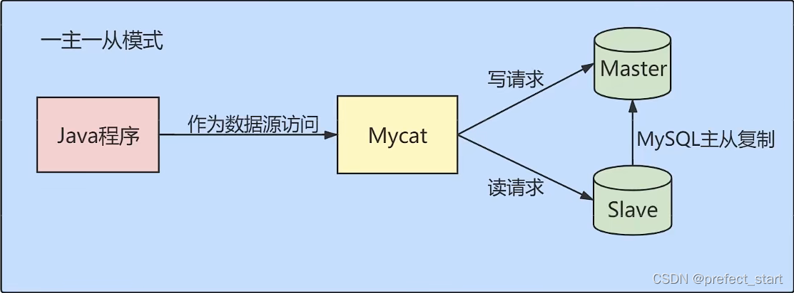

# 一、数据库调优的措施  

## 1.1  调优的目标  

1. 尽可能 **节省系统资源** ，以便系统可以提供**更大负荷的服务**。（**吞吐量更大**）
2. 合理的**结构设计**和**参数调整**，以提高用户操作 **响应的速度** 。（响应速度更快）
3. 减少系统的瓶颈，提高 `MySQL` 数据库整体的性能。  

## 1.2  如何定位调优问题  

- 用户的反馈（主要）
- 日志分析（主要）

我们可以通过查看**数据库日志**和**操作系统日志**等方式找出异常情况，通过它们来定位遇到的问题。

- 服务器资源使用监控

通过监控服务器的CPU、内存、IO等使用情况，可以实时了解服务器的性能使用，与历史情况进行对比。

- 数据库内部状况监控

在数据库的监控中，**活动会话〈Active Session)监控**是一个重要的指标。通过它，你可以清楚地了解**数据库当前是否处于非常繁忙的状态**，是否存在 **`SQL` 堆积**等。

- 其它  

除了**活动会话监控**以外，我们也可以对 **事务 、 锁等待** 等进行监控，这些都可以帮助我们对数据库的运行状态有更全面的认识。  

## 1.3  调优的维度和步骤

我们需要调优的对象是**整个数据库管理系统**，它不仅**包括 `SQL` 查询**，还**包括数据库的部署配置、架构**等。从这个角度来说，我们思考的维度就**不仅仅局限在 `SQL`优化上**了。通过如下的步骤我们进行梳理;

### 1.3.1  第一步，选择适合的DBMS

如果对**事务性处理以及安全性要求高**的话，可以选择**商业的数据库产品**。这些数据库在事务处理和查询性能上都比较强，比如**采用 `SQL Server` 、`Oracle`** ，那么单表存储上亿条数据是没有问题的。如果数据表设计得好，即使不采用分库分表的方式，查询效率也不差。

除此以外，你也可以采用**开源的 `MySQL` 进行存储**，它有很多存储引擎可以选择，如果进行**事务处理的话可以选择 `InnoDB`** ，**非事务处理可以选择 `MylSAM`**。

`NOSQL` 阵营包括**键值型数据库、文档型数据库、搜索引擎、列式存储和图形数据库**。这些数据库的优缺点和使用场景各有不同，比如列式存储数据库可以大幅度降低系统的I/O，适合于分布式文件系统，但如果数据需要频繁地增删改，那么列式存储就不太适用了。

### 1.3.2  第二步，优化表设计

选择了DBMS之后，我们就需要进行表设计了。而数据表的设计方式也直接影响了后续的 `SQL` 查询语句。`RDBMS` 中，**每个对象都可以定义为一张表**，**表与表之间的关系代表了对象之间的关系**。如果用的是 `MySQL` 我们还可以根据不同表的使用需求，选择不同的存储引擎。除此以外，还有一些优化的原则可以参考:

1. 表结构要尽量**遵循三范式的原则**。这样可以让数据结构更加清晰规范，减少冗余字段，同时也减少了在更新，插入和删除数据时等异常情况的发生。

2. 如果**查询应用比较多**，尤其是**需要进行多表联查**的时候，可以**采用反范式进行优化**。反范式采用**空间换时间**的方式，通过增加冗余字段提高查询的效率。
3. 表**字段的数据类型选择**，关系到了**查询效率的高低**以及**存储空间的大小**。一般来说，如果字段可以采用数值类型就不要采用字符类型;字符长度要尽可能设计得短一些。针对字符类型来说，当确定字符长度固定时，就可以采用CHAR类型;当长度不固定时，通常采 `VARCHAR` 类型。

数据表的结构设计很基础，也很关键。好的表结构可以在业务发展和用户量增加的情况下依然发挥作用，不好的表结构设计会让数据表变得非常臃肿，查询效率也会降低。

### 1.3.3  第三步，优化逻辑查询

当我们建立好数据表之后，就可以对数据表进行增删改查的操作了。这时我们首先需要考虑的是**逻辑查询优化**。`SQL` 查询优化，可以分为**逻辑查询优化**和**物理查询优化**。

**逻辑查询优化**就是通过**改变 `SQL` 语句的内容让 `SQL` 执行效率更高效**，采用的方式是对 `SQL` 语句进行**等价变换**，对查询进行重写。

`SQL` 的**查询重写**包括了**子查询优化、等价谓词重写、视图重写、条件简化、连接消除和嵌套连接消除**等。比如我们在讲解EXISTS子查询和IN子查询的时候，会根据小表驱动大表的原则选择适合的子查询在WHERE子句中会尽量避免对字段进行函数运算，它们会让字段的索引失效。

### 1.3.4  第4步：优化物理查询

物理查询优化是在**确定了逻辑查询优化**之后，采用**物理优化技术(比如索引等)**，通过计算代价模型对各种可能的访问路径进行估算，从而找到执行方式中代价最小的作为执行计划。在这个部分中，我们需要**掌握的重点是对索引的创建和使用**。

但索引不是万能的，我们需要根据实际情况来创建索引。那么都有哪些情况需要考虑呢?我们在前面几章中已经进行了细致的剖析。

`SQL` 查询时需要对不同的数据表进行查询，因此在物理查询优化阶段也需要确定这些查询所采用的路径，具体的情况包括:

- 单表扫描：对于单表扫描来说，我们可以全表扫描所有的数据，也可以局部扫描。
- 两张表的连接：常用的连接方式包括了**嵌套循环连接、HASH连接和合并连接**。
- 多张表的连接：多张数据表进行连接的时候，**顺序很重要**，因为不同的连接路径查询的效率不同，搜索空间也会不同。我们在进行多表连接的时候，搜索空间可能会达到很高的数据量级，巨大的搜索空间显然会占用更多的资源，因此我们需要通过**调整连接顺序，将搜索空间调整在一个可接受的范围内**。

### 1.3.5  第5步：使用 `Redis` 或 `Memcached` 作为缓存

除了可以对 `SQL` 本身进行优化以外，我们还可以**请外援提升查询的效率**。

因为数据都是存放到数据库中，我们需要从数据库层中取出数据放到内存中进行业务逻辑的操作，当用户量增大的时候，如果频繁地进行数据查询，会消耗数据库的很多资源。如果我们**将常用的数据直接放到内存**中，就会大幅提升查询的效率。**键值存储数据库**可以帮我们**解决这个问题**。

常用的键值存储数据库有 `Redis` 和 `Memcached` ，它们都可以将数据存放到内存中。

从**可靠性**来说，`Redis` 支持持久化，可以让我们的数据保存在硬盘上，不过这样一来性能消耗也会比较大。而 `Memcached` 仅仅是内存存储，不支持持久化。

从**支持的数据类型**来说，`Redis` 比 `Memcached` 要多，它不仅支持key-value类型的数据，还支持List，Set，Hash等数据结构。当我们有持久化需求或者是更高级的数据处理需求的时候，就可以使用 `Redis`。如果是简单的key-value存储，则可以使用`Memcached`。

通常我们对于查询响应要求高的场景（响应时间短，吞吐量大)，可以考虑内存数据库，毕竟术业有专攻。传统的 `RDBMS` 都是将数据存储在硬盘上，而内存数据库则存放在内存中，查询起来要快得多。不过使用不同的工具，也增加了开发人员的使用成本。

### 1.3.6  第6步：库级优化

库级优化是**站在数据库的维度上进行的优化策略**，比如**控制一个库中的数据表数量**。另外，**单一的数据库**总会遇到**各种限制**，不如取长补短，利用"外援""的方式。通过**主从架构**优化我们的**读写策略**，通过**对数据库进行垂直或者水平切分**，突破单一数据库或数据表的访问限制，提升查询的性能。

#### 1.3.6.1  读写分离

如果**读和写的业务量都很大**，并且它们都在**同一个数据库服务器中进行操作**，那么数据库的性能就会出现瓶颈，这时为了提升系统的性能，优化用户体验，我们可以采用**读写分离的方式降低主数据库的负载**，比如用**主数据库( master)**完成**写操作**，用**从数据库(slave)**完成**读操作**。




#### 1.3.6.2  数据分片

对数据库**分库分表**。当**数据量级达到千万级以上**时，有时候我们需要**把一个数据库切成多份**，放到**不同的数据库服务器**上，减少对单一数据库服务器的访问压力。如果你使用的是 `MySQL` ，就可以使用 `MySQL` 自带的**分区表功能**，当然你也可以考虑自己做垂直拆分（分库）、水平拆分（分表）、垂直+水平拆分(分库分表)


# 二、优化 `MySQL`服务器

优化 `MySQL` 服务器主要从两个方面来优化，一方面是**对硬件进行优化**；另一方面是**对 `MySQL` 服务的参数进行优化**。这部分的内容需要较全面的知识，一般只有专业的数据库管理员才能进行这一类的优化。对于可以定制参数的操作系统，也可以针对`MySQL` 进行操作系统优化。

## 2.1  优化服务器硬件

服务器的硬件性能直接决定着 `MySQL` 数据库的性能。硬件的性能瓶颈直接决定 `MySQL` 数据库的运行速度和效率。针对性能瓶颈提高硬件配置，可以提高 `MySQL` 数据库查询、更新的速度。

1. 配置**较大的内存**。足够大的内存是提高 `MySQL` 数据库性能的方法之一。**内存的速度比磁盘I/O快得多**，可以通过**增加系统的缓冲区容量**使数据在内存中停留的时间更长，以**减少磁盘IO**。
2. 配置**高速磁盘系统**，以**减少读盘的等待时间**，提高响应速度。磁盘的I/O能力，也就是它的寻道能力，目前的SCSI高速旋转的是7200转/分钟，这样的速度，一旦访问的用户量上去，磁盘的压力就会过大，如果是每天的网站pv (page view)在150w，这样的一般的配置就无法满足这样的需求了。现在SSD盛行，**在SSD上随机访问和顺序访问性能几乎差不多**，使用SSD可以**减少随机IO带来的性能损耗**。
3. **合理分布磁盘I/O**，把**磁盘I/O分散在多个设备上**，以减少资源竞争，提高并行操作能力。
4. 配置**多处理器**，MySQL是多线程的数据库，多处理器可同时执行多个线程。

## 2.2  优化 `MySQL` 的参数

通过优化 `MySQL` 的参数可以提高资源利用率，从而达到提高 `MySQL` 服务器性能的目的。**`MySQL` 服务的配置参数都在 `my.cnf` 或者 `my.ini` 文件的 `[mysqld]` 组中**。配置完参数以后，需要**重新启动 `MySQL`服务才会生效**。

下面对几个对性能影响比较大的参数进行详细介绍。

`innodb_buffer_pool_size`：这个参数是 `MySQL`数据库最重要的参数之一，表示 `InnoDB` 引擎的**表和索引的最大缓存**。它**不仅仅缓存索引数据，还会缓存表的数据**。这个**值越大，查询的速度就会越快**。但是这个值太大会影响操作系统的性能。

`key_buffer_size`：表示**索引缓冲区的大小**。索引缓冲区是**所有的线程共享**。增加索引缓冲区可以得到**更好处理的索引（对所有读和多重写）**。当然，这个值不是越大越好，它的大小取决于内存的大小。如果这个**值太大，就会导致操作系统频繁换页，也会降低系统性能**。对于内存在 `4GB` 左右的服务器该参数可设置为 `256M` 或`384M`。

`table_cache`：表示**同时打开的表的个数**。这个值越大，能够同时打开的表的个数越多。**物理内存越大，设置就越大**。默认为2402，调到512-1024最佳。这个值不是越大越好，因为**同时打开的表太多会影响操作系统的性能**。

`query_cache_size`：表示**查询缓冲区的大小**。可以通过在 `MySQL` 控制台观察，如果 `Qcache_lowmem_prunes` 的值非常大，则表明经常出现缓冲不够的情况，就要增加 `Query_cache_size` 的值；如果 `Qcache_hits` 的值非常大，则表明查询缓冲使用非常频繁，如果该值较小反而会影响效率，那么可以考虑不用查询缓存；`Qcache_free_blocks` ，如果该值非常大，则表明缓冲区中碎片很多。**`MySQL 8.0`之后失效**。该参数**需要和 `query_cache_type` 配合使用**。

- `query_cache_type` 的**值是0**时，**所有的查询都不使用查询缓存区**。但是 `query_cache_type=0` 并**不会导致 `MySQL` 释放 `query_cache_size`所配置的缓存区内存**。
  - 当 `query_cache_type=1` 时，所有的查询**都将使用查询缓存区**，**除非在查询语句中指定 `SQL_NO_CACHE`** ，如 `SELECT SQL_NO_CACHE * FROM tbl_name`。
  - 当 `query_cache_type=2` 时，只有**在查询语句中使用 `SQL_CACHE` 关键字，查询才会使用查询缓存区**。使用查询缓存区可以提高查询的速度，这种方式只适用于修改操作少且经常执行相同的查询操作的情况。


这里给出一份 `my.cnf` 的参考配置：

```ini
[mysqld]
port = 3306 
serverid = 1 
socket = /tmp/mysql.sock 
skip-locking #避免MySQL的外部锁定，减少出错几率增强稳定性。 
skip-name-resolve 
#禁止MySQL对外部连接进行DNS解析，使用这一选项可以消除MySQL进行DNS解析的时间。但需要注意，
#如果开启该选项，则所有远程主机连接授权都要使用IP地址方式，否则MySQL将无法正常处理连接请求！
back_log = 384
key_buffer_size = 256M 
max_allowed_packet = 4M 
thread_stack = 256K
table_cache = 128K 
sort_buffer_size = 6M 
read_buffer_size = 4M
read_rnd_buffer_size=16M 
join_buffer_size = 8M 
myisam_sort_buffer_size =64M 
table_cache = 512 
thread_cache_size = 64 
query_cache_size = 64M
tmp_table_size = 256M 
max_connections = 768 
max_connect_errors = 10000000
wait_timeout = 10 
thread_concurrency = 8 
#该参数取值为服务器逻辑CPU数量*2，在本例中，服务器有2颗物理CPU，而每颗物理CPU又支持H.T超线程，所以实际取值为4*2=8 
skip-networking 
#开启该选项可以彻底关闭MySQL的TCP/IP连接方式，如果WEB服务器是以远程连接的方式访问MySQL数据库服务器则不要开启该选项！
#否则将无法正常连接！ 
table_cache=1024
innodb_additional_mem_pool_size=4M 
#默认为2M 
innodb_flush_log_at_trx_commit=1
innodb_log_buffer_size=2M 
#默认为1M 
innodb_thread_concurrency=8 
#你的服务器CPU有几个就设置为几。建议用默认一般为8 
tmp_table_size=64M 
#默认为16M，调到64-256最挂
thread_cache_size=120 
query_cache_size=32M
```

# 三、优化数据库结构


# 四、大表优化


# 五、其他调优策略
