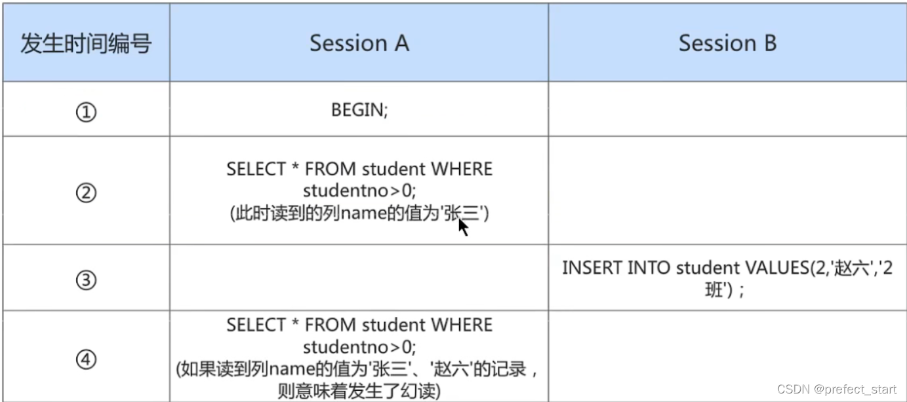

# 一、数据库事务概述

## 1.1 存储引擎支持情况  

`SHOW ENGINES` 命令来查看当前 `MySQL` 支持的存储引擎都有哪些，以及这些存储引擎是否支持事务。  


在 `MySQL` 中，**只有 `InnoDB`** 是**支持事务**的。  

## 1.2  基本概念

**事务**：一组逻辑操作单元，**使数据从一种状态变换到另一种状态**。
**事务处理的原则**：保证**所有事务**都作为 **一个工作单元** 来执行，即使出现了故障，都不能改变这种执行方式。

当在**一个事务中执行多个操作**时，要么**所有的事务都被提交( commit )**，那么这些修改就 **永久** 地保存下来；要么数据库管理系统将 **放弃** 所作的 **所有修改** ，整个事务**回滚( rollback )到最初状态**。  

## 1.3  事务的ACID特性  

### 1.3.1  原子性（atomicity）  

原子性是指事务是一个不可分割的工作单位，**要么全部提交**，**要么全部失败回滚**。  

### 1.3.2  一致性（consistency）  

根据定义，一致性是指**事务执行前后**，数据从一个 **合法性状态** 变换到另外一个 **合法性状态** 。这种状态是 **语义上** 的而不是语法上的，**跟具体的业务有关**。

那什么是**合法的数据状态**呢？满足 **预定的约束** 的状态就叫做合法的状态。通俗一点，这状态是由你自己来定义的（比如满足现实世界中的约束）。**满足这个状态，数据就是一致的，不满足这个状态，数据就是不一致的**！如果事务中的某个操作失败了，系统就会自动撤销当前正在执行的事务，返回到事务操作之前的状态。  


### 1.3.3  隔离型（isolation）  

事务的隔离性是指一个事务的执行 **不能被其他事务干扰** ，即**一个事务内部的操作及使用的数据**对 **并发** 的**其他事务**是**隔离的**，并发执行的各个事务之间**不能互相干扰**。

如果**无法保证隔离性**会怎么样？假设A账户有200元，B账户0元。A账户往B账户**转账两次**，每次金额为50元，分别在**两个事务中执行**。如果无法保证隔离性，会出现下面的情形：  


### 1.3.4 持久性（durability）  

持久性是指**一个事务一旦被提交**，它对数据库中数据的改变就是 **永久性的** ，接下来的**其他操作和数据库故障**不应该对其有**任何影响**。

持久性是通过 **事务日志** 来保证的。日志包括了 **重做日志** 和 **回滚日志** 。

当我们通过事务对数据进行修改的时候，首先会**将数据库的变化信息记录到重做日志中**，然后**再对数据库中对应的行进行修改**。这样做的好处是，即使**数据库系统崩溃**，数据库**重启后**也能**找到**没有更新到数据库系统中的**重做日志**，**重新执行**，从而使事务具有持久性。  

## 1.4  事务的状态  

我们现在知道 **事务** 是一个抽象的概念，它其实对应着一个或多个数据库操作，`MySQL` 根据这些操作所执行的不同阶段把 **事务** 大致**划分成几个状态**：  

- **活动的（active）**

  事务对应的数据库**操作正在执行过程中**时，我们就说该事务处在 活动的 状态。

- **部分提交的（partially committed）**

  当事务中的**最后一个操作执行完成**，但由于操作都在内存中执行，所造成的影响并 **没有刷新到磁盘时**，我们就说该事务处在 部分提交的 状态。

- **失败的（failed）**

  当事务处在 **活动的** 或者 **部分提交的** 状态时，可能**遇到了某些错误**（数据库自身的错误、操作系统错误或者直接断电等）而**无法继续执行**，或者**人为的停止当前事务的执行**，我们就说该事务处在 失败的 状态。  

- **中止的（aborted）**

  如果事务执行了一部分而变为 **失败的** 状态，那么就需要**把已经修改的事务中的操作还原到事务执行前的状态**。换句话说，就是要**撤销失败事务对当前数据库造成的影响**。我们把这个撤销的过程称之为 **回滚** 。当 **回滚** 操作**执行完毕**时，也就是数据库**恢复到了执行事务之前的状态**，我们就说该事务处在了 中止的 状态  

- **提交的（committed）**   

  当一个处在 **部分提交的** 状态的事务将修改过的数据都 **同步到磁盘** 上之后，我们就可以说该事务处在了 提交的 状态  

一个基本的状态转换图如下所示：  


# 二、如何使用事务  

使用事务有两种方式，分别为 **显式事务** 和 **隐式事务** 。  

## 2.1  显式事务  

**步骤1**： `START TRANSACTION` 或者 `BEGIN` ，作用是**显式开启一个事务**。  

`START TRANSACTION` 语句相较于 `BEGIN` 特别之处在于，**后边能跟随几个修饰符** ：  

① **READ ONLY** ：标识当前事务是一个 **只读事务** ，也就是属于该事务的数据库操作**只能读取数据，而不能修改数据**。

② **READ WRITE** ：标识当前事务是一个 **读写事务** ，也就是属于该事务的数据库操作既可以读取数据，也可以修改数据。

③ **WITH CONSISTENT SNAPSHOT** ：启动一致性读。  

**步骤2**：一系列事务中的操作（主要是 `DML` ，**不含 `DDL`**）  

**步骤3**：**提交事务** 或 **中止事务（即回滚事务）**  

```sql
# 提交事务。当提交事务后，对数据库的修改是永久性的。
mysql> COMMIT;

# 回滚事务。即撤销正在进行的所有没有提交的修改
mysql> ROLLBACK;
# 将事务回滚到某个保存点。
mysql> ROLLBACK TO [SAVEPOINT]
```

## 2.2  隐式事务  

`MySQL` 中有一个系统变量 `autocommit` ：  

```sql
mysql> SHOW VARIABLES LIKE 'autocommit';
+---------------+-------+
| Variable_name | Value |
+---------------+-------+
| autocommit | ON |
+---------------+-------+
1 row in set (0.01 sec)
```

在 `ON` 的状态下，每执行一条 `DML` 语句，自动将其视为一个事务进行提交。 

当然，如果我们想**关闭这种自动提交的功能**，可以使用下边两种方法之一：  

1. 显式的的使用 `START TRANSACTION` 或者 `BEGIN` 语句开启一个事务。这样在本次事务提交或者回滚前会暂时关闭掉自动提交的功能。
2. 把系统变量 `autocommit` 的值设置为 OFF ，就像这样：  

```sql
SET autocommit = OFF;
#或
SET autocommit = 0;
```

## 2.3  隐式提交数据的情况  

### 2.3.1  数据定义语言（`DDL`）

数据库对象，指的就是数据库、表、视图、存储过程等结构。当我们**使用CREATE、ALTER、DROP等语句去修改数据库对象**时，就会**隐式的提交前边语句所属于的事务**。

```sql
即:
BEGIN;
SELECT ... #事务中的一条语句
UPDATE ...#事务中的一条语句
...#事务中的其它语句

CREATE TABLE ...#此语句会隐式的提交前边语句所属于的事务
```

### 2.3.2 隐式使用或修改 `mysql` 数据库中的系统表 

当我们使用 `ALTER USER`、`CREATE USER`、`DROP USER`、`GRANT`、`RENAME USER`、`REVOKE`、`SET PASSWORD` 等语句时（**涉及到 `MySQL` 系统表的修改操作**）也会**隐式的提交前边语句所属于的事务**。

### 2.3.3  事务控制或关于锁定的语句

1. 情况一

当我们在**一个事务还没提交或者回滚**时就又使用`START TRANSACTION`或者`BEGIN`语句**开启了另一个事务**时，会**隐式的提交上一个事务**。

```sql
即:
BEGIN;
SELECT ...#事务中的一条语句
UPDATE ...#事务中的一条语句
...#事务中的其它语句
BEGIN;#此语句会隐式的提交前边语句所属于的事务
```

2. 情况二

当前的`autocommit`系统变量的值为`OFF`，我们**手动把它调为`ON`**时，也会**隐式的提交前边语句所属的事务**。

3. 情况三

使用`LOCK TABLES`、`UNLOCK TABLES`等关于锁定的语句也会**隐式的提交前边语句所属的事务**。

### 2.3.4  加载数据的语句

使用 `LOAD DATA` 语句来**批量往数据库中导入数据**时，也会**隐式的提交前达语句所属的事务**。

### 2.3.5  关于 `MySQL` 复制的一些语句

使用 `START SLAVE`、`STOP SLAVE` 、`RESET SLAVE` 、`CHANGE MASTER TO` 等语句时会**隐式的提交前边语句所属的事务**。

### 2.3.6  其它的一些语句

使用 `ANALYZE TABLE`、`CACHE INDEX`、`CHECK TABLE`、`FLUSH`、`LOAD INDEX INTO CACHE`、`OPTIMIZE TABLE`、`REPAIR TABLE`、`RESET` 等语句也会**隐式的提交前边语句所属的事务**。

## 2.4  completion_type参数

```mysql
root@localhost:employees 05:24:36> show variables like '%comple%';
+-----------------+----------+
| Variable_name   | Value    |
+-----------------+----------+
| completion_type | NO_CHAIN |
+-----------------+----------+
1 row in set (0.00 sec) 
```

- **completion=0，这是默认情况**。当我们**执行COMMIT的时候会提交事务**，在执行下一个事务时，还需要使START TRANSACTION 或者 BEGIN 来开启。
- **completion=1**，这种情况下，当我们**提交事务后**，**相当于执行了COMMIT AND CHAIN**，也就是开启一个**链式事务**，即当我们**提交事务之后**会**开启一个相同隔离级别的事务**。
- **completion=2**，这种情况下 COMMIT=COMMIT AND RELEASE，也就是当我们**提交后，会自动与服务器断开连接。**

## 2.5  实践

### 2.5.1  案例一


对于 `myisam` 来说，`BEGIN` 和 `ROLLBACK` 可以执行，但是不起作用。

### 2.5.2  案例二


最后的回滚操作，会直接回到金额为 1000 的状态。

# 三、事务的分类

从事务理论的角度来看，可以把事务分为以下几种类型:

- 扁平事务 (Flat Transactions)

- 带有保存点的扁平事务(Flat Transactions with Savepoints)
- 链事务(Chained Transactions)
- 嵌套事务(Nested Transactions)
- 分布式事务（Distributed Transactions)

下面分别介绍这几种类型:

## 3.1  扁平事务

扁平事务是事务类型中最简单的一种，但是在实际生产环境中，这可能是**使用最频繁的事务**，在扁平事务中，**所有操作都处于同一层次**，其**由BEGIN WORK开始**，**由COMMIT WORK或ROLLBACK WORK结束**，**其间的操作是原子的**，要么都执行，要么都回滚，因此，扁平事务是应用程序成为原子操作的基本组成模块。

扁平事务虽然简单，但是在实际环境中使用最为频繁，也正因为其简单，使用频繁，故每个数据库系统都实现了对扁平事务的支持。扁平事务的**主要限制是不能提交或者回滚事务的某一部分，或分几个步骤提交**。

扁平事务一般有**三种不同的结果**:

1. 事务成功完成。在平常应用中约占所有事务的96%。
2. 应用程序要求停止事务。比如应用程序在捕获到异常时会回滚事务，约占事务的3%。
3. 外界因素强制终止事务。如连接超时或连接断开，约占所有事务的1%。

## 3.2  带有保存点的扁平事务

带有保存点的扁平事务除了**支持扁平事务支持**的操作外，还**允许在事务执行过程中回滚到同一事务中较早的一个状态**。这是因为某些事务可能在执行过程中出现的错误并不会导致所有的操作都无效，放弃整个事务不合乎要求,开销太大。

**保存点 (Savepoint）用来通知事务系统应该记住事务当前的状态**，以便当之后发生错误时，事务能**回到保存点当时的状态**。对于**扁平的事务**来说，**隐式的设置了一个保存点**，然而在整个事务中，只有这一个保存点，因此，**回滚只能会滚到事务开始时的状态**。

## 3.3  链事务

**链事务**是指**一个事务由多个子事务链式组成**，它可以被**视为保存点模式的一个变种**。**带有保存点的扁平事务**，当发生**系统崩溃**时，**所有的保存点都将消失**，这意味着当**进行恢复时**，事务需要**从开始处重新执行**，而不能从**最近的一个保存点**继续执行。

链事务的思想是:在提交一个事务时，释放不需要的数据对象，将必要的处理上下文隐式地传给下一个要开始的事务，**前一个子事务的提交操作和下一个子事务的开始操作合并成一个原子操作**，这意味着下一个事务将看到上一个事务的结果，就好像在一个事务中进行一样。这样，在提交子事务时就可以释放不需要的数据对象，而不必等到整个事务完成后才释放。其工作方式如下:


链事务与带有保存点的扁平事务的不同之处体现在:

1. 带有保存点的扁平事务**能回滚到任意正确的保存点**，而链事务中的回滚**仅限于当前事务**，即**只能恢复到最近的一个保存点**。
2. 对于锁的处理，两者也不相同，**链事务**在**执行COMMIT后即释放了当前所持有的锁**，而带有保存点的扁平事务**不影响迄今为止所持有的锁**。

## 3.4  嵌套事务

`嵌套事务`是一个**层次结构框架**；由一个**顶层事务**（Top-Level  Transaction）控制着**各个层次的事务**，顶层事务之下嵌套的事务被称为**子事务**(Subtransaction)，其控制着每一个局部的变换，**子事务本身也可以是嵌套事务**。因此，嵌套事务的层次结构可以看成是**一棵树**。

## 3.5  分布式事务

`分布式事务`通常是在一个**分布式环境下运行的扁平事务**，因此，需要**根据数据所在位置访问网络中不同节点的数据库资源**。例如，一个银行用户从招商银行的账户向工商银行的账户转账10000元，这里需要用到分布式事务，因为不能仅调用某一家银行的数据库就完成任务。

# 四、事务的隔离级别

`MySQL` 是一个 客户端／服务器 架构的软件，对于同一个服务器来说，可以有若干个客户端与之连接，**每个客户端与服务器连接上之后，就可以称为一个会话（ Session ）**。

每个客户端都可以在自己的会话中向服务器发出请求语句，一个请求语句可能是某个事务的一部分，也就是**对于服务器来说可能同时处理多个事务**。

事务有 **隔离性** 的特性，理论上在某个事务 **对某个数据进行访问** 时，其他事务应该进行 **排队** ，当该事务提交之后，其他事务才可以继续访问这个数据。但是这样对 **性能影响太大** ，我们既想保持事务的隔离性，又想让服务器在处理访问同一数据的多个事务时 **性能尽量高些** ，那就看二者如何权衡取舍了。

## 4.1 数据并发问题

### 4.1.1  脏写（ Dirty Write ）

对于两个事务 Session A、Session B，如果事务Session A 修改了 另一个 **未提交** 事务Session B **修改过** 的数据，那就意味着发生了 **脏写**。如果此时 Session B 进行了回滚，那么 Session A 也会回到**最初的状态**，相当于没有做任何修改操作。


### 4.1.2  脏读（ Dirty Read ）

对于两个事务 Session A、Session B，Session A 读取 了已经被 Session B `更新` 但还 `没有被提交` 的字段。之后若 Session B `回滚` ，Session A 读取 的内容就是 `临时且无效` 的。

Session A和Session B各开启了一个事务，Session B中的事务先将 `studentno` 列为1的记录的name列更新为 张三，然后Session A中的事务再去查询这条 `studentno` 为1的记录，如果读到列name的值为’张三’，而**Session B中的事务稍后进行了回滚**，那么**Session A中的事务相当于读到了一个不存在的数据**，这种现象就称之为 **脏读** 。


### 4.1.3 不可重复读（ Non-Repeatable Read ）

对于两个事务Session A、Session B，**Session A 读取了一个字段**，然后 **Session B更新了该字段**。 之后Session A **再次读取** 同一个字段， **值就不同** 了。那就意味着发生了不可重复读。

我们在Session B中提交了几个 隐式事务 （注意是隐式事务，意味着语句结束事务就提交了），这些事务都修改了 `studentno` 列为1的记录的列name的值，每次事务提交之后，如果Session A中的事务都可以查看到最新的值，这种现象也被称之为 不可重复读 。


### 4.1.4  幻读（ Phantom ）

对于两个事务Session A、Session B, Session A 从一个表中 **读取** 了一个字段, 然后 Session B 在该表中 **插入 了一些新的行**。 之后, 如果 Session A 再次读取 **同一个表**, 就会**多出几行**。那就意味着发生了幻读。

Session A中的事务先根据条件 `studentno > 0` 这个条件查询表 `student` ，得到了 `name` 列值为’张三’的记录；之后Session B中提交了一个 **隐式事务** ，该事务向表 `student` 中**插入了一条新记录**；之后Session A中的事务再根据相同的条件 `studentno > 0` 查询表 `student` ，得到的结果集中包含Session B中的事务新插入的那条记录，这种现象也被称之为 幻读 。我们把**新插入的那些记录称之为 幻影记录** 。



### 4.1.5  注意事项

1. 注意1：

   如果Session B中**剔除**了一些符合 `studentno > 0` 的记录**而不是插入新记录**，那么Session A之后再根据 `studentno > 0` 的条件读取的**记录变少了**，这种现象算不算幻读呢？这种现象**不属于幻读**，幻读强调的是一个事物**按照某个相同条件多次读取记录**时，**后读取时读到了之前没有读到的记录**。

2. 注意2：

   那对于**先前已经读到的记录**，**之后又读取不到**这种情况，算啥呢？这相当于对**每一条记录**都发生了**不可重复读(前后两次读取，状态发生了变化)**的现象。幻读只是重点强调了读取到之前读取没有获取到的记录。

## 4.2  `SQL` 中的四种隔离级别

上面介绍了几种并发事务执行过程中可能遇到的一些问题，**这些问题有轻重缓急之分**，我们给这些问题**按照严重性来排一下序**。我们愿意**舍弃一部分隔离性来换取一部分性能**在这里就体现在：设立一些隔离级别，**隔离级别越低，并发问题发生的就越多**。

`SQL标准`中设立了4个`隔离级别`：

- `READ UNCOMMITTED`：读未提交，在该隔离级别，所有事务都**可以看到其他未提交事务的执行结果**。不能避免脏读、不可重复读、幻读。
- `READ COMMITTED`：读已提交，它满足了隔离的简单定义：**一个事务只能看见已经提交事务所做的改变**。这是**大多数数据库系统的默认隔离级别**（但**不是 `MySQL`默认的**）。可以避免脏读，但不可重复读、幻读问题仍然存在。
- `REPEATABLE READ`：可重复读，事务A在读到一条数据之后，此时事务B对该数据进行了修改并提交，那么事务A再读该数据，**读到的还是原来的内容**。可以避免脏读、不可重复读，但幻读问题仍然存在。这是 **`MySQL`的默认隔离级别**。
- `SERIALIZABLE`：可串行化，确保事务可以从一个表中读取相同的行。在这个**事务持续期间，会使用表锁，禁止其他事务对该表执行读取、插入、更新和删除操作**。所有的并发问题都可以避免，但性能十分低下。能避免脏读、不可重复读和幻读。


脏写怎么没涉及到？因为**脏写这个问题太严重了，不论是哪种隔离级别，都不允许脏写的情况发生。**

不同的隔离级别有不同的现象，并有不同的锁和并发机制，隔离级别越高，数据库的并发性能就越差，**4种事务隔离级别与并发性能的关系如下**:


## 4.3  如何设置事务的隔离级别

方式一：

```sql
SET [GLOBAL|SESSION] TRANSACTION ISOLATION LEVEL 隔离级别; 
#其中，隔离级别格式： 
> READ UNCOMMITTED 
> READ COMMITTED 
> REPEATABLE READ 
> SERIALIZABLE
```

方式二：

```sql
SET [GLOBAL|SESSION] TRANSACTION_ISOLATION = '隔离级别' 
#其中，隔离级别格式： 
> READ-UNCOMMITTED 
> READ-COMMITTED 
> REPEATABLE-READ 
> SERIALIZABLE
```

关于设置时使用GLOBAL或SESSION的影响：

- 使用 GLOBAL 关键字（在全局范围影响）：

```sql
SET GLOBAL TRANSACTION ISOLATION LEVEL SERIALIZABLE;
#或
SET GLOBAL TRANSACTION_ISOLATION = 'SERIALIZABLE';
```

对当前**已经存在的会话无效**，只对执行完该语句**之后产生的会话起作用**。由于只是在内存级别修改该属性，因此**数据库重启后会失效**。

- 使用 SESSION 关键字（在会话范围影响）：

```sql
SET SESSION TRANSACTION ISOLATION LEVEL SERIALIZABLE;
#或
SET SESSION TRANSACTION_ISOLATION = 'SERIALIZABLE';
```

1. 对**当前会话**的**所有后续的事务有效**。
2. 如果在**事务之间执行**，则对**后续的事务有效**。
3. 该语句可以在**已经开启的事务中间执行**，但**不会影响当前正在执行的事务**。

## 4.4  不同隔离级别举例

### 4.4.1  读未提交之脏读

设置隔离级别为未提交读，表的初始化操作为：

```sql
insert into account (id, balance) value(1, 100),(2,0);
```

例1：


例2：


### 4.4.2  读已提交


### 4.4.3  可重复读


### 4.4.4  幻读


在**可重复读**级别下，两次select 查询的结果必须是一样的（不能出现不可重复读问题）。

此时可以通过将事务隔离级别调整为 `SERIALIZABLE` 来解决幻读问题。

在此模式之下，因为**事务1率先对 `id = 3` 的数据进行了操作（进行了读取）**，此时 `MySQL` 就会**使用行锁对 `id = 3` 的数据进行锁定（尽管这条数据还不存在）**。

如果**其他事务**在此之后想要对 `id = 3` 的数据进行操作（读取或者插入）都会**被阻塞**，**直到事务1结束**（commit 或者 rollback），如果事务1插入了 `id = 3` 的新数据，然后 `commit` 。

在 **`commit` 完成的那一刻，其他阻塞的事务得到解放**，如果也是插入操作则将报错。

但因为 **`SERIALIZABLE` 下 `MySQL` 的并发性实在太差，因此为了解决幻读问题，通常的做法是在 `REPEATABLE-READ` 级别下结合 `MVCC` 进行解决。**

#### 幻读的注意事项：

1. **`REPEATABLE-READ + MVCC`** 只能解决**快照读（普通的 select 操作）**的“幻读”问题，从上面的例子中我们看到，在事务 B 插入 id = 3 的数据前后，事务 A 两次 对于 id = 3 的数据的查询结果是一致的，事务 A 不会查询到 "幻影记录"

2. 针对于**当前读**（加锁的 select，select ... for update 等语句）的“幻读”问题则是基于**临键锁**完成的，如果我们在事务 A 第一次查询 id = 3 的数据时，使用 `select * from account where id = 3 for update`，那么事务 B 在执行插入操作时就会因为遇到临键锁而插入失败。
3. “幻读”问题只针对“读”操作有保证，针对“写”操作没有保证，如上所示，事务A在 T3 行执行的写操作就失败了。