# 一、`MySQL` 事务日志

事务有4种特性：原子性、一致性、隔离性和持久性。那么事务的四种特性到底是基于什么机制实现呢？

1. 事务的**隔离性**由**锁机制**实现。
2. 而事务的**原子性、一致性和持久性**由事务的 **redo 日志和undo 日志**来保证。
   1. REDO LOG 称为**重做日志**，提供再写入操作，**恢复提交事务修改的页操作**，用来保证事务的**持久性**。
   2. UNDO LOG 称为**回滚日志**，**回滚行记录到某个特定版本**，用来保证事务的**原子性、一致性**。

有的 `DBA` 或许会认为 `UNDO` 是 `REDO` 的逆过程，其实不然。`REDO` 和 `UNDO` 都可以视为是**一种恢复操作**，但是:

1. redo log：是**存储引擎层**( `innodb` )生成的日志，记录的是**"物理级别"上的页修改操作**，比如页号 `xxx` 、偏移量 `yyy` 写入了 `zzz`数据。将**内存中的记录"恢复"到磁盘中**。主要为了保证数据的**可靠性**;
2. undo log：是**存储引擎层** ( `innodb` )生成的日志，记录的是**逻辑操作日志**，比如对**某一行数据进行了INSERT语句操作，那么undo log就记录一条与之相反的DELETE操作**。主要用于**事务的回滚**(undo log记录的是每个修改操作的逆操作)和**一致性非锁定读**(undo log回滚行记录到某种特定的版本— `MVCC`，即多版本并发控制)。

# 二、`redo` 日志

`InnoDB` 存储引擎是以**页为单位**来管理存储空间的。在**真正访问页面之前**，需要把在**磁盘上的页缓存到内存中的Buffer Pool**之后才可以访问。**所有的变更**都必须**先更新缓冲池中的数据**，然后**缓冲池中的脏页**会以**一定的频率**被**刷入磁盘**（ `checkPoint` 机制)，通过缓冲池来优化CPU和磁盘之间的鸿沟，这样就可以保证整体的性能不会下降太快。

## 2.1  为什么需要REDO日志

一方面，**缓冲池**可以帮助我们**消除CPU和磁盘之间的鸿沟**，**checkpoint机制**可以保证**数据的最终落盘**，然而由于checkpoint并**不是每次变更的时候就触发的**，而是**master线程隔一段时间去处理**的。所以**最坏的情况**就是事务提交后，**刚写完缓冲池，数据库宕机了**，那么**这段数据就是丢失**的，无法恢复。

另一方面，事务包含**持久性**的特性，就是说对于一个已经提交的事务，在**事务提交后**即使**系统发生了崩溃**，这个**事务对数据库中所做的更改也不能丢失**。

那么如何**保证这个持久性**呢？

1. **一个简单的做法**：在**事务提交完成之前**把该事务**所修改的所有页面都刷新到磁盘**，但是这个简单粗暴的做法有些问题：
   1. **修改量与刷新磁盘工作量严重不成比例**
      有时候我们**仅仅修改了某个页面中的一个字节**，但是我们知道在 `InnoDB` 中是**以页为单位来进行磁盘`IO`**的，也就是说我们在该事务提交时**不得不将一个完整的页面从内存中刷新到磁盘**，我们又知道一个页面默认是 `16KB`大小，只修改一个字节就要刷新 `16KB` 的数据到磁盘上显然是太小题大做了。
   2. **随机IO刷新较慢**
      **一个事务可能包含很多语句**，即使是**一条语句也可能修改许多页面**，假如该事务**修改的这些页面可能并不相邻**，这就意味着在将某个事务修改的Buffer Pool中的页面**刷新到磁盘时，需要进行很多的随机IO**，随机IO比顺序IO要慢，尤其对于传统的机械硬盘来说。

2. **另一个解决的思路**：我们**只是想让已经提交了的事务对数据库中数据所做的修改永久生效**，即使**后来系统崩溃**，在**重启后**也能**把这种修改恢复出来**。

   所以我们其实没有必要在每次事务提交时就把该事务在内存中修改过的全部页面刷新到磁盘，**只需要把修改了哪些东西记录一下就好**。比如，某个事务将系统表空间中第10号页面中偏移量为100处的那个字节的值1改成2。我们只需要记录一下：将第0号表空间的10号页面的偏移量为100处的值更新为 2 。

`InnoDB` 引擎的事务采用了 **`WAL` 技术**（write-Ahead Logging)，这种技术的思想就是**先写日志，再写磁盘，只有日志写入成功，才算事务提交成功**，这里的**日志就是redo log**。

**当发生宕机且数据未刷到磁盘的时候，可以通过redo log来恢复**，保证ACID中的D，这就是redo log的作用。
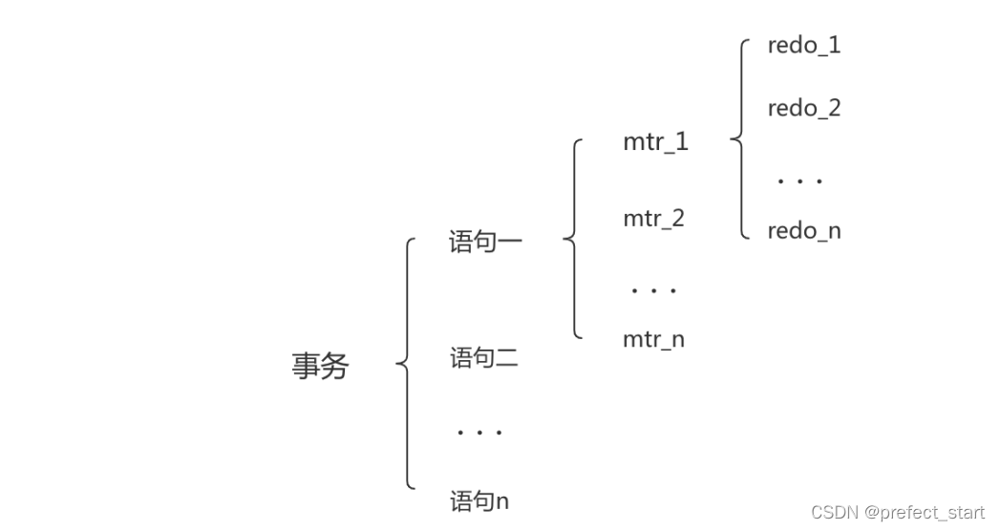

## 2.2  REDO日志的好处

- **redo日志降低了刷盘频率**（不需要每提交一次事务就根据实际修改的页进行一次刷盘操作）
- **redo日志占用的空间非常小**

存储表空间ID、页号、偏移量以及需要更新的值，所需的存储空间是很小的，刷盘快。

## 2.3  REDO日志的特点

- **redo日志是顺序写入磁盘的**
  在执行事务的过程中，每执行一条语句就可能产生若干条redo日志，这些**日志是按照产生的顺序写入磁盘的**，也就是**使用顺序IO**，效率比随机IO快。
- **事务执行过程中，redo log不断记录**
  redo log跟bin log的区别，redo log是存储引擎层产生的，而bin log是数据库层产生的。假设**一个事务**，对表**做10万行的记录插**入，**在这个过程中，一直不断的往redo log顺序记录**，而**bin log不会记录**，直到这个**事务提交，才会一次写入到bin log文件中**。

## 2.4  redo日志的组成

Redo log可以简单分为以下两个部分：

### 2.4.1 重做日志的缓冲 (redo log buffer) 

**保存在内存中**，是易失的。在 **`MySQL`服务器启动时**就向**操作系统**申请了一大片称之为**redo log buffer的连续内存空间**，翻译成中文就是redo日志缓冲区。这片内存空间被**划分成若干个连续的redo log block**。一个redo log block占用**512字节**大小。


参数设置：`innodb_log_buffer_size`：

```sql
show variables like '%innodb_log_buffer_size%';
```

redo log buffer 大小，默认`16M`，最大值是 `4096M`，最小值为 `1M`。

### 2.4.2  重做日志文件 (redo log file)

保存在**硬盘**中，是**持久**的。

## 2.5  redo的整体流程

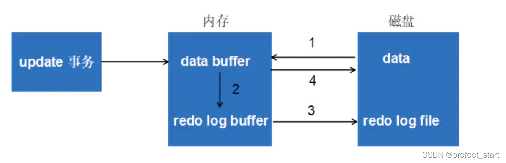

1. 第1步：先将原始数据从磁盘中读入内存中来，修改数据的内存拷贝
2. 第2步：生成一条**重做日志**并写入 `redo log buffer`，**记录的是数据被修改后的值**
3. 第3步：当**事务 `commit`** 时，将**内存中的 `redo log buffer`** 中的内容刷新到**磁盘中的 `redo log file`，**对 `redo log file` 采用**追加写的方式**
4. 第4步：除了通过`redo log` 修改磁盘文件的同时，也会**定期直接将内存中修改的数据刷新到磁盘中**（**通过 redo log file 修改磁盘中的数据库内容**只会发生在 **`MySQL` 服务器重新启动**的时候，**正常运行情况下**都是通过第 4 步 这种方式**将内存中的修改直接刷新到磁盘中**）

## 2.6  redo log的刷盘策略  

redo log的写入**并不是直接写入磁盘**的，`InnoDB` 引擎会在写redo log的时候**先写redo log buffer**，之后以 **一定的频率** **刷入**到真正的**redo log file 中**。这里的一定频率怎么看待呢？这就是我们要说的**刷盘策略**。  


注意：`redo log buffer` 刷盘到 `redo log file` 的过程**并不是真正的刷到磁盘中**去，只是刷入到 **文件系统缓存**（page cache）中去（这是现代操作系统为了提高文件写入效率做的一个优化），**真正的写入会交给系统自己来决定**（比如page cache足够大了）。

那么对于 `InnoDB`来说就**存在一个问题**，**如果交给系统来同步**，同样如果**系统宕机，那么数据也丢失了**（虽然整个系统宕机的概率还是比较小的）  

针对这种情况，`InnoDB` 给出 `innodb_flush_log_at_trx_commit` 参数，该参数**控制 `commit` 提交事务时**，**如何将 `redo log buffer` 中的日志刷新到 `redo log file` 中**。它支持三种策略：  

1. **设置为0** ：表示**每次事务提交**时**不进行刷盘操作**。（系统默认master thread **每隔 `1s` 进行一次重做日志的同步**）  
2. **设置为1** ：表示**每次事务提交**时**都将进行同步**，而且是**直接刷盘到磁盘中**（ `MySQL`默认值 ）  
3. **设置为2** ：表示**每次事务提交**时都只把 `redo log buffer` 内容**写入 page cache**，**不进行刷盘**。由 **`os `决定什么时候同步到磁盘文件**。  

## 2.7  不同刷盘策略演示  

### 2.7.1  流程图展示

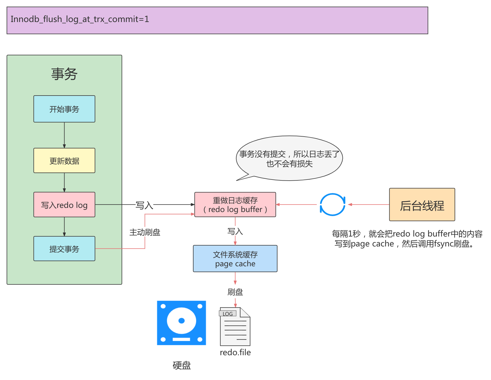

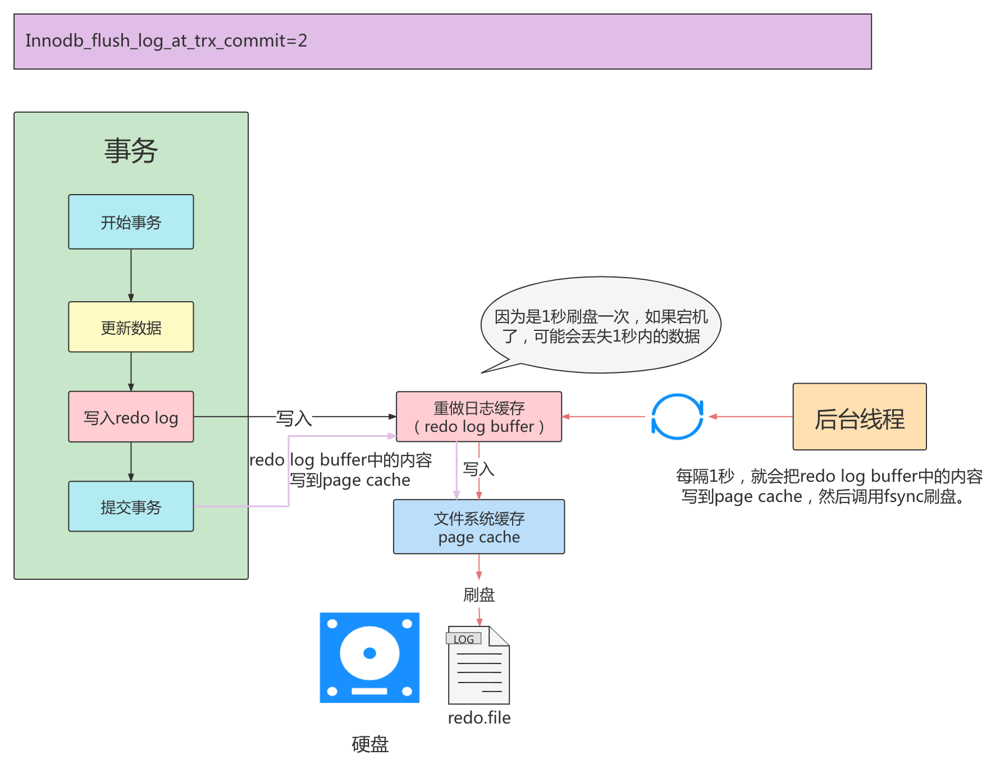

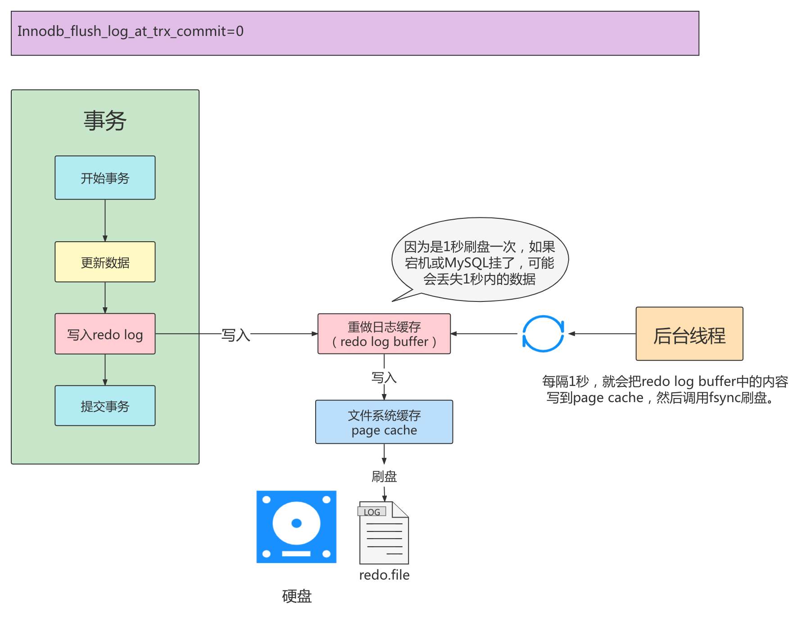

### 2.7.2  案例展示

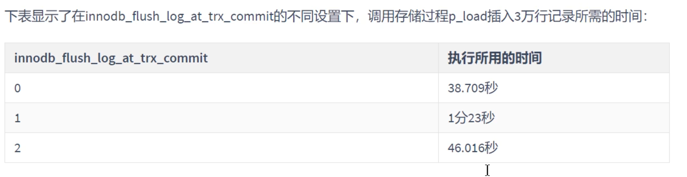


## 2.8  写入redo log buffer过程

### 2.8.1  补充概念:Mini-Transaction

`MySQL` 把对**底层页面**中的**一次原子访问**的过程称之为一个 `Mini-Transaction`，简称 `mtr` ，比如向某个索引对应的B+树中**插入一条记录**的过程就是一个`Mini-Transaction`。**一个 `mtr`**可以包含**一组redo日志(对应一条记录的多个不同的状态)**，在进行崩溃恢复时这一组redo日志作为一个不可分割的整体。

**一个事务**可以包含**若干条语句**，**每一条语句**其实是由**若干个`mtr`（每条 `SQL`语句可能影响多条记录）**组成，**每一个`mtr`**又可以包含**若干条`redo`日志**，画个图表示它们的关系就是这样:


### 2.8.2  redo日志写入log buffer

向log buffer中写入redo日志的过程是**顺序的**，也就是先往前边的block中写，当该block的空闲空间用完之后再往下一个block中写。

当我们想往log buffer中写入redo日志时，第一个遇到的问题就是**应该写在哪个block的哪个偏移量处**，所以 `InnoDB` 的设计者特意提供了一个称之为 **`buf_free` 的全局变量**，该变量**指明后续写入的redo日志应该写入到log buffer 中的哪个位置**，如图所示:


一个 `mtr` 执行过程中可能产生若干条redo日志，这些redo日志是一个不可分割的组，所以其实**并不是每生成一条redo日志，就将其插入到log buffer中**，而是**每个 `mtr` 运行过程中产生的日志先暂时存到一个地方**，**当该 `mtr`结束的时候，将过程中产生的一组redo日志再全部复制到log buffer中。**

例：我们现在假设有两个名为 `T1`、`T2` 的事务，每个事务都包含2个 `mtr` ，我们给这几个`mtr` 命名一下:

- 事务 `T1` 的两个 `mtr` 分别称为 `mtr_T1_1` 和 `mtr_T1_2` 。
- 事务 `T2` 的两个 `mtr` 分别称为 `mtr_T2_1` 和 `mtr_T2_2`。

**每个 `mtr` 都会产生一组 `redo` 日志**，用示意图来描述一下这些 `mtr` 产生的日志情况:


**不同的事务可能是并发执行的**，所以 `T1`、`T2` 之间的 `mtr` **可能是交替执行的**。每当一个 `mtr` 执行完成时，伴随该 `mtr` 生成的一组 `redo` 日志就需要被复制到 `log buffer` 中，也就是说**不同事务的 `mtr` 可能是交替写入 `log buffer` 的**，我们画个示意图(为了美观，我们把一个 `mtr` 中产生的所有的redo日志当作一个整体来画)︰


有的 `mtr` 产生的redo日志量非常大，比如 `mtr_t1_2` 产生的redo日志占用空间比较大，占用了3个block来存储。

### 2.8.3  redo log block的结构图

一个 `redo log block` 是由**日志头、日志体、日志尾**组成。`日志头`占用`12`字节，`日志尾`占用`8`字节，所以一个block真正能存储的数据就是512-12-8=`492`字节。


**为什么一个block设计成512字节?**

这个和磁盘的扇区有关，**机械磁盘默认的扇区就是512字节**，如果你要写入的数据大于512字节，那么要写入的扇区肯定不止一个，这时就要涉及到盘片的转动，找到下一个扇区，假设现在需要写入两个扇区A和B，如果扇区A写入成功，而扇区B写入失败，那么就会出现非原子性的写入，而如果**每次只写入和扇区的大小一样的512字节，那么每次的写入都是原子性的。**

## 2.9  redo log file

### 2.9.1  相关参数设置

- `innodb_log_group_home_dir` ：指定 **redo log 文件组所在的路径**，默认值为 `./` ，表示**在数据库的数据目录下**。`MySQL` 的默认数据目录（ `var/lib/mysql` ）下**默认有两个名为 `ib_logfile0` 和 `ib_logfile1` 的文件**，log buffer中的日志默认情况下就是**刷新到这两个磁盘文件中**。此redo日志文件位置还可以修改。
- `innodb_log_files_in_group`：指明**redo log file的个数**，命名方式如：`ib_logfile0`，`ib_logfile1`… `ib_logfilen`。**默认2个**，最大100个。
- `innodb_flush_log_at_trx_commit`：控制 **redo log 刷新到磁盘的策略**，默认为1。
- `innodb_log_file_size`：**单个 redo log 文件设置大小**，默认值为 `48M` 。最大值为 `512G` ，注意最大值指的是整个 `redo log` 系列文件之和，即（ `innodb_log_files_in_group * innodb_log_file_size` ）不能大于最大值`512G`。

### 2.9.2  日志文件组

从上边的描述中可以看到，**磁盘上的redo日志文件不只一个**，而是**以一个日志文件组的形式出现**的。这些文件以 **`ib_logfile` [数字]（数字可以是0、1、2...）**的形式**进行命名**，每个的redo日志文件**大小都是一样的**。

在将redo日志写入日志文件组时，是**从 `ib_logfile0` 开始写**，如果 `ib_logfile0` 写满了，就**接着 `ib_logfile1` 写**。同理,  `ib_logfile1` 写满了就去写 `ib_logfile2` ，依此类推。

如果**写到最后一个文件**该咋办？那就**重新转到 `ib_logfile0` 继续写**，所以整个过程如下图所示:


**总共的redo日志文件大小**其实就是：

`innodb_log_file_size × innodb_log_files_in_group` 。

采用**循环使用的方式**向redo日志文件组里写数据的话，会导致后**写入的redo日志覆盖掉前边写的redo日志**？当然！所以 `InnoDB`的设计者提出了 `checkpoint`的概念。

### 2.9.3 checkpoint

在整个日志文件组中还有两个重要的属性，分别是 `write pos`、`checkpoint`

- `write pos`是**当前记录的位置**，一边写一边后移
- `checkpoint`是**当前要擦除的位置**，也是往后推移

每次刷盘redo log记录到日志文件组中，`write pos` 位置就会后移更新。每次 `MySQL` **加载日志文件组恢复数据**时，会**清空加载过的 `redo log`记录**，并**把 `checkpoint` 后移更新**。

**`write pos` 和 `checkpoint` 之间的还空着的部分**可以用来**写入新的redo log记录**。


如果 **`write pos` 追上 `checkpoint` ，表示日志文件组满了**，这时候**不能再写入新的 redo log记录**，`MySQL` 得**停下来，清空一些记录**，把 checkpoint 推进一下。


## 2.10  redo log小结

`InnoDB` 的更新操作采用的是 `Write Ahead Log` (预先日志持久化)策略，即**先写日志，再写入磁盘**。


# 三、`undo` 日志

`redo log` 是事务**持久性**的保证，`undo log` 是事务**原子性**的保证。在事务中**更新数据的前置操作**其实是要**先写入一个 undo log** 。

## 3.1  如何理解Undo日志

事务需要保证**原子性**，也就是事务中的操作要么全部完成，要么什么也不做。但有时候事务执行到一半会出现一些情况，比如：

- 情况一：事务执行过程中可能遇到各种错误，比如**服务器本身的错误**，**操作系统错误**，甚至是突然**断电导致的错误**。
- 情况二：程序员可以在事务执行过程中**手动输入ROLLBACK语句**结束当前事务的执行。

以上情况出现，我们需要**把数据改回原先的样子**，这个过程称之为**回滚**，这样就可以造成一个假象：这个**事务看起来什么都没做**，所以符合**原子性**要求。

每当我们要**对一条记录做改动**时(这里的改动可以指 `INSERT`、`DELETE`、`UPDATE` )，**把回滚时所需的东西记下来**。比如:

1. 你**插入**一条记录时，至少要把**这条记录的主键值记下来**，之后**回滚的时候**只需要把这个**主键值对应的记录删掉**就好了。(对于**每个 `INSERT `**, `InnoDB` 存储引擎会完成**一个`DELETE`**)
2. 你**删除**了一条记录，至少要把**这条记录中的内容都记下来**，这样之后**回滚**时再把**由这些内容组成的记录插入到表中**就好了。(对于**每个`DELETE`**，`InnoDB`存储引擎会执行**一个 `INSERT`**)
3. 你**修改**了一条记录，至少要把修改**这条记录修改前的旧值都记录下来**，这样之后**回滚**时再把这条**记录更新为旧值**就好了。(对于**每个`UPDATE`**，`InnoDB` 存储引擎会**执行一个相反的 `UPDATE`**，将修改前的行放回去)

`MySQL` 把这些**为了回滚而记录的内容**称之为**撤销日志**或者**回滚日志(即undo log)**。注意，由于**查询操作( SELECT ）并不会修改任何用户**记录，所以在查询操作执行时，并**不需要记录相应的undo日志**。

## 3.2  Undo日志的作用

### 3.2.1  作用1：回滚数据

用户对undo日志可能有**误解**：undo log 用于将数据库**物理地恢复**到执行语句或事务之前的样子。但事实并非如此。undo是**逻辑日志**，因此**只是将数据库逻辑地恢复到原来的样子**。所有**修改都被逻辑地取消**了，但是**数据结构和页本身在回滚之后可能大不相同**。这是因为在多用户并发系统中，可能会有数十、数百甚至数千个并发事务。数据库的主要任务就是协调对数据记录的并发访问。比如，**一个事务在修改当前一个页中某几条记录**，同时还有**别的事务**在对**同一个页中另几条记录进行修改**。因此，**不能将一个页回滚到事务开始的样子**，因为这样**会影响其他事务正在进行的工作**。

### 3.2.2  作用2：`MVCC`

undo的另一个作用是 `MVCC`，即在 `InnoDB` 存储引擎中 `MVCC` 的实现是通过undo来完成。当**用户读取一行记录时**，若**该记录已经被其他事务占用**，当前事务可以**通过undo读取之前的行版本信息**，以此**实现非锁定读取**

## 3.3  undo的存储结构                                         

### 3.3.1  回滚段与undo页

`InnoDB` 对 `undo log` 的管理**采用段的方式**，也就是**回滚段**（rollback segment）。**每个回滚段**记录了**1024个undo log segment**，而在**每个undo log segment段**中**进行undo页的申请**。

- 在 `InnoDB 1.1`版本之前(不包括1.1版本)，**只有一个 `rollback segment`** ，因此支持**同时在线的事务限制为 `1024`** 。虽然对绝大多数的应用来说都已经够用。
- 从1.1版本开始 `InnoDB` 支持**最大 `128` 个 `rollback segment`**，故其支持**同时在线的事务限制提高到了 `128*1024`**。

虽然 **`InnoDB 1.1` 版本**支持了`128个rollback segment`，但是这些**rollback segment都存储**于**共享表空间 `ibdata`** 中。从 **`InnoDB 1.2`版本开始**，可通过参数对rollback segment做**进一步的设置**。这些参数包括:

1. `innodb_undo_directory`：设置**rollback segment文件所在的路径**。这意味着rollback segment可以**存放在共享表空间以外的位置**，即可以设置为**独立表空间**。该参数的**默认值为“./”**，表示**当前 `InnoDB` 存储引擎的目录**。
2. `innodb_undb_logs`：**设置 `rollback segment`的个数**，默认值为128。在 `lnnoDB 1.2`版本中，该参数用来替换之前版本的参数 `innodb_rollback_segments`。
3. `innodb_undo_tablespaces`：设置**构成 `rollback segment`文件的数量**，这样rollback segment可以较为平均地分布在多个文件中。设置该参数后，会在路径 `innodb_undo_directory` 看到**undo为前缀的文件**，该文件就代表rollback segment文件。

### 3.3.2  undo页的重用

当我们**开启一个事务**需要**写undo log的时候**，就得先去**undo log segment中**去**找到一个空闲的位置**，当有空位的时候，就**去申请undo页**，在这个**申请到的undo页中进行undo log的写入**。

我们知道 `mysql` 默认一页的大小是 `16k` 。为**每一个事务分配一个页，是非常浪费的**（除非你的事务非常长)，假设你的应用的 `TPS`(每秒处理的事务数目）为 `1000`，那么 `1s` 就需要1000个页，大概需要 `16M` 的存储，1分钟大概需要 `1G` 的存储。如果照这样下去除非 `MySQL` 清理的非常勤快，否则随着时间的推移，**磁盘空间会增长的非常快，而且很多空间都是浪费的。**

于是**undo页**就**被设计的可以重用**了，当**事务提交时，并不会立刻删除undo页**。因为重用，所以这个undo页可能混杂着其他事务的undo log。**undo log在commit后，会被放到一个链表中**，然后**判断undo页的使用空间是否小于3/4**，如果小于3/4的话，则表示**当前的undo页可以被重用**，那么它**就不会被回收**，**其他事务的undo log**可以**记录在当前undo页的后面**。

由于undo log是离散的，所以清理对应的磁盘空间时，效率不高。

### 3.3.3  回滚段与事务

- 每个事务只会使用一个回滚段，一个回滚段在同一时刻可能会服务于多个事务。
- 当一个事务开始的时候，会制定一个回滚段，在事务进行的过程中，**当数据被修改时，原始的数据会被复制到回滚段**。
- 在回滚段中，**事务会不断填充盘区，直到事务结束或所有的空间被用完**。如果当前的盘区不够用，事务会**在段中请求扩展下一个盘区**，如果所有已分配的盘区都被用完，事务会**覆盖最初的盘区**或者在**回滚段允许的情况下扩展新的盘区**来使用。
- 回滚段存在于undo表空间中，在数据库中**可以存在多个undo表空间**，但**同一时刻只能使用一个undo表空间**。
- 当事务提交时，`InnoDB` 存储引擎会做以下两件事情：
  1. 将 `undo log` 放入列表中，以供之后的 `purge` 操作
  2. 判断 `undo log` 所在的页**是否可以重用**，若可以分配给下个事务使用

## 3.4  回滚段中的数据分类

1. **未提交的回滚数据**(uncommitted undo information)：该数据所关联的事务并未提交，用于实现读一致性，所以该数据**不能被其他事务的数据覆盖**。
2. **已经提交但未过期的回滚数据(** committed undo information)：该数据关联的事务已经提交，但是仍**受到undo retention参数的保持时间的影响**。
3. **事务已经提交并过期的数据**( expired undo information)：事务已经提交，而且数据保存时间已经超过undo retention参数指定的时间，属于已经过期的数据。当回滚段满了之后，会**优先覆盖该类型的数据**。

**事务提交后**并**不能马上删除undo log及undo log所在的页**。这是因为可能还有**其他事务需要通过undo  log来得到行记录之前的版本（ `MVCC`机制）**。故事务提交时将undo log放入一个链表中，是否可以最终删除undo log及undo  log所在页**由purge线程来判断**。

## 3.5  undo的类型

在 `InnoDB` 存储引擎中，undo log分为：

- insert undo log

  insert undo log 是指**在insert操作中产生的undo log**。因为insert操作的记录，**只对事务本身可见，对其他事务不可见**(这是**事务隔离性**的要求)，故**该undo log可以在事务提交后直接删除**。**不需要进行purge操作**。

- update undo log

  update undo log 记录的是**对delete和update操作产生的undo log**。该undo log可能**需要提供 `MVCC` 机制**，因此**不能在事务提交时就进行删除**。事务在提交后需要将对应的 undo log 放入**undo log链表**，等待**purge线程**进行最后的删除。

## 3.6  undo log的生命周期

### 3.6.1  简要生成过程

以下是undo+redo事务的简化过程：

假设有2个数值，分别为A=1和B=2，然后将A修改为3，B修改为4。


1. 在**1-8步骤**的任意一步系统宕机，**事务未提交**，该事务就**不会对磁盘上的数据做任何影响**。
2. 如果**在8-9之间**宕机，恢复之后**可以选择回滚**，也**可以选择**继续**完成事务提交**，因为此时**redo log已经持久化**。
3. 若在**9之后**系统宕机，因为**已经完成了持久化**，所以不会有任何影响。

**只有Buffer Pool的流程：**

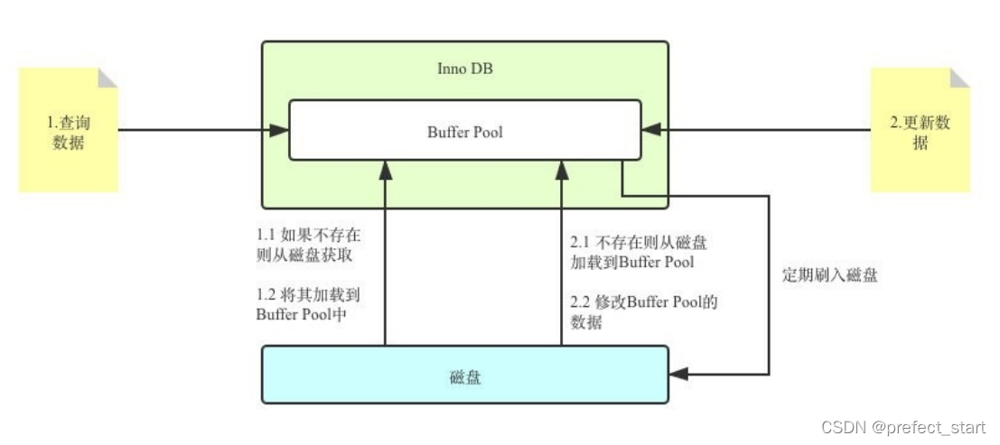

**有了Redo Log和Undo Log之后：**

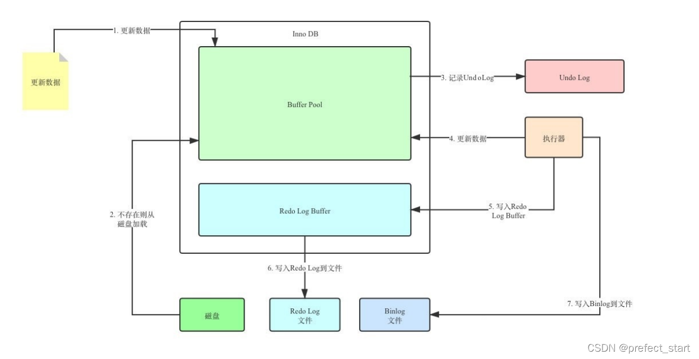

在**更新**Buffer Pool中的**数据之前**，我们需要**先将**该数据**事务开始之前的状态写入Undo Log中**。假设**更新到一半出错**了，我们就可以**通过Undo Log**来**回滚到事务开始前的状态**。

### 3.6.2 详细生成过程

对于 `InnoDB`引擎来说，**行格式**除了记录本身的数据之外，还有几个**隐藏列**:

- `DB_ROW_ID`  :  如果没有为表显式的定义主键，并且表中也没有定义唯一索引，那么`InnoDB`会自动为表添加一个row_id的隐藏列作为主键。
- `DB_TRX_ID`  :  **每个事务都会分配一个事务ID**，当对某条记录发生变更时，就会将这个事务的事务ID写入 `trx_id`中。
- `DB_ROLL_PTR`  :  **回滚指针**，本质上就是**指向undo log的指针**。

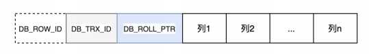

#### 3.6.3.1 执行INSERT时

```sql
begin; 
INSERT INTO user (name) VALUES ("tom");
```

**插入的数据都会生成一条insert undo log**，并且**数据的回滚指针会指向它**。undo log会记录**undo log的序号**、**插入主键的列和值**…，那么在**进行 `rollback` 的时候**，**通过主键直接把对应的数据删除**即可。

#### 3.6.3.2  执行UPDATE时

对于**更新的操作会产生update undo log**，并且会分**更新主键的**和**不更新主键的**，假设现在执行:

```sql
## 不更新主键
UPDATE user SET name=" Sun" WHERE id=1 ;
```

这时会把**老的数据记录**写入**新的undo log**，让**回滚指针指向新的undo log**，它的undo no是1，并且**新的undo log会指向老的undo log** (undo no=0) .

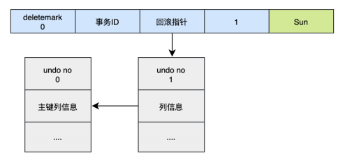

```sql
# 更新主键的
UPDATE user SET id=2 WHERE id=1;
```

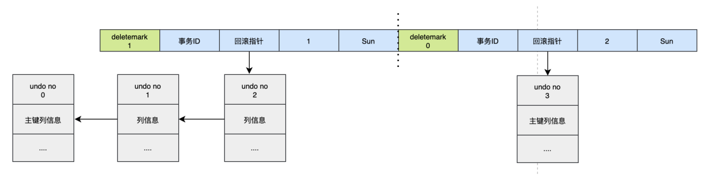

对于**更新主键的操作**，会先把**原来的数据 `deletemark` 标识置为1**，这时并**没有真正的删除数据**，真正的删除会**交给清理线程去判断**。然后**在后面插入一条新的数据**，**新的数据也会产生undo log**，并且undo log的序号会递增。

可以发现**每次对数据的变更都会产生一个undo log**，当一条记录被变更多次时，那么就会产生多条undo log，undo  log记录的是变更前的日志，并且每个undo log的序号是递增的，那么**当要回滚的时候，按照序号依次向前推**，就可以找到我们的**原始数据**了。


### 3.6.3  undo log是如何回滚的

以**上面的例子**来说，假设**执行 `rollback`**，那么对应的流程应该是这样：

1. 通过undo no=3的日志把id=2的数据删除
2. 通过undo no=2的日志把id=1的数据的 `deletemark`还原成0
3. 通过undo no=1的日志把id=1的数据的name还原成Tom
4. 通过undo no=0的日志把id=1的数据删除

### 3.6.4 undo log的删除

- 针对于insert undo log


因为insert操作的记录，只对事务本身可见，对其他事务不可见。故该undo log可以在**事务提交后直接删除**，**不需要进行purge操作**。

- 针对于update undo log


该undo log可能**需要提供 `MVCC`机制**，因此**不能在事务提交时就进行删除**。提交时放入undo log链表，**等待purge线程进行最后的删除**。

> 补充:
> purge线程两个主要作用是：清理undo页和清除page里面带有Delete_Bit标识的数据行。
> 在 `InnoDB`中，事务中的Delete操作实际上并不是真正的删除掉数据行，而是一种Delete Mark操作，在记录上标识Delete_Bit，而不删除记录。是一种"假删除";只是做了个标记，真正的删除工作需要后台purge线程去完成。
