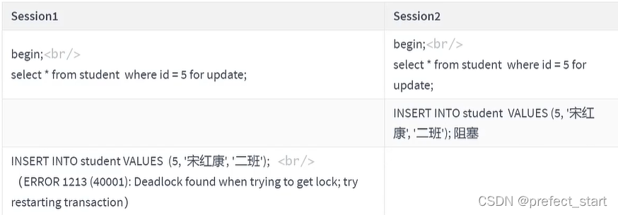
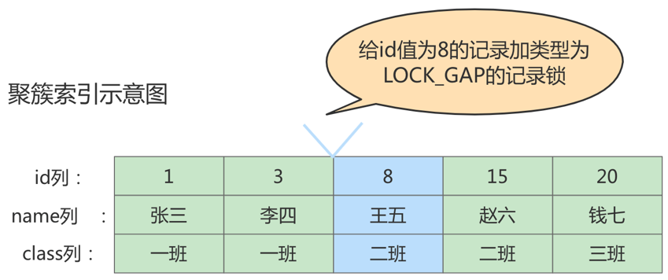
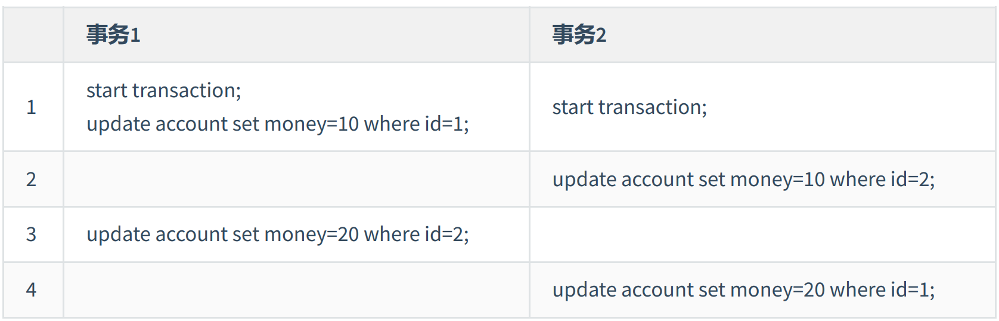

# 一、概述

锁是计算机协调多个进程或线程**并发访问某一资源**的机制。在程序开发中会存在多线程同步的问题，当多个线程并发访问某个数据的时候，尤其是针对一些敏感的数据(比如订单、金额等)，我们就需要保证这个数据在任何时刻最多只有一个线程在访问，保证数据的完整性和一致性。在开发过程中**加锁是为了保证数据的一致性**，这个思想在数据库领域中同样很重要。

在数据库中，除传统的计算资源（如CPU、RAM、I/O等）的争用以外，**数据也是一种供许多用户共享的资源**。为**保证数据的一致性**，需要对 **并发操作进行控制** ，因此产生了锁 。同时 **锁机制** 也为实现 `MySQL`的**各个隔离级别**提供了保证。 **锁冲突**也是影响**数据库并发访问性能**的一个重要因素。

# 二、`MySQL` 并发事务访问相同记录

## 2.1  读-读情况

读-读情况，即**并发事务**相继**读取相同的记录**。读取操作本身不会对记录有任何影响，并不会引起什么问题，所以**允许这种情况的发生(而不需要加锁)**。

## 2.2  写-写情况

写-写情况，即**并发事务**相继对**相同的记录做出改动**。
在这种情况下会发生**脏写**的问题，**任何一种隔离级别都不允许这种问题的发生**。所以在多个未提交事务相继对一条记录做改动时，需要让它们**排队执行**，这个**排队的过程**其实是**通过锁来实现**的。

这个所谓的**锁**其实是**一个内存中的结构**，在事务执行前本来是没有锁的，也就是说**一开始是没有锁结构和记录进行关联的**，当一个事务想对这条**记录做改动时**，首先会看看内存中**有没有与这条记录关联的锁结构**，当没有的时候就会在内存中生成一个锁结构与之关联。比如，事务 `T1` 要对这条记录做改动，就需要**生成一个锁结构与之关联**:



在锁结构里有很多信息，为了简化理解，只把两个比较重要的属性拿了出来：

- `trx`信息︰代表这个锁结构是**哪个事务生成的**。

- `is_waiting` ：代表当前事务**是否在等待(被前面的锁阻塞)**。

  当事务 `T1` 改动了这条记录后，就生成了一个锁结构与该记录关联，因为**之前没有别的事务为这条记录加锁**，所以 `is_waiting` 属性**就是false**，我们把这个场景就称之为**获取锁成功**，或者加锁成功，然后就可以继续执行操作了。

在事务 `T1`提交之前，**另一个事务 `T2` 也想对该记录做改动**，那么先看看有没有锁结构与这条记录关联，发现有一个锁结构与之关联后，然后也生成了一个锁结构与这条记录关联，不过锁结构的is_waiting**属性值为true，表示当前事务需要等待**，我们把这个场景就称之为**获取锁失败**，或者加锁失败，图示:


在**事务 `T1` 提交之后**，就会把该事务生成的锁结构释放掉，然后看看还**有没有别的事务在等待获取锁**，发现了事务 `T2` 还在等待获取锁，所以把事务 `T2` 对应的锁结构的 `is_waiting` 属性设置为 `false` ，然后**把该事务对应的线程唤醒**，让它继续执行，此时事务 `T2` 就算获取到锁了。效果图就是这样:


## 2.3  读-写或写-读情况

`读-写`或`写-读`，即一个事务进行读取操作，另一个进行改动操作。这种情况下可能发生**脏读、不可重复读、幻读**的问题。

## 2.4  并发问题的解决方案

怎么解决`脏读`、`不可重复读`、`幻读`这些问题呢？其实有两种可选的解决方案：

### 2.4.1  方案一

读操作利用多版本并发控制（`MVCC`），写操作进行`加锁`。

所谓的 `MVCC` ，就是生成一个 `ReadView` ，通过 `ReadView` 找到符合条件的记录版本（历史版本由undo日志构建）。

**查询**语句**只能**读到在生成 `ReadView` 之前**已提交事务**所做的更改，在生成 `ReadView` 之前未提交的事务或者之后才开启的事务所做的更改是看不到的。而**写操作**肯定针对的是**最新版本的记录**，**读记录**的**历史版本**和改动记录的**最新版本**本身**并不冲突**，也就是采用 `MVCC` 时，**读-写操作并不冲突**。

> 普通的 `SELECT` 语句在 `READ COMMITTED` 和 `REPEATABLE READ`隔离级别下会使用到 `MVCC` 读取记录。
>
> - 在 `READ COMMITTED` 隔离级别下，一个事务在执行过程中**每次执行SELECT操作**时**都会**生成一个 `ReadView`，`ReadView` 的存在本身就保证了事务**不可以读取到未提交的事务**所做的更改，也就是**避免了脏读现象**；
> - 在 `REPEATABLE READ` 隔离级别下，一个事务在执行过程中只有**第一次执行SELECT操作** 才会生成一个 `ReadView`，**之后的SELECT**操作都**复用**这 `ReadView`，这样也就**避免了不可重复读和幻读**的问题。

### 2.4.2  方案二

读、写操作都采用**加锁**的方式。

如果我们的一些业务场景**不允许读取记录的旧版本**，而是**每次都必须去读取记录的最新版本**。

比如，在银行存款的事务中，你需要先把账户的余额读出来，然后将其加上本次存款的数额，最后再写到数据库中。在将账户余额读取出来后，就不想让别的事务再访问该余额，直到本次存款事务执行完成，其他事务才可以访问账户的余额。

这样在**读取记录的时候**就需要对其**进行加锁**操作，这样也就意味着**读操作**和**写操作**也像写-写操作那样**排队执行**。

1. **脏读**的产生是因为当前事务读取了另一个**未提交事务写的一条记录**，如果另一个事务在**写记录的时候**就给**这条记录加锁**，那么**当前事务**就**无法继续读取该记录**了，所以也就**不会有脏读问题**的产生了。
2. **不可重复读**的产生是因为当前事务先读取一条记录，另外一个事务对该记录做了改动之后并提交之后，当前事务再次读取时会获得不同的值，如果在当前事务**读取记录**时就给**该记录加锁**，那么**另一个事务就无法修改该记录**，自然也**不会发生不可重复读**了。
3. **幻读**问题的产生是因为当前事务**读取了一个范围的记录**，然后另外的事务**向该范围内插入了新记录**，当前事务再次读取该范围的记录时发现了新插入的新记录。采用**加锁的方式解决幻读问题就有一些麻烦**，因为当前事务在第一次读取记录时幻影记录并不存在，所以读取的时候加锁就有点尴尬（因为你**并不知道给谁加锁**)。`InnoDB` 会通过使用间隙锁、临建锁来解决这个问题。

### 2.4.3 小结

1. `MVCC`方式的话，`读-写`操作**彼此并不冲突**，**性能更高**。
2. 采用`加锁`方式的话，`读-写`操作**彼此需要排队执行**，**影响性能**。

**一般情况**下我们当然**愿意采用 `MVCC` 来解决 `读-写` 操作并发执行的问题**，但是业务在某些特殊情况下，要求必须采用 `加锁` 的方式执行。

# 三、锁的不同角度分类

锁的分类图，如下：


## 3.1  从数据操作的类型划分：读锁、写锁

`MySQL` 实现一个由两种类型的锁组成的锁系统来解决。这两种类型的锁通常被称为**共享锁**（`Shared Lock`，**S Lock**)和**排他锁**（`Exclusive Lock`, **X Lock**) ,也叫**读锁**（`readlock`)和**写锁**(`write lock`)。

- `读锁`：也称为`共享锁`、英文用`S`表示。针对**同一份数据**，**多个事务的读操作**可以**同时进行而不会互相影响**，相互不阻塞的。
- `写锁`：也称为`排他锁`、英文用`X`表示。当前**写操作没有完成前**，它会**阻断其他写锁和读锁**。这样就能确保在给定的时间里，只有一个事务能执行写入，并防止其他用户读取正在写入的同一资源。

需要注意的是**对于 `InnoDB` 引擎**来说，**读锁和写锁**可以**加在表上**，也可以**加在行上**。而对于 **`MyISAM` 引擎**，只能**加在表上**。

举例（**行级**读写锁)：如果一个事务 `T1` 已经获得了某个行 `r` 的读锁，那么此时另外的一个事务 `T2` 是可以去获得这个行 `r` 的读锁的，因为读取操作并没有改变行 `r`的数据；但是，如果**某个事务 `T3` 想获得行 `r`的写锁**，则它必须**等待事务 `T1`、`T2` 释放掉行 `r` 上的读锁**才行。


总结：这里的兼容是指对同一张表（表锁）或同一条记录的锁（行锁）的兼容性情况。

### 3.1.1  读操作

在采用`加锁`方式解决`脏读`、`不可重复读`、`幻读`这些问题时，读取一条记录时需要获取该记录的`S锁`，其实是不严谨的，**有时候需要在读取记录时就获取记录的`X锁`**，来**禁止别的事务读写该记录**，为此 `MySQL` 提出了两种比较特殊的 `SELECT` 语句格式：

1. 对读取的**记录**加`S锁`：

```sql
SELECT ... LOCK IN SHARE MODE;
# 或
SELECT ... FOR SHARE; #(8.0新增语法)
```

在**普通的SELECT语句后边加 `LOCK IN SHARE MODE` **，如果当前事务执行了该语句，那么它会为读取到的记录加S锁，这样**允许别的事务继续获取这些记录的S锁**(比方说别的事务也使用 `SELECT … LOCKMODE` 语句来读取这些记录)，**但是不能获取这些记录的X锁**（比如使用 `SELECT … FOR UPDATE` 语句来读取这些记录，或者直接修改这些记录)。如果**别的事务想要获取这些记录的X锁，那么它们会阻塞**，**直到当前事务提交**之后将这些记录上的S锁释放掉。

2. 对读取的**记录**加`X锁`：

```sql
SELECT ... FOR UPDATE;
```

在**普通的 `SELECT` 语句后边加 `FOR UPDATE` **，如果当前事务执行了该语句，那么它会为读取到的记录加X锁，这样**既不允许别的事务获取这些记录的S锁**（比方说别的事务使用 `SELECT … LOCK IN SHARE MODE` 语句来读取这些记录)，**也不允许获取这些记录的X锁**(比如使用 `SELECT … FOR UPDATE` 语句来读取这些记录，或者直接修改这些记录)。如果**别的事务想要获取这些记录的S锁或者X锁，那么它们会阻塞**，**直到当前事务提交**之后将这些记录上的X锁释放掉。

**`MySQL 8.0`新特性：**

**在`5.7`及之前的版本**，`SELECT … FOR UPDATE`，如果**获取不到锁，会一直等待，直到 `innodb_lock_wait_timeout` 超时**。在 `8.0` 版本中，`SELECT … FOR UPDATE` , `SELECT … FOR SHARE` **添加 `NOWAIT` 、`SKIP LOCKED` 语法**，**跳过锁等待，或者跳过锁定。**

- `NOWAIT`：如果查询的行已经加锁，会**立即报错返回**
- `SKIP LOCKED`：如果查询的行已经加锁，**只返回结果中不包含被锁定的行**

### 3.1.2  写操作

平常所用到的写操作无非是 DELETE、UPDATE、INSERT这三种:

- `DELETE`：对一条记录做DELETE操作的过程其实是先在 `B+` 树中定位到这条记录的位置，然后**获取这条记录的 `X锁`** ，**再执行`delete mark`操作**。我们也可以把这个定位待删除记录在B+树中位置的过程**看成是一个获取X锁的锁定读**。
- `INSERT`：一般情况下，**新插入一条记录的操作并不加锁**，通过一种称之为**隐式锁的结构**来保护这条**新插入的记录在本事务提交前不被别的事务访问**。
- `UPDATE`：在对一条记录做UPDATE操作时分为三种情况：
  - 情况1：**未修改该记录的键值**，并且被**更新的列**占用的**存储空间**在**修改前后未发生变化**。则先在`B+`树中定位到这条记录的位置，然后再**获取记录的`X锁`**，最后在**原记录的位置进行修改操作**。
  - 情况2：**未修改该记录的键值**，并且**至少有一个被更新的列**占用的**存储空间**在**修改前后发生变化**。则先在`B+`树中定位到这条记录的位置，然后**获取记录的`X锁`**，将**该记录彻底删除掉**（就是把记录彻底移入垃圾链表），最后**再插入一条新记录**。新插入的记录由**`INSERT`操作提供的`隐式锁`进行保护**。
  - 情况3：**修改该记录的键值**，则相当于在**原记录上做`DELECT`操作之后再来一次`INSERT`操作**，加锁操作就需要按照DELETE和INSERT的规则讲行了。

## 3.2  从数据操作的粒度划分：表级锁、页级锁、行锁

为了尽可能提高数据库的并发度，每次锁定的数据范围越小越好，理论上每次只锁定当前操作的数据的方案会得到最大的并发度，但是管理锁是很耗资源的事情（涉及获取、检查、释放锁等动作)。因此数据库系统需要在高并发响应和系统性能两方面进行平衡，这样就产生了“**锁粒度**（Lock granularity)”的概念。**对一条记录加锁影响的也只是这条记录而已**，我们就说这个**锁的粒度比较细**；其实一个事务也可以在表级别进行加锁，自然就被称之为表级锁或者表锁，**对一个表加锁影响整个表中的记录**，我们就说这个**锁的粒度比较粗**。锁的粒度主要分为**表级锁、页级锁和行锁**。

### 3.2.1  表级锁

该锁会**锁定整张表**，它是 `MySQL` 中最基本的锁策略，并**不依赖于存储引擎**，并且表锁是**开销最少**的策略。由于表级锁一次会将整个表锁定，所以可以很好的**避免死锁**的问题。当然，锁的粒度大所带来最大的负面影响就是出现锁资源争用的概率也会最高，导致**并发率大打折扣**。

#### 3.2.1.1 表级别的S锁、X锁

在对某个表执行 `SELECT、INSERT、DELETE、UPDATE` 语句时， `InnoDB` 存储引擎是不会为这个表添加表级别的S锁或者X锁的。

`MyISAM` 在**执行查询语句（SELECT）前**，会给涉及的**所有表加读锁**，在**执行增删改操作前**，会给**涉及的表加写锁**。

一般情况下，不会使用 `InnoDB` 存储引擎提供的表级别的`S锁`和`X锁`(因为 `InnoDB` 有更细粒度的行锁)。只会在一些特殊情况下，比方说`崩溃恢复`过程中用到。比如，在系统变量`autocommit=0，innodb_table_locks = 1`时，`手动`获取 `InnoDB` 存储引擎提供的表t 的`S锁`或者`X锁`可以这么写：

- `LOCK TABLES t READ`：存储引擎会**对表`t`加表级别的`S锁`**。
- `LOCK TABLES t WRITE`：存储引擎会**对表`t`加表级别的`X锁`**。

`MySQL` 的表级锁有两种模式:(以 `MyISAM` 表进行操作的演示)

- 表共享读锁(Table Read Lock)
- 表独占写锁(Table Write Lock)


#### 3.2.1.2 意向锁 （intention lock）

`InnoDB` 支持**多粒度锁**（multiple granularity locking），它允许**行级锁与表级锁共存**，而**意向锁**就是其中的**一种表锁**。

- 意向锁的存在是为了**协调行锁和表锁的关系**，支持多粒度（表锁与行锁）的锁并存。
- 意向锁是一种**不与行级锁冲突的表级锁**，这一点非常重要。
- 表明“**某个事务正在某些行持有了锁**或**该事务准备去持有锁**”

**意向锁要解决的问题**

现在有两个事务，分别是 `T1` 和 `T2` ，其中 **`T2` 试图在该表级别上应用共享或排它锁**，如果**没有意向锁存在**，那么 `T2` 就**需要去检查各个页或行是否存在锁**；如果**存在意向锁**，那么此时就会受到由 `T1` 控制的表级别意向锁的阻塞。`T2` 在锁定该表前**不必检查各个页或行锁，而只需检查表上的意向锁**。简单来说就是**给更大一级级别的空间示意里面是否已经上过锁**。

**意向锁分为两种：**

1. **意向共享锁**（intention shared lock, **IS**）：事务有意向对表中的某些行加**共享锁**（S锁）

```sql
-- 事务要获取某些行的 S 锁，必须先获得表的 IS 锁。 
## IS 锁不需要手动加，在对行施加 S 锁的同时会自动申请记录对应表的 IS 锁
SELECT column FROM table ... LOCK IN SHARE MODE;
```

2. **意向排他锁**（intention exclusive lock, **IX**）：事务有意向对表中的某些行加**排他锁**（X锁）

```sql
-- 事务要获取某些行的 X 锁，必须先获得表的 IX 锁。 
## 同上，IX 锁也不需要手动加，也是在对行施加 X 锁的同时会自动去申请 IX 锁
SELECT column FROM table ... FOR UPDATE;
```

即：意向锁是由**存储引擎自己维护的** ，用户**无法手动操作意向锁**，在为数据**行加共享 / 排他锁之前**，`InooDB` 会**先获取**该数据行**所在数据表的对应意向锁**。

在数据表的场景中，**如果我们给某一行数据加上了排它锁，数据库会自动给更大一级的空间，比如数据页或数据表加上意向锁，告诉其他人这个数据页或数据表已经有人上过排它锁了**，这样当其他人想要获取数据表排它锁的时候，只需要了解是否有人已经获取了这个数据表的意向排它锁即可。

- 如果事务想要获取数据表中**某些记录的共享锁**，就需要在数据表上添加**意向共享锁**
- 如果事务想要获取数据表中**某些记录的排它锁**，就需要在数据表上添加**意向排他锁**

这时，**意向锁**会**告诉其他事务**已经**有人锁定了表中的某些记录**。


即**同一个表行级锁引发的的意向锁之间是互相兼容的**，虽然意向锁和自家兄弟互相兼容，但是它**会与普通的表级别的排他/共享锁互斥**。


注意这里的排他/共享锁**指的都是表锁**，意向锁**不会与行级的共享/排他锁互斥**。

**总结：**

1. `InnoDB` 支持多粒度锁，特定场景下，行级锁可以与表级锁共存。
2. 意向锁之间互不排斥，但除了IS（意向共享锁）与S（共享锁）兼容外，意向锁会与共享锁/排他锁互斥。
3. IX（意向独占锁），IS（意向共享锁）是表级锁，不会和行级的X，S锁发生冲突。只会和表级的X，S发生冲突。
4. 意向锁在保证并发性的前提下，实现了行锁和表锁共存且满足事务隔离性的要求。

#### 3.2.1.3 自增锁（AUTO-INC锁）

在使用 `MySQL` 过程中，我们可以为表的某个列添加 `AUTO_INCREMENT` 属性。举例：  

```sql
CREATE TABLE `teacher` (
`id` int NOT NULL AUTO_INCREMENT,
`name` varchar(255) NOT NULL,
PRIMARY KEY (`id`)
) ENGINE=InnoDB DEFAULT CHARSET=utf8mb4 COLLATE=utf8mb4_0900_ai_ci;
```

由于这个表的 `id` 字段声明了 `AUTO_INCREMENT` ，意味着在书写插入语句时不需要为其赋值，`SQL`语句修改如下所示  :

```sql
INSERT INTO `teacher` (name) VALUES ('zhangsan'), ('lisi');
```

上边的插入语句并**没有为id列显式赋值**，所以**系统会自动为它赋上递增的值**，结果如下所示：

```sql
mysql> select * from teacher;
+----+----------+
| id | name |
+----+----------+
| 1 | zhangsan |
| 2 | lisi |
+----+----------+
2 rows in set (0.00 sec)
```

自增锁存在的目的是为了保证在自动生成 `AUTO_INCREMENT` 列时，**不会出现重复值**，同时**保证递增趋势（不同的模式可能导致不是连续递增的）**。

现在我们看到的上面插入数据只是一种简单的插入模式，所有**插入数据的方式总共分为三类**，分别是“ Simple inserts ”，“ Bulk inserts ”和“ Mixed-mode inserts ”。  

#### 3.2.1.4  元数据锁（`MDL`锁）

在对某个表执行一些诸如 `ALTER TABLE、DROP TABLE` 这类的 **`DDL` 语句**时，其他事务对这个表并发执行诸如 `SELECT、INSERT、DELETE、UPDATE` 的 **`DML` 语句**会发生阻塞。同理，某个事务中对某个表执行 `SELECT、INSERT、DELETE、UPDATE` 语句时，在其他会话中对这个表执行 `DDL` 语句也会发生阻塞。这个过程其实是通过在 `server` 层使用一种称之为**元数据锁**（英文名：`Metadata Locks` ，简称 `MDL` ）结构来实现的。

`MySQL 5.5` 引入了 `meta data lock` ，简称 `MDL` 锁，**属于表锁范畴**。`MDL` 的作用是，保证读写的正确性。比如，**如果一个查询正在遍历一个表中的数据，而执行期间另一个线程对这个表结构做变更，增加了一列，那么查询线程拿到的结果跟表结构对不上，肯定是不行的。**

因此：

1. 当**对一个表做增删改查操作**的时候，加 `MDL` **读锁**；

2. 当要**对表做结构变更操作**的时候，加 `MDL` **写锁**。

**读锁之间不互斥**，因此你可以有多个线程同时对一张表增删改查。**读写锁之间、写锁之间是互斥的**，用来保证变更表结构操作的安全性，解决了 `DML` 和 `DDL` 操作之间的一致性问题。**不需要显式使用**，在**访问一个表的时候会被自动加上**。

### 3.2.2  行锁

行锁（Row Lock）也称为**记录锁**，顾名思义，就是**锁住某一行**（某条记录row）。需要注意的是，`MySQL` 服务器层并没有实现行锁机制，**行级锁只在存储引擎层实现。**\

**优点：** 锁定粒度小，**发生`锁冲突概率低`**，可以**实现的`并发度高`**

**缺点：** 对于`锁的开销比较大`，加锁会比较慢，**容易出现`死锁`情况**

`InnoDB` 与 `MyISAM` 的最大不同有两点：一是支持事务；二是采用了行级锁。

#### 3.2.2.1  记录锁（Record Locks）

记录锁也就是仅仅把**一条记录锁上**，官方的类型名称为：`LOCK_REC_NOT_GAP`。

比如我们把id值为8的那条记录加一个记录锁的示意图如图所示。仅仅是锁住了id值为8的记录，对周围的数据没有影响。  

```sql
begin; 
select * from student where id =8 for update;
```


记录锁是有S锁和X锁之分的，称之为`S型记录锁`和`X型记录锁`。

- 当一个事务获取了**一条记录的S型记录锁**后，**其他事务**也可以**继续获取该记录的S型记录锁**，但**不可以继续获取X型记录锁**；
- 当一个事务获取了**一条记录的X型记录锁**后，其他事务既**不可以继续获取该记录的S型记录锁**，也**不可以继续获取X型记录锁**。  

#### 3.2.2.2  间隙锁（Gap Locks）  

`MySQL` 在 **`REPEATABLE READ` 隔离级别**下是**可以解决幻读**问题的，解决方案有两种，可以使用 **`MVCC` 方案**解决，也可以采用 **加锁方案 **解决。

但是在使用**加锁方案解决时有个大问题**，就是事务在**第一次执行读取操作时，那些幻影记录尚不存在**，我们无法给这些 **幻影记录** 加上 **记录锁** 。`InnoDB` 提出了一种称之为`Gap Locks` 的锁，官方的类型名称为： `LOCK_GAP` ，我们可以简称为 `gap` 锁 。

比如，把id值为8的那条记录加一个gap锁的示意图如下：  

```sql
begin; 
select * from student where id = 7 for update; ## 只要位于(3,8) 区间内就可以引入gap锁
```




图中**id值为8的记录加了gap锁**，意味着 **不允许别的事务**在**id值为8**的记录**前边的间隙插入新记录** ，其实就是**id列的值(3, 8)这个区间**的新记录是**不允许立即插入**的。

比如，有另外一个事务再想插入一条id值为4的新记录，它定位到该条新记录的下一条记录的id值为8，而这条记录上又有一个gap锁，所以就会阻塞插入操作，**直到拥有这个gap锁的事务提交了**之后，**id列的值在区间(3, 8)中的新记录才可以被插入**。  

如果给 id > 20 的加入了 gap 锁，那么意味着（20， 正无穷）范围都被锁住了，不允许插入新数据。

```sql
begin; 
select * from student where id = 21 for update;
```

**总结**：**gap锁的提出仅仅是为了防止插入幻影记录而提出的。**  

虽然有**共享gap锁**和**独占gap锁**这样的说法，但是它们**起到的作用是相同的**。而且如果**对一条记录加了gap锁**（不论是共享gap锁还是独占gap锁），并**不会限制其他事务**对**这条记录**加**记录锁**或者继续**加gap锁**。

间隙锁的引入，可能会导致同样的语句锁住更大的范围，这其实是影响了并发度的。下面的例子会**产生死锁**。


- session 1执行select … for update语句，由于id = 5这一行并不存在，因此会加上间隙锁（3，8);
- session 2执行select … for update语句，同样会加上间隙锁（3，8)，间隙锁之间不会冲突，因此这个语句可以执行成功;
- session 2试图插入一行(5, ‘宋红康’‘二班’)，被session 1的间隙锁挡住了，只好进入等待;
- session 1试图插入一行(5 宋红康’ ‘二班’)，被session 2的间隙锁挡住了。至此，**两个session进入互相等待状态，形成死锁**。当然 `InnoDB` 的**死锁检测**马上就发现了这对死锁关系，**让session 1的 insert语句报错返回**。

当**出现死锁**以后，有**两种策略**:

1. 一种策略是，**直接进入等待，直到超时**。这个超时时间可以通过参数`innodb_lock_wait_timeout` 来设置。

2. 另一种策略是，**发起死锁检测**，发现死锁后，**主动回滚死锁链条中的某一个事务**（将持有**最少行级排他锁的事务**进行回滚），让其他事务得以继续执行。将**参数 `innodb_deadlock_detect` 设置为on**，表示**开启这个逻辑**。

在 `InnoDB` 中，`innodb_lock_wait_timeout` 的默认值是50s，意味着如果采用第一个策略，当出现死锁以后，第一个被锁住的线程要过50s才会超时退出，然后其他线程才有可能继续执行。对于在线服务来说，这个等待时间往往是无法接受的,

#### 3.2.2.3 临键锁（Next-Key Locks）

有时候我们**既想锁住某条记录**，**又想阻止**其他事务在该记录前边的**间隙插入新记录**，所以 `InnoDB` 就提出了一种称之为 `Next-Key Locks` 的锁，官方的类型名称为：`LOCK_ORDINARY` ，我们也可以简称为 `next-key` 锁。`Next-Key Locks` 是在**存储引擎`innodb`** 、**事务级别**在**可重复读**的情况下**使用的数据库锁**，**`innodb` 默认的锁就是`Next-Key locks`**。


next-key锁的**本质**就是**一个记录锁**和**一个gap锁**的**合体**，它既能**保护该条记录**，又能阻止别的事务将新记录插入被**保护记录前边的间隙**。

```sql
## 保护 (3,8] 范围内的记录
## 对 (3,8) 内的是 gap 锁保护
## 对 id = 8 的是记录锁保护
begin; 
select * from student where id <=8 and id > 3 for update;
```

#### 3.2.2.4 插入意向锁（Insert Intention Locks）  

我们说一个事务在**插入一条记录**时需要**判断**一下**插入位置**是不是被**别的事务**加了**gap锁**（next-key锁也包含gap锁），如果有的话，**插入操作需要等待**，**直到拥有gap锁的那个事务提交**。

但是 `InnoDB` 规定**事务在等待的时候也需要在内存中生成一个锁结构**，**表明有事务想在某个间隙中插入新记录**，**但是现在在等待**。`InnoDB` 就把**这种类型的锁**命名为 **`Insert Intention Locks`**，官方的类型名称为：`LOCK_INSERT_INTENTION`，我们称为插入意向锁。插入意向锁**是一种Gap锁**，**不是意向锁**，**在insert操作时产生**。

事实上**插入意向锁并不会阻止别的事务继续获取该记录上任何类型的锁。**

### 3.2.3  页锁

页锁就是在**页的粒度**上**进行锁定**，锁定的数据资源比行锁要多，因为**一个页中可以有多个行记录**。当我们使用页锁的时候，会出现数据浪费的现象，但这样的浪费最多也就是一个页上的数据行。页锁的开销介于表锁和行锁之间，**会出现死锁**。锁定粒度介于表锁和行锁之间，并发度一般。

**每个层级的锁数量是有限制的**，因为锁会占用内存空间，**锁空间的大小是有限的**。当**某个层级的锁数量超过了这个层级的阈值时，就会进行锁升级**。锁升级就是**用更大粒度的锁替代多个更小粒度的锁**，比如 `InnoDB` 中**行锁升级为表锁**，这样做的好处是**占用的锁空间降低**了，但同时**数据的并发度也下降**了。

## 3.3  从对待锁的态度划分:乐观锁、悲观锁

从**对待锁的态度**来看锁的话，可以将锁分成**乐观锁**和**悲观锁**，从名字中也可以看出这两种锁是**两种看待数据并发的思维方式**。需要注意的是，**乐观锁和悲观锁并不是锁**，而是**锁的设计思想**。

### 3.3.1 悲观锁

悲观锁是一种思想，顾名思义，就是很悲观，**对数据被其他事务的修改持保守态度**，会**通过数据库自身的锁机制来实现**，从而**保证数据操作的排它性**。

悲观锁**总是假设最坏的情况**，**每次去拿数据**的时候**都认为别人会修改**，所以**每次在拿数据的时候都会上锁**，这样别人想拿这个数据就会阻塞直到它拿到锁（共享资源每次只给一个线程使用，其它线程阻塞，用完后再把资源转让给其它线程）。比如行锁，表锁等，读锁，写锁等，都是**在做操作之前先上锁**，当**其他线程想要访问数据时**，都**需要阻塞挂起**。

特别注意：**`select … for update` 语句执行过程中所有扫描的行都会被锁上，因此在 `MySQL` 中用悲观锁必须确定使用了索引，而不是全表扫描，否则将会把整个表锁住。**

悲观锁**适用于写操作较多的场合**，它存在一些不足，因为悲观锁大多数情况下依靠数据库的锁机制来实现，以保证程序的并发访问性，同时这样对数据库性能开销影响也很大，特别是长事务而言，这样的开销往往无法承受，这时就需要乐观锁。

### 3.3.2 乐观锁

乐观锁**认为对同一数据的并发操作不会总发生**，属于小概率事件，**不用每次都对数据上锁**，但是在**更新的时候**会**判断**一下**在此期间内别人有没有去更新这个数据**，也就是**不采用数据库自身的锁机制**，而是**通过程序来实现**。

在程序上，我们可以采用**版本号机制**或者**`CAS` 机制**实现。乐观锁适用于**读操作较多**的场合，这样可以提高吞吐量。

#### 3.3.2.1  乐观锁的版本号机制

在表中设计一个版本字段 version，**第一次读的时候，会获取 version 字段的取值**。然后对数据**进行更新或删除操作时**，会**执行 `UPDATE ... SET version=version+1 WHERE version=version` **。此时如果**已经有事务**对这条数据**进行了更改**，**修改就不会成功**（每次修改后版本号都会改变）。

#### 3.3.2.2  乐观锁的时间戳机制

时间戳和版本号机制一样，也是**在更新提交的时候**，**将当前数据的时间戳和更新之前取得的时间戳进行比较**，如果**两者一致则更新成功**，**否则就是版本冲突**。

你能看到**乐观锁**就是**程序员自己控制数据并发操作的权限**，基本是通过给数据行增加一个戳（版本号或者时间戳），从而**证明当前拿到的数据是否最新**。

### 3.3.3  两种锁的适用场景

从这两种锁的设计思想中，我们总结一下乐观锁和悲观锁的适用场景：

1. **乐观锁**适合**读操作多的场景**，相对来说写的操作比较少。它的优点在于程序实现，**不存在死锁问题**，不过适用场景也会相对乐观，因为它阻止不了除了程序以外的数据库操作。
2. **悲观锁**适合**写操作多的场景**，因为写的操作具有排它性。采用悲观锁的方式，可以在数据库层面阻止其他事务对该数据的操作权限，**防止读 - 写和写 - 写的冲突**。


## 3.4  按加锁的方式划分：显式锁、隐式锁

### 3.4.1  隐式锁

1. **情景一**

对于**聚簇索引记录**来说，有一个 **`trx_id` 隐藏列**，该隐藏列记录着**最后改动该记录的事务 id** 。

那么如果**在当前事务**中**新插入一条聚簇索引记录**后，该记录的 **`trx_id` 隐藏列**代表的就是**当前事务的事务id** 。如果**其他事务**此时想**对该记录添加 S锁 或者 X锁** 时，首先会看一下**该记录的 `trx_id` 隐藏列**代表的事务**是否是当前尚在活跃的事务**，如果是的话，那么就**帮助该活跃事务创建一个 X 锁** （也就是为该活跃事务**创建一个锁结构**， **is_waiting 属性是 false** ），然后**自己进入等待状态**（也就是**为自己也创建一个锁结构**， **is_waiting 属性是 true** ）。  

2. **情景二**  

对于**二级索引记录**来说，**本身并没有 `trx_id` 隐藏列**，但是在**二级索引页面的 Page Header** 部分**有一个 `PAGE_MAX_TRX_ID` 属性**，该属性代表**对该页面做改动的最大的 事务id** ，如果 `PAGE_MAX_TRX_ID` 属性值**小于**当前**最小的活跃事务id** ，那么说明**对该页面做修改的事务都已经提交**了，否则就需要在页面中定位到对应的二级索引记录，然后**回表**找到它对应的**聚簇索引记录**，然后**再重复 情景一 的做法**。  

```sql
## session 1:
mysql> begin;
Query OK, 0 rows affected (0.00 sec)
mysql> insert INTO student VALUES(34,"周八","二班"); ## 没有显式的加锁
Query OK, 1 row affected (0.00 sec)

## session 2:
mysql> begin;
Query OK, 0 rows affected (0.00 sec)
mysql> select * from student lock in share mode; #执行完，当前事务被阻塞,同时为 session1 的插入操作将隐式锁变成显式锁
```

隐式锁的逻辑过程如下：

1. `InnoDB` 的**每条记录**中都一个**隐含的 `trx_id` 字段**，这个字段**存在于聚簇索引**的`B+Tree` 中。  
2. 在**操作一条记录前**，首先**根据记录中的 `trx_id`** 检查该**事务是否是活动的事务(未提交或回滚)**。如果**是活动的事务**，首先将 **隐式锁** 转换为 **显式锁** (就是为该事务添加一个锁)。  
3. 检查**是否有锁冲突**，如果**有冲突，创建锁，并设置为waiting状态**。如果没有冲突不加锁，跳到5。
4. 等待加锁成功，被唤醒，或者超时 。
5. 写数据，并将自己的trx_id写入trx_id字段  。  

1. InnoDB的每条记录中都一个隐含的trx_id字段，这个字段存在于聚簇索引的B+Tree中。
2. 在操作一条记录前，首先根据记录中的trx_id检查该事务是否是活动的事务(未提交或回滚)。如果是活
3. 动的事务，首先将 隐式锁 转换为 显式锁 (就是为该事务添加一个锁)。
4. 检查是否有锁冲突，如果有冲突，创建锁，并设置为waiting状态。如果没有冲突不加锁，跳到E。
5. 等待加锁成功，被唤醒，或者超时。
6. 写数据，并将自己的trx_id写入trx_id字段。  

### 3.4.2  显式锁

**通过特定的语句进行加锁**，我们一般称之为**显示加锁**，例如：  

显式加**共享锁**：  

```sql
select .... lock in share mode
```

显示加**排它锁**：  

```sql
select .... for update
```

## 3.5  其它锁之：全局锁

全局锁就是对 **整个数据库实例** 加锁。当你**需要让整个库处于只读状态**的时候，可以使用这个命令，之后其他线程的以下语句会被阻塞：**数据更新语句**（数据的增删改）、**数据定义语句**（包括建表、修改表结构等）和**更新类事务的提交语句**。全局锁的典型使用 场景 是：做 **全库逻辑备份** 。  

全局锁的命令：  

```sql
Flush tables with read lock
```

## 3.6  其它锁之：死锁

死锁是指**两个或多个事务**在**同一资源上相互占用**，并**请求锁定对方占用的资源**，从而导致恶性循环。死锁示例：  



这时候，事务1在等待事务2释放id=2的行锁，而事务2在等待事务1释放id=1的行锁。 **事务1和事务2在互相等待对方的资源释放**，就是**进入了死锁状态**。

### 3.6.1  产生死锁的必要条件

- 两个或者两个以上事务
- 每个事务都已经持有锁并且申请新的锁
- 锁资源同时只能被同一个事务持有或者不兼容
- 事务之间因为持有锁和申请锁导致彼此循环等待

> 死锁的关键在于:两个(或以上)的Session加锁的顺序不一致。

### 3.6.2  如何处理死锁

当出现死锁以后，有 **两种策略** ：  

1. 一种策略是，**直接进入等待，直到超时**。这个超时时间可以通过参数
   `innodb_lock_wait_timeout` 来设置。  
2. 另一种策略是，**发起死锁检测**，发现死锁后，**主动回滚死锁链条中的某一个事务**（将**持有最少行级排他锁的事务进行回滚**），让其他事务得以继续执行。将**参数 `innodb_deadlock_detect` 设置为 on** ，表示**开启这个逻辑**。  

`innodb` 提供了 `wait-for graph` 算法来**主动进行死锁检测**，每当**加锁请求无法立即满足需要**并**进入等待**时，`wait-for graph算法` 都会被触发。

这是一种**较为主动的死锁检测机制**，要求数据库保存**锁的信息链表**和**事务等待链表**两部分信息。


基于这两个信息，可以绘制wait-for graph(等待图)：


死锁检测的原理是**构建一个以事务为顶点、锁为边的有向图**，判断有向图**是否存在环**，**存在即有死锁**。一旦检测到回路、有死锁，这时候 `InnoDB` 存储引擎会**选择回滚undo量最小的事务，让其他事务继续执行**(  `innodb_deadlock_detect=on` 表示开启这个逻辑)。

**死锁检测机制的缺点**：每个新的被阻塞的线程，都要判断是不是由于自己的加入导致了死锁，这个**操作时间复杂度是O(n)**，如果100个并发线程同时更新同一行，意味着要检测100*100 = 1万次，1万个线程就会有1千万次检测。

**如何解决?**

- 方式1：**关闭死锁检测**，但意味着**可能会出现大量的超时**，会导致业务有损。
- 方式2：控制并发访问的数量。比如在中间件中实现对于相同行的更新，在进入引擎之前排队，这样在 `InnoDB` 内部就不会有大量的死锁检测工作。

### 3.6.3  如何避免死锁

1. **合理设计索引**，使业务 `SQL` 尽可能**通过索引定位更少的行**，减少锁竞争。
2. **调整业务逻辑 `SQL `执行顺序**，避免update/delete**长时间持有锁的 `SQL` 在事务前面**。
3. 避免大事务，**尽量将大事务拆成多个小事务来处理**，小事务缩短锁定资源的时间，发生锁冲突的几率也更小。
4. 在**并发比较高的系统中，不要显式加锁**，特别是是在事务里显式加锁。如`select …for update` 语句，如果是在事务里运行了 `start transaction` 或设置了` autocommit = 0`，那么就会锁定所查找到的记录。
5. **降低隔离级别**。如果业务允许，将隔离级别调低也是较好的选择，比如将隔离级别从RR调整为RC，可以**避免掉很多因为gap锁造成的死锁**。

# 二、锁的内存结构

我们前边说**对一条记录加锁**的**本质**就是**在内存中创建一个锁结构与之关联**，那么是不是**一个事务对多条记录加锁**，就要**创建多个锁结构**呢？比如:

```sql
#事务T1
SELECT *FROM user LOCK IN SHARE MODE;
```

理论上创建多个锁结构没问题，但是如果一个事务要获取10000条记录的锁，生成10000个锁结构也太崩溃了！所以决定在**对不同记录加锁时**，如果**符合下边这些条件的记录**会**放到一个锁结构中**。

- 在**同一个事务中**进行加锁操作。
- 被加锁的**记录在同一个页面**中。
- 加**锁的类型是一样的**。
- **等待状态是一样的**。

## 2.1  锁结构

`InnoDB` 存储引擎中的锁结构如下:


### 2.1.1  锁所在的事务信息

不论是表锁还是行锁，都是在事务执行过程中生成的，**哪个事务生成了这个锁结构** ，这里**就记录这个事务的信息**。此锁所在的事务信息在内存结构中**只是一个指针**，**通过指针**可以**找到内存中关于该事务的更多信息**，比方说事务id等。

### 2.1.2  索引信息

对于**行锁**来说，需要记录一下**加锁的记录**是**属于哪个索引**的。这里**也是一个指针**。

### 2.1.3  表锁／行锁信息

**表锁结构**和**行锁结构**在这个位置的**内容是不同**的：

- 表锁：记载着是**对哪个表加的锁**，还有其他的一些信息。

- 行锁：记载了三个重要的信息：

  - Space ID ：记录**所在表空间**。

  - Page Number ：记录**所在页号**。

  - n_bits ：对于**行锁**来说，**一条记录**就对应着**一个比特位**，**一个页中包含很多记录**，用**不同的比特位**来**区分到底是哪一条记录加了锁**。为此在**行锁结构的末尾**放置了**一堆比特位**，在此处的这个 **n_bits 属性仅记录一堆比特位到底使用了多少比特位**。

> n_bits的值**一般都比页面中记录条数多一些**。主要是**为了之后在页面中插入了新记录**后也不至于重新分配锁结构


### 2.1.4  `type_mode`

这是一个**32位的数**，被分成了 `lock_mode`、`lock_type `和 `rec_lock_type` 三个部分，如图所示：


- **锁的模式**（`lock_mode`），占用**低4位**，可选的值如下：   

  - LOCK_IS（十进制的0）：表示共享意向锁，也就是IS锁。

  - LOCK_IX（十进制的1）：表示独占意向锁，也就是IX锁。

  - LOCK_S（十进制的2）：表示共享锁，也就是S锁。

  - LOCK_X（十进制的3）：表示独占锁，也就是X锁。

  - LOCK_AUTO_INC（十进制的4）：表示AUTO-INC锁。

    在 `InnoDB` 存储引擎中，`LOCK_IS`，`LOCK_IX`，`LOCK_AUTO_INC` **都是表级锁**的模式，`LOCK_S` 和 `LOCK_X` **既可以是表级锁的模式**，**也可以是行级锁的模式**。

- **锁的类型**（`lock_type`），占用第5～8位，不过现阶段**只有第5位和第6位被使用**：  

  - `LOCK_TABLE`（十进制的`16`），也就是当**第5个比特位置为1**时，表示**表级锁**。
  - `LOCK_REC`（十进制的`32`），也就是当**第6个比特位置为1**时，表示**行级锁**。 

- **行锁**的**具体类型**（`rec_lock_type`），使用其余的位来表示。**只有在 `lock_type`的值为`LOCK_REC`时**，也就是只有在**该锁为行级锁**时，**才会被细分为更多的类型**：   

  - `LOCK_ORDINARY`（十进制的0）：表示 **`next-key`锁**。
  - `LOCK_GAP`（十进制的512）：也就是当**第10个比特位置为1**时，表示**`gap`锁**。
  - `LOCK_REC_NOT_GAP`（十进制的1024）：也就是当**第11个比特位置为1**时，表示**正经记录锁**。
  - `LOCK_INSERT_INTENTION`（十进制的2048）：也就是当**第12个比特位置为1**时，表示**插入意向锁**。
  - 其他的类型：还有一些不常用的类型我们就不多说了。

- `is_waiting `属性呢？**基于内存空间的节省**，所以把 `is_waiting` 属性放到了 type_mode 这个32位的数字中： 

  - `LOCK_WAIT`（十进制的`256`） ：**当第9个比特位置为`1`时**，表示 **`is_waiting` 为 `true` **，也就是**当前事务尚未获取到锁，处在等待状态**；当这个**比特位为`0`时**，表示 `is_waiting ` 为 `false`，也就是**当前事务获取锁成功**。  

### 2.1.5  其他信息

为了**更好的管理**系统运行过程中生成的**各种锁结构**而设计了**各种哈希表和链表**。

### 2.1.6  一堆比特位

如果是**行锁结构**的话，在该结构末尾还放置了一堆比特位，**比特位的数量是由上边提到的 `n_bits` 属性表示的**。`InnoDB` 数据页中的**每条记录**在**记录头信息**中**都包含一个 `heap_no` 属性**，初始时伪记录 `Infimum` 的 `heap_no` 值为0，`Supremum` 的 `heap_no` 值为1，之后每插入一条记录，heap_no值就增1。锁结构最后的一堆比特位就对应着一个页面中的记录，一个比特位映射一个heap_no，即**一个比特位映射到页内的一条记录**。

# 三、锁监控

```sql
mysql> show status like 'innodb_row_lock%';
```

1. `Innodb_row_lock_current_waits`：当前正在等待锁定的数量；
2. `Innodb_row_lock_time`：从系统启动到现在锁定总时间长度；（等待总时长）
3. `Innodb_row_lock_time_avg`：每次等待所花平均时间；（等待平均时长）
4. `Innodb_row_lock_time_max`：从系统启动到现在等待最常的一次所花的时间；
5. `Innodb_row_lock_waits`：系统启动后到现在总共等待的次数；（等待总次数）

**其他监控方法：**

`MySQL` 把**事务和锁的信息**记录在了 **`information_schema` 库**中，涉及到的**三张表**分别是 **`INNODB_TRX` 、`INNODB_LOCKS` 和 `INNODB_LOCK_WAITS`** 。

**`MySQL5.7` 及之前**，可以通过 `information_schema.INNODB_LOCKS` 查看**事务的锁情况**，但**只能看到阻塞事务的锁**；如果**事务并未被阻塞**，则在该表中**看不到该事务的锁情况**。

`MySQL 8.0 `删除了 `information_schema.INNODB_LOCKS` ，添加了 `performance_schema.data_locks` ，可以通过 `performance_schema.data_locks` **查看事务的锁情况**，和 `MySQL 5.7` 及之前不同，`performance_schema.data_locks` 不但可以看到**阻塞该事务的锁**，还可以看到**该事务所持有的锁**。

同时，`information_schema.INNODB_LOCK_WAITS` 也被`performance_schema.data_lock_waits` 所代替。