# 一、什么是 `MVCC`

`MVCC` （ `Multiversion Concurrency Control` ），多版本并发控制。顾名思义， `MVCC` 是通过**数据行的多个版本管理**来实现数据库的 **并发控制** 。这项技术使得在`InnoDB` 的事务隔离级别下执行 **一致性读** 操作有了保证。换言之，就是为了**查询一些正在被另一个事务更新的行**，并且**可以看到它们被更新之前的值**，这样在**做查询的时候**就**不用等待另一个事务释放锁**。  

# 二、快照读与当前读

`MVCC` 在 `MySQL` `InnoDB` 中的实现主要是为了**提高数据库并发性能**，用更好的方式去处理 **读-写冲突** ，做到**即使有读写冲突**时，也能做到 **不加锁** ， **非阻塞并发读** ，而这个读指的就是 **快照读** , 而非 **当前读** 。当前读实际上是一种加锁的操作，是悲观锁的实现。而 **`MVCC` 本质**是采用**乐观锁思想**的一种方式。  

## 2.1  快照读

快照读又叫**一致性读**，**读取的是快照数据**。**不加锁的简单的 SELECT 都属于快照读**，即不加锁的非阻塞读。

之所以出现快照读的情况，是基于提高并发性能的考虑，快照读的实现是基于MVCC，它在很多情况下，避免了加锁操作，降低了开销。

既然是基于多版本，那么**快照读**可能**读到的并不一定是数据的最新版本**，而有**可能是之前的历史版本**。

快照读的前提是**隔离级别不是串行级别**，**串行级别下**的**快照读会退化成当前读**。

## 2.2  当前读

当前读读取的是**记录的最新版本**（最新数据，而不是历史版本的数据），**读取时**还要保证**其他并发事务不能修改当前记录**，会**对读取的记录进行加锁**。

**加锁的 SELECT**，或者**对数据进行增删改**都会进行**当前读**。

# 三、复习

## 3.1  再谈隔离级别

我们知道事务有 4 个隔离级别，可能存在三种并发问题：


而对于 `MySQL` 来说，**幻读**问题在**可重复读**隔离级别下就已经可以解决，当然需要在 **`MVCC` 的辅助之下**完成。


## 3.2  隐藏字段、Undo Log版本链

回顾一下**undo日志的版本链**，对于使用 `InnoDB` 存储引擎的表来说，它的**聚簇索引**记录中都包含**两个必要的隐藏列**。  

1. `trx_id` ：每次**一个事务**对**某条聚簇索引记录**进行**改动**时，都会把**该事务的事务id** 赋值给 `trx_id` 隐藏列。
2. `roll_pointer` ：每次对**某条聚簇索引记录**进行**改动**时，都会把**旧的版本写入到 undo日志** 中，然后这个**隐藏列就相当于一个指针**，可以通过它来**找到该记录修改前的信息**。  

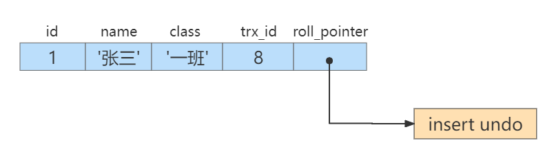

> insert undo只在事务回滚时起作用，当事务提交后，该类型的undo日志就没用了，它占用的Undo Log Segment也会被系统回收（也就是该undo日志占用的Undo页面链表要么被重用，要么被释放）。  

假设之后**两个事务id**分别为 **10** 、 **20** 的事务对这条记录进行 **UPDATE 操作**，操作流程如下：  

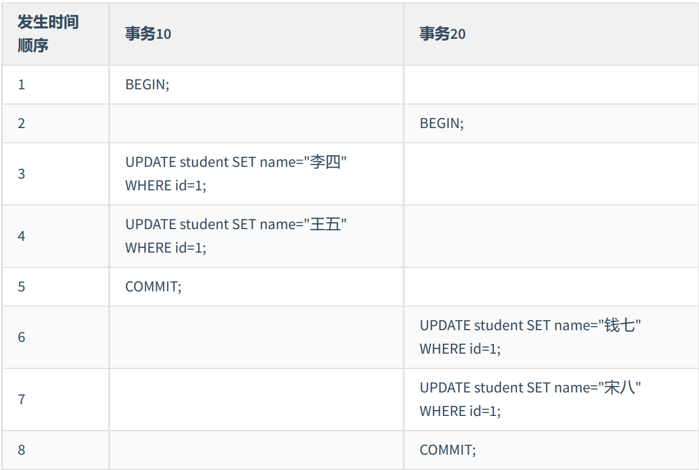

**每次对记录进行改动**，都会**记录一条undo日**志，**每条undo日志**也都有一个 **roll_pointer 属性**（ INSERT 操作对应的undo日志没有该属性，因为该记录并没有更早的版本），可以**将这些 undo日志都连起来，串成一个链表**：  

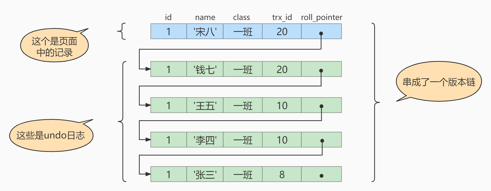

对该记录**每次更新**后，都会将**旧值**放到**一条undo日志中**，就算是该记录的一个旧版本，随着更新次数的增多，所有的版本都会被 roll_pointer 属性连接成一个链表，我们把**这个链表称之为 版本链** ，版本链的**头节点**就是**当前记录最新的值**。  

每个版本中还包含**生成该版本**时对应的 **事务id** 。  

# 四、`MVCC` 实现原理之 `ReadView`

**`MVCC` 的实现依赖于：隐藏字段、`Undo Log`、`Read View`。**  

## 4.1  什么是 `ReadView ` 

在 `MVCC` 机制中，**多个事务**对**同一个行记录**进行**更新**会产生**多个历史快照**，这些历史快照保存在Undo Log里。如果**一个事务想要查询这个行记录，需要读取哪个版本的行记录呢**？这时就需要**用到 `ReadView`** 了，它帮我们解决了**行的可见性问题**。

`ReadView` 就是**事务**在使用 **`MVCC` 机制**进行**快照读操作**时产生的**读视图**。当**事务启动**时，会生成**数据库系统当前的一个快照**，`InnoDB` 为**每个事务**构造了**一个数组**，用来记录并维护**系统当前活跃事务的ID**（“活跃”指的就是，**启动了但还没提交**）。

## 4.2  设计思路

1. 使用 `READ UNCOMMITTED` 隔离级别的事务，由于**可以读到未提交事务修改过的记录**，所以**直接读取记录的最新版本**就好了。

2. 使用 `SERIALIZABLE` 隔离级别的事务，`InnoDB` 规定**使用加锁的方式来访问记录**，因此读取到的也是**记录的最新版本**。

3. 使用 `READ COMMITTED` 和 `REPEATABLE READ` 隔离级别的事务，都必须保证**读到已经提交了的事务修改过的记录**。假如另一个事务**已经修改**了记录但是**尚未提交**，是**不能直接读取最新版本**的记录的，**核心问题就是需要判断一下版本链中的哪个版本是当前事务可见的**，这是 `ReadView` 要解决的主要问题。

这个 `ReadView` 中主要包含4个比较重要的内容，分别如下：

1. `creator_trx_id`，**创建**这个 Read View 的**事务 ID**。

> 说明：只有在对表中的记录**做改动**时（执行 `INSERT`、`DELETE`、`UPDATE`这些语句时）才会为事务**分配事务id**，否则在一个**只读事务**中的**事务id值**都**默认为0**。

2. `trx_ids`，表示在**生成 `ReadView` 时**当前系统中**活跃的读写事务**的**事务id列表**。
3. `up_limit_id`，**活跃的事务**中**最小的事务 ID**。
4. `low_limit_id` ，表示生成 `ReadView` 时**系统**中**应该分配给下一个事务的 id 值**。low_limit_id 是**系统最大的事务id值**，这里要注意是系统中的事务id，需要**区别于正在活跃的事务ID**。  

> 注意：`low_limit_id` 并不是 `trx_ids` 中的最大值，事务 `id` 是递增分配的。比如，现在有 `id` 为 `1，2，3 `这三个事务，之后 `id` 为 `3` 的事务提交了。那么一个新的读事务在生成 `ReadView` 时，`trx_ids` 就包括 `1` 和 `2` ，`up_limit_id` 的值就是 `1` ，`low_limit_id` 的值就是 `4` 。  

## 4.3  `ReadView` 的规则  

有了这个 `ReadView` ，这样在**访问某条记录**时，只需要按照下边的步骤**判断记录的某个版本是否可见**。  

1. 如果被**访问版本**的 `trx_id` 属性值与 `ReadView` 中的 `creator_trx_id` 值**相同**，意味着**当前事务在访问它自己修改过的记录**，所以**该版本可以被当前事务访问**。

2. 如果被**访问版本**的 `trx_id` 属性值**小于** `ReadView` 中的 `up_limit_id` 值，表明**生成该版本的事务**在**当前事务生成 `ReadView` 前**已经**提交**，所以**该版本可以被当前事务访问** 。 

3. 如果被**访问版本**的 `trx_id` 属性值**大于或等于** `ReadView` 中的 `low_limit_id` 值，表明**生成该版本的事务**在**当前事务生成 `ReadView` 后**才**开启**，所以**该版本不可以被当前事务访问**。  

4. 如果被**访问版本**的 `trx_id` 属性值**在 `ReadView` 的 `up_limit_id` 和 `low_limit_id  `之间**，那就需要判断一下 `trx_id `属性值**是不是在 `trx_ids` 列表中**。  

   - 如果**在**，说明创建 `ReadView` 时生成该版本的**事务还是活跃的**，该版本**不可以被访问**。 

   - 如果**不在**，说明创建 `ReadView ` 时生成该版本的**事务已经被提交**，该版本**可以被访问**。  

## 4.4  `MVCC` 整体操作流程  

了解了这些概念之后，我们来看下当**查询一条记录**的时候，系统如何通过 `MVCC `找到它：

1. 首先获取**事务自己的版本号**，也就是**事务 ID**；
2. 获取数据库为该事务生成的 `ReadView` ；
3. 将查询得到的**数据的 `trx_id` 属性值**与 **`ReadView` 中的事务版本号**进行比较；
4.  如果不符合 `ReadView` 规则，就需要**从 `Undo Log` 中获取历史快照**；
5.  最后**返回符合规则的数据**。  

### 4.4.1  隔离级别为读已提交（Read Committed）  

在隔离级别为读已提交（Read Committed）时，**一个事务**中的**每一次 SELECT 查询**都会**重新获取一次 Read View**。  

如表所示：  

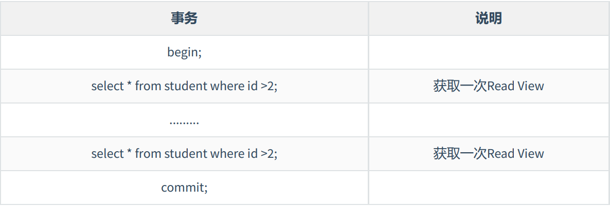

> 注意，此时**同样的查询语句**都会**重新获取一次 Read View**，这时**如果 Read View 不同**，就可能产生**不可重复读**或者**幻读**的情况。  

### 4.4.2  隔离级别为可重复读  

当隔离级别为可重复读的时候，就避免了不可重复读，这是因为**一个事务只在第一次 SELECT 的时候**会**获取一次 Read View**，而**后面所有的 SELECT** 都会**复用**这个 **Read View**，如下表所示：  

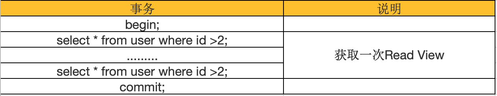

# 五、举例说明  

## 5.1  READ COMMITTED隔离级别下  

**READ COMMITTED ：每次读取数据前都生成一个新的 `ReadView`。**  

### 5.1.1  阶段一

现在有两个 事务id 分别为 10 、 20 的事务在执行：  

```sql
# Transaction 10
BEGIN;
UPDATE student SET name="李四" WHERE id=1;
UPDATE student SET name="王五" WHERE id=1;
# Transaction 20
BEGIN;
# 更新了一些别的表的记录
...
```

此刻，表student 中 **id 为 1 的记录**得到的**版本链表**如下所示：  


假设现在有一个使用 **`READ COMMITTED` 隔离级别**的事务开始执行：  

```sql
# 使用READ COMMITTED隔离级别的事务
BEGIN;
# SELECT1：Transaction 10、20未提交
SELECT * FROM student WHERE id = 1; # 得到的列name的值为'张三'
```

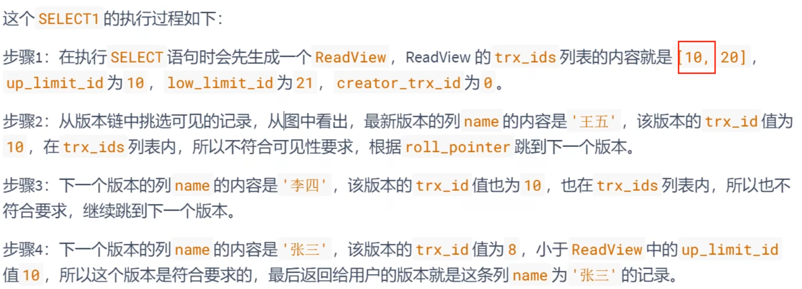

### 5.1.2  阶段二

之后，我们把 **事务id** 为 **10** 的事务提交一下：  

```sql
# Transaction 10
BEGIN;
UPDATE student SET name="李四" WHERE id=1;
UPDATE student SET name="王五" WHERE id=1;
COMMIT;
```

然后再到 **事务id** 为 **20** 的事务中**更新一下表 student 中 id 为 1 的记录**：  

```sql
# Transaction 20
BEGIN;
# 更新了一些别的表的记录
...
UPDATE student SET name="钱七" WHERE id=1;
UPDATE student SET name="宋八" WHERE id=1;
```

此刻，表student中 **id 为 1** 的**记录的版本链**就长这样：  


然后再到刚才使用 **READ COMMITTED 隔离级别**的事务中**继续查找这个 id 为 1 的记录**，如下：  

```sql
# 使用READ COMMITTED隔离级别的事务
BEGIN;
# SELECT1：Transaction 10、20均未提交
SELECT * FROM student WHERE id = 1; # 得到的列name的值为'张三'
# SELECT2：Transaction 10提交，Transaction 20未提交
SELECT * FROM student WHERE id = 1; # 得到的列name的值为'王五'
```

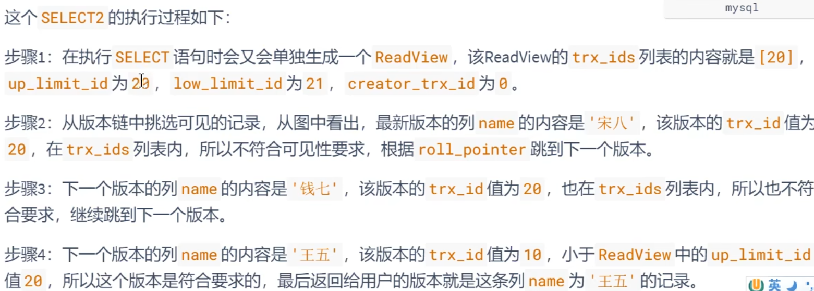

## 5.2  REPEATABLE READ隔离级别下  

使用 REPEATABLE READ 隔离级别的事务来说，**只会在第一次执行查询语句时生成一个 `ReadView`** ，**之后的查询就不会重复生成**了。  

### 5.2.1  阶段一

比如，系统里有两个 事务id 分别为 10 、 20 的事务在执行：  

```sql
# Transaction 10
BEGIN;
UPDATE student SET name="李四" WHERE id=1;
UPDATE student SET name="王五" WHERE id=1;
# Transaction 20
BEGIN;
# 更新了一些别的表的记录
...
```

此刻，表student 中 **id 为 1 的记录**得到的**版本链表**如下所示：  

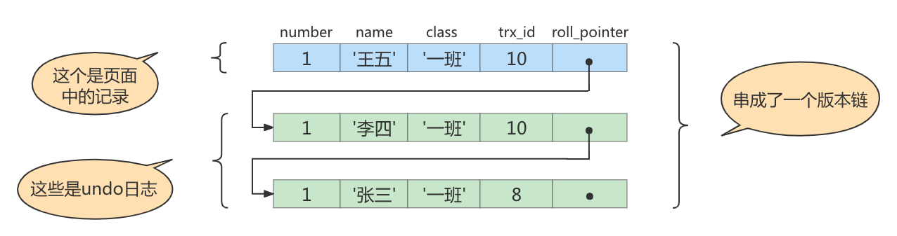

假设现在有一个使用 REPEATABLE READ 隔离级别的事务开始执行：  

```sql
# 使用REPEATABLE READ隔离级别的事务
BEGIN;
# SELECT1：Transaction 10、20未提交
SELECT * FROM student WHERE id = 1; # 得到的列name的值为'张三'
```

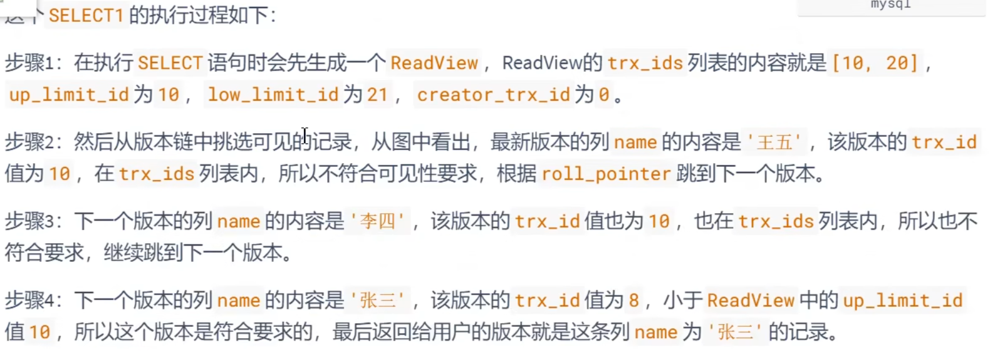

### 5.2.2  阶段二

之后，我们把 事务id 为 10 的事务提交一下，就像这样：  

```sql
# Transaction 10
BEGIN;
UPDATE student SET name="李四" WHERE id=1;
UPDATE student SET name="王五" WHERE id=1;
COMMIT;
```

然后再到 事务id 为 20 的事务中更新一下表 student 中 id 为 1 的记录：  

```sql
# Transaction 20
BEGIN;
# 更新了一些别的表的记录
...
UPDATE student SET name="钱七" WHERE id=1;
UPDATE student SET name="宋八" WHERE id=1;
```

此刻，表student 中 **id 为 1 的记录**的**版本链**长这样：  

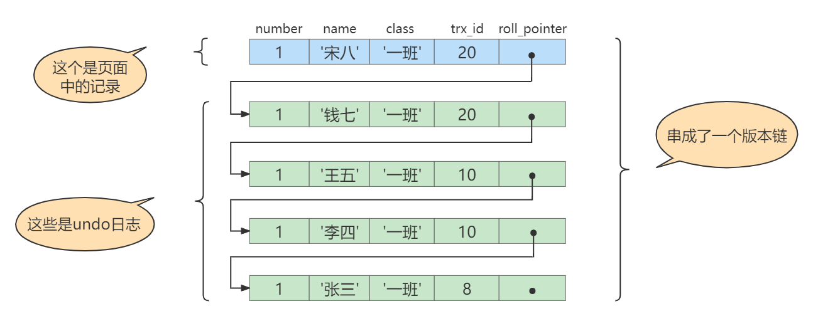

然后再到刚才使用 REPEATABLE READ 隔离级别的事务中**继续查找这个 id 为 1 的记录**，如下：  

```sql
# 使用REPEATABLE READ隔离级别的事务
BEGIN;
# SELECT1：Transaction 10、20均未提交
SELECT * FROM student WHERE id = 1; # 得到的列name的值为'张三'
# SELECT2：Transaction 10提交，Transaction 20未提交
SELECT * FROM student WHERE id = 1; # 得到的列name的值仍为'张三'
```

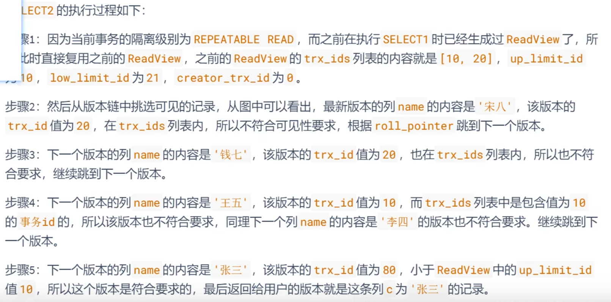

## 5.3  如何解决幻读  

接下来说明 `InnoDB` 是如何解决幻读的。

假设现在表 student 中**只有一条数据**，数据内容中，主键 `id=1`，隐藏的 `trx_id=10`，它的 undo log 如下图所示。  

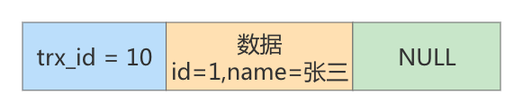

假设现在有**事务 A 和事务 B 并发执行**， **事务 A 的事务 id 为 20** ， **事务 B 的事务 id 为 30** 。

**步骤1**：事务 A 开始**第一次查询数据**，查询的 `SQL` 语句如下。  

```sql
select * from student where id >= 1;
```

在开始查询之前，**`MySQL` 会为事务 A 产生一个 `ReadView`** ，此时 `ReadView` 的内容如下： `trx_ids= [20,30] `， `up_limit_id=20` ， `low_limit_id=31` ， `creator_trx_id=20` 。  

由于此时**表 student 中只有一条数据**，且**符合 `where id>=1` 条件**，因此会查询出来。然后根据 `ReadView` 机制，发现该行数据的 `trx_id=10`，小于事务 A 的 `ReadView` 里 up_limit_id，这表示**这条数据是事务 A 开启之前，其他事务就已经提交了的数据**，因此**事务 A 可以读取到**。  

**结论**：事务 A 的第一次查询，能读取到一条数据，id=1。  

**步骤2**：接着**事务 B**( `trx_id=30` )，往表 `student` 中**新插入两条数据**，并**提交事务**。  

```sql
insert into student(id,name) values(2,'李四');
insert into student(id,name) values(3,'王五');
commit;
```

此时表 student 中就有三条数据了，对应的 undo 如下图所示：  

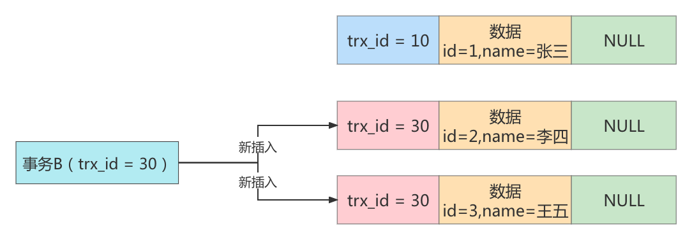

**步骤3**：接着**事务 A 开启第二次查询**，根据**可重复读隔离级别**的规则，此时**事务 A 并不会再重新生成 `ReadView` **。此时表 student 中的 3 条数据都满足 where id>=1 的条件，因此会先查出来。然后根据 `ReadView` 机制，判断每条数据是不是都可以被事务 A 看到。  

1. 首先 **id=1 的这条数据**，前面已经说过了，**可以被事务 A 看到**。
2. 然后是 **id=2 的数据**，它的 `trx_id=30`，此时事务 A 发现，这个值处于 `up_limit_id` 和 `low_limit_id` 之间，因此还需要再判断 30 是否处于 `trx_ids` 数组内。由于**事务 A 的 `trx_ids=[20,30]`**，因此在数组内，这表示 id=2 的这条数据**是与事务 A 在同一时刻启动的其他事务提交的**，所以**这条数据不能让事务 A 看到**。
3. 同理，**id=3 的这条数据**，`trx_id` 也为 30，因此也**不能被事务 A 看见**。  

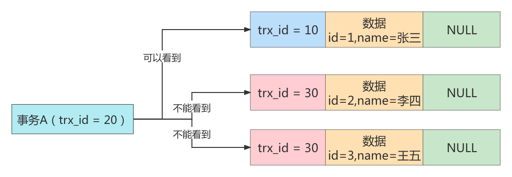

结论：最终**事务 A 的第二次查询**，**只能查询出 id=1 的这条数据**。这和事务 A 的第一次查询的结果是一样的，因此**没有出现幻读现象**，所以说在 `MySQL` 的可重复读隔离级别下，不存在幻读问题。  