# 一、字符集的相关操作

## 1.1  修改 `MySQL 5.7`字符集  

在 **`MySQL 8.0` 版本之前，默认字符集为 `latin1`** ，`utf8` 字符集实际指的是 `utf8mb3` 。网站开发人员在数据库设计的时候往往会将编码修改为 `utf8` 字符集。如果遗忘修改默认的编码，就会出现乱码的问题。**从 `MySQL8.0`开始，数据库的默认编码将改为 `utf8mb4`** ，从而避免上述乱码的问题。  

### 1.1.1 操作1：查看默认使用的字符集  

```sql
show variables like 'character%';
# 或者
show variables like '%char%';
```

- `MySQL 8.0`中执行：  

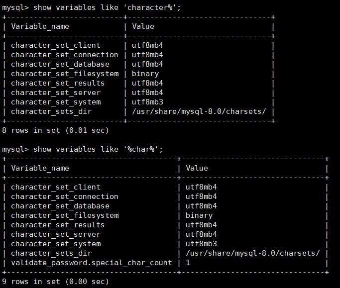

- `MySQL 5.7`中执行  

`MySQL 5.7` 默认的客户端和服务器都用了 `latin1` ，不支持中文，保存中文会报错。`MySQL 5.7` 截图如下：  

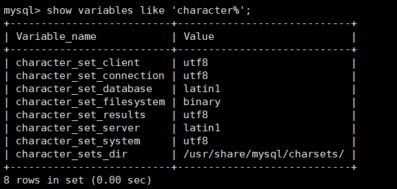

在 `MySQL5.7`中添加中文数据时会报错，因为默认情况下，创建表使用的是 `latin1`：

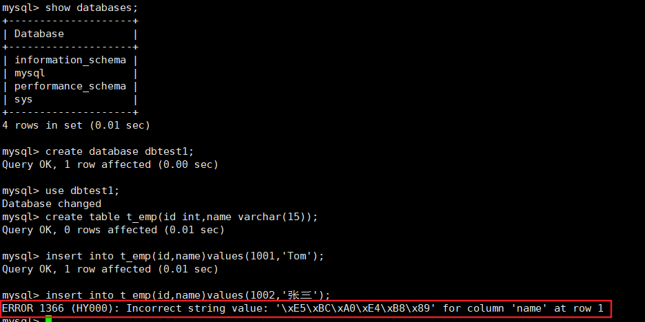   

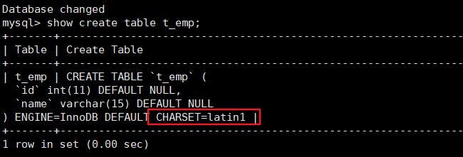

### 1.1.2  操作2：修改字符集  

```
vim /etc/my.cnf
```

在 `MySQL 5.7`或之前的版本中，在文件最后加上中文字符集配置：  

```ini
character_set_server=utf8
```

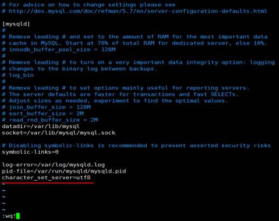

> 但是原库、原表的设定不会发生变化，参数修改只对新建的数据库生效。  

### 1.1.3  操作3：重新启动 `MySQL` 服务  

```shell
systemctl restart mysqld
```

### 1.1.4  已有库&表字符集的变更  

`MySQL 5.7`版本中，**以前创建的库**，创建的**表字符集还是 `latin1`**。  

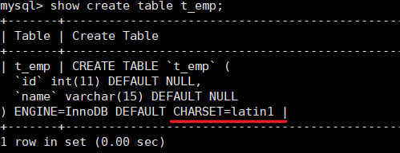

1. 修改已创建**数据库**的字符集  

```sql
alter database dbtest1 character set 'utf8';
```

2. 修改已创建**数据表**的字符集  

```sql
alter table t_emp convert to character set 'utf8';
```

> 注意：但是原有的数据如果是用非'utf8'编码的话，数据本身编码不会发生改变。如果是从大级别字符集转换为小级别的字符集，那么可能会出现乱码问题，因此已有数据需要导出或删除，然后重新插入。  

## 1.2 各级别的字符集  

`MySQL` 有4个级别的字符集和比较规则，分别是 ：

- 服务器级别
- 数据库级别
- 表级别
- 列级别  

执行如下 `SQL` 语句：  

```sql
show variables like 'character%';
```

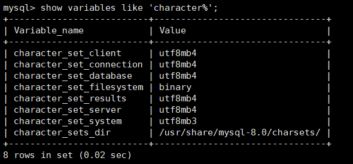

- `character_set_server`：**服务器级别**的字符集
- `character_set_database`：当前**数据库**的字符集
- `character_set_client`：**服务器解码请求**时使用的字符集
- `character_set_connection`：服务器处理请求时会把请求字符串从`character_set_client` 转为 `character_set_connection` 
- `character_set_results` ：服务器**向客户端返回数据**时使用的字符集  

### 1.2.1  服务器级别  

`character_set_server `：服务器级别的字符集。  

我们可以在启动服务器程序时通过启动选项或者在服务器程序运行过程中**使用 SET 语句修改这两个变量的值**。比如我们可以在**配置文件**中这样写： 

```ini
[server]
character_set_server=gbk # 默认字符集
collation_server=gbk_chinese_ci #对应的默认的比较规则
```

 当服务器启动的时候读取这个配置文件后这两个系统变量的值便修改了。  

### 1.2.2  数据库级别  

`character_set_database` ：当前数据库的字符集  

我们在**创建和修改数据库**的时候可以指定该数据库的字符集和比较规则，具体语法如下：  

```sql
CREATE DATABASE 数据库名
	[[DEFAULT] CHARACTER SET 字符集名称]
	[[DEFAULT] COLLATE 比较规则名称];

ALTER DATABASE 数据库名
	[[DEFAULT] CHARACTER SET 字符集名称]
	[[DEFAULT] COLLATE 比较规则名称];
```

### 1.2.3 表级别  

我们也可以在**创建和修改表**的时候指定表的字符集和比较规则，语法如下：  

```sql
CREATE TABLE 表名 (列的信息)
	[[DEFAULT] CHARACTER SET 字符集名称]
	[COLLATE 比较规则名称]]

ALTER TABLE 表名
	[[DEFAULT] CHARACTER SET 字符集名称]
	[COLLATE 比较规则名称]
```

如果**创建和修改表**的语句中**没有指明**字符集和比较规则，将使用**该表所在数据库**的**字符集和比较规则**作为该表的字符集和比较规则。  

### 1.2.4  列级别  

对于存储字符串的列，**同一个表中的不同的列**也可以有**不同的字符集和比较规则**。我们在**创建和修改列**定义的时候可以**指定该列的字符集和比较规则**，语法如下：  

```sql
CREATE TABLE 表名(
列名 字符串类型 [CHARACTER SET 字符集名称] [COLLATE 比较规则名称],
其他列...
);
ALTER TABLE 表名 MODIFY 列名 字符串类型 [CHARACTER SET 字符集名称] [COLLATE 比较规则名称];
```

对于**某个列**来说，如果在**创建和修改的语句**中**没有指明**字符集和比较规则，将使用**该列所在表的字符集和比较规则**作为该列的字符集和比较规则。  

## 1.3  请求到响应过程中字符集的变化  

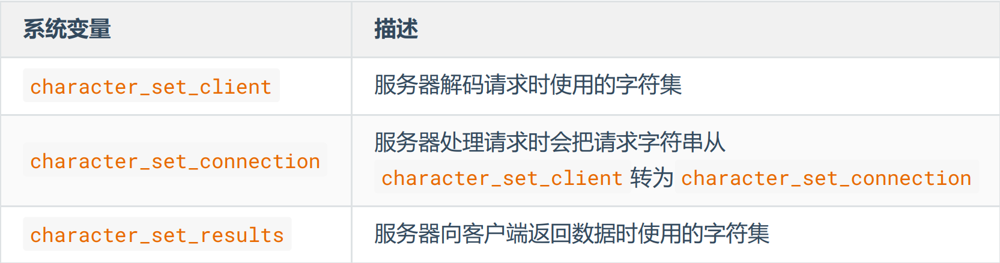

这几个**系统变量**在我的计算机上的**默认值**如下（不同操作系统的默认值可能不同）：  

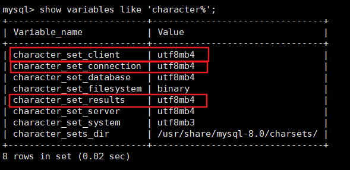

为了**体现**出**字符集**在**请求处理过程**中的**变化**，我们这里**特意修改一个系统变量**的值：  

```sql
mysql> set character_set_connection = gbk;
Query OK, 0 rows affected (0.00 sec)
```

现在假设我们**客户端发送的请求**是下边这个**字符串**：  

```sql
SELECT * FROM t WHERE s = '我';
```

为了方便理解这个过程，**只分析字符 '我' 在这个过程中字符集的转换**。  

现在看一下在**请求**从**发送到结果返回**过程中**字符集的变化**：  

1. **客户端发送请求所使用的字符集**  

一般情况下**客户端所使用的字符集**和**当前操作系统一致**，不同操作系统使用的字符集可能不一样，如下：  

- 类 Unix 系统使用的是 `utf8`
- Windows 使用的是 `gbk ` 

当**客户端**使用的是 `utf8` 字符集，**字符 '我'** 在**发送给服务器的请求**中的**字节形式**就是：`0xE68891`  

> 提示：
> 如果你使用的是**可视化工具**，比如 `navicat` 之类的，这些工具可能会使用**自定义的字符集**来编码发送到服务器的字符串，而**不采用操作系统默认的字符集**（所以在学习的时候还是尽量用命令行窗口）。  

2. **服务器接收到客户端发送来的请求**其实是**一串二进制的字节**，它会**认为**这串字节采用的字符集是 `character_set_client` ，然后把这串字节**转换为**`character_set_connection` 字符集编码的字符。  

```
由于我的计算机上 character_set_client 的值是 utf8 ，首先会按照 utf8 字符集对字节串0xE68891 进行解码，得到的字符串就是 '我' ，然后按照 character_set_connection 代表的字符集，也就是 gbk 进行编码，得到的结果就是字节串 0xCED2 。
```

3. 因为**表 t 的列 col** 采用的是 **`gbk` 字符集**，与 `character_set_connection` 一致，所以直接到列中找字节值为 `0xCED2` 的记录，最后找到了一条记录。 

> 提示：
> 如果**某个列使用的字符集**和 `character_set_connection` 代表的字符集**不一致**的话，还需要**进行一次字符集转换**。

4. 上一步骤找到的**记录中的 `col` 列其实是一个字节串 `0xCED2`** ， `col` **列是采用 `gbk` 进行编码**的，所以首先会**将这个字节串使用 `gbk` 进行解码，得到字符串 '我'** ，然后再把这个字符串**使用 `character_set_results` 代表的字符集**，也就是 `utf8` **进行编码**，得到了新的字节串：`0xE68891` ，然后**发送给客户端**。  
5. 由于**客户端用的字符集**是 `utf8` ，所以可以**顺利的将 `0xE68891` 解释成字符 `我`** ，从而显示到我们的显示器上，所以我们人类也读懂了返回的结果。

总结图示如下：  

  

# 二、`SQL` 大小写规范

## 2.1  Windows和Linux平台区别  

在 `SQL` 中，**关键字**和**函数名**是**不区分字母大小写**的，比如 `SELECT、WHERE、ORDER、GROUP BY` 等关键字，以及 `ABS、MOD、ROUND、MAX` 等函数名。

不过在 `SQL` 中，你还是要确定大小写的规范，因为在 Linux 和 Windows 环境下，可能会遇到不同的大小写问题。 **windows 系统**默认**大小写不敏感** ，但是 **`linux` 系统**是**大小写敏感**的 。  

通过如下命令查看：  

```sql
SHOW VARIABLES LIKE '%lower_case_table_names%'
```

- `Windows` 系统下  

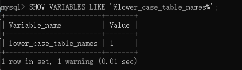

- `Linux` 系统下  

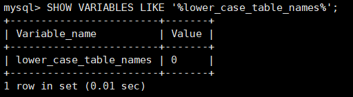

`lower_case_table_names` 参数值的设置：

1. 设置为0，**大小写敏感** 。
2. 设置1，**大小写不敏感**。创建的**表，数据库**都是以**小写形式**存放在**磁盘**上，对于 **`sql` 语句**都是**转换为小写**对表和数据库**进行查找**。
3. 设置2，创建的**表和数据库**依据**语句指定的大小写格式**存放，凡是**查找**都是**转换为小写**进行。    

两个平台上 `SQL` 大小写的区别具体来说：  

- `MySQL` 在 `Linux` 下数据库名、表名、列名、别名大小写规则是这样的：
  1. **数据库名、表名、表的别名、变量名**是**严格区分大小写**的；
  2. **关键字、函数名**在 `SQL` 中**不区分大小写**；
  3. **列名（或字段名）与列的别名（或字段别名）**在所有的情况下均是**忽略大小写**的；
- `MySQL` 在 `Windows` 的环境下**全部不区分大小写**  

## 2.2  Linux下大小写规则设置  

当**想设置为大小写不敏感**时，要在 `my.cnf` 这个配置文件 `[mysqld]` 中加入
`lower_case_table_names=1` ，然后重启服务器。  但是要注意以下几点：

1. 要在重启数据库实例之前就需要将**原有的数据库和表全部转换为小写**，**否则将找不到数据库名**。  
2. 此参数适用于 `MySQL 5.7`  。如果 `MySQL 8`  修改了此参数在重启后将报错。如果想要在 `MySQL 8`  中完成修改，需要遵循以下步骤：

```
1、停止MySQL服务
2、删除数据目录，即删除 /var/lib/mysql 目录
3、在MySQL配置文件（ /etc/my.cnf ）中添加 lower_case_table_names=1
4、启动MySQL服务
```

## 2.3  `SQL` 编写建议  

如果你的变量名命名规范没有统一，就可能产生错误。这里有一个**有关命名规范的建议**：  

1. 关键字和函数名称全部大写；
2. 数据库名、表名、表别名、字段名、字段别名等全部小写；
3.  `SQL` 语句必须以分号结尾。  

# 三、`sql_mode` 的合理设置

## 3.1 宽松模式 vs 严格模式  

### 3.1.1 宽松模式  

如果设置的是宽松模式，那么我们在插入数据的时候，**即便是给了一个错误的数据，也可能会被接受，并且不报错。**  

**举例** ：我在创建一个表时，该表中有一个字段为 `name` ，**给 `name` 设置的字段类型时 `char(10)`**  ，如果我在插入数据的时候，其中 `name` 这个字段对应的**有一条数据的 长度超过了10** ，例如 `'1234567890abc'`，超过了设定的字段长度10，那么**不会报错，并且取前10个字符存上**，也就是说你这个数据被存为了 `'1234567890'`，而 `'abc'` 就没有了。但是，我们**给的这条数据是错误的**，因为**超过了字段长度**，**但是并没有报错**，并且 **`mysql` 自行处理并接受了**，这就是宽松模式的效果。  

**应用场景** ：通过设置 `sql mode` 为**宽松模式**，来保证大多数 `sql` 符合标准的 `sql` 语法，这样应用在**不同数据库之间进行迁移时**，则不需要对业务 `sql` 进行较大的修改  

### 3.1.2 严格模式  

出现上面宽松模式的错误，应该报错才对，所以 `MySQL5.7` 版本就将 `sql_mode` **默认值改为了严格模式**。所以在 **生产等环境** 中，我们**必须采用的是严格模式**，进而 **开发、测试环境** 的数据库**也必须要设置**，这样在**开发测试阶段就可以发现问题**。并且我们即便是用的 `MySQL5.6`，也应该自行将其改为严格模式。  

## 3.2  模式查看和设置  

### 3.2.1 查看当前的 `sql_mode` 

```sql
select @@session.sql_mode
select @@global.sql_mode
#或者
show variables like 'sql_mode';
```

### 3.2.2  临时设置方式：设置当前窗口中设置 `sql_mode`  

```sql
SET GLOBAL sql_mode = 'modes...'; #全局
SET SESSION sql_mode = 'modes...'; #当前会话
```

举例：  

```sql
#改为严格模式。此方法只在当前会话中生效，关闭当前会话就不生效了。
set SESSION sql_mode='STRICT_TRANS_TABLES';
```

```sql
#改为严格模式。此方法在当前服务中生效，重启MySQL服务后失效。
set GLOBAL sql_mode='STRICT_TRANS_TABLES';
```

### 3.2.3  永久设置方式：在 `/etc/my.cnf `中配置`sql_mode`  

在 `my.cnf` 文件( `windows` 系统是 `my.ini` 文件)，新增：  

```ini
[mysqld]
sql_mode=ONLY_FULL_GROUP_BY,STRICT_TRANS_TABLES,NO_ZERO_IN_DATE,NO_ZERO_DATE,ERROR_FOR_DIVISION_BY_ZERO,NO_ENGINE_SUBSTITUTION
```

然后 **重启 `MySQL`** 。  

当然**生产环境**上是**禁止重启 `MySQL` 服务**的，所以采用 **临时设置方式 + 永久设置方式** 来解决线上的问题，那么即便是有一天真的重启了 `MySQL` 服务，也会永久生效了。  