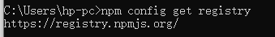

- npm是Node.js默认的软件包管理系统
- 安装完毕node后，会默认安装好npm
- npm本身也是基于Node.js开发的软件
- 下载Node：http://nodejs.cn

- 手动下载最新版本的npm:

   `npm install -g npm  `是用于在全局安装最新版本的npm包管理器的命令。执行此命令后，将会下载并安装最新版本的npm，并将其安装在**全局环境中**，以便在任何地方都可以使用npm命令。

- 安装其他包：

  `npm install jquery`。会在当前目录下安装jquery包。

  `npm install jquery -g`。在全局目录中安装jquery包，这样就可以在本地的任何地方引用改包。

  使用`npm install xxx `命令会在当前目录下生成一个`node_module`文件夹和一个`package-lock.json`文件，`xxx`包将会保存在`node_module`文件夹下。

- 查看当前正在使用的远程仓库地址：`npm config get registry`。默认是`https://registry.npmjs.org/`，因为这是一个国外网站，因此从此处下载`node.js`包是比较慢的。

- 更换远程仓库到淘宝镜像：

  `npm config set registry https://registry.npm.taobao.org  --global`