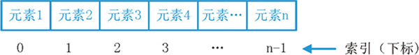

### 一、序列

所谓序列，指的是一块可存放多个值的连续内存空间，这些值按一定顺序排列，可通过每个值所在位置的编号（称为索引）访问它们。

在 [Python](http://c.biancheng.net/python/) 中，序列类型包括**字符串、列表、元组、集合和字典**，这些序列支持以下几种通用的操作，但比较特殊的是，集合和字典不支持索引、切片、相加和相乘操作。

#### 1.序列索引

序列中，每个元素都有属于自己的编号（索引）。从起始元素开始，索引值从 0 开始递增，如图 1 所示。



<center> 图 1 序列索引值示意图 </center>

除此之外，**Python 还支持索引值是负数，此类索引是从右向左计数**，换句话说，从最后一个元素开始计数，从索引值 -1 开始，如图 2 所示。


<center> 图 2 负值索引示意图</center>

> 注意，在使用负值作为列序中各元素的索引值时，是从 -1 开始，而不是从 0 开始。

无论是采用正索引值，还是负索引值，都可以访问序列中的任何元素。以字符串为例，访问“C语言中文网”的首元素和尾元素，可以使用如下的代码：

```python
    str="C语言中文网"
    print(str[0],"==",str[-6])
    print(str[5],"==",str[-1])
```

输出结果为：

```python
C == C
网 == 网
```

#### 2.序列切片

切片操作是访问序列中元素的另一种方法，它可以访问一定范围内的元素，通过切片操作，可以生成一个新的序列。

 序列实现切片操作的语法格式如下：

```python
sname[start : end : step]
```

其中，各个参数的含义分别是：

- sname：表示序列的名称；
- start：表示切片的开始索引位置（**包括该位置**），此参数也可以不指定，会默认为 0，也就是从序列的开头进行切片；
- end：表示切片的结束索引位置（**不包括该位置**），如果不指定，则默认为序列的长度；
- step：表示在切片过程中，隔几个存储位置（包含当前位置）取一次元素，也就是说，如果 step 的值大于 1，则在进行切片去序列元素时，会“跳跃式”的取元素。**如果省略设置 step 的值，则最后一个冒号就可以省略。**

例如，对字符串“C语言中文网”进行切片：

```python
    str="C语言中文网"
    #取索引区间为[0,2]之间（不包括索引2处的字符）的字符串
    print(str[:2])
    #隔 1 个字符取一个字符，区间是整个字符串
    print(str[::2])
    #取整个字符串，此时 [] 中只需一个冒号即可
    print(str[:])
```

运行结果为：

```python
C语
C言文
C语言中文网
```

#### 3.序列相加

Python 中，支持**两种类型相同的序列**使用“+”运算符做相加操作，它会将两个序列进行连接，但不会去除重复的元素。

```python
这里所说的“类型相同”，指的是“+”运算符的两侧序列要么都是列表类型，要么都是元组类型，要么都是字符串。
```

#### 4.序列相乘

Python 中，使用数字 n 乘以一个序列会生成新的序列，其内容为原来序列被重复 n 次的结果。例如：

```python
    str="C语言中文网"
    print(str*3)
```

输出结果为：

```python
'C语言中文网C语言中文网C语言中文网'
```

比较特殊的是，**列表类型**在进行乘法运算时，还可以**实现初始化指定长度列表**的功能。例如如下的代码，将创建一个长度为 5 的列表，列表中的每个元素都是 None，表示什么都没有。

```python
    #列表的创建用 []，后续讲解列表时会详细介绍
    list = [None]*5
    print(list)
```

输出结果为：

```python
[None, None, None, None, None]
```

#### 5.检查元素是否包含在序列中

Python 中，可以使用 **in 关键字**检查某元素是否为序列的成员，其语法格式为：

```python
value in sequence
```

其中，value 表示要检查的元素，sequence 表示指定的序列。

例如，检查字符‘c’是否包含在字符串“c.biancheng.net”中，可以执行如下代码：

```python
    str="c.biancheng.net"
    print('c'in str)
```

运行结果为：

```python
True
```

和 in 关键字用法相同，但功能恰好相反的，还有 **not in 关键字**，它用来**检查某个元素是否不包含在指定的序列中**，比如说：

```python
    str="c.biancheng.net"
    print('c' not in str)
```

输出结果为：

```python
False
```

#### 6.和序列相关的内置函数

Python提供了几个内置函数（表 3 所示），可用于实现与序列相关的一些常用操作。

<center> 表 3 序列相关的内置函数</center>

| 函数        | 功能                                                         |
| ----------- | ------------------------------------------------------------ |
| len()       | 计算序列的长度，即返回序列中包含多少个元素。                 |
| max()       | 找出序列中的最大元素。注意，对序列使用 sum() 函数时，做加和操作的必须都是数字，不能是字符或字符串，否则该函数将抛出异常，因为解释器无法判定是要做连接操作（+ 运算符可以连接两个序列），还是做加和操作。 |
| min()       | 找出序列中的最小元素。                                       |
| list()      | 将序列转换为列表。                                           |
| str()       | 将序列转换为字符串。                                         |
| sum()       | 计算元素和。                                                 |
| sorted()    | 对元素进行排序。                                             |
| reversed()  | 反向序列中的元素。                                           |
| enumerate() | 将序列组合为一个索引序列，多用在 for 循环中。                |

这里给大家给几个例子：

```python
    str="c.biancheng.net"
    #找出最大的字符
    print(max(str))
    #找出最小的字符
    print(min(str))
    #对字符串中的元素进行排序
    print(sorted(str))
```

输出结果为：

```python
t
.
['.', '.', 'a', 'b', 'c', 'c', 'e', 'e', 'g', 'h', 'i', 'n', 'n', 'n', 't']
```

### 二、list列表

在实际开发中，经常需要将一组（不只一个）数据存储起来，以便后边的代码使用。这也是其他编程语言中广泛使用的数组(Array)担任的角色，它就可以把多个数据挨个存储到一起，通过数组下标可以访问数组中的每个元素。

需要明确的是，**[Python](http://c.biancheng.net/python/) 中没有数组，但是加入了更加强大的列表**。如果把数组看做是一个集装箱，那么 Python 的列表就是一个工厂的仓库。

从形式上看，列表会将所有元素都放在一对中括号`[ ]`里面，相邻元素之间用逗号`,`分隔，如下所示：

```python
[element1, element2, element3, ..., elementn]
```

格式中，element1 ~ elementn 表示列表中的元素，个数没有限制，只要是 Python 支持的数据类型就可以。

从内容上看，列表可以存储整数、小数、字符串、列表、元组等任何类型的数据，并且同一个列表中元素的类型也可以不同。比如说：

```python
["http://c.biancheng.net/python/", 1, [2,3,4] , 3.0]
```

可以看到，列表中同时包含字符串、整数、列表、浮点数这些数据类型。

> 注意，在使用列表时，虽然可以将不同类型的数据放入到同一个列表中，但通常情况下不这么做，同一列表中只放入同一类型的数据，这样可以提高程序的可读性。

另外，经常用 list 代指列表，这是因为列表的数据类型就是 list，通过 type() 函数就可以知道，例如：

```python
>>> type( ["http://c.biancheng.net/python/", 1, [2,3,4] , 3.0] )
<class 'list'>    #可以看到，它的数据类型为 list，就表示它是一个列表。
```

#### 1.Python创建列表

在 Python 中，创建列表的方法可分为两种，下面分别进行介绍。

##### 1) 使用 [ ] 直接创建列表

使用`[ ]`创建列表后，一般使用`=`将它赋值给某个变量，具体格式如下：

```py
listname = [element1 , element2 , element3 , ... , elementn]
```

其中，listname 表示变量名，element1 ~ elementn 表示列表元素。

例如，下面定义的列表都是合法的：

```python
    num = [1, 2, 3, 4, 5, 6, 7]
    name = ["C语言中文网", "http://c.biancheng.net"]
    program = ["C语言", "Python", "Java"]
```

另外，使用此方式创建列表时，列表中元素可以有多个，也可以一个都没有，例如：

```python
emptylist = [ ]   #这表明，emptylist 是一个空列表。
```

##### 2) 使用 list() 函数创建列表

除了使用`[ ]`创建列表外，Python 还提供了一个内置的函数 list()，使用它可以将其它数据类型转换为列表类型。例如：

```python
    #将字符串转换成列表
    list1 = list("hello")
    print(list1)
    #将元组转换成列表
    tuple1 = ('Python', 'Java', 'C++', 'JavaScript')
    list2 = list(tuple1)
    print(list2)
    #将字典转换成列表
    dict1 = {'a':100, 'b':42, 'c':9}
    list3 = list(dict1)
    print(list3)
    #将区间转换成列表
    range1 = range(1, 6)
    list4 = list(range1)
    print(list4)
    #创建空列表
    print(list())
```

运行结果：

```python
['h', 'e', 'l', 'l', 'o']
['Python', 'Java', 'C++', 'JavaScript']
['a', 'b', 'c']
[1, 2, 3, 4, 5]
[]
```

#### 2.访问列表元素

列表是 Python 序列的一种，我们可以使用索引（Index）访问列表中的某个元素（得到的是一个元素的值），也可以使用切片访问列表中的一组元素（得到的是一个新的子列表）。

使用索引访问列表元素的格式为：

```python
listname[i]  #listname 表示列表名字，i 表示索引值。列表的索引可以是正数，也可以是负数。
```

使用切片访问列表元素的格式为：

```python
listname[start : end : step]  #listname 表示列表名字，start 表示起始索引，end 表示结束索引，step 表示步长。
```

以上两种方式我们已在《[Python序列](http://c.biancheng.net/view/4312.html)》中进行了讲解，这里就不再赘述了，仅作示例演示，请看下面代码：

```python
    url = list("http://c.biancheng.net/shell/")
    #使用索引访问列表中的某个元素
    print(url[3])  #使用正数索引
    print(url[-4])  #使用负数索引
    #使用切片访问列表中的一组元素
    print(url[9: 18])  #使用正数切片
    print(url[9: 18: 3])  #指定步长
    print(url[-6: -1])  #使用负数切片
```

运行结果：

```python
p
e
['b', 'i', 'a', 'n', 'c', 'h', 'e', 'n', 'g']
['b', 'n', 'e']
['s', 'h', 'e', 'l', 'l']
```

#### 3.Python删除列表

对于已经创建的列表，如果不再使用，可以使用`del`关键字将其删除。

实际开发中并不经常使用 del 来删除列表，因为 Python 自带的垃圾回收机制会自动销毁无用的列表，即使开发者不手动删除，Python 也会自动将其回收。

del 关键字的语法格式为：

```python
del listname  #listname 表示要删除列表的名称。
```

Python 删除列表实例演示：

```python
    intlist = [1, 45, 8, 34]
    print(intlist)
    del intlist
    print(intlist)
```

运行结果：

```python
[1, 45, 8, 34]
Traceback (most recent call last):
    File "C:\Users\mozhiyan\Desktop\demo.py", line 4, in <module>
        print(intlist)
NameError: name 'intlist' is not defined
```

### 三、list列表添加元素

《[Python序列](http://c.biancheng.net/view/4312.html)》一节告诉我们，使用`+`运算符可以将多个序列连接起来；**列表是序列的一种，所以也可以使用`+`进行连接，这样就相当于在第一个列表的末尾添加了另一个列表。**

请看下面的演示：

```python
    language = ["Python", "C++", "Java"]
    birthday = [1991, 1998, 1995]
    info = language + birthday
    print("language =", language)
    print("birthday =", birthday)
    print("info =", info)
```

运行结果：

```py
language = ['Python', 'C++', 'Java']
birthday = [1991, 1998, 1995]
info = ['Python', 'C++', 'Java', 1991, 1998, 1995]
```

从运行结果可以发现，**使用`+`会生成一个新的列表，原有的列表不会被改变**。

 `+`更多的是用来拼接列表，而且**执行效率并不高**，如果想在列表中插入元素，应该使用下面几个专门的方法。

#### 1.Python append()方法添加元素

append() 方法用于在列表的末尾追加元素，该方法的语法格式如下：

```python
listname.append(obj) 
```

> listname 表示要添加元素的列表；obj 表示到添加到列表末尾的数据，它可以是单个元素，也可以是列表、元组等。

请看下面的演示：

```python
    l = ['Python', 'C++', 'Java']
    #追加元素
    l.append('PHP')
    print(l)
    #追加元组，整个元组被当成一个元素
    t = ('JavaScript', 'C#', 'Go')
    l.append(t)
    print(l)
    #追加列表，整个列表也被当成一个元素
    l.append(['Ruby', 'SQL'])
    print(l)
```

运行结果为：

```python
['Python', 'C++', 'Java', 'PHP']
['Python', 'C++', 'Java', 'PHP', ('JavaScript', 'C#', 'Go')]
['Python', 'C++', 'Java', 'PHP', ('JavaScript', 'C#', 'Go'), ['Ruby', 'SQL']]
```

可以看到，当给 append() 方法传递列表或者元组时，此方法会将它们**视为一个整体**，**作为一个元素添加到列表中**，从而形成包含列表和元组的新列表。

#### 2.Python extend()方法添加元素

extend() 和 append() 的不同之处在于：extend() 不会把列表或者元祖视为一个整体，而是把它们包含的**元素逐个添加**到列表中。

extend() 方法的语法格式如下：

```py
listname.extend(obj)
```

其中，listname 指的是要添加元素的列表；obj 表示到添加到列表末尾的数据，它可以是单个元素，也可以是列表、元组等，但不能是单个的数字。

请看下面的演示：

```python
    l = ['Python', 'C++', 'Java']
    #追加元素
    l.extend('C')
    print(l)
    #追加元组，元祖被拆分成多个元素
    t = ('JavaScript', 'C#', 'Go')
    l.extend(t)
    print(l)
    #追加列表，列表也被拆分成多个元素
    l.extend(['Ruby', 'SQL'])
    print(l)
```

运行结果：

```python
['Python', 'C++', 'Java', 'C']
['Python', 'C++', 'Java', 'C', 'JavaScript', 'C#', 'Go']
['Python', 'C++', 'Java', 'C', 'JavaScript', 'C#', 'Go', 'Ruby', 'SQL']
```

#### 3.Python insert()方法插入元素

append() 和 extend() 方法只能在

append() 和 extend() 方法只能在**列表末尾**插入元素，如果希望在**列表中间某个位置插入元素**，那么可以使用 **insert() 方法**。插入元素，如果希望在列表中间某个位置插入元素，那么可以使用 insert() 方法。

insert() 的语法格式如下：

```py
listname.insert(index , obj)
```

其中，index 表示指定位置的索引值。insert() 会将 obj 插入到 listname 列表第 index 个元素的位置。

**当插入列表或者元祖时，insert() 也会将它们视为一个整体**，作为一个元素插入到列表中，这一点和 append() 是一样的。

请看下面的演示代码：

```python
    l = ['Python', 'C++', 'Java']
    #插入元素
    l.insert(1, 'C')
    print(l)
    #插入元组，整个元祖被当成一个元素
    t = ('C#', 'Go')
    l.insert(2, t)
    print(l)
    #插入列表，整个列表被当成一个元素
    l.insert(3, ['Ruby', 'SQL'])
    print(l)
    #插入字符串，整个字符串被当成一个元素
    l.insert(0, "http://c.biancheng.net")
    print(l)
```

输出结果为：

```python
['Python', 'C', 'C++', 'Java']
['Python', 'C', ('C#', 'Go'), 'C++', 'Java']
['Python', 'C', ('C#', 'Go'), ['Ruby', 'SQL'], 'C++', 'Java']
['http://c.biancheng.net', 'Python', 'C', ('C#', 'Go'), ['Ruby', 'SQL'], 'C++', 'Java']
```

### 四、list列表删除元素

在 [Python](http://c.biancheng.net/python/) 列表中删除元素主要分为以下 3 种场景：

- 根据目标元素所在位置的索引进行删除，可以使用 del 关键字或者 pop() 方法；
- 根据元素本身的值进行删除，可使用列表（list类型）提供的 remove() 方法；
- 将列表中所有元素全部删除，可使用列表（list类型）提供的 clear() 方法。

#### 1.del：根据索引值删除元素

del 是 Python 中的关键字，专门用来执行删除操作，它不仅可以删除整个列表，还可以删除列表中的某些元素。我们已经在《[Python列表](http://c.biancheng.net/view/4328.html)》中讲解了如何删除整个列表，所以本节只讲解如何删除列表元素。

del 可以删除列表中的单个元素，格式为：

```python
del listname[index]   #listname 表示列表名称，index 表示元素的索引值。
```

del 也可以删除中间一段连续的元素，格式为：

```python
del listname[start : end]
```

其中，start 表示起始索引，end 表示结束索引。del 会删除从索引 start 到 end 之间的元素，**不包括 end 位置的元素**。

【示例】使用 del 删除单个列表元素：

```python
    lang = ["Python", "C++", "Java", "PHP", "Ruby", "MATLAB"]
    #使用正数索引
    del lang[2]
    print(lang)
    #使用负数索引
    del lang[-2]
    print(lang)
```

运行结果：

```python
['Python', 'C++', 'PHP', 'Ruby', 'MATLAB']
['Python', 'C++', 'PHP', 'MATLAB']
```

【示例】使用 del 删除一段连续的元素：

```python
    lang = ["Python", "C++", "Java", "PHP", "Ruby", "MATLAB"]
    del lang[1: 4]
    print(lang)
    lang.extend(["SQL", "C#", "Go"])
    del lang[-5: -2]
    print(lang)
```

运行结果：

```python
['Python', 'Ruby', 'MATLAB']
['Python', 'C#', 'Go'] 
```

#### 2.pop()：根据索引值删除元素

Python pop() 方法用来删除列表中指定索引处的元素，具体格式如下：

```python
listname.pop(index)
```

其中，listname 表示列表名称，index 表示索引值。如果不写 index 参数，默认会删除列表中的最后一个元素，类似于[数据结构](http://c.biancheng.net/data_structure/)中的“出栈”操作。

pop() 用法举例：

```python
    nums = [40, 36, 89, 2, 36, 100, 7]
    nums.pop(3)
    print(nums)
    nums.pop()
    print(nums)
```

运行结果：

```python
[40, 36, 89, 36, 100, 7]
[40, 36, 89, 36, 100]
```

大部分编程语言都会提供和 pop() 相对应的方法，就是 push()，该方法用来将元素添加到列表的尾部，类似于数据结构中的“入栈”操作。但是  Python 是个例外，Python 并没有提供 push() 方法，因为完全可以使用 append() 来代替 push() 的功能。

#### 3.remove()：根据元素值进行删除

除了 del 关键字，Python 还提供了 remove() 方法，该方法会**根据元素本身的值来进行删除操作**。

 需要注意的是，remove() 方法**只会删除第一个和指定值相同的元素**，而且**必须保证该元素是存在的**，否则会引发 ValueError 错误。

 remove() 方法使用示例：

```python
    nums = [40, 36, 89, 2, 36, 100, 7]
    #第一次删除36
    nums.remove(36)
    print(nums)
    #第二次删除36
    nums.remove(36)
    print(nums)
    #删除78
    nums.remove(78)
    print(nums)
```

运行结果：

```python
[40, 89, 2, 36, 100, 7]
[40, 89, 2, 100, 7]
Traceback (most recent call last):
    File "C:\Users\mozhiyan\Desktop\demo.py", line 9, in <module>
        nums.remove(78)
ValueError: list.remove(x): x not in list
```

最后一次删除，因为 78 不存在导致报错，所以我们**在使用 remove() 删除元素时最好提前判断一下**。

#### 4.clear()：删除列表所有元素

Python clear() 用来**删除列表的所有元素**，也即清空列表，请看下面的代码：

```python
    url = list("http://c.biancheng.net/python/")
    url.clear()
    print(url)
```

运行结果：

```python
[]
```

### 五、list列表修改元素

[Python](http://c.biancheng.net/python/) 提供了两种修改列表（list）元素的方法，你可以每次修改单个元素，也可以每次修改一组元素（多个）。

#### 1.修改单个元素

修改单个元素非常简单，直接对元素赋值即可。请看下面的例子：

```python
    nums = [40, 36, 89, 2, 36, 100, 7]
    nums[2] = -26  #使用正数索引
    nums[-3] = -66.2  #使用负数索引
    print(nums)
```

运行结果：

```python
[40, 36, -26, 2, -66.2, 100, 7]
```

使用索引得到列表元素后，通过`=`赋值就改变了元素的值。

#### 2.修改一组元素

Python 支持通过切片语法给一组元素赋值。在进行这种操作时，如果不指定步长（step 参数），Python 就不要求新赋值的元素个数与原来的元素个数相同；这意味，该操作既可以为列表添加元素，也可以为列表删除元素。

下面的代码演示了如何修改一组元素的值：

```python
    nums = [40, 36, 89, 2, 36, 100, 7]
    #修改第 1~4 个元素的值（不包括第4个元素）
    nums[1: 4] = [45.25, -77, -52.5]
    print(nums)
```

运行结果：

```python
[40, 45.25, -77, -52.5, 36, 100, 7]
```

如果对空切片（slice）赋值，就相当于插入一组新的元素：

```python
num = list()

num[0:4] = {1,2,3,4}
print(num)
```

运行结果

```python
[1, 2, 3, 4]
```

使用切片语法赋值时，Python 不支持单个值，例如下面的写法就是错误的：

```python
nums[4: 4] = -77
```

使用切片语法时也可以指定步长（step 参数），但这个时候就**要求所赋值的新元素的个数与原有元素的个数相同**，例如：

```python
    nums = [40, 36, 89, 2, 36, 100, 7]
    #步长为2，为第1、3、5个元素赋值
    nums[1: 6: 2] = [0.025, -99, 20.5]
    print(nums)
```

运行结果：

```python
[40, 0.025, 89, -99, 36, 20.5, 7]
```

### 六、list列表查找元素

[Python](http://c.biancheng.net/python/) 列表（list）提供了 index() 和 count() 方法，它们都可以用来查找元素。

#### 1.index() 方法

index() 方法用来查找某个元素在列表中出现的位置（也就是索引），如果该元素不存在，则会导致 ValueError 错误，所以在查找之前最好使用 count() 方法判断一下。

index() 的语法格式为：

```python
listname.index(obj, start, end)
```

其中，listname 表示列表名称，obj 表示要查找的元素，start 表示起始位置，end 表示结束位置。

start 和 end 参数用来指定检索范围：

- start 和 end 可以都不写，此时会检索整个列表；
- 如果只写 start 不写 end，那么表示检索从 start 到末尾的元素；
- 如果 start 和 end 都写，那么表示检索 start 和 end 之间的元素。

index() 方法会**返回元素所在列表中的索引值**。

index() 方法使用举例：

```python
    nums = [40, 36, 89, 2, 36, 100, 7, -20.5, -999]
    #检索列表中的所有元素
    print( nums.index(2) )
    #检索3~7之间的元素
    print( nums.index(100, 3, 7) )
    #检索4之后的元素
    print( nums.index(7, 4) )
    #检索一个不存在的元素
    print( nums.index(55) )
```

运行结果：

```python
3
5
6
Traceback (most recent call last):
    File "C:\Users\mozhiyan\Desktop\demo.py", line 9, in <module>
        print( nums.index(55) )
ValueError: 55 is not in list
```

#### 2.count()方法

count() 方法用来统计某个元素在列表中出现的次数，基本语法格式为：

```python
listname.count(obj)
```

其中，listname 代表列表名，obj 表示要统计的元素。

 如果 count() 返回 0，就表示列表中不存在该元素，所以 count() 也可以用来判断列表中的某个元素是否存在。

count() 用法示例：

```python
    nums = [40, 36, 89, 2, 36, 100, 7, -20.5, 36]
    #统计元素出现的次数
    print("36出现了%d次" % nums.count(36))
    #判断一个元素是否存在
    if nums.count(100):
        print("列表中存在100这个元素")
    else:
        print("列表中不存在100这个元素")
```

运行结果：

```python
36出现了3次
列表中存在100这个元素
```

### 七、tuple元组详解

元组（tuple）是 [Python](http://c.biancheng.net/python/) 中另一个重要的序列结构，和列表类似，元组也是由一系列按特定顺序排序的元素组成。

 元组和列表（list）的不同之处在于：

- 列表的元素是可以更改的，包括修改元素值，删除和插入元素，所以列表是可变序列；
- 而元组一旦被创建，它的元素就不可更改了，所以元组是不可变序列。


 **元组也可以看做是不可变的列表**，通常情况下，元组用于保存无需修改的内容。

从形式上看，元组的所有元素都放在一对小括号`( )`中，相邻元素之间用逗号`,`分隔，如下所示：

```python
(element1, element2, ... , elementn)
```

其中 element1~elementn 表示元组中的各个元素，个数没有限制，只要是 Python 支持的数据类型就可以。

从存储内容上看，元组可以存储整数、实数、字符串、列表、元组等任何类型的数据，并且在同一个元组中，元素的类型可以不同，例如：

```python
("c.biancheng.net", 1, [2,'a'], ("abc",3.0)) #在这个元组中，有多种类型的数据，包括整形、字符串、列表、元组。
```

另外，我们都知道，列表的数据类型是 list，那么元组的数据类型是什么呢？我们不妨通过 type() 函数来查看一下：

```python
>>> type( ("c.biancheng.net",1,[2,'a'],("abc",3.0)) )
<class 'tuple'>   #可以看到，元组是 tuple 类型，这也是很多教程中用 tuple 指代元组的原因。
```

#### 1.Python创建元组

Python 提供了两种创建元组的方法，下面一一进行介绍。

##### 1) 使用 ( ) 直接创建

通过`( )`创建元组后，一般使用`=`将它赋值给某个变量，具体格式为：

```python
tuplename = (element1, element2, ..., elementn)
```

例如，下面的元组都是合法的：

```python
    num = (7, 14, 21, 28, 35)
    course = ("Python教程", "http://c.biancheng.net/python/")
    abc = ( "Python", 19, [1,2], ('c',2.0) )
```

元组通常都是使用一对小括号将所有元素包围起来的，但小括号不是必须的，只要将各元素用逗号隔开，Python 就会将其视为元组，请看下面的例子：

```python
    course = "Python教程", "http://c.biancheng.net/python/"
    print(course)
```

运行结果为：

```python
('Python教程', 'http://c.biancheng.net/python/')
```

需要注意的一点是，**当创建的元组中只有一个字符串类型的元素时，该元素后面必须要加一个逗号`,`**，否则 Python 解释器会将它视为字符串。请看下面的代码：

```python
    #最后加上逗号
    a =("http://c.biancheng.net/cplus/",)
    print(type(a))
    print(a)
    #最后不加逗号
    b = ("http://c.biancheng.net/socket/")
    print(type(b))
    print(b)
```

运行结果为：

```python
<class 'tuple'>
('http://c.biancheng.net/cplus/',)
<class 'str'>
http://c.biancheng.net/socket/
```

**只有变量 a 才是元组，后面的变量 b 是一个字符串。**

##### 2) 使用tuple()函数创建元组

除了使用`( )`创建元组外，Python 还提供了一个**内置的函数 tuple()**，用来**将其它数据类型转换为元组类型**。

tuple() 的语法格式如下：

```python
tuple(data)  #其中，data 表示可以转化为元组的数据，包括字符串、元组、range 对象等。
```

tuple() 使用示例：

```python
    #将字符串转换成元组
    tup1 = tuple("hello")
    print(tup1)
    #将列表转换成元组
    list1 = ['Python', 'Java', 'C++', 'JavaScript']
    tup2 = tuple(list1)
    print(tup2)
    #将字典转换成元组
    dict1 = {'a':100, 'b':42, 'c':9}
    tup3 = tuple(dict1)
    print(tup3)
    #将区间转换成元组
    range1 = range(1, 6)
    tup4 = tuple(range1)
    print(tup4)
    #创建空元组
    print(tuple())
```

运行结果为：

```python
('h', 'e', 'l', 'l', 'o')
('Python', 'Java', 'C++', 'JavaScript')
('a', 'b', 'c')
(1, 2, 3, 4, 5)
()
```

#### 2.Python访问元组元素

和列表一样，我们可以使用索引（Index）访问元组中的某个元素（得到的是一个元素的值），也可以使用切片访问元组中的一组元素（**得到的是一个新的子元组**）。

使用索引访问元组元素的格式为：

```python
tuplename[i]
```

使用切片访问元组元素的格式为：

```python
tuplename[start : end : step]
```

以上两种方式我们已在《[Python序列](http://c.biancheng.net/view/4312.html)》中进行了讲解，这里就不再赘述了，仅作示例演示，请看下面代码：

```python
    url = tuple("http://c.biancheng.net/shell/")
    #使用索引访问元组中的某个元素
    print(url[3])  #使用正数索引
    print(url[-4])  #使用负数索引
    #使用切片访问元组中的一组元素
    print(url[9: 18])  #使用正数切片
    print(url[9: 18: 3])  #指定步长
    print(url[-6: -1])  #使用负数切片
```

运行结果：

```python
p
e
('b', 'i', 'a', 'n', 'c', 'h', 'e', 'n', 'g')
('b', 'n', 'e')
('s', 'h', 'e', 'l', 'l')
```

#### 3.Python修改元组

前面我们已经说过，元组是不可变序列，元组中的元素不能被修改，所以我们**只能创建一个新的元组去替代旧的元组**。

例如，对元组变量进行重新赋值：

```python
    tup = (100, 0.5, -36, 73)
    print(tup)
    #对元组进行重新赋值
    tup = ('Shell脚本',"http://c.biancheng.net/shell/")
    print(tup)
```

运行结果为：

```python
(100, 0.5, -36, 73)
('Shell脚本', 'http://c.biancheng.net/shell/')
```

还可以通过连接多个元组（使用`+`可以拼接元组）的方式向元组中添加新元素，例如：

```python
    tup1 = (100, 0.5, -36, 73)
    tup2 = (3+12j, -54.6, 99)
    print(tup1+tup2)
    print(tup1)
    print(tup2)
```

运行结果为：

```python
(100, 0.5, -36, 73, (3+12j), -54.6, 99)
(100, 0.5, -36, 73)
((3+12j), -54.6, 99)
```

使用`+`拼接元组以后，tup1 和 tup2 的内容没法发生改变，这说明生成的是一个新的元组。

#### 4.Python删除元组

当创建的元组不再使用时，可以通过 del 关键字将其删除，例如：

```python
    tup = ('Java教程',"http://c.biancheng.net/java/")
    print(tup)
    del tup
    print(tup)
```

运行结果为：

```python
('Java教程', 'http://c.biancheng.net/java/')
Traceback (most recent call last):
    File "C:\Users\mozhiyan\Desktop\demo.py", line 4, in <module>
        print(tup)
NameError: name 'tup' is not defined
```

**Python 自带垃圾回收功能，会自动销毁不用的元组，所以一般不需要通过 del 来手动删除。**

### 八、dict字典详解

[Python](http://c.biancheng.net/python/) 字典（dict）是一种**无序的**、**可变的**序列，它的元素以“键值对（key-value）”的形式存储。相对地，列表（list）和元组（tuple）都是有序的序列，它们的元素在底层是挨着存放的。

字典类型是 Python 中唯一的映射类型。“映射”是数学中的术语，简单理解，它指的是元素之间相互对应的关系，即通过一个元素，可以唯一找到另一个元素。如图 1 所示。


<center>图 1 映射关系示意图</center>

字典中，习惯将各元素对应的索引称为键（key），各个键对应的元素称为值（value），键及其关联的值称为“键值对”。

总的来说，字典类型所具有的主要特征如表 1 所示。

<center> 表 1 Python 字典特征</center>

| 主要特征                       | 解释                                                         |
| ------------------------------ | ------------------------------------------------------------ |
| 通过键而不是通过索引来读取元素 | 字典类型有时也称为关联数组或者散列表（hash）。它是通过键将一系列的值联系起来的，这样就可以通过键从字典中获取指定项，但不能通过索引来获取。 |
| 字典是任意数据类型的无序集合   | 和列表、元组不同，通常会将索引值 0 对应的元素称为第一个元素，而字典中的元素是无序的。 |
| 字典是可变的，并且可以任意嵌套 | 字典可以在原处增长或者缩短（无需生成一个副本），并且它支持任意深度的嵌套，即字典存储的值也可以是列表或其它的字典。 |
| 字典中的键必须唯一             | 字典中，不支持同一个键出现多次，否则只会保留最后一个键值对。 |
| 字典中的键必须不可变           | 字典中每个键值对的键是不可变的，只能使用数字、字符串或者元组，不能使用列表。 |

和列表、元组一样，字典也有它自己的类型。Python 中，字典的数据类型为 dict，通过 type() 函数即可查看：

```python
>>> a = {'one': 1, 'two': 2, 'three': 3}  #a是一个字典类型
>>> type(a)
<class 'dict'>
```

#### 1. Python创建字典

创建字典的方式有很多，下面一一做介绍。

##### 1) 使用 { } 创建字典

由于字典中每个元素都包含两部分，分别是键（key）和值（value），因此在创建字典时，键和值之间使用冒号`:`分隔，相邻元素之间使用逗号`,`分隔，所有元素放在大括号`{ }`中。

使用`{ }`创建字典的语法格式如下：

```python
dictname = {'key':'value1', 'key2':'value2', ..., 'keyn':valuen}
```

其中 dictname 表示字典变量名，keyn : valuen 表示各个元素的键值对。需要注意的是，同一字典中的各个键必须唯一，不能重复。

如下代码示范了使用花括号语法创建字典：

```python
    #使用字符串作为key
    scores = {'数学': 95, '英语': 92, '语文': 84}
    print(scores)
    #使用元组和数字作为key
    dict1 = {(20, 30): 'great', 30: [1,2,3]}
    print(dict1)
    #创建空元组
    dict2 = {}
    print(dict2)
```

运行结果为：

```python
{'数学': 95, '英语': 92, '语文': 84}
{(20, 30): 'great', 30: [1, 2, 3]}
{}
```

可以看到，**字典的键可以是整数、字符串或者元组，只要符合唯一和不可变的特性就行**；字典的值可以是 Python 支持的任意数据类型。

##### 2) 通过 fromkeys() 方法创建字典

Python 中，还可以使用 dict 字典类型提供的 fromkeys() 方法创建带有默认值的字典，具体格式为：

```python
dictname = dict.fromkeys(list，value=None)
```

其中，list 参数表示字典中所有键的列表（list）；**value 参数表示默认值，如果不写，则为空值 None**。

请看下面的例子：

```python
    knowledge = ['语文', '数学', '英语']
    scores = dict.fromkeys(knowledge, 60)
    print(scores)
```

运行结果为：

```python
{'语文': 60, '英语': 60, '数学': 60}
```

**knowledge 列表中的元素全部作为了 scores 字典的键**，而**各个键对应的值都是 60**。这种创建方式通常用于初始化字典，设置 value 的默认值。

##### 3) 通过 dict() 映射函数创建字典

通过 dict() 函数创建字典的写法有多种，表 2 罗列出了常用的几种方式，它们创建的都是同一个字典 a。

<center>表 2 dict() 函数创建字典</center>

| 创建格式                                                     | 注意事项                                                     |
| ------------------------------------------------------------ | ------------------------------------------------------------ |
| a = dict(str1=value1, str2=value2, str3=value3)              | str 表示字符串类型的键，value 表示键对应的值。使用此方式创建字典时，字符串不能带引号。 |
| #方式1  demo = [('two',2), ('one',1), ('three',3)]<br> #方式2  demo = [['two',2], ['one',1], ['three',3]] <br> #方式3  demo = (('two',2), ('one',1), ('three',3))<br> #方式4  demo = (['two',2], ['one',1], ['three',3]) <br> a = dict(demo) | 向 dict() 函数传入列表或元组，而它们中的元素又各自是包含 2 个元素的列表或元组，其中第一个元素作为键，第二个元素作为值。 |
| keys = ['one', 'two', 'three']#还可以是字符串或元组  <br>values = [1, 2, 3]#还可以是字符串或元组  <br>a = dict( zip(keys, values) ) | 通过应用 dict() 函数和 zip() 函数，可将前两个列表转换为对应的字典。 |

> 注意，无论采用以上哪种方式创建字典，字典中各元素的键都只能是字符串、元组或数字，不能是列表。列表是可变的，不能作为键。

如果不为 dict() 函数传入任何参数，则代表创建一个空的字典，例如：

```python
    # 创建空的字典
    d = dict()
    print(d)
```

运行结果为：

```python
{}
```

#### 2. Python 访问字典

列表和元组是通过下标来访问元素的，而字典不同，它通过键来访问对应的值。因为字典中的元素是无序的，每个元素的位置都不固定，所以字典也不能像列表和元组那样，采用切片的方式一次性访问多个元素。

 Python 访问字典元素的具体格式为：

```python
dictname[key]
```

其中，dictname 表示字典变量的名字，key 表示键名。注意，**键必须是存在的，否则会抛出异常**。

请看下面的例子：

```python
    tup = (['two',26], ['one',88], ['three',100], ['four',-59])
    dic = dict(tup)
    print(dic['one'])  #键存在
    print(dic['five'])  #键不存在
  
```

运行结果：

```python
88
Traceback (most recent call last):
    File "C:\Users\mozhiyan\Desktop\demo.py", line 4, in <module>
        print(dic['five'])  #键不存在
KeyError: 'five'
```

除了上面这种方式外，Python 更推荐使用 dict 类型提供的 get() 方法来获取指定键对应的值。**当指定的键不存在时，get() 方法不会抛出异常**。

get() 方法的语法格式为：

```python
dictname.get(key,[default])
```

其中，dictname 表示字典变量的名字；key 表示指定的键；**default 用于指定要查询的键不存在时，此方法返回的默认值，如果不手动指定，会返回 None**。

get() 使用示例：

```python
    a = dict(two=0.65, one=88, three=100, four=-59)
    print( a.get('one') )
```

运行结果：

```python
88
```

注意，当键不存在时，get() 返回空值 None，如果想明确地提示用户该键不存在，那么可以手动设置 get() 的第二个参数，例如：

```python
    a = dict(two=0.65, one=88, three=100, four=-59)
    print( a.get('five', '该键不存在') )
```

运行结果：

```python
该键不存在
```

#### 3. Python删除字典

和删除列表、元组一样，手动删除字典也可以使用 del 关键字，例如：

```python
    a = dict(two=0.65, one=88, three=100, four=-59)
    print(a)
    del a
    print(a)
```

运行结果：

```python
{'two': 0.65, 'one': 88, 'three': 100, 'four': -59}
Traceback (most recent call last):
    File "C:\Users\mozhiyan\Desktop\demo.py", line 4, in <module>
        print(a)
NameError: name 'a' is not defined
```

Python 自带垃圾回收功能，会自动销毁不用的字典，所以一般不需要通过 del 来手动删除。

### 九、dict字典基本操作（包括添加、修改、删除键值对）

由于字典属于可变序列，所以我们可以任意操作字典中的键值对（key-value）。[Python](http://c.biancheng.net/python/) 中，常见的字典操作有以下几种：

- 向现有字典中添加新的键值对。
- 修改现有字典中的键值对。
- 从现有字典中删除指定的键值对。
- 判断现有字典中是否存在指定的键值对。

> 字典是由一个一个的 key-value 构成的，key 是找到数据的关键，Python 对字典的操作都是通过 key 来完成的。

#### 1. Python字典添加键值对

为字典添加新的键值对很简单，直接给不存在的 key 赋值即可，具体语法格式如下：

```python
dictname[key] = value
```

对各个部分的说明：

- dictname 表示字典名称。
- key 表示新的键。
- value 表示新的值，只要是 Python 支持的数据类型都可以。

下面代码演示了在现有字典基础上添加新元素的过程：

```python
    a = {'数学':95}
    print(a)
    #添加新键值对
    a['语文'] = 89
    print(a)
    #再次添加新键值对
    a['英语'] = 90
    print(a)
```

运行结果：

```python
{'数学': 95}
{'数学': 95, '语文': 89}
{'数学': 95, '语文': 89, '英语': 90}
```

#### 2. Python字典修改键值对

Python 字典中键（key）的名字不能被修改，我们只能修改值（value）。

字典中各元素的键必须是唯一的，因此，如果新添加元素的键与已存在元素的键相同，那么键所对应的值就会被新的值替换掉，以此达到修改元素值的目的。请看下面的代码：

```python
    a = {'数学': 95, '语文': 89, '英语': 90}
    print(a)
    a['语文'] = 100
    print(a)
```

运行结果：

```python
{'数学': 95, '语文': 89, '英语': 90}
{'数学': 95, '语文': 100, '英语': 90}
```

#### 3. Python字典删除键值对

如果要删除字典中的键值对，还是可以使用 del 语句。例如：

```python
    # 使用del语句删除键值对
    a = {'数学': 95, '语文': 89, '英语': 90}
    del a['语文']
    del a['数学']
    print(a)
```

运行结果为：

```python
{'英语': 90}
```

#### 4. 判断字典中是否存在指定键值对

如果要判断字典中是否存在指定键值对，首先应判断字典中是否有对应的键。判断字典是否包含指定键值对的键，可以使用 **in 或 not in 运算符**。

> 需要指出的是，对于 dict 而言，in 或 not in 运算符都是基于 key 来判断的。

例如如下代码：

```python
    a = {'数学': 95, '语文': 89, '英语': 90}
    # 判断 a 中是否包含名为'数学'的key
    print('数学' in a) # True
    # 判断 a 是否包含名为'物理'的key
    print('物理' in a) # False
```

运行结果为：

```python
True
False
```

通过 in（或 not in）运算符，我们可以很轻易地判断出现有字典中是否包含某个键，如果存在，由于通过键可以很轻易的获取对应的值，因此很容易就能判断出字典中是否有指定的键值对。

### 十、dict字典方法完全攻略

[Python](http://c.biancheng.net/python/) 字典的数据类型为 dict，我们可使用 `dir(dict)` 来查看该类型包含哪些方法，例如：

```python
>>> dir(dict)
['clear', 'copy', 'fromkeys', 'get', 'items', 'keys', 'pop', 'popitem', 'setdefault', 'update', 'values']
```

这些方法中，fromkeys() 和 get() 的用法已在《[Python字典](http://c.biancheng.net/view/4372.html)》中进行了介绍，这里不再赘述，本节只给大家介绍剩下的方法。

#### 1. keys()、values() 和 items() 方法

将这三个方法放在一起介绍，是因为它们都用来获取字典中的特定数据：

- keys() 方法用于返回字典中的所有键（key）；
- values() 方法用于返回字典中所有键对应的值（value）；
- items() 用于返回字典中所有的键值对（key-value）。

请看下面的例子：

```python
    scores = {'数学': 95, '语文': 89, '英语': 90}
    print(scores.keys())
    print(scores.values())
    print(scores.items())
```

运行结果：

```python
dict_keys(['数学', '语文', '英语'])
dict_values([95, 89, 90])
dict_items([('数学', 95), ('语文', 89), ('英语', 90)])
```

可以发现，keys()、values() 和 items() 返回值的类型分别为 dict_keys、dict_values 和 dict_items。

需要注意的是，在 Python 2.x 中，上面三个方法的返回值都是列表（list）类型。但在 Python 3.x 中，它们的返回值并不是我们常见的列表或者元组类型，因为 **Python 3.x 不希望用户直接操作这几个方法的返回值**。

在 Python 3.x 中如果想使用这三个方法返回的数据，一般有下面两种方案：

##### 1) 使用 list() 函数，将它们返回的数据转换成列表，例如：

```python
    a = {'数学': 95, '语文': 89, '英语': 90}
    b = list(a.keys())
    print(b)
```

运行结果为：

```python
['数学', '语文', '英语']
```

##### 2) 使用 for in 循环遍历它们的返回值，例如：

```python
    a = {'数学': 95, '语文': 89, '英语': 90}
    for k in a.keys():
        print(k,end=' ')
    print("\n---------------")
    for v in a.values():
        print(v,end=' ')
    print("\n---------------")
    for k,v in a.items():
        print("key:",k," value:",v)
```

运行结果为：

```python
数学 语文 英语
---------------
95 89 90
---------------
key: 数学  value: 95
key: 语文  value: 89
key: 英语  value: 90
```

#### 2. copy() 方法

copy() 方法返回一个字典的拷贝，也即返回一个具有相同键值对的新字典，例如：

```python
    a = {'one': 1, 'two': 2, 'three': [1,2,3]}
    b = a.copy()
    print(b)
```

运行结果为：

```python
{'one': 1, 'two': 2, 'three': [1, 2, 3]}
```

注意，copy() 方法所遵循的拷贝原理，既有深拷贝，也有浅拷贝。拿拷贝字典 a 为例，copy() 方法只会对最表层的键值对进行深拷贝，也就是说，它会再申请一块内存用来存放 {'one': 1, 'two': 2,  'three': []}；而对于某些列表类型的值来说，此方法对其做的是浅拷贝，也就是说，b 中的 [1,2,3] 的值不是自己独有，而是和 a  共有。

请看下面的例子：

```python
    a = {'one': 1, 'two': 2, 'three': [1,2,3]}
    b = a.copy()
    #向 a 中添加新键值对，由于b已经提前将 a 所有键值对都深拷贝过来，因此 a 添加新键值对，不会影响 b。
    a['four']=100
    print(a)
    print(b)
    #由于 b 和 a 共享[1,2,3]（浅拷贝），因此移除 a 中列表中的元素，也会影响 b。
    a['three'].remove(1)
    print(a)
    print(b)
```

运行结果为：

```python
{'one': 1, 'two': 2, 'three': [1, 2, 3], 'four': 100}
{'one': 1, 'two': 2, 'three': [1, 2, 3]}
{'one': 1, 'two': 2, 'three': [2, 3], 'four': 100}
{'one': 1, 'two': 2, 'three': [2, 3]}
```

从运行结果不难看出，对 a 增加新键值对，b 不变；而**修改 a 某键值对中列表内的元素，b也会相应改变**。

#### 3. update() 方法

update() 方法可以使用一个字典所包含的键值对来更新己有的字典。在执行 update() 方法时，如果被更新的字典中己包含对应的键值对，那么原 value 会被覆盖；**如果被更新的字典中不包含对应的键值对，则该键值对被添加进去**。

请看下面的代码：

```python
    a = {'one': 1, 'two': 2, 'three': 3}
    a.update({'one':4.5, 'four': 9.3})
    print(a)
```

运行结果为：

```python
{'one': 4.5, 'two': 2, 'three': 3, 'four': 9.3}
```

从运行结果可以看出，由于被更新的字典中已包含 key 为“one”的键值对，因此更新时该键值对的 value 将被改写；而被更新的字典中不包含 key 为“four”的键值对，所以更新时会为原字典增加一个新的键值对。

#### 4. pop() 和 popitem() 方法

pop() 和 popitem() 都用来删除字典中的**键值对**，不同的是，pop() 用来删除**指定的**键值对，而 popitem() 用来**随机删除**一个键值对，它们的语法格式如下：

```python
dictname.pop(key)  #dictname 表示字典名称，key 表示键。
dictname.popitem()
```

下面的代码演示了两个函数的用法：

```python
    a = {'数学': 95, '语文': 89, '英语': 90, '化学': 83, '生物': 98, '物理': 89}
    print(a)
    a.pop('化学')
    print(a)
    a.popitem()
    print(a)
```

运行结果：

```python
{'数学': 95, '语文': 89, '英语': 90, '化学': 83, '生物': 98, '物理': 89}
{'数学': 95, '语文': 89, '英语': 90, '生物': 98, '物理': 89}
{'数学': 95, '语文': 89, '英语': 90, '生物': 98}
```

**对 popitem() 的说明**

其实，说 popitem() 随机删除字典中的一个键值对是不准确的，虽然字典是一种无序的列表，但**键值对在底层也是有存储顺序的**，popitem() **总是弹出底层中的最后一个 key-value**，这和列表的 pop() 方法类似，都实现了[数据结构](http://c.biancheng.net/data_structure/)中“出栈”的操作。

#### 5. setdefault() 方法

setdefault() 方法用来返回某个 key 对应的 value，其语法格式如下：

```python
dictname.setdefault(key, defaultvalue) 
```

说明，dictname 表示字典名称，key 表示键，defaultvalue 表示默认值（可以不写，不写的话是 None）。


当指定的 key 不存在时，setdefault() 会先为这个不存在的 key 设置一个默认的 defaultvalue，然后再返回 defaultvalue。

也就是说，setdefault() 方法**总能返回**指定 key 对应的 value：

- 如果该 key 存在，那么直接返回该 key 对应的 value；
- 如果该 key 不存在，那么先为该 key 设置默认的 defaultvalue，然后再返回该 key 对应的 defaultvalue。

请看下面的代码：

```python
    a = {'数学': 95, '语文': 89, '英语': 90}
    print(a)
    #key不存在，指定默认值
    a.setdefault('物理', 94)
    print(a)
    #key不存在，不指定默认值
    a.setdefault('化学')
    print(a)
    #key存在，指定默认值
    a.setdefault('数学', 100)
    print(a)
```

运行结果为：

```python
{'数学': 95, '语文': 89, '英语': 90}
{'数学': 95, '语文': 89, '英语': 90, '物理': 94}
{'数学': 95, '语文': 89, '英语': 90, '物理': 94, '化学': None}
{'数学': 95, '语文': 89, '英语': 90, '物理': 94, '化学': None}
```

### 十一、 set集合

[Python](http://c.biancheng.net/python/) 中的集合，和数学中的集合概念一样，用来保存**不重复的元素**，即**集合中的元素都是唯一的**，互不相同。

从形式上看，和字典类似，Python 集合会将所有元素放在一对大括号 {} 中，相邻元素之间用“,”分隔，如下所示：

```python
{element1,element2,...,elementn}   #elementn 表示集合中的元素，个数没有限制。
```

从内容上看，同一集合中，**只能存储不可变的数据类型**，包括整形、浮点型、字符串、**元组**，**无法存储列表、字典、集合这些可变的数据类型**，否则 Python 解释器会抛出 TypeError 错误。比如说：

```python
>>> {{'a':1}}
Traceback (most recent call last):
  File "<pyshell#8>", line 1, in <module>
    {{'a':1}}
TypeError: unhashable type: 'dict'
>>> {[1,2,3]}
Traceback (most recent call last):
  File "<pyshell#9>", line 1, in <module>
    {[1,2,3]}
TypeError: unhashable type: 'list'
>>> {{1,2,3}}
Traceback (most recent call last):
  File "<pyshell#10>", line 1, in <module>
    {{1,2,3}}
TypeError: unhashable type: 'set'
```

并且需要注意的是，数据必须保证是唯一的，因为集合对于每种数据元素，只会保留一份。例如：

```python
>>> {1,2,1,(1,2,3),'c','c'}
{1, 2, 'c', (1, 2, 3)}   #没有保留重复的整形数字1和字符'c'
```

由于 Python 中的 set 集合是**无序的**，所以每次输出时元素的排序顺序可能都不相同。

```python
其实，Python 中有两种集合类型，一种是 set 类型的集合，另一种是 frozenset 类型的集合，它们唯一的区别是，set 类型集合可以做添加、删除元素的操作，而 forzenset 类型集合不行。本节先介绍 set 类型集合，后续章节再介绍 forzenset 类型集合。
```

#### 1. Python创建set集合

Python 提供了 2 种创建 set 集合的方法，分别是使用 {} 创建和使用 set() 函数将列表、元组等类型数据转换为集合。

##### 1) 使用 {} 创建

在 Python 中，创建 set 集合可以像列表、元素和字典一样，直接将集合赋值给变量，从而实现创建集合的目的，其语法格式如下：

```python
setname = {element1,element2,...,elementn}    #用花括号
```

其中，setname 表示集合的名称，起名时既要符合 Python 命名规范，也要避免与 Python 内置函数重名。

举个例子：

```python
    a = {1,'c',1,(1,2,3),'c'}
    print(a)
```

运行结果为：

```python
{1, 'c', (1, 2, 3)}
```

##### 2) set()函数创建集合

set() 函数为 Python 的内置函数，其功能是将字符串、列表、元组、range 对象等可迭代对象转换成集合。该函数的语法格式如下：

```python
setname = set(iteration)  #其中，iteration 就表示字符串、列表、元组、range 对象等数据。
```

例如：

```python
    set1 = set("c.biancheng.net")
    set2 = set([1,2,3,4,5])
    set3 = set((1,2,3,4,5))
    print("set1:",set1)
    print("set2:",set2)
    print("set3:",set3)
```

运行结果为：

```python
set1: {'a', 'g', 'b', 'c', 'n', 'h', '.', 't', 'i', 'e'}
set2: {1, 2, 3, 4, 5}
set3: {1, 2, 3, 4, 5}
```

注意，如果要创建**空集合**，只能使用 set() 函数实现。因为**直接使用一对 {}**，Python 解释器会将其视为一个**空字典**。

#### 2. Python访问set集合元素

由于集合中的元素是无序的，因此无法向列表那样使用下标访问元素。Python 中，访问集合元素最常用的方法是使用循环结构，将集合中的数据逐一读取出来。

例如：

```python
    a = {1,'c',1,(1,2,3),'c'}
    for ele in a:
        print(ele,end=' ')   # end=‘’表示每次print最后会输出一个space空格
```

运行结果为：

```python
1 c (1, 2, 3)
```

#### 3. Python删除set集合

和其他序列类型一样，手动函数集合类型，也可以使用 del() 语句，例如：

```python
a = {1,'c',1,(1,2,3),'c'}
print(a)
del(a)
print(a)
```

运行结果为：

```python
{1, 'c', (1, 2, 3)}
Traceback (most recent call last):
  File "C:\Users\mengma\Desktop\1.py", line 4, in <module>
    print(a)
NameError: name 'a' is not defined
```

Python set 集合最常用的操作是向集合中添加、删除元素，以及集合之间做交集、并集、差集等运算。受到篇幅的限制，这些知识会放到下节进行详细讲解。

### 十二、set集合基本操作（添加、删除、交集、并集、差集）

[Python](http://c.biancheng.net/python/) set 集合最常用的操作是向集合中添加、删除元素，以及集合之间做交集、并集、差集等运算。

#### 1.向 set 集合中添加元素

set 集合中添加元素，可以使用 set 类型提供的 add() 方法实现，该方法的语法格式为：

```python
setname.add(element)
```

其中，setname 表示要添加元素的集合，element 表示要添加的元素内容。

需要注意的是，使用 add() 方法添加的元素，只能是数字、字符串、元组或者布尔类型（True 和 False）值，不能添加列表、字典、集合这类可变的数据，否则 Python 解释器会报 TypeError 错误。例如：

```python
    a = {1,2,3}
    a.add((1,2))
    print(a)
    a.add([1,2])
    print(a)
```

运行结果为：

```python
{(1, 2), 1, 2, 3}
Traceback (most recent call last):
  File "C:\Users\mengma\Desktop\1.py", line 4, in <module>
    a.add([1,2])
TypeError: unhashable type: 'list'
```

#### 2.从set集合中删除元素

删除现有 set 集合中的指定元素，可以使用 remove() 方法，该方法的语法格式如下：

```python
setname.remove(element)
```

使用此方法删除集合中元素，需要注意的是，**如果被删除元素本就不包含在集合中，则此方法会抛出 KeyError 错误**，例如：

```python
a = {1,2,3}
a.remove(1)
print(a)
a.remove(1)
print(a)
```

运行结果为：

```python
{2, 3}
Traceback (most recent call last):
  File "C:\Users\mengma\Desktop\1.py", line 4, in <module>
    a.remove(1)
KeyError: 1
```

上面程序中，由于集合中的元素 1 已被删除，因此当再次尝试使用 remove() 方法删除时，会引发 KeyError 错误。

如果我们不想在删除失败时令解释器提示 KeyError 错误，还可以使用 **discard() 方法**，此方法和 remove() 方法的用法完全相同，唯一的区别就是，**当删除集合中元素失败时，此方法不会抛出任何错误**。

例如：

```python
    a = {1,2,3}
    a.remove(1)
    print(a)
    a.discard(1)   #不会出错
    print(a)
```

运行结果为：

```python
{2, 3}
{2, 3}
```

#### 3. Python set集合做交集、并集、差集运算

集合最常做的操作就是进行交集、并集、差集以及对称差集运算，首先有必要给大家普及一下各个运算的含义。


<center> 图 1 集合示意图</center>

图 1 中，有 2 个集合，分别为 set1={1,2,3} 和 set2={3,4,5}，它们既有相同的元素，也有不同的元素。以这两个集合为例，分别做不同运算的结果如表 1 所示。

<center>表 1 Python set集合运算</center>

| 运算操作 | Python运算符 | 含义                              | 例子                                           |
| -------- | ------------ | --------------------------------- | ---------------------------------------------- |
| 交集     | &            | 取两集合公共的元素                | >>> set1 & set2  {3}                           |
| 并集     | \|           | 取两集合全部的元素                | >>> set1 \| set2  {1,2,3,4,5}                  |
| 差集     | -            | 取一个集合中另一集合没有的元素    | >>> set1 - set2  {1,2}  >>> set2 - set1  {4,5} |
| 对称差集 | ^            | 取集合 A 和 B 中不属于 A&B 的元素 | >>> set1 ^ set2  {1,2,4,5}                     |

### 十三、 set集合方法详解（全）

前面学习了 set 集合，本节来一一学习 set 类型提供的方法。首先，通过 dir(set) 命令可以查看它有哪些方法：

```python
>>> dir(set)
['add', 'clear', 'copy', 'difference', 'difference_update', 'discard', 'intersection', 'intersection_update', 'isdisjoint', 'issubset', 'issuperset', 'pop', 'remove', 'symmetric_difference', 'symmetric_difference_update', 'union', 'update']
```

各个方法的具体语法结构及功能如表 1 所示。

<center>表 1  set方法</center>

详情见http://c.biancheng.net/view/4402.html

### 十四、frozenset集合（set集合的不可变版本）

set 集合是**可变序列**，程序**可以改变序列中的元素(但元素本身必须是不可变的)**；**frozenset 集合是不可变序列，程序不能改变序列中的元素**。set  集合中所有能改变集合本身的方法，比如 remove()、discard()、add() 等，frozenset 都不支持；set  集合中不改变集合本身的方法，fronzenset 都支持。

我们可以在交互式编程环境中输入`dir(frozenset)`来查看 frozenset 集合支持的方法：

```python
>>> dir(frozenset)
['copy', 'difference', 'intersection', 'isdisjoint', 'issubset', 'issuperset', 'symmetric_difference', 'union']
```

frozenset 集合的这些方法和 set 集合中同名方法的功能是一样的。

两种情况下可以使用 fronzenset：

- 当集合的元素不需要改变时，我们可以使用 fronzenset 替代 set，这样更加安全。
- 有时候程序要求必须是不可变对象，这个时候也要使用 fronzenset 替代 set。比如，字典（dict）的键（key）就要求是不可变对象。

下面程序演示了 frozenset 的用法：

```python
    s = {'Python', 'C', 'C++'}
    fs = frozenset(['Java', 'Shell'])
    s_sub = {'PHP', 'C#'}
    #向set集合中添加frozenset
    s.add(fs)
    print('s =', s)
    #向为set集合添加子set集合
    s.add(s_sub)
    print('s =', s)
```

运行结果：

```python
s = {'Python', frozenset({'Java', 'Shell'}), 'C', 'C++'}
Traceback (most recent call last):
    File "C:\Users\mozhiyan\Desktop\demo.py", line 11, in <module>
        s.add(s_sub)
TypeError: unhashable type: 'set'
```

需要注意的是，**set 集合本身的元素必须是不可变的， 所以 set 的元素不能是 set，只能是 frozenset**。第 6 行代码向 set  中添加 frozenset 是没问题的，因为 frozenset 是不可变的；但是，第 10 行代码中尝试向 set 中添加子  set，这是不允许的，因为 set 是可变的。