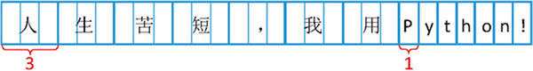

### 一、字符串拼接（包含字符串拼接数字）

在 [Python](http://c.biancheng.net/python/) 中拼接（连接）字符串很简单，可以直接将两个字符串紧挨着写在一起，具体格式为：

```python
strname = "str1" "str2"
```

strname 表示拼接以后的字符串变量名，str1 和 str2 是要拼接的字符串内容。使用这种写法，Python 会自动将两个字符串拼接在一起。

需要注意的是，这种写法只能拼接**字符串常量**。

如果需要使用**变量**，就得借助`+`运算符来拼接，具体格式为：

```python
strname = str1 + str2
```

当然，`+`运算符也能拼接字符串常量。

【示例】使用`+`运算符拼接字符串：

```python
    name = "C++教程"
    url = "http://c.biancheng.net/cplus/"
    info = name + "的网址是：" + url
    print(info)
```

运行结果：

```python
C++教程的网址是：http://c.biancheng.net/cplus/
```

#### 1. Python字符串和数字的拼接

在很多应用场景中，我们需要将字符串和数字拼接在一起，而 **Python 不允许直接拼接数字和字符串**，所以我们**必须先将数字转换成字符串**。可以借助 str() 和 repr() 函数将数字转换为字符串，它们的使用格式为：

```python
str(obj)
repr(obj)
```

obj 表示要转换的对象，它可以是数字、列表、元组、字典等多种类型的数据。

请看下面的代码：

```python
    name = "C语言中文网"
    age = 8
    course = 30
    info = name + "已经" + str(age) + "岁了，共发布了" + repr(course) + "套教程。"
    print(info)
```

运行结果：

```python
C语言中文网已经8岁了，共发布了30套教程。
```

##### str() 和 repr() 的区别

str() 和 repr() 函数虽然都可以将数字转换成字符串，但它们之间是有区别的：

- str() 用于将数据转换成**适合人类阅读**的字符串形式。
- repr() 用于将数据转换成**适合解释器阅读**的字符串形式（Python 表达式的形式），适合在开发和调试阶段使用；如果没有等价的语法，则会发生 SyntaxError 异常。

请看下面的例子：

```python
    s = "http://c.biancheng.net/shell/"
    s_str = str(s)
    s_repr = repr(s)
    print( type(s_str) )
    print (s_str)
    print( type(s_repr) )
    print (s_repr)
```

运行结果：

```python
<class 'str'>
http://c.biancheng.net/shell/
<class 'str'>
'http://c.biancheng.net/shell/'
```

本例中，**s 本身就是一个字符串**，但是我们依然使用 str() 和 repr() 对它进行了转换。从运行结果可以看出，**str() 保留了字符串最原始的样子**，而 **repr() 使用引号将字符串包围起来**，这就是 Python 字符串的表达式形式。

另外，在 Python 交互式编程环境中输入一个表达式（变量、加减乘除、逻辑运算等）时，Python 会自动使用 repr() 函数处理该表达式。

### 二、截取字符串（字符串切片）方法详解

从本质上讲，字符串是由多个字符构成的，字符之间是有顺序的，这个顺序号就称为索引（index）。[Python](http://c.biancheng.net/python/) 允许通过索引来操作字符串中的单个或者多个字符，比如获取指定索引处的字符，返回指定字符的索引值等。

#### 1.获取单个字符

知道字符串名字以后，在方括号`[ ]`中使用索引即可访问对应的字符，具体的语法格式为：

```python
strname[index]   #strname 表示字符串名字，index 表示索引值。
```

#### 2.获取多个字符（字符串截去/字符串切片）

使用`[ ]`除了可以获取单个字符外，还可以指定一个范围来获取多个字符，也就是一个子串或者片段，具体格式为：

```python
strname[start : end : step]
```

### 三、len()函数详解：获取字符串长度或字节数

在实际开发中，除了常常要获取字符串的长度外，有时还要获取**字符串的字节数**。

在 Python 中，不同的字符所占的字节数不同，数字、英文字母、小数点、下划线以及空格，各占一个字节，而一个汉字可能占 2~4  个字节，具体占多少个，取决于采用的编码方式。例如，汉字在 GBK/GB2312 编码中占用 2 个字节，而在 UTF-8 编码中一般占用 3  个字节。

 以 UTF-8 编码为例，字符串“人生苦短，我用Python”所占用的字节数如图 1 所示。



<center>图 1 汉字和英文所占字节数</center>

我们可以通过使用 encode() 方法，将字符串进行编码后再获取它的字节数。例如，采用 **UTF-8 编码方式**，计算“人生苦短，我用Python”的字节数，可以执行如下代码：

```python
>>> str1 = "人生苦短，我用Python"
>>> len(str1.encode())
27
```

因为汉字加中文标点符号共 7 个，占 21 个字节，而英文字母和英文的标点符号占 6 个字节，一共占用 27 个字节。

同理，如果要获取采用 **GBK 编码**的字符串的长度，可以执行如下代码：

```python
>>> str1 = "人生苦短，我用Python"
>>> len(str1.encode('gbk'))
20
```

### 四、split()方法详解：分割字符串

split() 方法可以实现将一个字符串按照指定的分隔符切分成多个子串，这些子串会被保存到列表中（不包含分隔符），作为方法的返回值反馈回来。该方法的基本语法格式如下：

```python
str.split(sep,maxsplit)
```

此方法中各部分参数的含义分别是：

1. str：表示要进行分割的字符串；
2. sep：用于指定分隔符，可以包含多个字符。此参数默认为 None，表示所有空字符，包括空格、换行符“\n”、制表符“\t”等。
3. maxsplit：可选参数，用于指定分割的次数，最后列表中子串的个数最多为 maxsplit+1。如果不指定或者指定为 -1，则表示分割次数没有限制。

例如，定义一个保存 C语言中文网网址的字符串，然后用 split() 方法根据不同的分隔符进行分隔，执行过程如下：

```python
>>> str = "C语言中文网 >>> c.biancheng.net"
>>> str
'C语言中文网 >>> c.biancheng.net'
>>> list1 = str.split() #采用默认分隔符进行分割
>>> list1
['C语言中文网', '>>>', 'c.biancheng.net']
>>> list2 = str.split('>>>') #采用多个字符进行分割
>>> list2
['C语言中文网 ', ' c.biancheng.net']
>>> list3 = str.split('.') #采用 . 号进行分割
>>> list3
['C语言中文网 >>> c', 'biancheng', 'net']
>>> list4 = str.split(' ',4) #采用空格进行分割，并规定最多只能分割成 4 个子串
>>> list4
['C语言中文网', '>>>', 'c.biancheng.net']
>>> list5 = str.split('>') #采用 > 字符进行分割
>>> list5
['C语言中文网 ', '', '', ' c.biancheng.net']
>>>
```

需要注意的是，在未指定 sep 参数时，split() 方法默认采用空字符进行分割，但**当字符串中有连续的空格或其他空字符时，都会被视为一个分隔符对字符串进行分割**，例如：

```python
>>> str = "C语言中文网   >>>   c.biancheng.net"  #包含 3 个连续的空格
>>> list6 = str.split()
>>> list6
['C语言中文网', '>>>', 'c.biancheng.net']
>>>
```

### 五、join()方法：合并字符串

join() 方法也是非常重要的字符串方法，它是 split() 方法的逆方法，用来将列表（或元组）中包含的多个字符串连接成一个字符串。

使用 join() 方法合并字符串时，它会将列表（或元组）中多个字符串采用固定的分隔符连接在一起。例如，**字符串“c.biancheng.net”就可以看做是通过分隔符“.”将 ['c','biancheng','net'] 列表合并为一个字符串的结果。**

join() 方法的语法格式如下：

```python
newstr = str.join(iterable)
```

此方法中各参数的含义如下：

1. newstr：表示合并后生成的新字符串；
2. str：用于指定合并时的分隔符；
3. iterable：做合并操作的源字符串数据，允许以列表、元组等形式提供。

【例 1】将列表中的字符串合并成一个字符串。

```python
>>> list = ['c','biancheng','net']
>>> '.'.join(list)
'c.biancheng.net'
```

【例 2】将元组中的字符串合并成一个字符串。

```python
>>> dir = '','usr','bin','env'
>>> type(dir)
<class 'tuple'>
>>> '/'.join(dir)
'/usr/bin/env'
```

### 六、count()方法：统计字符串出现的次数

count 方法用于检索指定字符串在另一字符串中出现的次数，如果检索的字符串不存在，则返回 0，否则返回出现的次数。

count 方法的语法格式如下：

```python
str.count(sub[,start[,end]])
```

此方法中，各参数的具体含义如下：

1. str：表示原字符串；
2. sub：表示要检索的字符串；
3. start：指定检索的起始位置(包括该起始位置)，也就是从什么位置开始检测。如果不指定，默认从头开始检索；
4. end：指定检索的终止位置(不含该终止位置)，如果不指定，则表示一直检索到结尾。

【例 1】检索字符串“c.biancheng.net”中“.”出现的次数。

```python
>>> str = "c.biancheng.net"
>>> str.count('.')
2
```

【例 2】

```python
>>> str = "c.biancheng.net"
>>> str.count('.',1)
2
>>> str.count('.',2)
1
```

【例 3】

```python
>>> str = "c.biancheng.net"
>>> str.count('.',2,-3)
1
>>> str.count('.',2,-4)
0
```

### 七、find()方法：检测字符串中是否包含某子串

find() 方法用于检索字符串中是否包含目标字符串，如果包含，则**返回第一次出现该字符串的索引**；反之，则返回 -1。

find() 方法的语法格式如下：

```python
str.find(sub[,start[,end]])
```

此格式中各参数的含义如下：

1. str：表示原字符串；
2. sub：表示要检索的目标字符串；
3. start：表示开始检索的起始位置。如果不指定，则默认从头开始检索；
4. end：表示结束检索的结束位置。如果不指定，则默认一直检索到结尾。

【例 1】用 find() 方法检索 “c.biancheng.net” 中首次出现 “.” 的位置索引。

```python
>>> str = "c.biancheng.net"
>>> str.find('.')
1
```

【例 2】手动指定起始索引的位置。

```python
>>> str = "c.biancheng.net"
>>> str.find('.',2)
11
```

【例 3】手动指定起始索引和结束索引的位置。

```python
>>> str = "c.biancheng.net"
>>> str.find('.',2,-4)
-1
```

位于索引（2，-4）之间的字符串为“biancheng”，由于其不包含“.”，因此 find() 方法的返回值为 -1。

注意，[Python](http://c.biancheng.net/python/) 还提供了 **rfind() 方法**，与 find() 方法最大的不同在于，rfind() 是**从字符串右边开始检索**。例如：

```python
>>> str = "c.biancheng.net"
>>> str.rfind('.')
11
```

### 八、index()方法：检测字符串中是否包含某子串

同 find() 方法类似，index() 方法也可以用于检索是否包含指定的字符串，不同之处在于，**当指定的字符串不存在时，index() 方法会抛出异常**。

index() 方法的语法格式如下：

```python
str.index(sub[,start[,end]])
```

此格式中各参数的含义分别是：

1. str：表示原字符串；
2. sub：表示要检索的子字符串；
3. start：表示检索开始的起始位置，如果不指定，默认从头开始检索；
4. end：表示检索的结束位置，如果不指定，默认一直检索到结尾。

【例 1】用 index() 方法检索“c.biancheng.net”中首次出现“.”的位置索引。

```python
>>> str = "c.biancheng.net"
>>> str.index('.')
1
```

【例 2】当检索失败时，index()会抛出异常。

```python
>>> str = "c.biancheng.net"
>>> str.index('z')
Traceback (most recent call last):
  File "<pyshell#49>", line 1, in <module>
    str.index('z')
ValueError: substring not found
```

同 find() 和 rfind() 一样，字符串变量还具有 **rindex() 方法**，其作用和 index() 方法类似，不同之处在于它是**从右边开始检索**，例如：

```python
>>> str = "c.biancheng.net"
>>> str.rindex('.')
11
```

### 九、字符串对齐方法（ljust()、rjust()和center()）详解

#### 1. Python ljust()方法

ljust() 方法的功能是向指定字符串的**右侧填充指定字符**，从而达到**左对齐文本的目的**。

ljust() 方法的基本格式如下：

```python
S.ljust(width[, fillchar])
```

其中各个参数的含义如下：

- S：表示要进行填充的字符串；
- width：表示包括 S 本身长度在内，字符串要占的总长度；
- fillchar：作为可选参数，用来指定填充字符串时所用的字符，默认情况使用空格。

【例 1】

```python
    S = 'http://c.biancheng.net/python/'
    addr = 'http://c.biancheng.net'
    print(S.ljust(35))
    print(addr.ljust(35))
```

输出结果为：

```python
http://c.biancheng.net/python/    
http://c.biancheng.net            
```

注意，该输出结果中除了明显可见的网址字符串外，其后还有空格字符存在，每行一共 35 个字符长度。

【例 2】

```python
    S = 'http://c.biancheng.net/python/'
    addr = 'http://c.biancheng.net'
    print(S.ljust(35,'-'))
    print(addr.ljust(35,'-'))
```

输出结果为：

```python
http://c.biancheng.net/python/-----
http://c.biancheng.net-------------
```

此程序和例 1 的唯一区别是，填充字符从空格改为‘-’。

#### 2. rjust()方法

rjust() 和 ljust() 方法类似，唯一的不同在于，rjust() 方法是向字符串的**左侧填充指定字符**，从而达到**右对齐文本**的目的。

rjust() 方法的基本格式如下：

```python
S.rjust(width[, fillchar])
```

【例 3】

```python
     http://c.biancheng.net/python/
             http://c.biancheng.net   
```

可以看到，每行字符串都占用 35 个字节的位置，实现了整体的右对齐效果。

【例 4】

```python
    S = 'http://c.biancheng.net/python/'
    addr = 'http://c.biancheng.net'
    print(S.rjust(35,'-'))
    print(addr.rjust(35,'-'))
```

输出结果为：

```python
-----http://c.biancheng.net/python/
-------------http://c.biancheng.net
```

#### 3. center()方法

center() 字符串方法与 ljust() 和 rjust() 的用法类似，但它让文本居中，而不是左对齐或右对齐。

center() 方法的基本格式如下：

```python
S.center(width[, fillchar])
```

【例 5】

```python
    S = 'http://c.biancheng.net/python/'
    addr = 'http://c.biancheng.net'
    print(S.center(35,))
    print(addr.center(35,))
```

输出结果为：

```python
   http://c.biancheng.net/python/ 
       http://c.biancheng.net    
```

【例 6】

```python
    S = 'http://c.biancheng.net/python/'
    addr = 'http://c.biancheng.net'
    print(S.center(35,'-'))
    print(addr.center(35,'-'))
```

输出结果为：

```python
---http://c.biancheng.net/python/--
-------http://c.biancheng.net------
```

### 十、startswith()和endswith()方法

#### 1. startswith()方法

startswith() 方法用于检索**字符串是否以指定字符串开头**，如果是返回 True；反之返回 False。此方法的语法格式如下：

```python
str.startswith(sub[,start[,end]])
```

此格式中各个参数的具体含义如下：

1. str：表示原字符串；
2. sub：要检索的子串；
3. start：指定检索开始的起始位置索引，如果不指定，则默认从头开始检索；
4. end：指定检索的结束位置索引，如果不指定，则默认一直检索在结束。

【例 1】判断“c.biancheng.net”是否以“c”子串开头。

```python
>>> str = "c.biancheng.net"
>>> str.startswith("c")
True
```

【例 2】

```python
>>> str = "c.biancheng.net"
>>> str.startswith("http")
False
```

【例 3】从指定位置开始检索。

```python
>>> str = "c.biancheng.net"
>>> str.startswith("b",2)
True
```

#### 2. endswith()方法

endswith() 方法用于检索**字符串是否以指定字符串结尾**，如果是则返回 True；反之则返回 False。该方法的语法格式如下：

```python
str.endswith(sub[,start[,end]])
```

此格式中各参数的含义如下：

1. str：表示原字符串；
2. sub：表示要检索的字符串；
3. start：指定检索开始时的起始位置索引（字符串第一个字符对应的索引值为 0），如果不指定，默认从头开始检索。
4. end：指定检索的结束位置索引，如果不指定，默认一直检索到结束。

【例 4】检索“c.biancheng.net”是否以“net”结束。

```python
>>> str = "c.biancheng.net"
>>> str.endswith("net")
True
```

### 十一、字符串大小写转换

[Python](http://c.biancheng.net/python/) 中，为了方便对字符串中的字母进行大小写转换，字符串变量提供了 3 种方法，分别是 title()、lower() 和 upper()。

#### 1. Python title()方法

title() 方法用于将字符串中每个单词的**首字母转为大写**，**其他字母全部转为小写**，转换完成后，此方法会返回转换得到的字符串。如果字符串中没有需要被转换的字符，此方法会将字符串原封不动地返回。

title() 方法的语法格式如下：

```python
str.title()
```

其中，str 表示要进行转换的字符串。

【例 1】

```python
>>> str = "c.biancheng.net"
>>> str.title()
'C.Biancheng.Net'
>>> str = "I LIKE C"
>>> str.title()
'I Like C'
```

#### 2. Python lower()方法

lower() 方法用于将字符串中的**所有大写字母转换为小写字母**，转换完成后，该方法会返回新得到的字符串。如果字符串中原本就都是小写字母，则该方法会返回原字符串。

```python
str.lower()  #str 表示要进行转换的字符串。
```

【例 2】

```python
>>> str = "I LIKE C"
>>> str.lower()
'i like c'
```

#### 3. Python upper()方法

upper() 的功能和 lower() 方法恰好相反，它用于将字符串中的**所有小写字母转换为大写字母**，和以上两种方法的返回方式相同，即如果转换成功，则返回新字符串；反之，则返回原字符串。

```python
str.upper()
```

【例 3】

```python
>>> str = "i like C"
>>> str.upper()
'I LIKE C'
```

需要注意的是，以上 3 个方法都仅限于将转换后的**新字符串返回**，而**不会修改原字符串**。

### 十二、去除字符串中空格（删除指定字符）

用户输入数据时，很有可能会无意中输入多余的空格，或者在一些场景中，字符串前后不允许出现空格和特殊字符，此时就需要去除字符串中的空格和特殊字符。

```python
这里的特殊字符，指的是制表符（\t）、回车符（\r）、换行符（\n）等。
```

[Python](http://c.biancheng.net/python/) 中，字符串变量提供了 3 种方法来删除字符串中多余的**空格**和**特殊字符**，它们分别是：

1. strip()：删除字符串前后（左右两侧）的空格或特殊字符。
2. lstrip()：删除字符串前面（左边）的空格或特殊字符。
3. rstrip()：删除字符串后面（右边）的空格或特殊字符。

注意，**Python 的 str 是不可变的**（不可变的意思是指，字符串一旦形成，它所包含的字符序列就不能发生任何改变），因此这三个方法**只是返回**字符串前面或后面空白被删除之后的**副本**，**并不会改变字符串本身**。

#### 1. Python strip()方法

strip() 方法用于删除字符串左右两个的空格和特殊字符，该方法的语法格式为：

```python
str.strip([chars])
```

其中，str 表示原字符串，[chars] 用来指定要删除的字符，可以同时指定多个，如果不手动指定，则默认会删除空格以及制表符、回车符、换行符等特殊字符。

【例 1】

```python
>>> str = "  c.biancheng.net \t\n\r"
>>> str.strip()
'c.biancheng.net'
>>> str.strip("\r")
'c.biancheng.net \t\n'
>>> str
'  c.biancheng.net \t\n\r'
```

分析运行结果不难看出，通过 strip() 确实能够删除字符串左右两侧的空格和特殊字符，但并**没有真正改变字符串本身**。

#### 2. Python lstrip()方法

lstrip() 方法用于去掉字符串**左侧**的空格和特殊字符。该方法的语法格式如下：

```python
str.lstrip([chars])
```

【例 2】

```python
>>> str = "  c.biancheng.net \t\n\r"
>>> str.lstrip()
'c.biancheng.net \t\n\r'
```

#### 3. Python rstrip()方法

rstrip() 方法用于删除字符串**右侧**的空格和特殊字符，其语法格式为：

```python
str.rstrip([chars])
```

【例 3】

```python
>>> str = "  c.biancheng.net \t\n\r"
>>> str.rstrip()
'  c.biancheng.net'
```

### 十三、format()格式化输出

format() 方法的语法格式如下：

```python
str.format(args)
```

str 用于指定字符串的显示样式；args 用于指定要进行格式转换的项，如果有多项，之间有逗号进行分割。

**暂且省略，后续补充**

### 十四、encode()和decode()方法：字符串编码转换

在 Python 中，有 2 种常用的字符串类型，分别为 str 和 bytes 类型，其中 str 用来表示 Unicode 字符，bytes 用来表示二进制数据。str 类型和 bytes 类型之间就需要使用 encode() 和 decode() 方法进行转换。

#### 1. Python encode()方法

**encode() 方法为字符串类型（str）提供的方法**，用于**将 str 类型转换成 bytes 类型**，这个过程也称为“编码”。

 encode() 方法的语法格式如下：

```python
str.encode([encoding="utf-8"],[errors="strict"])
```

注意，格式中用 [] 括起来的参数为可选参数，也就是说，在使用此方法时，可以使用 [] 中的参数，也可以不使用。

该方法各个参数的含义如表 1 所示。

<center>表 1 encode()参数及含义</center>

| 参数               | 含义                                                         |
| ------------------ | ------------------------------------------------------------ |
| str                | 表示要进行转换的字符串。                                     |
| encoding = "utf-8" | 指定进行编码时采用的字符编码，该选项默认采用 utf-8 编码。例如，如果想使用简体中文，可以设置 gb2312。    当方法中只使用这一个参数时，可以省略前边的“encoding=”，直接写编码格式，例如 str.encode("UTF-8")。 |
| errors = "strict"  | 指定错误处理方式，其可选择值可以是：  strict：遇到非法字符就抛出异常。 ignore：忽略非法字符。 replace：用“？”替换非法字符。 xmlcharrefreplace：使用 xml 的字符引用。 该参数的默认值为 strict。 |

> 注意，使用 encode() 方法对原字符串进行编码，**不会直接修改原字符串**，如果想修改原字符串，需要重新赋值。

【例 1】将 str 类型字符串“C语言中文网”转换成 bytes 类型。

```python
>>> str = "C语言中文网"
>>> str.encode()
b'C\xe8\xaf\xad\xe8\xa8\x80\xe4\xb8\xad\xe6\x96\x87\xe7\xbd\x91'
```

此方式**默认采用 UTF-8 编码**，也可以手动指定其它编码格式，例如：

```python
>>> str = "C语言中文网"
>>> str.encode('GBK')
b'C\xd3\xef\xd1\xd4\xd6\xd0\xce\xc4\xcd\xf8'
```

#### 2. Python decode()方法

和 encode() 方法正好相反，**decode() 方法用于将 bytes 类型的二进制数据转换为 str 类型**，这个过程也称为“解码”。

decode() 方法的语法格式如下：

```python
bytes.decode([encoding="utf-8"][,errors="strict"])
```

该方法中各参数的含义如表 2 所示。

<center>表 2 decode()参数及含义</center>

| 参数              | 含义                                                         |
| ----------------- | ------------------------------------------------------------ |
| bytes             | 表示要进行转换的二进制数据。                                 |
| encoding="utf-8"  | 指定解码时采用的字符编码，默认采用 utf-8 格式。当方法中只使用这一个参数时，可以省略“encoding=”，直接写编码方式即可。    注意，对 bytes 类型数据解码，要选择和当初编码时一样的格式。 |
| errors = "strict" | 指定错误处理方式，其可选择值可以是：  strict：遇到非法字符就抛出异常。 ignore：忽略非法字符。 replace：用“？”替换非法字符。 xmlcharrefreplace：使用 xml 的字符引用。 该参数的默认值为 strict。 |

【例 2】

```python
>>> str = "C语言中文网"
>>> bytes=str.encode()
>>> bytes.decode()
'C语言中文网'
```

注意，如果编码时采用的不是默认的 UTF-8 编码，则**解码时要选择和编码时一样的格式**，否则会抛出异常，例如：

```python
>>> str = "C语言中文网"
>>> bytes = str.encode("GBK")
>>> bytes.decode()  #默认使用 UTF-8 编码，会抛出以下异常
Traceback (most recent call last):
  File "<pyshell#10>", line 1, in <module>
    bytes.decode()
UnicodeDecodeError: 'utf-8' codec can't decode byte 0xd3 in position 1: invalid continuation byte
>>> bytes.decode("GBK")
'C语言中文网'
```

### 十五、dir()和help()帮助函数

1. **dir() 函数**用来列出某个类或者某个模块中的全部内容，包括变量、方法、函数和类等，它的用法为：

```python
dir(obj)  #obj 表示要查看的对象。obj 可以不写，此时 dir() 会列出当前范围内的变量、方法和定义的类型。
```

2. **help() 函数**用来查看某个函数或者模块的帮助文档，它的用法为：

```python
help(obj)  #obj 表示要查看的对象。obj 可以不写，此时 help() 会进入帮助子程序。
```

【实例】使用 dir() 查看字符串类型（str）支持的所有方法：

```python
>>> dir(str)
['__add__', '__class__', '__contains__', '__delattr__', '__dir__', '__doc__', '__eq__', '__format__', '__ge__', '__getattribute__', '__getitem__', '__getnewargs__', '__gt__', '__hash__', '__init__', '__init_subclass__', '__iter__', '__le__', '__len__', '__lt__', '__mod__', '__mul__', '__ne__', '__new__', '__reduce__', '__reduce_ex__', '__repr__', '__rmod__', '__rmul__', '__setattr__', '__sizeof__', '__str__', '__subclasshook__', 'capitalize', 'casefold', 'center', 'count', 'encode', 'endswith', 'expandtabs', 'find', 'format', 'format_map', 'index', 'isalnum', 'isalpha', 'isascii', 'isdecimal', 'isdigit', 'isidentifier', 'islower', 'isnumeric', 'isprintable', 'isspace', 'istitle', 'isupper', 'join', 'ljust', 'lower', 'lstrip', 'maketrans', 'partition', 'replace', 'rfind', 'rindex', 'rjust', 'rpartition', 'rsplit', 'rstrip', 'split', 'splitlines', 'startswith', 'strip', 'swapcase', 'title', 'translate', 'upper', 'zfill']
```

在 Python 标准库中，以`__`开头和结尾的方法都是私有的，不能在类的外部调用。

【实例】使用 help() 查看 str 类型中 lower() 函数的用法：

```python
>>> help(str.lower)
Help on method_descriptor:

lower(self, /)
    Return a copy of the string converted to lowercase.
```

可以看到，lower() 函数用来将字符串中的字母转换为小写形式，并返回一个新的字符串。

注意，使用 **help() 查看某个函数的用法时，函数名后边不能带括号**，例如将上面的命令写作`help(str.lower())`就是错误的。