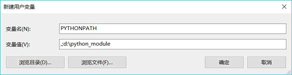

### 一、Python模块化编程

举个简单的例子，在某一目录下（桌面也可以）创建一个名为 **hello.py** 文件，其包含的代码如下：

```python
    def say ():
        print("Hello,World!")
```

在**同一目录下**，再创建一个 **say.py** 文件，其包含的代码如下：

```python
    #通过 import 关键字，将 hello.py 模块引入此文件
    import hello
    hello.say()
```

运行 **say.py** 文件，其输出结果为：

```python
Hello,World!
```

**say.py 文件中使用了原本在 hello.py 文件中才有的 say() 函数**，相对于 say.py 来说，hello.py  就是一个自定义的模块（有关自定义模块，后续章节会做详细讲解），我们**只需要将 hellp.py 模块导入到 say.py 文件中，就可以直接在  say.py 文件中使用模块中的资源**。

与此同时，当调用模块中的 say() 函数时，使用的语法格式为“模块名.函数”，这是因为，相对于 say.py 文件，hello.py 文件中的代码自成一个命名空间，因此**在调用其他模块中的函数时，需要明确指明函数的出处，否则 Python 解释器将会报错**。

### 二、Python import用法

前面章节中，已经看到使用 import 导入模块的语法，但实际上 import 还有更多详细的用法，主要有以下两种：

1. `import 模块名1 [as 别名1], 模块名2 [as 别名2]，…`：使用这种语法格式的 import 语句，会导入指定模块中的所有成员（包括变量、函数、类等）。不仅如此，当需要使用模块中的成员时，需用该模块名（或别名）作为前缀，否则 Python 解释器会报错。
2. `from 模块名 import 成员名1 [as 别名1]，成员名2 [as 别名2]，…`： 使用这种语法格式的 import 语句，只会导入模块中指定的成员，而不是全部成员。同时，当程序中使用该成员时，无需附加任何前缀，直接使用成员名（或别名）即可。

注意，用 [] 括起来的部分，可以使用，也可以省略。

> 其中，第二种 import 语句也可以**导入指定模块中的所有成员**，即使用 **form 模块名 import ＊**，但此方式不推荐使用，具体原因本节后续会做详细说明。

#### 1. import 模块名 as 别名（使用时需要添加模块名作为前缀）

下面程序使用导入整个模块的最简单语法来导入指定模块：

```python
    # 导入sys整个模块
    import sys
    # 使用sys模块名作为前缀来访问模块中的成员
    print(sys.argv[0])
```

运行上面程序，可以看到如下输出结果（sys 模块下的 argv 变量用于获取运行 Python 程序的命令行参数，其中 argv[0] 用于获取当前 Python 程序的存储路径）：

```python
C:\Users\mengma\Desktop\hello.py
```

**导入整个模块时，也可以为模块指定别名**。例如如下程序：

```python
    # 导入sys整个模块，并指定别名为s
    import sys as s
    # 使用s模块别名作为前缀来访问模块中的成员
    print(s.argv[0])
```

第 2 行代码在导入 sys 模块时才指定了别名 s，因此在程序中使用 sys 模块内的成员时，**必须添加模块别名 s 作为前缀**。运行该程序，可以看到如下输出结果：

```python
C:\Users\mengma\Desktop\hello.py
```

也可以一次导入多个模块，**多个模块之间用逗号隔开**。例如如下程序：

```python
    # 导入sys、os两个模块
    import sys,os
    # 使用模块名作为前缀来访问模块中的成员
    print(sys.argv[0])
    # os模块的sep变量代表平台上的路径分隔符
    print(os.sep)
```

**在导入多个模块的同时，也可以为模块指定别名**，例如如下程序：

```python
    # 导入sys、os两个模块，并为sys指定别名s，为os指定别名o
    import sys as s,os as o
    # 使用模块别名作为前缀来访问模块中的成员
    print(s.argv[0])
    print(o.sep)
```

上面第 2 行代码一次导入了sys 和 os 两个模块，并分别为它们指定别名为 s、o，因此程序可以通过 s、o 两个前缀来使用 sys、os 两个模块内的成员。在 Windows 平台上运行该程序，可以看到如下输出结果：

```python
C:\Users\mengma\Desktop\hello.py
\
```

#### 2. from 模块名 import 成员名 as 别名(使用时不需要模块名作为前缀)

下面程序使用了 **from...import 最简单的语法来导入指定成员**：

```python
    # 导入sys模块的argv成员
    from sys import argv
    # 使用导入成员的语法，直接使用成员名访问
    print(argv[0])
```

第 2 行代码**导入了 sys 模块中的 argv 成员**，这样**即可在程序中直接使用 argv 成员，无须使用任何前缀**。运行该程序，可以看到如下输出结果：

```python
C:\Users\mengma\Desktop\hello.py
```

**导入模块成员时，也可以为成员指定别名**，例如如下程序：

```python
    # 导入sys模块的argv成员，并为其指定别名v
    from sys import argv as v
    # 使用导入成员（并指定别名）的语法，直接使用成员的别名访问
    print(v[0])
```

form...import 导入模块成员时，**支持一次导入多个成员**，例如如下程序：

```python
    # 导入sys模块的argv,winver成员
    from sys import argv, winver
    # 使用导入成员的语法，直接使用成员名访问
    print(argv[0])
    print(winver)
```

上面第 2 行代码导入了 sys 模块中的 argv、 winver 成员，这样即可在程序中直接使用 argv、winver 两个成员，无须使用任何前缀。运行该程序，可以看到如下输出结果（**sys 的 winver 成员记录了该 Python 的版本号**）：

```python
C:\Users\mengma\Desktop\hello.py
3.6
```

**一次导入多个模块成员时，也可指定别名**，同样使用 as 关键字为成员指定别名，例如如下程序：

```python
    # 导入sys模块的argv,winver成员，并为其指定别名v、wv
    from sys import argv as v, winver as wv
    # 使用导入成员（并指定别名）的语法，直接使用成员的别名访问
    print(v[0])
    print(wv)
```

上面第 2 行代码导入了 sys 模块中的 argv、winver 成员，并分别为它们指定了别名 v、wv，这样即可在程序中通过 v 和 wv 两个别名使用 argv、winver 成员，**无须使用任何前缀**。运行该程序，可以看到如下输出结果：

#### 3. 不推荐使用 from import 导入模块所有成员

在使用 from...import 语法时，可以一次导入指定模块内的所有成员（此方式不推荐），例如如下程序：

```python
    #导入sys 棋块内的所有成员
    from sys import *
    #使用导入成员的语法，直接使用成员的别名访问
    print(argv[0])
    print(winver)
```

上面代码一次导入了 sys 模块中的所有成员，这样程序即可通过成员名来使用该模块内的所有成员。

需要说明的是，一般不推荐使用“from 模块 import”这种语法导入指定模块内的所有成员，因为它存在潜在的风险。比如**同时导入 module1 和 module2 内的所有成员，假如这两个模块内都有一个 foo() 函数，那么当在程序中执行如下代码时**：

```python
foo()    #因为不需要前缀,所以导致了歧义
```

**上面调用的这个 foo() 函数到底是 module1 模块中的还是 module2 模块中的？因此，这种导入指定模块内所有成员的用法是有风险的。**

但如果换成如下两种导入方式：

```python
import module1
import module2 as m2
```

接下来要分别调用这两个模块中的 foo() 函数就非常清晰**（因为必须要模块名作为前缀）**。程序可使用如下代码：

```python
    #使用模块module1 的模块名作为前缀调用foo()函数
    module1.foo()
    #使用module2 的模块别名作为前缀调用foo()函数
    m2.foo()
```

**或者使用 from...import 语句也是可以的**：

```python
    #导入module1 中的foo 成员，并指定其别名为foo1
    from module1 import foo as fool
    #导入module2 中的foo 成员，并指定其别名为foo2
    from module2 import foo as foo2
```

此时通过别名将 module1 和 module2 两个模块中的 foo 函数很好地进行了区分，接下来分别调用两个模块中 foo() 函数就很清晰：

```python
foo1() #调用module1 中的foo()函数
foo2() #调用module2 中的foo()函数
```

### 三、自定义模块

前面章节中讲过，Python 模块就是 Python 程序，换句话说，只要是 Python 程序，都可以作为模块导入。例如，下面定义了一个简单的模块（编写在 demo.py 文件中）：

```python
    name = "Python教程"
    add = "http://c.biancheng.net/python"
    print(name,add)
    def say():
        print("人生苦短，我学Python！")
    class CLanguage:
        def __init__(self,name,add):
            self.name = name
            self.add = add
        def say(self):
            print(self.name,self.add)
```

可以看到，我们在 demo.py 文件中放置了变量（name 和 add）、函数（ say() ）以及一个 Clanguage 类，该文件就可以作为一个模板。

但通常情况下，为了检验模板中代码的正确性，我们往往需要为其设计一段测试代码，例如：

```python
    say()
    clangs = CLanguage("C语言中文网","http://c.biancheng.net")
    clangs.say()
```

运行 demo.py 文件，其执行结果为：

```python
Python教程 http://c.biancheng.net/python
人生苦短，我学Python！
C语言中文 http://c.biancheng.net
```

在此基础上，我们可以新建一个 test.py 文件，并在该文件中使用 demo.py 模板文件，即使用 import 语句导入 demo.py：

```python
import demo

```

注意，**虽然 demo 模板文件的全称为 demo.py，但在使用 import 语句导入时，只需要使用该模板文件的名称即可**。

此时，如果直接运行 test.py 文件，其执行结果为：

```python
Python教程 http://c.biancheng.net/python
人生苦短，我学Python！
C语言中文 http://c.biancheng.net
```

可以看到，**当执行 test.py 文件时，它同样会执行 demo.py 中用来测试的程序**，这显然不是我们想要的效果。**正常的效果应该是**，**只有直接运行模板文件时，测试代码才会被执行**；反之，如果是其它程序**以引入的方式执行模板文件，则测试代码不应该被执行**。

要实现这个效果，**可以借助 Python 内置的 __ name __ 变量**。**当直接运行一个模块时，name 变量的值为 __ main __** ；而将**模块被导入其他程序中并运行该程序时，处于模块中的 __ name __  变量的值就变成了模块名**。因此，如果希望测试函数只有在直接运行模块文件时才执行，则可在调用测试函数时增加判断，即只有当 __ name __  =='__ main __' 时才调用测试函数。

因此，我们可以修改 demo.py 模板文件中的测试代码为：

```python
    if __name__ == '__main__':
        say()
        clangs = CLanguage("C语言中文网","http://c.biancheng.net")
        clangs.say()
```

这样，**当我们直接运行 demo.py 模板文件时，其执行结果不变**；而**运行 test.py 文件时**，其执行结果为：

```python
Python教程 http://c.biancheng.net/python
```

显然，这里**执行的仅是模板文件中的输出语句**，测试代码并未执行。

#### 自定义模块编写说明文档

我们知道，在定义函数或者类时，可以为其添加说明文档，以方便用户清楚的知道该函数或者类的功能。自定义模块也不例外。

为自定义模块添加说明文档，和函数或类的添加方法相同，即只需**在模块开头的位置定义一个字符串即可**。例如，为 demo.py 模板文件添加一个说明文档：

```python
'''
demo 模块中包含以下内容：
name 字符串变量：初始值为“Python教程”
add    字符串变量：初始值为“http://c.biancheng.net/python”
say() 函数
CLanguage类：包含 name 和 add 属性和 say() 方法。
'''
```

在此基础上，我们可以通过模板的 **__ doc __ 属性**，来访问模板的说明文档。例如，在 test.py 文件中添加如下代码：

```python
    import demo
    print(demo.__doc__)
```

程序运行结果为：

```python
Python教程 http://c.biancheng.net/python

demo 模块中包含以下内容：
name 字符串变量：初始值为“Python教程”
add    字符串变量：初始值为“http://c.biancheng.net/python”
say() 函数
CLanguage类：包含 name 和 add 属性和 say() 方法。
```

### 四、导入模块的3种方式

即自定义 [Python](http://c.biancheng.net/python/) 模板后，在其它文件中用 import（或 from...import） 语句引入该文件时，Python 解释器同时如下错误：

**ModuleNotFoundError: No module named '模块名'**

意思是 Python 找不到这个模块名，这是什么原因导致的呢？要想解决这个问题，要先搞清楚 **Python 解释器查找模块文件的过程**。

通常情况下，当使用 import 语句导入模块后，**Python 会按照以下顺序查找指定的模块文件**：

- 在当前目录，即当前执行的程序文件所在目录下查找；
- 到 PYTHONPATH（环境变量）下的每个目录中查找；
- 到 Python 默认的安装目录下查找。


以上所有涉及到的目录，都保存在**标准模块 sys 的 sys.path  变量**中，通过此变量我们可以看到指定程序文件支持查找的所有目录。换句话说，**如果要导入的模块没有存储在 sys.path  显示的目录中，那么导入该模块并运行程序时，Python 解释器就会抛出 ModuleNotFoundError（未找到模块）异常。**

解决“Python找不到指定模块”的方法有 3 种，分别是：

1. 向 sys.path 中临时添加模块文件存储位置的完整路径；
2. 将模块放在 sys.path 变量中已包含的模块加载路径中；
3. 设置 path 系统环境变量。


为了能更方便地讲解，本节使用前面章节已建立好的 **hello.py 自定义模块文件（D:\python_module\hello.py）**和  **say.py 程序文件（C:\Users\mengma\Desktop\say.py，位于桌面上）**，它们各自包含的代码如下：

```python
    #hello.py
    def say ():
        print("Hello,World!")
    #say.py
    import hello
    hello.say()
```

显然，**hello.py 文件和 say.py 文件并不在同一目录**，此时运行 say.py 文件，其运行结果为：

```python
 Traceback (most recent call last):
  File "C:\Users\mengma\Desktop\say.py", line 1, in <module>
    import hello
ModuleNotFoundError: No module named 'hello'
```

可以看到，**Python 解释器抛出了 ModuleNotFoundError 异常**。接下来，分别用以上 3 种方法解决这个问题。

#### 1. 导入模块方式一：临时添加模块完整路径

**模块文件的存储位置，可以临时添加到 sys.path 变量中**，即向 sys.path 中添加 D:\python_module（hello.py 所在目录），**在 say.py 中的开头位置添加如下代码：**

```python
    import sys
    sys.path.append('D:\\python_module')
```

注意：在添加完整路径中，路径中的 '\' 需要使用 \ 进行转义，否则会导致语法错误。再次运行 say.py 文件，运行结果如下：

```python
Hello,World!
```

**需要注意的是，通过该方法添加的目录，只能在执行当前文件的窗口中有效，窗口关闭后即失效。**

#### 2. 导入模块方式二：将模块保存到指定位置

**如果要安装某些通用性模块**，比如复数功能支持的模块、矩阵计算支持的模块、图形界面支持的模块等，这些都**属于对 Python 本身进行扩展的模块，这种模块应该直接安装在 Python 内部**，以便被所有程序共享，此时就**可借助于 Python 默认的模块加载路径。**

Python 程序**默认的模块加载路径**保存在 **sys.path 变量**中，因此，我们可以在 say.py 程序文件中先看看 sys.path 中保存的默认加载路径，向 say.py 文件中输出 sys.path 的值，如下所示：

> ['C:\\Users\\mengma\\Desktop', 'D:\\python3.6\\Lib\\idlelib',  'D:\\python3.6\\python36.zip', 'D:\\python3.6\\DLLs',  'D:\\python3.6\\lib', 'D:\\python3.6',  'C:\\Users\\mengma\\AppData\\Roaming\\Python\\Python36\\site-packages', **'D:\\python3.6\\lib\\site-packages'**, 'D:\\python3.6\\lib\\site-packages\\win32',  'D:\\python3.6\\lib\\site-packages\\win32\\lib',  'D:\\python3.6\\lib\\site-packages\\Pythonwin']

上面的运行结果中，列出的所有路径都是 Python 默认的模块加载路径，但通常来说，我们**默认将 Python 的扩展模块添加在 `lib\site-packages` 路径下，它专门用于存放 Python 的扩展模块和包。**

所以，我们可以直接将我们已编写好的 hello.py 文件添加到 `lib\site-packages` 路径下，就相当于为 Python 扩展了一个 hello 模块，这样任何 Python 程序都可使用该模块。

移动工作完成之后，再次运行 say.py 文件，可以看到成功运行的结果：

```python
Hello,World!
```

#### 3.  导入模块方式三：设置环境变量

PYTHONPATH 环境变量（简称 path 变量）的值是很多路径组成的集合，Python 解释器会按照 path  包含的路径进行一次搜索，直到找到指定要加载的模块。当然，如果最终依旧没有找到，则 Python 就报 ModuleNotFoundError  异常。

##### 在 Windows 平台上设置环境变量


通过该对话框，就可以完成 path 环境变量的设置。需要注意的是，该对话框分为上下 2 部分，其中**上面的“用户变量”**部分用于设置当前用户的环境变量，**下面的“系统变量”**部分用于设置整个系统的环境变量。

> 对于普通用户来说，设置用户 path 变量和系统 path 变量的效果是相同的，但 Python 在使用 path 变量时，会先按照系统 path 变量的路径去查找，然后再按照用户 path 变量的路径去查找。

这里我们选择设置当前用户的 path 变量。单击用户变量中的“新建”按钮， 系统会弹出如下图所示的对话框。



其中，在“变量名”文本框内输入 PYTHONPATH，表明将要建立名为 PYTHONPATH 的环境变量；在“变量值”文本框内输入 `.;d:\python_ module`。注意，**这里其实包含了两条路径**（**以分号 ；作为分隔符**）：

- **第一条路径为一个点（.），表示当前路径**，当运行 Python 程序时，Python 将可以从当前路径加载模块；
- 第二条路径为 `d:\python_ module`，当运行 Python 程序时，Python 将可以从 `d:\python_ module` 中加载模块。

然后点击“确定”，即成功设置 path 环境变量。此时，我们**只需要将模块文件移动到和引入该模块的文件相同的目录，或者移动到 `d:\python_ module` 路径下，该模块就能被成功加载。**

##### 在 Linux 上设置环境变量

Linux 平台的**环境变量**是通过 **.bash_profile 文件**(home目录下的隐藏文件)来设置的，使用无格式编辑器打开该文件，在该文件中添加 PYTHONPATH 环境变量。也就是为该文件增加如下一行：

```python
#设置PYTHON PATH 环境变量
PYTHONPATH=.:/home/mengma/python_module
```

Linux 与 Windows 平台不一样，**多个路径之间以冒号（:）作为分隔符**，因此上面一行同样设置了两条路径，点（.）代表当前路径，还有一条路径是 `/home/mengma/python_module`（mengma 是在 Linux 系统的登录名）。

在完成了 PYTHONPATH 变量值的设置后，在 .bash_profile 文件的最后添加导出 PYTHONPATH 变量的语句。

```python
#导出PYTHONPATH 环境变量
export PYTHONPATH
```

重新登录 Linux 平台，或者执行如下命令：

```python
source.bash_profile
```

这两种方式都是为了运行该文件，使在文件中设置的 PYTHONPATH 变量值生效。

在成功设置了上面的环境变量之后，接下来只要把前面定义的模块（Python 程序）放在与当前所运行 Python 程序相同的路径中（或放在 `/home/mengma/python_module` 路径下），该模块就能被成功加载了。

### 五、__ all __变量用法