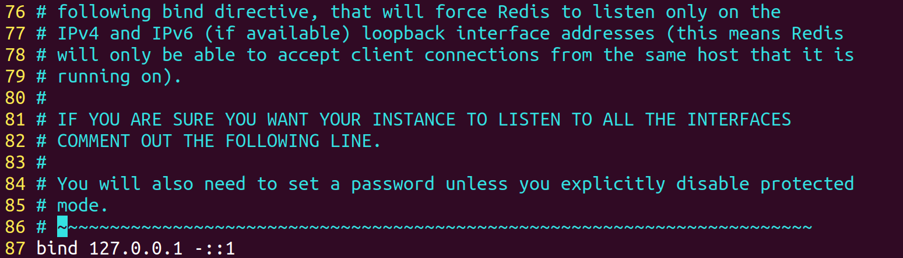
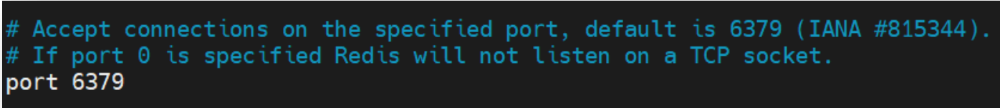

## 一、Redis 的安装

### 1.1 安装 gcc

由于 Redis 是由 C/C++语言编写的，而从官网下载的 Redis 安装包是需要编译后才可安装的，所以对其进行编译就必须要使用相关编译器。对于 C/C++语言的编译器，使用最多的是gcc 与 gcc-c++，而这两款编译器在 CentOS7 中是没有安装的，所以首先要安装这两款编译器。

```shell
sudo apt-get install -y gcc g++ 
```

### 1.2 下载 Redis

redis 的官网为： http://redis.io。点击链接可以直接进行下载。

需要注意，因为基于linux C/C++ ，因此只有linux版本，没有windows版本。

### 1.3 安装Redis

1. **解压 Redis**

​      将 Redis 解压到/opt/apps 目录（并不固定）中。


进入到/opt/apps 目录中再将 Redis 解压包目录更名为 redis（不更名也无所谓）。 


2. **编译**

​		编译过程是根据 Makefile 文件进行的，而 Redis 解压包中已经存在该Makefile文件了。所以可以直接进行编译了。

​		进入到解压目录中，然后执行编译命令 make。


​		当看到如下提示时，表示编译成功。


3. **安装**

​		在 Linux 中对于编译过的安装包执行 make install 进行安装。


​		可以看到，共安装了三个组件：**redis 服务器**、**客户端**与一个**性能测试工具 benchmark**。 

4. **查看`bin`目录**

​		安装完成后，打开/usr/local/bin 目录，可以看到出现了很多的文件。


​		通过 echo $PATH 可以看到，/usr/local/bin 目录是存在于该系统变量中的，这样这些命令就可以在任意目录中执行了


## 二、Redis的安装与配置

### 2.1 Redis的启动和停止

#### 2.1.1 前台方式启动

在任意目录执行 `redis-server` 命令即可启动 Redis。**这种启动方式会占用当前命令行窗口。**通过 Ctrl + C 命令可以停止 Redis。


再开启一个会话窗口，可以查看到当前的 Redis 进程，默认端口号为 6379。

```shell
ps aux | grep redis
```


如果在使用  Ctrl + C 命令关闭redis时，出现以下错误：


可以使用 Crtl + Z 强制退出，然后使用 kill -9 xxx 杀死redis进程。


#### 2.1.2 后台守护进程方式启动

**使用 `nohup` 命令，最后再添加一个&符**，可以使要启动的程序在后台以守护进程方式运行。这样的好处是，进程启动后不会占用一个会话窗口，且其还会在当前目录，即运行启动命令的当前目录中创建一个 nohup.out 文件用于记录 Redis 的操作日志。


#### 2.1.3 Redis 的停止

通过 `redis-cli shutdown` 命令可以停止 Redis。 

如果遇到以下情况，无法关闭redis：


可以通过以下方法解决（添加权限）：


#### 2.1.4 配置式后台启动

使用 `nohup` 命令可以使 Redis 后台启动，但每次都要键入 `nohup` 与`&`符，比较麻烦。可以**通过修改 Linux 中 Redis 的核心配置文件 `redis.conf` 达到后台启动的目的**。`redis.conf` 文件**在Redis 的安装目录根下。**


```
sudo vim redis.conf
```


```
vim 显示行号
只须按ESC键退出编辑内容模式，输入“：” ，再输入“set number”或者“set nu”后按回车键，就可以显示行号了
```

在`vim`中通过输入`/daemonize`的方式可以查看相关的匹配项。**这里将daemonize 从 no 设置为 yes**

**修改完成后，我们需要关闭redis，并重新启动，启动方式为：**

```
redis-server /opt/app/redis/redis.conf
```


修改后再启动 Redis，就无需再键入 nohup 与&符了，但**必须要指定启动所使用的 Redis配置文件**。这是为什么呢？

​	使用 nohup redis-server &命令启动 Redis 时，启动项中已经设置好了 Redis 各个参数的默认值，Redis 会按照这些设置的参数进行启动。但这些参数是可以在配置文件中进行修改的，修改后，需要在启动命令中指定要加载的配置文件，这样，配置文件中的参数值将覆盖原默认值。Redis 已经给我们提供好了配置文件模板，是 Redis 安装目录的根目录下的 redis.conf 文件。由于刚刚对 redis.conf 配置文件做了修改，所以在开启 Redis 时需要显示指出要加载的配置文件。配置文件应紧跟在 redis-server 的后面。

#### 2.1.5 登录redis客户端

在启动redis服务器之后，就可以登录redis客户端了，通过以下命令：

```
redis-cli
```


### 2.2 连接前的配置

​	Redis 是一个内存数据库服务器，就像 MySQL 一样，对其操作也需要通过客户端进行。**若要使远程主机上的客户端能够连接并访问到服务端的 Redis，则服务端首先要做如下配置。**

#### 2.2.1 绑定客户端 IP

Redis 可以通过修改配置文件来限定可以访问自己的客户端 IP。



**以上的设置，表示只允许当前主机访问当前的 Redis，其它主机均不可访问**。所以，**如果不想限定访问的客户端，只需要将该行注释掉即可**


#### 2.2.2 关闭保护模式

默认保护模式是开启的。其**只允许本机的客户端访问，即只允许自己访问自己**。但**生产中应该关闭**，以确保其它客户端可以连接 Redis。


#### 2.2.3 设置访问密码

为 Redis 设置访问密码，可以对要读/写 Redis 的用户进行身份验证。**没有密码的用户可以登录 Redis，但无法访问。**

1.  **密码设置**

访问密码的设置位置在 redis.conf 配置文件中。**默认是被注释掉的，没有密码。**


添加密码`111`


没有通过密码登录的用户，无法读/写 Redis。 


2. **使用密码**

​	对于密码的使用，有两种方式：**登录时未使用密码，则访问时先输入密码**；**登录时直接使用密码登录，访问时无需再输入密码**

​			A、**登录时未使用密码**

​						使用 `auth passwd` 指令

​	

​		

​			B、**登录时使用密码**

​		


​			C、 **退出时使用密码**

​					登录时没有使用密码的用户，将无法退出redis数据库


#### 2.2.4 禁止/重命名命令

​	**后面要学习两个非常危险的命令：flushal 与 flushdb**。它们都是**用于直接删除整个 Redis数据库的**。若让用户可以随便使用它们，可能会危及数据安全。**Redis 可以通过修改配置文件来禁止使用这些命令，或重命名这些命令**。以下配置，禁用了 flushall 与 flushdb 命令。当然，在学习过程中暂时不禁用它们。

**通过将命令重命名为空字符串`""`即可达到禁用命令的效果。**


## 三、Redis 客户端分类

​	Redis 客户端也像 MySQL 客户端一样有多种类型：命令行客户端、图形界面客户端、各类语言的代码(JAVA/GO/PHP/C++等)客户端。

### 3.1 命令行客户端

Redis 提供了基本的命令行客户端。打开命令行客户端的命令为 redis-cli。


-  -h：指定要连接的 Redis 服务器的 IP。 
-  -p：指定要连接的 Redis 的端口号。

**若连接的是本机 Redis，且端口号没有改变，保持默认的 6379，则-h 与-p 选项可以省略不写**

### 3.2 图形界面客户端

1.  **Redis Desktop Manager**

​		Redis 的图形界面客户端很多，其中较出名的是 Redis Desktop Manager 的客户端。不过，该软件原来是免费软件，从 0.8.8 版本后变为了商业化收费软件。

官网为：https://resp.app/（原来是 http://redisdesktop.com）。

2. **RedisPlus**

​		RedisPlus 是为 Redis 可视化管理开发的一款开源免费的桌面客户端软件，支持 Windows 、Linux、Mac 三大系统平台，RedisPlus 提供更加高效、方便、快捷的使用体验，有着更加现代化的用户界面风格。

​	RedisPlus 的官网地址为 https://gitee.com/MaxBill/RedisPlus。

### 3.3 Java 代码客户端

​		所谓 Java 代码客户端就是一套操作 Redis 的 API，其作用就像 JDBC 一样，所以 Java 代码客户端其实就是一个或多个 Jar 包，提供了对 Redis 的操作接口。对 Redis 操作的 API 很多，例如 jdbc-redis、jredis 等，但最常用也是最有名的是 Jedis。

## 四、Redis 配置文件详解

​	Redis 的核心配置文件 **redis.conf** 在安装根目录下，默认包含 2000 多行。这些内容根据功能被划分为了很多部分。下面将一些重要部分进行介绍。

### 4.1 基础说明


这部分主要是给出一些说明，包含三部分意思：

- 第 1-6 行用于说明，**如果要启动 Redis，需要指出配置文件的路径**。
- 第 8-16 行用于说明当前配置文件中可以使用的的容量单位及意义。
- 第 18 行用于说明这些容量单位没有大小写之分。


### 4.2 includes


​	指定要在当前配置文件中包含的配置文件。这样做的目的主要是便于配置信息管理：可以将不同场景的配置都进行单独定义，然后在当前核心配置文件中根据不同场景选择包含进不同的配置文件。


### 4.3 modules


Redis 配置文件中可以通过**加载不同的第三方模块**，来增强、扩展 Redis 的功能。


### 4.4 network


Network 配置模块是比较重要的部分，主要进行网络相关的配置。其中较重要的有：

#### 4.4.1  bind


**指定可以访问当前 Redis 服务的客户端 IP**，默认只允许本地访问，即当前 Redis 自己访问自己。**为了使所有其它客户端都可访问，一般要将其注释掉。**


#### 4.4.2  protected-mode


**默认保护模式是开启的**。其**只允许本机的客户端访问**，即只允许自己访问自己。但生产中应该关闭，以确保其它客户端可以连接 Redis。


#### 4.4.3  port



Redis Server 监听的连接端口号，默认 6379。


#### 4.4.4  tcp-backlog


**tcp-backlog 是一个 TCP 连接的队列**，其主要用于解决**高并发场景下客户端慢连接问题**。这里设置的值就是这个队列的长度。该队列与 TCP 连接的三次握手有关。**不同的 Linux 内核，backlog 队列中存放的元素（客户端连接）类型是不同的**。

- **Linux 内核 2.2 版本之前**，该队列中**存放的是已完成了第一次握手的所有客户端连接**，其中就包含已完成三次握手的客户端连接。当然，此时的 backlog 队列中的连接也具有两种状态：**未完成三次握手的连接状态为 SYN_RECEIVED，已完成三次握手的连接状态为 ESTABLISHED。**只有 ESTABLISHED 状态的连接才会被 Redis 处理。

- **Linux 内核 2.2 版本之后**， TCP 系统中**维护了两个队列：SYN_RECEIVED 队列与 ESTABLISHED队列**。SYN_RECEIVED 队列中存放的是未完成三次握手的连接，ESTABLISHED 队列中存放的是已完成三次握手的连接。此时的 backlog 就是 ESTABLISHED 队列。


查看 Linux 内核版本：

```shell
uname -a    ## 方法一

cat /proc/version   ## 方法二
```

TCP 中的 backlog 队列的长度在 Linux 中由内核参数 somaxconn 来决定。所以，在 **Redis中该队列的长度由 Redis 配置文件设置与 somaxconn 来共同决定：取它们中的最小值**。


查看当前 Linux 内核中 somaxconn 的值。

```shell
cat /proc/sys/net/core/somaxconn
```


生产环境下（特别是高并发场景下），backlog 的值最好要大一些，否则可能会影响系统性能。**可以通过修改`/etc/sysctl.conf`文件来修改 somaxconn 的值**


修改过后可以重启虚拟机，也可以通过执行如下命令来使新的修改生效。

```shell
sysctl -p
```


#### 4.4.5  timeout


空闲超时时长。**当客户端与 Redis 间的空闲时间（没有通信记录）超过该时长后，连接自动断开**。单位秒。默认值为 0，表示永远不超时。


#### 4.4.6  tcp-keepalive


该配置主要用于**设置 Redis 检测与其连接的所有客户端的存活性时间间隔（若两次检测都没有回应，则连接会自动断开）**，单位秒。一般是**在空闲超时 timeout 设置为 0 时进行配置**。


### 4.5 general

#### 4.5.1  daemonize


该配置可以控制 Redis 启动**是否采用守护进程方式**，即是否是后台启动。yes 是采用后台启动。

#### 4.5.2  pidfile


该配置用于**指定 Redis 运行时 pid 写入的文件**，**一旦进行了配置**，那么无论 Redis 是否采用守护进程方式启动，**pid 都会写入到该配置的文件中。**

注意，如果**没有配置 pid 文件**，不同的启动方式，pid 文件的产生效果是不同的：

- 采用**守护进程**方式启动（后台启动，daemonize 为 yes）：**pid 文件为/var/run/redis_6379.pid**。 

- 采用**前台启动**（daemonize 为 no）：不生产 pid 文件


#### 4.5.3  loglevel


配置日志的级别。Redis 中共有四个级别，由低到高依次是：

- debug：可以获取到很多的信息，一般在开发和测试时使用。
- verbose：可以获取到很多不太有用的信息，但不像 debug 级别那么多。
- notice：可以获取到在生产中想获取到的适当多的信息，默认级别。
- warning：只记录非常重要/关键的信息。


#### 4.5.4  logfile


指定日志文件路径。如果**设置为空串，则强制将日志记录到标准输出设备（前提是必须以前台方式启动）**。如果使用的是**守护进程启动方式**，**设置为空串**，则意味着会将日志**发送到设备/dev/null（空设备）**。


#### 4.5.6  databases


**设置数据库的数量**。默认数据库是 0 号数据库。可以使用 select <dbid>在每个连接的基础上选择一个不同的数据库，其中 dbid 是介于 0 和'databases'-1'之间的数字。


### 4.6 security

用户设置 ACL 权限、Redis 访问密码相关配置。**该模块中最常用的就是 requirepass 属性。**


设置客户端访问密码。注释掉后则没有密码。


### 4.7 clients


该模块用于设置与客户端相关的属性，其中**仅包含一个属性 maxclients。**

maxclients 用于设置 Redis **可并发处理的客户端连接数量**，默认值为 10000。**如果达到了该最大连接数，则会拒绝再来的新连接，并返回一个异常信息：已达到最大连接数。**

注意，**该值不能超过 Linux 系统支持的可打开的文件描述符最大数量阈值**。查看该阈值的方式如下。修改该值，可以通过修改/etc/secutiry/limits.conf 文件（自己查）。

也即是说，**实际上的并发处理客户端数量取决于 min[maxclients , linux内核文件描述数量符阈值]**


### 4.8 memory management

该配置可以控制最大可用内存及相关内容移除问题。

#### 4.8.1  maxmemory


将内存使用限制设置为指定的字节数。**当达到内存限制时，Redis 将根据选择的逐出策略 maxmemory-policy 尝试删除符合条件的 key。**

**如果不能按照逐出策略移除 key，则会给写操作命令返回 error，但对于只读的命令是没有影响的。**


#### 4.8.2 maxmamory-policy


该属性用于设置，当达到 maxmemory 时，Redis 将如何选择要移除的内容。当然，如果没有符合相应策略的内容要删除，则在执行写入命令时会给出 errors 的响应。Redis 中共支持 8 种移除策略：

- volatile-lru：使用近似 LRU 算法移除，仅适用于设置了过期时间的 key。 
- allkeys-lru：使用近似 LRU 算法移除，可适用于所有类型的 key。 
- volatile-lfu：使用近似 LFU 算法移除，仅适用于设置了过期时间的 key。 
- allkeys-lfu：使用近似 LFU 算法移除，可适用于所有类型的 key。 
- volatile-random：随机移除一个 key，仅适用于设置了过期时间的 key。 
- allkeys-random：随机移除一个 key，可适用于所有类型的 key。 
- volatile-ttl：移除距离过期时间最近的 key。 
- noeviction：不移除任何内容，只是在写操作时返回一个错误，默认值。

#### 4.8.3  maxmemory-samples


该属性用于指定挑选要删除的 key 的样本数量。**样本的选择采用的是 LRU 算法，其不能修改**。但**从样本中再选择要移除的 key，则采用的是 maxmamory-policy 指定的策略。**

**指定为5，意味着使用LRU算法挑选最少使用的5条key-value数据，然后再依据 maxmamory-policy 挑选出其中一条进行删除。**


#### 4.8.4 maxmemory-eviction-tenacity


设置移除容忍度。数值越小表示容忍度越低，需要移除的数据移除延迟越小；数值越大表示容忍度越高，需要移除的数据移除延迟越大。

**如果是在高写入流量的环境下，建议将此值设置为大值（设置为100）**

### 4.9 threaded I/O


该配置模块用于配置 Redis 对多线程 IO 模型的支持。

#### 4.9.1  io-threads


该属性用于指定要启用多线程 IO 模型时，要使用的线程数量。

**只推荐有四核以上机器使用，而且至少要为机器保留一个空闲的核心（通常：四核指定为3线程，八核指定为6线程）**

查看当前系统中包含的 CPU 数量：


#### 4.9.2  io-threads-do-reads


该属性用于启用多线程 IO 模型中的多线程处理读请求的能力。