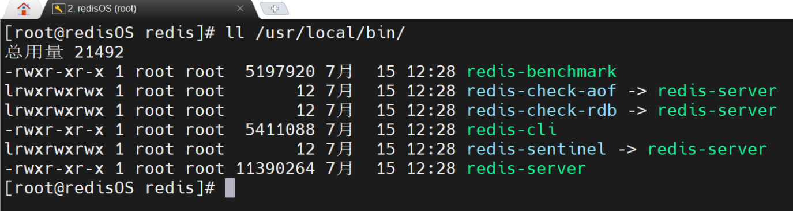
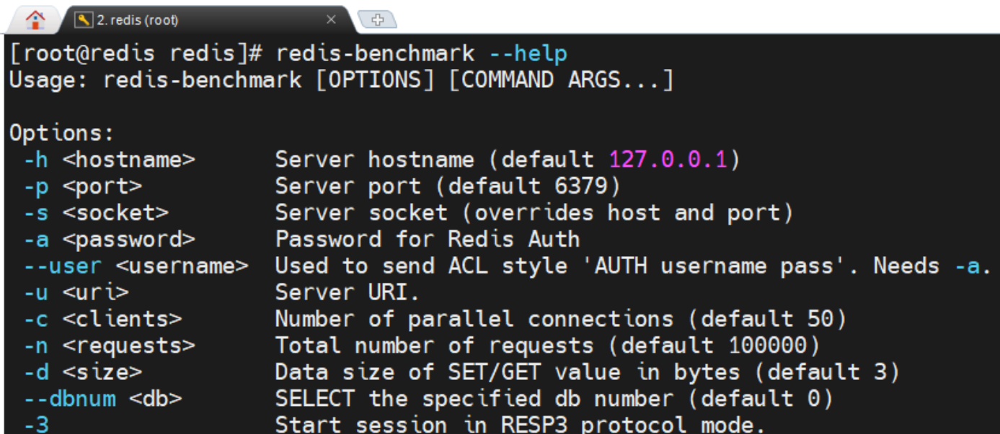
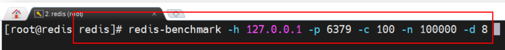
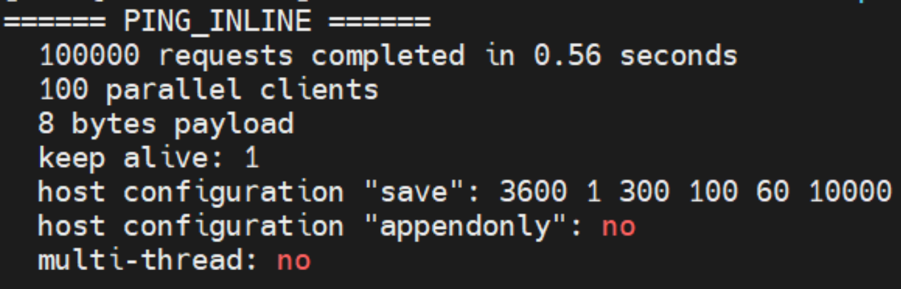
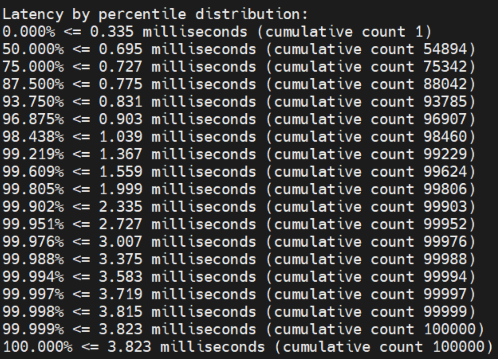
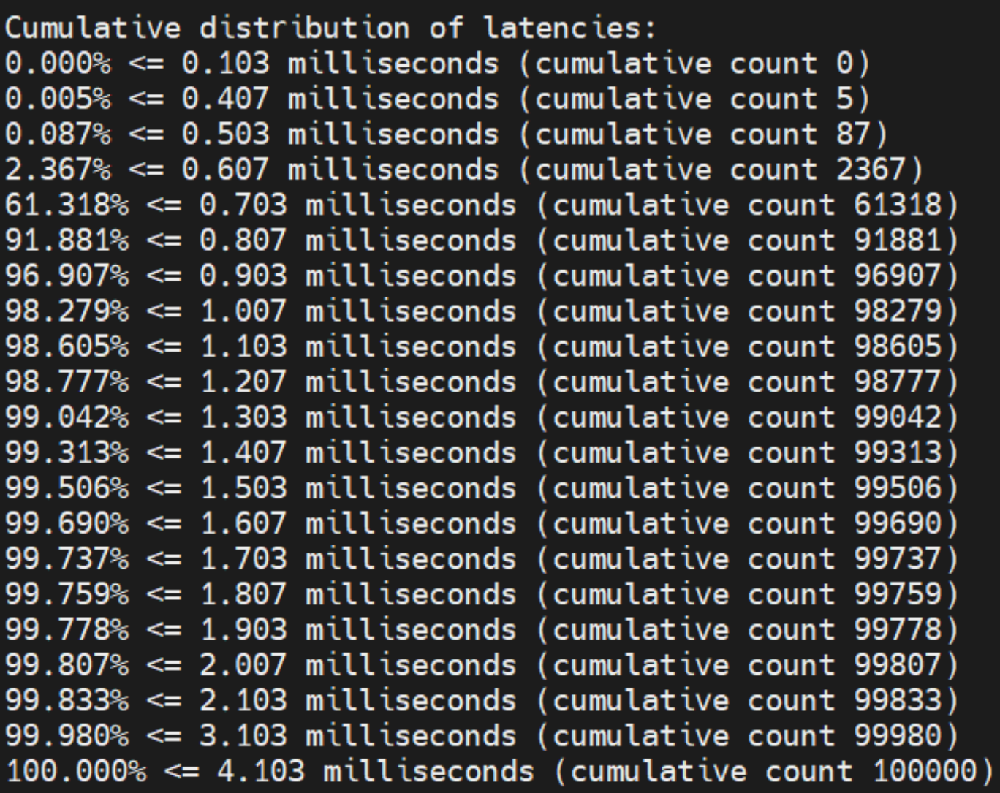
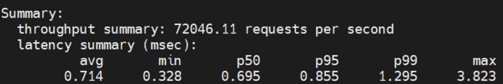
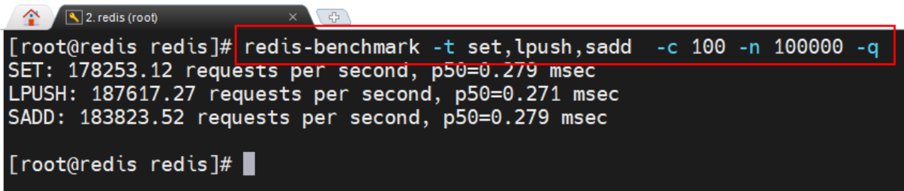

## 一、简介

​	在Redis安装完毕后会自动安装一个redis-benchmark测试工具，其是一个压力测试工具，用于测试 Redis 的性能。

​	通过 redis-benchmark –help 命令可以查看到其用法：

其选项 options 非常多，下面通过例子来学习常用的 options 的用法

## 二、测试一

### 2.1 命令解析

以上命令中选项的意义：

- -h：指定要测试的 Redis 的 IP，若为本机，则可省略
- -p：指定要测试的 Redis 的 port，若为 6379，则可省略
- -c：指定模拟客户端的数量，默认值为 50
- -n：指定这些客户端发出的请求的总量，默认值为 100000
- -d：指定测试 get/set 命令时其操作的 value 的数据长度，单位字节，默认值为 3。在测试其它命令时该指定没有用处。

以上命令的意义是，使用 100 个客户端连接该 Redis，这些客户端总共会发起 100000个请求，set/get 的 value 为 8 字节数据。

### 2.2 测试结果分析

该命令会**逐个测试所有 Redis 命令**，**每个命令都会给出一份测试报**告，**每个测试报告由四部分构成**：

#### 2.2.1 测试环境报告

首先就是测试环境：

#### 2.2.2 延迟百分比分布

这是按照百分比进行的统计报告：每完成一次**剩余测试量的 50%**就给出一个统计数据。

#### 2.2.3  延迟的累积分布

这是按照时间间隔统计的报告：基本是**每 0.1 毫秒统计一次完成的百分比情况**。

#### 2.2.4 总述报告

​	这是总述性报告：给出单位时间（1s）完成测试的数据量；下方的列表分别表示每条数据的平均耗时、最短耗时、完成50%数据量时每天数据的平均耗时、95%的平均耗时、99%的平均耗时、100%的平均耗时、最长耗时。

## 三、测试二

以上命令中选项的意义：

- -t：**指定要测试的命令**，多个命令使用逗号分隔，不能有空格
- -q：指定**仅给出总述性报告**