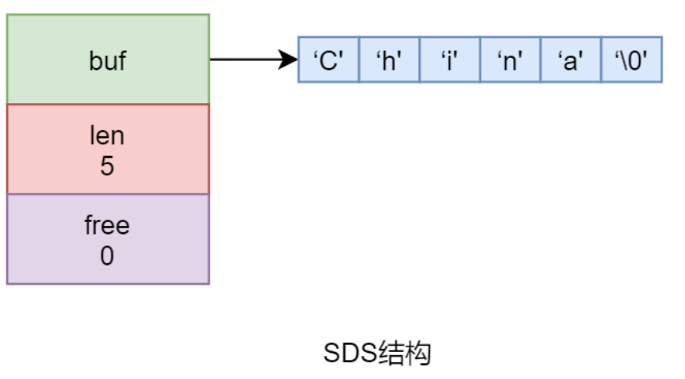
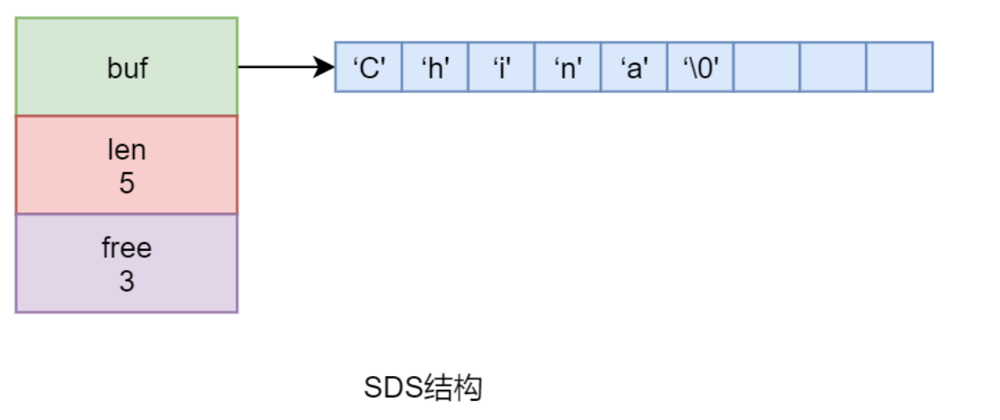
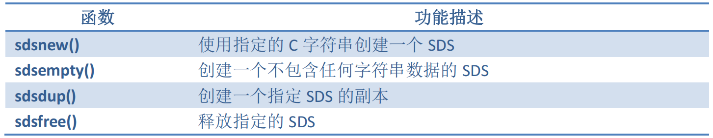
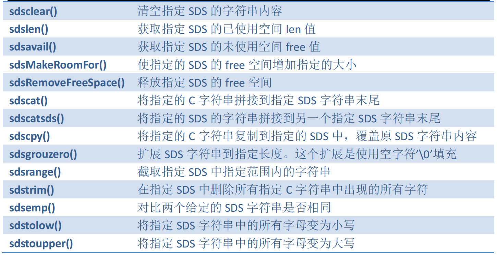

## 一、SDS简介

​	无论是 Redis 的 Key 还是 Value，其**基础数据类型都是字符串**。例如，Hash 型 Value 的field 与 value 的类型、List 型、Set 型、ZSet 型 Value 的元素的类型等都是字符串。

​	虽然 Redis是使用标准 C 语言开发的，但并**没有直接使用 C 语言中传统的字符串表示，而是自定义了一种字符串**。这种字符串本身的结构比较简单，但功能却非常强大，称为**简单动态字符串**，Simple Dynamic String，**简称 SDS**。注意，**Redis 中的所有字符串并不都是 SDS，也会出现 C 字符串**。**C 字符串只会出现在字符串“字面常量”中**，并且该字符串不可能发生变更。

redisLog(REDIS_WARNNING, “sdfsfsafsafds”);

## 二、SDS 结构

​	SDS 不同于 C 字符串。C 字符串本身是一个以双引号括起来，以空字符’\0’结尾的字符序列。但 **SDS 是一个结构体，定义在 Redis 安装目录下的 src/sds.h 中**：

```c
struct sdshdr {
    // 字节数组，用于保存字符串
    char buf[];
    // buf[]中已使用字节数量，称为 SDS 的长度
    int len;
    // buf[]中尚未使用的字节数量
    int free;
}
```

​	例如执行 SET country “China”命令时，**键 country** 与**值”China”**都是 SDS 类型的，只不过**一个是 SDS 的变量**，**一个是 SDS 的字面常量**。”China”在内存中的结构如下：



​	通过以上结构可以看出，**SDS 的 buf 值实际是一个 C 字符串**，包含空字符’\0’共占 6 个字节。但 **SDS 的 len 是不包含空字符’\0’的**。



​	该结构与前面不同的是，这里有 3 字节未使用空间。**具体为一个SDS字符串分配多大的未使用空间，也是有说法的。**

## 三、SDS 的优势

​	C 字符串使用 Len+1 长度的字符数组来表示实际长度为 Len 的字符串，字符数组最后以空字符’\0’结尾，表示字符串结束。这种结构简单，但不能满足 Redis 对字符串功能性、安全性及高效性等的要求。

### 3.1 防止字符串长度获取性能瓶颈

​	对于 **C 字符串，若要获取其长度，则必须要通过遍历整个字符串才可获取到的**。对于**超长字符串的遍历，会成为系统的性能瓶颈**。

​	但是，由于 **SDS 结构体中直接就存放着字符串的长度数据**，所以对于获取字符串长度需要消耗的系统性能，与字符串本身长度是无关的，不会成为 Redis 的性能瓶颈。

**SDS 获取字符串长度的时间复杂度是 O(1)**

### 3.2  保障二进制安全	

​	C 字符串中只能包含符合某种编码格式的字符，例如 ASCII、UTF-8 等，并且**除了字符串末尾外，其它位置是不能包含空字符’\0’的**，**否则该字符串就会被程序误解为提前结束**。而在**图片、音频、视频、压缩文件、office 文件等二进制数据中以空字符’\0’作为分隔符的情况是很常见的**。故而在 C 字符串中是不能保存像图片、音频、视频、压缩文件、office 文件等二进制数据的。

​	但 **SDS 不是以空字符’\0’作为字符串结束标志的，其是通过 len 属性来判断字符串是否结束的**。所以，对于程序处理 SDS 中的字符串数据，无需对数据做任何限制、过滤、假设，只需读取即可。数据写入的是什么，读到的就是什么。

**SDS 不仅可以保存文本数据，还可以保存二进制数据**

### 3.3  减少内存再分配次数

​	SDS 采用了**空间预分配策略**与**惰性空间释放策略**来避免内存再分配问题。

​	空间预分配策略是指，每次 SDS **由于空间不够需要进行空间扩展**时，程序**不但为其分配所需的空间**，**还会为其分配额外的未使用空间**，以减少内存再分配次数。而额外分配的**未使用空间大小取决于空间扩展后 SDS 的 len 属性值**。

- 如果 **len 属性值小于 1M**，那么分配的**未使用空间 free 的大小与 len 属性值相同**。
- 如果 **len 属性值大于等于 1M** ，那么分配的**未使用空间 free** 的大小**固定是 1M**。

​	SDS 对于空间释放采用的是惰性空间释放策略。该策略是指，**SDS 字符串长度如果缩短，那么多出的未使用空间将暂时不释放，而是增加到 free 中**。以使后期扩展 SDS 时减少内存再分配次数。

​	如果要释放 SDS 的未使用空间，则可通过 sdsRemoveFreeSpace()函数来释放。

### 3.4  兼容 C 函数

​	Redis 中提供了很多的 SDS 的 API，以方便用户对 Redis 进行二次开发。**为了能够兼容 C函数，SDS 的底层数组 buf[]中的字符串仍以空字符’\0’结尾。**

​	现在要比较的双方，一个是 SDS，一个是 C 字符串，此时可以通过 C 语言函数： strcmp(sds_str->buf，c_str)

## 四、常用的 SDS 操作函数

​	下表列出了一些常用的 SDS 操作函数及其功能描述。可以使用这些函数对redis进行二次开发。



